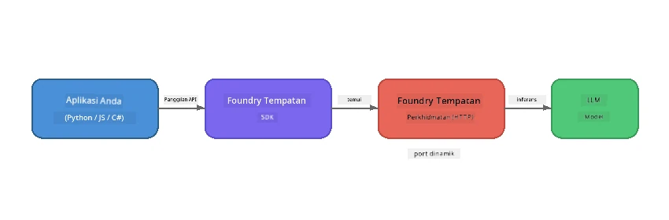

# Bahagian 1: Memulakan dengan Foundry Local


## Apakah Foundry Local?

[Foundry Local](https://foundrylocal.ai) membolehkan anda menjalankan model bahasa AI sumber terbuka **terus pada komputer anda** - tidak memerlukan internet, tiada kos awan, dan privasi data penuh. Ia:

- **Muat turun dan jalankan model secara tempatan** dengan pengoptimuman perkakasan automatik (GPU, CPU, atau NPU)
- **Menyediakan API yang serasi dengan OpenAI** supaya anda boleh menggunakan SDK dan alat yang biasa
- **Tidak memerlukan langganan Azure** atau pendaftaran - hanya pasang dan mula bina

Fikirkan ia seperti mempunyai AI peribadi yang berjalan sepenuhnya pada mesin anda.

## Objektif Pembelajaran

Menjelang akhir makmal ini anda akan dapat:

- Pasang Foundry Local CLI pada sistem pengendalian anda
- Faham apa itu alias model dan bagaimana ia berfungsi
- Muat turun dan jalankan model AI tempatan pertama anda
- Hantar mesej sembang ke model tempatan dari baris perintah
- Faham perbezaan antara model AI tempatan dan yang dihoskan di awan

---

## Prasyarat

### Keperluan Sistem

| Keperluan | Minimum | Disyorkan |
|-------------|---------|-------------|
| **RAM** | 8 GB | 16 GB |
| **Ruang Cakera** | 5 GB (untuk model) | 10 GB |
| **CPU** | 4 teras | 8+ teras |
| **GPU** | Pilihan | NVIDIA dengan CUDA 11.8+ |
| **OS** | Windows 10/11 (x64/ARM), Windows Server 2025, macOS 13+ | - |

> **Nota:** Foundry Local secara automatik memilih varian model terbaik untuk perkakasan anda. Jika anda mempunyai GPU NVIDIA, ia menggunakan pecutan CUDA. Jika anda mempunyai NPU Qualcomm, ia menggunakannya. Jika tidak, ia kembali ke varian CPU yang dioptimumkan.

### Pasang Foundry Local CLI

**Windows** (PowerShell):
```powershell
winget install Microsoft.FoundryLocal
```

**macOS** (Homebrew):
```bash
brew tap microsoft/foundrylocal
brew install foundrylocal
```

> **Nota:** Foundry Local kini hanya menyokong Windows dan macOS. Linux tidak disokong pada masa ini.

Sahkan pemasangan:
```bash
foundry --version
```

---

## Latihan Makmal

### Latihan 1: Terokai Model yang Tersedia

Foundry Local termasuk katalog model sumber terbuka yang telah dioptimumkan pra. Senaraikan mereka:

```bash
foundry model list
```

Anda akan melihat model seperti:
- `phi-3.5-mini` - model 3.8B parameter Microsoft (pantas, kualiti baik)
- `phi-4-mini` - model Phi yang lebih baru dan berupaya
- `phi-4-mini-reasoning` - model Phi dengan pemikiran rantai (`<think>` tag)
- `phi-4` - model Phi terbesar Microsoft (10.4 GB)
- `qwen2.5-0.5b` - sangat kecil dan pantas (baik untuk peranti sumber rendah)
- `qwen2.5-7b` - model am pelbagai guna yang kuat dengan sokongan panggilan alat
- `qwen2.5-coder-7b` - dioptimumkan untuk penjanaan kod
- `deepseek-r1-7b` - model pemikiran yang kuat
- `gpt-oss-20b` - model sumber terbuka besar (lesen MIT, 12.5 GB)
- `whisper-base` - transkripsi suara-ke-teks (383 MB)
- `whisper-large-v3-turbo` - transkripsi ketepatan tinggi (9 GB)

> **Apa itu alias model?** Alias seperti `phi-3.5-mini` adalah pintasan. Apabila anda menggunakan alias, Foundry Local secara automatik memuat turun varian terbaik untuk perkakasan khusus anda (CUDA untuk GPU NVIDIA, dioptimumkan CPU sebaliknya). Anda tidak perlu risau memilih varian yang betul.

### Latihan 2: Jalankan Model Pertama Anda

Muat turun dan mulakan bersembang dengan model secara interaktif:

```bash
foundry model run phi-3.5-mini
```

Kali pertama anda menjalankan ini, Foundry Local akan:
1. Mengesan perkakasan anda
2. Memuat turun varian model optimum (ini mungkin mengambil masa beberapa minit)
3. Memuatkan model ke dalam ingatan
4. Memulakan sesi sembang interaktif

Cuba tanya beberapa soalan:
```
You: What is the golden ratio?
You: Can you explain it as if I were 10 years old?
You: Write a haiku about mathematics
```

Taip `exit` atau tekan `Ctrl+C` untuk keluar.

### Latihan 3: Muat Turun Model Terlebih Dahulu

Jika anda mahu memuat turun model tanpa memulakan sembang:

```bash
foundry model download phi-3.5-mini
```

Periksa model mana yang sudah dimuat turun pada mesin anda:

```bash
foundry cache list
```

### Latihan 4: Fahami Seni Bina

Foundry Local berjalan sebagai **perkhidmatan HTTP tempatan** yang mendedahkan API REST yang serasi dengan OpenAI. Ini bermakna:

1. Perkhidmatan bermula pada **port dinamik** (port yang berbeza setiap kali)
2. Anda menggunakan SDK untuk mencari URL titik akhir sebenar
3. Anda boleh menggunakan **mana-mana** perpustakaan pelanggan yang serasi dengan OpenAI untuk berkomunikasi dengannya



> **Penting:** Foundry Local menetapkan **port dinamik** setiap kali ia bermula. Jangan sekali-kali menetapkan nombor port secara keras seperti `localhost:5272`. Sentiasa gunakan SDK untuk mencari URL semasa (contoh `manager.endpoint` dalam Python atau `manager.urls[0]` dalam JavaScript).

---

## Perkara Utama yang Perlu Diambil

| Konsep | Apa Yang Anda Pelajari |
|---------|------------------|
| AI pada peranti | Foundry Local menjalankan model sepenuhnya pada peranti anda tanpa awan, kunci API, atau kos |
| Alias model | Alias seperti `phi-3.5-mini` memilih varian terbaik secara automatik untuk perkakasan anda |
| Port dinamik | Perkhidmatan berjalan pada port dinamik; sentiasa gunakan SDK untuk mencari titik akhir |
| CLI dan SDK | Anda boleh berinteraksi dengan model melalui CLI (`foundry model run`) atau secara programatik melalui SDK |

---

## Langkah Seterusnya

Teruskan ke [Bahagian 2: Kajian Mendalam Foundry Local SDK](part2-foundry-local-sdk.md) untuk menguasai API SDK dalam mengurus model, perkhidmatan, dan caching secara programatik.

---

<!-- CO-OP TRANSLATOR DISCLAIMER START -->
**Penafian**:  
Dokumen ini telah diterjemahkan menggunakan perkhidmatan terjemahan AI [Co-op Translator](https://github.com/Azure/co-op-translator). Walaupun kami berusaha untuk ketepatan, sila maklum bahawa terjemahan automatik mungkin mengandungi kesilapan atau ketidaktepatan. Dokumen asal dalam bahasa asalnya harus dianggap sebagai sumber yang sahih. Untuk maklumat kritikal, terjemahan profesional oleh manusia adalah disyorkan. Kami tidak bertanggungjawab atas sebarang salah faham atau salah tafsir yang timbul daripada penggunaan terjemahan ini.
<!-- CO-OP TRANSLATOR DISCLAIMER END -->