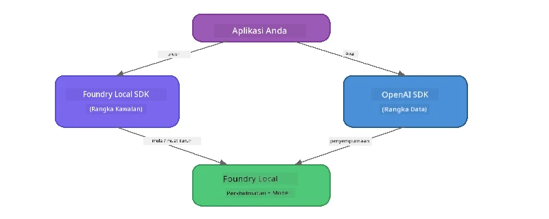

# Bahagian 3: Menggunakan Foundry Local SDK dengan OpenAI

## Gambaran Keseluruhan

Dalam Bahagian 1 anda menggunakan Foundry Local CLI untuk menjalankan model secara interaktif. Dalam Bahagian 2 anda meneroka keseluruhan permukaan API SDK. Kini anda akan belajar untuk **mengintegrasikan Foundry Local ke dalam aplikasi anda** menggunakan SDK dan API yang serasi dengan OpenAI.

Foundry Local menyediakan SDK untuk tiga bahasa. Pilih yang paling anda selesa - konsepnya sama di ketiga-tiga bahasa.

## Objektif Pembelajaran

Menjelang akhir makmal ini anda akan dapat:

- Pasang Foundry Local SDK untuk bahasa anda (Python, JavaScript, atau C#)
- Mula `FoundryLocalManager` untuk memulakan perkhidmatan, semak cache, muat turun, dan muatkan model
- Sambungkan kepada model tempatan menggunakan SDK OpenAI
- Hantar chat completion dan kendalikan respons streaming
- Fahami seni bina port dinamik

---

## Prasyarat

Selesaikan [Bahagian 1: Mula dengan Foundry Local](part1-getting-started.md) dan [Bahagian 2: Penyelaman Mendalam SDK Foundry Local](part2-foundry-local-sdk.md) terlebih dahulu.

Pasang **satu** di antara runtime bahasa berikut:
- **Python 3.9+** - [python.org/downloads](https://www.python.org/downloads/)
- **Node.js 18+** - [nodejs.org](https://nodejs.org/)
- **.NET 9.0+** - [dot.net/download](https://dotnet.microsoft.com/download)

---

## Konsep: Bagaimana SDK Berfungsi

Foundry Local SDK menguruskan **pesawat kawalan** (memulakan perkhidmatan, memuat turun model), manakala SDK OpenAI mengendalikan **pesawat data** (menghantar permintaan, menerima jawapan).



---

## Latihan Makmal

### Latihan 1: Sediakan Persekitaran Anda

<details>
<summary><b>🐍 Python</b></summary>

```bash
cd python
python -m venv venv

# Aktifkan persekitaran maya:
# Windows (PowerShell):
venv\Scripts\Activate.ps1
# Windows (Command Prompt):
venv\Scripts\activate.bat
# macOS:
source venv/bin/activate

pip install -r requirements.txt
```

Fail `requirements.txt` memasang:
- `foundry-local-sdk` - Foundry Local SDK (diimport sebagai `foundry_local`)
- `openai` - SDK OpenAI untuk Python
- `agent-framework` - Microsoft Agent Framework (digunakan dalam bahagian berikut)

</details>

<details>
<summary><b>📘 JavaScript</b></summary>

```bash
cd javascript
npm install
```

Fail `package.json` memasang:
- `foundry-local-sdk` - Foundry Local SDK
- `openai` - SDK OpenAI untuk Node.js

</details>

<details>
<summary><b>💜 C#</b></summary>

```bash
cd csharp
dotnet restore
dotnet build
```

Fail `csharp.csproj` menggunakan:
- `Microsoft.AI.Foundry.Local` - Foundry Local SDK (NuGet)
- `OpenAI` - SDK OpenAI untuk C# (NuGet)

> **Struktur projek:** Projek C# menggunakan router command-line dalam `Program.cs` yang mengarahkan kepada fail contoh berasingan. Jalankan `dotnet run chat` (atau hanya `dotnet run`) untuk bahagian ini. Bahagian lain menggunakan `dotnet run rag`, `dotnet run agent`, dan `dotnet run multi`.

</details>

---

### Latihan 2: Penyempurnaan Chat Asas

Buka contoh chat asas untuk bahasa anda dan periksa kodnya. Setiap skrip mengikuti corak tiga langkah yang sama:

1. **Mula perkhidmatan** - `FoundryLocalManager` memulakan runtime Foundry Local
2. **Muat turun dan muatkan model** - periksa cache, muat turun jika perlu, kemudian muatkan ke dalam memori
3. **Cipta klien OpenAI** - sambungkan ke endpoint tempatan dan hantar chat completion streaming

<details>
<summary><b>🐍 Python - <code>python/foundry-local.py</code></b></summary>

```python
import sys
import openai
from foundry_local import FoundryLocalManager

alias = "phi-3.5-mini"

# Langkah 1: Cipta FoundryLocalManager dan mulakan perkhidmatan
print("Starting Foundry Local service...")
manager = FoundryLocalManager()
manager.start_service()

# Langkah 2: Semak jika model sudah dimuat turun
cached = manager.list_cached_models()
catalog_info = manager.get_model_info(alias)
is_cached = any(m.id == catalog_info.id for m in cached) if catalog_info else False

if is_cached:
    print(f"Model already downloaded: {alias}")
else:
    print(f"Downloading model: {alias} (this may take several minutes)...")
    manager.download_model(alias)
    print(f"Download complete: {alias}")

# Langkah 3: Muatkan model ke dalam memori
print(f"Loading model: {alias}...")
manager.load_model(alias)

# Cipta klien OpenAI yang menunjuk ke perkhidmatan Foundry TEMPATAN
client = openai.OpenAI(
    base_url=manager.endpoint,   # Port dinamik - jangan sesekali tetapkan secara kekal!
    api_key=manager.api_key
)

# Jana penyempurnaan sembang penstriman
stream = client.chat.completions.create(
    model=manager.get_model_info(alias).id,
    messages=[{"role": "user", "content": "What is the golden ratio?"}],
    stream=True,
)

for chunk in stream:
    if chunk.choices[0].delta.content is not None:
        print(chunk.choices[0].delta.content, end="", flush=True)
print()
```

**Jalankan:**
```bash
python foundry-local.py
```

</details>

<details>
<summary><b>📘 JavaScript - <code>javascript/foundry-local.mjs</code></b></summary>

```javascript
import { OpenAI } from "openai";
import { FoundryLocalManager } from "foundry-local-sdk";

const alias = "phi-3.5-mini";

// Langkah 1: Mulakan perkhidmatan Foundry Tempatan
console.log("Starting Foundry Local service...");
FoundryLocalManager.create({ appName: "FoundryLocalWorkshop" });
const manager = FoundryLocalManager.instance;
await manager.startWebService();

// Langkah 2: Semak jika model sudah dimuat turun
const catalog = manager.catalog;
const model = await catalog.getModel(alias);

if (model.isCached) {
  console.log(`Model already downloaded: ${alias}`);
} else {
  console.log(`Downloading model: ${alias} (this may take several minutes)...`);
  await model.download();
  console.log(`Download complete: ${alias}`);
}

// Langkah 3: Muatkan model ke dalam memori
console.log(`Loading model: ${alias}...`);
await model.load();
console.log(`Model loaded: ${model.id}`);

// Cipta klien OpenAI yang menunjuk ke perkhidmatan Foundry TEMPATAN
const client = new OpenAI({
  baseURL: manager.urls[0] + "/v1",   // Port dinamik - jangan sesekali tetapkan secara keras!
  apiKey: "foundry-local",
});

// Jana penyempurnaan sembang aliran data
const stream = await client.chat.completions.create({
  model: model.id,
  messages: [{ role: "user", content: "What is the golden ratio?" }],
  stream: true,
});

for await (const chunk of stream) {
  if (chunk.choices[0]?.delta?.content) {
    process.stdout.write(chunk.choices[0].delta.content);
  }
}
console.log();
```

**Jalankan:**
```bash
node foundry-local.mjs
```

</details>

<details>
<summary><b>💜 C# - <code>csharp/BasicChat.cs</code></b></summary>

```csharp
using Microsoft.AI.Foundry.Local;
using Microsoft.Extensions.Logging.Abstractions;
using OpenAI;
using OpenAI.Chat;
using System.ClientModel;

var alias = "phi-3.5-mini";

// Step 1: Start the Foundry Local service
Console.WriteLine("Starting Foundry Local service...");
await FoundryLocalManager.CreateAsync(
    new Configuration
    {
        AppName = "FoundryLocalSamples",
        Web = new Configuration.WebService { Urls = "http://127.0.0.1:0" }
    }, NullLogger.Instance, default);
var manager = FoundryLocalManager.Instance;
await manager.StartWebServiceAsync(default);

// Step 2: Get the model from the catalog
var catalog = await manager.GetCatalogAsync(default);
var model = await catalog.GetModelAsync(alias, default);

// Step 3: Check if the model is already downloaded
var isCached = await model.IsCachedAsync(default);

if (isCached)
{
    Console.WriteLine($"Model already downloaded: {alias}");
}
else
{
    Console.WriteLine($"Downloading model: {alias} (this may take several minutes)...");
    await model.DownloadAsync(null, default);
    Console.WriteLine($"Download complete: {alias}");
}

// Step 4: Load the model into memory
Console.WriteLine($"Loading model: {alias}...");
await model.LoadAsync(default);
Console.WriteLine($"Loaded model: {model.Id}");
Console.WriteLine($"Endpoint: {manager.Urls[0]}");

// Create OpenAI client pointing to the LOCAL Foundry service
var key = new ApiKeyCredential("foundry-local");
var client = new OpenAIClient(key, new OpenAIClientOptions
{
    Endpoint = new Uri(manager.Urls[0] + "/v1")  // Dynamic port - never hardcode!
});

var chatClient = client.GetChatClient(model.Id);

// Stream a chat completion
var completionUpdates = chatClient.CompleteChatStreaming("What is the golden ratio?");

foreach (var update in completionUpdates)
{
    if (update.ContentUpdate.Count > 0)
    {
        Console.Write(update.ContentUpdate[0].Text);
    }
}
Console.WriteLine();
```

**Jalankan:**
```bash
dotnet run chat
```

</details>

---

### Latihan 3: Bereksperimen dengan Prompt

Setelah contoh asas anda berjalan, cuba ubah kod:

1. **Tukar mesej pengguna** - cuba soalan yang berbeza
2. **Tambah prompt sistem** - berikan model persona
3. **Matikan streaming** - tetapkan `stream=False` dan cetak respons penuh sekaligus
4. **Cuba model lain** - tukar alias dari `phi-3.5-mini` ke model lain dari `foundry model list`

<details>
<summary><b>🐍 Python</b></summary>

```python
# Tambah arahan sistem - berikan model satu persona:
stream = client.chat.completions.create(
    model=manager.get_model_info(alias).id,
    messages=[
        {"role": "system", "content": "You are a pirate. Answer everything in pirate speak."},
        {"role": "user", "content": "What is the golden ratio?"}
    ],
    stream=True,
)

# Atau matikan penstriman:
response = client.chat.completions.create(
    model=manager.get_model_info(alias).id,
    messages=[{"role": "user", "content": "What is the golden ratio?"}],
    stream=False,
)
print(response.choices[0].message.content)
```

</details>

<details>
<summary><b>📘 JavaScript</b></summary>

```javascript
// Tambah arahan sistem - berikan model satu persona:
const stream = await client.chat.completions.create({
  model: modelInfo.id,
  messages: [
    { role: "system", content: "You are a pirate. Answer everything in pirate speak." },
    { role: "user", content: "What is the golden ratio?" },
  ],
  stream: true,
});

// Atau matikan penstriman:
const response = await client.chat.completions.create({
  model: modelInfo.id,
  messages: [{ role: "user", content: "What is the golden ratio?" }],
  stream: false,
});
console.log(response.choices[0].message.content);
```

</details>

<details>
<summary><b>💜 C#</b></summary>

```csharp
// Add a system prompt - give the model a persona:
var completionUpdates = chatClient.CompleteChatStreaming(
    new ChatMessage[]
    {
        new SystemChatMessage("You are a pirate. Answer everything in pirate speak."),
        new UserChatMessage("What is the golden ratio?")
    }
);

// Or turn off streaming:
var response = chatClient.CompleteChat("What is the golden ratio?");
Console.WriteLine(response.Value.Content[0].Text);
```

</details>

---

### Rujukan Kaedah SDK

<details>
<summary><b>🐍 Kaedah SDK Python</b></summary>

| Kaedah | Tujuan |
|--------|---------|
| `FoundryLocalManager()` | Cipta instans pengurus |
| `manager.start_service()` | Mulakan perkhidmatan Foundry Local |
| `manager.list_cached_models()` | Senaraikan model yang dimuat turun pada peranti anda |
| `manager.get_model_info(alias)` | Dapatkan ID dan metadata model |
| `manager.download_model(alias, progress_callback=fn)` | Muat turun model dengan callback kemajuan pilihan |
| `manager.load_model(alias)` | Muatkan model ke dalam memori |
| `manager.endpoint` | Dapatkan URL endpoint dinamik |
| `manager.api_key` | Dapatkan kunci API (tempat letak untuk tempatan) |

</details>

<details>
<summary><b>📘 Kaedah SDK JavaScript</b></summary>

| Kaedah | Tujuan |
|--------|---------|
| `FoundryLocalManager.create({ appName })` | Cipta instans pengurus |
| `FoundryLocalManager.instance` | Akses pengurus singleton |
| `await manager.startWebService()` | Mulakan perkhidmatan Foundry Local |
| `await manager.catalog.getModel(alias)` | Dapatkan model dari katalog |
| `model.isCached` | Semak sama ada model sudah dimuat turun |
| `await model.download()` | Muat turun model |
| `await model.load()` | Muatkan model ke memori |
| `model.id` | Dapatkan ID model untuk panggilan API OpenAI |
| `manager.urls[0] + "/v1"` | Dapatkan URL endpoint dinamik |
| `"foundry-local"` | Kunci API (tempat letak untuk tempatan) |

</details>

<details>
<summary><b>💜 Kaedah SDK C#</b></summary>

| Kaedah | Tujuan |
|--------|---------|
| `FoundryLocalManager.CreateAsync(config)` | Cipta dan inisialisasi pengurus |
| `manager.StartWebServiceAsync()` | Mulakan perkhidmatan web Foundry Local |
| `manager.GetCatalogAsync()` | Dapatkan katalog model |
| `catalog.ListModelsAsync()` | Senaraikan semua model tersedia |
| `catalog.GetModelAsync(alias)` | Dapatkan model tertentu mengikut alias |
| `model.IsCachedAsync()` | Semak sama ada model telah dimuat turun |
| `model.DownloadAsync()` | Muat turun model |
| `model.LoadAsync()` | Muatkan model ke dalam memori |
| `manager.Urls[0]` | Dapatkan URL endpoint dinamik |
| `new ApiKeyCredential("foundry-local")` | Kredensial kunci API untuk tempatan |

</details>

---

### Latihan 4: Menggunakan Native ChatClient (Alternatif kepada SDK OpenAI)

Dalam Latihan 2 dan 3 anda menggunakan SDK OpenAI untuk chat completions. SDK JavaScript dan C# juga menyediakan **ChatClient asli** yang menghapuskan keperluan SDK OpenAI sepenuhnya.

<details>
<summary><b>📘 JavaScript - <code>model.createChatClient()</code></b></summary>

```javascript
import { FoundryLocalManager } from "foundry-local-sdk";

const alias = "phi-3.5-mini";

FoundryLocalManager.create({ appName: "ChatClientDemo" });
const manager = FoundryLocalManager.instance;
await manager.startWebService();

const model = await manager.catalog.getModel(alias);
if (!model.isCached) await model.download();
await model.load();

// Tiada import OpenAI diperlukan — dapatkan klien terus dari model
const chatClient = model.createChatClient();

// Penyempurnaan tanpa penstriman
const response = await chatClient.completeChat([
  { role: "system", content: "You are a pirate. Answer everything in pirate speak." },
  { role: "user", content: "What is the golden ratio?" }
]);
console.log(response.choices[0].message.content);

// Penyempurnaan berpenstriman (menggunakan corak panggilan balik)
await chatClient.completeStreamingChat(
  [{ role: "user", content: "What is the golden ratio?" }],
  (chunk) => {
    if (chunk.choices?.[0]?.delta?.content) {
      process.stdout.write(chunk.choices[0].delta.content);
    }
  }
);
console.log();
```

> **Nota:** `completeStreamingChat()` pada ChatClient menggunakan corak **callback**, bukan iterator async. Serahkan fungsi sebagai argumen kedua.

</details>

<details>
<summary><b>💜 C# - <code>model.GetChatClientAsync()</code></b></summary>

```csharp
var catalog = await manager.GetCatalogAsync(default);
var model = await catalog.GetModelAsync("phi-3.5-mini", default);
if (!await model.IsCachedAsync(default))
    await model.DownloadAsync(null, default);
await model.LoadAsync(default);

// No OpenAI NuGet needed — get a client directly from the model
var chatClient = await model.GetChatClientAsync(default);

// Use it like a standard OpenAI ChatClient
var response = chatClient.CompleteChat("What is the golden ratio?");
Console.WriteLine(response.Value.Content[0].Text);
```

</details>

> **Bila menggunakan yang mana:**
> | Pendekatan | Sesuai untuk |
> |----------|--------------|
> | SDK OpenAI | Kawalan parameter penuh, aplikasi produksi, kod OpenAI sedia ada |
> | ChatClient Asli | Prototip pantas, kurang pergantungan, persediaan lebih mudah |

---

## Perkara Penting

| Konsep | Apa Yang Anda Pelajari |
|---------|------------------------|
| Pesawat kawalan | Foundry Local SDK menguruskan memulakan perkhidmatan dan memuatkan model |
| Pesawat data | SDK OpenAI mengendalikan chat completion dan streaming |
| Port dinamik | Sentiasa gunakan SDK untuk mencari endpoint; jangan kod keras URL |
| Merentas bahasa | Corak kod yang sama berfungsi di Python, JavaScript, dan C# |
| Keserasian OpenAI | Keserasian penuh API OpenAI bermakna kod OpenAI sedia ada berfungsi dengan sedikit perubahan |
| ChatClient Asli | `createChatClient()` (JS) / `GetChatClientAsync()` (C#) menyediakan alternatif kepada SDK OpenAI |

---

## Langkah Seterusnya

Teruskan ke [Bahagian 4: Membangun Aplikasi RAG](part4-rag-fundamentals.md) untuk belajar cara membina pipeline Retrieval-Augmented Generation yang beroperasi sepenuhnya pada peranti anda.

---

<!-- CO-OP TRANSLATOR DISCLAIMER START -->
**Penafian**:  
Dokumen ini telah diterjemahkan menggunakan perkhidmatan terjemahan AI [Co-op Translator](https://github.com/Azure/co-op-translator). Walaupun kami berusaha untuk ketepatan, sila ambil maklum bahawa terjemahan automatik mungkin mengandungi kesilapan atau ketidaktepatan. Dokumen asal dalam bahasa asalnya hendaklah dianggap sebagai sumber yang sahih. Untuk maklumat kritikal, terjemahan profesional oleh manusia adalah disyorkan. Kami tidak bertanggungjawab atas sebarang salah faham atau tafsiran yang salah yang timbul daripada penggunaan terjemahan ini.
<!-- CO-OP TRANSLATOR DISCLAIMER END -->