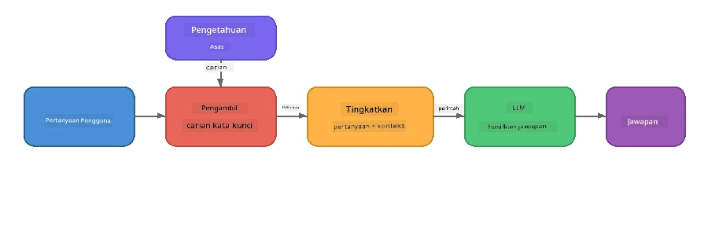

# Bahagian 4: Membina Aplikasi RAG dengan Foundry Local

## Gambaran Keseluruhan

Model Bahasa Besar sangat hebat, tetapi mereka hanya tahu apa yang terdapat dalam data latihan mereka. **Penjanaan Berpandu Pengambilan (RAG)** menyelesaikan ini dengan memberi model konteks yang relevan pada masa pertanyaan - diambil dari dokumen anda sendiri, pangkalan data, atau pangkalan ilmu.

Dalam makmal ini anda akan membina saluran RAG lengkap yang dijalankan **sepenuhnya pada peranti anda** menggunakan Foundry Local. Tiada perkhidmatan awan, tiada pangkalan data vektor, tiada API penanaman - hanya pengambilan tempatan dan model tempatan.

## Objektif Pembelajaran

Pada akhir makmal ini anda akan dapat:

- Terangkan apa itu RAG dan mengapa ia penting untuk aplikasi AI
- Bina pangkalan ilmu tempatan daripada dokumen teks
- Laksana fungsi pengambilan mudah untuk mencari konteks yang relevan
- Susun prompt sistem yang mendasarkan model pada fakta yang diambil
- Jalankan saluran Panggil → Tambah → Jana sepenuhnya dalam peranti
- Fahami pertukaran antara pengambilan kata kunci mudah dan carian vektor

---

## Prasyarat

- Selesaikan [Bahagian 3: Menggunakan Foundry Local SDK dengan OpenAI](part3-sdk-and-apis.md)
- Foundry Local CLI dipasang dan model `phi-3.5-mini` dimuat turun

---

## Konsep: Apa itu RAG?

Tanpa RAG, LLM hanya boleh menjawab dari data latihannya - yang mungkin sudah lapuk, tidak lengkap, atau tidak mengandungi maklumat peribadi anda:

```
User: "What is Zava's return policy?"
LLM:  "I do not have information about Zava's return policy."  ← No context!
```

Dengan RAG, anda **mengambil** dokumen yang relevan dahulu, kemudian **menambah** prompt dengan konteks itu sebelum **menghasilkan** jawapan:



Intipati utama: **model tidak perlu "tahu" jawapan; ia hanya perlu membaca dokumen yang betul.**

---

## Latihan Makmal

### Latihan 1: Fahami Pangkalan Ilmu

Buka contoh RAG untuk bahasa anda dan periksa pangkalan ilmu:

<details>
<summary><b>🐍 Python: <code>python/foundry-local-rag.py</code></b></summary>

Pangkalan ilmu adalah senarai mudah kamus dengan medan `title` dan `content`:

```python
KNOWLEDGE_BASE = [
    {
        "title": "Foundry Local Overview",
        "content": (
            "Foundry Local brings the power of Azure AI Foundry to your local "
            "device without requiring an Azure subscription..."
        ),
    },
    {
        "title": "Supported Hardware",
        "content": (
            "Foundry Local automatically selects the best model variant for "
            "your hardware. If you have an Nvidia CUDA GPU it downloads the "
            "CUDA-optimized model..."
        ),
    },
    # ... lebih banyak entri
]
```

Setiap entri mewakili "potongan" ilmu - maklumat fokus tentang satu topik.

</details>

<details>
<summary><b>📘 JavaScript: <code>javascript/foundry-local-rag.mjs</code></b></summary>

Pangkalan ilmu menggunakan struktur sama seperti array objek:

```javascript
const KNOWLEDGE_BASE = [
  {
    title: "Foundry Local Overview",
    content:
      "Foundry Local brings the power of Azure AI Foundry to your local " +
      "device without requiring an Azure subscription...",
  },
  {
    title: "Supported Hardware",
    content:
      "Foundry Local automatically selects the best model variant for " +
      "your hardware...",
  },
  // ... lebih banyak entri
];
```

</details>

<details>
<summary><b>💜 C#: <code>csharp/RagPipeline.cs</code></b></summary>

Pangkalan ilmu menggunakan senarai tuple bernama:

```csharp
private static readonly List<(string Title, string Content)> KnowledgeBase =
[
    ("Foundry Local Overview",
     "Foundry Local brings the power of Azure AI Foundry to your local " +
     "device without requiring an Azure subscription..."),

    ("Supported Hardware",
     "Foundry Local automatically selects the best model variant for " +
     "your hardware..."),

    // ... more entries
];
```

</details>

> **Dalam aplikasi sebenar**, pangkalan ilmu biasanya datang daripada fail di cakera, pangkalan data, indeks carian, atau API. Untuk makmal ini, kami gunakan senarai dalam memori untuk kemudahan.

---

### Latihan 2: Fahami Fungsi Pengambilan

Langkah pengambilan mencari potongan paling relevan untuk soalan pengguna. Contoh ini menggunakan **pertindihan kata kunci** - kira berapa banyak perkataan dalam pertanyaan juga terdapat dalam setiap potongan:

<details>
<summary><b>🐍 Python</b></summary>

```python
def retrieve(query: str, top_k: int = 2) -> list[dict]:
    """Return the top-k knowledge chunks most relevant to the query."""
    query_words = set(query.lower().split())
    scored = []
    for chunk in KNOWLEDGE_BASE:
        chunk_words = set(chunk["content"].lower().split())
        overlap = len(query_words & chunk_words)
        scored.append((overlap, chunk))
    scored.sort(key=lambda x: x[0], reverse=True)
    return [item[1] for item in scored[:top_k]]
```

</details>

<details>
<summary><b>📘 JavaScript</b></summary>

```javascript
function retrieve(query, topK = 2) {
  const queryWords = new Set(query.toLowerCase().split(/\s+/));
  const scored = KNOWLEDGE_BASE.map((chunk) => {
    const chunkWords = new Set(chunk.content.toLowerCase().split(/\s+/));
    let overlap = 0;
    for (const w of queryWords) {
      if (chunkWords.has(w)) overlap++;
    }
    return { overlap, chunk };
  });
  scored.sort((a, b) => b.overlap - a.overlap);
  return scored.slice(0, topK).map((s) => s.chunk);
}
```

</details>

<details>
<summary><b>💜 C#</b></summary>

```csharp
private static List<(string Title, string Content)> Retrieve(string query, int topK = 2)
{
    var queryWords = new HashSet<string>(
        query.ToLowerInvariant().Split(' ', StringSplitOptions.RemoveEmptyEntries));

    return KnowledgeBase
        .Select(chunk =>
        {
            var chunkWords = new HashSet<string>(
                chunk.Content.ToLowerInvariant().Split(' ', StringSplitOptions.RemoveEmptyEntries));
            var overlap = queryWords.Intersect(chunkWords).Count();
            return (Overlap: overlap, Chunk: chunk);
        })
        .OrderByDescending(x => x.Overlap)
        .Take(topK)
        .Select(x => x.Chunk)
        .ToList();
}
```

</details>

**Cara ia berfungsi:**
1. Pisahkan pertanyaan kepada perkataan individu
2. Untuk setiap potongan ilmu, kira berapa banyak perkataan pertanyaan muncul dalam potongan itu
3. Susun mengikut skor pertindihan (tertinggi dahulu)
4. Pulangkan top-k potongan paling relevan

> **Pertukaran:** Pertindihan kata kunci mudah tetapi terhad; ia tidak faham sinonim atau makna. Sistem RAG produksi biasanya menggunakan **vektor penanaman** dan **pangkalan data vektor** untuk carian semantik. Namun, pertindihan kata kunci adalah titik permulaan yang baik dan tidak memerlukan pergantungan tambahan.

---

### Latihan 3: Fahami Prompt Berpengayaan

Konteks yang diambil disuntik ke dalam **prompt sistem** sebelum dihantar ke model:

```python
system_prompt = (
    "You are a helpful assistant. Answer the user's question using ONLY "
    "the information provided in the context below. If the context does "
    "not contain enough information, say so.\n\n"
    f"Context:\n{context_text}"
)
```

Keputusan reka bentuk utama:
- **"HANYA maklumat yang diberikan"** - mengelakkan model daripada mereka fakta yang tidak ada dalam konteks
- **"Jika konteks tidak cukup, kata begitu"** - menggalakkan jawapan jujur "Saya tidak tahu"
- Konteks diletakkan dalam mesej sistem supaya ia membentuk semua jawapan

---

### Latihan 4: Jalankan Saluran RAG

Jalankan contoh lengkap:

**Python:**
```bash
cd python
python foundry-local-rag.py
```

**JavaScript:**
```bash
cd javascript
node foundry-local-rag.mjs
```

**C#:**
```bash
cd csharp
dotnet run rag
```

Anda patut nampak tiga perkara dicetak:
1. **Soalan** yang ditanya
2. **Konteks yang diambil** - potongan yang dipilih daripada pangkalan ilmu
3. **Jawapan** - dijana oleh model menggunakan hanya konteks itu

Contoh output:
```
Question: How do I install Foundry Local and what hardware does it support?

--- Retrieved Context ---
### Installation
On Windows install Foundry Local with: winget install Microsoft.FoundryLocal...

### Supported Hardware
Foundry Local automatically selects the best model variant for your hardware...
-------------------------

Answer: To install Foundry Local, you can use the following methods depending
on your operating system: On Windows, run `winget install Microsoft.FoundryLocal`.
On macOS, use `brew install microsoft/foundrylocal/foundrylocal`...
```

Perhatikan bagaimana jawapan model **berpijak** pada konteks yang diambil - ia hanya menyebut fakta dari dokumen pangkalan ilmu.

---

### Latihan 5: Eksperimen dan Kembangkan

Cubalah pengubahsuaian ini untuk memperdalam pemahaman anda:

1. **Tukar soalan** - tanya sesuatu YANG ADA dalam pangkalan ilmu berbanding sesuatu yang TIDAK ADA:
   ```python
   question = "What programming languages does Foundry Local support?"  # ← Dalam konteks
   question = "How much does Foundry Local cost?"                       # ← Tidak dalam konteks
   ```
   Adakah model betul mengatakan "Saya tidak tahu" apabila jawapan tidak dalam konteks?

2. **Tambah potongan ilmu baru** - tambah entri baru ke `KNOWLEDGE_BASE`:
   ```python
   {
       "title": "Pricing",
       "content": "Foundry Local is completely free and open source under the MIT license.",
   }
   ```
   Sekarang tanya soalan harga sekali lagi.

3. **Tukar `top_k`** - ambil lebih banyak atau kurang potongan:
   ```python
   context_chunks = retrieve(question, top_k=3)  # Lebih konteks
   context_chunks = retrieve(question, top_k=1)  # Kurang konteks
   ```
   Bagaimana kuantiti konteks mempengaruhi kualiti jawapan?

4. **Hapus arahan grounding** - tukar prompt sistem kepada hanya "Anda adalah pembantu yang membantu." dan lihat jika model mula mereka fakta.

---

## Penyelaman Mendalam: Mengoptimumkan RAG untuk Prestasi Dalam Peranti

Menjalankan RAG dalam peranti memperkenalkan kekangan yang tidak dihadapi dalam awan: RAM terhad, tiada GPU khusus (pelaksanaan CPU/NPU), dan tetingkap konteks model kecil. Keputusan reka bentuk di bawah terus menangani kekangan ini dan berdasarkan corak aplikasi RAG tempatan gaya produksi yang dibina dengan Foundry Local.

### Strategi Pecahan: Tetingkap Gelangsar Saiz Tetap

Pecahan - bagaimana anda membahagikan dokumen kepada bahagian - adalah salah satu keputusan paling berimpak dalam sistem RAG. Bagi senario dalam peranti, **tetingkap gelangsar saiz tetap dengan pertindihan** adalah titik permulaan yang disyorkan:

| Parameter | Nilai Disyorkan | Kenapa |
|-----------|-----------------|--------|
| **Saiz potongan** | ~200 token | Menjaga konteks yang diambil padat, memberi ruang dalam tetingkap konteks Phi-3.5 Mini untuk prompt sistem, sejarah perbualan, dan hasil janakuasa |
| **Pertindihan** | ~25 token (12.5%) | Mencegah kehilangan maklumat di sempadan potongan - penting untuk prosedur dan arahan langkah demi langkah |
| **Tokenisasi** | Pisah berdasarkan ruang kosong | Tiada pergantungan, tiada perpustakaan tokeniser diperlukan. Semua bajet pengiraan kekal dengan LLM |

Pertindihan berfungsi seperti tetingkap gelangsar: setiap potongan baru bermula 25 token sebelum potongan sebelumnya berakhir, jadi ayat yang melintasi sempadan potongan muncul dalam kedua-dua potongan.

> **Kenapa bukan strategi lain?**
> - **Pisah ayat** menghasilkan saiz potongan tidak menentu; beberapa prosedur keselamatan adalah ayat panjang tunggal yang tidak mudah dipisah
> - **Pisah berdasarkan bahagian** (pada tajuk `##`) menghasilkan saiz potongan sangat berbeza - ada yang terlalu kecil, ada yang terlalu besar untuk tetingkap konteks model
> - **Pecahan semantik** (pengesanan topik berdasarkan penanaman) memberi kualiti pengambilan terbaik, tetapi memerlukan model kedua dalam memori selain Phi-3.5 Mini - berisiko pada perkakasan dengan memori berkongsi 8-16 GB

### Peningkatan Pengambilan: Vektor TF-IDF

Pendekatan pertindihan kata kunci dalam makmal ini berfungsi, tetapi jika anda mahu pengambilan lebih baik tanpa menambah model penanaman, **TF-IDF (Kekerapan Terma-Kebalikan Kekerapan Dokumen)** adalah pertengahan yang sangat baik:

```
Keyword Overlap  →  TF-IDF Vectors  →  Embedding Models
    (this lab)     (lightweight upgrade)   (production)
  Simple & fast    Better ranking,         Best quality,
  No dependencies  still no ML model       requires embedding model
  ~Basic matching  ~1ms retrieval          ~100-500ms per query
```

TF-IDF menukar setiap potongan menjadi vektor bernombor berdasarkan betapa pentingnya setiap kata dalam potongan itu *berbanding semua potongan*. Pada masa pertanyaan, soalan juga vektorkan cara yang sama dan dibandingkan menggunakan persamaan kosinus. Anda boleh laksanakan ini dengan SQLite dan JavaScript/Python tulen - tiada pangkalan data vektor, tiada API penanaman.

> **Prestasi:** Persamaan kosinus TF-IDF pada potongan saiz tetap biasanya mencapai **~1ms untuk pengambilan**, berbanding ~100-500ms apabila model penanaman mengekod setiap pertanyaan. Semua 20+ dokumen boleh dipotong dan diindeks dalam kurang dari seminit.

### Mod Edge/Kompaun untuk Peranti Terhad

Apabila berjalan pada perkakasan sangat terhad (laptop lama, tablet, peranti lapangan), anda boleh kurangkan penggunaan sumber dengan mengecilkan tiga tetapan:

| Tetapan | Mod Standard | Mod Edge/Kompaun |
|---------|--------------|------------------|
| **Prompt sistem** | ~300 token | ~80 token |
| **Jumlah token output maks** | 1024 | 512 |
| **Potongan yang diambil (top-k)** | 5 | 3 |

Potongan yang diambil lebih sedikit bermakna kurang konteks untuk model proses, yang mengurangkan kelewatan dan tekanan memori. Prompt sistem yang lebih pendek membolehkan lebih banyak ruang tetingkap konteks untuk jawapan sebenar. Pertukaran ini berbaloi di peranti di mana setiap token tetingkap konteks penting.

### Model Tunggal dalam Memori

Salah satu prinsip paling penting untuk RAG dalam peranti: **pastikan hanya satu model dimuat**. Jika anda gunakan model penanaman untuk pengambilan *dan* model bahasa untuk penjanaan, anda membahagi sumber NPU/RAM terhad antara dua model. Pengambilan ringan (pertindihan kata kunci, TF-IDF) mengelakkan ini sepenuhnya:

- Tiada model penanaman bersaing dengan LLM untuk memori
- Mulakan sejuk lebih pantas - hanya satu model untuk dimuat
- Penggunaan memori boleh diramal - LLM mendapat semua sumber yang ada
- Berfungsi pada mesin dengan serendah 8 GB RAM

### SQLite sebagai Storan Vektor Tempatan

Untuk koleksi dokumen kecil hingga sederhana (ratusan hingga ribuan potongan), **SQLite cukup pantas** untuk carian persamaan kosinus brute-force dan tiada infrastruktur tambahan:

- Fail `.db` tunggal di cakera - tiada proses pelayan, tiada konfigurasi
- Disertakan dengan setiap runtime bahasa utama (Python `sqlite3`, Node.js `better-sqlite3`, .NET `Microsoft.Data.Sqlite`)
- Simpan potongan dokumen bersama vector TF-IDF mereka dalam satu jadual
- Tiada perlu Pinecone, Qdrant, Chroma, atau FAISS pada skala ini

### Ringkasan Prestasi

Pilihan reka bentuk ini digabung untuk membekalkan RAG responsif pada perkakasan pengguna:

| Metrik | Prestasi Dalam Peranti |
|--------|-----------------------|
| **Kelewatan pengambilan** | ~1ms (TF-IDF) hingga ~5ms (pertindihan kata kunci) |
| **Kelajuan pengambilan data** | 20 dokumen dipotong dan diindeks dalam < 1 saat |
| **Model dalam memori** | 1 (LLM sahaja - tiada model penanaman) |
| **Lebihan storan** | < 1 MB untuk potongan + vektor dalam SQLite |
| **Mula sejuk** | Muat model tunggal, tiada permulaan runtime penanaman |
| **Perkakasan minima** | 8 GB RAM, CPU sahaja (tiada GPU diperlukan) |

> **Bila untuk naik taraf:** Jika anda berkembang kepada ratusan dokumen panjang, jenis kandungan campuran (jadual, kod, prosa), atau perlukan kefahaman semantik pertanyaan, pertimbangkan tambah model penanaman dan tukar ke carian persamaan vektor. Bagi kebanyakan kes penggunaan dalam peranti dengan set dokumen fokus, TF-IDF + SQLite beri hasil cemerlang dengan penggunaan sumber minima.

---

## Konsep Utama

| Konsep | Penerangan |
|--------|------------|
| **Pengambilan** | Mencari dokumen relevan dari pangkalan ilmu berdasarkan pertanyaan pengguna |
| **Pengayaan** | Menyisipkan dokumen yang diambil ke dalam prompt sebagai konteks |
| **Penjanaan** | LLM menjana jawapan berpandukan konteks yang disediakan |
| **Pecahan** | Memecah dokumen besar menjadi potongan kecil dan fokus |
| **Grounding** | Mengehadkan model hanya menggunakan konteks yang diberi (mengurangkan halusinasi) |
| **Top-k** | Jumlah potongan paling relevan yang diambil |

---

## RAG dalam Produksi vs. Makmal Ini

| Aspek | Makmal Ini | Optimum Dalam Peranti | Produksi Awan |
|-------|------------|-----------------------|---------------|
| **Pangkalan ilmu** | Senarai dalam memori | Fail di cakera, SQLite | Pangkalan data, indeks carian |
| **Pengambilan** | Pertindihan kata kunci | TF-IDF + persamaan kosinus | Vektor penanaman + carian persamaan |
| **Penanaman** | Tiada diperlukan | Tiada - vektor TF-IDF | Model penanaman (tempatan atau awan) |
| **Storan vektor** | Tiada diperlukan | SQLite (fail `.db` tunggal) | FAISS, Chroma, Azure AI Search, dll. |
| **Pecahan** | Manual | Tetingkap gelangsar saiz tetap (~200 token, 25 token pertindihan) | Pecahan semantik atau rekursif |
| **Model dalam memori** | 1 (LLM) | 1 (LLM) | 2+ (penanaman + LLM) |
| **Latensi pengambilan** | ~5ms | ~1ms | ~100-500ms |
| **Skala** | 5 dokumen | Ratusan dokumen | Jutaan dokumen |

Corak yang anda pelajari di sini (mengambil, menambah, menjana) adalah sama pada mana-mana skala. Kaedah pengambilan bertambah baik, tetapi seni bina keseluruhan kekal sama. Lajur tengah menunjukkan apa yang boleh dicapai pada peranti dengan teknik ringan, sering menjadi titik terbaik untuk aplikasi tempatan di mana anda menukar skala awan untuk privasi, keupayaan luar talian, dan latensi sifar ke perkhidmatan luaran.

---

## Penjelasan Utama

| Konsep | Apa yang Anda Pelajari |
|---------|-----------------------|
| Corak RAG | Ambil + Tambah + Jana: beri model konteks yang betul dan ia boleh menjawab soalan tentang data anda |
| Pada peranti | Segala-galanya dijalankan secara tempatan tanpa API awan atau langganan pangkalan data vektor |
| Arahan penempatan | Sekatan tunda sistem adalah kritikal untuk mencegah halusinasi |
| Pertindihan kata kunci | Titik permulaan yang mudah tetapi berkesan untuk pengambilan |
| TF-IDF + SQLite | Laluan peningkatan ringan yang memastikan pengambilan bawah 1ms tanpa model penggayaan |
| Satu model dalam memori | Elakkan memuat model penggayaan bersama LLM pada perkakasan terhad |
| Saiz potongan | Lebih kurang 200 token dengan pertindihan mengimbangi ketepatan pengambilan dan kecekapan tetingkap konteks |
| Mod tepi/kompak | Gunakan potongan lebih sedikit dan tunda yang lebih pendek untuk peranti yang sangat terhad |
| Corak universa | Seni bina RAG yang sama berfungsi untuk mana-mana sumber data: dokumen, pangkalan data, API, atau wiki |

> **Ingin melihat aplikasi RAG sepenuhnya pada peranti?** Lihat [Gas Field Local RAG](https://github.com/leestott/local-rag), ejen RAG luar talian gaya produksi yang dibina dengan Foundry Local dan Phi-3.5 Mini yang mempamerkan corak pengoptimuman ini dengan set dokumen dunia sebenar.

---

## Langkah Seterusnya

Teruskan ke [Bahagian 5: Membina Ejen AI](part5-single-agents.md) untuk belajar bagaimana membina agen pintar dengan persona, arahan, dan perbualan berbilang pusingan menggunakan Rangka Kerja Ejen Microsoft.

---

<!-- CO-OP TRANSLATOR DISCLAIMER START -->
**Penafian**:  
Dokumen ini telah diterjemahkan menggunakan perkhidmatan terjemahan AI [Co-op Translator](https://github.com/Azure/co-op-translator). Walaupun kami berusaha untuk ketepatan, sila ambil maklum bahawa terjemahan automatik mungkin mengandungi kesilapan atau ketidaktepatan. Dokumen asal dalam bahasa asalnya harus dianggap sebagai sumber yang sahih. Untuk maklumat penting, disyorkan terjemahan profesional oleh manusia. Kami tidak bertanggungjawab atas sebarang salah faham atau salah tafsir yang timbul daripada penggunaan terjemahan ini.
<!-- CO-OP TRANSLATOR DISCLAIMER END -->