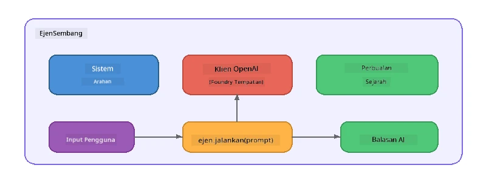

# Bahagian 5: Membina Ejen AI dengan Rangka Kerja Ejen

> **Matlamat:** Membina ejen AI pertama anda dengan arahan berterusan dan persona yang ditakrifkan, dikuasakan oleh model tempatan melalui Foundry Local.

## Apakah Ejen AI?

Ejen AI membalut model bahasa dengan **arahan sistem** yang mentakrifkan tingkah laku, personaliti, dan sekatanannya. Berbeza dengan panggilan penyelesaian sembang tunggal, ejen menyediakan:

- **Persona** - identiti yang konsisten ("Anda adalah penilai kod yang membantu")
- **Memori** - sejarah perbualan merentasi giliran
- **Pengkhususan** - tingkah laku fokus yang dipandu oleh arahan yang direka dengan baik



---

## Rangka Kerja Ejen Microsoft

**Rangka Kerja Ejen Microsoft** (AGF) menyediakan abstraksi ejen standard yang berfungsi merentasi backend model yang berbeza. Dalam bengkel ini kami memadankannya dengan Foundry Local supaya semuanya berjalan di komputer anda - tanpa memerlukan awan.

| Konsep | Penerangan |
|---------|-------------|
| `FoundryLocalClient` | Python: mengendalikan permulaan servis, muat turun/muatan model, dan mencipta ejen |
| `client.as_agent()` | Python: mencipta ejen dari klien Foundry Local |
| `AsAIAgent()` | C#: kaedah sambungan pada `ChatClient` - mencipta `AIAgent` |
| `instructions` | Arahan sistem yang membentuk tingkah laku ejen |
| `name` | Label yang boleh dibaca manusia, berguna dalam senario berbilang ejen |
| `agent.run(prompt)` / `RunAsync()` | Menghantar mesej pengguna dan menerima respons ejen |

> **Nota:** Rangka Kerja Ejen mempunyai SDK Python dan .NET. Untuk JavaScript, kami melaksanakan kelas `ChatAgent` ringan yang mencerminkan corak yang sama menggunakan SDK OpenAI secara langsung.

---

## Latihan

### Latihan 1 - Memahami Corak Ejen

Sebelum menulis kod, kaji komponen utama ejen:

1. **Klien model** - menyambung ke API sepadan OpenAI Foundry Local
2. **Arahan sistem** - prompt "personaliti"
3. **Gelung jalan** - hantar input pengguna, terima output

> **Fikirkan:** Bagaimana arahan sistem berbeza dari mesej pengguna biasa? Apa yang berlaku jika anda mengubahnya?

---

### Latihan 2 - Jalankan Contoh Ejen Tunggal

<details>
<summary><strong>🐍 Python</strong></summary>

**Prasyarat:**
```bash
cd python
python -m venv venv

# Windows (PowerShell):
venv\Scripts\Activate.ps1
# macOS:
source venv/bin/activate

pip install -r requirements.txt
```

**Jalankan:**
```bash
python foundry-local-with-agf.py
```

**Penjelasan kod** (`python/foundry-local-with-agf.py`):

```python
import asyncio
from agent_framework_foundry_local import FoundryLocalClient

async def main():
    alias = "phi-4-mini"

    # FoundryLocalClient mengendalikan permulaan perkhidmatan, muat turun model, dan pemuatan
    client = FoundryLocalClient(model_id=alias)
    print(f"Client Model ID: {client.model_id}")

    # Cipta ejen dengan arahan sistem
    agent = client.as_agent(
        name="Joker",
        instructions="You are good at telling jokes.",
    )

    # Bukan penstriman: dapatkan respons lengkap sekaligus
    result = await agent.run("Tell me a joke about a pirate.")
    print(f"Agent: {result}")

    # Penstriman: dapatkan keputusan semasa ia dijana
    async for chunk in agent.run("Tell me another joke.", stream=True):
        if chunk.text:
            print(chunk.text, end="", flush=True)

asyncio.run(main())
```

**Perkara penting:**
- `FoundryLocalClient(model_id=alias)` mengendalikan permulaan servis, muat turun, dan muatan model dalam satu langkah
- `client.as_agent()` mencipta ejen dengan arahan sistem dan nama
- `agent.run()` menyokong mod tidak penstriman dan penstriman
- Pasang melalui `pip install agent-framework-foundry-local --pre`

</details>

<details>
<summary><strong>📦 JavaScript</strong></summary>

**Prasyarat:**
```bash
cd javascript
npm install
```

**Jalankan:**
```bash
node foundry-local-with-agent.mjs
```

**Penjelasan kod** (`javascript/foundry-local-with-agent.mjs`):

```javascript
import { OpenAI } from "openai";
import { FoundryLocalManager } from "foundry-local-sdk";

class ChatAgent {
  constructor({ client, modelId, instructions, name }) {
    this.client = client;
    this.modelId = modelId;
    this.instructions = instructions;
    this.name = name;
    this.history = [];
  }

  async run(userMessage) {
    const messages = [
      { role: "system", content: this.instructions },
      ...this.history,
      { role: "user", content: userMessage },
    ];
    const response = await this.client.chat.completions.create({
      model: this.modelId,
      messages,
    });
    const assistantMessage = response.choices[0].message.content;

    // Simpan sejarah perbualan untuk interaksi berbilang pusingan
    this.history.push({ role: "user", content: userMessage });
    this.history.push({ role: "assistant", content: assistantMessage });
    return { text: assistantMessage };
  }
}

async function main() {
  FoundryLocalManager.create({ appName: "FoundryLocalWorkshop" });
  const manager = FoundryLocalManager.instance;
  await manager.startWebService();

  const catalog = manager.catalog;
  const model = await catalog.getModel("phi-3.5-mini");
  if (!model.isCached) {
    console.log("Downloading model: phi-3.5-mini...");
    await model.download();
  }
  await model.load();

  const client = new OpenAI({
    baseURL: manager.urls[0] + "/v1",
    apiKey: "foundry-local",
  });

  const agent = new ChatAgent({
    client,
    modelId: model.id,
    instructions: "You are good at telling jokes.",
    name: "Joker",
  });

  const result = await agent.run("Tell me a joke about a pirate.");
  console.log(result.text);
}

main();
```

**Perkara penting:**
- JavaScript membina kelas `ChatAgent` sendiri yang mencerminkan corak AGF Python
- `this.history` menyimpan giliran perbualan untuk sokongan multi-giliran
- `startWebService()` secara eksplisit → semakan cache → `model.download()` → `model.load()` memberi visibiliti penuh

</details>

<details>
<summary><strong>💜 C#</strong></summary>

**Prasyarat:**
```bash
cd csharp
dotnet restore
```

**Jalankan:**
```bash
dotnet run agent
```

**Penjelasan kod** (`csharp/SingleAgent.cs`):

```csharp
using Microsoft.AI.Foundry.Local;
using Microsoft.Extensions.Logging.Abstractions;
using Microsoft.Agents.AI;
using OpenAI;
using System.ClientModel;

// 1. Start Foundry Local and load a model
var alias = "phi-3.5-mini";
await FoundryLocalManager.CreateAsync(
    new Configuration
    {
        AppName = "FoundryLocalSamples",
        Web = new Configuration.WebService { Urls = "http://127.0.0.1:0" }
    }, NullLogger.Instance, default);
var manager = FoundryLocalManager.Instance;
await manager.StartWebServiceAsync(default);

var catalog = await manager.GetCatalogAsync(default);
var model = await catalog.GetModelAsync(alias, default);

var isCached = await model.IsCachedAsync(default);
if (!isCached)
{
    Console.WriteLine($"Downloading model: {alias}...");
    await model.DownloadAsync(null, default);
}
await model.LoadAsync(default);

var key = new ApiKeyCredential("foundry-local");
var client = new OpenAIClient(key, new OpenAIClientOptions
{
    Endpoint = new Uri(manager.Urls[0] + "/v1")
});

// 2. Create an AIAgent using the Agent Framework extension method
AIAgent joker = client
    .GetChatClient(model.Id)
    .AsAIAgent(
        instructions: "You are good at telling jokes. Keep your jokes short and family-friendly.",
        name: "Joker"
    );

// 3. Run the agent (non-streaming)
var response = await joker.RunAsync("Tell me a joke about a pirate.");
Console.WriteLine($"Joker: {response}");

// 4. Run with streaming
await foreach (var update in joker.RunStreamingAsync("Tell me another joke."))
{
    Console.Write(update);
}
```

**Perkara penting:**
- `AsAIAgent()` adalah kaedah sambungan dari `Microsoft.Agents.AI.OpenAI` - tiada kelas `ChatAgent` tersuai diperlukan
- `RunAsync()` mengembalikan respons penuh; `RunStreamingAsync()` menstrim token demi token
- Pasang melalui `dotnet add package Microsoft.Agents.AI.OpenAI --version 1.0.0-rc3`

</details>

---

### Latihan 3 - Tukar Persona

Ubah `instructions` ejen untuk mencipta persona yang berbeza. Cuba setiap satu dan perhatikan bagaimana output berubah:

| Persona | Arahan |
|---------|-------------|
| Penilai Kod | `"Anda adalah penilai kod pakar. Berikan maklumbalas membina dengan fokus pada kebolehbacaan, prestasi, dan ketepatan."` |
| Panduan Pelancongan | `"Anda adalah panduan pelancongan yang mesra. Berikan cadangan peribadi untuk destinasi, aktiviti, dan masakan tempatan."` |
| Tutor Socratik | `"Anda adalah tutor Socratik. Jangan beri jawapan terus - sebaliknya, bimbing pelajar dengan soalan yang mendalam."` |
| Penulis Teknikal | `"Anda adalah penulis teknikal. Terangkan konsep dengan jelas dan ringkas. Gunakan contoh. Elakkan jargon."` |

**Cuba:**
1. Pilih persona dari jadual di atas
2. Gantikan rentetan `instructions` dalam kod
3. Laraskan prompt pengguna yang sepadan (contoh: minta penilai kod menilai satu fungsi)
4. Jalankan semula contoh dan bandingkan output

> **Petua:** Kualiti ejen sangat bergantung pada arahan. Arahan khusus dan berstruktur baik menghasilkan keputusan lebih baik daripada yang samar.

---

### Latihan 4 - Tambah Perbualan Multi-Giliran

Kembangkan contoh untuk menyokong gelung sembang multi-giliran supaya anda boleh melakukan perbualan bolak-balik dengan ejen.

<details>
<summary><strong>🐍 Python - gelung multi-giliran</strong></summary>

```python
import asyncio
from agent_framework_foundry_local import FoundryLocalClient

async def main():
    client = FoundryLocalClient(model_id="phi-4-mini")

    agent = client.as_agent(
        name="Assistant",
        instructions="You are a helpful assistant.",
    )

    print("Chat with the agent (type 'quit' to exit):\n")
    while True:
        user_input = input("You: ")
        if user_input.strip().lower() in ("quit", "exit"):
            break
        result = await agent.run(user_input)
        print(f"Agent: {result}\n")

asyncio.run(main())
```

</details>

<details>
<summary><strong>📦 JavaScript - gelung multi-giliran</strong></summary>

```javascript
import { OpenAI } from "openai";
import { FoundryLocalManager } from "foundry-local-sdk";
import * as readline from "node:readline/promises";

// (guna semula kelas ChatAgent dari Latihan 2)

async function main() {
  FoundryLocalManager.create({ appName: "FoundryLocalWorkshop" });
  const manager = FoundryLocalManager.instance;
  await manager.startWebService();

  const catalog = manager.catalog;
  const model = await catalog.getModel("phi-3.5-mini");
  if (!model.isCached) {
    console.log("Downloading model: phi-3.5-mini...");
    await model.download();
  }
  await model.load();

  const client = new OpenAI({
    baseURL: manager.urls[0] + "/v1",
    apiKey: "foundry-local",
  });

  const agent = new ChatAgent({
    client,
    modelId: model.id,
    instructions: "You are a helpful assistant.",
    name: "Assistant",
  });

  const rl = readline.createInterface({
    input: process.stdin,
    output: process.stdout,
  });

  console.log("Chat with the agent (type 'quit' to exit):\n");
  while (true) {
    const userInput = await rl.question("You: ");
    if (["quit", "exit"].includes(userInput.trim().toLowerCase())) break;
    const result = await agent.run(userInput);
    console.log(`Agent: ${result.text}\n`);
  }
  rl.close();
}

main();
```

</details>

<details>
<summary><strong>💜 C# - gelung multi-giliran</strong></summary>

```csharp
using Microsoft.AI.Foundry.Local;
using Microsoft.Extensions.Logging.Abstractions;
using Microsoft.Agents.AI;
using OpenAI;
using System.ClientModel;

var alias = "phi-3.5-mini";
var config = new Configuration
{
    AppName = "FoundryLocalSamples",
    Web = new Configuration.WebService { Urls = "http://127.0.0.1:0" }
};
await FoundryLocalManager.CreateAsync(config, NullLogger.Instance, default);
var manager = FoundryLocalManager.Instance;
await manager.StartWebServiceAsync(default);

var catalog = await manager.GetCatalogAsync(default);
var model = await catalog.GetModelAsync(alias, default);

var isCached = await model.IsCachedAsync(default);
if (!isCached)
{
    Console.WriteLine($"Downloading model: {alias}...");
    await model.DownloadAsync(null, default);
}
await model.LoadAsync(default);

var key = new ApiKeyCredential("foundry-local");
var client = new OpenAIClient(key, new OpenAIClientOptions
{
    Endpoint = new Uri(manager.Urls[0] + "/v1")
});

AIAgent agent = client
    .GetChatClient(model.Id)
    .AsAIAgent(
        instructions: "You are a helpful assistant.",
        name: "Assistant"
    );

Console.WriteLine("Chat with the agent (type 'quit' to exit):\n");
while (true)
{
    Console.Write("You: ");
    var userInput = Console.ReadLine();
    if (string.IsNullOrWhiteSpace(userInput) ||
        userInput.Equals("quit", StringComparison.OrdinalIgnoreCase) ||
        userInput.Equals("exit", StringComparison.OrdinalIgnoreCase))
        break;

    var result = await agent.RunAsync(userInput);
    Console.WriteLine($"Agent: {result}\n");
}
```

</details>

Perhatikan bagaimana ejen mengingati giliran sebelumnya - tanya soalan susulan dan lihat konteks terangkut.

---

### Latihan 5 - Output Berstruktur

Arahan ejen supaya sentiasa memberi respon dalam format tertentu (contoh: JSON) dan parse hasilnya:

<details>
<summary><strong>🐍 Python - output JSON</strong></summary>

```python
import asyncio
import json
from agent_framework_foundry_local import FoundryLocalClient

async def main():
    client = FoundryLocalClient(model_id="phi-4-mini")

    agent = client.as_agent(
        name="SentimentAnalyzer",
        instructions=(
            "You are a sentiment analysis agent. "
            "For every user message, respond ONLY with valid JSON in this format: "
            '{"sentiment": "positive|negative|neutral", "confidence": 0.0-1.0, "summary": "brief reason"}'
        ),
    )

    result = await agent.run("I absolutely loved the new restaurant downtown!")
    print("Raw:", result)

    try:
        parsed = json.loads(str(result))
        print(f"Sentiment: {parsed['sentiment']} (confidence: {parsed['confidence']})")
    except json.JSONDecodeError:
        print("Agent did not return valid JSON - try refining the instructions.")

asyncio.run(main())
```

</details>

<details>
<summary><strong>💜 C# - output JSON</strong></summary>

```csharp
using System.Text.Json;

AIAgent analyzer = chatClient.AsAIAgent(
    name: "SentimentAnalyzer",
    instructions:
        "You are a sentiment analysis agent. " +
        "For every user message, respond ONLY with valid JSON in this format: " +
        "{\"sentiment\": \"positive|negative|neutral\", \"confidence\": 0.0-1.0, \"summary\": \"brief reason\"}"
);

var response = await analyzer.RunAsync("I absolutely loved the new restaurant downtown!");
Console.WriteLine($"Raw: {response}");

try
{
    var parsed = JsonSerializer.Deserialize<JsonElement>(response.ToString());
    Console.WriteLine($"Sentiment: {parsed.GetProperty("sentiment")} " +
                      $"(confidence: {parsed.GetProperty("confidence")})");
}
catch (JsonException)
{
    Console.WriteLine("Agent did not return valid JSON - try refining the instructions.");
}
```

</details>

> **Nota:** Model tempatan kecil mungkin tidak selalu menghasilkan JSON yang sah sempurna. Anda boleh tingkatkan kebolehpercayaan dengan memasukkan contoh dalam arahan dan sangat jelas tentang format yang dijangka.

---

## Pengajaran Utama

| Konsep | Apa Yang Anda Pelajari |
|---------|-----------------|
| Ejen vs panggilan LLM mentah | Ejen membalut model dengan arahan dan memori |
| Arahan sistem | Tawalan paling penting untuk mengawal tingkah laku ejen |
| Perbualan multi-giliran | Ejen boleh membawa konteks merentasi pelbagai interaksi pengguna |
| Output berstruktur | Arahan boleh menguatkuasakan format output (JSON, markdown, dll.) |
| Pelaksanaan tempatan | Semua berjalan di peranti melalui Foundry Local - tiada awan diperlukan |

---

## Langkah Seterusnya

Dalam **[Bahagian 6: Aliran Kerja Berbilang Ejen](part6-multi-agent-workflows.md)**, anda akan menggabungkan beberapa ejen ke dalam saluran berkoordinasi di mana setiap ejen mempunyai peranan khusus.

---

<!-- CO-OP TRANSLATOR DISCLAIMER START -->
**Penafian**:  
Dokumen ini telah diterjemahkan menggunakan perkhidmatan terjemahan AI [Co-op Translator](https://github.com/Azure/co-op-translator). Walaupun kami berusaha untuk ketepatan, sila ambil perhatian bahawa terjemahan automatik mungkin mengandungi kesilapan atau ketidaktepatan. Dokumen asal dalam bahasa asalnya harus dianggap sebagai sumber yang sahih. Untuk maklumat yang kritikal, terjemahan profesional oleh manusia adalah disyorkan. Kami tidak bertanggungjawab atas sebarang salah faham atau tafsiran yang timbul daripada penggunaan terjemahan ini.
<!-- CO-OP TRANSLATOR DISCLAIMER END -->