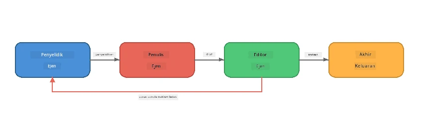
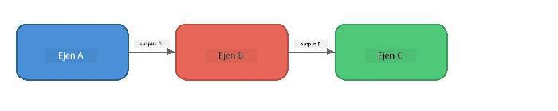
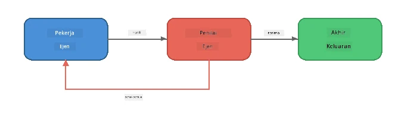
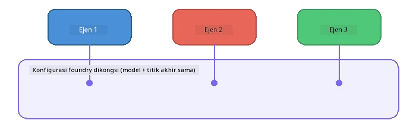

# Bahagian 6: Aliran Kerja Multi-Ejen

> **Matlamat:** Gabungkan pelbagai ejen khusus ke dalam rangkaian berkoordinasi yang membahagikan tugas kompleks antara ejen yang bekerjasama - semuanya berjalan secara tempatan dengan Foundry Local.

## Kenapa Multi-Ejen?

Satu ejen boleh mengendalikan banyak tugas, tetapi aliran kerja yang kompleks mendapat manfaat daripada **Pengkhususan**. Daripada satu ejen cuba menyelidik, menulis, dan menyunting secara serentak, anda pecahkan kerja itu ke dalam peranan yang fokus:



| Corak | Penerangan |
|---------|-------------|
| **Bersiri** | Keluaran Ejen A memberi input kepada Ejen B → Ejen C |
| **Gelung maklum balas** | Ejen penilai boleh menghantar kerja balik untuk semakan semula |
| **Konteks dikongsi** | Semua ejen menggunakan model/endpoint yang sama, tetapi arahan berbeza |
| **Keluaran berjenis** | Ejen menghasilkan keputusan berstruktur (JSON) untuk penyerahan yang boleh dipercayai |

---

## Latihan

### Latihan 1 - Jalankan Saluran Multi-Ejen

Bengkel merangkumi aliran kerja Penyelidik → Penulis → Penyunting secara lengkap.

<details>
<summary><strong>🐍 Python</strong></summary>

**Persediaan:**
```bash
cd python
python -m venv venv

# Windows (PowerShell):
venv\Scripts\Activate.ps1
# macOS:
source venv/bin/activate

pip install -r requirements.txt
```

**Jalankan:**
```bash
python foundry-local-multi-agent.py
```

**Apa yang berlaku:**
1. **Penyelidik** menerima topik dan mengembalikan fakta dalam bentuk poin peluru
2. **Penulis** mengambil hasil penyelidikan dan draf satu pos blog (3-4 perenggan)
3. **Penyunting** mengkaji artikel untuk kualiti dan mengembalikan TERIMA atau SEMAK SEMULA

</details>

<details>
<summary><strong>📦 JavaScript</strong></summary>

**Persediaan:**
```bash
cd javascript
npm install
```

**Jalankan:**
```bash
node foundry-local-multi-agent.mjs
```

**Saluran tiga peringkat yang sama** - Penyelidik → Penulis → Penyunting.

</details>

<details>
<summary><strong>💜 C#</strong></summary>

**Persediaan:**
```bash
cd csharp
dotnet restore
```

**Jalankan:**
```bash
dotnet run multi
```

**Saluran tiga peringkat yang sama** - Penyelidik → Penulis → Penyunting.

</details>

---

### Latihan 2 - Anatomi Saluran

Kaji bagaimana ejen ditakrif dan disambungkan:

**1. Klien model dikongsi**

Semua ejen berkongsi model Foundry Local yang sama:

```python
# Python - FoundryLocalClient mengendalikan segala-galanya
from agent_framework_foundry_local import FoundryLocalClient

client = FoundryLocalClient(model_id="phi-3.5-mini")
```

```javascript
// JavaScript - OpenAI SDK diarahkan kepada Foundry Local
const client = new OpenAI({
  baseURL: manager.urls[0] + "/v1",
  apiKey: "foundry-local",
});
```

```csharp
// C# - OpenAIClient pointed at Foundry Local
var key = new ApiKeyCredential("foundry-local");
var client = new OpenAIClient(key, new OpenAIClientOptions
{
    Endpoint = new Uri(manager.Urls[0] + "/v1")
});
var chatClient = client.GetChatClient(model.Id);
```

**2. arahan khusus**

Setiap ejen mempunyai persona yang berbeza:

| Ejen | Arahan (ringkasan) |
|-------|----------------------|
| Penyelidik | "Berikan fakta penting, statistik, dan latar belakang. Susun sebagai poin peluru." |
| Penulis | "Tulis pos blog yang menarik (3-4 perenggan) berdasarkan nota penyelidikan. Jangan cipta fakta." |
| Penyunting | "Kaji dari segi kejelasan, tatabahasa, dan konsistensi fakta. Keputusan: TERIMA atau SEMAK SEMULA." |

**3. Aliran data antara ejen**

```python
# Langkah 1 - output daripada penyelidik menjadi input kepada penulis
research_result = await researcher.run(f"Research: {topic}")

# Langkah 2 - output daripada penulis menjadi input kepada editor
writer_result = await writer.run(f"Write using:\n{research_result}")

# Langkah 3 - editor menyemak kedua-dua penyelidikan dan artikel
editor_result = await editor.run(
    f"Research:\n{research_result}\n\nArticle:\n{writer_result}"
)
```

```csharp
// C# - same pattern, async calls with AIAgent
var researchNotes = await researcher.RunAsync(
    $"Research the following topic and provide key facts:\n{topic}");

var draft = await writer.RunAsync(
    $"Write a blog post based on these research notes:\n\n{researchNotes}");

var verdict = await editor.RunAsync(
    $"Review this article for quality and accuracy.\n\n" +
    $"Research notes:\n{researchNotes}\n\n" +
    $"Article:\n{draft}");
```

> **Maklumat utama:** Setiap ejen menerima konteks kumulatif daripada ejen sebelumnya. Penyunting melihat kedua-dua penyelidikan asal dan draf - ini membolehkannya menyemak konsistensi fakta.

---

### Latihan 3 - Tambah Ejen Keempat

Perluaskan saluran dengan menambah ejen baru. Pilih satu:

| Ejen | Tujuan | Arahan |
|-------|---------|-------------|
| **Pemeriksa Fakta** | Sahkan tuntutan dalam artikel | `"Anda mengesahkan tuntutan fakta. Untuk setiap tuntutan, nyatakan sama ada ia disokong oleh nota penyelidikan. Pulangkan JSON dengan item yang disahkan/tidak disahkan."` |
| **Penulis Tajuk** | Cipta tajuk menarik | `"Jana 5 pilihan tajuk untuk artikel. Variasikan gaya: informatif, klik umpan, soalan, senarai, emosi."` |
| **Media Sosial** | Cipta pos promosi | `"Cipta 3 pos media sosial mempromosikan artikel ini: satu untuk Twitter (280 aksara), satu untuk LinkedIn (nada profesional), satu untuk Instagram (santai dengan cadangan emoji)."` |

<details>
<summary><strong>🐍 Python - tambah Penulis Tajuk</strong></summary>

```python
headline_agent = client.as_agent(
    name="HeadlineWriter",
    instructions=(
        "You are a headline specialist. Given an article, generate exactly "
        "5 headline options. Vary the style: informative, question-based, "
        "listicle, emotional, and provocative. Return them as a numbered list."
    ),
)

# Selepas penyunting menerima, hasilkan tajuk utama
headline_result = await headline_agent.run(
    f"Generate headlines for this article:\n\n{writer_result}"
)
print(f"\n--- Headlines ---\n{headline_result}")
```

</details>

<details>
<summary><strong>📦 JavaScript - tambah Penulis Tajuk</strong></summary>

```javascript
const headlineAgent = new ChatAgent({
  client,
  modelId: modelInfo.id,
  instructions:
    "You are a headline specialist. Given an article, generate exactly " +
    "5 headline options. Vary the style: informative, question-based, " +
    "listicle, emotional, and provocative. Return them as a numbered list.",
  name: "HeadlineWriter",
});

const headlineResult = await headlineAgent.run(
  `Generate headlines for this article:\n\n${writerResult.text}`
);
console.log(`\n--- Headlines ---\n${headlineResult.text}`);
```

</details>

<details>
<summary><strong>💜 C# - tambah Penulis Tajuk</strong></summary>

```csharp
AIAgent headlineAgent = chatClient.AsAIAgent(
    name: "HeadlineWriter",
    instructions:
        "You are a headline specialist. Given an article, generate exactly " +
        "5 headline options. Vary the style: informative, question-based, " +
        "listicle, emotional, and provocative. Return them as a numbered list."
);

// After the editor accepts, generate headlines
var headlines = await headlineAgent.RunAsync(
    $"Generate headlines for this article:\n\n{draft}");
Console.WriteLine($"\n--- Headlines ---\n{headlines}");
```

</details>

---

### Latihan 4 - Reka Bentuk Saluran Kerja Sendiri

Reka saluran multi-ejen untuk domain yang berbeza. Berikut beberapa idea:

| Domain | Ejen | Aliran |
|--------|--------|------|
| **Ulasan Kod** | Penganalisis → Penyemak → Penyingkat | Analisis struktur kod → semak untuk isu → hasilkan laporan ringkas |
| **Sokongan Pelanggan** | Pengklasifikasi → Penjawab → QA | Klasifikasi tiket → draf jawapan → semak kualiti |
| **Pendidikan** | Pembuat Kuiz → Peniru Pelajar → Penilai | Jana kuiz → simulasi jawapan → nilai dan terangkan |
| **Analisis Data** | Penafsir → Penganalisis → Pelapor | Tafsir permintaan data → analisis corak → tulis laporan |

**Langkah:**
1. Takrif 3+ ejen dengan `arahan` berbeza
2. Tentukan aliran data - apa yang diterima dan dihasilkan oleh setiap ejen?
3. Laksanakan saluran menggunakan corak dari Latihan 1-3
4. Tambah gelung maklum balas jika satu ejen perlu menilai kerja ejen lain

---

## Corak Orkestrasi

Berikut corak orkestrasi yang digunakan pada mana-mana sistem multi-ejen (dibelajari dengan mendalam dalam [Bahagian 7](part7-zava-creative-writer.md)):

### Saluran Bersiri



Setiap ejen memproses keluaran dari ejen sebelumnya. Mudah dan boleh diramalkan.

### Gelung Maklum Balas



Ejen penilai boleh mencetus semula pelaksanaan peringkat awal. Penulis Zava menggunakan ini: penyunting boleh menghantar maklum balas kembali kepada penyelidik dan penulis.

### Konteks Dikongsi



Semua ejen berkongsi `foundry_config` yang sama supaya mereka menggunakan model dan endpoint yang sama.

---

## Perkara Penting

| Konsep | Apa yang Anda Pelajari |
|---------|-----------------|
| Pengkhususan Ejen | Setiap ejen melakukan satu tugas dengan baik menggunakan arahan fokus |
| Penyerahan data | Keluaran dari satu ejen menjadi input ke ejen seterusnya |
| Gelung maklum balas | Penilai boleh mencetuskan percubaan semula untuk kualiti lebih baik |
| Keluaran berstruktur | Respons berformat JSON membolehkan komunikasi ejen-ke-ejen yang boleh dipercayai |
| Orkestrasi | Penyelarasan mengurus susunan saluran dan pengendalian ralat |
| Corak pengeluaran | Digunakan dalam [Bahagian 7: Zava Creative Writer](part7-zava-creative-writer.md) |

---

## Langkah Seterusnya

Teruskan ke [Bahagian 7: Zava Creative Writer - Aplikasi Capstone](part7-zava-creative-writer.md) untuk terokai aplikasi multi-ejen gaya pengeluaran dengan 4 ejen khusus, output strim, pencarian produk, dan gelung maklum balas - tersedia dalam Python, JavaScript, dan C#.

---

<!-- CO-OP TRANSLATOR DISCLAIMER START -->
**Penafian**:  
Dokumen ini telah diterjemahkan menggunakan perkhidmatan terjemahan AI [Co-op Translator](https://github.com/Azure/co-op-translator). Walaupun kami berusaha untuk ketepatan, sila maklum bahawa terjemahan automatik mungkin mengandungi kesilapan atau ketidaktepatan. Dokumen asal dalam bahasa asalnya harus dianggap sebagai sumber yang sahih. Untuk maklumat penting, terjemahan manusia profesional adalah disyorkan. Kami tidak bertanggungjawab atas sebarang salah faham atau salah tafsir yang timbul daripada penggunaan terjemahan ini.
<!-- CO-OP TRANSLATOR DISCLAIMER END -->