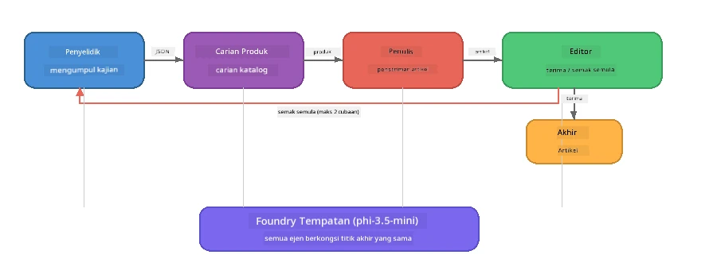

# Bahagian 7: Penulis Kreatif Zava - Aplikasi Capstone

> **Matlamat:** Meneroka aplikasi multi-ejen gaya pengeluaran di mana empat ejen khusus bekerjasama untuk menghasilkan artikel berkualiti majalah untuk Zava Retail DIY - berjalan sepenuhnya pada peranti anda dengan Foundry Local.

Ini adalah **makmal capstone** bengkel. Ia menggabungkan segala yang telah anda pelajari - integrasi SDK (Bahagian 3), pengambilan dari data tempatan (Bahagian 4), persona ejen (Bahagian 5), dan orkestrasi multi-ejen (Bahagian 6) - ke dalam aplikasi lengkap yang tersedia dalam **Python**, **JavaScript**, dan **C#**.

---

## Apa yang Akan Anda Terokai

| Konsep | Tempat dalam Penulis Zava |
|---------|----------------------------|
| Pemuatan model 4 langkah | Modul konfigurasi dikongsi memulakan Foundry Local |
| Pengambilan gaya RAG | Ejen produk mencari katalog tempatan |
| Pengkhususan ejen | 4 ejen dengan arahan sistem yang berbeza |
| Output penstriman | Penulis mengeluarkan token secara masa nyata |
| Penyerahan berstruktur | Penyelidik → JSON, Editor → keputusan JSON |
| Gelung maklum balas | Editor boleh mencetuskan pelaksanaan semula (maks 2 cubaan) |

---

## Seni Bina

Penulis Kreatif Zava menggunakan **saluran berurutan dengan maklum balas dipacu penilai**. Ketiga-tiga pelaksanaan bahasa mengikuti seni bina yang sama:



### Empat Ejen

| Ejen | Input | Output | Tujuan |
|-------|-------|--------|---------|
| **Penyelidik** | Topik + maklum balas pilihan | `{"web": [{url, name, description}, ...]}` | Mengumpul penyelidikan latar belakang melalui LLM |
| **Carian Produk** | String konteks produk | Senarai produk padanan | Pertanyaan dihasilkan oleh LLM + carian kata kunci terhadap katalog tempatan |
| **Penulis** | Penyelidikan + produk + tugasan + maklum balas | Teks artikel penstriman (dipisah pada `---`) | Mencipta draf artikel berkualiti majalah dalam masa nyata |
| **Editor** | Artikel + maklum balas diri penulis | `{"decision": "accept/revise", "editorFeedback": "...", "researchFeedback": "..."}` | Menilai kualiti, mencetuskan cubaan semula jika perlu |

### Aliran Saluran

1. **Penyelidik** menerima topik dan menghasilkan nota penyelidikan berstruktur (JSON)
2. **Carian Produk** membuat pertanyaan ke katalog produk tempatan menggunakan istilah carian yang dihasilkan LLM
3. **Penulis** menggabungkan penyelidikan + produk + tugasan ke dalam artikel penstriman, menambah maklum balas diri selepas pemisah `---`
4. **Editor** menilai artikel dan mengembalikan keputusan JSON:
   - `"accept"` → saluran selesai
   - `"revise"` → maklum balas dihantar balik ke Penyelidik dan Penulis (maks 2 cubaan)

---

## Prasyarat

- Lengkapkan [Bahagian 6: Aliran Kerja Multi-Ejen](part6-multi-agent-workflows.md)
- Foundry Local CLI dipasang dan model `phi-3.5-mini` dimuat turun

---

## Latihan

### Latihan 1 - Jalankan Penulis Kreatif Zava

Pilih bahasa anda dan jalankan aplikasi:

<details>
<summary><strong>🐍 Python - Perkhidmatan Web FastAPI</strong></summary>

Versi Python dijalankan sebagai **perkhidmatan web** dengan REST API, menunjukkan cara membina backend pengeluaran.

**Persediaan:**
```bash
cd zava-creative-writer-local/src/api
python -m venv venv

# Windows (PowerShell):
venv\Scripts\Activate.ps1
# macOS:
source venv/bin/activate

pip install -r requirements.txt
```

**Jalankan:**
```bash
uvicorn main:app --reload
```

**Uji:**
```bash
curl -X POST http://localhost:8000/api/article \
  -H "Content-Type: application/json" \
  -d '{
    "research": "DIY home improvement trends",
    "products": "power tools and paints",
    "assignment": "Write an article about weekend renovation projects for DIY enthusiasts"
  }'
```

Respons menstrimkan semula sebagai mesej JSON yang dipisahkan baris baru menunjukkan kemajuan setiap ejen.

</details>

<details>
<summary><strong>📦 JavaScript - CLI Node.js</strong></summary>

Versi JavaScript dijalankan sebagai **aplikasi CLI**, mencetak kemajuan ejen dan artikel terus ke konsol.

**Persediaan:**
```bash
cd zava-creative-writer-local/src/javascript
npm install
```

**Jalankan:**
```bash
node main.mjs
```

Anda akan lihat:
1. Pemuatan model Foundry Local (dengan bar kemajuan jika memuat turun)
2. Setiap ejen berjalan secara berurutan dengan mesej status
3. Artikel distrim ke konsol secara masa nyata
4. Keputusan terima/semasa sunting dari editor

</details>

<details>
<summary><strong>💜 C# - Aplikasi Konsol .NET</strong></summary>

Versi C# dijalankan sebagai **aplikasi konsol .NET** dengan saluran dan output penstriman yang sama.

**Persediaan:**
```bash
cd zava-creative-writer-local/src/csharp
dotnet restore
```

**Jalankan:**
```bash
dotnet run
```

Corak output sama seperti versi JavaScript - mesej status ejen, artikel distrim, dan keputusan editor.

</details>

---

### Latihan 2 - Kaji Struktur Kod

Setiap pelaksanaan bahasa mempunyai komponen logik yang sama. Bandingkan struktur:

**Python** (`src/api/`):
| Fail | Tujuan |
|------|---------|
| `foundry_config.py` | Pengurus Foundry Local kongsi, model, dan klien (init 4 langkah) |
| `orchestrator.py` | Penyelarasan saluran dengan gelung maklum balas |
| `main.py` | Titik akhir FastAPI (`POST /api/article`) |
| `agents/researcher/researcher.py` | Penyelidikan berasaskan LLM dengan output JSON |
| `agents/product/product.py` | Pertanyaan dihasilkan LLM + carian kata kunci |
| `agents/writer/writer.py` | Penjanaan artikel penstriman |
| `agents/editor/editor.py` | Keputusan terima/semasa berasaskan JSON |

**JavaScript** (`src/javascript/`):
| Fail | Tujuan |
|------|---------|
| `foundryConfig.mjs` | Konfigurasi Foundry Local dikongsi (init 4 langkah dengan bar kemajuan) |
| `main.mjs` | Orkestra + titik masuk CLI |
| `researcher.mjs` | Ejen penyelidikan berasaskan LLM |
| `product.mjs` | Penjanaan pertanyaan LLM + carian kata kunci |
| `writer.mjs` | Penjanaan artikel penstriman (penjana async) |
| `editor.mjs` | Keputusan terima/semasa JSON |
| `products.mjs` | Data katalog produk |

**C#** (`src/csharp/`):
| Fail | Tujuan |
|------|---------|
| `Program.cs` | Saluran lengkap: pemuatan model, ejen, orkestrator, gelung maklum balas |
| `ZavaCreativeWriter.csproj` | Projek .NET 9 dengan pakej Foundry Local + OpenAI |

> **Nota reka bentuk:** Python memisahkan setiap ejen ke fail/direktori sendiri (baik untuk pasukan besar). JavaScript menggunakan satu modul per ejen (baik untuk projek sederhana). C# menyimpan semuanya dalam satu fail dengan fungsi tempatan (baik untuk contoh bersifat sendiri). Dalam produksi, pilih pola yang sesuai dengan konvensyen pasukan anda.

---

### Latihan 3 - Jejaki Konfigurasi Kongsi

Setiap ejen dalam saluran berkongsi satu klien model Foundry Local. Kaji bagaimana ini disediakan dalam setiap bahasa:

<details>
<summary><strong>🐍 Python - foundry_config.py</strong></summary>

```python
from foundry_local import FoundryLocalManager

MODEL_ALIAS = "phi-3.5-mini"

# Langkah 1: Cipta pengurus dan mulakan perkhidmatan Foundry Tempatan
manager = FoundryLocalManager()
manager.start_service()

# Langkah 2: Periksa jika model sudah dimuat turun
cached = manager.list_cached_models()
catalog_info = manager.get_model_info(MODEL_ALIAS)
is_cached = any(m.id == catalog_info.id for m in cached) if catalog_info else False

if not is_cached:
    manager.download_model(MODEL_ALIAS)

# Langkah 3: Muatkan model ke dalam memori
manager.load_model(MODEL_ALIAS)
model_id = manager.get_model_info(MODEL_ALIAS).id

# Pelanggan OpenAI yang dikongsi
client = openai.OpenAI(base_url=manager.endpoint, api_key=manager.api_key)
```

Semua ejen mengimport `from foundry_config import client, model_id`.

</details>

<details>
<summary><strong>📦 JavaScript - foundryConfig.mjs</strong></summary>

```javascript
import { FoundryLocalManager } from "foundry-local-sdk";
import { OpenAI } from "openai";

FoundryLocalManager.create({ appName: "ZavaCreativeWriter" });
const manager = FoundryLocalManager.instance;
await manager.startWebService();

// Semak cache → muat turun → muat (pola SDK baru)
const catalog = manager.catalog;
const model = await catalog.getModel(MODEL_ALIAS);
if (!model.isCached) {
  console.log(`Downloading model: ${MODEL_ALIAS}...`);
  await model.download();
}
await model.load();

const client = new OpenAI({ baseURL: manager.urls[0] + "/v1", apiKey: "foundry-local" });
const modelId = model.id;
export { client, modelId };
```

Semua ejen mengimport `{ client, modelId } from "./foundryConfig.mjs"`.

</details>

<details>
<summary><strong>💜 C# - bahagian atas Program.cs</strong></summary>

```csharp
await FoundryLocalManager.CreateAsync(
    new Configuration
    {
        AppName = "ZavaCreativeWriter",
        Web = new Configuration.WebService { Urls = "http://127.0.0.1:0" }
    }, NullLogger.Instance, default);
var manager = FoundryLocalManager.Instance;
await manager.StartWebServiceAsync(default);

var catalog = await manager.GetCatalogAsync(default);
var catalogModel = await catalog.GetModelAsync(alias, default);
var isCached = await catalogModel.IsCachedAsync(default);
if (!isCached)
    await catalogModel.DownloadAsync(null, default);

await catalogModel.LoadAsync(default);
var key = new ApiKeyCredential("foundry-local");
var chatClient = new OpenAIClient(key, new OpenAIClientOptions
{
    Endpoint = new Uri(manager.Urls[0] + "/v1")
}).GetChatClient(catalogModel.Id);
```

`chatClient` kemudian dipass ke semua fungsi ejen dalam fail yang sama.

</details>

> **Corak utama:** Corak pemuatan model (mula perkhidmatan → semak cache → muat turun → muat) memastikan pengguna melihat kemajuan jelas dan model hanya dimuat turun sekali. Ini adalah amalan terbaik untuk mana-mana aplikasi Foundry Local.

---

### Latihan 4 - Fahami Gelung Maklum Balas

Gelung maklum balas adalah apa yang menjadikan saluran ini "pintar" - Editor boleh menghantar semula kerja untuk semakan. Jejaki logiknya:

```
Orchestrator:
  1. researcher.research(topic, "No Feedback")    ← first pass
  2. product.findProducts(productContext)
  3. writer.write(research, products, assignment)  ← streams article
  4. Split article at "---" → article + writerFeedback
  5. editor.edit(article, writerFeedback)

  WHILE editor says "revise" AND retryCount < 2:
    6. researcher.research(topic, editor.researchFeedback)  ← refined
    7. writer.write(research, products, editor.editorFeedback)
    8. editor.edit(newArticle, newWriterFeedback)
    9. retryCount++
```

**Soalan untuk difikirkan:**
- Kenapa had cubaan semula ditetapkan kepada 2? Apa yang berlaku jika anda menambahnya?
- Kenapa penyelidik dapat `researchFeedback` tetapi penulis dapat `editorFeedback`?
- Apa yang akan berlaku jika editor sentiasa kata "revise"?

---

### Latihan 5 - Ubah Satu Ejen

Cuba ubah tingkah laku satu ejen dan perhatikan bagaimana ia menjejaskan saluran:

| Pengubahsuaian | Apa yang perlu diubah |
|-------------|----------------|
| **Editor lebih ketat** | Tukar arahan sistem editor supaya sentiasa minta sekurang-kurangnya satu suntingan |
| **Artikel lebih panjang** | Tukar arahan penulis dari "800-1000 perkataan" ke "1500-2000 perkataan" |
| **Produk berbeza** | Tambah atau ubah produk dalam katalog produk |
| **Topik penyelidikan baru** | Tukar `researchContext` lalai kepada subjek berbeza |
| **Penyelidik hanya JSON** | Jadikan penyelidik mengembalikan 10 item bukan 3-5 |

> **Petua:** Oleh kerana ketiga-tiga bahasa melaksanakan seni bina yang sama, anda boleh buat pengubahsuaian sama dalam bahasa yang anda selesa.

---

### Latihan 6 - Tambah Ejen Kelima

Tambahkan ejen baru ke dalam saluran. Beberapa idea:

| Ejen | Tempat dalam saluran | Tujuan |
|-------|-------------------|---------|
| **Pemeriksa Fakta** | Selepas Penulis, sebelum Editor | Sahkan tuntutan berdasarkan data penyelidikan |
| **Pengoptimum SEO** | Selepas Editor terima | Tambah deskripsi meta, kata kunci, slug |
| **Pelukis** | Selepas Editor terima | Jana arahan imej untuk artikel |
| **Penterjemah** | Selepas Editor terima | Terjemah artikel ke bahasa lain |

**Langkah:**
1. Tulis arahan sistem ejen
2. Cipta fungsi ejen (mengikut pola sedia ada dalam bahasa anda)
3. Masukkan ke dalam orkestrator di tempat yang betul
4. Kemas kini output/log untuk tunjuk sumbangan ejen baru

---

## Bagaimana Foundry Local dan Rangka Kerja Ejen Bekerjasama

Aplikasi ini menunjukkan corak yang disyorkan untuk membina sistem multi-ejen dengan Foundry Local:

| Lapisan | Komponen | Peranan |
|-------|-----------|------|
| **Runtime** | Foundry Local | Memuat turun, mengurus, dan menyajikan model secara tempatan |
| **Klien** | OpenAI SDK | Menghantar penyelesaian chat ke titik akhir tempatan |
| **Ejen** | Arahan sistem + panggilan chat | tingkah laku khusus melalui arahan fokus |
| **Orchestrator** | Penyelarasan saluran | Mengurus aliran data, urutan, dan gelung maklum balas |
| **Rangka Kerja** | Microsoft Agent Framework | Menyediakan abstraksi dan corak `ChatAgent` |

Pandangan utama: **Foundry Local menggantikan backend awan, bukan seni bina aplikasi.** Corak ejen yang sama, strategi orkestrasi, dan penyerahan berstruktur yang berfungsi dengan model hos awan berfungsi dengan identik dengan model tempatan — anda hanya tunjukkan klien ke titik akhir tempatan bukan ke titik akhir Azure.

---

## Perkara Penting

| Konsep | Apa yang Anda Pelajari |
|---------|-----------------|
| Seni bina pengeluaran | Cara menyusun aplikasi multi-ejen dengan konfigurasi kongsi dan ejen berasingan |
| Pemuatan model 4 langkah | Amalan terbaik untuk memulakan Foundry Local dengan kemajuan yang kelihatan pengguna |
| Pengkhususan Ejen | Setiap 4 ejen mempunyai arahan fokus dan format output tertentu |
| Penjanaan penstriman | Penulis mengeluarkan token masa nyata, membolehkan UI responsif |
| Gelung maklum balas | Cubaan semula dipacu editor memperbaiki kualiti output tanpa campur tangan manusia |
| Corak lintas bahasa | Seni bina yang sama berfungsi dalam Python, JavaScript, dan C# |
| Tempatan = sedia produksi | Foundry Local menyajikan API serasi OpenAI yang sama digunakan dalam penggubahan awan |

---

## Langkah Seterusnya

Teruskan ke [Bahagian 8: Pembangunan Dipimpin Penilaian](part8-evaluation-led-development.md) untuk membina rangka kerja penilaian sistematik untuk ejen anda, menggunakan dataset emas, pemeriksaan berasaskan peraturan, dan penilaian LLM-sebagai-hakim.

---

<!-- CO-OP TRANSLATOR DISCLAIMER START -->
**Penafian**:  
Dokumen ini telah diterjemahkan menggunakan perkhidmatan terjemahan AI [Co-op Translator](https://github.com/Azure/co-op-translator). Walaupun kami berusaha untuk ketepatan, sila maklum bahawa terjemahan automatik mungkin mengandungi kesilapan atau ketidaktepatan. Dokumen asal dalam bahasa asalnya harus dianggap sebagai sumber utama yang sahih. Untuk maklumat kritikal, terjemahan profesional oleh manusia adalah disyorkan. Kami tidak bertanggungjawab atas sebarang salah faham atau salah tafsir yang timbul daripada penggunaan terjemahan ini.
<!-- CO-OP TRANSLATOR DISCLAIMER END -->