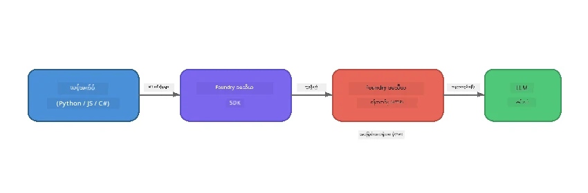

# အပိုင်း ၁: Foundry Local ဖြင့် စတင်ခြင်း


## Foundry Local ဆိုတာဘာလဲ?

[Foundry Local](https://foundrylocal.ai) သည် မိမိကွန်ပျူတာပေါ်တွင် တိုက်ရိုက် **ဖွင့်လှစ်-ရင်းမြစ် AI ဘာသာစကားမော်ဒယ်များကို** ပြေးဆွဲနိုင်စေသည် - အ الإنترنت မလိုအပ်ဘဲ၊ Cloud ကုန်ကျစရိတ် မရှိဘဲ၊ ဒေတာပုဂ္ဂိုလ်ရေးပြီးပြည့်စုံစွာ အာမခံထားသည်။ ၎င်းမှာ -

- **မော်ဒယ်များကို သင့်စက်ပေါ်တွင် ဒေါင်းလုပ်ဆွဲ၍ ပြေးဆွဲပေးသည်** hardware အလိုက် အလိုအလျောက် ပြုပြင်စိစစ်မှုဖြင့် (GPU, CPU သို့မဟုတ် NPU)
- **OpenAI-ကိုက်ညီသော API** ပံ့ပိုးပေးကာ သင့်ရဲ့ သိစိတ်ရှိသော SDKs နှင့် tools များအသုံးပြုနိုင်သည်
- **Azure subscription** သို့မဟုတ် အကောင့်ဖွင့်ရန် မလိုအပ်ဘဲ - install လုပ်ပြီး အသုံးပြုနိုင်သည်

သင့်စက်ပေါ်မှာပုဂ္ဂိုလ်ရေး AI ကိုင်ဆောင်ထားသလိုတွေးပါ။

## သင်ယူရမည့် ရည်မှန်းချက်များ

ဒီ lab အဆုံးသတ်ချိန်မှာ သင့်အားများကို အောက်ပါအတိုင်း လုပ်နိုင်မှာဖြစ်သည် -

- သင့်စက်အတွက် Foundry Local CLI ကို တပ်ဆင်နိုင်သည်
- မော်ဒယ် alias များသည်ဘာလဲ၊ မည်ကဲ့သို့အလုပ်လုပ်သည်ကို နားလည်သည်
- ပထမဆုံး local AI မော်ဒယ်ကို ဒေါင်းလုပ်ဆွဲပြီး စတင်ပြေးဆွဲနိုင်သည်
- command line မှ local မော်ဒယ်သို့ စကားပြောပို့နိုင်သည်
- local နှင့် cloud-hosted AI မော်ဒယ်များကွာခြားချက်ကို နားလည်သည်

---

## မတိုင်မီလိုအပ်ချက်များ

### စနစ်လိုအပ်ချက်များ

|လိုအပ်ချက်|အနည်းဆုံး|အကြံပြုသည့်အတိုင်း|
|-------------|---------|-------------|
|**RAM**|8 GB|16 GB|
|**Disk Space**|5 GB (မော်ဒယ်များအတွက်)|10 GB|
|**CPU**|4 cores|8+ cores|
|**GPU**|ရွေးချယ်စရာ|NVIDIA CUDA 11.8+ ရှိသူ|
|**OS**|Windows 10/11 (x64/ARM), Windows Server 2025, macOS 13+| - |

> **Note:** Foundry Local သည် hardware အလိုက် သင့်တော်ဆုံး မော်ဒယ်ဗားရှင်းကို အလိုအလျောက် ရွေးချယ်ပေးသည်။ NVIDIA GPU ရှိလျှင် CUDA အရှိန်မြှင့်မှုကို အသုံးပြုသည်။ Qualcomm NPU ရှိပါက အဲဒါကို အသုံးပြုသည်။ အခြားအားဖြင့် CPU ရင်းမြစ်ကို ကောင်းမွန်စွာ ပြုပြင်ထားသည့်ဗားရှင်းကို အသုံးပြုသည်။

### Foundry Local CLI တပ်ဆင်ခြင်း

**Windows** (PowerShell):
```powershell
winget install Microsoft.FoundryLocal
```

**macOS** (Homebrew):
```bash
brew tap microsoft/foundrylocal
brew install foundrylocal
```

> **Note:** Foundry Local သည် လက်ရှိတွင် Windows နှင့် macOS သာ ပံ့ပိုးပေးသည်။ Linux ကို ယခုအချိန်တွင် မပံ့ပိုးပါ။

တပ်ဆင်မှုကို သက်ဆိုင်ရာ CLI မှာ စစ်ဆေးပါ -
```bash
foundry --version
```

---

## Lab လေ့ကျင့်ခန်းများ

### လေ့ကျင့်ခန်း ၁: ရနိုင်သော မော်ဒယ်များ စူးစမ်းကြည့်ရန်

Foundry Local တွင် အရင်စီ အလိုအလျောက် ပြုစုပ်ထားသော ဖွင့်လှစ်-ရင်းမြစ် မော်ဒယ်စာရင်းတစ်ခုပါဝင်သည်။ စာရင်းပြပါ -

```bash
foundry model list
```

အောက်ပါ မော်ဒယ်များကို တွေမြင်ရပါလိမ့်မည် -
- `phi-3.5-mini` - Microsoft ၏ 3.8B parameter မော်ဒယ် (လျင်မြန်ပြီး အရည်အသွေးကောင်း)
- `phi-4-mini` - မကြာသေးမီကထွက်ရှိသည့် ပိုမိုအစွမ်းထက်သော Phi မော်ဒယ်
- `phi-4-mini-reasoning` - Phi မော်ဒယ်မှာ chain-of-thought reasoning ပါ (`<think>` tag များ)
- `phi-4` - Microsoft ၏ အကြီးဆုံး Phi မော်ဒယ် (10.4 GB)
- `qwen2.5-0.5b` - အလွန်အသေးစားနှင့် လျင်မြန် (နည်းနည်းစွမ်းရည်ရှိစက်များအတွက်)
- `qwen2.5-7b` - စွမ်းအားပြင်းသော general-purpose မော်ဒယ်၊ tool-calling ကိုထောက်ပံ့
- `qwen2.5-coder-7b` - ကုဒ်ဖန်တီးမှုအတွက် ဖြည့်စွက်ချဲ့ထွင်ထားသည်
- `deepseek-r1-7b` - စွမ်းအားပြည့်စုံသော reasoning မော်ဒယ်
- `gpt-oss-20b` - ကြီးမားသော ဖွင့်လှစ်-ရင်းမြစ် မော်ဒယ် (MIT လိုင်စင်၊ 12.5 GB)
- `whisper-base` - စကားမှ စာသားသို့ သရုပ်ပြခြင်း (383 MB)
- `whisper-large-v3-turbo` - မြင့်မားသတိထားမှု transcription (9 GB)

> **မော်ဒယ် alias ဆိုသည်မှာဘာလဲ?** `phi-3.5-mini` ကဲ့သို့ alias များသည် shortcut များဖြစ်သည်။ alias အသုံးပြုသောအခါ Foundry Local သည် သင့် hardware အတွက် အကောင်းဆုံးဗားရှင်းကို (NVIDIA GPUs အတွက် CUDA, မဟုတ်ရင် CPU သီးသန့်) အလိုအလျောက် ဒေါင်းလုပ်ဆွဲပေးသည်။ ညွှန်ကြားစရာ မလိုတော့ပါ။

### လေ့ကျင့်ခန်း ၂: ပထမဆုံး မော်ဒယ်ကို ပြေးဆွဲပါ

မော်ဒယ်တစ်ခုကို ဒေါင်းလုပ်ဆွဲပြီး အပြန်အလှန် စကားပြောပါ:

```bash
foundry model run phi-3.5-mini
```

ဤအကြိမ်ပထမဆုံးပြေးလျှင် Foundry Local သည် -
1. သင့် hardware ကိုစမ်းသပ်သည်
2. အကောင်းဆုံးမော်ဒယ်ဗားရှင်းကို ဒေါင်းလုပ်ဆွဲသည် (ခဏကြာနိုင်သည်)
3. မော်ဒယ်ကို မှတ်ဉာဏ်ထဲသို့ load ထားသည်
4. အပြန်အလှန် စကားပြော session ပွဲစတင်သည်

မေးခွန်းတချို့ မေးကြည့်ပါ -
```
You: What is the golden ratio?
You: Can you explain it as if I were 10 years old?
You: Write a haiku about mathematics
```

`exit` ဟုရိုက်ထည့်ရန် သို့မဟုတ် `Ctrl+C` နှိပ်ကာ ထွက်ခွာနိုင်သည်။

### လေ့ကျင့်ခန်း ၃: မော်ဒယ်တစ်ခုကို ကြိုတင်ဒေါင်းလုပ်ဆွဲခြင်း

chat စတင်ရန်မလိုဘဲ မော်ဒယ်ကို ကြိုတင်ဒေါင်းလုပ်ဆွဲလိုပါက -

```bash
foundry model download phi-3.5-mini
```

သင့်စက်ပေါ်မှာ ရှိပြီးသား မော်ဒယ်များကို စစ်ဆေးရန် -

```bash
foundry cache list
```

### လေ့ကျင့်ခန်း ၄: ဖွဲ့စည်းပုံကိုနားလည်ခြင်း

Foundry Local သည် **local HTTP ဝန်ဆောင်မှု** အဖြစ် ထားပြီး OpenAI ကိုက်ညီသော REST API ကို ဖော်ပြပေးသည်။ ၎င်းတွင် -

1. ဝန်ဆောင်မှုသည် **dynamic port** (တစ်ခါပြေးသည့်အခါ port ကွဲပြား) မှာ စတင်လည်ပတ်သည်
2. သင်သည် SDK ကို အသုံးပြုပြီး လက်တွေ့ endpoint URL ကိုရှာဖွေသည်
3. **မည်သည့်** OpenAI-ကိုက်ညီသော client library ဆိုတာကိုမဆို စကားပြောနိုင်သည်



> **အရေးကြီးချက်:** Foundry Local သည် စတင်တိုင်း **dynamic port** တစ်ခု သတ်မှတ်ပေးသည်။ `localhost:5272` ကဲ့သို့ port number ကို တိုက်ရိုက်ရေးမထားပါနှင့်။ အပေါ်က SDK ကို အသုံးပြုပြီး လက်ရှိ URL ကို ကြည့်ရှုသည် (ဥပမာ Python တွင် `manager.endpoint` သို့မဟုတ် JavaScript တွင် `manager.urls[0]`).

---

## အဓိကယူဆချက်များ

| အကြောင်းအရာ | သင်ယူခဲ့သည့်အရာ |
|---------|------------------|
| On-device AI | Foundry Local သည် မော်ဒယ်များကို စက်ပေါ်ပေါ်တွင်အပြည့်အဝ ပြေးဆွဲသည်၊ cloud မလို၊ API key မလိုနှင့် ကုန်ကျစရိတ်မရှိပါ |
| Model aliases | `phi-3.5-mini` ကဲ့သို့ alias များသည် သင့် hardware အတွက် အကောင်းဆုံးဗားရှင်းကို အလိုအလျောက် ရွေးချယ်ပေးသည် |
| Dynamic ports | ဝန်ဆောင်မှုသည် dynamic port တွင် လည်ပတ်သည်၊ endpoint ကို ရှာဖွေရန် SDK ကို အမြဲ အသုံးပြုပါ |
| CLI and SDK | မော်ဒယ်များနှင့် အပြန်အလှန်ဆက်ဆံရန် CLI (`foundry model run`) သို့မဟုတ် SDK ဖြင့် လုပ်ဆောင်နိုင်သည် |

---

## နောက်တက်ရန် ခြေလှမ်းများ

[အပိုင်း ၂: Foundry Local SDK အကွက်အမြင် ဆက်လက်လေ့လာခြင်း](part2-foundry-local-sdk.md) သို့ ဆက်လက်သွားပြီး မော်ဒယ်များ၊ ဝန်ဆောင်မှုများနှင့် caching ကို ထိန်းချုပ်နိုင်ရန် SDK API ကိုကျွမ်းကျင်စွာ လေ့လာပါ။

---

<!-- CO-OP TRANSLATOR DISCLAIMER START -->
**အသိပေးချက်**:  
ဤစာတမ်းကို AI ဘာသာပြန်ဝန်ဆောင်မှု [Co-op Translator](https://github.com/Azure/co-op-translator) အား အသုံးပြု၍ ဘာသာပြန်ထားပါသည်။ တိကျမှုအတွက် ကြိုးစားနေသော်လည်း အလိုအလြော ဘာသာပြန်ချက်များတွင် ပြဿနာများ သို့မဟုတ် မှားယွင်းမှုများ ပါဝင်နိုင်ကြောင်း သတိပြုပါရန် လိုအပ်ပါသည်။ မူရင်းစာတမ်းကို မိမိဘာသာစကားဖြင့်သာ အတည်ပြုအဖြစ် သတ်မှတ်သင့်ပါသည်။ အရေးကြီးသော အချက်အလက်များအတွက် လူမှုအမေရိကန် ဘာသာပြန်ခြင်းကို မျှော်လင့်ပါ။ ဤဘာသာပြန်ချက်ကို အသုံးပြုရာမှ မည်သည့် နားလည်မှုလွဲမှားမှုများဖြစ်ပေါ်ပါက ကျနော်တို့ မည်သည့် တာဝန်မရှိပါ။
<!-- CO-OP TRANSLATOR DISCLAIMER END -->