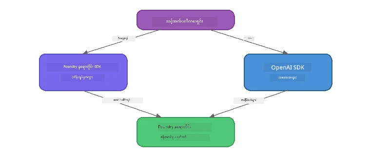

# အပိုင်း ၃: Foundry Local SDK ကို OpenAI နှင့်အတူ အသုံးပြုခြင်း

## အနှစ်ချုပ်

အပိုင်း ၁ တွင် သင်သည် Foundry Local CLI ကို အသုံးပြုပြီး မော်ဒယ်များကို သက်ဆိုင်ရာအတိုင်း ပြုလုပ်ခြင်းကို လေ့လာခဲ့သည်။ အပိုင်း ၂ တွင် SDK API အပြည့်အစုံကို ရှာဖွေကြည့်ရှုခဲ့သည်။ ယခု သင်မှာ SDK နှင့် OpenAI ကို ညီညွတ်သော API ကို အသုံးပြုပြီး **Foundry Local ကို သင်၏ အပလီကေးရှင်းများထဲတွင် ပေါင်းစည်းနည်းကို သင်ယူပါမည်**။

Foundry Local သည် ဘာသာစကားသုံးမျိုးအတွက် SDK များ မျှဝေထားသည်။ သင်အဆင်ပြေသောတစ်ခုကိုရွေးပါ -  အတွေးအခေါ်များသည် သုံးခုလုံးတွင် တူညီသည်။

## သင်ယူရမည့် အဓိက ရည်ရွယ်ချက်များ

ဤ လေ့ကျင့်မှု၏ အဆုံးတွင် သင်သည် အောက်ပါလုပ်ဆောင်နိုင်မည်ဖြစ်သည် -

- သင်၏ဘာသာစကားအတွက် Foundry Local SDK ကို ထည့်သွင်းတပ်ဆင်ခြင်း (Python, JavaScript သို့မဟုတ် C#)
- `FoundryLocalManager` ကို စတင်ရန် initialisation ပြုလုပ်ခြင်း၊ cache စစ်ဆေးခြင်း၊ မော်ဒယ်ဒေါင်းလုပ်ဆွဲခြင်းနှင့် loading ပြုလုပ်ခြင်း
- OpenAI SDK ကို အသုံးပြုပြီး ဒေသခံ မော်ဒယ်နှင့် ချိတ်ဆက်ခြင်း
- Chat completions များ ပို့ဆောင်ခြင်းနှင့် streaming အဖြေများကို ကိုင်တွယ်ထိန်းချုပ်ခြင်း
- dynamic port အဆောက်အအုံကို နားလည်ခြင်း

---

## လိုအပ်ချက်များ

[အပိုင်း ၁: Foundry Local သို့ စတင်မိတ်ဆက်ခြင်း](part1-getting-started.md) နှင့် [အပိုင်း ၂: Foundry Local SDK အနက်ရှိုင်းဆုံး စူးစမ်းခြင်း](part2-foundry-local-sdk.md) ကို အပြီးသတ်ပါ။

အောက်ပါ ဘာသာစကား runtime တစ်ခုကို ထည့်သွင်းပါ -
- **Python 3.9+** - [python.org/downloads](https://www.python.org/downloads/)
- **Node.js 18+** - [nodejs.org](https://nodejs.org/)
- **.NET 9.0+** - [dot.net/download](https://dotnet.microsoft.com/download)

---

## ယူဆချက်: SDK မှ မည်သို့ လည်ပတ်သည်

Foundry Local SDK သည် **control plane** ကို စီမံခန့်ခွဲသည် (ဝန်ဆောင်မှု စတင်ခြင်း၊ မော်ဒယ်များ ဒေါင်းလုပ်ဆွဲခြင်း)၊ အချိန်တိုင် OpenAI SDK သည် **data plane** ကို ကိုင်တွယ်သည် (prompts ပို့ခြင်း၊ completions လက်ခံခြင်း)။



---

## လေ့ကျင့်ခန်းများ

### လေ့ကျင့်ခန်း ၁: သင့် ပတ်ဝန်းကျင်ကို ပြင်ဆင်ခြင်း

<details>
<summary><b>🐍 Python</b></summary>

```bash
cd python
python -m venv venv

# အမှန်တကယ်ဝန်ဆောင်မှုပတ်ဝန်းကျင်ကို ဖွင့်ပါ။
# Windows (PowerShell):
venv\Scripts\Activate.ps1
# Windows (Command Prompt):
venv\Scripts\activate.bat
# macOS:
source venv/bin/activate

pip install -r requirements.txt
```

`requirements.txt` မှ တပ်ဆင်သောအရာများ -
- `foundry-local-sdk` - Foundry Local SDK (သိုလှောင်ရန် `foundry_local` အဖြစ် import ပြုလုပ်သည်)
- `openai` - OpenAI Python SDK
- `agent-framework` - Microsoft Agent Framework (နောက်ပိုင်း အပိုင်းများတွင် အသုံးပြုမည်)

</details>

<details>
<summary><b>📘 JavaScript</b></summary>

```bash
cd javascript
npm install
```

`package.json` မှတပ်ဆင်သော အရာများ -
- `foundry-local-sdk` - Foundry Local SDK
- `openai` - OpenAI Node.js SDK

</details>

<details>
<summary><b>💜 C#</b></summary>

```bash
cd csharp
dotnet restore
dotnet build
```

`csharp.csproj` မှ အသုံးပြုသော အရာများ -
- `Microsoft.AI.Foundry.Local` - Foundry Local SDK (NuGet)
- `OpenAI` - OpenAI C# SDK (NuGet)

> **Project ဖွဲ့စည်းပုံ:** C# project သည် `Program.cs` တွင် command-line router တစ်ခုကို အသုံးပြုပြီး အပိုင်းနှင့် မျှဝေသော ဇယားဖိုင်များကို ခွဲထုတ်သွားသည်။ ယခုအပိုင်းအတွက် `dotnet run chat` (သို့) `dotnet run` ကို အသုံးပြုပါ။ အပိုင်းများအတွက် `dotnet run rag`, `dotnet run agent` နှင့် `dotnet run multi` ကို အသုံးပြုသည်။

</details>

---

### လေ့ကျင့်ခန်း ၂: မူရင်း Chat Completion

သင်၏ ဘာသာစကားအတွက် အခြေခံ chat ဥပမာဖိုင်ကို ဖွင့်ပြီး ကုဒ်ကို ထောက်လှမ်းကြည့်ပါ။ script တစ်ခုလိုက်ပြီး လုပ်ဆောင်မှုပုံစံ သုံးခြေလမ်းကို လိုက်နာသည် -

1. **ဝန်ဆောင်မှု စတင်ခြင်း** - `FoundryLocalManager` သည် Foundry Local runtime ကို စတင်သည်
2. **မော်ဒယ် ဒေါင်းလုပ်ဆွဲခြင်းနှင့် မော်ဒယ် ထည့်ခြင်း** - cache ထဲရှိမော်ဒယ်များစစ်ဆေးပြီး မလိုအပ်ပါက ဒေါင်းလုပ်ဆွဲပြီးဖတ်ရန် memory သို့ load ပြုလုပ်သည်
3. **OpenAI client ဖန်တီးခြင်း** - ဒေသခံ endpoint နှင့် ချိတ်ဆက်ပြီး streaming chat completion ပို့သည်

<details>
<summary><b>🐍 Python - <code>python/foundry-local.py</code></b></summary>

```python
import sys
import openai
from foundry_local import FoundryLocalManager

alias = "phi-3.5-mini"

# အဆင့် ၁: FoundryLocalManager တစ်ခု ဖန်တီးပြီး ဝန်ဆောင်မှုကို စတင်ပါ
print("Starting Foundry Local service...")
manager = FoundryLocalManager()
manager.start_service()

# အဆင့် ၂: မော်ဒယ်ကို ဖျတ်ထားပြီးသားဖြစ်မဖြစ် စစ်ဆေးပါ
cached = manager.list_cached_models()
catalog_info = manager.get_model_info(alias)
is_cached = any(m.id == catalog_info.id for m in cached) if catalog_info else False

if is_cached:
    print(f"Model already downloaded: {alias}")
else:
    print(f"Downloading model: {alias} (this may take several minutes)...")
    manager.download_model(alias)
    print(f"Download complete: {alias}")

# အဆင့် ၃: မော်ဒယ်ကို မေမရီထဲသို့ ထည့်ပါ
print(f"Loading model: {alias}...")
manager.load_model(alias)

# LOCAL Foundry ဝန်ဆောင်မှုကို ဦးတည်သော OpenAI client ကို ဖန်တီးပါ
client = openai.OpenAI(
    base_url=manager.endpoint,   # ဒိုင်နမစ်ပို့တ် - မလှုပ်မရှား မသတ်မှတ်ပါနဲ့!
    api_key=manager.api_key
)

# စတရီးမင်းချတ် ပြီးစီးမှုပြုလုပ်ပါ
stream = client.chat.completions.create(
    model=manager.get_model_info(alias).id,
    messages=[{"role": "user", "content": "What is the golden ratio?"}],
    stream=True,
)

for chunk in stream:
    if chunk.choices[0].delta.content is not None:
        print(chunk.choices[0].delta.content, end="", flush=True)
print()
```

**Run it:**
```bash
python foundry-local.py
```

</details>

<details>
<summary><b>📘 JavaScript - <code>javascript/foundry-local.mjs</code></b></summary>

```javascript
import { OpenAI } from "openai";
import { FoundryLocalManager } from "foundry-local-sdk";

const alias = "phi-3.5-mini";

// အဆင့် ၁: Foundry Local ဝန်ဆောင်မှုကို စတင်ပါ
console.log("Starting Foundry Local service...");
FoundryLocalManager.create({ appName: "FoundryLocalWorkshop" });
const manager = FoundryLocalManager.instance;
await manager.startWebService();

// အဆင့် ၂: မော်ဒယ်ကို ယခင်က ဒေါင်းလုတ်လုပ်ထားကြောင်း စစ်ဆေးပါ
const catalog = manager.catalog;
const model = await catalog.getModel(alias);

if (model.isCached) {
  console.log(`Model already downloaded: ${alias}`);
} else {
  console.log(`Downloading model: ${alias} (this may take several minutes)...`);
  await model.download();
  console.log(`Download complete: ${alias}`);
}

// အဆင့် ၃: မော်ဒယ်ကို မှတ်ဉာဏ်ထဲသို့ တင်ပါ
console.log(`Loading model: ${alias}...`);
await model.load();
console.log(`Model loaded: ${model.id}`);

// LOCAL Foundry ဝန်ဆောင်မှုကို ဦးတည်သည့် OpenAI client တစ်ခု ဖန်တီးပါ
const client = new OpenAI({
  baseURL: manager.urls[0] + "/v1",   // အလျောက်ပြောင်းလဲနိုင်သော ပေါ့(တ်) - ယခုကို မမြှုပ်နှံပါနဲ့!
  apiKey: "foundry-local",
});

// စီးရီးအတွင်း စကားပြောပြီးဆုံးမှု ဖန်တီးပါ
const stream = await client.chat.completions.create({
  model: model.id,
  messages: [{ role: "user", content: "What is the golden ratio?" }],
  stream: true,
});

for await (const chunk of stream) {
  if (chunk.choices[0]?.delta?.content) {
    process.stdout.write(chunk.choices[0].delta.content);
  }
}
console.log();
```

**Run it:**
```bash
node foundry-local.mjs
```

</details>

<details>
<summary><b>💜 C# - <code>csharp/BasicChat.cs</code></b></summary>

```csharp
using Microsoft.AI.Foundry.Local;
using Microsoft.Extensions.Logging.Abstractions;
using OpenAI;
using OpenAI.Chat;
using System.ClientModel;

var alias = "phi-3.5-mini";

// Step 1: Start the Foundry Local service
Console.WriteLine("Starting Foundry Local service...");
await FoundryLocalManager.CreateAsync(
    new Configuration
    {
        AppName = "FoundryLocalSamples",
        Web = new Configuration.WebService { Urls = "http://127.0.0.1:0" }
    }, NullLogger.Instance, default);
var manager = FoundryLocalManager.Instance;
await manager.StartWebServiceAsync(default);

// Step 2: Get the model from the catalog
var catalog = await manager.GetCatalogAsync(default);
var model = await catalog.GetModelAsync(alias, default);

// Step 3: Check if the model is already downloaded
var isCached = await model.IsCachedAsync(default);

if (isCached)
{
    Console.WriteLine($"Model already downloaded: {alias}");
}
else
{
    Console.WriteLine($"Downloading model: {alias} (this may take several minutes)...");
    await model.DownloadAsync(null, default);
    Console.WriteLine($"Download complete: {alias}");
}

// Step 4: Load the model into memory
Console.WriteLine($"Loading model: {alias}...");
await model.LoadAsync(default);
Console.WriteLine($"Loaded model: {model.Id}");
Console.WriteLine($"Endpoint: {manager.Urls[0]}");

// Create OpenAI client pointing to the LOCAL Foundry service
var key = new ApiKeyCredential("foundry-local");
var client = new OpenAIClient(key, new OpenAIClientOptions
{
    Endpoint = new Uri(manager.Urls[0] + "/v1")  // Dynamic port - never hardcode!
});

var chatClient = client.GetChatClient(model.Id);

// Stream a chat completion
var completionUpdates = chatClient.CompleteChatStreaming("What is the golden ratio?");

foreach (var update in completionUpdates)
{
    if (update.ContentUpdate.Count > 0)
    {
        Console.Write(update.ContentUpdate[0].Text);
    }
}
Console.WriteLine();
```

**Run it:**
```bash
dotnet run chat
```

</details>

---

### လေ့ကျင့်ခန်း ၃: Prompts များနှင့် လေ့လာခြင်း

မူရင်း ဥပမာကို တပြိုင်နက် ပြေးထားပါက၊ ကုဒ်ကို ပြောင်းလဲကြည့်ပါ -

1. **အသုံးပြုသူ စကားကို ပြောင်းလဲပါ** - မေးခွန်းအမျိုးမျိုး 試ပုံ ကြည့်ပါ
2. **system prompt ကို ထည့်ပါ** - မော်ဒယ်အား persona ပေးပါ
3. **streaming ကို ဖြုတ်ချပါ** - `stream=False` သတ်မှတ်ပြီး အဖြေကို တပြေးညီ print ထုတ်ပါ
4. **မော်ဒယ်ကို အခြားတစ်ခုသို့ ပြောင်းပါ** - `phi-3.5-mini` မှ တခြား `foundry model list` မှ ရွေးချယ်ပါ

<details>
<summary><b>🐍 Python</b></summary>

```python
# စနစ်ပရော့မ့်စ်တစ်ခုထည့်ပါ - မော်ဒယ်ကို ပုဂ္ဂိုလ်ရေးပုံစံများပေးပါ။
stream = client.chat.completions.create(
    model=manager.get_model_info(alias).id,
    messages=[
        {"role": "system", "content": "You are a pirate. Answer everything in pirate speak."},
        {"role": "user", "content": "What is the golden ratio?"}
    ],
    stream=True,
)

# ဒါမှမဟုတ် သုံးစွဲမှု ပြန်လည်လှုပ်ရှားမှုကို ပိတ်လိုက်ပါ။
response = client.chat.completions.create(
    model=manager.get_model_info(alias).id,
    messages=[{"role": "user", "content": "What is the golden ratio?"}],
    stream=False,
)
print(response.choices[0].message.content)
```

</details>

<details>
<summary><b>📘 JavaScript</b></summary>

```javascript
// စနစ် prompt တစ်ခု ထည့်ပါ - မော်ဒယ်ကို ပုဂ္ဂိုလ်လက္ခဏာပေးပါ:
const stream = await client.chat.completions.create({
  model: modelInfo.id,
  messages: [
    { role: "system", content: "You are a pirate. Answer everything in pirate speak." },
    { role: "user", content: "What is the golden ratio?" },
  ],
  stream: true,
});

// ဒါမှမဟုတ် streaming ကို ပိတ်ပါ:
const response = await client.chat.completions.create({
  model: modelInfo.id,
  messages: [{ role: "user", content: "What is the golden ratio?" }],
  stream: false,
});
console.log(response.choices[0].message.content);
```

</details>

<details>
<summary><b>💜 C#</b></summary>

```csharp
// Add a system prompt - give the model a persona:
var completionUpdates = chatClient.CompleteChatStreaming(
    new ChatMessage[]
    {
        new SystemChatMessage("You are a pirate. Answer everything in pirate speak."),
        new UserChatMessage("What is the golden ratio?")
    }
);

// Or turn off streaming:
var response = chatClient.CompleteChat("What is the golden ratio?");
Console.WriteLine(response.Value.Content[0].Text);
```

</details>

---

### SDK Method အညွှန်း

<details>
<summary><b>🐍 Python SDK Methods</b></summary>

| Method | ရည်ရွယ်ချက် |
|--------|-------------|
| `FoundryLocalManager()` | manager instance ဖန်တီးခြင်း |
| `manager.start_service()` | Foundry Local ဝန်ဆောင်မှု စတင်ခြင်း |
| `manager.list_cached_models()` | သင့်စက်တွင် ဒေါင်းလုပ်ဆွဲထားသော မော်ဒယ်များ စာရင်းပြုလုပ်ရန် |
| `manager.get_model_info(alias)` | မော်ဒယ် ID နှင့် metadata ရယူရန် |
| `manager.download_model(alias, progress_callback=fn)` | မော်ဒယ် ဒေါင်းလုပ်ဆွဲခြင်း (progress callback ဖြင့်) |
| `manager.load_model(alias)` | မော်ဒယ်ကို memory ထဲ load ပြုလုပ်ရန် |
| `manager.endpoint` | dynamic endpoint URL ရယူရန် |
| `manager.api_key` | API key ရယူရန် (local အတွက် placeholder) |

</details>

<details>
<summary><b>📘 JavaScript SDK Methods</b></summary>

| Method | ရည်ရွယ်ချက် |
|--------|-------------|
| `FoundryLocalManager.create({ appName })` | manager instance ဖန်တီးခြင်း |
| `FoundryLocalManager.instance` | singleton manager ကိုအသုံးပြုခြင်း |
| `await manager.startWebService()` | Foundry Local ဝန်ဆောင်မှု စတင်ခြင်း |
| `await manager.catalog.getModel(alias)` | catalog မှ မော်ဒယ် ရယူခြင်း |
| `model.isCached` | မော်ဒယ် ရှိ/မရှိ စစ်ဆေးခြင်း |
| `await model.download()` | မော်ဒယ် ဒေါင်းလုပ်ဆွဲခြင်း |
| `await model.load()` | မော်ဒယ်ကို memory ထဲ load ပြုလုပ်ခြင်း |
| `model.id` | OpenAI API အသုံးပြုမှုအတွက် မော်ဒယ် ID ရယူခြင်း |
| `manager.urls[0] + "/v1"` | dynamic endpoint URL ရယူခြင်း |
| `"foundry-local"` | API key (local အတွက် placeholder) |

</details>

<details>
<summary><b>💜 C# SDK Methods</b></summary>

| Method | ရည်ရွယ်ချက် |
|--------|-------------|
| `FoundryLocalManager.CreateAsync(config)` | manager ကို ဖန်တီးပြီး initialize ပြုလုပ်ခြင်း |
| `manager.StartWebServiceAsync()` | Foundry Local ဝန်ဆောင်မှု စတင်ခြင်း |
| `manager.GetCatalogAsync()` | မော်ဒယ် catalog ရယူခြင်း |
| `catalog.ListModelsAsync()` | ရရှိနိုင်သည့် မော်ဒယ်များ စာရင်းပြုလုပ်ခြင်း |
| `catalog.GetModelAsync(alias)` | မော်ဒယ် တစ်ခုကို alias ဖြင့် ရယူခြင်း |
| `model.IsCachedAsync()` | မော်ဒယ် ဒေါင်းလုပ်ထားရှိ/မရှိ စစ်ဆေးခြင်း |
| `model.DownloadAsync()` | မော်ဒယ် ဒေါင်းလုပ်ဆွဲခြင်း |
| `model.LoadAsync()` | မော်ဒယ်ကို memory ထဲ load ပြုလုပ်ခြင်း |
| `manager.Urls[0]` | dynamic endpoint URL ရယူခြင်း |
| `new ApiKeyCredential("foundry-local")` | local အတွက် API key credential |

</details>

---

### လေ့ကျင့်ခန်း ၄: ဒေသခံ ChatClient အသုံးပြုခြင်း (OpenAI SDK မလိုအပ်ပါ)

လေ့ကျင့်ခန်း ၂ နှင့် ၃ တွင် သင် သုံးစွဲခဲ့သော OpenAI SDK ၏ chat completions အစား JavaScript နှင့် C# SDK များတွင် **native ChatClient** ကို အသုံးပြုပြီး OpenAI SDK လုံးဝမလိုဘဲ အသုံးပြုနိုင်သည်။

<details>
<summary><b>📘 JavaScript - <code>model.createChatClient()</code></b></summary>

```javascript
import { FoundryLocalManager } from "foundry-local-sdk";

const alias = "phi-3.5-mini";

FoundryLocalManager.create({ appName: "ChatClientDemo" });
const manager = FoundryLocalManager.instance;
await manager.startWebService();

const model = await manager.catalog.getModel(alias);
if (!model.isCached) await model.download();
await model.load();

// OpenAI ကိုတင်ရန် မလိုပါ — မော်ဒယ်ထဲမှတိုက်ရိုက် client ရယူပါ
const chatClient = model.createChatClient();

// မစီးရီးဖြစ်သော ပြီးစီးမှု
const response = await chatClient.completeChat([
  { role: "system", content: "You are a pirate. Answer everything in pirate speak." },
  { role: "user", content: "What is the golden ratio?" }
]);
console.log(response.choices[0].message.content);

// စီးရီးဖြစ်သော ပြီးစီးမှု (callback ပုံစံကို အသုံးပြုသည်)
await chatClient.completeStreamingChat(
  [{ role: "user", content: "What is the golden ratio?" }],
  (chunk) => {
    if (chunk.choices?.[0]?.delta?.content) {
      process.stdout.write(chunk.choices[0].delta.content);
    }
  }
);
console.log();
```

> **မှတ်ချက်:** ChatClient ၏ `completeStreamingChat()` သည် **callback** ပုံစံဖြစ်ပြီး async iterator မဟုတ်ပါ။ ယင်းအတွက် function ကို ဒုတိယ အချက်အလက်အဖြစ် ပေးပို့ရန်လိုသည်။

</details>

<details>
<summary><b>💜 C# - <code>model.GetChatClientAsync()</code></b></summary>

```csharp
var catalog = await manager.GetCatalogAsync(default);
var model = await catalog.GetModelAsync("phi-3.5-mini", default);
if (!await model.IsCachedAsync(default))
    await model.DownloadAsync(null, default);
await model.LoadAsync(default);

// No OpenAI NuGet needed — get a client directly from the model
var chatClient = await model.GetChatClientAsync(default);

// Use it like a standard OpenAI ChatClient
var response = chatClient.CompleteChat("What is the golden ratio?");
Console.WriteLine(response.Value.Content[0].Text);
```

</details>

> **ဘယ်အခါ ဘယ်ဟာ အသုံးပြုမလဲ:**
> | နည်းလမ်း | အကောင်းဆုံး အသုံးပြုရန် ဖြစ်သော အချက် |
> |----------|------------------------|
> | OpenAI SDK | parameter များကို ပြည့်စုံစွာ ထိန်းချုပ်ချင်၊ ဖွံ့ဖြိုးမှုအတွက်၊ ရှိပြီးသား OpenAI code များနှင့် အတူ |
> | Native ChatClient | လျင်မြန်သည့် prototype တည်ဆောက်မှု၊ dependency များနည်းသော အသုံးပြုမှု၊ setup လွယ်ကူမှု |

---

## အဓိကသို့ ထိရောက်စွာ မွမ်းမံချက်များ

| ယူဆချက် | သင် ယခု သင်ယူနိုင်ခဲ့သည် |
|---------|------------------------------|
| Control plane | Foundry Local SDK သည် ဝန်ဆောင်မှု စတင်ခြင်းနှင့် မော်ဒယ်များ loading ကို စီမံသည် |
| Data plane | OpenAI SDK သည် chat completions နှင့် streaming ကို ကိုင်တွယ်သည် |
| Dynamic ports | SDK ကို အသုံးပြုပြီး dynamic endpoint ရှာဖွေရန်သာ အသုံးပြုပါ၊ URL များကို တိုက်ရိုက်မသတ်မှတ်ပါနှင့် |
| ဘာသာစကား ရိုးရာ | Python, JavaScript နှင့် C# တွင် တူညီသောကုဒ်ပုံစံ လည်ပတ်နိုင်သည် |
| OpenAI ကို ညီညွတ်မှု | ပြည့်စုံတဲ့ OpenAI API ညီညွတ်မှုကြောင့် ရှိပြီးသား OpenAI ကုတ်များ နည်းငယ် ပြင်ဆင်ခြင်းဖြင့် ပြောင်းရွှေ့နိုင်သည် |
| Native ChatClient | `createChatClient()` (JS) / `GetChatClientAsync()` (C#) သည် OpenAI SDK အစား အခြားနည်းလမ်းတစ်ခုဖြစ်သည် |

---

## နောက်ထပ် အဆင့်များ

သင့် စက်ပစ္စည်းပေါ်တွင် လုံးဝပြေးနိုင်သော Retrieval-Augmented Generation (RAG) pipeline တည်ဆောက်နည်းကို သင်ယူရန် [အပိုင်း ၄: RAG Application တည်ဆောက်ခြင်း](part4-rag-fundamentals.md) ဆက်လက်လေ့လာပါ။

---

<!-- CO-OP TRANSLATOR DISCLAIMER START -->
**အကြံပြုချက်**  
ဤစာရွက်ကို AI ဘာသာပြန် ဝန်ဆောင်မှုဖြစ်သော [Co-op Translator](https://github.com/Azure/co-op-translator) ကို အသုံးပြုပြီး ဘာသာပြန်ထားပါသည်။ တိကျမှန်ကန်မှုရှိစေရန် သင်ယူကြပေမယ့်၊ စက်ရုပ်ဘာသာပြန်မှုများတွင် အမှားများ သို့မဟုတ် မှားယွင်းမှုများ ဖြစ်ပေါ်နိုင်မှုရှိသည်ကို သတိပြုရန် မေတ္တာရပ်ခံပါသည်။ မူလစာရွက်ကို မိမိဘာသာစကားဖြင့် အတည်ပြုခဲ့သည့် မူရင်းစာရွက်အနေဖြင့် ယုံကြည်စိတ်ချရသည်ဟု ထောက်ခံရမည်ဖြစ်သည်။ အရေးကြီးသောသတင်းအချက်အလက်များအတွက် လူမှုဘာသာပြန်ကျွမ်းကျင်သူအကြောင်းကြားမှုကို အကြံပြုပါသည်။ ဤဘာသာပြန်မှုအသုံးပြုခြင်းမှ ဖြစ်ပေါ်လာနိုင်သည့် နားလည်မှုကွဲလွဲမှု သို့မဟုတ် မှားယွင်းမှုများအတွက် ကျွန်ုပ်တို့ တာဝန်မရှိပါ။
<!-- CO-OP TRANSLATOR DISCLAIMER END -->