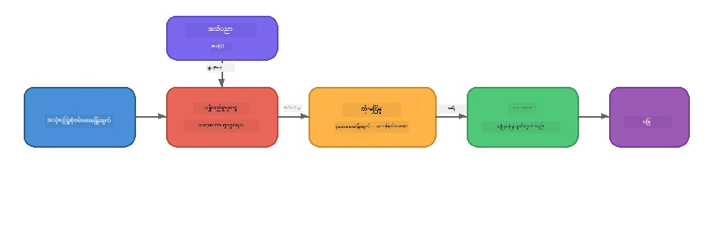

# အပိုင်း ၄: Foundry Local ဖြင့် RAG လျှပ်စစ်လိပ်တွဲအက်ပလီကေးရှင်း တည်ဆောက်ခြင်း

## အကျဉ်းချုပ်

ကြီးမားသောဘာသာစကားမော်ဒယ်များသည်အင်အားပြင်း लेकिन वे केवल अपने प्रशिक्षण डेटा में मौजूद चीजों को जानते हैं။ **ပြန်ဆွဲယူ၍ ဗဟုသုတဖြည့်စွက်ထုတ်လုပ်ခြင်း (Retrieval-Augmented Generation, RAG)** သည် မော်ဒယ်အား မေးစရာအချိန်တွင် သင်၏ကိုယ်ပိုင်စာရွက်စာတမ်းများ၊ ဒေတာဘေ့စ်များ သို့မဟုတ် ဗဟုသုတအခြေခံများမှ ဆွဲထုတ်ထားသည့် သက်ဆိုင်သော စာရွက်စာတမ်းများကို ရရှိစေခြင်းဖြင့် ဖြေရှင်းပေးသည်။

ဤသင်ခန်းစာတွင် သင်သည် Foundry Local အသုံးပြု၍ **သင်၏စက်ပစ္စည်းပေါ်တွင် တစ်ပြိုင်နက်လုံး ပြေးနိုင်သော** RAG လမ်းကြောင်းတစ်ခု တည်ဆောက်မည် ဖြစ်သည်။ မိုဃ်းတိမ်ဝန်ဆောင်မှုများမရှိ၊ ဗက်တာဒေတာဘေ့စ်မရှိ၊ embeddings API မပါ၊ တစ်ကားမှ ပြန်ဆွဲယူမှုနှင့် ဒေသတွင်းမော်ဒယ်တွဲပြေးမှုသာ ရှိသည်။

## သင်ယူရမည့်ရည်ရွယ်ချက်များ

ဤသင်ခန်းစာ၏ အဆုံးတွင် သင်သည်:

- RAG ဆိုသည်မှာ 무엇이며 AI အက်ပလီကေးရှင်းများအတွက် အရင်းအမြစ်ပါပဲဆိုတာရှင်းပြနိုင်မည်။
- စာရွက်စာတမ်းများမှ ဒေသအခြေခံဗဟုသုတအခြေခံတစ်ခု တည်ဆောက်နိုင်မည်။
- သက်ဆိုင်သော ပမာဏကို ရှာဖွေရေးလုပ်ဆောင်ချက် တစ်ခု လုပ်ဆောင်နိုင်မည်။
- ရရှိသော အချက်အလက်များနှင့် မော်ဒယ်ကိုထား၍ စနစ်ပုံတစ်ခု ရေးသားနိုင်မည်။
- Retrieve → Augment → Generate ပိုင်းစပ်မော်ဒယ်ကို စက်ပေါ်ပေါ်တွင် ပြေးဆွဲနိုင်မည်။
- စာလုံးအဓိပ္ပာယ်ကို မသိသော keyword retrieval နှင့် vector ရှာဖွေမှုတို့၏ အနုညဏ်နဲ ့ အားသာချက်များကို နားလည်နိုင်မည်။

---

## ကြိုတင်လိုအပ်ချက်များ

- [အပိုင်း ၃: Foundry Local SDK နှင့် OpenAI အသုံးပြုခြင်း](part3-sdk-and-apis.md) ပြီးစီးပြီးဖြစ်ရမည်။
- Foundry Local CLI တပ်ဆင်ပြီး `phi-3.5-mini` မော်ဒယ် ဒေါင်းလုဒ်ပြီးဖြစ်ရမည်။

---

## ယုတ်မာအချက်: RAG ဆိုတာဘာလဲ?

RAG မပါက LLM သည် ၎င်း၏လေ့ကျင့်ရေးဒေတာမှသာ ဖြေဆိုနိုင်သည် - အချက်အလက်ဟပ်ဆဲ၊ မပြည့်စုံခြင်း၊ သင်၏ပုဂ္ဂိုလ်ရေးအချက်အလက် မပါနိုင်ပါ:

```
User: "What is Zava's return policy?"
LLM:  "I do not have information about Zava's return policy."  ← No context!
```
  
RAG ဖြင့် သင်သည် ပထမဦးစွာ သက်ဆိုင်သော စာရွက်စာတမ်းများကို **ပြန်ဆွဲယူ** ပြီးနောက် **ဖော်ပြချက်ကို အချက်အလက်ဖြင့် ဖြည့်စွက်** ပြုပြင်ပြီး **ဖြေကြားချက်ကို ထုတ်လုပ်** ပါသည်:



အဓိက သိမြင်ချက်မှာ - **မော်ဒယ်သည် ဖြေမည့်အဖြေကို "သိ"နေစရာ မလိုပဲ စာရွက်စာတမ်းမှန်ကို ဖတ်နိုင်မှုသာ လိုအပ်သည်။**

---

## သင်ခန်းစာလေ့ကျင့်မှုများ

### လေ့ကျင့်မှု ၁: ဗဟုသုတအခြေခံကို နားလည်ခြင်း

သင်၏ဘာသာစကားအတွက် RAG ဥပမာကို ဖြင့် ဖတ်ရှု၍ ဗဟုသုတအခြေခံကို ကြည့်ရှုပါ:

<details>
<summary><b>🐍 Python: <code>python/foundry-local-rag.py</code></b></summary>

ဗဟုသုတအခြေခံမှာ `title` နဲ့ `content` ကို ထည့်သွင်းထားသော စာအုပ်ကဏ္ဍစာရင်း လေးတစ်ခုဖြစ်သည်။

```python
KNOWLEDGE_BASE = [
    {
        "title": "Foundry Local Overview",
        "content": (
            "Foundry Local brings the power of Azure AI Foundry to your local "
            "device without requiring an Azure subscription..."
        ),
    },
    {
        "title": "Supported Hardware",
        "content": (
            "Foundry Local automatically selects the best model variant for "
            "your hardware. If you have an Nvidia CUDA GPU it downloads the "
            "CUDA-optimized model..."
        ),
    },
    # ... ပို entry များ
]
```
  
တစ်ခုပြု လေ့လာချက်သည် သတင်းအချက်အလက်တစ်ခုပြီးတစ်ခုအား တိကျစွာပြုပြင်ထားသည့် "ချပ်" တစ်ခု ဖြစ်သည်။

</details>

<details>
<summary><b>📘 JavaScript: <code>javascript/foundry-local-rag.mjs</code></b></summary>

ဗဟုသုတအခြေခံမှာ အရာဝတ္ထုများသော စာရင်းတစ်ခု အနေနဲ့ အသုံးပြုထားသည်။

```javascript
const KNOWLEDGE_BASE = [
  {
    title: "Foundry Local Overview",
    content:
      "Foundry Local brings the power of Azure AI Foundry to your local " +
      "device without requiring an Azure subscription...",
  },
  {
    title: "Supported Hardware",
    content:
      "Foundry Local automatically selects the best model variant for " +
      "your hardware...",
  },
  // ... ထပ်မံသော အချက်များ
];
```

</details>

<details>
<summary><b>💜 C#: <code>csharp/RagPipeline.cs</code></b></summary>

ဗဟုသုတအခြေခံမှာ နာမည်ပါတဲ့ tuple စာရင်းတစ်ခုကို အသုံးပြုသည်။

```csharp
private static readonly List<(string Title, string Content)> KnowledgeBase =
[
    ("Foundry Local Overview",
     "Foundry Local brings the power of Azure AI Foundry to your local " +
     "device without requiring an Azure subscription..."),

    ("Supported Hardware",
     "Foundry Local automatically selects the best model variant for " +
     "your hardware..."),

    // ... more entries
];
```

</details>

> **တကယ့်အက်ပလီကေးရှင်းတွင်** ဗဟုသုတအခြေခံရင်းမြစ်သည် ဖိုင်၊ ဒေတာဘေ့စ်၊ ရှာဖွေရေးအညွှန်းတာရ၊ သို့မဟုတ် API မှလာပါမည်။ ဤသင်ခန်းစာအတွက် လွယ်ကူစေရန် မှတ်ဉာဏ်တွင်းစာရင်းကို အသုံးပြုထားသည်။

---

### လေ့ကျင့်မှု ၂: ပြန်ဆွဲယူမှုပုံစံ နားလည်ခြင်း

ပြန်ဆွဲယူခြင်းအဆင့်သည် အသုံးပြုသူ၏မေးခွန်းအတွက် အရေးပါတဲ့ ချပ်များကို ရှာဖွေသည်။ ဤဥပမာတွင် **keywords ထပ်တလဲလဲ**၏အရေအတွက်ကို ထည့်သွင်းတွက်ချက်ပါသည်။

<details>
<summary><b>🐍 Python</b></summary>

```python
def retrieve(query: str, top_k: int = 2) -> list[dict]:
    """Return the top-k knowledge chunks most relevant to the query."""
    query_words = set(query.lower().split())
    scored = []
    for chunk in KNOWLEDGE_BASE:
        chunk_words = set(chunk["content"].lower().split())
        overlap = len(query_words & chunk_words)
        scored.append((overlap, chunk))
    scored.sort(key=lambda x: x[0], reverse=True)
    return [item[1] for item in scored[:top_k]]
```

</details>

<details>
<summary><b>📘 JavaScript</b></summary>

```javascript
function retrieve(query, topK = 2) {
  const queryWords = new Set(query.toLowerCase().split(/\s+/));
  const scored = KNOWLEDGE_BASE.map((chunk) => {
    const chunkWords = new Set(chunk.content.toLowerCase().split(/\s+/));
    let overlap = 0;
    for (const w of queryWords) {
      if (chunkWords.has(w)) overlap++;
    }
    return { overlap, chunk };
  });
  scored.sort((a, b) => b.overlap - a.overlap);
  return scored.slice(0, topK).map((s) => s.chunk);
}
```

</details>

<details>
<summary><b>💜 C#</b></summary>

```csharp
private static List<(string Title, string Content)> Retrieve(string query, int topK = 2)
{
    var queryWords = new HashSet<string>(
        query.ToLowerInvariant().Split(' ', StringSplitOptions.RemoveEmptyEntries));

    return KnowledgeBase
        .Select(chunk =>
        {
            var chunkWords = new HashSet<string>(
                chunk.Content.ToLowerInvariant().Split(' ', StringSplitOptions.RemoveEmptyEntries));
            var overlap = queryWords.Intersect(chunkWords).Count();
            return (Overlap: overlap, Chunk: chunk);
        })
        .OrderByDescending(x => x.Overlap)
        .Take(topK)
        .Select(x => x.Chunk)
        .ToList();
}
```

</details>

**လုပ်ဆောင်ပုံ:**  
1. မေးခွန်းကို စကားလုံးတစ်လုံးချင်းခွဲသည်  
2. knowledge chunk တစ်ခုချင်းစီတွင် မေးခွန်း စကားလုံးမှတ်စုများ ဘယ်နှစ်လုံး ပါဝင်ကြောင်း တွက်ချက်သည်  
3. ထိပ်တန်းအဆင့်အတွက် overlap score အလိုက် ခွဲစီသည် (အမြင့်ဆုံးမှ စ)  
4. အရေးပါတဲ့ ချပ်အချို့ကို top-k အနေနဲ့ ပြန်အမ်းသည်

> **ကန့်သတ်ချက်:** Keyword overlap သည် ရိုးလေးလေးမျိုး ဖြစ်သော်လည်း သက်ဆိုင်ရာ ဝေါဟာရနှင့် အဓိပ္ပာယ်ကို မသိမြင်နိုင်ပါ။ အလုပ်ငန်းအသုံးချ RAG စနစ်များတွင် သာမာန်အားဖြင့် **embedding vectors** နှင့် **vector database** ကို စူးစမ်းရေးအတွက် အသုံးပြုကြသည်။ သို့သော် keyword overlap သည် စတင်ရန် ကောင်းမွန်ပြီး အပိုပစ္စည်းမလိုအပ်ပါ။

---

### လေ့ကျင့်မှု ၃: Augmented Prompt ကို နားလည်ခြင်း

ရရှိသော အချက်အလက်ကို မော်ဒယ်သို့ ပို့ရန်မတိုင်ခင် **စနစ်ပရိုမ့်** ထဲသို့ ထည့်သွင်းသည်။

```python
system_prompt = (
    "You are a helpful assistant. Answer the user's question using ONLY "
    "the information provided in the context below. If the context does "
    "not contain enough information, say so.\n\n"
    f"Context:\n{context_text}"
)
```
  
အဓိက ဒီဇိုင်းဆုံးဖြတ်ချက်များ:  
- **"ထောက်ပံ့သော အချက်အလက်ပဲ"** - မော်ဒယ်ကို ဖန်ဆင်းချက်အမှားမဖြစ်ပေါ်စေခြင်း  
- **"အချက်အလက် မလုံလောက်ပါက ထုတ်ပြန်ရန်"** - "မသိပါ" ဖြေဆိုရန် သြဇာရှိစေခြင်း  
- စနစ်သတင်းပို့ဆောင်မှုတွင် အချက်အလက်ထားရှိမှုသည် အဖြေတစ်ခုချင်းစီကို ပုံသဏ္ဍာန်ပေးသည်

---

### လေ့ကျင့်မှု ၄: RAG လမ်းကြောင်းကို ပြေးပါ

အပြည့်အစုံ ဥပမာကို ပြေးပါ:

**Python:**  
```bash
cd python
python foundry-local-rag.py
```
  
**JavaScript:**  
```bash
cd javascript
node foundry-local-rag.mjs
```
  
**C#:**  
```bash
cd csharp
dotnet run rag
```
  
သင်မြင်ရမယ့် အသုံးအနှုန်းတွေမှာ-  
1. **မေးခွန်းကို**  
2. **ပြန်ဆွဲယူသည့် အချက်အလက်များ** - ဗဟုသုတအခြေခြေနှင့် ရွေးချယ်ခြင်း  
3. **ဖြေကြားချက်** - အချက်အလက်အရသာတရားအတိုင်း မော်ဒယ်မှ ထုတ်လုပ်ချက်

ဥပမာ output:  
```
Question: How do I install Foundry Local and what hardware does it support?

--- Retrieved Context ---
### Installation
On Windows install Foundry Local with: winget install Microsoft.FoundryLocal...

### Supported Hardware
Foundry Local automatically selects the best model variant for your hardware...
-------------------------

Answer: To install Foundry Local, you can use the following methods depending
on your operating system: On Windows, run `winget install Microsoft.FoundryLocal`.
On macOS, use `brew install microsoft/foundrylocal/foundrylocal`...
```
  
မော်ဒယ်၏ဖြေကြားချက်သည် ပြန်ဆွဲယူထားသောအချက်အလက်များအပေါ် **အခြေခံထားသည်**ကို သတိပြုပါ - ဗဟုသုတဖြစ်သော စာရွက်စာတမ်းတို့၏ အချက်အလက်များကိုသာ ဖေါ်ပြသည်။

---

### လေ့ကျင့်မှု ၅: စမ်းသပ်တိုးချဲ့ပါ

နားလည်မှုပိုထွားစေရန် အောက်ပါပြင်ဆင်မှုများ စမ်းကြည့်ပါ -

1. **မေးခွန်းပြောင်းပါ** - ဗဟုသုတအခြေခံထဲတွင် ရှိသောမေးခွန်းနှင့် မရှိသောမေးခွန်း တို့ကို မေးပါ:  
   ```python
   question = "What programming languages does Foundry Local support?"  # ← အကြောင်းအရာအတွင်းတွင်
   question = "How much does Foundry Local cost?"                       # ← အကြောင်းအရာအတွင်းမဟုတ်ပါ
   ```
  
အဖြေမရှိပါက မော်ဒယ်သည် "မသိပါ" ဟု မှန်ကန်တိကျစွာ ပြောပါသလား?

2. **ဗဟုသုတချပ်အသစ် ထပ်ထည့်ပါ** - `KNOWLEDGE_BASE` တွင် အချက်အသစ် ထည့်ပါ:  
   ```python
   {
       "title": "Pricing",
       "content": "Foundry Local is completely free and open source under the MIT license.",
   }
   ```
  
နောက်ပြီး ကျသင့်ငွေမေးခွန်းကို ထပ်မေးပါ။

3. **`top_k` ပြောင်းပါ** - ပိုမိုသော်လည်း ကြာမှုသော်လည်း ချပ်များ ရှာဖွေခြင်း:  
   ```python
   context_chunks = retrieve(question, top_k=3)  # ပို၍အကြောင်းအရာ
   context_chunks = retrieve(question, top_k=1)  # နည်းသောအကြောင်းအရာ
   ```
  
အချက်အလက် အရေအတွက်သည် အဖြေ၏အရည်အသွေးကို မည်သို့ သက်ရောက်စေသနည်း?

4. **Foundation prompt မပါဟု ပြောင်းပါ** - စနစ်ပရိုမ့်ကို "You are a helpful assistant." သို့ပြောင်း၍ မော်ဒယ်သည် စိတ်ကူးဖန်တီးချက်ဖြစ်ပေါ်မှုရှိသလား စစ်ဆေးပါ။

---

## နက်နဲစွာလေ့လာခြင်း: On-Device စွမ်းဆောင်ရည်အတွက် RAG ကို အဆင်ပြေအောင်လုပ်ခြင်း

On-device တွင် RAG ကို ပြေးသည်မှာ မိုဃ်းတိမ်သို့ မဖြစ်မနေရှိသော သင့်တော်မှုများ (RAM လျော့နည်းခြင်း၊ GPU မရှိခြင်း (CPU/NPU အသုံးပြုခြင်း), မော်ဒယ် context window သေးငယ်ခြင်း) စိန်ခေါ်မှုများ ကြုံတွေ့ရသည်။ ဒီအစီအစဉ်တွင် Foundry Local ဖြင့် ထုတ်လုပ်မှုစတိုင် RAG ဒေသအခြေခံ လျှပ်စစ်လိပ်တွဲများတွင် အသုံးပြုနေသော ပုံစံများအပေါ် မူတည်၍ ဒီအတွက် အထူးဖြေရှင်းချက်များ တင်ပြသည်။

### Chunking မူဝါဒ: တင်းကျပ်ထားသော လှိမ့်ပြေး မျက်နှာပြင်

document များကို အပိုင်းသေးသေးသို ဝေခြင်းသည် RAG စနစ်ကြီး မည်သို့ လုပ်ဆောင်ရမည်ကို သတ်မှတ်ခြင်း ဖြစ်သည်။ On-device တွင် **တင်းကျပ်ထားသော overlap ပါသော လှိမ့်ပြေးမူဝါဒ** ကို စတင်အဖြစ် အသုံးပြုရန်အကြံပြုသည် -

| ပါရာမီတာ | အကြံပြုတန်ဖိုး | အကြောင်းရင်း |
|-----------|------------------|-------------|
| **Chunk အရွယ်အစား** | ~200 tokens | ပြန်ဆွဲယူသောအချက်အလက်သည် ကြောင်းအတို နှင့်အတူ compact ဖြစ်စေ၍ Phi-3.5 Mini ၏ context window တွင် စနစ်ပရိုမ့်၊ စကားပြောသမိုင်းပြီး စနစ်ထုတ်လုပ်မှုတို့အတွက် နေရာရစေသည် |
| **Overlap** | ~25 tokens (12.5%) | ချပ်နယ်နိမိတ်တွင် အချက်အလက် လျော့ကျမှုရှောင်ရန် အရေးကြီးသည် - လုပ်ထုံးလုပ်နည်းများနှင့် လမ်းညွှန်ချက်များအတွက် ဇယားရှင်းစေရန် |
| **Tokenization** | အဖွဲ့ဖြင့်ခွဲခြား | မလိုအပ်သော dependency မရှိ၊ tokenizer စာကြောင်းစီ ထည့်သွင်းရန်မလိုဘဲ ဤကုဒ်လွယ်ကူစေသည်။ LLM နှင့်ပတ်သက်သော စကုန်တွေ ထိန်းသိမ်းကိုယ်က်ဆုံးသော |

Overlap သည် လှိမ့်ပြေးမူဝါဒတစ်ခုကဲ့သို့ အလုပ်လုပ်သည့်အတွက် ကားချပ်အသစ်သည် ယခင်ချပ်ပြီးဆုံးသည့်နေရာမှ 25 tokens သိပ်ပြီး စတင်သည်။ ဒါမှတဆင့် ဝေါဟာရများကို နှစ်ချပ်တွင်ပေါင်းစပ်ဖော်ပြနိုင်သည်။

> **ဘာကြောင့် အခြား နည်းလမ်းများ မသုံးရသလဲ?**  
> - **ဝေါဟာရအခြေသတ်ရွက်ခြင်း**သည် ချပ်အရွယ်အစား မတည်ငြိမ်ဘဲ ဖြစ်စေသည်။ မတည်ငြိမ်သော ဝါကျကြီးတစ်ခုကို မော်ဒယ်အောင် စီမံနိုင်စေရန် မကောင်းသေးပါ။  
> - **အခန်းပိုင်းအခြေခံခွဲခြမ်းခြင်း** (## ခေါင်းစဉ်များ) သည် ချပ်အရွယ်အစား တစ်ခုတည်း မဟုတ်ပဲ ပြောင်းလဲမှုများ ဖြစ်စေသည်။ မော်ဒယ်၏ context window အတွက် သိပ်သိမ်သော သို့မဟုတ် ငယ်_TOOကြီးသော ချပ်များ တွေ့ရသည်။  
> - **Semantic chunking** (embedding အသုံးပြုပြီး အကြောင်းအရာ ဖော်ထုတ်ခြင်း) သည် အကောင်းဆုံး ပြန်ဆွဲယူမှု ရရှိစေသော်လည်း Phi-3.5 Mini နှင့်အတူ သုံးရန် နောက်ထပ် မော်ဒယ် တစ်ခု အသုံးပြုရန် လိုအပ်ပြီး shared memory 8-16GB ကောင်းစွာမရှိသော စက်များတွင် ကျဉ်းမြောင်းအန္တရာယ်ရှိသည်။

### Retrieval မြှင့်တင်ရန်: TF-IDF vectors

ဤသင်ခန်းစာတွင် keyword overlap သုံးသော်လည်း embedding မော်ဒယ်မပါဘဲ ပိုမိုကောင်းမွန်သော retrieval ဖို့ **TF-IDF (Term Frequency-Inverse Document Frequency)** သည် အလယ်အလတ် အနိမ့်နိမ့်နည်းတစ်ခုဖြစ်သည်။

```
Keyword Overlap  →  TF-IDF Vectors  →  Embedding Models
    (this lab)     (lightweight upgrade)   (production)
  Simple & fast    Better ranking,         Best quality,
  No dependencies  still no ML model       requires embedding model
  ~Basic matching  ~1ms retrieval          ~100-500ms per query
```
  
TF-IDF သည် မည်သည့်စကားလုံးသည် ချပ်တစ်ခုပေါ်တွင် အရေးပါမည်ကို အခြေခံပြီး numeric vector အဖြစ် သတ်မှတ်သည်။ မေးခွန်းလည်း တူညီတဲ့နည်းဖြင့် vectorize ပြုပြင်ပြီး cosine similarity ဧရိယာသုံး၍ နှိုင်းယှဉ်သည်။ SQLite နှင့် JavaScript/Python သန့်ရှင်းသောအားဖြင့် ဆောက်ထားနိုင်ပြီး vector database သို့ embedding API မလို။

> **စွမ်းဆောင်ရည်:** TF-IDF cosine similarity တန်းတူ ချပ်များ ပေါ်တွင် ခုနှစ် milliseconds (~1ms) တွင် ပြန်ဆွဲယူနိုင်သည်။ embedding မော်ဒယ်အသုံးပြုသူများ၏ response အချိန် ~100-500ms ဖြစ်သည်။ 20+ စာရွက်များအား ခုနှစ်စီချထားပြီး တချက်တည်း indexing လုပ်လို့ရသည်။

### ကန့်သတ်ထားသော စက်များအတွက် Edge/Compact Mode

အထူးသဖြင့် အိုလ်နှင့် အသက်ရှည်ကြောင်းရှိသော စက်များ (နွားမရှိသောအဟောင်းလပ်တော့ပ်များ၊ တက်ဘလက်များ၊ စက်ကိရိယာများ) တွင် လျော့နည်းသော အရင်းအမြစ်အသုံးပြုမှုလိုအပ်လျှင် -

| ချိန်ညှိချက် | စံနမူနာမုဒ် | Edge/Compact Mode |
|--------------|--------------|-------------------|
| **စနစ်ပရိုမ့်** | ~300 tokens | ~80 tokens |
| **အမြင့်ဆုံး output tokens** | 1024 | 512 |
| **ပြန်ဆွဲယူသည့် ချပ်အရေအတွက် (top-k)** | 5 | 3 |

ပြန်ဆွဲယူသည့် ချပ် အနည်းငယ်လျှင် မော်ဒယ်လုပ် စဉ်အတွင်း စုဆောင်းမှု လျော့နည်းပြီး ဖြစ်ရပ်မှတ်ချက်နှင့် မေတ္တာဆောင်မှုလုပ်ငန်းနည်းမကောင်းမှု လျော့နည်းစေသည်။ ချိုင့်၍ စနစ် ပရိုမ့်ကို လျှော့ချပ်ခြင်းသည် ဖြေဆိုလိုသော အဖြေတွင် နေရာပို ပေးပြီး latency လျှော့နည်းသည်။ အချက်အလက် window တစ်ခု လက်တေလက်ကို ထည့်သွင်းရမည့် device များတွင် ဤ trade-off သည် အသုံးဝင်သည်။

### စက်မှတ်ဉာဏ်ထဲ မော်ဒယ်တစ်ခုတည်းသာ

On-device RAG အတွက် အရေးပါဆုံးအချက်မှာ **မော်ဒယ်တစ်ခုတည်းသာ load ထားပါ**။ retrieval အတွက် embedding မော်ဒယ်နှင့် မော်ဒယ်ထုတ်လုပ်မှု Language Model နှစ်ခု သုံးမည်ဆိုပါက RAM၊ NPU အရင်းအမြစ် များကို နှစ်ခုကြား ဖြန့်ချပေးရမည် ဖြစ်သည်။ နူးညံ့သည့် retrieval (keyword overlap, TF-IDF) သည် ဤအချက်ကင်းစင်စေသည်။

- Embedding မော်ဒယ်လည်း LLM နှင့် အသုံးပြုနေခြင်းမရှိပါ  
- စတင်ချိန် အဆင်ပြေခြင်း - မော်ဒယ်တစ်ခုသာ load လိုက်သည်  
- RAM အသုံးပြုမှု သေချာသည် - LLM သာ RAM ရရှိသည်  
- 8 GB RAM အနည်းငယ်နှင့် CPU-သာ စက်များတွင် အလုပ်လုပ်နိုင်သည်

### ဒေသအခြေခံ Vector Store အဖြစ် SQLite

စာရွက်စာတမ်းစုစည်းမှုပမာဏ သေးငယ်မှ အလယ်အလတ် (ချက်ပေါင်း သန်းနည်း) အတွက် SQLite သည် brute-force cosine similarity ရှာဖွေမှုအတွက် လုံလောက်သော မြန်နှုန်း ရှိပြီး infrastructure မလို။

- disk ပေါ်တွင် .db ဖိုင်တစ်ခုသာ - server process မလို၊ configuration မလို  
- တိုင်းပြည် စာသားတစ်ခုချင်း runtime များတွင် ပါဝင် (Python `sqlite3`, Node.js `better-sqlite3`, .NET `Microsoft.Data.Sqlite`)  
- document chunk တစ်ခုချင်းအား TF-IDF vectors တို့နှင့် တစ်ဇယားတွင် သိမ်းဆည်းသည်  
- Pinecone၊ Qdrant၊ Chroma၊ FAISS မလိုအပ်

### စွမ်းဆောင်ရည် အနှစ်ချုပ်

ဒီဒီဇိုင်းများက On-device အတွက် ဖြစ်တည်သော RAG ကို မြန်ဆန် စေသည် -

| ဇယားရှု၍ | စက်ပေါ် စွမ်းဆောင်ရည် |
|------------|-----------------|
| **ပြန်ဆွဲယူစာဆိုင်း** | ~1ms (TF-IDF) မှ ~5ms (keyword overlap) အထိ |
| **ထည့်သွင်းမှု မြန်နှုန်း** | 20 စာရွက်များကို ချပ်ပြန်ထည့်ပြီး < 1 စက္ကန့်တွင် |
| **မွမ်းမံထားသော မော်ဒယ် အရေအတွက်** | 1 (LLM သာ - embedding မပါ) |
| **သိုလှောင်မှုအပိုဆောင်း** | SQLite တွင် ချပ်နှင့် vectors အတွက် < 1 MB |
| **စတင်ချိန်** | မော်ဒယ်တစ်ခု သာ load၊ embedding runtime မရှိ |
| **စက် ထောက်ပံ့မှု အနိမ့်ဆုံး** | 8 GB RAM, CPU - GPU မလိုအပ်ပါ |

> **ပြောင်းလဲချိန်:** စာရွက်အရွယ်အစားရှိလာပြီး mix content (ဇယား၊ ကုဒ်၊ စာသား) များနှင့် semantic query နားလည်မှု လိုတယ်ဆိုရင် embedding မော်ဒယ် သို့ vector similarity ရှာဖွေမှုဆီ ပြောင်းပါ။ On-device အတွက် ကန့်သတ်ချက်များရှိသော စာရွက်များအတွက် TF-IDF + SQLite သည် အရမ်းတိကျသော ရလဒ် ယူလာစေသည်။

---

## အဓိက အယူအဆများ

| အယူအဆ | ဖော်ပြချက် |
|---------|-------------|
| **ပြန်ဆွဲယူခြင်း** | အသုံးပြုသူမေးခွန်းအရ သက်ဆိုင်သော စာရွက်စာတမ်းရှာဖွေခြင်း |
| **ဖြည့်စွက်ခြင်း** | ပြန်ဆွဲယူထားသော စာရွက်များကို prompt ထဲထည့်ခြင်း |
| **ထုတ်လုပ်ခြင်း** | LLM သည် ထောက်ပံ့ထားသော အသွင်အပြင်များအပေါ်အခြေခံ၍ ဖြေဖြစ်ထုတ်ခြင်း |
| **ချပ်ဖွဲ့ခြင်း** | ကြီးမားသော စာရွက်စာတမ်းများကို အပိုင်းသေးသေးဖြင့် ခွဲခြမ်းခြင်း |
| **အခြေခံခြင်း** | မော်ဒယ်ကို အချက်အလက်များထဲမှသာ အသုံးပြုရန် ကန့်သတ်ခြင်း (Hallucination လျော့စေသည်) |
| **top-k** | ပြန်ဆွဲယူရန် အရေးပါတဲ့ ချပ်အရေအတွက် |

---

## Production RAG နှင့် ဤသင်ခန်းစာ

| ဘက် | ဤသင်ခန်းစာ | On-Device အဆင်ပြေအောင် | မိုဃ်းတိမ် Production |
|-------|-------------|-----------------|----------------|
| **ဗဟုသုတအခြေခံ** | မှတ်ဉာဏ်စာရင်း | ဖိုင်များ၊ SQLite | ဒေတာဘေ့စ်၊ ရှာဖွေရေးအညွှန်း |
| **ပြန်ဆွဲယူခြင်း** | Keywords overlap | TF-IDF + cosine similarity | Vector embeddings + similarity search |
| **Embedding မော်ဒယ်** | မလိုအပ် | မလိုအပ် - TF-IDF vectors | embedding မော်ဒယ် (ဒေသတွင်း/မိုဃ်းတိမ်) |
| **Vector ဆိုင့်င်** | မလိုအပ် | SQLite (.db ဖိုင်တစ်ခု) | FAISS, Chroma, Azure AI Search စသည် |
| **ချပ်ဖွဲ့ခြင်း** | ကိုယ်တိုင် | တင်းကျပ်ထားသော လှိမ့်ပြေး (~200 tokens, 25 token overlap) | Semantic သို့ recursive ခွဲခြမ်းခြင်း |
| **မွမ်းမံထားသော မော်ဒယ်အရေအတွက်** | 1 (LLM) | 1 (LLM) | 2+ (embedding + LLM) |
| **ထုတ်ယူရမည့်ချိန်နှေးကွေးမှု** | ~5ms | ~1ms | ~100-500ms |
| **အတိုင်းအတာ** | စာရွက် 5 စောင် | စာရွက်ရာများ | မီလီယံစာရွက်များ |

ဒီမှာ သင်သင်ယူထားတဲ့ ပုံစံများ (ထုတ်ယူသည်၊ တိုးချဲ့သည်၊ ဖန်တီးသည်) ဟာ ဘယ်အတိုင်းအတာမှာမဆို တူညီတယ်။ ထုတ်ယူနည်းက ကောင်းမွန်လာပေမယ့် စုစုပေါင်း စနစ်တကျတည်ဆောက်မှုတူညီနေဆဲဖြစ်တယ်။ အလယ်ကော်လံမှာ=device တွေမှာ သေးငယ်တဲ့ နည်းလမ်းတွေနဲ့ လုပ်နိုင်သမျှကို ပြထားတာဖြစ်ပြီး၊ ဒါဟာ cloud အတိုင်းအတာကို privacy၊ offline လုပ်ဆောင်မှုနဲ့ ပြင်ပဝန်ဆောင်မှုတွေရဲ့ အချိန်နောက်ကျမှုမရှိခြင်းအတွက် trade-off လုပ်တဲ့ ဒေသတွင်း လျှောက်လွှာများအတွက် အသင့်လျော်ဆုံး နေရာဖြစ်ပါတယ်။

---

## အဓိက သဘောတရားများ

| သိ념 | သင်သင်ယူခဲ့သည်များ |
|---------|------------------|
| RAG ပုံစံ | Retrieve + Augment + Generate: မော်ဒယ်ကို ညီညာတဲ့ context ပေးပြီး သင့်ဒေတာအကြောင်း မေးခွန်းများကို ဖြေနိုင်စေသည် |
| Device အတွင်း | Cloud API များ သို့မဟုတ် vector database စာရင်းသွင်းမှု မလိုအပ်ဘဲ အားလုံးကို ဒေသတွင်း လည်ပတ်သည် |
| Grounding လမ်းညွှန်ချက်များ | Hallucination ဖြစ်မှုကို ရှောင်ထောင်ဖို့ system prompt အကန့်အသတ်များ မရှိမဖြစ်လိုအပ်သည် |
| Keyword တွေ ထပ်တူမှု | ဗဟုသုတရယူရနည်းအနေဖြင့် လွယ်ကူသော်လည်း ထိရောက်သော စတင်ရေးရာ |
| TF-IDF + SQLite | Embedding မော်ဒယ်မလိုဘဲ ထုတ်ယူမှု ~1ms အတွင်း ထိန်းသိမ်းနိုင်သော သေးငယ်တဲ့ တိုးတတ်နည်းလမ်း |
| မော်ဒယ်တစ်ခုကို မှတ်ဉာဏ်၌ ထားခြင်း | <br>ကန့်သတ်ချက်ရှိသော हार्डဝဲတွင် LLM နှင့်အတူ embedding မော်ဒယ်ကို loading မလုပ်ရန် ရှောင်ကြဉ်သည် |
| အပိုင်းအရွယ်အစား | အကြမ်းအားဖြင့် 200 token ခန့်နှင့် ထပ်တူမှုဟာ ထုတ်ယူမှု တိကျမှန်ကန်မှုနှင့် context အချက်အလက်ပြောသည့် အကျိုးရှိမှုကို လက်ညီစေသည် |
| Edge/compact mode | အလွန်ကန့်သတ်ထားသော စက်များအတွက် အပိုင်းများနည်းပြီး prompt များတိုခြင်းကို အသုံးပြုသည် |
| စီးပွားရေးပုံစံတစ်ခု | စာရွက်များ၊ ဒေတာဘေ့စ်များ၊ API များ သို့မဟုတ် ဝီကီများအတွက် တူညီသော RAG စနစ်တစ်ခု ဖြစ်သည် |

> **device အတွင်းလုံးဝ RAG လျှောက်လွှာတစ်ခုကိုတွေ့လိုပါသလား?** [Gas Field Local RAG](https://github.com/leestott/local-rag) ကိုကြည့်ပါ၊ Foundry Local နှင့် Phi-3.5 Mini ဖြင့် တည်ဆောက်ထားသော အထွေထွေ၀န်ဆောင်မှုရပ်တည်ရာ offline RAG agent ဖြစ်ပြီး ဒါတွေ Optimization ပုံစံများကို အမှန်တကယ် Document အစုတစ်စုနဲ့ ပြသထားသည်။

---

## နောက်ထပ်အဆင့်များ

Microsoft Agent Framework ကို သုံးပြီး persona များ၊ လမ်းညွှန်ချက်များနှင့် multi-turn ဆွေးနွေးမှုများဖြင့် သိပ္ပံနည်း Agent များ တည်ဆောက်နည်းကို သင်ယူရန် [ပိုင်း 5: AI Agent များ တည်ဆောက်ခြင်း](part5-single-agents.md) ဆက်လုပ်ဆောင်ပါ။

---

<!-- CO-OP TRANSLATOR DISCLAIMER START -->
**သတိပေးချက်**:
ဤစာရွက်ကို AI ဘာသာပြန်ဝန်ဆောင်မှု [Co-op Translator](https://github.com/Azure/co-op-translator) ဖြင့် ဘာသာပြန်ထားမှုဖြစ်ပါသည်။ ကျွန်ုပ်တို့သည် တိကျမှုအတွက် ကြိုးစားနေသော်လည်း စက်မှုဘာသာပြန်ခြင်းအနေဖြင့် အမှားများ သို့မဟုတ် မမှန်ကန်မှုများ အနည်းငယ်ပါဝင်နိုင်ကြောင်း သတိပြုပါရန် မေတ္တာရပ်ခံအပ်ပါသည်။ မူရင်းစာရွက်ကို မိဋ္ဌာန်ဘာသာဖြင့် သာမန်အားဖြင့် အတည်ပြုရရှိသည့် အရင်းအမြစ်အဖြစ် ယူဆသင့်ပါသည်။ အရေးကြီးသည့် သတင်းအချက်အလက်များအတွက် လူ့ပညာရှင်များဆီ မှ ဘာသာပြန်ခြင်းကို တိုက်တွန်းအပ်ပါသည်။ ဤဘာသာပြန်မှု ကို အသုံးပြုရာမှ ဖြစ်ပေါ်လာသော မမှန်ကန်သည့် နားလည်မှုများ သို့မဟုတ် မမှန်ကန်သည့် အဓိပ္ပါယ်ဖတ်ဆိုမှုများအတွက် ကျွန်ုပ်တို့ အာမခံမှု မပေးပါ။
<!-- CO-OP TRANSLATOR DISCLAIMER END -->