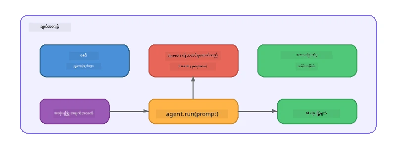

# အပိုင်း ၅: Agent Framework ဖြင့် AI ကိုယ်စားလှယ်များ ဆောက်လုပ်ခြင်း

> **ရည်ရွယ်ချက်။** Foundry Local မှ အစွမ်းကုန် တိုက်ရိုက်မော်ဒယ်ဖြင့် လုပ်ဆောင်ပေးသည့် ပိုင်နိုင်သော ညွှန်ကြားချက်များနှင့် သတ်မှတ်ထားသည့် အရည်အချင်းရှိ AI ကိုယ်စားလှယ် ပထမဆုံးဆောက်လုပ်ခြင်း။

## AI ကိုယ်စားလှယ်란 무엇인가요?

AI ကိုယ်စားလှယ်သည် လက်ရှိဘာသာစကားမော်ဒယ်ကို သူ၏ အပြုအမှု၊ ကိုယ်ရည်ကိုယ်သွေးနှင့် ကန့်သတ်ချက်များကို သတ်မှတ်သည့် **စနစ်ညွှန်ကြားချက်များ** ဖြင့် ဝတ်ဆင်ထားသည်။ တစ်ခါတည်း စကားပြောချက် ဖြည့်သွင်းမှု ခေါ်ဆိုမှုတစ်ခု နှင့်မတူဘဲ ကိုယ်စားလှယ်သည် အောက်ပါအရာများကို ပေးဆောင်သည် -

- **ကိုယ်ရည်ကိုယ်သွေး** - တိကျစဉ်ဆက် identity ("သင်မှာ အကူအညီရနိုင်သော ကုဒ်စစ်ဆေးသူ ဖြစ်သည်")
- **မှတ်ဉာဏ်** - စကားပြောဆက်တိုက်ပြောဆိုမှု မှတ်တမ်းများ
- **အထူးပြုလုပ်မှု** - အထူးသဖြင့် ကောင်းမွန်ကောင်းစွာ ဖန်တီးထားသည့် ညွှန်ကြားချက်များကြောင့် အပြုအမှု အာရုံစိုက်မှု



---

## Microsoft Agent Framework

**Microsoft Agent Framework** (AGF) သည် မတူညီသော မော်ဒယ် backend များတွင် အလျားလိုက် သုံးစွဲနိုင်သော ကိုယ်စားလှယ် abstraction ကို ပံ့ပိုးပေးသည်။ ဤအလုပ်ရုံဆုံတွင် Foundry Local နှင့် တွဲဖက် အသုံးပြု၍ ရှိသည့် စက်ပစ္စည်းပေါ်တွင် အကုန်လုံးကို အလုပ်လုပ်စေခြင်းဖြစ်သည် - Cloud မလိုအပ်ပါ။

| အယူအဆ | ဖော်ပြချက် |
|---------|-------------|
| `FoundryLocalClient` | Python: ဝန်ဆောင်မှုစတင်ခြင်း၊ မော်ဒယ်ဒေါင်းလုပ်/တင်ခြင်းနှင့် ကိုယ်စားလှယ်များ ဖန်တီးခြင်း ကို ကိုင်တွယ်သည် |
| `client.as_agent()` | Python: Foundry Local client မှ ကိုယ်စားလှယ်တစ်ဦး ဖန်တီးသည် |
| `AsAIAgent()` | C#: `ChatClient` တွင် extension method - `AIAgent` တစ်ခု ဖန်တီးသည် |
| `instructions` | ကိုယ်စားလှယ်၏ အပြုအမှုကို ပုံသဏ္ဍာန်ဆွဲသည့် စနစ် prompt |
| `name` | လူကြည့်ရလွယ်သော အမည်၊ ကိုယ်စားလှယ်များ အမျိုးမျိုးပါသော စနစ်တွင် အသုံးဝင်သည် |
| `agent.run(prompt)` / `RunAsync()` | အသုံးပြုသူစာစောင်တင်ပြီး ကိုယ်စားလှယ်တုံ့ပြန်ချက် ပြန်လည်ပေးပို့သည် |

> **မှတ်ချက်။** Agent Framework သည် Python နှင့် .NET SDK တို့ လည်း ပါဝင်သည်။ JavaScript အတွက်မှာ OpenAI SDK ကို တိုတိုတောင်းတောင်း သုံးပြီး အချို့ AGF ပုံစံနှင့် သဟဇာတ ဖြစ်သော `ChatAgent` class ကို ထပ်မံ အကောင်အထည်ဖော်ထားသည်။

---

## လေ့လာမှုများ

### လေ့လာမှု ၁ - ကိုယ်စားလှယ်ပုံစံကို နားလည်ပါ

ကုဒ်ရေးသားခင် ရှေ့ဆက် နာမည်ကျသော ကိုယ်စားလှယ် အစိတ်အပိုင်းများကို လေ့လာပါ -

1. **Model client** - Foundry Local ရဲ့ OpenAI ကိုက်ညီသည့် API နဲ့ ချိတ်ဆက်သည်
2. **စနစ်ညွှန်ကြားချက်များ** - "ကိုယ်ရည်ကိုယ်သွေး" prompt
3. **Run loop** - အသုံးပြုသူ input ပို့၊ output လက်ခံ

> **တွေးပါ။** စနစ်ညွှန်ကြားချက်များသည် ပုံမှန် အသုံးပြုသူစာစောင်များနှင့် ဘယ်လိုကွာခြားသနည်း? မည်သို့ပြောင်းလဲလျှင် ဖြစ်ပေါ်မည်နည်း?

---

### လေ့လာမှု ၂ - Single-Agent ဥပမာကို လည်ပတ်ခြင်း

<details>
<summary><strong>🐍 Python</strong></summary>

**လိုအပ်ချက်များ:**
```bash
cd python
python -m venv venv

# Windows (PowerShell):
venv\Scripts\Activate.ps1
# macOS:
source venv/bin/activate

pip install -r requirements.txt
```

**လည်ပတ်ရန်:**
```bash
python foundry-local-with-agf.py
```

**ကုဒ်ရှင်းပြချက်** (`python/foundry-local-with-agf.py`):

```python
import asyncio
from agent_framework_foundry_local import FoundryLocalClient

async def main():
    alias = "phi-4-mini"

    # FoundryLocalClient သည် service စတင်ခြင်း၊ မော်ဒယ်ဒေါင်းလုဒ်ခြင်းနှင့် โหลดခြင်းကို ကိုင်တွယ်သည်
    client = FoundryLocalClient(model_id=alias)
    print(f"Client Model ID: {client.model_id}")

    # စနစ်ညွှန်ကြားချက်များဖြင့် မေဂျင့်တစ်ခု ဖန်တီးပါ
    agent = client.as_agent(
        name="Joker",
        instructions="You are good at telling jokes.",
    )

    # မတစေ့စွဲသော streaming: တပြိုင်နက် ပြည့်စုံသော တုံ့ပြန်ချက်ကို ရယူပါ
    result = await agent.run("Tell me a joke about a pirate.")
    print(f"Agent: {result}")

    # Streaming: ဖန်တီးသည်အတိုင်း ရလဒ်များကို ရယူပါ
    async for chunk in agent.run("Tell me another joke.", stream=True):
        if chunk.text:
            print(chunk.text, end="", flush=True)

asyncio.run(main())
```

**အကြောင်းအရာ ပြင်ဆင်ချက်များ:**
- `FoundryLocalClient(model_id=alias)` သည် ဝန်ဆောင်မှုစတင်ခြင်း၊ ဒေါင်းလုပ်နှင့် မော်ဒယ်တင်ခြင်းကို တစ်ဆင့်ပြီး သာ ကိုင်တွယ်ပေးသည်
- `client.as_agent()` သည် စနစ်ညွှန်ကြားချက်နှင့် အမည်ပါသော ကိုယ်စားလှယ်ဖန်တီးသည်
- `agent.run()` သည် non-streaming နှင့် streaming များနှစ်မျိုးစလုံးအတွက် ပံ့ပိုးပေးသည်
- `pip install agent-framework-foundry-local --pre` ဖြင့် တပ်ဆင်ပါ

</details>

<details>
<summary><strong>📦 JavaScript</strong></summary>

**လိုအပ်ချက်များ:**
```bash
cd javascript
npm install
```

**လည်ပတ်ရန်:**
```bash
node foundry-local-with-agent.mjs
```

**ကုဒ်ရှင်းပြချက်** (`javascript/foundry-local-with-agent.mjs`):

```javascript
import { OpenAI } from "openai";
import { FoundryLocalManager } from "foundry-local-sdk";

class ChatAgent {
  constructor({ client, modelId, instructions, name }) {
    this.client = client;
    this.modelId = modelId;
    this.instructions = instructions;
    this.name = name;
    this.history = [];
  }

  async run(userMessage) {
    const messages = [
      { role: "system", content: this.instructions },
      ...this.history,
      { role: "user", content: userMessage },
    ];
    const response = await this.client.chat.completions.create({
      model: this.modelId,
      messages,
    });
    const assistantMessage = response.choices[0].message.content;

    // စကားပြောဆိုမှုဖြင့် လှုပ်ရှားမှုများအတွက် စကားပြောရာဇ၀င်သိုလှောင်ပါ
    this.history.push({ role: "user", content: userMessage });
    this.history.push({ role: "assistant", content: assistantMessage });
    return { text: assistantMessage };
  }
}

async function main() {
  FoundryLocalManager.create({ appName: "FoundryLocalWorkshop" });
  const manager = FoundryLocalManager.instance;
  await manager.startWebService();

  const catalog = manager.catalog;
  const model = await catalog.getModel("phi-3.5-mini");
  if (!model.isCached) {
    console.log("Downloading model: phi-3.5-mini...");
    await model.download();
  }
  await model.load();

  const client = new OpenAI({
    baseURL: manager.urls[0] + "/v1",
    apiKey: "foundry-local",
  });

  const agent = new ChatAgent({
    client,
    modelId: model.id,
    instructions: "You are good at telling jokes.",
    name: "Joker",
  });

  const result = await agent.run("Tell me a joke about a pirate.");
  console.log(result.text);
}

main();
```

**အချက် အလုံးချုပ်များ:**
- JavaScript သည် Python AGF ပုံစံနှင့်လိုက်ဖက်သော ကိုယ်ပိုင် `ChatAgent` class ကို တည်ဆောက်ထားသည်
- `this.history` သည် တစ်ခါပြောဆိုမှုမှ တစ်ခါပြောဆိုမှု အတွက် စကားဝိုင်းမှတ်တမ်းများကို သိမ်းဆည်းသည်
- `startWebService()` → cache စစ်ဆေးခြင်း → `model.download()` → `model.load()` ဖြင့် အပြည့်အစုံ ပေါ်လွင်သည်

</details>

<details>
<summary><strong>💜 C#</strong></summary>

**လိုအပ်ချက်များ:**
```bash
cd csharp
dotnet restore
```

**လည်ပတ်ရန်:**
```bash
dotnet run agent
```

**ကုဒ်ရှင်းပြချက်** (`csharp/SingleAgent.cs`):

```csharp
using Microsoft.AI.Foundry.Local;
using Microsoft.Extensions.Logging.Abstractions;
using Microsoft.Agents.AI;
using OpenAI;
using System.ClientModel;

// 1. Start Foundry Local and load a model
var alias = "phi-3.5-mini";
await FoundryLocalManager.CreateAsync(
    new Configuration
    {
        AppName = "FoundryLocalSamples",
        Web = new Configuration.WebService { Urls = "http://127.0.0.1:0" }
    }, NullLogger.Instance, default);
var manager = FoundryLocalManager.Instance;
await manager.StartWebServiceAsync(default);

var catalog = await manager.GetCatalogAsync(default);
var model = await catalog.GetModelAsync(alias, default);

var isCached = await model.IsCachedAsync(default);
if (!isCached)
{
    Console.WriteLine($"Downloading model: {alias}...");
    await model.DownloadAsync(null, default);
}
await model.LoadAsync(default);

var key = new ApiKeyCredential("foundry-local");
var client = new OpenAIClient(key, new OpenAIClientOptions
{
    Endpoint = new Uri(manager.Urls[0] + "/v1")
});

// 2. Create an AIAgent using the Agent Framework extension method
AIAgent joker = client
    .GetChatClient(model.Id)
    .AsAIAgent(
        instructions: "You are good at telling jokes. Keep your jokes short and family-friendly.",
        name: "Joker"
    );

// 3. Run the agent (non-streaming)
var response = await joker.RunAsync("Tell me a joke about a pirate.");
Console.WriteLine($"Joker: {response}");

// 4. Run with streaming
await foreach (var update in joker.RunStreamingAsync("Tell me another joke."))
{
    Console.Write(update);
}
```

**အကြောင်းအရာများ:**
- `AsAIAgent()` သည် `Microsoft.Agents.AI.OpenAI` မှ extension method ဖြစ်ပြီး ကိုယ်ပိုင် `ChatAgent` class မလိုအပ်ပါ
- `RunAsync()` သည် အပြည့်အစုံ တုံ့ပြန်ချက် ပြန်ပေးသည်။ `RunStreamingAsync()` သည် ကုဒ်တစ်လုံးချင်းစီ အသွားသွား Streaming
- `dotnet add package Microsoft.Agents.AI.OpenAI --version 1.0.0-rc3` ဖြင့် တပ်ဆင်ပါ

</details>

---

### လေ့လာမှု ၃ - ကိုယ်ရည်ကိုယ်သွေး ပြောင်းလဲခြင်း

ကိုယ်စားလှယ်၏ `instructions` ကို ပြောင်းလဲခြင်းဖြင့် အခြားကိုယ်ရည်ကိုယ်သွေး တစ်မျိုးဖန်တီးပါ။ တစ်ခုချင်းစီစမ်းသပ်ပြီးထွက်ရှိမှုကို တွေ့ကြပါ။

| ကိုယ်ရည်ကိုယ်သွေး | ညွှန်ကြားချက်များ |
|---------|-------------|
| ကုဒ်စစ်ဆေးသူ | `"သင်သည် နိုင်ငံတကာ ကျွမ်းကျင် ကုဒ်စစ်ဆေးသူဖြစ်သည်။ ဖတ်ရှုရလွယ်ကူမှု၊ အလုပ်ထိရောက်မှုနှင့် မှန်ကန်မှုများအပေါ် အာရုံစိုက်၍ ဖွံ့ဖြိုးတိုးတက်သော အသိပညာပေးပါ။"` |
| ခရီးသွားလမ်းညွှန် | `"သင်သည် နူးညံ့သန့်ရှင်းသော ခရီးသွားလမ်းညွှန်ဖြစ်သည်။ ခရီးစဉ်များ၊ လှုပ်ရှားမှုများနှင့် ဒေသတွင်း အစားအစာများအတွက် ကိုယ်တိုင်ပြောသည့် အကြံဉာဏ်များ ပေးပါ။"` |
| 소크라테스 သင်တန်းဆရာ | `"သင်သည် 소크라테스 သင်တန်းဆရာဖြစ်သည်။ တိုက်ရိုက်ဖြေဆိုမှု မပေးပါနှင့်။ မေးခွန်းများအား ဉာဏ်ဖွင့်ပေးခြင်းဖြင့် ကျောင်းသားကို ဦးဆောင်ပါ။"` |
| နည်းပညာစာရေးဆရာ | `"သင်သည် နည်းပညာစာရေးဆရာဖြစ်သည်။ အကြောင်းအရာများကို သေချာပြတ်သားစွာ ရှင်းပြပါ။ ဥပမာများ အသုံးပြုပါ။ စကားလုံးရှုပ်ထွေးမှု မသုံးပါ။"` |

**စမ်းသပ်ရန်:**
1. အပေါ်ဇယားမှ ကိုယ်ရည်ကိုယ်သွေး တစ်ခု ရွေးပါ
2. ကုဒ်အတွင်းရှိ `instructions` string ကို အဆိုပါသူတစ်ဦးနှင့် အစားထိုးပါ
3. အသုံးပြုသူ prompt ကို ကိုက်ညီအောင် ပြင်ဆင်ပါ (ဥပမာ - ကုဒ်စစ်ဆေးသူအား function တစ်ခုကို စစ်ဆေးရန် မေးပါ)
4. ဥပမာကို ထပ်မံ လည်ပတ်ပြီး ထွက်ရှိမှုကို နှိုင်းယှဉ်ကြည့်ပါ

> **အကြံပြုချက်။** ကိုယ်စားလှယ် လုပ်ဆောင်မှု အရည်အသွေးသည် ညွှန်ကြားချက်များပေါ် များစွာ မူတည်သည်။ သေချာ၊ ရိုးရှင်းစွာ ဖွဲ့စည်းထားသည့် ညွှန်ကြားချက်များက မကြောင့်ကောင်းသော ရလဒ်များ ပေးစွမ်းနိုင်သည်။

---

### လေ့လာမှု ၄ - စကားပြော ကိုယ်စားလှယ် များစွာ ဖြင့် ဆက်လက်ပြောဆိုခြင်း ထည့်သွင်းခြင်း

တစ်ကိုယ်စားလှယ်နှင့် မကောင်းတော့ပဲ စကားပြောရာ တစ်ခုချင်းစီ အထိ များသောကြာ ဒဏ်ကို ကိုယ်စားလှယ်နှင့် အမှန်တကယ် စကားပြောနိုင်ပါစေရန် ဥပမာကို တိုးချဲ့ပါ။

<details>
<summary><strong>🐍 Python - multi-turn loop</strong></summary>

```python
import asyncio
from agent_framework_foundry_local import FoundryLocalClient

async def main():
    client = FoundryLocalClient(model_id="phi-4-mini")

    agent = client.as_agent(
        name="Assistant",
        instructions="You are a helpful assistant.",
    )

    print("Chat with the agent (type 'quit' to exit):\n")
    while True:
        user_input = input("You: ")
        if user_input.strip().lower() in ("quit", "exit"):
            break
        result = await agent.run(user_input)
        print(f"Agent: {result}\n")

asyncio.run(main())
```

</details>

<details>
<summary><strong>📦 JavaScript - multi-turn loop</strong></summary>

```javascript
import { OpenAI } from "openai";
import { FoundryLocalManager } from "foundry-local-sdk";
import * as readline from "node:readline/promises";

// (အလေ့အကျင့် ၂ မှ ChatAgent အတန်းကို ထပ်မံ အသုံးပြုခြင်း)

async function main() {
  FoundryLocalManager.create({ appName: "FoundryLocalWorkshop" });
  const manager = FoundryLocalManager.instance;
  await manager.startWebService();

  const catalog = manager.catalog;
  const model = await catalog.getModel("phi-3.5-mini");
  if (!model.isCached) {
    console.log("Downloading model: phi-3.5-mini...");
    await model.download();
  }
  await model.load();

  const client = new OpenAI({
    baseURL: manager.urls[0] + "/v1",
    apiKey: "foundry-local",
  });

  const agent = new ChatAgent({
    client,
    modelId: model.id,
    instructions: "You are a helpful assistant.",
    name: "Assistant",
  });

  const rl = readline.createInterface({
    input: process.stdin,
    output: process.stdout,
  });

  console.log("Chat with the agent (type 'quit' to exit):\n");
  while (true) {
    const userInput = await rl.question("You: ");
    if (["quit", "exit"].includes(userInput.trim().toLowerCase())) break;
    const result = await agent.run(userInput);
    console.log(`Agent: ${result.text}\n`);
  }
  rl.close();
}

main();
```

</details>

<details>
<summary><strong>💜 C# - multi-turn loop</strong></summary>

```csharp
using Microsoft.AI.Foundry.Local;
using Microsoft.Extensions.Logging.Abstractions;
using Microsoft.Agents.AI;
using OpenAI;
using System.ClientModel;

var alias = "phi-3.5-mini";
var config = new Configuration
{
    AppName = "FoundryLocalSamples",
    Web = new Configuration.WebService { Urls = "http://127.0.0.1:0" }
};
await FoundryLocalManager.CreateAsync(config, NullLogger.Instance, default);
var manager = FoundryLocalManager.Instance;
await manager.StartWebServiceAsync(default);

var catalog = await manager.GetCatalogAsync(default);
var model = await catalog.GetModelAsync(alias, default);

var isCached = await model.IsCachedAsync(default);
if (!isCached)
{
    Console.WriteLine($"Downloading model: {alias}...");
    await model.DownloadAsync(null, default);
}
await model.LoadAsync(default);

var key = new ApiKeyCredential("foundry-local");
var client = new OpenAIClient(key, new OpenAIClientOptions
{
    Endpoint = new Uri(manager.Urls[0] + "/v1")
});

AIAgent agent = client
    .GetChatClient(model.Id)
    .AsAIAgent(
        instructions: "You are a helpful assistant.",
        name: "Assistant"
    );

Console.WriteLine("Chat with the agent (type 'quit' to exit):\n");
while (true)
{
    Console.Write("You: ");
    var userInput = Console.ReadLine();
    if (string.IsNullOrWhiteSpace(userInput) ||
        userInput.Equals("quit", StringComparison.OrdinalIgnoreCase) ||
        userInput.Equals("exit", StringComparison.OrdinalIgnoreCase))
        break;

    var result = await agent.RunAsync(userInput);
    Console.WriteLine($"Agent: {result}\n");
}
```

</details>

ကိုယ်စားလှယ်သည် ယခင်ပြောဆိုမှုများကို မှတ်ဉာဏ်တွင် သိမ်းဆည်းထားသည့် နည်းကို တွေ့ရမည် - နောက်ထပ်မေးခွန်းမေးပြီး context က အဆက်မပြတ် သယ်ဆောင်သွားသည်ကို ကြည့်ရှုပါ။

---

### လေ့လာမှု ၅ - ဖွဲ့စည်းထားသော ထွက်ရှိမှု

ကိုယ်စားလှယ်အား အမြဲတမ်း သတ်မှတ်ထားသော ပုံစံဖြင့် (ဥပမာ JSON) ပြန်လည်တုံ့ပြန်ရန် နှင့် ထွက်ရှိမှုကို parsing ပြုလုပ်ရန် ညွှန်ကြားပါ -

<details>
<summary><strong>🐍 Python - JSON output</strong></summary>

```python
import asyncio
import json
from agent_framework_foundry_local import FoundryLocalClient

async def main():
    client = FoundryLocalClient(model_id="phi-4-mini")

    agent = client.as_agent(
        name="SentimentAnalyzer",
        instructions=(
            "You are a sentiment analysis agent. "
            "For every user message, respond ONLY with valid JSON in this format: "
            '{"sentiment": "positive|negative|neutral", "confidence": 0.0-1.0, "summary": "brief reason"}'
        ),
    )

    result = await agent.run("I absolutely loved the new restaurant downtown!")
    print("Raw:", result)

    try:
        parsed = json.loads(str(result))
        print(f"Sentiment: {parsed['sentiment']} (confidence: {parsed['confidence']})")
    except json.JSONDecodeError:
        print("Agent did not return valid JSON - try refining the instructions.")

asyncio.run(main())
```

</details>

<details>
<summary><strong>💜 C# - JSON output</strong></summary>

```csharp
using System.Text.Json;

AIAgent analyzer = chatClient.AsAIAgent(
    name: "SentimentAnalyzer",
    instructions:
        "You are a sentiment analysis agent. " +
        "For every user message, respond ONLY with valid JSON in this format: " +
        "{\"sentiment\": \"positive|negative|neutral\", \"confidence\": 0.0-1.0, \"summary\": \"brief reason\"}"
);

var response = await analyzer.RunAsync("I absolutely loved the new restaurant downtown!");
Console.WriteLine($"Raw: {response}");

try
{
    var parsed = JsonSerializer.Deserialize<JsonElement>(response.ToString());
    Console.WriteLine($"Sentiment: {parsed.GetProperty("sentiment")} " +
                      $"(confidence: {parsed.GetProperty("confidence")})");
}
catch (JsonException)
{
    Console.WriteLine("Agent did not return valid JSON - try refining the instructions.");
}
```

</details>

> **မှတ်ချက်။** သေးငယ်သော ဒေသတွင်း မော်ဒယ်များသည် အမြဲတမ်း မှန်ကန်သော JSON ထုတ်ပေးခြင်း မရှိနိုင်ပါ။ ညွှန်ကြားချက်အတွင်း ဥပမာပါဝင်ရန်နှင့် များစွာ ရိုးရှင်းစွာ ရေးသားထားခြင်းဖြင့် ယုံကြည်မှုတိုးတက်စေပါသည်။

---

## အဓိက သိရှိထားသင့်သောအချက်များ

| အယူအဆ | သင် စတင်သိရှိထားရသည် |
|---------|-------------------------|
| ကိုယ်စားလှယ် vs raw LLM ခေါ်ဆိုမှု | ကိုယ်စားလှယ်သည် မော်ဒယ်ကို ညွှန်ကြားချက်နှင့် မှတ်ဉာဏ်နှင့် ဝတ်ဆင်သည် |
| စနစ်ညွှန်ကြားချက်များ | ကိုယ်စားလှယ်၏ အပြုအမှုကို ထိန်းချုပ်ရာတွင် အရေးကြီးဆုံး |
| များစွာပြောဆိုမှု | ကိုယ်စားလှယ်များသည် အသုံးပြုသူ ဆက်တိုက်ပြောဆိုမှုများကို သယ်ဆောင်နိုင်သည် |
| ဖွဲ့စည်းထားသော ထွက်ရှိမှု | ညွှန်ကြားချက်များသည် ထွက်ရှိမှု ပုံစံ( JSON, markdown, စသည်) ကို ထိန်းချုပ်နိုင်သည် |
| ဒေသတွင်း လည်ပတ်မှု | Foundry Local ဖြင့် စက်ပစ္စည်းပေါ်တွင် အကုန်လုံး ညှိနှိုင်းနိုင်ပြီး Cloud မလိုအပ်ပါ |

---

## နောက်တစ်ဆင့်များ

**[အပိုင်း ၆: ကိုယ်စားလှယ်များစွာ လုပ်ငန်းစဉ်များ](part6-multi-agent-workflows.md)** တွင် အရည်အချင်းစုံ ရှိသည့် ကိုယ်စားလှယ်များစုံကို အတူတကွ သေချာ ညှိနှိုင်းထားသည့် လုပ်ငန်းစဉ် အစီအစဉ်အဖြစ် ပေါင်းစပ်ခြင်းကို လေ့လာမည် ဖြစ်သည်။

---

<!-- CO-OP TRANSLATOR DISCLAIMER START -->
**အဆင့်သတ်မှတ်ချက်**  
ဤစာတမ်းကို AI ပြန်လည်ဘာသာပြန်ခြင်း ဝန်ဆောင်မှုပေးသူ [Co-op Translator](https://github.com/Azure/co-op-translator) အသုံးပြု၍ ဘာသာပြန်ထားပါသည်။ ကျွန်ုပ်တို့သည် တိကျမှုအတွက် ကြိုးစားပါသည်၊ သို့သော် အလိုအလျောက်ဘာသာပြန်ခြင်းများတွင် အမှားများ သို့မဟုတ် မမှန်ကန်မှုများ ပါဝင်နိုင်ကြောင်း သတိပြုပါရန်။ မူရင်းစာတမ်းကို မူလဘာသာဖြင့်သာ အမှုခွန်သည့်အချက်အရင်းအမြစ်အဖြစ် မှတ်ယူသင့်ပါသည်။ အရေးကြီးသော အချက်အလက်များအတွက် အသက်မွေး၀မ်းကြောင်းအရ ဘာသာပြန်သူများအား အသုံးပြုရန် အကြံပြုပါသည်။ ဤဘာသာပြန်ချက်ကို အသုံးပြုရာတွင် ဖြစ်ပေါ်လာနိုင်သည့် လူတွေ့မှားယွင်းမှု သို့မဟုတ် အဓိပ္ပါယ်ကွဲပြားမှုများအတွက် ကျွန်ုပ်တို့သည် တာဝန်မခံပါ။
<!-- CO-OP TRANSLATOR DISCLAIMER END -->