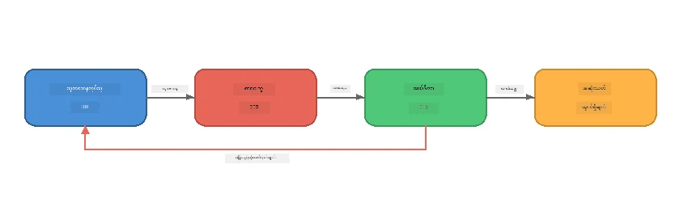
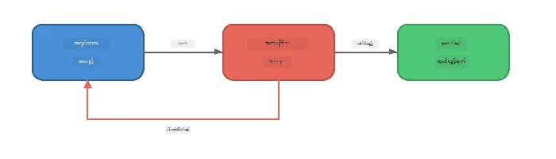
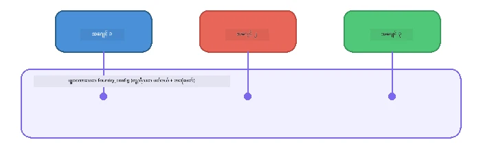

# အပိုင်း 6: မျိုးစုံ-အေဂျင့် အလုပ်ရုံဆိုင်များ

> **ရည်ရွယ်ချက်:** အထူးပြု အေဂျင့်များစွာကို ပေါင်းစပ်ပြီး ပူးပေါင်းဆောင်ရွက်နေသော အေဂျင့်များအကြား ရှုပ်ထွေးသော လုပ်ငန်းများကို ခွဲဝေသည့် ပိုင်းလိုင်းများ ပြုလုပ်ပါ - အားလုံးကို Foundry Local ဖြင့် ဒေသတွင်းတွင် ပြုလုပ်သည်။

## မျိုးစုံ-အေဂျင့် အကြောင်းဘာလဲ?

တစ်ဦးတည်းသော အေဂျင့်တစ်ခုသည် အလုပ်များစွာကို ကိုင်တွယ်နိုင်ပေမယ့် ရှုပ်ထွေးသော အလုပ်များတွင် **အထူးပြုခြင်း** မှ အကျိုးရှိသည်။ အေဂျင့်တစ်ခုတည်းက သုတေသန၊ ရေးသားခြင်း၊ နောက်တစ်ချိန်တည်းတွင် တည်းဖြတ်ခြင်းတို့ကို လုပ်ကြံခြင်းမပြုဘဲ အလုပ်ကို အထူးပြုထားသော တာဝန်များအဖြစ် ခွဲခြားပေးပါ။



| ပုံစံ | ဖော်ပြချက် |
|---------|-------------|
| **တစ်ဆက်တည်း** | အေဂျင့် A ထွက်ရှိမှုသည် အေဂျင့် B → အေဂျင့် C ထံ ပေးပို့သည် |
| **တုံ့ပြန်ကြိုး** | စိစစ်သူအေဂျင့်က အလုပ်ကို ပြန်သောက်မှုအတွက် ပို့နိုင်သည် |
| **မျှဝေသော သဘောတရား** | အားလုံးအေဂျင့်များသည် တူညီသော မော်ဒယ်/အဆုံးနေ့မှ အသုံးပြုသော်လည်း အညွှန်းများက မတူကြသည် |
| **အမျိုးအစားတိကျသော ထွက်ရှိမှု** | အေဂျင့်များသည် တည်ဆောက်ထားသော ရလဒ်များ (JSON) ထုတ်ပေး၍ ယုံကြည်စိတ်ချစေသည် |

---

## လေ့ကျင့်ခန်းများ

### လေ့ကျင့်ခန်း 1 - မျိုးစုံ-အေဂျင့် ပိုင်းလိုင်း အကောင်အထည် ဖော်ခြင်း

အလုပ်ရုံတွင် သုတေသန → ရေးသားသူ → တည်းဖြတ်သူ အလုပ်စဉ် အပြည့်အစုံ ပါဝင်သည်။

<details>
<summary><strong>🐍 Python</strong></summary>

**ပြင်ဆင်ခြင်း:**
```bash
cd python
python -m venv venv

# Windows (PowerShell):
venv\Scripts\Activate.ps1
# macOS:
source venv/bin/activate

pip install -r requirements.txt
```

**အသုံးပြုရန်:**
```bash
python foundry-local-multi-agent.py
```

**ဖြစ်ပေါ်သည့် အကြောင်းအရာများ:**
1. **သုတေသနလုပ်သူ** ခေါင်းစဉ်ကို လက်ခံ၍ အချက်အလက်များ bullet-point အနေနဲ့ ပြန်ပေးသည်
2. **ရေးသားသူ** သုတေသန အချက်အလက်များကို ယူပြီး ဘလော့ဂ်စာတမ်း (၃-၄ပိုဒ်) ရေးသားသည်
3. **တည်းဖြတ်သူ** ဆောင်းပါးကို အရည်အသွေးစစ်ဆေးပြီး ACCEPT သို့ REVISE ပြန်စာပေးသည်

</details>

<details>
<summary><strong>📦 JavaScript</strong></summary>

**ပြင်ဆင်ခြင်း:**
```bash
cd javascript
npm install
```

**အသုံးပြုရန်:**
```bash
node foundry-local-multi-agent.mjs
```

**တူညီသော အဆင့်သုံးခု ပိုင်းလိုင်း** - သုတေသန → ရေးသားသူ → တည်းဖြတ်သူ။

</details>

<details>
<summary><strong>💜 C#</strong></summary>

**ပြင်ဆင်ခြင်း:**
```bash
cd csharp
dotnet restore
```

**အသုံးပြုရန်:**
```bash
dotnet run multi
```

**တူညီသော အဆင့်သုံးခု ပိုင်းလိုင်း** - သုတေသန → ရေးသားသူ → တည်းဖြတ်သူ။

</details>

---

### လေ့ကျင့်ခန်း 2 - ပိုင်းလိုင်း အင်အားသက်ရောက်မှု

အေဂျင့်များကို မည်သည့်ပုံစံဖြင့် သတ်မှတ်ထားပြီး ချိတ်ဆက်ထားသည်ကို လေ့လာပါ။

**1. မျှဝေသော မော်ဒယ် client**

အားလုံးအေဂျင့်များသည် တူညီသော Foundry Local မော်ဒယ်ကို အသုံးပြုသည်။

```python
# Python - FoundryLocalClient က အားလုံးကို စောင့်ကြည့်လုပ်ဆောင်ပေးပါတယ်
from agent_framework_foundry_local import FoundryLocalClient

client = FoundryLocalClient(model_id="phi-3.5-mini")
```

```javascript
// JavaScript - Foundry Local ကို မြှောက်ထားသော OpenAI SDK
const client = new OpenAI({
  baseURL: manager.urls[0] + "/v1",
  apiKey: "foundry-local",
});
```

```csharp
// C# - OpenAIClient pointed at Foundry Local
var key = new ApiKeyCredential("foundry-local");
var client = new OpenAIClient(key, new OpenAIClientOptions
{
    Endpoint = new Uri(manager.Urls[0] + "/v1")
});
var chatClient = client.GetChatClient(model.Id);
```

**2. အထူးပြုအညွှန်းများ**

အိုက်ဂျင့်တိုင်း တိကျသော ပုဂ္ဂိုလ်တစ်ဦးရှိသည်။

| အေဂျင့် | အညွှန်း (အနှစ်ချုပ်) |
|-------|----------------------|
| သုတေသန | "အဓိကအချက်များ၊ စာရင်းအင်းများနှင့် နောက်ခံကို ပေးပါ။ bullet points အဖြစ် စီစဉ်ပါ။" |
| ရေးသားသူ | "သုတေသနမှတ်တမ်းများမှ စတင်၍ ဆွဲဆောင်မှုရှိသော ဘလော့ဂ်စာတမ်း (၃-၄ပိုဒ်) ရေးပါ။ အချက်အလက် မဖန်တီးရ။" |
| တည်းဖြတ်သူ | "ရှင်းလင်းမှု၊ ဝေါဟာရ၊ အချက်အလက် တိကျမှုကို စစ်ဆေးပါ။ ဆုံးဖြတ်ချက် - ACCEPT သို့ REVISE။" |

**3. အေဂျင့်များအကြား ဒေတာ လိပ်ပြန်မှု**

```python
# ဆင့် ၁ - သုတေသနဆရာ၏ ထွက်ရှိမှုသည် စာရေးဆရာအား အထောက်အပံ့ဖြစ်လာသည်
research_result = await researcher.run(f"Research: {topic}")

# ဆင့် ၂ - စာရေးဆရာ၏ ထွက်ရှိမှုသည် အယ်ဒီတာအား အထောက်အပံ့ဖြစ်လာသည်
writer_result = await writer.run(f"Write using:\n{research_result}")

# ဆင့် ၃ - အယ်ဒီတာသည် သုတေသနနှင့် ဆောင်းပါးနှစ်ခုလုံးအား သုံးသပ်သည်
editor_result = await editor.run(
    f"Research:\n{research_result}\n\nArticle:\n{writer_result}"
)
```

```csharp
// C# - same pattern, async calls with AIAgent
var researchNotes = await researcher.RunAsync(
    $"Research the following topic and provide key facts:\n{topic}");

var draft = await writer.RunAsync(
    $"Write a blog post based on these research notes:\n\n{researchNotes}");

var verdict = await editor.RunAsync(
    $"Review this article for quality and accuracy.\n\n" +
    $"Research notes:\n{researchNotes}\n\n" +
    $"Article:\n{draft}");
```

> **အဓိက နားလည်မှု:** အေဂျင့်တိုင်းသည် မျှော်မှန်းချက်များကို ကြိုတင်အခြေခံ၍ ခံယူရယူသည်။ တည်းဖြတ်သူသည် ပထမထုတ်သုံး သုတေသနနှင့် အကြမ်းစာချုပ်နှစ်ခုလုံးကို မြင်နိုင်ပြီး အချက်အလက် တိကျမှုကို စစ်ဆေးနိုင်သည်။

---

### လေ့ကျင့်ခန်း 3 - စတုတ္ထ အေဂျင့် ထည့်သွင်းခြင်း

ပိုင်းလိုင်းကို အသစ်သော အေဂျင့်တစ်ခုဖြင့် တိုးပြောင်းပါ။ တစ်ခုရွေးပါ -

| အေဂျင့် | ရည်ရွယ်ချက် | အညွှန်း |
|-------|---------|-------------|
| **အချက်အလက် စစ်ဆေးသူ** | ဆောင်းပါး၌ ဖော်ပြချက်များကို အတည်ပြုသည် | `"သင်သည် အချက်အလက်များကို စစ်ဆေးသူဖြစ်သည်။ တစ်ခုချင်းစီအတွက် သုတေသန မှတ်သားချက်များဖြင့် အတည်ပြုချက်ရှိ/မရှိကို ဖော်ပြပါ။ JSON ပုံစံဖြင့် အတည်ပြု/မအတည်ပြု အချက်များကို ပြန်ပေးပါ။"` |
| **ခေါင်းစဉ်ရေးသားသူ** | ဖမ်းစားစရာ ခေါင်းစဉ်များ ဖန်တီးသည် | `"ဆောင်းပါးအတွက် ခေါင်းစဉ်ရွေးစရာ ၅ ခု ဖန်တီးပါ။ စတိုင်များကို မတူစေပါ - သတင်းအချက်အလက်၊ ဖမ်းစားခေါင်းစဉ်၊ မေးခွန်း၊ စာရင်း၊ စိတ်ခံစားမှု။"` |
| **လူမှုမီဒီယာ** | ကြော်ငြာပို့စ်များ ဖန်တီးသည် | `"ဒီဆောင်းပါးကို ကြော်ငြာဖို့ လူမှုမီဒီယာ ပို့စ် ၃ ခု ဖန်တီးပါ - တစ်ခု သြဂုတ် (280 စာလုံး), တစ်ခု LinkedIn (ပရော်ဖက်ရှင်နယ် အသံ), တစ်ခု Instagram (ဖျော်ဖြေရေးနှင့် အီမိုဂျီ အကြံပြုချက်ပါ)."` |

<details>
<summary><strong>🐍 Python - ခေါင်းစဉ်ရေးသားသူ ထည့်ခြင်း</strong></summary>

```python
headline_agent = client.as_agent(
    name="HeadlineWriter",
    instructions=(
        "You are a headline specialist. Given an article, generate exactly "
        "5 headline options. Vary the style: informative, question-based, "
        "listicle, emotional, and provocative. Return them as a numbered list."
    ),
)

# ဘာသာပြန်သူ ခွင့်ပြုချိန်နောက် မူလစာသားများကို ထုတ်ပေးပါ။
headline_result = await headline_agent.run(
    f"Generate headlines for this article:\n\n{writer_result}"
)
print(f"\n--- Headlines ---\n{headline_result}")
```

</details>

<details>
<summary><strong>📦 JavaScript - ခေါင်းစဉ်ရေးသားသူ ထည့်ခြင်း</strong></summary>

```javascript
const headlineAgent = new ChatAgent({
  client,
  modelId: modelInfo.id,
  instructions:
    "You are a headline specialist. Given an article, generate exactly " +
    "5 headline options. Vary the style: informative, question-based, " +
    "listicle, emotional, and provocative. Return them as a numbered list.",
  name: "HeadlineWriter",
});

const headlineResult = await headlineAgent.run(
  `Generate headlines for this article:\n\n${writerResult.text}`
);
console.log(`\n--- Headlines ---\n${headlineResult.text}`);
```

</details>

<details>
<summary><strong>💜 C# - ခေါင်းစဉ်ရေးသားသူ ထည့်ခြင်း</strong></summary>

```csharp
AIAgent headlineAgent = chatClient.AsAIAgent(
    name: "HeadlineWriter",
    instructions:
        "You are a headline specialist. Given an article, generate exactly " +
        "5 headline options. Vary the style: informative, question-based, " +
        "listicle, emotional, and provocative. Return them as a numbered list."
);

// After the editor accepts, generate headlines
var headlines = await headlineAgent.RunAsync(
    $"Generate headlines for this article:\n\n{draft}");
Console.WriteLine($"\n--- Headlines ---\n{headlines}");
```

</details>

---

### လေ့ကျင့်ခန်း 4 - ကိုယ်ပိုင် အလုပ်လုပ်စဉ် ဒီဇိုင်း

ကွဲပြားသော လုပ်ငန်းနှင့် ကိုက်ညီသည့် မျိုးစုံ-အေဂျင့် ပိုင်းလိုင်း တစ်ခု ဒီဇိုင်းဆွဲပါ။ အတွေးအခေါ် ဤနေရာတွင် ပေးထားသည်။

| လုပ်ငန်းအမျိုးအစား | အေဂျင့်များ | လမ်းကြောင်း |
|--------|--------|------|
| **ကုဒ် စစ်ဆေးခြင်း** | စိစစ်သူ → ပြန်လည်သုံးသပ်သူ → အကျဉ်းချုပ်ရေးသူ | ကုဒ်ဖွဲ့စည်းမှု စိစစ် → ပြဿနာများ အတွက် ပြန်လည်သုံးသပ် → အကျဉ်းအစီရင်ခံစာ ထုတ်ပေးခြင်း |
| **ဖောက်သည် ဝန်ဆောင်မှု** | အမျိုးအစားသတ်မှတ်သူ → ဖြေကြားသူ → အရည်အသွေး စစ်ဆေးသူ | လက်မှတ်အမျိုးအစား သတ်မှတ် → ဖြေကြားမှု ရေးသား → အရည်အသွေး စစ်ဆေးခြင်း |
| **ပညာရေး** | စမ်းသပ်မေးခွန်း ဖန်တီးသူ → ကျောင်းသား မော်ကွန်း → တန်းလာညွှန်းသူ | စမ်းသပ်မေးခွန်း ဖန်တီး → ဖြေကြားမှု မော်ကွန်းပြုလုပ် → အမှတ်ပေး၍ ရှင်းပြ |
| **ဒေတာ စိစစ်ခြင်း** | အဓိပ္ပါယ်ဖော်သူ → ခွဲခြမ်းစိတ်ဖြာသူ → အစီရင်ခံသူ | ဒေတာ တောင်းဆိုမှု ဆိုင်းငံ့ → ပုံစံ ခွဲခြမ်း → အစီရင်ခံစာ ရေးသား |

**ခြေလှမ်းများ:**
1. လွယ်ကူသည့် `instructions` တွင် ၃+ အေဂျင့် သတ်မှတ်ပါ
2. ဒေတာ လိပ်ပြန်မှုကို ဆုံးဖြတ်ပါ - အေဂျင့်တိုင်းသည် မည်သည့် အချက်ကို လက်ခံပြီး ထုတ်ပေးမလဲ?
3. Exercises 1-3 မှ ပုံစံများဖြင့် ပိုင်းလိုင်းရေးဆွဲပါ
4. တစ်ခုခု တုံ့ပြန်ချက် ကြိုး ပါအောင် ထည့်ပါ မည်သည့် အေဂျင့်တစ်ခုက အခြားအေဂျင့်ရဲ့ အလုပ်ကို မျှော်မှန်း စစ်ဆေးပါက

---

## စီမံအုပ်ချုပ်မှု ပုံစံများ

မျိုးစုံ-အေဂျင့် စနစ်များတွင် အသုံးပြုနိုင်သော စီမံအုပ်ချုပ်မှု ပုံစံများဖြစ်ပြီး ([အပိုင်း 7 တွင် အကျဉ်းချုပ်ထားသည်](part7-zava-creative-writer.md)) -

### တစ်ဆက်တည်း ပိုင်းလိုင်း


အေဂျင့်တိုင်းသည် ယခင်၏ ထွက်ရှိမှုကို ပြန်လည် လုပ်ဆောင်သည်။ ရိုးရှင်းပြီး ကြိုတင်ခန့်မှန်းနိုင်သည်။

### တုံ့ပြန် ကြိုး



စိစစ်သူအေဂျင့်တစ်ခုသည် ယခင် အဆင့်များကို ထပ်မံ အသုံးပြုနိုင်ရန် ဖန်တီးနိင်သည်။ Zava ရေးသားသူသည် ယင်းကို အသုံးပြုသည့်အတိုင် တည်းဖြတ်သူသည် သုတေသနသူနှင့် ရေးသားသူထံ ပြန်လှည့်တောင်းခံနိုင်သည်။

### မျှဝေသည့် သဘောတရား



အေဂျင့်အားလုံးသည် တစ်ခုတည်းသော `foundry_config` ကို မျှဝေ၍ တူညီသော မော်ဒယ်နှင့် အဆုံးနေ့ကို အသုံးပြုသည်။

---

## အဓိက သင်ခန်းစာများ

| စိတ်ကူး | သင်ယူခဲ့သည်များ |
|---------|-----------------|
| အေဂျင့် အထူးပြုခြင်း | အေဂျင့်တစ်ခုချင်းစီသည် ဦးတည်မှုရှိသော အညွှန်းနှင့် တစိတ်တဒေသလုပ်ငန်းတစ်ခုကို ကောင်းစွာ ဆောင်ရွက်သည် |
| ဒေတာ လိပ်ပြန်ခြင်း | အေဂျင့်တစ်ခုမှ ထွက်ရှိမှုသည် နောက်တစ်ခုအတွက် ဝင်ရိုးဖြစ်သည် |
| တုံ့ပြန်ကြိုးများ | စိစစ်သူတစ်ယောက်သည် ပိုမိုကောင်းမွန်သောအရည်အသွေးအတွက် ထပ်မံကြိုးစားရန် ဖန်တီးနိုင်သည် |
| ဖွဲ့စည်းတည်ဆောက်ထားသော ထွက်ရှိမှု | JSON ပုံစံဖြင့် ဖြေကြားမှုများက ေယံုၾကည္စိတ္ခ်ရေသာ အေဂျင့်ကြား ဆက်သွယ်မှု ဖြစ်စေသည် |
| စီမံအုပ်ချုပ်မှု | စီစဉ်သူတစ်ဦးသည် ပိုင်းလိုင်း လိုက်နာမှုနှင့် အမှားကို စီမံပါသည် |
| ထုတ်လုပ်မှု ပုံစံများ | [အပိုင်း 7: Zava Creative Writer](part7-zava-creative-writer.md) တွင် အသုံးပြုထားသည် |

---

## နောက်တစ်ဆင့်များ

[အပိုင်း 7: Zava Creative Writer - Capstone Application](part7-zava-creative-writer.md) သို့ ဆက်လက်သွားပါ - ၄ ဦးအထူးပြု အေဂျင့်များ၊ သီးခြားသလို ထွက်ရှိမှု လွှမ်းမိုးမှု၊ ထုတ်ကုန်ရှာဖွေရေးနှင့် တုံ့ပြန်ကြိုးများပါဝင်သည့် ထုတ်လုပ်မှုပုံစံ မျိုးစုံ-အေဂျင့် အက်ပ်ကို python, JavaScript နှင့် C# တို့ဖြင့် လေ့လာနိုင်သည်။

---

<!-- CO-OP TRANSLATOR DISCLAIMER START -->
**အသိပေးချက်**  
ဤစာတမ်းကို AI ဘာသာပြန်မှု ဝန်ဆောင်မှုဖြစ်သည့် [Co-op Translator](https://github.com/Azure/co-op-translator) အသုံးပြု၍ ဘာသာပြန်ထားပါသည်။ တိကျမှန်ကန်မှုအတွက် ကြိုးပမ်းပေမယ့် စက်ရုပ်ဘာသာပြန်မှုများတွင် အမှားများ သို့မဟုတ် မှားယွင်းချက်များ ပါဝင်နိုင်သည်ဖြစ်ကြောင်း သတိပြုပါရန် မေတ္တာရပ်ခံပါသည်။ မူရင်းစာတမ်းကို ဇာတိဘာသာဖြင့်သာ အတည်ပြုနိုင်စေသည့် အရင်းအမြစ်အဖြစ် သတ်မှတ်ကြည့်ရန် လိုအပ်ပါသည်။ အရေးကြီးသော အချက်အလက်များအတွက် ဖြစ်ပါက လူ့ဘာသာပြန်ပညာရှင်တစ်ဦးက ဘာသာပြန်ပေးရန် အကြံပြုပါသည်။ ဤဘာသာပြန်ချက်ကို အသုံးပြုရာမှ စပြီး ဖြစ်ပေါ်လာမည့် အတွေးအခေါ် မတွဲဖက်မှုများ သို့မဟုတ် မှားယွင်းနားလည်မှုများ အတွက် ကျွန်ုပ်တို့က တာဝန်ယူမည် မဟုတ်ပါ။
<!-- CO-OP TRANSLATOR DISCLAIMER END -->