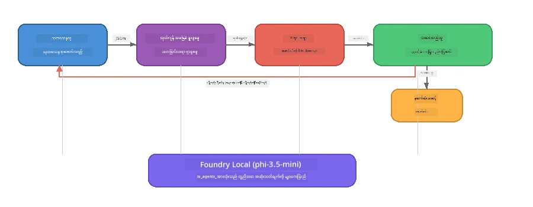

# အပိုင်း ၇: Zava Creative Writer - Capstone Application

> **ရည်ရွယ်ချက်:** Zava Retail DIY အတွက် မဂ္ဂဇင်းအရည်အသွေးရှိ စာတမ်းများကို ထုတ်လုပ်ရန် အထူးပြုထားသော လူကြီးမင်း၏ စက်ပစ္စည်းပေါ်တွင် ပြီးပြည့်စုံစွာ ဖယောင်းလုပ်နိုင်သည့် Foundry Local နဲ့ ပေါင်းစပ်ကာ လေးဦးတစ်စုသော အင်္ဂဂျင်များ ပေါင်းပြီး ပြုလုပ်ထားသော ဒုတိယလက်ရာတစ်ခုဖြစ်သည့် ထုတ်လုပ်မှုပုံစံ multi-agent application ကို လေ့လာကြမည်။

ဤမှာ အလုပ်ရုံဆွေးနွေးပွဲ၏ **capstone lab** ဖြစ်သည်။ သင့်အား ပညာရobt တွေကို တစ်စိတ်တစ်ပိုင်း လေ့လာပြီးသား SDK ပေါင်းစပ်ခြင်း (အပိုင်း ၃), ဒေသန္တရ ဒေတာမှ ရယူမှု (အပိုင်း ၄), အင်္ဂျင် တစ်ခုချင်းစီ၏ စနစ်စာတမ်း (အပိုင်း ၅), နှင့် multi-agent စီမံခန့်ခွဲမှု (အပိုင်း ၆) တို့ကို တစ်နေရာတွင် ပေါင်းစပ်ပေးထားပြီး၊ **Python**, **JavaScript**, နှင့် **C#** ရှိ ပြည့်စုံသော application ဖြစ်သည်။

---

## သင်လေ့လာမည့်အရာများ

| သဘောတရား | Zava Writer တွင် ဘယ်မှာရှိသလဲ |
|---------|----------------------------|
| ၄-အဆင့် မော်ဒယ် loading | Shared config module မှ Foundry Local ကို bootstrap လုပ်သည် |
| RAG-style ရယူမှု | Product agent မှ ဒေသန္တရ စာရင်းကို ရှာဖွေသည် |
| Agent အထူးပြုခြင်း | system prompt မတူညီသော ၄ ဦးသော agent များ |
| Streaming အထွက် | Writer မှ စာလုံးများကို အချိန်နှင့်တပြိုင်နက် ထုတ်ပေးသည် |
| အသီးသီး ပုံသဏ္ဍာန် hand-offs | Researcher → JSON, Editor → JSON ဆုံးဖြတ်ချက် |
| ပြန်လည်တုံ့ပြန်မှု loops | Editor မှ  ပြန်လည် လုပ်ဆောင်မှု (max 2 ကြိမ် ထပ်ခေါ်နိုင်) ဖြစ်စေသည် |

---

## ဘွဲ့ရအင်ဂျင်နီယာ ဖွဲ့စည်းပုံ

Zava Creative Writer သည် **လိုက်စဉ်ဆက်စပ်သော pipeline နှင့် evaluator ဦးဆောင်မှု feedback** ကို အသုံးပြုသည်။ သုံးဘာသာစကားအတွက် မော်ဒယ်သည် တူညီသော ဖွဲ့စည်းပုံကို လိုက်နာသည် -



### လေးဦးသော Agent များ

| Agent | input | output | ရည်ရွယ်ချက် |
|-------|-------|--------|---------|
| **Researcher** | ခေါင်းစဉ် + အလိုလျောက် feedback | `{"web": [{url, name, description}, ...]}` | LLM ဖြင့် နောက်ခံ သတင်းအချက်အလက် စုဆောင်းခြင်း |
| **Product Search** | ထုတ်ကုန် စာရင်း string | ကိုက်ညီသည့် ထုတ်ကုန်များစာရင်း | LLM ထုတ်ပေးသော query များနှင့် ဒေသန္တရ စာရင်း keyword ရှာဖွေမှုတွဲထားသည် |
| **Writer** | Research + မုဒ် + လုပ်ငန်းတာဝန် + feedback | Streaming ဆောင်းပါးစာသား ( `---` တွင် ဖြတ်ထားသည်) | မဂ္ဂဇင်းအရည်အသွေးရှိ ဆောင်းပါး ပုံစံ အချိန်နှင့်တပြိုင်နက် ရေးသားခြင်း |
| **Editor** | ဆောင်းပါး + writer ၏ ကိုယ်ပိုင် feedback | `{"decision": "accept/revise", "editorFeedback": "...", "researchFeedback": "..."}` | အရည်အသွေး သုံးသပ်ခြင်း၊ လိုအပ်ပါက ထပ်ဆင်ခြင်း လုပ်ငန်း တုံ့ပြန်မှု အကြောင်းပြန်ပို့ခြင်း |

### Pipeline ထွက်စီးနည်း

1. **Researcher** သည် ခေါင်းစဉ်ကို လက်ခံပြီး စုစည်းထားသော သုတေသန မှတ်တမ်းများ (JSON) ထုတ်ပေးသည်။
2. **Product Search** သည် LLM တင်ပြသော ရှာဖွေမှု စကားစုများကို အသုံးပြု၍ ဒေသန္တရ ထုတ်ကုန် စာရင်းကို ရှာဖွေသည်။
3. **Writer** သည် သုတေသန + ထုတ်ကုန်များ + လုပ်ငန်းတာဝန် ကို ပေါင်းစပ်၍ streaming ဆောင်းပါးတစ်ပုဒ် တည်ဆောက်ပြီး `---` ကန့်သတ်ချက်တွင် ကိုယ်ပိုင် feedback ကို ထည့်သွင်းသည်။
4. **Editor** သည် ဆောင်းပါးကို သုံးသပ်ပြီး JSON ဆုံးဖြတ်ချက် ပြန်ပေးသည် -
   - `"accept"` → pipeline ပြီးဆုံးသည်
   - `"revise"` → feedback ကို Researcher နှင့် Writer ကို ပြန်ပို့သည် (အများဆုံး 2 ကြိမ် ထပ်ခေါ်နိုင်သည်)

---

## မျှော်လင့်ချက်များ

- [Part 6: Multi-Agent Workflows](part6-multi-agent-workflows.md) အပြီးသွားထားပါ။
- Foundry Local CLI ကို ထည့်သွင်းထားပြီး `phi-3.5-mini` မော်ဒယ်ကို ဒေါင်းလုပ်ပြုလုပ်ထားပါ။

---

## လေ့ကျင့်ခန်းများ

### လေ့ကျင့်ခန်း ၁ - Zava Creative Writer ကို တွက်ချက်ခေါ်ရန်

သင်နှစ်သက်ရာ ဘာသာစကားကို ရွေးပြီး application ကို စတင်ပါ။

<details>
<summary><strong>🐍 Python - FastAPI ဝက်ဘ် စနစ်</strong></summary>

Python ဗားရှင်းမှာ REST API ဖြင့် **ဝက်ဘ်ဝန်ဆောင်မှု** အနေဖြင့် လည်ပတ်ပြီး ထုတ်လုပ်မှု backend တည်ဆောက်နည်းကို ပြသသည်။

**သတ်မှတ်ချက်:**
```bash
cd zava-creative-writer-local/src/api
python -m venv venv

# Windows (PowerShell):
venv\Scripts\Activate.ps1
# macOS:
source venv/bin/activate

pip install -r requirements.txt
```

** run:**
```bash
uvicorn main:app --reload
```

** စမ်းသပ်ရန်:**
```bash
curl -X POST http://localhost:8000/api/article \
  -H "Content-Type: application/json" \
  -d '{
    "research": "DIY home improvement trends",
    "products": "power tools and paints",
    "assignment": "Write an article about weekend renovation projects for DIY enthusiasts"
  }'
```

တုံ့ပြန်ချက်သည် လိုင်းအလိုက် JSON မှတ်ချက်ဖြင့် streaming အနေနဲ့ ပြန်လာပါသည်။ agent တစ်ဦးချင်း အဆင့်ဆင့် တိုးတက်မှုကို ပြသသည်။

</details>

<details>
<summary><strong>📦 JavaScript - Node.js CLI</strong></summary>

JavaScript ဗားရှင်းသည် **CLI application** အဖြစ် အတူတကွ agent တိုးတက်မှုနှင့် ဆောင်းပါးကို တိုက်ရိုက်(console) တွင် ပုံနှိပ်ပြသသည်။

**သတ်မှတ်ချက်:**
```bash
cd zava-creative-writer-local/src/javascript
npm install
```

** run:**
```bash
node main.mjs
```

သင်ကြည့်နိုင်သည် -
1. Foundry Local မော်ဒယ် loading (ဒေါင်းလုပ်နေစဉ် progress bar ပါဝင်သည်)
2. Agent တစ်ဦးချင်း စီ စီစဉ်မှုနှင့် status စာရွက်များ
3. ဆောင်းပါးကို အချိန်နှင့်တပြိုင်နက် console မှာ streaming ထုတ်ပေးခြင်း
4. editor ၏  လက်ခံ/ပြင်ဆင် ဆုံးဖြတ်ချက်

</details>

<details>
<summary><strong>💜 C# - .NET Console Application</strong></summary>

C# ဗားရှင်းသည် **.NET console application** အနေနှင့် တူညီသော pipeline နှင့် streaming output ကို ပေးသည်။

**သတ်မှတ်ချက်:**
```bash
cd zava-creative-writer-local/src/csharp
dotnet restore
```

**run:**
```bash
dotnet run
```

JavaScript ဗားရှင်းနှင့် တူညီသော output ပုံစံ - agent status message များ၊ streaming ဆောင်းပါးနှင့် editor ၏ ဆုံးဖြတ်ချက်များကို တွေ့နိုင်သည်။

</details>

---

### လေ့ကျင့်ခန်း ၂ - ကုဒ် ဖွဲ့စည်းပုံ ခြုံငုံကြည့်ရန်

ဘာသာစကားတိုင်းသည် တူညီသော လိုဂျစ်စစ် အစိတ်အပိုင်းများပါ၀င်သည်။ ဖွဲ့စည်းပုံများကို နှိုင်းယှဉ် ကြည့်ပါ-

**Python** (`src/api/`):
| ဖိုင် | ရည်ရွယ်ချက် |
|------|---------|
| `foundry_config.py` | Shared Foundry Local manager, model, client (4-အဆင့် initialization) |
| `orchestrator.py` | Pipeline ကို စီမံခန့်ခွဲခြင်းနှင့် feedback loop |
| `main.py` | FastAPI endpoints (`POST /api/article`) |
| `agents/researcher/researcher.py` | LLM အခြေပြု သုတေသန၊ JSON output |
| `agents/product/product.py` | LLM-generated query + keyword ရှာဖွေမှု |
| `agents/writer/writer.py` | Streaming ဆောင်းပါး ထုတ်လုပ်မှု |
| `agents/editor/editor.py` | JSON-based accept/revise ဆုံးဖြတ်ချက် |

**JavaScript** (`src/javascript/`):
| ဖိုင် | ရည်ရွယ်ချက် |
|------|---------|
| `foundryConfig.mjs` | Shared Foundry Local config (4-အဆင့် init, progress bar ပါ) |
| `main.mjs` | Orchestrator + CLI စတင်အချက် |
| `researcher.mjs` | LLM အခြေပြု research agent |
| `product.mjs` | LLM query ဒါနှင့် keyword ရှာဖွေမှု |
| `writer.mjs` | Streaming ဆောင်းပါး ထုတ်လုပ်မှု (async generator) |
| `editor.mjs` | JSON accept/revise ဆုံးဖြတ်ချက် |
| `products.mjs` | ထုတ်ကုန် စာရင်းဒေတာ |

**C#** (`src/csharp/`):
| ဖိုင် | ရည်ရွယ်ချက် |
|------|---------|
| `Program.cs` | ပြည့်စုံသော pipeline: မော်ဒယ် loading, agents, orchestrator, feedback loop |
| `ZavaCreativeWriter.csproj` | .NET 9 project ရှိ Foundry Local နှင့် OpenAI ပက်ကေ့ဂျ်များ |

> **ဒီဇိုင်းမှတ်ချက်:** Python သည် agent တစ်ဦးစီကို ဖိုင်/ဖိုလ်ဒါ သီးခြား ဖွဲ့ထားသည် (အသိုင်းအဝိုင်းကြီးအတွက် သင့်တော်သည်)။ JavaScript သည် agent တဦးချင်း module တစ်ခုစီ အသုံးပြုသည် (အလတ်စား ပရောဂျက်များအတွက်ကောင်းသည်)။ C# သည် ဖိုင်တစ်ခုတည်းအတွင်း function များသီးခြားထားသည် (ကိုယ်ပိုင်မြင်ကွင်းများအတွက် ကောင်းသည်)။ ထုတ်လုပ်မှုတွင် သင့်အဖွဲ့၏ စံပြုလမ်းနှင့် ကိုက်ညီသော နည်းလမ်းကို ရွေးချယ်ပါ။

---

### လေ့ကျင့်ခန်း ၃ - Shared Configuration ကို ခြုံငုံကြည့်ရန်

Pipeline ထဲရှိ agent များအားလုံးသည် Foundry Local model client တစ်ခုတည်းကို ပူးပေါင်းအသုံးပြုသည်။ ဘာသာစကားတစ်ခုချင်းစီတွင် ဘယ်လို အဆင့်ဆင့် ပြုလုပ်ထားသည်ကို လေ့လာပါ။

<details>
<summary><strong>🐍 Python - foundry_config.py</strong></summary>

```python
from foundry_local import FoundryLocalManager

MODEL_ALIAS = "phi-3.5-mini"

# အဆင့် ၁: မန်နေဂျာကို ဖန်တီးပြီး Foundry Local စနစ်ကို စတင်ပါ
manager = FoundryLocalManager()
manager.start_service()

# အဆင့် ၂: မော်ဒယ်ကို ရယူပြီးဖြစ်တဲ့အခြေအနေကို စစ်ဆေးပါ
cached = manager.list_cached_models()
catalog_info = manager.get_model_info(MODEL_ALIAS)
is_cached = any(m.id == catalog_info.id for m in cached) if catalog_info else False

if not is_cached:
    manager.download_model(MODEL_ALIAS)

# အဆင့် ၃: မော်ဒယ်ကို သိုလှောင်မှတ်ဉာဏ်ထဲသို့ ဖွင့်ပါ
manager.load_model(MODEL_ALIAS)
model_id = manager.get_model_info(MODEL_ALIAS).id

# မျှဝေထားတဲ့ OpenAI ဧည့်သည်ကိုယ်စားလှယ်
client = openai.OpenAI(base_url=manager.endpoint, api_key=manager.api_key)
```

Agent များအားလုံး `from foundry_config import client, model_id` ကို import လုပ်သည်။

</details>

<details>
<summary><strong>📦 JavaScript - foundryConfig.mjs</strong></summary>

```javascript
import { FoundryLocalManager } from "foundry-local-sdk";
import { OpenAI } from "openai";

FoundryLocalManager.create({ appName: "ZavaCreativeWriter" });
const manager = FoundryLocalManager.instance;
await manager.startWebService();

// ကက်ရှ်စစ်→ဒေါင်းလုတ်→ဖတ်ပါ (SDK ပုံစံအသစ်)
const catalog = manager.catalog;
const model = await catalog.getModel(MODEL_ALIAS);
if (!model.isCached) {
  console.log(`Downloading model: ${MODEL_ALIAS}...`);
  await model.download();
}
await model.load();

const client = new OpenAI({ baseURL: manager.urls[0] + "/v1", apiKey: "foundry-local" });
const modelId = model.id;
export { client, modelId };
```

Agent များအားလုံး `{ client, modelId } from "./foundryConfig.mjs"` ကို import လုပ်သည်။

</details>

<details>
<summary><strong>💜 C# - Program.cs ထိပ်ပိုင်း</strong></summary>

```csharp
await FoundryLocalManager.CreateAsync(
    new Configuration
    {
        AppName = "ZavaCreativeWriter",
        Web = new Configuration.WebService { Urls = "http://127.0.0.1:0" }
    }, NullLogger.Instance, default);
var manager = FoundryLocalManager.Instance;
await manager.StartWebServiceAsync(default);

var catalog = await manager.GetCatalogAsync(default);
var catalogModel = await catalog.GetModelAsync(alias, default);
var isCached = await catalogModel.IsCachedAsync(default);
if (!isCached)
    await catalogModel.DownloadAsync(null, default);

await catalogModel.LoadAsync(default);
var key = new ApiKeyCredential("foundry-local");
var chatClient = new OpenAIClient(key, new OpenAIClientOptions
{
    Endpoint = new Uri(manager.Urls[0] + "/v1")
}).GetChatClient(catalogModel.Id);
```

`chatClient` ကို agent များအားလုံး သို့ function တွင် ဖြတ်ပိုက်ပေးသည်။

</details>

> **အဓိက pattern:** မော်ဒယ် loading လမ်းကြောင်း (စနစ်စတင် → cache စစ်ဆေး → ဒေါင်းလုပ် → load) သည် အသုံးပြုသူတွင် တိကျသော ရှေ့ဆက်ရေးမှတ်ကိုမြင်ရစေပြီး မော်ဒယ်ကို တစ်ကြိမ်သာ ဒေါင်းလုပ်လုပ်သည်မှာ Foundry Local application တွင် အကောင်းဆုံး လုပ်ထုံးလုပ်နည်းဖြစ်သည်။

---

### လေ့ကျင့်ခန်း ၄ - ပြန်လည်တုံ့ပြန်မှု Loop ကို နားလည်ရန်

Feedback loop သည် pipeline ကို "အတတ်ပညာရှင်" တစ်ခု ပြောင်းလဲသည်။ Editor သည် အလုပ်ကို ပြန်လည်ပြင်ဆင်ရန် ပို့နိုင်သည်။ ဤနည်းလမ်း ကို ခြုံငုံကြည့်ပါ။

```
Orchestrator:
  1. researcher.research(topic, "No Feedback")    ← first pass
  2. product.findProducts(productContext)
  3. writer.write(research, products, assignment)  ← streams article
  4. Split article at "---" → article + writerFeedback
  5. editor.edit(article, writerFeedback)

  WHILE editor says "revise" AND retryCount < 2:
    6. researcher.research(topic, editor.researchFeedback)  ← refined
    7. writer.write(research, products, editor.editorFeedback)
    8. editor.edit(newArticle, newWriterFeedback)
    9. retryCount++
```

**စဉ်းစားရန် မေးခွန်းများ:**
- ပြန်လည်လုပ်ဆောင်မှု အရေအတွက် ၂ ကြိမ် နားလည်ချက် ဘာကြောင့်ပါလဲ? မြှင့်မယ်ဆိုရင် ဘာဖြစ်မလဲ?
- Researcher သည် `researchFeedback` ကို၊ Writer သည် `editorFeedback` ကို ရရှိနေရခြင်းဘယ်ကြောင့်လဲ?
- Editor ဟာ အမြဲ "revise" ဆိုပါက ဘာဖြစ်မလဲ?

---

### လေ့ကျင့်ခန်း ၅ - Agent တစ်ခု ပြင်ဆင်ရန်

Agent တစ်ဦး၏ conduct (လေ့လာမှု) ကို ပြောင်းလဲ၍ pipeline တွင် အကျိုးသက်ရောက်မှုကို တွေ့ကြပါ။

| ပြင်ဆင်မှု | မည်သည်ကို ပြောင်းလဲမည်လဲ |
|-------------|----------------|
| **ကျင့်သား ပြင်းထန်သော editor** | Editor ၏ system prompt ကို အမြဲပြင်ဆင်ရန် တောင်းဆိုမှုတစ်ခု ပြောင်းသည် |
| **ဆောင်းပါး ရှည်လျားခြင်း** | Writer ၏ prompt မှ "800-1000 စာလုံး" သို့ "1500-2000 စာလုံး" ပြောင်းလဲသည် |
| **ထုတ်ကုန်အသစ်များ** | ထုတ်ကုန်စာရင်းတွင် ထုတ်ကုန်အသစ် ထည့်သွင်းခြင်း သို့မဟုတ် ပြင်ဆင်ခြင်း |
| **သုတေသန ခေါင်းစဉ်အသစ်** | မူလ `researchContext` ကို အခြား ခေါင်းစဉ်သို့ ပြောင်းလဲခြင်း |
| **JSON အားသာ researcher** | Researcher သည် item ၃-၅ မဟုတ်ဘဲ ၁၀ ခု ပြန်ပေးရန် ပြောင်းလဲခြင်း |

> **အကြံပြုချက်:** ဘာသာစကားသုံးခုစလုံး တူညီသော ဖွဲ့စည်းပုံ ကို သုံးသည် ဆိုသဖြင့် သင့်အား ပိုပြီး လွယ်ကူသော ဘာသာစကားတြင် ပြင်ဆင်မှု လုပ်နိုင်ပါသည်။

---

### လေ့ကျင့်ခန်း ၆ - Agent ပဉ္စမ့ ထည့်သွင်းရန်

Pipeline ကို agent အသစ်ဖြင့် တိုးချဲ့ပါ။ အကြံများအနည်းငယ် -

| Agent | Pipeline တွင် ဘယ်နေရာရှိသလဲ | ရည်ရွယ်ချက် |
|-------|-------------------|---------|
| **Fact-Checker** | Writer နောက်, Editor မတိုင်မီ | သုတေသနဒေတာနှင့် အတည်ပြုချက် စစ်‌ဆေးခြင်း |
| **SEO Optimiser** | Editor လက်ခံပြီးနောက် | meta description, keywords, slug ထည့်သွင်းခြင်း |
| **Illustrator** | Editor လက်ခံပြီးနောက် | ဆောင်းပါးအတွက် ပုံဖော်ခြင်း prompt များ ထုတ်ပေးခြင်း |
| **Translator** | Editor လက်ခံပြီးနောက် | ဆောင်းပါးကို အခြား ဘာသာစကားသို့ ဘာသာပြန်ခြင်း |

**အဆင့်များ:**
1. Agent ၏ system prompt ကိုရေးသားပါ
2. Agent function ကို ဖန်တီးပါ (သင့်ဘာသာစကား အတိုင်း ရှိ pattern နှင့် ကိုက်ညီစေရန်)
3. ဤ function ကို orchestrator အတွင်း မှန်ကန်သောနေရာတွင် ထည့်ပါ
4. အသစ်ဖြစ်စေသော agent ၏ ပုံထွက်/မှတ်တမ်းများကို update ပြုလုပ်ပါ

---

## Foundry Local နှင့် Agent Framework များ အတူတကွ စီးပွားခြင်း

ဤ application သည် Foundry Local ဖြင့် multi-agent system များ ဖွဲ့စည်းရာတွင် ဖော်ပြထားသည့် အကြံပြု pattern တစ်ခု ဖြစ်ပါသည် -

| အလွှာ | အစိတ်အပိုင်း | အခန်းကဏ္ဍ |
|-------|-------------|-------------|
| **Runtime** | Foundry Local | မော်ဒယ်ကို ဒေသန္တရ ဒေါင်းလုပ်၊ စီမံခန့်ခွဲမှုနှင့် ဝန်ဆောင်မှု |
| **Client** | OpenAI SDK | ဒေသန္တရ endpoint သို့ chat completion များ ပို့ပေးခြင်း |
| **Agent** | system prompt + chat call | အထူးပြု လုပ်ဆောင်မှုများ စနစ်တကျ အညွှန်းပေးခြင်း |
| **Orchestrator** | pipeline စီမံခန့်ခွဲခြင်း | ဒေတာ လည်ပတ်မှု၊ အဆင့်လိုက် အသွားအလာနှင့် feedback loop များ စီမံခြင်း |
| **Framework** | Microsoft Agent Framework | `ChatAgent` abstraction နှင့် pattern များ အတွက် ထောက်ပံ့မှု |

အဓိကအတွေး: **Foundry Local သည် မိုးလေဝသ cloud backend ကို လဲလှယ်ထားသော်လည်း application ဖွဲ့စည်းပုံ မပြောင်းလဲဘဲ ကောင်းမွန်စွာ လုပ်ဆောင်နိုင်သည်။** cloud-hosted မော်ဒယ်များနှင့် အတူ အသုံးပြုသော agent စနစ်၊ orchestration နည်းလမ်းများ နှင့် structured hand-offs များသည် အတူတကွ local မော်ဒယ်များနဲ့ တူညီစွာ လုပ်ဆောင်နိုင်သည် — client ကို Azure endpoint အစား local endpoint သို့သာ ညွှန်ပြပေးရုံဖြစ်သည်။

---

## အဓိက သတ်မှတ်ချက်များ

| သဘောတရား | သင်မှာယူထားသည် |
|---------|-----------------|
| ထုတ်လုပ်မှု ဖွဲ့စည်းပုံ | Shared config နှင့် သီးခြား agent များဖြင့် multi-agent app ဖွဲ့စည်းနည်း |
| ၄-အဆင့် မော်ဒယ် loading | အသုံးပြုသူမြင်နိုင်သော progress ဖြင့် Foundry Local ကို စတင်ခြင်း လုပ်ထုံးလုပ်နည်း |
| Agent အထူးပြုခြင်း | ၄ ဦးရှိ agent တစ်ဦးစီမှာ အညွှန်းပြုချက်နှင့် output ပုံစံ သီးခြားရှိခြင်း |
| Streaming ထုတ်လုပ်မှု | Writer က token များကို အချိန်နှင့်တပြိုင်နက် ထုတ်ပေးခြင်းဖြင့် ပြန်ပြောဆိုမှု စနစ်မြန်ဆန်စေရန် |
| ပြန်လည်တုံ့ပြန်မှု loops | Editor ထံမှ retry များဖြင့် လူထိတွေ့မှုမပြုဘဲ output အရည်အသွေး မြှင့်တင်ခြင်း |
| ဘာသာစကားထပ်ဖြစ်စေရေး pattern | Python, JavaScript နှင့် C# တို့တွင်တူညီသော ဖွဲ့စည်းပုံများအလုပ်လုပ်နိုင်ခြင်း |
| ဒေသန္တရ = ထုတ်လုပ်မှုအဆင်သင့် | Foundry Local သည် cloud တင်ထားသော OpenAI-လိုအပ်ချက် API ကို ဒေသန္တရ နှင့် ဝန်ဆောင်မှုပေးသည် |

---

## နောက်တစ်ဆင့်

Agent များအတွက် ရိုးရာ အကဲခတ်သတ်မှတ်ချက်များ၊ စည်းကမ်းပေါ်လာချက်များ နှင့် LLM-as-judge ဆွေးနွေးမှု များအတွက် စနစ်တကျ အကဲဖြတ်ရေး framework တည်ဆောက်ရန် [အပိုင်း ၈: Evaluation-Led Development](part8-evaluation-led-development.md) သို့ ဆက်လက်သွားပါ။

---

<!-- CO-OP TRANSLATOR DISCLAIMER START -->
**သတိပေးချက်**  
ဤစာရွက်စာတမ်းကို AI ဘာသာပြန်ဝန်ဆောင်မှု [Co-op Translator](https://github.com/Azure/co-op-translator) အသုံးပြု၍ ဘာသာပြန်ထားပါသည်။ တိကျမှုအတွက် ကြိုးစားသည်ဖြစ်သော်လည်း အလိုအလျောက်ဘာသာပြန်မှုတွင် အမှားများ သို့မဟုတ် မှားယွင်းမှုများ ပါဝင်နိုင်ကြောင်း သတိပြုပါရန် မေတ္တာရပ်ခံအပ်ပါသည်။ မူလစာရွက်စာတမ်းကို ရင်းမြစ်ဘာသာစကားဖြင့် သရုပ်မှန်အဆင့်အတန်းအဖြစ် တွက်ချက်သင့်ပါသည်။ အရေးကြီးသတင်းအချက်အလက်များအတွက် လူ့ဘာသာပြန် ဝန်ဆောင်မှုကို အကြံပြုပါသည်။ ဤဘာသာပြန်မှုကို အသုံးပြုမှုကြောင့် ဖြစ်ပေါ်နိုင်သော နားမလည်မှုများ သို့မဟုတ် မှားယွင်းချက်များအတွက် ကျွန်ုပ်တို့ တာဝန်မရှိပါ။
<!-- CO-OP TRANSLATOR DISCLAIMER END -->