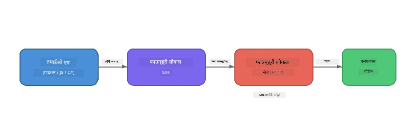

# भाग 1: Foundry Local सँग सुरु गर्दै


## Foundry Local के हो?

[Foundry Local](https://foundrylocal.ai) ले तपाईंलाई खुला स्रोत AI भाषा मोडेलहरू **सोझै तपाईंको कम्प्युटरमा** चलाउन दिन्छ - कुनै इन्टरनेट आवश्यक छैन, कुनै क्लाउड लागत छैन, र पूर्ण डेटा गोपनीयता। यसले:

- **मोडेलहरू स्थानीय रूपमा डाउनलोड र चलाउँछ** स्वतः हार्डवेयर अनुकूलन (GPU, CPU, वा NPU) सहित
- **OpenAI-संग सुसंगत API प्रदान गर्छ** जसले तपाईंलाई परिचित SDK र उपकरणहरू उपयोग गर्न दिन्छ
- **कुनै Azure सदस्यता वा साइन अप आवश्यक छैन** - मात्र स्थापना गर्नुहोस् र विकास सुरु गर्नुहोस्

यसलाई तपाईंको आफ्नै निजी AI जस्तै सोच्नुहोस् जुन पूर्ण रूपमा तपाईंको मेसिनमा चल्छ।

## सिकाइको उद्देश्यहरू

यस प्रयोगशालाको अन्त्यसम्म तपाईं सक्षम हुनुहुनेछ:

- तपाईंको अपरेटिङ सिस्टममा Foundry Local CLI स्थापना गर्न
- मोडेल एलियास के हुन् र कसरी काम गर्छन् बुझ्न
- आफ्नो पहिलो स्थानीय AI मोडेल डाउनलोड र चलाउन
- कमाण्ड लाइनबाट स्थानीय मोडेलमा च्याट सन्देश पठाउन
- स्थानीय र क्लाउड-होस्टेड AI मोडेलहरू बीचको भिन्नता बुझ्न

---

## पूर्वआवश्यकताहरू

### प्रणाली आवश्यकताहरू

| आवश्यकता | न्यूनतम | सिफारिस गरिएको |
|-------------|---------|-------------|
| **RAM** | ८ GB | १६ GB |
| **डिस्क स्थान** | ५ GB (मोडेलहरूका लागि) | १० GB |
| **CPU** | ४ कोर | ८+ कोरहरू |
| **GPU** | वैकल्पिक | NVIDIA संग CUDA ११.८+ |
| **OS** | Windows १०/११ (x64/ARM), Windows Server २०२५, macOS १३+ | - |

> **टिप्पणी:** Foundry Local ले तपाईंको हार्डवेयरका लागि सबैभन्दा उपयुक्त मोडेल भेरियन्ट स्वतः चयन गर्छ। यदि तपाईं संग NVIDIA GPU छ भने, यसले CUDA एक्सेलेरेशन प्रयोग गर्छ। यदि तपाईं संग Qualcomm NPU छ भने, यसले त्यो प्रयोग गर्छ। अन्यथा यसले अनुकूलित CPU भेरियन्ट प्रयोग गर्छ।

### Foundry Local CLI स्थापना गर्नुहोस्

**Windows** (PowerShell):
```powershell
winget install Microsoft.FoundryLocal
```

**macOS** (Homebrew):
```bash
brew tap microsoft/foundrylocal
brew install foundrylocal
```

> **टिप्पणी:** Foundry Local अहिले Windows र macOS मात्र समर्थन गर्दछ। यो समयमा Linux समर्थन छैन।

स्थापना पुष्टि गर्नुहोस्:
```bash
foundry --version
```

---

## प्रयोगशाला अभ्यासहरू

### अभ्यास 1: उपलब्ध मोडेलहरू अन्वेषण गर्नुहोस्

Foundry Local मा पूर्व-अनुकूलित खुला स्रोत मोडेलहरूको सूची समावेश गरिएको छ। सूची हेर्नुहोस्:

```bash
foundry model list
```

तपाईं यी मोडेलहरू देख्नुहुनेछ:
- `phi-3.5-mini` - Microsoft को ३.८B प्यारामिटर मोडेल (छिटो, राम्रो गुणस्तर)
- `phi-4-mini` - नयाँ, बढी सक्षम Phi मोडेल
- `phi-4-mini-reasoning` - Phi मोडेल सँग चेन-ऑफ-थट reasoning (`<think>` ट्यागहरू)
- `phi-4` - Microsoft को सबैभन्दा ठूलो Phi मोडेल (१०.४ GB)
- `qwen2.5-0.5b` - धेरै सानो र छिटो (कम स्रोत उपकरणहरूको लागि राम्रो)
- `qwen2.5-7b` - मजबूत जनरल-पर्पस मोडेल टूल-कलिङ सपोर्ट सहित
- `qwen2.5-coder-7b` - कोड जेनेरेशनको लागि अनुकूलित
- `deepseek-r1-7b` - मजबुत reasoning मोडेल
- `gpt-oss-20b` - ठूलो खुला स्रोत मोडेल (MIT लाइसेन्स, १२.५ GB)
- `whisper-base` - स्पीच-टु-टेक्स्ट ट्रान्सक्रिप्सन (३८३ MB)
- `whisper-large-v3-turbo` - उच्च-शुद्धता ट्रान्सक्रिप्सन (९ GB)

> **मोडेल एलियास के हो?** `phi-3.5-mini` जस्ता एलियासहरू छोटकरी हो। जब तपाईं एलियास प्रयोग गर्नुहुन्छ, Foundry Local ले तपाईंको विशेष हार्डवेयरका लागि सबैभन्दा उपयुक्त भेरियन्ट स्वतः डाउनलोड गर्छ (NVIDIA GPU हरूको लागि CUDA, अन्यथामा CPU-ऑप्टिमाइज्ड भेरियन्ट)। तपाईंले कहिल्यै सही भेरियन्ट चयन गर्ने चिन्ता लिनु पर्दैन।

### अभ्यास 2: तपाईंको पहिलो मोडेल चलाउनुहोस्

मोडेल डाउनलोड गरेर अन्तरक्रियात्मक रूपमा कुराकानी सुरु गर्नुहोस्:

```bash
foundry model run phi-3.5-mini
```

पहिलो पटक यसलाई चलाउँदा, Foundry Local ले:
1. तपाईंको हार्डवेयर पत्ता लगाउनेछ
2. उत्तम मोडेल भेरियन्ट डाउनलोड गर्नेछ (यसले केही मिनेट लिन सक्छ)
3. मोडेललाई मेमोरीमा लोड गर्नेछ
4. अन्तरक्रियात्मक च्याट सत्र सुरु गर्नेछ

यसलाई केही प्रश्नहरू सोधेर प्रयास गर्नुहोस्:
```
You: What is the golden ratio?
You: Can you explain it as if I were 10 years old?
You: Write a haiku about mathematics
```

`exit` टाइप गर्नुहोस् वा `Ctrl+C` प्रेस गरेर बाहिर निस्कनुहोस्।

### अभ्यास 3: मोडेल प्रि-डाउनलोड गर्नुहोस्

यदि तपाईं च्याट सुरु नगरी मोडेल डाउनलोड गर्न चाहनुहुन्छ भने:

```bash
foundry model download phi-3.5-mini
```

तपाईंको मेसिनमा कुन मोडेलहरू पहिले नै डाउनलोड गरिएको छ जाँच्नुहोस्:

```bash
foundry cache list
```

### अभ्यास 4: आर्किटेक्चर बुझ्नुहोस्

Foundry Local ले **स्थानीय HTTP सेवा** को रूपमा काम गर्छ जुन OpenAI-संग सुसंगत REST API खोल्छ। यसको अर्थ:

1. सेवा **डाइनामिक पोर्ट** मा सुरु हुन्छ (प्रत्येक पटक फरक पोर्ट)
2. तपाईं SDK प्रयोग गरेर वास्तविक एन्डप्वाइन्ट URL पत्ता लगाउनुहुन्छ
3. तपाईं OpenAI-संग सुसंगत कुनै पनि क्लाइन्ट लाइब्रेरी प्रयोग गर्न सक्नुहुन्छ



> **महत्वपूर्ण:** Foundry Local प्रत्येक पटक सुरु हुँदा एउटा **डाइनामिक पोर्ट** तोक्छ। कहिल्यै पोर्ट नम्बर कडाइले `localhost:5272` जस्तो हार्डकोड नगर्नुहोस्। सँधै SDK बाट हालको URL पत्ता लगाउनुहोस् (जस्तै Python मा `manager.endpoint` वा JavaScript मा `manager.urls[0]`)।

---

## मुख्य रूपमा सम्झनु पर्ने कुरा

| अवधारणा | तपाईंले के सिक्नु भयो |
|---------|------------------|
| उपकरणमा AI | Foundry Local ले मोडेलहरू पूर्ण रूपमा तपाईंको उपकरणमा चलाउँछ, कुनै क्लाउड, API कुञ्जीहरू, वा लागत बिना |
| मोडेल एलियास | `phi-3.5-mini` जस्ता एलियासहरूले तपाईंको हार्डवेयरका लागि सबैभन्दा उपयुक्त भेरियन्ट स्वतः चयन गर्छन् |
| डाइनामिक पोर्टहरू | सेवा डाइनामिक पोर्टमा चल्छ; सँधै SDK प्रयोग गरेर एन्डप्वाइन्ट पत्ता लगाउनुहोस् |
| CLI र SDK | तपाईं मोडेलसँग CLI (`foundry model run`) वा SDK मार्फत प्रोग्रामिङ्ग तरिकाले अन्तरक्रिया गर्न सक्नुहुन्छ |

---

## आगामी कदमहरू

[भाग 2: Foundry Local SDK गहिराइमा](part2-foundry-local-sdk.md) मा जारी राख्नुहोस् जसले मोडेलहरू, सेवाहरू, र क्यासिङ प्रोग्रामिङ्ग तरीकाले व्यवस्थापन गर्ने SDK API मा कौशल दिन्छ।

---

<!-- CO-OP TRANSLATOR DISCLAIMER START -->
**अस्वीकरण**:  
यस दस्तावेजलाई AI अनुवाद सेवा [Co-op Translator](https://github.com/Azure/co-op-translator) प्रयोग गरी अनुवाद गरिएको हो। हामी शुद्धताको प्रयास गर्छौं, तर कृपया जान्नुहोस् कि स्वचालित अनुवादमा त्रुटिहरू वा अशुद्धता हुन सक्छ। मूल दस्तावेज यसको मूल भाषामा मात्र आधिकारिक स्रोत मानिनुपर्छ। महत्वपूर्ण जानकारीका लागि व्यावसायिक मानवीय अनुवाद सिफारिस गरिन्छ। यस अनुवादको प्रयोगबाट उत्पन्न हुने कुनै पनि गलतफहमी वा गलत व्याख्याका लागि हामी जिम्मेवार छैनौं।
<!-- CO-OP TRANSLATOR DISCLAIMER END -->