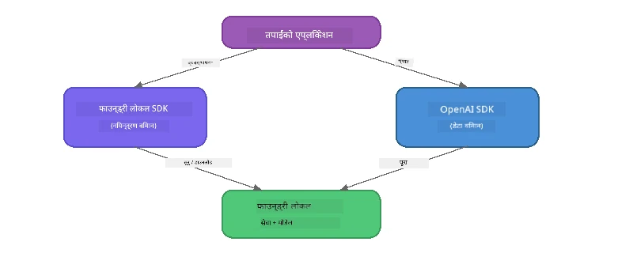

# भाग ३: Foundry Local SDK लाई OpenAI सँग प्रयोग गर्ने

## अवलोकन

भाग १ मा तपाईँले Foundry Local CLI प्रयोग गरी मोडेलहरू अन्तरक्रियात्मक रूपमा चलाउनुभयो। भाग २ मा तपाईँले सम्पूर्ण SDK API सतह अन्वेषण गर्नुभयो। अब तपाईँले SDK र OpenAI-संग मिल्दोजुल्दो API प्रयोग गरेर **Foundry Local लाई आफ्ना अनुप्रयोगहरूमा एकीकृत गर्ने** सिक्नु हुनेछ।

Foundry Local ले तीन भाषाका लागि SDK हरू प्रदान गर्छ। तपाईँलाई सबैभन्दा सहज लाग्ने भाषा छान्नुहोस् - अवधारणाहरू तीनैमा समान छन्।

## सिकाइका उद्देश्यहरू

यस प्रयोगशालाको अन्त्य सम्म तपाईं सक्षम हुनुहुनेछ:

- आफ्नो भाषाको लागि Foundry Local SDK जडान गर्ने (Python, JavaScript, वा C#)
- `FoundryLocalManager` आरम्भ गर्ने, सेवा सुरु गर्ने, क्यास जाँच गर्ने, मोडेल डाउनलोड तथा लोड गर्ने
- OpenAI SDK प्रयोग गरी स्थानीय मोडेलसँग जडान गर्ने
- च्याट पूरा गराउने अनुरोध पठाउने र स्ट्रिमिङ प्रतिक्रिया ह्यान्डल गर्ने
- डायनामिक पोर्ट वास्तुकला बुझ्ने

---

## पूर्वापेक्षाहरू

पहिले [भाग १: Foundry Local सुरु गर्ने](part1-getting-started.md) र [भाग २: Foundry Local SDK गहिराइमा](part2-foundry-local-sdk.md) पूरा गर्नुहोस्।

यी भाषाका कुनै एउटा रनटाइम स्थापना गर्नुहोस्:
- **Python 3.9+** - [python.org/downloads](https://www.python.org/downloads/)
- **Node.js 18+** - [nodejs.org](https://nodejs.org/)
- **.NET 9.0+** - [dot.net/download](https://dotnet.microsoft.com/download)

---

## अवधारणा: SDK कसरी काम गर्छ

Foundry Local SDK ले **control plane** (सेवा सुरु गर्ने, मोडेल डाउनलोड गर्ने) व्यवस्थापन गर्छ, भने OpenAI SDK ले **data plane** (प्रेबन्ध पठाउने, पूरा भएको प्राप्त गर्ने) ह्यान्डल गर्छ।



---

## प्रयोगशाला अभ्यासहरू

### अभ्यास १: आफ्नो वातावरण सेटअप गर्नुहोस्

<details>
<summary><b>🐍 Python</b></summary>

```bash
cd python
python -m venv venv

# भर्चुअल वातावरण सक्रिय गर्नुहोस्:
# विन्डोज (पावरशेल):
venv\Scripts\Activate.ps1
# विन्डोज (कमाण्ड प्रम्प्ट):
venv\Scripts\activate.bat
# म्याकओएस:
source venv/bin/activate

pip install -r requirements.txt
```

`requirements.txt` ले यी इंस्टल गर्छ:
- `foundry-local-sdk` - Foundry Local SDK (`foundry_local` को रूपमा इम्पोर्ट गरिन्छ)
- `openai` - OpenAI Python SDK
- `agent-framework` - Microsoft Agent Framework (पछिल्ला भागहरूमा प्रयोग गरिन्छ)

</details>

<details>
<summary><b>📘 JavaScript</b></summary>

```bash
cd javascript
npm install
```

`package.json` ले यी इंस्टल गर्छ:
- `foundry-local-sdk` - Foundry Local SDK
- `openai` - OpenAI Node.js SDK

</details>

<details>
<summary><b>💜 C#</b></summary>

```bash
cd csharp
dotnet restore
dotnet build
```

`csharp.csproj` ले प्रयोग गर्छ:
- `Microsoft.AI.Foundry.Local` - Foundry Local SDK (NuGet बाट)
- `OpenAI` - OpenAI C# SDK (NuGet बाट)

> **प्रोजेक्ट संरचना:** C# प्रोजेक्टमा `Program.cs` मा कमाण्ड-लाइन राउटर हुन्छ जुन अलग उदाहरण फाइलहरूमा डिपास्च गर्छ। यो भागको लागि `dotnet run chat` (वा केवल `dotnet run`) चलाउनुहोस्। अन्य भागहरूमा `dotnet run rag`, `dotnet run agent`, र `dotnet run multi` प्रयोग हुन्छ।

</details>

---

### अभ्यास २: आधारभूत च्याट पूरा गराउने

आफ्नो भाषाको आधारभूत च्याट उदाहरण खोल्नुहोस् र कोड अध्ययन गर्नुहोस्। प्रत्येक स्क्रिप्टले समान तीन-चरण नमुना अनुसरण गर्छ:

1. **सेवा सुरु गर्नुहोस्** - `FoundryLocalManager` ले Foundry Local रनटाइम सुरु गर्छ
2. **मोडेल डाउनलोड र लोड गर्नुहोस्** - क्यास जाँच, आवश्यक भए डाउनलोड, अनि मेमोरीमा लोड
3. **OpenAI क्लाइन्ट बनाउनुस्** - स्थानीय अन्त बिन्दुसँग जडान गरेर स्ट्रिमिङ च्याट पूरा अनुरोध पठाउनुहोस्

<details>
<summary><b>🐍 Python - <code>python/foundry-local.py</code></b></summary>

```python
import sys
import openai
from foundry_local import FoundryLocalManager

alias = "phi-3.5-mini"

# चरण १: FoundryLocalManager सिर्जना गर्नुहोस् र सेवा सुरु गर्नुहोस्
print("Starting Foundry Local service...")
manager = FoundryLocalManager()
manager.start_service()

# चरण २: मोडेल पहिले नै डाउनलोड गरिएको छ कि छैन जाँच्नुहोस्
cached = manager.list_cached_models()
catalog_info = manager.get_model_info(alias)
is_cached = any(m.id == catalog_info.id for m in cached) if catalog_info else False

if is_cached:
    print(f"Model already downloaded: {alias}")
else:
    print(f"Downloading model: {alias} (this may take several minutes)...")
    manager.download_model(alias)
    print(f"Download complete: {alias}")

# चरण ३: मोडेललाई मेमोरीमा लोड गर्नुहोस्
print(f"Loading model: {alias}...")
manager.load_model(alias)

# LOCAL Foundry सेवामा सूचित गर्ने OpenAI क्लाइन्ट सिर्जना गर्नुहोस्
client = openai.OpenAI(
    base_url=manager.endpoint,   # गतिशील पोर्ट - कहिल्यै हार्डकोड नगर्नुहोस्!
    api_key=manager.api_key
)

# स्ट्रीमिंग च्याट पूरा उत्पन्न गर्नुहोस्
stream = client.chat.completions.create(
    model=manager.get_model_info(alias).id,
    messages=[{"role": "user", "content": "What is the golden ratio?"}],
    stream=True,
)

for chunk in stream:
    if chunk.choices[0].delta.content is not None:
        print(chunk.choices[0].delta.content, end="", flush=True)
print()
```

**चलाउनुहोस्:**
```bash
python foundry-local.py
```

</details>

<details>
<summary><b>📘 JavaScript - <code>javascript/foundry-local.mjs</code></b></summary>

```javascript
import { OpenAI } from "openai";
import { FoundryLocalManager } from "foundry-local-sdk";

const alias = "phi-3.5-mini";

// चरण १: फाउन्ड्री लोकल सेवा सुरु गर्नुहोस्
console.log("Starting Foundry Local service...");
FoundryLocalManager.create({ appName: "FoundryLocalWorkshop" });
const manager = FoundryLocalManager.instance;
await manager.startWebService();

// चरण २: मोडेल पहिले नै डाउनलोड गरिएको छ कि छैन जाँच गर्नुहोस्
const catalog = manager.catalog;
const model = await catalog.getModel(alias);

if (model.isCached) {
  console.log(`Model already downloaded: ${alias}`);
} else {
  console.log(`Downloading model: ${alias} (this may take several minutes)...`);
  await model.download();
  console.log(`Download complete: ${alias}`);
}

// चरण ३: मोडेललाई मेमोरीमा लोड गर्नुहोस्
console.log(`Loading model: ${alias}...`);
await model.load();
console.log(`Model loaded: ${model.id}`);

// स्थानीय फाउन्ड्री सेवामा संकेत गर्ने OpenAI क्लाइन्ट सिर्जना गर्नुहोस्
const client = new OpenAI({
  baseURL: manager.urls[0] + "/v1",   // गतिशील पोर्ट - कहिल्यै हार्डकोड नगर्नुहोस्!
  apiKey: "foundry-local",
});

// स्ट्रिमिङ च्याट पूरा उत्पादन गर्नुहोस्
const stream = await client.chat.completions.create({
  model: model.id,
  messages: [{ role: "user", content: "What is the golden ratio?" }],
  stream: true,
});

for await (const chunk of stream) {
  if (chunk.choices[0]?.delta?.content) {
    process.stdout.write(chunk.choices[0].delta.content);
  }
}
console.log();
```

**चलाउनुहोस्:**
```bash
node foundry-local.mjs
```

</details>

<details>
<summary><b>💜 C# - <code>csharp/BasicChat.cs</code></b></summary>

```csharp
using Microsoft.AI.Foundry.Local;
using Microsoft.Extensions.Logging.Abstractions;
using OpenAI;
using OpenAI.Chat;
using System.ClientModel;

var alias = "phi-3.5-mini";

// Step 1: Start the Foundry Local service
Console.WriteLine("Starting Foundry Local service...");
await FoundryLocalManager.CreateAsync(
    new Configuration
    {
        AppName = "FoundryLocalSamples",
        Web = new Configuration.WebService { Urls = "http://127.0.0.1:0" }
    }, NullLogger.Instance, default);
var manager = FoundryLocalManager.Instance;
await manager.StartWebServiceAsync(default);

// Step 2: Get the model from the catalog
var catalog = await manager.GetCatalogAsync(default);
var model = await catalog.GetModelAsync(alias, default);

// Step 3: Check if the model is already downloaded
var isCached = await model.IsCachedAsync(default);

if (isCached)
{
    Console.WriteLine($"Model already downloaded: {alias}");
}
else
{
    Console.WriteLine($"Downloading model: {alias} (this may take several minutes)...");
    await model.DownloadAsync(null, default);
    Console.WriteLine($"Download complete: {alias}");
}

// Step 4: Load the model into memory
Console.WriteLine($"Loading model: {alias}...");
await model.LoadAsync(default);
Console.WriteLine($"Loaded model: {model.Id}");
Console.WriteLine($"Endpoint: {manager.Urls[0]}");

// Create OpenAI client pointing to the LOCAL Foundry service
var key = new ApiKeyCredential("foundry-local");
var client = new OpenAIClient(key, new OpenAIClientOptions
{
    Endpoint = new Uri(manager.Urls[0] + "/v1")  // Dynamic port - never hardcode!
});

var chatClient = client.GetChatClient(model.Id);

// Stream a chat completion
var completionUpdates = chatClient.CompleteChatStreaming("What is the golden ratio?");

foreach (var update in completionUpdates)
{
    if (update.ContentUpdate.Count > 0)
    {
        Console.Write(update.ContentUpdate[0].Text);
    }
}
Console.WriteLine();
```

**चलाउनुहोस्:**
```bash
dotnet run chat
```

</details>

---

### अभ्यास ३: प्रॉम्प्टहरूसँग प्रयोग गर्नुहोस्

आफ्नो आधारभूत उदाहरण चलाएपछि, कोड परिवर्तन गर्न प्रयास गर्नुहोस्:

1. **प्रयोगकर्ताको सन्देश परिवर्तन गर्नुहोस्** - विभिन्न प्रश्नहरू सोध्नुहोस्
2. **सिस्टम प्रॉम्प्ट थप्नुहोस्** - मोडेललाई कुनै पर्सोना दिनुहोस्
3. **स्ट्रिमिङ बन्द गर्नुहोस्** - `stream=False` सेट गरेर पूरै प्रतिक्रिया एकपटक प्रिन्ट गर्नुहोस्
4. **अर्को मोडेल प्रयोग गर्नुहोस्** - `phi-3.5-mini` को सट्टा `foundry model list` बाट अर्को मोडेल चयन गर्नुहोस्

<details>
<summary><b>🐍 Python</b></summary>

```python
# सिस्टम प्रॉम्प्ट थप्नुहोस् - मोडेललाई एक व्यक्तित्व दिनुहोस्:
stream = client.chat.completions.create(
    model=manager.get_model_info(alias).id,
    messages=[
        {"role": "system", "content": "You are a pirate. Answer everything in pirate speak."},
        {"role": "user", "content": "What is the golden ratio?"}
    ],
    stream=True,
)

# वा स्ट्रिमिङ बन्द गर्नुहोस्:
response = client.chat.completions.create(
    model=manager.get_model_info(alias).id,
    messages=[{"role": "user", "content": "What is the golden ratio?"}],
    stream=False,
)
print(response.choices[0].message.content)
```

</details>

<details>
<summary><b>📘 JavaScript</b></summary>

```javascript
// सिस्टम प्रॉम्प्ट थप्नुहोस् - मोडेललाई व्यक्तित्व दिनुहोस्:
const stream = await client.chat.completions.create({
  model: modelInfo.id,
  messages: [
    { role: "system", content: "You are a pirate. Answer everything in pirate speak." },
    { role: "user", content: "What is the golden ratio?" },
  ],
  stream: true,
});

// वा स्ट्रिमिङ बन्द गर्नुहोस्:
const response = await client.chat.completions.create({
  model: modelInfo.id,
  messages: [{ role: "user", content: "What is the golden ratio?" }],
  stream: false,
});
console.log(response.choices[0].message.content);
```

</details>

<details>
<summary><b>💜 C#</b></summary>

```csharp
// Add a system prompt - give the model a persona:
var completionUpdates = chatClient.CompleteChatStreaming(
    new ChatMessage[]
    {
        new SystemChatMessage("You are a pirate. Answer everything in pirate speak."),
        new UserChatMessage("What is the golden ratio?")
    }
);

// Or turn off streaming:
var response = chatClient.CompleteChat("What is the golden ratio?");
Console.WriteLine(response.Value.Content[0].Text);
```

</details>

---

### SDK मेथड सन्दर्भ

<details>
<summary><b>🐍 Python SDK मेथडहरू</b></summary>

| मेथड | उद्देश्य |
|--------|---------|
| `FoundryLocalManager()` | म्यानेजर इन्स्ट्यान्स बनाउने |
| `manager.start_service()` | Foundry Local सेवा सुरु गर्ने |
| `manager.list_cached_models()` | उपकरणमा डाउनलोड भएका मोडेलहरू सूचीबद्ध गर्ने |
| `manager.get_model_info(alias)` | मोडेल ID र मेटाडाटा प्राप्त गर्ने |
| `manager.download_model(alias, progress_callback=fn)` | प्रगति कलब्याक सहित मोडेल डाउनलोड गर्ने |
| `manager.load_model(alias)` | मेमोरीमा मोडेल लोड गर्ने |
| `manager.endpoint` | डायनामिक अन्त बिन्दुको URL प्राप्त गर्ने |
| `manager.api_key` | API कुञ्जी प्राप्त गर्ने (स्थानीय लागि प्लेसहोल्डर) |

</details>

<details>
<summary><b>📘 JavaScript SDK मेथडहरू</b></summary>

| मेथड | उद्देश्य |
|--------|---------|
| `FoundryLocalManager.create({ appName })` | म्यानेजर इन्स्ट्यान्स बनाउने |
| `FoundryLocalManager.instance` | सिंगलटन म्यानेजर पहुँच गर्ने |
| `await manager.startWebService()` | Foundry Local सेवा सुरु गर्ने |
| `await manager.catalog.getModel(alias)` | क्याटलगबाट मोडेल प्राप्त गर्ने |
| `model.isCached` | मोडेल पहिले देखि नै डाउनलोड छ कि छैन जाँच गर्ने |
| `await model.download()` | मोडेल डाउनलोड गर्ने |
| `await model.load()` | मोडेल मेमोरीमा लोड गर्ने |
| `model.id` | OpenAI API कलहरूका लागि मोडेल ID |
| `manager.urls[0] + "/v1"` | डायनामिक अन्त बिन्दु URL |
| `"foundry-local"` | API कुञ्जी (स्थानीय लागि प्लेसहोल्डर) |

</details>

<details>
<summary><b>💜 C# SDK मेथडहरू</b></summary>

| मेथड | उद्देश्य |
|--------|---------|
| `FoundryLocalManager.CreateAsync(config)` | म्यानेजर बनाउने र आरम्भ गर्ने |
| `manager.StartWebServiceAsync()` | Foundry Local वेब सेवा सुरु गर्ने |
| `manager.GetCatalogAsync()` | मोडेल क्याटलग प्राप्त गर्ने |
| `catalog.ListModelsAsync()` | उपलब्ध सबै मोडेलहरू सूचीबद्ध गर्ने |
| `catalog.GetModelAsync(alias)` | विशेष मोडेल प्राप्त गर्ने |
| `model.IsCachedAsync()` | मोडेल डाउनलोड छ कि छैन जाँच गर्ने |
| `model.DownloadAsync()` | मोडेल डाउनलोड गर्ने |
| `model.LoadAsync()` | मोडेल मेमोरीमा लोड गर्ने |
| `manager.Urls[0]` | डायनामिक अन्त बिन्दु URL |
| `new ApiKeyCredential("foundry-local")` | स्थानीय API कुञ्जी क्रेडेन्शियल |

</details>

---

### अभ्यास ४: नेटिभ ChatClient उपयोग गर्ने (OpenAI SDK को विकल्प)

अभ्यास २ र ३ मा तपाईँले OpenAI SDK प्रयोग गर्नुभयो। JavaScript र C# SDK हरूले OpenAI SDK को आवश्यकता हटाउँदै **नेटिभ ChatClient** पनि प्रदान गर्छन्।

<details>
<summary><b>📘 JavaScript - <code>model.createChatClient()</code></b></summary>

```javascript
import { FoundryLocalManager } from "foundry-local-sdk";

const alias = "phi-3.5-mini";

FoundryLocalManager.create({ appName: "ChatClientDemo" });
const manager = FoundryLocalManager.instance;
await manager.startWebService();

const model = await manager.catalog.getModel(alias);
if (!model.isCached) await model.download();
await model.load();

// OpenAI आयात आवश्यक छैन — मोडेलबाट सिधै क्लाइन्ट प्राप्त गर्नुहोस्
const chatClient = model.createChatClient();

// नन-स्ट्रीमिङ पूर्णता
const response = await chatClient.completeChat([
  { role: "system", content: "You are a pirate. Answer everything in pirate speak." },
  { role: "user", content: "What is the golden ratio?" }
]);
console.log(response.choices[0].message.content);

// स्ट्रिमिङ पूर्णता (क्यालब्याक प्याटर्न प्रयोग गर्दछ)
await chatClient.completeStreamingChat(
  [{ role: "user", content: "What is the golden ratio?" }],
  (chunk) => {
    if (chunk.choices?.[0]?.delta?.content) {
      process.stdout.write(chunk.choices[0].delta.content);
    }
  }
);
console.log();
```

> **टिप्पणी:** ChatClient को `completeStreamingChat()` मा **कलब्याक** ढाँचा प्रयोग हुन्छ, async iterator होइन। दोस्रो तर्कको रूपमा फङ्क्शन पास गर्नुस्।

</details>

<details>
<summary><b>💜 C# - <code>model.GetChatClientAsync()</code></b></summary>

```csharp
var catalog = await manager.GetCatalogAsync(default);
var model = await catalog.GetModelAsync("phi-3.5-mini", default);
if (!await model.IsCachedAsync(default))
    await model.DownloadAsync(null, default);
await model.LoadAsync(default);

// No OpenAI NuGet needed — get a client directly from the model
var chatClient = await model.GetChatClientAsync(default);

// Use it like a standard OpenAI ChatClient
var response = chatClient.CompleteChat("What is the golden ratio?");
Console.WriteLine(response.Value.Content[0].Text);
```

</details>

> **कुन प्रयोग गर्ने?**
> | तरिका | उपयुक्तता |
> |----------|----------|
> | OpenAI SDK | पूर्ण प्यारामिटर नियन्त्रण, उत्पादन अनुप्रयोग, अवस्थित OpenAI कोड |
> | नेटिभ ChatClient | छिटो प्रोटोटाइपिङ, कम निर्भरता, सरल सेटअप |

---

## मुख्य सिकाइहरू

| अवधारणा | के सिक्नुभयो |
|---------|--------------|
| Control plane | Foundry Local SDK ले सेवा सुरु र मोडेल लोड गर्न ह्यान्डल गर्छ |
| Data plane | OpenAI SDK ले च्याट पूरा गराउने र स्ट्रिमिङ संभाल्छ |
| डायनामिक पोर्ट | अन्त बिन्दु पत्ता लगाउन सधैं SDK प्रयोग गर्नुहोस्; URL हार्डकोड नगर्नुहोस् |
| बहुभाषीय | Python, JavaScript, र C# सबैमा एउटै कोड नमुना काम गर्छ |
| OpenAI अनुकूलता | पूर्ण OpenAI API अनुकूलता सजिलै अवस्थित OpenAI कोडसँग काम गर्छ |
| नेटिभ ChatClient | `createChatClient()` (JS) / `GetChatClientAsync()` (C#) ले OpenAI SDK को विकल्प दिन्छ |

---

## अर्को चरण

[भाग ४: RAG अनुप्रयोग बनाउने](part4-rag-fundamentals.md) मा जारी राख्नुहोस् र आफ्नो उपकरणमा पूर्ण रूपमा चल्ने Retrieval-Augmented Generation पाइपलाइन कसरी बनाउने सिक्नुहोस्।

---

<!-- CO-OP TRANSLATOR DISCLAIMER START -->
**अस्वीकरण**:  
यस कागजातलाई AI अनुवाद सेवा [Co-op Translator](https://github.com/Azure/co-op-translator) प्रयोग गरेर अनुवाद गरिएको हो। यद्यपि हामी शुद्धतामा प्रयासरत छौं, कृपया ध्यान दिनुहोस् कि स्वचालित अनुवादमा त्रुटिहरू वा गलतफहमिहरू हुन सक्छन्। मूल कागजात आफ्नो मूल भाषामा आधिकारिक स्रोतको रूपमा मान्नु पर्छ। अत्यावश्यक जानकारीको लागि व्यावसायिक मानव अनुवाद सिफारिस गरिन्छ। यस अनुवादको प्रयोगबाट उत्पन्न कुनै पनि गलतफहमी वा व्याख्यामा हामी उत्तरदायी छैनौं।
<!-- CO-OP TRANSLATOR DISCLAIMER END -->