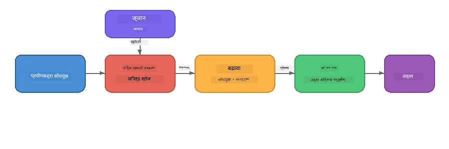

# भाग ४: Foundry Local सँग RAG अनुप्रयोग निर्माण

## अवलोकन

ठूला भाषा मोडेलहरू शक्तिशाली छन्, तर तिनीहरूले केवल आफ्नो प्रशिक्षण डाटामा भएका कुराहरू मात्र जान्दछन्। **Retrieval-Augmented Generation (RAG)** यसलाई समाधान गर्छ मोडेललाई क्वेरी समयमा सान्दर्भिक प्रसंग उपलब्ध गराएर - तपाईंका आफ्नै कागजातहरू, डाटाबेसहरू, वा ज्ञान आधारहरूबाट तानेर।

यस प्रयोगशालामा तपाईंले पूर्ण RAG पाइपलाइन बनाउन सक्नुहुनेछ जुन **पूर्ण रूपमा तपाईंको उपकरणमा** Foundry Local को प्रयोग गरेर चल्छ। कुनै क्लाउड सेवा छैन, कुनै भेक्टर डाटाबेस छैन, कुनै एम्बेडिङ API छैन - केवल स्थानीय पुनःप्राप्ति र स्थानीय मोडेल मात्र।

## सिक्ने उद्देश्यहरू

यस प्रयोगशालाको अन्त्यसम्म तपाईं सक्षम हुनुहुनेछ:

- RAG के हो र किन यो AI अनुप्रयोगहरूको लागि महत्वपूण्‍ण छ बुझाउन
- पाठ कागजातहरूबाट स्थानीय ज्ञान आधार बनाउनु
- सान्दर्भिक प्रसंग खोज्न सरल पुनःप्राप्ति कार्यान्वयन गर्नु
- प्राप्त तथ्यहरूमा मोडेल आधारित गर्ने प्रणाली प्रॉम्प्ट बनाउन
- पूर्ण Retrieve → Augment → Generate पाइपलाइन उपकरणमा सञ्चालन गर्नु
- सरल कीवर्ड पुनःप्राप्ति र भेक्टर खोजको बीचमा व्यापार-बन्दीहरू बुझ्नु

---

## आवश्यकताहरू

- पुरा गर्नुहोस् [भाग ३: Foundry Local SDK लाई OpenAI सँग प्रयोग गर्ने](part3-sdk-and-apis.md)
- Foundry Local CLI स्थापना गरिएको र `phi-3.5-mini` मोडेल डाउनलोड गरिएको

---

## अवधारणा: RAG के हो?

RAG बिना, LLM केवल आफ्नो प्रशिक्षण डाटाबाट मात्र उत्तर दिन सक्छ - जुन पुरानो, अपूर्ण, वा तपाईंको व्यक्तिगत जानकारी नहुन पनि सक्छ:

```
User: "What is Zava's return policy?"
LLM:  "I do not have information about Zava's return policy."  ← No context!
```

RAG सँग, तपाईंले पहिले **प्रासंगिक कागजातहरू पुनःप्राप्त गर्नुहुन्छ**, त्यसपछि त्यो प्रसंगसँग प्रॉम्प्टलाई **बढाउनुहुन्छ** र अन्ततः **उत्तर सिर्जना** गर्नुहुन्छ:



मुख्य बुझाइ: **मोडेललाई उत्तर "जान्न" आवश्यक छैन; यसले केवल सही कागजातहरू पढ्नुपर्छ।**

---

## प्रयोगशाला अभ्यासहरू

### अभ्यास १: ज्ञान आधार बुझ्नुहोस्

तपाईंको भाषाको RAG उदाहरण खोल्नुहोस् र ज्ञान आधार जाँच गर्नुहोस्:

<details>
<summary><b>🐍 Python: <code>python/foundry-local-rag.py</code></b></summary>

ज्ञान आधार एक सरल शब्दकोशहरूको सूची हो जसमा `title` र `content` क्षेत्रहरू छन्:

```python
KNOWLEDGE_BASE = [
    {
        "title": "Foundry Local Overview",
        "content": (
            "Foundry Local brings the power of Azure AI Foundry to your local "
            "device without requiring an Azure subscription..."
        ),
    },
    {
        "title": "Supported Hardware",
        "content": (
            "Foundry Local automatically selects the best model variant for "
            "your hardware. If you have an Nvidia CUDA GPU it downloads the "
            "CUDA-optimized model..."
        ),
    },
    # ... थप प्रविष्टिहरू
]
```

हरेक प्रविष्टि ज्ञानको एक "टुक्रो" प्रतिनिधित्व गर्दछ - एउटै विषयमा केन्द्रित जानकारीको अंश।

</details>

<details>
<summary><b>📘 JavaScript: <code>javascript/foundry-local-rag.mjs</code></b></summary>

ज्ञान आधार वस्तुहरूको एउटै सरणीको संरचना प्रयोग गर्दछ:

```javascript
const KNOWLEDGE_BASE = [
  {
    title: "Foundry Local Overview",
    content:
      "Foundry Local brings the power of Azure AI Foundry to your local " +
      "device without requiring an Azure subscription...",
  },
  {
    title: "Supported Hardware",
    content:
      "Foundry Local automatically selects the best model variant for " +
      "your hardware...",
  },
  // ... थप प्रविष्टिहरू
];
```

</details>

<details>
<summary><b>💜 C#: <code>csharp/RagPipeline.cs</code></b></summary>

ज्ञान आधार नामाकृत टुपलहरूको सूची प्रयोग गर्दछ:

```csharp
private static readonly List<(string Title, string Content)> KnowledgeBase =
[
    ("Foundry Local Overview",
     "Foundry Local brings the power of Azure AI Foundry to your local " +
     "device without requiring an Azure subscription..."),

    ("Supported Hardware",
     "Foundry Local automatically selects the best model variant for " +
     "your hardware..."),

    // ... more entries
];
```

</details>

> **वास्तविक अनुप्रयोगमा**, ज्ञान आधार फाइलहरू, डाटाबेस, खोज सूचकांक, वा API बाट आउँछ। यस प्रयोगशालामा, हामी सजिलो बनाउन स्मृति-मा आधारित सूची प्रयोग गर्छौं।

---

### अभ्यास २: पुनःप्राप्ति कार्य बुझ्नुहोस्

पुनःप्राप्ति चरणले प्रयोगकर्ताको प्रश्नका लागि सबैभन्दा सान्दर्भिक टुक्राहरू पत्ता लगाउँछ। यो उदाहरणले **कीवर्ड ओभरलैप** प्रयोग गर्छ - कति शब्दहरू क्वेरीमा छन् र प्रत्येक टुक्रामा पनि छन् गने:

<details>
<summary><b>🐍 Python</b></summary>

```python
def retrieve(query: str, top_k: int = 2) -> list[dict]:
    """Return the top-k knowledge chunks most relevant to the query."""
    query_words = set(query.lower().split())
    scored = []
    for chunk in KNOWLEDGE_BASE:
        chunk_words = set(chunk["content"].lower().split())
        overlap = len(query_words & chunk_words)
        scored.append((overlap, chunk))
    scored.sort(key=lambda x: x[0], reverse=True)
    return [item[1] for item in scored[:top_k]]
```

</details>

<details>
<summary><b>📘 JavaScript</b></summary>

```javascript
function retrieve(query, topK = 2) {
  const queryWords = new Set(query.toLowerCase().split(/\s+/));
  const scored = KNOWLEDGE_BASE.map((chunk) => {
    const chunkWords = new Set(chunk.content.toLowerCase().split(/\s+/));
    let overlap = 0;
    for (const w of queryWords) {
      if (chunkWords.has(w)) overlap++;
    }
    return { overlap, chunk };
  });
  scored.sort((a, b) => b.overlap - a.overlap);
  return scored.slice(0, topK).map((s) => s.chunk);
}
```

</details>

<details>
<summary><b>💜 C#</b></summary>

```csharp
private static List<(string Title, string Content)> Retrieve(string query, int topK = 2)
{
    var queryWords = new HashSet<string>(
        query.ToLowerInvariant().Split(' ', StringSplitOptions.RemoveEmptyEntries));

    return KnowledgeBase
        .Select(chunk =>
        {
            var chunkWords = new HashSet<string>(
                chunk.Content.ToLowerInvariant().Split(' ', StringSplitOptions.RemoveEmptyEntries));
            var overlap = queryWords.Intersect(chunkWords).Count();
            return (Overlap: overlap, Chunk: chunk);
        })
        .OrderByDescending(x => x.Overlap)
        .Take(topK)
        .Select(x => x.Chunk)
        .ToList();
}
```

</details>

**कार्य प्रकृति:**
1. क्वेरीलाई व्यक्तिगत शब्दहरूमा विभाजित गर्नुहोस्
2. प्रत्येक ज्ञानको टुक्राको लागि, कति क्वेरी शब्दहरू त्यो टुक्रामा छन् गन्नुहोस्
3. ओभरलैप अंक अनुसार (सबैभन्दा उच्च पहिलो) क्रमबद्ध गर्नुहोस्
4. शीर्ष-k सबैभन्दा प्रासंगिक टुक्राहरू फिर्ता गर्नुहोस्

> **व्यापार-बन्दी:** कीवर्ड ओभरलैप सरल छ तर सीमित छ; यसले पर्यायवाची वा अर्थ बुझ्दैन। उत्पादन RAG प्रणालीहरूले सामान्यतया **एम्बेडिङ भेक्टरहरू** र **भेक्टर डाटाबेस** प्रयोग गर्छन् सेम्यान्टिक खोजका लागि। तर, कीवर्ड ओभरलैप सुरु गर्ने राम्रो तरिका हो र अतिरिक्त निर्भरताहरू आवश्यक पर्दैन।

---

### अभ्यास ३: बढाइएको प्रॉम्प्ट बुझ्नुहोस्

पुनःप्राप्त सन्दर्भ **प्रणाली प्रॉम्प्ट** मा समावेश गरिन्छ मोडेललाई पठाउनु अघि:

```python
system_prompt = (
    "You are a helpful assistant. Answer the user's question using ONLY "
    "the information provided in the context below. If the context does "
    "not contain enough information, say so.\n\n"
    f"Context:\n{context_text}"
)
```

प्रमुख डिजाइन निर्णयहरू:
- **"केवल दिइएको जानकारी"** - मोडेललाई प्रसंग बाहिरका तथ्यहरू कल्पना गर्नुबाट रोक्छ
- **"यदि प्रसंगमा पर्याप्त जानकारी छैन भने त्यसो भन्नुहोस्"** - ईमान्दार "मलाई थाहा छैन" उत्तरलाई प्रोत्साहित गर्छ
- प्रसंग प्रणाली सन्देशमा राखिन्छ ताकि यसले सबै उत्तरहरूमा प्रभाव पारोस्

---

### अभ्यास ४: RAG पाइपलाइन चलाउनुहोस्

पूर्ण उदाहरण चलाउनुहोस्:

**Python:**
```bash
cd python
python foundry-local-rag.py
```

**JavaScript:**
```bash
cd javascript
node foundry-local-rag.mjs
```

**C#:**
```bash
cd csharp
dotnet run rag
```

तपाईंले तीन कुराहरू प्रिन्ट देख्नुहुनेछ:
1. सोधिएको **प्रश्न**
2. **पुनःप्राप्त सन्दर्भ** - ज्ञान आधारबाट छनोट गरिएका टुक्राहरू
3. **उत्तर** - मोडेलले केवल त्यो सन्दर्भ प्रयोग गरेर सिर्जना गरेको

उदाहरण आउटपुट:
```
Question: How do I install Foundry Local and what hardware does it support?

--- Retrieved Context ---
### Installation
On Windows install Foundry Local with: winget install Microsoft.FoundryLocal...

### Supported Hardware
Foundry Local automatically selects the best model variant for your hardware...
-------------------------

Answer: To install Foundry Local, you can use the following methods depending
on your operating system: On Windows, run `winget install Microsoft.FoundryLocal`.
On macOS, use `brew install microsoft/foundrylocal/foundrylocal`...
```

ध्यान दिनुहोस् कसरी मोडेलको उत्तर पुनःप्राप्त सन्दर्भमा आधारित छ - यो केवल ज्ञान आधार कागजातहरूका तथ्यहरू मात्र उल्लेख गर्छ।

---

### अभ्यास ५: प्रयोग गर्नुहोस् र विस्तार गर्नुहोस्

तपाईंको बुझाइ गहिरो बनाउन यी परिमार्जनहरू प्रयास गर्नुहोस्:

1. **प्रश्न परिवर्तन गर्नुहोस्** - ज्ञान आधारमा भएको वा नहुने कुरा सोध्नुहोस्:
   ```python
   question = "What programming languages does Foundry Local support?"  # ← सन्दर्भमा
   question = "How much does Foundry Local cost?"                       # ← सन्दर्भमा छैन
   ```
   जब उत्तर प्रसंगमा नहुन्छ, के मोडेल सहीसँग "मलाई थाहा छैन" भन्छ?

2. **नयाँ ज्ञान टुक्रा थप्नुहोस्** - `KNOWLEDGE_BASE` मा नयाँ प्रविष्टि थप्नुहोस्:
   ```python
   {
       "title": "Pricing",
       "content": "Foundry Local is completely free and open source under the MIT license.",
   }
   ```
   फेरि मूल्य निर्धारण प्रश्न सोध्नुहोस्।

3. **`top_k` बदल्नुहोस्** - बढी वा कम टुक्राहरू पुनःप्राप्त गर्नुहोस्:
   ```python
   context_chunks = retrieve(question, top_k=3)  # थप सन्दर्भ
   context_chunks = retrieve(question, top_k=1)  # कम सन्दर्भ
   ```
   कस्तो प्रसंगको मात्राले उत्तरको गुणस्तरलाई कसरी असर गर्छ?

4. **ग्राउन्डिङ निर्देशन हटाउनुहोस्** - प्रणाली प्रॉम्प्टलाई "तपाईं सहयोगी सहायक हुनुहुन्छ।" मा मात्र परिवर्तन गर्नुहोस् र हेर्नुहोस् मोडेल तथ्यहरू कल्पना गर्न थाल्छ कि छैन।

---

## गहिरो जानकारी: उपकरणमा प्रदर्शनका लागि RAG अनुकूलन

RAG लाई उपकरणमा सञ्चालन गर्दा क्लाउड जहाँ सीमाहरू हुँदैनन् त्यो सीमाहरू आउँछन्: सीमित RAM, समर्पित GPU छैन (CPU/NPU सञ्चालन), र सानो मोडेल प्रसंग विन्डो। तलका डिजाइन निर्णयहरूले यी सीमाहरूलाई प्रत्यक्ष सम्बोधन गर्छन् र Foundry Local सँग निर्माण भएका उत्पादन-शैली स्थानीय RAG अनुप्रयोगहरूको ढाँचाको आधारमा छन्।

### टुक्रा गर्ने रणनीति: निश्चित आकारको सर्ने विन्डो

टुक्रा गर्ने - कागजातलाई टुक्रामा विभाजन गर्ने तरिका - कुनै पनि RAG प्रणालीमा सबैभन्दा प्रभावशाली निर्णयहरूमध्ये एक हो। उपकरणमा चलाउने परिदृश्यका लागि, **ओभरलैप सहित निश्चित आकारको सर्ने विन्डो** सिफारिस गरिएको सुरुवात हो:

| प्यारामीटर | सिफारिश गरिएको मूल्य | किन |
|-----------|----------------------|------|
| **टुक्रा आकार** | ~२०० टोकन | पुनःप्राप्त प्रसंगलाई छोटो राख्छ, Phi-3.5 Mini को प्रसंग विन्डोमा प्रणाली प्रॉम्प्ट, कुराकानी इतिहास, र उत्पन्न आउटपुटका लागि स्थान बाँच्छ |
| **ओभरलैप** | ~२५ टोकन (१२.५%) | टुक्राको सिमानामा जानकारी हराउने रोक्छ - प्रक्रिया र चरण-द्वारा-चरण निर्देशनहरूका लागि महत्वपूर्ण |
| **टोकनाइजेसन** | खाली ठाउँमा विभाजन | कुनै निर्भरता छैन, कुनै टोकनाइजर लाइब्रेरी आवश्यक छैन। सम्पूर्ण गणना बजेट LLM सँग रहन्छ |

ओभरलैपले सर्ने विन्डो जस्तै काम गर्छ: प्रत्येक नयाँ टुक्रा अघिल्लो समाप्त हुनु भन्दा २५ टोकन पहिले सुरु हुन्छ, त्यसैले वाक्यहरू जुन टुक्रा सिमानामा फैलिएका छन् दुबै टुक्रामा देखा पर्छन्।

> **किन अन्य रणनीतिहरू होइन?**
> - **वाक्य-आधारित विभाजन** अनिश्चित टुक्रा आकार बनाउँछ; केही सुरक्षा प्रक्रियाहरू एकल लामो वाक्य हुन्छन् जुन राम्रोसँग विभाजित हुँदैन
> - **खण्ड-जानकारी विभाजन** (`##` शीर्षकमा) धेरै फरक टुक्रा आकारहरू बनाउँछ - केही धेरै साना, केहि मोडेलको प्रसंग विन्डोको लागि धेरै ठूलो
> - **सामान्यचित ढाँचाको टुक्रा गर्ने** (एम्बेडिङ आधारित विषय पत्ता लगाउने) सबैभन्दा राम्रो पुनःप्राप्त गुणस्तर दिन्छ, तर Phi-3.5 Mini सँगै मेमोरीमा दोस्रो मोडेल आवश्यक पर्छ - ८-१६ GB साझा मेमोरी भएको हार्डवेयरमा जोखिमपूर्ण

### पुनःप्राप्ति सुधार्ने: TF-IDF भेक्टरहरू

यस प्रयोगशालामा प्रयोग गरिएको कीवर्ड ओभरलैप विधि काम गर्छ, तर तपाईं अझ राम्रो पुनःप्राप्ति चाहनुहुन्छ भने र एम्बेडिङ मोडेल थप्न नचाहनुहुन्छ भने **TF-IDF (Term Frequency-Inverse Document Frequency)** उत्कृष्ट मध्य मार्ग हो:

```
Keyword Overlap  →  TF-IDF Vectors  →  Embedding Models
    (this lab)     (lightweight upgrade)   (production)
  Simple & fast    Better ranking,         Best quality,
  No dependencies  still no ML model       requires embedding model
  ~Basic matching  ~1ms retrieval          ~100-500ms per query
```

TF-IDF प्रत्येक टुक्रालाई संख्यात्मक भेक्टरमा परिणत गर्छ जुन कति शब्द महत्त्वपूर्ण छ त्यो टुक्रामा *सबै टुक्राहरू सापेक्ष*। क्वेरी समयमा प्रश्न त्यही तरिकाले भेक्टराइज गरिन्छ र कासिन समानताका आधारमा तुलना गरिन्छ। तपाईंले यसलाई SQLite र शुद्ध JavaScript/Python प्रयोग गरेर लागू गर्न सक्नुहुन्छ - कुनै भेक्टर डाटाबेस, कुनै एम्बेडिङ API छैन।

> **प्रदर्शन:** निश्चित आकारका टुक्राहरूमा TF-IDF कासिन समानता सामान्यतया **~१ms पुनःप्राप्ति** प्रदान गर्छ, जबकि एम्बेडिङ मोडेलले प्रत्येक क्वेरीलाई इन्कोड गर्दा ~१००-५००ms लाग्छ। २०+ कागजातहरूलाई एक सेकेन्ड भित्र टुक्रा गरेर इन्डेक्स गर्न सकिन्छ।

### सीमित उपकरणहरूको लागि एज/कम्प्याक्ट मोड

अत्यन्त सीमित हार्डवेयर (पुराना ल्यापटप, ट्याब्लेट, फील्ड उपकरण) मा चलाउँदा, तपाईं स्रोत उपयोग घटाउन तीन थान नियन्त्रणहरू घटाउन सक्नुहुन्छ:

| सेटिङ | मानक मोड | एज/कम्प्याक्ट मोड |
|---------|------------|--------------------|
| **प्रणाली प्रॉम्प्ट** | ~३०० टोकन | ~८० टोकन |
| **अधिकतम आउटपुट टोकन** | १०२४ | ५१२ |
| **पुनःप्राप्त टुक्राहरू (top-k)** | ५ | ३ |

कम पुनःप्राप्त टुक्राले मोडेललाई कम प्रसंग प्रोसेस गर्न दिन्छ, जसले लेटेंसी र मेमोरी दबाब कम गर्छ। छोटो प्रणाली प्रॉम्प्टले वाकई उत्तरका लागि प्रसंग विन्डोको बढी हिस्सा खाली हुन्छ। यस्तो व्यापार-बन्दी ती उपकरणहरूमा मूल्यवान हुन्छ जहाँ प्रत्येक टोकनको प्रसंग विन्डो महत्त्व राख्छ।

### मेमोरीमा एकल मोडेल

अनिवार्य सिद्धान्त: **फरक फरक मोडेलहरू मेमोरीमा नचलाउनुहोस्**। पुनःप्राप्त का लागि एम्बेडिङ मोडेल र उत्पादनको लागि भाषा मोडेल प्रयोग गर्दा सीमित NPU/RAM स्रोत दुई मोडेलमा विभाजन हुन्छ। हल्का पुनःप्राप्ति (कीवर्ड ओभरलैप, TF-IDF) यो टाळ्छ:

- LLM सँग प्रतिस्पर्धा गर्ने एम्बेडिङ मोडेल छैन
- छिटो शुरूआत - केवल एक मोडेल लोड हुन्छ
- अनुमानित मेमोरी उपयोग - LLM ले सबै स्रोत प्रयोग गर्छ
- ८ GB RAM मात्र भएको कम्प्युटरमा पनि काम गर्छ

### स्थानीय भेक्टर स्टोरका लागि SQLite

सानो-देखि-मध्यम कागजात संग्रह (सयौंदेखि हजारौं टुक्राहरू) का लागि, **SQLite पर्याप्त छ** कासिन समानता खोजका लागि र कुनै अतिरिक्त पूर्वाधार आवश्यक छैन:

- डिस्कमा एकल `.db` फाइल - कुनै सर्भर प्रक्रिया छैन, कुनै कन्फिगरेसन छैन
- सबै मुख्य भाषा रनटाइमसँग छ (Python `sqlite3`, Node.js `better-sqlite3`, .NET `Microsoft.Data.Sqlite`)
- कागजातका टुक्राहरू र तिनका TF-IDF भेक्टरहरू एउटै तालिकामा भण्डारण गर्दछ
- यस स्केलमा Pinecone, Qdrant, Chroma, वा FAISS आवश्यक पर्दैन

### प्रदर्शन सारांश

यी डिजाइन निर्णयहरूले उपभोक्ता हार्डवेयरमा प्रतिक्रिया दिने RAG प्रदान गर्छन्:

| मेट्रिक | उपकरणमा प्रदर्शन |
|----------|-----------------|
| **पुनःप्राप्ति लेटेंसी** | ~१ms (TF-IDF) देखि ~५ms (कीवर्ड ओभरलैप) |
| **इनजेस्टन गति** | २० कागजातहरू १ सेकेन्ड भित्र टुक्रा र अनुक्रमणिका |
| **मेमोरीमा मोडेलहरू** | १ (केवल LLM - एम्बेडिङ मोडेल छैन) |
| **संग्रहण ओभरहेड** | SQLite मा टुक्राहरू + भेक्टरहरूका लागि < १ MB |
| **कोल्ड स्टार्ट** | एकल मोडेल लोड, एम्बेडिङ रनटाइम स्टार्टअप छैन |
| **हार्डवेयर न्यूनतम** | ८ GB RAM, CPU मात्र (GPU आवश्यक छैन) |

> **कहिले अपग्रेड गर्ने:** यदि तपाईं सयौं लामो कागजातहरू, मिश्रित सामग्री प्रकारहरू (टेवल, कोड, गद्य), वा प्रश्नहरूको सेम्यान्टिक बुझाइ चाहनुहुन्छ भने, एम्बेडिङ मोडेल थप्न र भेक्टर समानता खोजमा सर्न विचार गर्नुहोस्। अधिकांश उपकरण-आधारित केसहरूमाथि केन्द्रित कागजात सेटका लागि TF-IDF + SQLite उत्कृष्ट परिणामहरू न्यूनतम स्रोत खर्चमा दिन्छ।

---

## प्रमुख अवधारणाहरू

| अवधारणा | वर्णन |
|----------|------------|
| **पुनःप्राप्ति** | प्रयोगकर्ताको क्वेरीको आधारमा ज्ञान आधारबाट सान्दर्भिक कागजातहरू फेला पार्नु |
| **बृद्धि** | पुनःप्राप्त कागजातहरूलाई प्रसंगका रूपमा प्रॉम्प्टमा समावेश गर्नु |
| **सिर्जना** | दिइएको प्रसंगमा आधारित उत्तर LLM बाट उत्पादन गर्नु |
| **टुक्रा गर्ने** | ठूला कागजातहरूलाई साना, केन्द्रित अंशहरूमा विभाजन गर्नु |
| **ग्राउन्डिङ** | मोडेललाई केवल प्रदान गरिएको प्रसंग प्रयोग गर्न बाध्य बनाउनु (हल्लुसिनेसन घटाउने) |
| **टप-k** | सबैभन्दा सान्दर्भिक टुक्राहरूको संख्या पुनःप्राप्त गर्न |

---

## उत्पादनमा RAG बनाम यो प्रयोगशाला

| पक्ष | यो प्रयोगशाला | उपकरणमा अनुकूलित | क्लाउड उत्पादन |
|--------|--------------|-----------------|--------------|
| **ज्ञान आधार** | मेमोरी सूची | फाइलहरू, SQLite | डाटाबेस, खोज सूचकांक |
| **पुनःप्राप्ति** | कीवर्ड ओभरलैप | TF-IDF + कासिन समानता | भेक्टर एम्बेडिङ + समानता खोज |
| **एम्बेडिङहरू** | आवश्यक छैन | आवश्यक छैन - TF-IDF भेक्टरहरू | एम्बेडिङ मोडेल (स्थानीय वा क्लाउड) |
| **भेक्टर स्टोर** | आवश्यक छैन | SQLite (एकल `.db` फाइल) | FAISS, Chroma, Azure AI Search आदि |
| **टुक्रा गर्ने** | म्यानुअल | निश्चित आकारको सर्ने विन्डो (~२०० टोकन, २५ टोकन ओभरलैप) | सेम्यान्टिक वा पुनरावृत्त टुक्रा गर्ने |
| **मेमोरीमा मोडेलहरू** | १ (LLM) | १ (LLM) | २+ (एम्बेडिङ + LLM) |
| **प्राप्ति विलम्बता** | ~5ms | ~1ms | ~100-500ms |
| **स्केल** | 5 कागजातहरू | सयौँ कागजातहरू | लाखौं कागजातहरू |

यहाँ तपाईंले सिक्ने ढाँचा (प्राप्त गर्नु, बढाउनु, सिर्जना गर्नु) जुनसुकै स्केलमा उस्तै हुन्छ। प्राप्ति विधि सुधार हुन्छ, तर कुल वास्तुकला एकदम समान रहन्छ। बीचको स्तम्भले के देखाउँछ भने हल्का तौल विधिहरूसँग उपकरणमा के हासिल गर्न सकिन्छ, सामान्यतया स्थानीय अनुप्रयोगहरूको लागि मिठो स्थान जहाँ तपाईं गोप्यताको लागि क्लाउड-स्केल, अफलाइन क्षमता, र बाह्य सेवाहरूसँग शून्य विलम्बताको आदानप्रदान गर्नुहुन्छ।

---

## मुख्य सिकाइहरू

| अवधारणा | तपाईंले के सिक्नु भयो |
|---------|---------------------|
| RAG ढाँचा | प्राप्त गर्नु + बढाउनु + सिर्जना गर्नु: मोडेललाई सही सन्दर्भ दिनुहोस् र यसले तपाईंको डेटा बारे प्रश्नहरूको उत्तर दिन सक्छ |
| उपकरणमा | सबैकुरा स्थानीय रूपमा चल्छ, कुनै क्लाउड API वा भेक्टर डेटाबेस सदस्यता बिना |
| ग्राउण्डिङ निर्देशनहरू | प्रणाली प्राम्प्ट सीमाहरू भ्रमित हुनबाट रोक्न महत्वपूर्ण छन् |
| मुख्यशब्द ओभरल्याप | प्राप्तिका लागि सरल तर प्रभावकारी सुरुवात बिन्दु |
| TF-IDF + SQLite | हल्का तौल अपग्रेड मार्ग जसले प्राप्तिलाई 1ms भित्र राख्छ बिना कुनै एम्बेडिङ मोडेलको |
| स्मृतिमा एउटै मोडेल | सिमित हार्डवेयरमा LLM सँग एम्बेडिङ मोडेल लोड नगर्नुहोस् |
| टुक्रा आकार | करिब 200 टोकन ओभरल्यापसहित प्राप्ति सटीकता र सन्दर्भ विन्डो कार्यक्षमतालाई सन्तुलन गर्दछ |
| एज/कम्प्याक्ट मोड | धेरै सीमित उपकरणहरूको लागि कम टुक्राहरू र छोटो प्राम्प्टहरू प्रयोग गर्नुहोस् |
| सार्वभौमिक ढाँचा | उस्तै RAG वास्तुकला कुनै पनि डेटा स्रोतमा काम गर्छ: कागजातहरू, डेटाबेस, API, वा विकिहरू |

> **पूर्ण उपकरणमा आधारित RAG अनुप्रयोग हेर्न चाहनुहुन्छ?** [Gas Field Local RAG](https://github.com/leestott/local-rag) हेर्नुहोस्, Foundry Local र Phi-3.5 Mini सँग निर्मित उत्पादन-शैलीको अफलाइन RAG एजेन्ट जसले यी अनुकूलन ढाँचाहरू वास्तविक कागजात सेटसहित देखाउँछ।

---

## अर्को चरण

[भाग ५: AI एजेन्ट निर्माण](part5-single-agents.md) मा जानुहोस् र Microsoft Agent Framework प्रयोग गरेर व्यक्तित्वहरू, निर्देशनहरू, र बहु-चरण संवादको साथ बुद्धिमान एजेन्टहरू कसरी बनाउने सिक्नुहोस्।

---

<!-- CO-OP TRANSLATOR DISCLAIMER START -->
**अस्वीकरण**:  
यो दस्तावेज़ AI अनुवाद सेवा [Co-op Translator](https://github.com/Azure/co-op-translator) को प्रयोग गरी अनुवाद गरिएको हो। हामी शुद्धताको लागि प्रयास गर्छौं, तर कृपया ध्यान दिनुहोस् कि स्वचालित अनुवादमा त्रुटिहरू वा अशुद्धिहरू हुन सक्छन्। मूल दस्तावेज़ यसको मूल भाषामा आधिकारिक स्रोत मान्नुपर्छ। महत्वपूर्ण जानकारीको लागि, पेशेवर मानव अनुवाद सिफारिस गरिन्छ। यस अनुवादको प्रयोगबाट उत्पन्न भएका कुनै पनि गलतफहमी वा गलत व्याख्याहरूका लागि हामी जिम्मेवार छैनौं।
<!-- CO-OP TRANSLATOR DISCLAIMER END -->