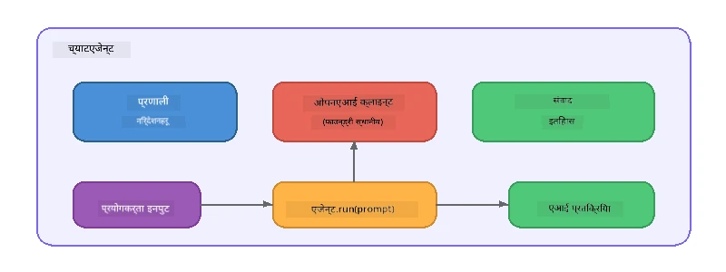

# भाग ५: एजेन्ट फ्रेमवर्कसँग AI एजेन्टहरू बनाउनुहोस्

> **लक्ष्य:** स्थायी निर्देशनहरू र परिभाषित व्यक्तित्व सहित आफ्नो पहिलो AI एजेन्ट बनाउनुस्, Foundry Local मार्फत स्थानीय मोडेल द्वारा सञ्चालित।

## AI एजेन्ट भनेको के हो?

एआई एजेन्टले भाषा मोडेललाई **सिस्टम निर्देशनहरू** सँग जोड्छ जसले यसको व्यवहार, व्यक्तित्व, र सीमाहरू निर्धारण गर्छ। एकल च्याट कम्प्लिटेशन कल भन्दा फरक, एजेन्टले प्रदान गर्छ:

- **व्यक्तित्व** - एक सुसंगत पहिचान ("तपाईं सहयोगी कोड समीक्षक हुनुहुन्छ")
- **स्मृति** - वार्तालाप इतिहास विभिन्न चरणहरूमा
- **विशेषज्ञता** - राम्रोसँग बनाइएको निर्देशनहरूले प्रेरित केन्द्रित व्यवहार



---

## माइक्रोसफ्ट एजेन्ट फ्रेमवर्क

**Microsoft Agent Framework** (AGF) एक मानक एजेन्ट अब्स्ट्र्याक्सन प्रदान गर्छ जुन विभिन्न मोडेल ब्याकएन्डसंग काम गर्छ। यस कार्यशालामा हामी यसलाई Foundry Local सँग जोड्छौं जसले सबै कुरा तपाईंको मेसिनमा चलाउँछ - कुनै क्लाउड आवश्यक छैन।

| अवधारणा | विवरण |
|---------|-------------|
| `FoundryLocalClient` | Python: सेवा सुरु, मोडेल डाउनलोड / लोड, र एजेन्टहरू सिर्जना गर्दछ |
| `client.as_agent()` | Python: Foundry Local क्लाइन्टबाट एजेन्ट सिर्जना गर्दछ |
| `AsAIAgent()` | C#: `ChatClient` मा विस्तार विधि - `AIAgent` बनाउँछ |
| `instructions` | एजेन्टको व्यवहारलाई आकार दिने सिस्टम प्रॉम्प्ट |
| `name` | मानव-पढ्न मिल्ने लेबल, बहु-एजेन्ट परिदृश्यमा उपयोगी |
| `agent.run(prompt)` / `RunAsync()` | प्रयोगकर्ताको सन्देश पठाउँछ र एजेन्टको प्रतिक्रिया फर्काउँछ |

> **नोट:** एजेन्ट फ्रेमवर्कसँग Python र .NET SDK छ। JavaScript को लागि, हामी OpenAI SDK सिधै प्रयोग गरी समान ढाँचा मिलाउने हलुका `ChatAgent` कक्षा बनाउँछौं।

---

## अभ्यासहरू

### अभ्यास १ - एजेन्ट ढाँचा बुझ्नुहोस्

कोड लेख्नुअघि, एजेन्टका मुख्य घटकहरू अध्ययन गर्नुहोस्:

1. **मोडेल क्लाइन्ट** - Foundry Local को OpenAI-समर्थित API सँग जडान हुन्छ
2. **सिस्टम निर्देशनहरू** - "व्यक्तित्व" प्रॉम्प्ट
3. **रन लूप** - प्रयोगकर्ता इनपुट पठाउने, आउटपुट प्राप्त गर्ने

> **सोच्नुहोस्:** सिस्टम निर्देशनहरू साधारण प्रयोगकर्ता सन्देशबाट कसरि फरक छ? यदि तपाईंले तिनीहरू परिवर्तन गर्नुभयो भने के हुन्छ?

---

### अभ्यास २ - सिंगल-एजेन्ट उदाहरण चलाउनुहोस्

<details>
<summary><strong>🐍 Python</strong></summary>

**पूर्वशर्तहरू:**
```bash
cd python
python -m venv venv

# विन्डोज (पावरशेल):
venv\Scripts\Activate.ps1
# म्याकओएस:
source venv/bin/activate

pip install -r requirements.txt
```

**चलाउनुहोस्:**
```bash
python foundry-local-with-agf.py
```

**कोड व्याख्या** (`python/foundry-local-with-agf.py`):

```python
import asyncio
from agent_framework_foundry_local import FoundryLocalClient

async def main():
    alias = "phi-4-mini"

    # FoundryLocalClient सेवा सुरु, मोडेल डाउनलोड, र लोडिङ् सम्हाल्छ
    client = FoundryLocalClient(model_id=alias)
    print(f"Client Model ID: {client.model_id}")

    # प्रणाली निर्देशनहरू सहित एजेण्ट तयार पार्नुहोस्
    agent = client.as_agent(
        name="Joker",
        instructions="You are good at telling jokes.",
    )

    # नन-स्ट्रीमिङ: सम्पूर्ण प्रतिक्रिया एकैचोटि प्राप्त गर्नुहोस्
    result = await agent.run("Tell me a joke about a pirate.")
    print(f"Agent: {result}")

    # स्ट्रीमिङ: जस्तै परिणामहरू उत्पादन हुन्छन् प्राप्त गर्नुहोस्
    async for chunk in agent.run("Tell me another joke.", stream=True):
        if chunk.text:
            print(chunk.text, end="", flush=True)

asyncio.run(main())
```

**मुख्य बुँदाहरू:**
- `FoundryLocalClient(model_id=alias)` सेवा सुरु, डाउनलोड, र मोडेल लोडिंग एकै पटक गर्दछ
- `client.as_agent()` सिस्टम निर्देशनहरू र नाम सहित एजेन्ट बनाउँछ
- `agent.run()` गैर-स्ट्रीमिंग र स्ट्रीमिंग मोडहरू दुवै समर्थन गर्दछ
- `pip install agent-framework-foundry-local --pre` मार्फत स्थापना गर्नुहोस्

</details>

<details>
<summary><strong>📦 JavaScript</strong></summary>

**पूर्वशर्तहरू:**
```bash
cd javascript
npm install
```

**चलाउनुहोस्:**
```bash
node foundry-local-with-agent.mjs
```

**कोड व्याख्या** (`javascript/foundry-local-with-agent.mjs`):

```javascript
import { OpenAI } from "openai";
import { FoundryLocalManager } from "foundry-local-sdk";

class ChatAgent {
  constructor({ client, modelId, instructions, name }) {
    this.client = client;
    this.modelId = modelId;
    this.instructions = instructions;
    this.name = name;
    this.history = [];
  }

  async run(userMessage) {
    const messages = [
      { role: "system", content: this.instructions },
      ...this.history,
      { role: "user", content: userMessage },
    ];
    const response = await this.client.chat.completions.create({
      model: this.modelId,
      messages,
    });
    const assistantMessage = response.choices[0].message.content;

    // बहु-पटक अन्तरक्रियाहरूका लागि वार्तालाप इतिहास राख्नुहोस्
    this.history.push({ role: "user", content: userMessage });
    this.history.push({ role: "assistant", content: assistantMessage });
    return { text: assistantMessage };
  }
}

async function main() {
  FoundryLocalManager.create({ appName: "FoundryLocalWorkshop" });
  const manager = FoundryLocalManager.instance;
  await manager.startWebService();

  const catalog = manager.catalog;
  const model = await catalog.getModel("phi-3.5-mini");
  if (!model.isCached) {
    console.log("Downloading model: phi-3.5-mini...");
    await model.download();
  }
  await model.load();

  const client = new OpenAI({
    baseURL: manager.urls[0] + "/v1",
    apiKey: "foundry-local",
  });

  const agent = new ChatAgent({
    client,
    modelId: model.id,
    instructions: "You are good at telling jokes.",
    name: "Joker",
  });

  const result = await agent.run("Tell me a joke about a pirate.");
  console.log(result.text);
}

main();
```

**मुख्य बुँदाहरू:**
- JavaScript ले Python AGF ढाँचालाई प्रतिबिम्बित गर्ने आफ्नै `ChatAgent` कक्षा बनाउँछ
- `this.history` बहु-चरण समर्थनका लागि वार्तालाप चरणहरू भण्डारण गर्दछ
- स्पष्ट `startWebService()` → क्यास जाँच → `model.download()` → `model.load()` द्वारा पूर्ण दृश्यता प्राप्त हुन्छ

</details>

<details>
<summary><strong>💜 C#</strong></summary>

**पूर्वशर्तहरू:**
```bash
cd csharp
dotnet restore
```

**चलाउनुहोस्:**
```bash
dotnet run agent
```

**कोड व्याख्या** (`csharp/SingleAgent.cs`):

```csharp
using Microsoft.AI.Foundry.Local;
using Microsoft.Extensions.Logging.Abstractions;
using Microsoft.Agents.AI;
using OpenAI;
using System.ClientModel;

// 1. Start Foundry Local and load a model
var alias = "phi-3.5-mini";
await FoundryLocalManager.CreateAsync(
    new Configuration
    {
        AppName = "FoundryLocalSamples",
        Web = new Configuration.WebService { Urls = "http://127.0.0.1:0" }
    }, NullLogger.Instance, default);
var manager = FoundryLocalManager.Instance;
await manager.StartWebServiceAsync(default);

var catalog = await manager.GetCatalogAsync(default);
var model = await catalog.GetModelAsync(alias, default);

var isCached = await model.IsCachedAsync(default);
if (!isCached)
{
    Console.WriteLine($"Downloading model: {alias}...");
    await model.DownloadAsync(null, default);
}
await model.LoadAsync(default);

var key = new ApiKeyCredential("foundry-local");
var client = new OpenAIClient(key, new OpenAIClientOptions
{
    Endpoint = new Uri(manager.Urls[0] + "/v1")
});

// 2. Create an AIAgent using the Agent Framework extension method
AIAgent joker = client
    .GetChatClient(model.Id)
    .AsAIAgent(
        instructions: "You are good at telling jokes. Keep your jokes short and family-friendly.",
        name: "Joker"
    );

// 3. Run the agent (non-streaming)
var response = await joker.RunAsync("Tell me a joke about a pirate.");
Console.WriteLine($"Joker: {response}");

// 4. Run with streaming
await foreach (var update in joker.RunStreamingAsync("Tell me another joke."))
{
    Console.Write(update);
}
```

**मुख्य बुँदाहरू:**
- `AsAIAgent()` `Microsoft.Agents.AI.OpenAI` बाट विस्तार विधि हो - कस्टम `ChatAgent` कक्षा आवश्यक छैन
- `RunAsync()` पूर्ण प्रतिक्रिया फर्काउँछ; `RunStreamingAsync()` टोकन अनुसार स्ट्रिम गर्छ
- `dotnet add package Microsoft.Agents.AI.OpenAI --version 1.0.0-rc3` मार्फत स्थापना गर्नुहोस्

</details>

---

### अभ्यास ३ - व्यक्तित्व परिवर्तन गर्नुहोस्

एजेन्टको `instructions` परिवर्तन गरी फरक व्यक्तित्व बनाउनुहोस्। प्रत्येकलाई प्रयास गरी नतिजा कसरी परिवर्तन हुन्छ हेर्नुहोस्:

| व्यक्तित्व | निर्देशनहरू |
|---------|-------------|
| कोड समीक्षक | `"तपाईं एक विशेषज्ञ कोड समीक्षक हुनुहुन्छ। पठनीयता, प्रदर्शन, र सहि तत्सम्बन्धी सकारात्मक प्रतिक्रिया दिनुहोस्।"` |
| यात्रा गाइड | `"तपाईं मैत्रीपूर्ण यात्रा गाइड हुनुहुन्छ। गन्तव्य, गतिविधिहरू, र स्थानीय खाना सम्बन्धी व्यक्तिगत सिफारिसहरू दिनुहोस्।"` |
| सोक्रेटिक शिक्षक | `"तपाईं एक सोक्रेटिक शिक्षक हुनुहुन्छ। सिधा जवाफ नदिनुहोस् - विद्यार्थीलाई सोचनीय प्रश्नमार्फत मार्गनिर्देशन गर्नुहोस्।"` |
| प्राविधिक लेखक | `"तपाईं प्राविधिक लेखक हुनुहुन्छ। अवधारणाहरू सफा र संक्षिप्त रूपमा व्याख्या गर्नुहोस्। उदाहरणहरू प्रयोग गर्नुहोस्। जार्गनबाट बच्नुहोस्।"` |

**प्रयोग गर्नुहोस्:**
1. माथिको तालिकाबाट व्यक्तित्व छान्नुहोस्
2. कोडमा `instructions` स्ट्रिङ प्रतिस्थापन गर्नुहोस्
3. प्रयोगकर्ता प्रॉम्प्ट मिलाउनुहोस् (जस्तै कोड समीक्षकलाई कुनै फङ्सन समीक्षा गर्न भन्नुहोस्)
4. पुन: उदाहरण चलाउनुहोस् र नतिजा तुलना गर्नुहोस्

> **सल्लाह:** एजेन्टको गुणस्तर निर्देशनहरूमा धेरै निर्भर हुन्छ। विशेष, राम्रोसँग संरचित निर्देशनहरूले अस्पष्ट भन्दा राम्रो नतिजा दिन्छ।

---

### अभ्यास ४ - बहु-पटक वार्तालाप थप्नुहोस्

एजेन्टसँग बहु-पटक कुराकानी लूप समर्थन थपेर पछिल्लो र प्रतिक्रियाद्वारा अन्तरक्रिया गर्न सकिने बनाउनुहोस्।

<details>
<summary><strong>🐍 Python - बहु-पटक लूप</strong></summary>

```python
import asyncio
from agent_framework_foundry_local import FoundryLocalClient

async def main():
    client = FoundryLocalClient(model_id="phi-4-mini")

    agent = client.as_agent(
        name="Assistant",
        instructions="You are a helpful assistant.",
    )

    print("Chat with the agent (type 'quit' to exit):\n")
    while True:
        user_input = input("You: ")
        if user_input.strip().lower() in ("quit", "exit"):
            break
        result = await agent.run(user_input)
        print(f"Agent: {result}\n")

asyncio.run(main())
```

</details>

<details>
<summary><strong>📦 JavaScript - बहु-पटक लूप</strong></summary>

```javascript
import { OpenAI } from "openai";
import { FoundryLocalManager } from "foundry-local-sdk";
import * as readline from "node:readline/promises";

// (व्यायाम २ बाट ChatAgent कक्षा पुन: प्रयोग गर्नुहोस्)

async function main() {
  FoundryLocalManager.create({ appName: "FoundryLocalWorkshop" });
  const manager = FoundryLocalManager.instance;
  await manager.startWebService();

  const catalog = manager.catalog;
  const model = await catalog.getModel("phi-3.5-mini");
  if (!model.isCached) {
    console.log("Downloading model: phi-3.5-mini...");
    await model.download();
  }
  await model.load();

  const client = new OpenAI({
    baseURL: manager.urls[0] + "/v1",
    apiKey: "foundry-local",
  });

  const agent = new ChatAgent({
    client,
    modelId: model.id,
    instructions: "You are a helpful assistant.",
    name: "Assistant",
  });

  const rl = readline.createInterface({
    input: process.stdin,
    output: process.stdout,
  });

  console.log("Chat with the agent (type 'quit' to exit):\n");
  while (true) {
    const userInput = await rl.question("You: ");
    if (["quit", "exit"].includes(userInput.trim().toLowerCase())) break;
    const result = await agent.run(userInput);
    console.log(`Agent: ${result.text}\n`);
  }
  rl.close();
}

main();
```

</details>

<details>
<summary><strong>💜 C# - बहु-पटक लूप</strong></summary>

```csharp
using Microsoft.AI.Foundry.Local;
using Microsoft.Extensions.Logging.Abstractions;
using Microsoft.Agents.AI;
using OpenAI;
using System.ClientModel;

var alias = "phi-3.5-mini";
var config = new Configuration
{
    AppName = "FoundryLocalSamples",
    Web = new Configuration.WebService { Urls = "http://127.0.0.1:0" }
};
await FoundryLocalManager.CreateAsync(config, NullLogger.Instance, default);
var manager = FoundryLocalManager.Instance;
await manager.StartWebServiceAsync(default);

var catalog = await manager.GetCatalogAsync(default);
var model = await catalog.GetModelAsync(alias, default);

var isCached = await model.IsCachedAsync(default);
if (!isCached)
{
    Console.WriteLine($"Downloading model: {alias}...");
    await model.DownloadAsync(null, default);
}
await model.LoadAsync(default);

var key = new ApiKeyCredential("foundry-local");
var client = new OpenAIClient(key, new OpenAIClientOptions
{
    Endpoint = new Uri(manager.Urls[0] + "/v1")
});

AIAgent agent = client
    .GetChatClient(model.Id)
    .AsAIAgent(
        instructions: "You are a helpful assistant.",
        name: "Assistant"
    );

Console.WriteLine("Chat with the agent (type 'quit' to exit):\n");
while (true)
{
    Console.Write("You: ");
    var userInput = Console.ReadLine();
    if (string.IsNullOrWhiteSpace(userInput) ||
        userInput.Equals("quit", StringComparison.OrdinalIgnoreCase) ||
        userInput.Equals("exit", StringComparison.OrdinalIgnoreCase))
        break;

    var result = await agent.RunAsync(userInput);
    Console.WriteLine($"Agent: {result}\n");
}
```

</details>

एजेन्टले अघिल्लो चरणहरू सम्झने कुरालाई ध्यान दिनुहोस् - फलोअप प्रश्न सोध्नुहोस् र सन्दर्भ कसरी राखिन्छ हेर्नुहोस्।

---

### अभ्यास ५ - संरचित आउटपुट

एजेन्टलाई सधैं विशेष ढाँचामा (जस्तै JSON) प्रतिक्रिया दिन निर्देशन गर्नुहोस् र परिणाम पार्स गर्नुहोस्:

<details>
<summary><strong>🐍 Python - JSON आउटपुट</strong></summary>

```python
import asyncio
import json
from agent_framework_foundry_local import FoundryLocalClient

async def main():
    client = FoundryLocalClient(model_id="phi-4-mini")

    agent = client.as_agent(
        name="SentimentAnalyzer",
        instructions=(
            "You are a sentiment analysis agent. "
            "For every user message, respond ONLY with valid JSON in this format: "
            '{"sentiment": "positive|negative|neutral", "confidence": 0.0-1.0, "summary": "brief reason"}'
        ),
    )

    result = await agent.run("I absolutely loved the new restaurant downtown!")
    print("Raw:", result)

    try:
        parsed = json.loads(str(result))
        print(f"Sentiment: {parsed['sentiment']} (confidence: {parsed['confidence']})")
    except json.JSONDecodeError:
        print("Agent did not return valid JSON - try refining the instructions.")

asyncio.run(main())
```

</details>

<details>
<summary><strong>💜 C# - JSON आउटपुट</strong></summary>

```csharp
using System.Text.Json;

AIAgent analyzer = chatClient.AsAIAgent(
    name: "SentimentAnalyzer",
    instructions:
        "You are a sentiment analysis agent. " +
        "For every user message, respond ONLY with valid JSON in this format: " +
        "{\"sentiment\": \"positive|negative|neutral\", \"confidence\": 0.0-1.0, \"summary\": \"brief reason\"}"
);

var response = await analyzer.RunAsync("I absolutely loved the new restaurant downtown!");
Console.WriteLine($"Raw: {response}");

try
{
    var parsed = JsonSerializer.Deserialize<JsonElement>(response.ToString());
    Console.WriteLine($"Sentiment: {parsed.GetProperty("sentiment")} " +
                      $"(confidence: {parsed.GetProperty("confidence")})");
}
catch (JsonException)
{
    Console.WriteLine("Agent did not return valid JSON - try refining the instructions.");
}
```

</details>

> **नोट:** सानो स्थानीय मोडेलहरूले सधैं पूर्ण रूपमा वैध JSON नबनाउन सक्छन्। उदाहरण समावेश गरेर र अपेक्षित ढाँचामा धेरै स्पष्ट भएर विश्वसनीयता सुधार्न सकिन्छ।

---

## मुख्य सिकाइहरू

| अवधारणा | तपाईंले के सिक्नुभयो |
|---------|-----------------|
| एजेन्ट र कच्चा LLM कल | एक एजेन्ट मोडेललाई निर्देशन र स्मृतिसँग लपेट्छ |
| सिस्टम निर्देशनहरू | एजेन्टको व्यवहार नियन्त्रण गर्ने सबैभन्दा महत्वपूर्ण तत्व |
| बहु-पटक कुराकानी | एजेन्टहरूले धेरै प्रयोगकर्ता अन्तरक्रियामा सन्दर्भ बोक्न सक्छन् |
| संरचित आउटपुट | निर्देशनहरूले आउटपुट ढाँचा (JSON, मार्कडाउन आदि) लागू गर्न सक्छन् |
| स्थानीय कार्यान्वयन | सबै कुरा Foundry Local मार्फत उपकरणमै चल्छ - कुनै क्लाउड आवश्यक छैन |

---

## अर्को कदम

**[भाग ६: बहु-एजेन्ट कार्यप्रवाहहरू](part6-multi-agent-workflows.md)** मा, तपाईं विभिन्न एजेन्टहरूलाई समन्वित पाइपलाइनमा संयोजन गर्नुहुनेछ जहाँ प्रत्येक एजेन्टसँग विशेष भूमिका हुन्छ।

---

<!-- CO-OP TRANSLATOR DISCLAIMER START -->
**अस्वीकरण**:  
यो दस्तावेज [Co-op Translator](https://github.com/Azure/co-op-translator) नामक एआई अनुवाद सेवा प्रयोग गरी अनुवाद गरिएको हो। हामी शुद्धताका लागि प्रयासरत छौं, तर कृपया बुझ्नुहोस् कि स्वतः अनुवादमा त्रुटिहरू वा अशुद्धता हुनसक्छ। यसको स्वदेशी भाषामा रहेको मूल दस्तावेजलाई आधिकारिक स्रोत मानिनु पर्छ। महत्वपूर्ण जानकारीको लागि, व्यावसायिक मानव अनुवाद सिफारिस गरिन्छ। यस अनुवादको प्रयोगबाट हुने कुनै पनि गलतफहमी वा गलत व्याख्याको लागि हामी जिम्मेवार छैनौं।
<!-- CO-OP TRANSLATOR DISCLAIMER END -->