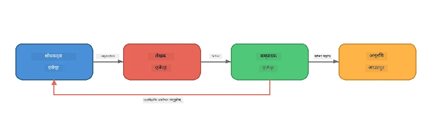
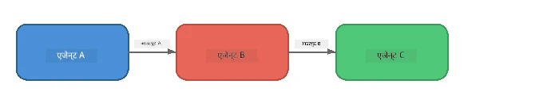
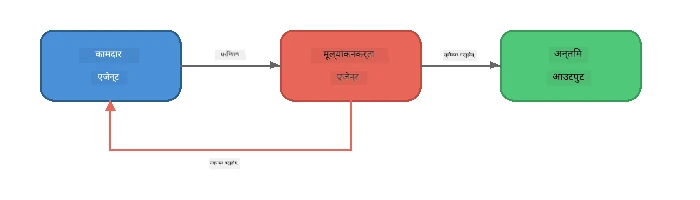
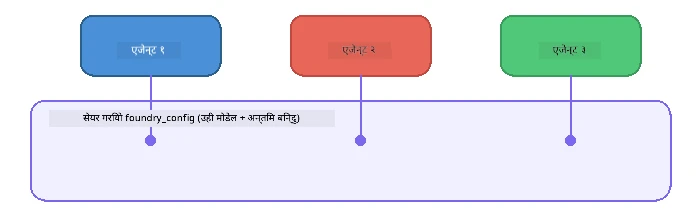

# भाग 6: बहु-एजेन्ट कार्यप्रवाहहरू

> **उद्देश्य:** धेरै बिशेषज्ञ एजेन्टहरूलाई समन्वित पाइपलाइनहरूमा संयोजन गर्ने जसले जटिल कार्यहरू साझेदारी गर्ने एजेन्टहरू बीच विभाजन गर्छ - सबै फाउन्ड्री लोकलसँग स्थानीय रूपमा चल्छ।

## किन बहु-एजेन्ट?

एक एजेन्टले धेरै कार्यहरू सम्हाल्न सक्छ, तर जटिल कार्यप्रवाहहरूले **विशेषीकृतता** बाट लाभ लिन्छ। एक एजेन्टले एकै पटक अनुसन्धान, लेखन, र सम्पादन प्रयास गर्नुभन्दा, तपाईंले कामलाई लक्षित भूमिकाहरूमा विभाजन गर्नुहुन्छ:



| ढाँचा | विवरण |
|---------|-------------|
| **क्रमिक** | एजेन्ट A को उत्पादन एजेन्ट B → एजेन्ट Cमा जान्छ |
| **प्रतिक्रिया लूप** | एक मूल्याङ्कन गर्ने एजेन्टले काम पुनः समीक्षाका लागि फिर्ता पठाउन सक्छ |
| **साझा सन्दर्भ** | सबै एजेन्टहरूले एउटै मोडेल/एन्डपोइन्ट प्रयोग गर्छन्, तर फरक निर्देशनहरू |
| **टाइप गरिएको उत्पादन** | एजेन्टहरूले संरचित परिणामहरू (JSON) उत्पादन गर्छन् भरपर्दो हस्तान्तरणका लागि |

---

## अभ्यासहरू

### अभ्यास 1 - बहु-एजेन्ट पाइपलाइन चलाउनुहोस्

कार्यशालामा Researcher → Writer → Editor सम्पूर्ण कार्यप्रवाह समावेश छ।

<details>
<summary><strong>🐍 Python</strong></summary>

**सेटअप:**
```bash
cd python
python -m venv venv

# विन्डोज (पावरशेल):
venv\Scripts\Activate.ps1
# म्याकओएस:
source venv/bin/activate

pip install -r requirements.txt
```

**चलाउनुहोस्:**
```bash
python foundry-local-multi-agent.py
```

**के हुन्छ:**
1. **शोधकर्ता** विषय प्राप्त गरी बुलेट-प्वाइन्ट तथ्यहरू फर्काउँछ
2. **लेखक** अनुसन्धान लिएर ब्लग पोस्ट (3-4 अनुच्छेदहरू) मस्यौदा बनाउँछ
3. **सम्पादक** गुणस्तरको लागि लेख समीक्षा गर्छ र ACCEPT वा REVISE फर्काउँछ

</details>

<details>
<summary><strong>📦 JavaScript</strong></summary>

**सेटअप:**
```bash
cd javascript
npm install
```

**चलाउनुहोस्:**
```bash
node foundry-local-multi-agent.mjs
```

**उही तीन-चरण पाइपलाइन** - Researcher → Writer → Editor।

</details>

<details>
<summary><strong>💜 C#</strong></summary>

**सेटअप:**
```bash
cd csharp
dotnet restore
```

**चलाउनुहोस्:**
```bash
dotnet run multi
```

**उही तीन-चरण पाइपलाइन** - Researcher → Writer → Editor।

</details>

---

### अभ्यास 2 - पाइपलाइनको संरचना

एजेन्टहरू कसरी परिभाषित र जडान गरिएका छन् अध्ययन गर्नुहोस्:

**1. साझा मोडेल क्लाइन्ट**

सबै एजेन्टहरूले एउटै Foundry Local मोडेल साझा गर्छन्:

```python
# Python - FoundryLocalClient ले सबै कुरा सम्हाल्छ
from agent_framework_foundry_local import FoundryLocalClient

client = FoundryLocalClient(model_id="phi-3.5-mini")
```

```javascript
// JavaScript - OpenAI SDK लाई Foundry Local तर्फ संकेत गरिएको
const client = new OpenAI({
  baseURL: manager.urls[0] + "/v1",
  apiKey: "foundry-local",
});
```

```csharp
// C# - OpenAIClient pointed at Foundry Local
var key = new ApiKeyCredential("foundry-local");
var client = new OpenAIClient(key, new OpenAIClientOptions
{
    Endpoint = new Uri(manager.Urls[0] + "/v1")
});
var chatClient = client.GetChatClient(model.Id);
```

**2. बिशेषीकृत निर्देशनहरू**

प्रत्येक एजेन्टसँग फरक व्यक्तित्व हुन्छ:

| एजेन्ट | निर्देशनहरू (सारांश) |
|-------|----------------------|
| शोधकर्ता | "मुख्य तथ्यहरू, तथ्याङ्कहरू, र पृष्ठभूमि प्रदान गर्नुहोस्। बुलेट पोइन्टहरूमा व्यवस्थित गर्नुहोस्।" |
| लेखक | "अनुसन्धान नोटहरूबाट आकर्षक ब्लग पोस्ट लेख्नुहोस् (3-4 अनुच्छेदहरू)। तथ्यहरू आविष्कार नगर्नुहोस्।" |
| सम्पादक | "स्पष्टता, व्याकरण, र तथ्यगत स्थिरताको लागि समीक्षा गर्नुहोस्। निर्णय: ACCEPT वा REVISE।" |

**3. एजेन्टहरू बीच डेटा प्रवाह**

```python
# चरण १ - अनुसन्धानकर्ताबाट निस्कने नतिजा लेखकको इनपुट हुन्छ
research_result = await researcher.run(f"Research: {topic}")

# चरण २ - लेखकबाट निस्कने नतिजा सम्पादकको इनपुट हुन्छ
writer_result = await writer.run(f"Write using:\n{research_result}")

# चरण ३ - सम्पादकले अनुसन्धान र लेख दुवै समीक्षा गर्दछ
editor_result = await editor.run(
    f"Research:\n{research_result}\n\nArticle:\n{writer_result}"
)
```

```csharp
// C# - same pattern, async calls with AIAgent
var researchNotes = await researcher.RunAsync(
    $"Research the following topic and provide key facts:\n{topic}");

var draft = await writer.RunAsync(
    $"Write a blog post based on these research notes:\n\n{researchNotes}");

var verdict = await editor.RunAsync(
    $"Review this article for quality and accuracy.\n\n" +
    $"Research notes:\n{researchNotes}\n\n" +
    $"Article:\n{draft}");
```

> **मुख्य अन्तर्दृष्टि:** प्रत्येक एजेन्टले अघिल्लो एजेन्टहरूबाट संचयी सन्दर्भ प्राप्त गर्छ। सम्पादकले मूल अनुसन्धान र मस्यौदा दुवै देख्छ - जसले तथ्यगत स्थिरता जाँच गर्न अनुमति दिन्छ।

---

### अभ्यास 3 - चौथो एजेन्ट थप्नुहोस्

पाइपलाइनमा नयाँ एजेन्ट थपेर विस्तार गर्नुहोस्। एउटा छान्नुहोस्:

| एजेन्ट | उद्देश्य | निर्देशनहरू |
|-------|---------|-------------|
| **फ्याक्ट-चेकर** | लेखमा भएका दावीहरूको सत्यापन गर्नुहोस् | `"तपाईं तथ्यगत दावीहरूको जाँच गर्नुहुन्छ। प्रत्येक दावीका लागि, के यसलाई अनुसन्धान नोटहरूले समर्थित गर्छ भन्ने बताउनुहोस्। सत्यापित/असत्यापित वस्तुहरू सहित JSON फर्काउनुहोस्।"` |
| **हेडलाइन लेखक** | आकर्षक शीर्षकहरू सिर्जना गर्नुहोस् | `"लेखका लागि ५ शीर्षक विकल्पहरू सिर्जना गर्नुहोस्। शैली फरक गर्नुहोस्: जानकारीमूलक, क्लिकबेट, प्रश्न, सूची, भावुक।"` |
| **सामाजिक मिडिया** | प्रचारात्मक पोस्टहरू बनाउनुहोस् | `"यस लेख प्रचार गर्न ३ सामाजिक मिडिया पोस्टहरू सिर्जना गर्नुहोस्: एउटा ट्विटरको लागि (२८० अक्षर), एउटा लिंक्डइन (पेशेवर शैली), एउटा इन्स्टाग्राम (हास्यपूर्ण इमोजी सुझावहरूसँग)।"` |

<details>
<summary><strong>🐍 Python - हेडलाइन लेखक थप्दै</strong></summary>

```python
headline_agent = client.as_agent(
    name="HeadlineWriter",
    instructions=(
        "You are a headline specialist. Given an article, generate exactly "
        "5 headline options. Vary the style: informative, question-based, "
        "listicle, emotional, and provocative. Return them as a numbered list."
    ),
)

# सम्पादकले स्वीकार गरेपछि, शीर्षकहरू बनाउनुहोस्
headline_result = await headline_agent.run(
    f"Generate headlines for this article:\n\n{writer_result}"
)
print(f"\n--- Headlines ---\n{headline_result}")
```

</details>

<details>
<summary><strong>📦 JavaScript - हेडलाइन लेखक थप्दै</strong></summary>

```javascript
const headlineAgent = new ChatAgent({
  client,
  modelId: modelInfo.id,
  instructions:
    "You are a headline specialist. Given an article, generate exactly " +
    "5 headline options. Vary the style: informative, question-based, " +
    "listicle, emotional, and provocative. Return them as a numbered list.",
  name: "HeadlineWriter",
});

const headlineResult = await headlineAgent.run(
  `Generate headlines for this article:\n\n${writerResult.text}`
);
console.log(`\n--- Headlines ---\n${headlineResult.text}`);
```

</details>

<details>
<summary><strong>💜 C# - हेडलाइन लेखक थप्दै</strong></summary>

```csharp
AIAgent headlineAgent = chatClient.AsAIAgent(
    name: "HeadlineWriter",
    instructions:
        "You are a headline specialist. Given an article, generate exactly " +
        "5 headline options. Vary the style: informative, question-based, " +
        "listicle, emotional, and provocative. Return them as a numbered list."
);

// After the editor accepts, generate headlines
var headlines = await headlineAgent.RunAsync(
    $"Generate headlines for this article:\n\n{draft}");
Console.WriteLine($"\n--- Headlines ---\n{headlines}");
```

</details>

---

### अभ्यास 4 - आफ्नो कार्यप्रवाह डिजाइन गर्नुहोस्

अर्को डोमेनका लागि बहु-एजेन्ट पाइपलाइन डिजाइन गर्नुहोस्। केही विचारहरू यहाँ छन्:

| डोमेन | एजेन्टहरू | प्रवाह |
|--------|--------|------|
| **कोड समीक्षा** | विश्लेषक → समीक्षक → सारांशकर्ता | कोड संरचना विश्लेषण गर्नुहोस् → समस्याहरूको समीक्षा गर्नुहोस् → सारांश रिपोर्ट तयार गर्नुहोस् |
| **ग्राहक सहायता** | वर्गीकर्ता → प्रत्युत्तर दिने → गुणस्तर जाँच | टिकट वर्गीकरण गर्नुहोस् → जवाफ मस्यौदा गर्नुहोस् → गुणस्तर जाँच गर्नुहोस् |
| **शिक्षा** | प्रश्नोत्तरकर्ता → विद्यार्थी अनुकरणकर्ता → मूल्यांकनकर्ता | प्रश्नोत्तर सिर्जना गर्नुहोस् → उत्तरहरू अनुकरण गर्नुहोस् → मूल्यांकन गरेर व्याख्या गर्नुहोस् |
| **डेटा विश्लेषण** | व्याख्याकार → विश्लेषक → रिपोर्टर | डेटा अनुरोध व्याख्या गर्नुहोस् → ढाँचाहरू विश्लेषण गर्नुहोस् → रिपोर्ट लेख्नुहोस् |

**चरणहरू:**
1. 3+ एजेन्टहरू फरक `निर्देशन` सहित परिभाषित गर्नुहोस्
2. डेटा प्रवाह निर्णय गर्नुहोस् - प्रत्येक एजेन्टले के प्राप्त र उत्पादन गर्छ?
3. अभ्यास 1-3 का ढाँचाहरू प्रयोग गरी पाइपलाइन कार्यान्वयन गर्नुहोस्
4. यदि कुनै एजेन्टले अर्कोको काम मूल्याङ्कन गर्नु पर्छ भने प्रतिक्रिया लूप थप्नुहोस्

---

## समन्वयन ढाँचाहरू

यहाँ कुनै पनि बहु-एजेन्ट प्रणालीमा लागू हुने समन्वयनका ढाँचाहरू छन् (गहिरो रूपमा [भाग 7](part7-zava-creative-writer.md) मा अन्वेषण गरिएको):

### क्रमिक पाइपलाइन



प्रत्येक एजेन्टले अघिल्लोको उत्पादन प्रक्रिया गर्छ। सरल र पूर्वानुमेय।

### प्रतिक्रिया लूप



मूल्याङ्कन गर्ने एजेन्टले पहिलेका चरणहरू पुन:प्रक्षेपण गर्न ट्रिगर गर्न सक्छ। Zava लेखकले यसलाई प्रयोग गर्छ: सम्पादकले प्रतिक्रिया अनुसन्धानकर्ता र लेखकलाई फिर्ता पठाउन सक्छ।

### साझा सन्दर्भ



सबै एजेन्टहरूले एउटै `foundry_config` साझा गर्छन् ताकि उनीहरू एउटै मोडेल र एन्डपोइन्ट प्रयोग गर्न सकून्।

---

## मुख्य अंशहरू

| अवधारणा | तपाईंले के सिक्नुभयो |
|---------|-----------------|
| एजेन्ट विशेषीकरण | प्रत्येक एजेन्टले लक्षित निर्देशनहरू सहित एउटै काम राम्रोसँग गर्छ |
| डेटा हस्तान्तरण | एक एजेन्टको उत्पादन अर्कोको इनपुट हुन्छ |
| प्रतिक्रिया लूपहरू | एक मूल्याङ्कनकर्ताले उच्च गुणस्तरसंग पुनः प्रयास ट्रिगर गर्न सक्छ |
| संरचित उत्पादन | JSON-रूपमा प्रतिक्रिया एजेन्ट-देखि-एजेन्ट भरपर्दो सञ्चार सक्षम गर्छ |
| समन्वयन | एक संयोजकले पाइपलाइन अनुक्रम र त्रुटि व्यवस्थापन गर्छ |
| उत्पादन ढाँचाहरू | [भाग 7: Zava Creative Writer](part7-zava-creative-writer.md) मा लागू गरिएको |

---

## आगामी कदमहरू

[भाग 7: Zava Creative Writer - Capstone Application](part7-zava-creative-writer.md) मा जारी राख्नुहोस् जसले 4 बिशेषीकृत एजेन्टहरू, स्ट्रिमिङ उत्पादन, उत्पादन खोज र प्रतिक्रिया लूपहरू सहित उत्पादन-शैली बहु-एजेन्ट अनुप्रयोग अन्वेषण गर्दछ - Python, JavaScript, र C# मा उपलब्ध।

---

<!-- CO-OP TRANSLATOR DISCLAIMER START -->
**अस्वीकरण**:  
यस दस्तावेजलाई AI अनुवाद सेवा [Co-op Translator](https://github.com/Azure/co-op-translator) प्रयोग गरेर अनुवाद गरिएको हो। हामी शुद्धता को प्रयास गर्छौं, तर कृपया बुझ्नुहोस् कि स्वचालित अनुवादमा त्रुटिहरू वा अशुद्धताहरू हुन सक्छन्। मूल दस्तावेजलाई यसको मूल भाषामा अधिकारिक स्रोत मान्नुपर्छ। महत्वपूर्ण जानकारीका लागि, व्यावसायिक मानव अनुवाद सिफारिस गरिएको छ। यस अनुवादको प्रयोगबाट हुने कुनै पनि गलतफहमी वा गलत व्याख्याका लागि हामी जिम्मेवार छैनौं।
<!-- CO-OP TRANSLATOR DISCLAIMER END -->