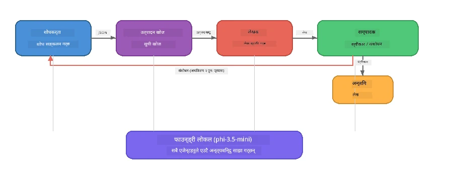

# भाग ७: Zava क्रिएटिभ लेखक - क्यापस्टोन एप्लिकेशन

> **लक्ष्य:** चार विशेषज्ञ एजेन्टहरूले सहयोग गरेर Zava Retail DIY का लागि म्यागजिन-गुणस्तरका लेखहरू उत्पादन गर्ने उत्पादन-शैलीको बहु-एजेन्ट एप्लिकेशन अन्वेषण गर्नुहोस् - जुन Foundry Local को साथ तपाईंको उपकरणमा पूर्ण रूपमा चल्छ।

यो कार्यशालाको **क्यापस्टोन ल्याब** हो। यसले तपाईंले सिकेको सबै कुरा एकत्रित गर्दछ - SDK एकीकरण (भाग ३), स्थानीय डेटा बाट पुन: प्राप्ति (भाग ४), एजेन्ट व्यक्तित्वहरू (भाग ५), र बहु-एजेन्ट समन्वय (भाग ६) - एक पूर्ण एप्लिकेशनमा उपलब्ध छ **Python**, **JavaScript**, र **C#** मा।

---

## तपाईंले के अन्वेषण गर्नुहुनेछ

| अवधारणा | Zava लेखकमा कहाँ |
|---------|----------------------------|
| ४-चरण मोडेल लोडिङ | साझा कन्फिग मोड्युलले Foundry Local सुरु गर्छ |
| RAG-शैली पुन: प्राप्ति | उत्पादन एजेन्टले स्थानीय क्याटलग खोज्छ |
| एजेन्ट विशेषज्ञता | ४ एजेन्टहरूको फरक प्रणाली संकेतहरू |
| स्ट्रिमिंग आउटपुट | लेखकले वास्तविक समयमा टोकनहरू प्रदान गर्छ |
| संरचित हस्तान्तरण | अनुसन्धानकर्ता → JSON, सम्पादक → JSON निर्णय |
| प्रतिक्रिया लूपहरू | सम्पादकले पुन: कार्यान्वयन सुरु गर्न सक्छ (अधिकतम २ पटक प्रयास) |

---

## वास्तुकला

Zava क्रिएटिभ लेखकले **मूल्यांकनकर्ताद्वारा चलाइएको प्रतिक्रिया सहित अनुक्रमिक पाइपलाइन** प्रयोग गर्छ। तीनवटै भाषा कार्यान्वयनले उही वास्तुकला अनुसरण गर्छन्:



### चार एजेन्टहरू

| एजेन्ट | इनपुट | आउटपुट | उद्देश्य |
|-------|-------|--------|---------|
| **अनुसन्धानकर्ता** | विषय + वैकल्पिक प्रतिक्रिया | `{"web": [{url, name, description}, ...]}` | LLM मार्फत पृष्ठभूमि अनुसन्धान सङ्कलन गर्छ |
| **उत्पादन खोज** | उत्पादन सन्दर्भ स्ट्रिंग | मिल्ने उत्पादनहरूको सूची | LLM-जनित क्वेरीहरू + स्थानीय क्याटलगमा कुञ्जीशब्द खोज |
| **लेखक** | अनुसन्धान + उत्पादनहरू + असाइनमेन्ट + प्रतिक्रिया | स्ट्रिम गरिएको लेख ( `---` मा विभाजित) | वास्तविक समयमा म्यागजिन-गुणस्तरको लेख मस्यौदा तयार पार्छ |
| **सम्पादक** | लेख + लेखकको स्व-प्रतिक्रिया | `{"decision": "accept/revise", "editorFeedback": "...", "researchFeedback": "..."}` | गुणस्तर समीक्षा गर्छ, आवश्यक भए पुन: प्रयास सुरू गर्दछ |

### पाइपलाइन प्रवाह

1. **अनुसन्धानकर्ता** विषय प्राप्त गर्छ र संरचित अनुसन्धान नोटहरू उत्पादन गर्छ (JSON)
2. **उत्पादन खोज** LLM-जनित खोज शब्दहरू प्रयोग गरी स्थानीय उत्पादन क्याटलग सोध्छ
3. **लेखक** अनुसन्धान + उत्पादनहरू + असाइनमेन्टलाई संयोजन गरी स्ट्रिमिंग लेख तयार पार्छ, स्व-प्रतिक्रिया `---` विभाजकपछि जोड्छ
4. **सम्पादक** लेख समीक्षा गर्छ र JSON निर्णय फर्काउँछ:
   - `"accept"` → पाइपलाइन पूरा हुन्छ
   - `"revise"` → प्रतिक्रिया अनुसन्धानकर्ता र लेखकलाई पठाइन्छ (अधिकतम २ प्रयास)

---

## पूर्व आवश्यकताहरू

- पूरा गर्नुहोस् [भाग ६: बहु-एजेन्ट कार्यप्रवाहहरू](part6-multi-agent-workflows.md)
- Foundry Local CLI स्थापना गरिएको र `phi-3.5-mini` मोडेल डाउनलोड गरिएको

---

## अभ्यासहरू

### अभ्यास १ - Zava क्रिएटिभ लेखक चलाउनुहोस्

आफ्नो भाषा छनौट गर्नुहोस् र एप्लिकेशन चलाउनुहोस्:

<details>
<summary><strong>🐍 Python - FastAPI वेब सेवा</strong></summary>

Python संस्करणले REST API सहितको **वेब सेवा** रूपमा चल्छ, जसले उत्पादन ब्याकएण्ड कसरी बनाउन सकिन्छ देखाउँछ।

**सेटअप:**
```bash
cd zava-creative-writer-local/src/api
python -m venv venv

# विन्डोज (पावरशेल):
venv\Scripts\Activate.ps1
# म्याकओएस:
source venv/bin/activate

pip install -r requirements.txt
```

**चलाउनुहोस्:**
```bash
uvicorn main:app --reload
```

**परीक्षण गर्नुहोस्:**
```bash
curl -X POST http://localhost:8000/api/article \
  -H "Content-Type: application/json" \
  -d '{
    "research": "DIY home improvement trends",
    "products": "power tools and paints",
    "assignment": "Write an article about weekend renovation projects for DIY enthusiasts"
  }'
```

प्रतिक्रिया स्ट्रिम भएर प्रत्येक एजेन्टको प्रगति देखाउने लाइन छुट्टिएको JSON सन्देशहरू फर्काउँछ।

</details>

<details>
<summary><strong>📦 JavaScript - Node.js CLI</strong></summary>

JavaScript संस्करणले **CLI एप्लिकेशन** रूपमा चल्छ, एजेन्ट प्रगतिलाई र लेखलाई सिधै कन्सोलमा प्रिन्ट गर्छ।

**सेटअप:**
```bash
cd zava-creative-writer-local/src/javascript
npm install
```

**चलाउनुहोस्:**
```bash
node main.mjs
```

तपाईंले देख्न सक्नुहुन्छ:
1. Foundry Local मोडेल लोडिङ (डाउनलोड हुँदैछ भने प्रगति पट्टी सहित)
2. प्रत्येक एजेन्ट क्रमशः कार्यान्वयन हुन्छ र स्थिति सन्देश देखिन्छ
3. लेख वास्तविक समयमा कन्सोलमा स्ट्रिम हुन्छ
4. सम्पादकको स्वीकार/समीक्षा निर्णय

</details>

<details>
<summary><strong>💜 C# - .NET कन्सोल एप</strong></summary>

C# संस्करणले **.NET कन्सोल एप्लिकेशन** रूपमा उही पाइपलाइन र स्ट्रिमिंग आउटपुटसहित चल्छ।

**सेटअप:**
```bash
cd zava-creative-writer-local/src/csharp
dotnet restore
```

**चलाउनुहोस्:**
```bash
dotnet run
```

JavaScript संस्करणसँग उस्तै आउटपुट ढाँचा - एजेन्ट स्थिति सन्देशहरू, स्ट्रिम गरिएको लेख, र सम्पादक निर्णय।

</details>

---

### अभ्यास २ - कोड संरचना अध्ययन गर्नुहोस्

हरेक भाषा कार्यान्वयनमा उही तार्किक कम्पोनेन्टहरू हुन्छन्। संरचनाहरू तुलना गर्नुहोस्:

**Python** (`src/api/`):
| फाइल | उद्देश्य |
|------|---------|
| `foundry_config.py` | साझा Foundry Local व्यवस्थापक, मोडेल, र क्लाइन्ट (४-चरण सुरु) |
| `orchestrator.py` | पाइपलाइन समन्वय र प्रतिक्रिया लूप |
| `main.py` | FastAPI एन्डपोइन्टहरू (`POST /api/article`) |
| `agents/researcher/researcher.py` | JSON आउटपुटसहित LLM-आधारित अनुसन्धान |
| `agents/product/product.py` | LLM-जनित क्वेरीहरू + कुञ्जीशब्द खोज |
| `agents/writer/writer.py` | स्ट्रिमिङ लेख उत्पादन |
| `agents/editor/editor.py` | JSON आधारित स्वीकार/समीक्षा निर्णय |

**JavaScript** (`src/javascript/`):
| फाइल | उद्देश्य |
|------|---------|
| `foundryConfig.mjs` | साझा Foundry Local कन्फिग (प्रगति पट्टीसहित ४-चरण सुरु) |
| `main.mjs` | समन्वयक + CLI प्रवेश बिन्दु |
| `researcher.mjs` | LLM-आधारित अनुसन्धान एजेन्ट |
| `product.mjs` | LLM क्वेरी उत्पादन + कुञ्जीशब्द खोज |
| `writer.mjs` | स्ट्रिमिङ लेख उत्पादन (async generator) |
| `editor.mjs` | JSON स्वीकार/समीक्षा निर्णय |
| `products.mjs` | उत्पादन क्याटलग डेटा |

**C#** (`src/csharp/`):
| फाइल | उद्देश्य |
|------|---------|
| `Program.cs` | पूर्ण पाइपलाइन: मोडेल लोडिङ, एजेन्टहरू, समन्वयक, प्रतिक्रिया लूप |
| `ZavaCreativeWriter.csproj` | Foundry Local + OpenAI प्याकेजहरूसहित .NET ९ प्रोजेक्ट |

> **डिजाइन नोट:** Python ले प्रत्येक एजेन्टलाई आफ्नै फाइल/डिरेक्टरीमा राख्छ (ठूलो टोलीहरूका लागि राम्रो)। JavaScript ले प्रत्येक एजेन्टको लागि एक मोड्युल प्रयोग गर्छ (मध्यम परियोजनाहरूका लागि राम्रो)। C# ले सबैलाई एउटै फाइलमा स्थानीय कार्यहरूसहित राख्छ (आत्मनिर्भर उदाहरणहरूका लागि राम्रो)। उत्पादनमा, आफ्नो टोलीको प्रचलन अनुसार ढाँचा रोज्नुहोस्।

---

### अभ्यास ३ - साझा कन्फिग ट्रेस गर्नुहोस्

पाइपलाइनमा प्रत्येक एजेन्टले एकै Foundry Local मोडेल क्लाइन्ट साझा गर्छ। हरेक भाषामा कसरी सेटअप भएको छ अध्ययन गर्नुहोस्:

<details>
<summary><strong>🐍 Python - foundry_config.py</strong></summary>

```python
from foundry_local import FoundryLocalManager

MODEL_ALIAS = "phi-3.5-mini"

# चरण १: व्यवस्थापक सिर्जना गर्नुहोस् र फाउन्ड्री लोकल सेवा सुरु गर्नुहोस्
manager = FoundryLocalManager()
manager.start_service()

# चरण २: मोडेल पहिले नै डाउनलोड गरिएको छ कि छैन जाँच गर्नुहोस्
cached = manager.list_cached_models()
catalog_info = manager.get_model_info(MODEL_ALIAS)
is_cached = any(m.id == catalog_info.id for m in cached) if catalog_info else False

if not is_cached:
    manager.download_model(MODEL_ALIAS)

# चरण ३: मोडेललाई मेमोरीमा लोड गर्नुहोस्
manager.load_model(MODEL_ALIAS)
model_id = manager.get_model_info(MODEL_ALIAS).id

# साझा गरिएको OpenAI क्लाइन्ट
client = openai.OpenAI(base_url=manager.endpoint, api_key=manager.api_key)
```

सबै एजेन्टहरूले `from foundry_config import client, model_id` आयात गर्छन्।

</details>

<details>
<summary><strong>📦 JavaScript - foundryConfig.mjs</strong></summary>

```javascript
import { FoundryLocalManager } from "foundry-local-sdk";
import { OpenAI } from "openai";

FoundryLocalManager.create({ appName: "ZavaCreativeWriter" });
const manager = FoundryLocalManager.instance;
await manager.startWebService();

// क्यास जाँच गर्नुहोस् → डाउनलोड गर्नुहोस् → लोड गर्नुहोस् (नयाँ SDK ढाँचा)
const catalog = manager.catalog;
const model = await catalog.getModel(MODEL_ALIAS);
if (!model.isCached) {
  console.log(`Downloading model: ${MODEL_ALIAS}...`);
  await model.download();
}
await model.load();

const client = new OpenAI({ baseURL: manager.urls[0] + "/v1", apiKey: "foundry-local" });
const modelId = model.id;
export { client, modelId };
```

सबै एजेन्टहरूले `{ client, modelId } from "./foundryConfig.mjs"` आयात गर्छन्।

</details>

<details>
<summary><strong>💜 C# - Program.cs को शीर्षमा</strong></summary>

```csharp
await FoundryLocalManager.CreateAsync(
    new Configuration
    {
        AppName = "ZavaCreativeWriter",
        Web = new Configuration.WebService { Urls = "http://127.0.0.1:0" }
    }, NullLogger.Instance, default);
var manager = FoundryLocalManager.Instance;
await manager.StartWebServiceAsync(default);

var catalog = await manager.GetCatalogAsync(default);
var catalogModel = await catalog.GetModelAsync(alias, default);
var isCached = await catalogModel.IsCachedAsync(default);
if (!isCached)
    await catalogModel.DownloadAsync(null, default);

await catalogModel.LoadAsync(default);
var key = new ApiKeyCredential("foundry-local");
var chatClient = new OpenAIClient(key, new OpenAIClientOptions
{
    Endpoint = new Uri(manager.Urls[0] + "/v1")
}).GetChatClient(catalogModel.Id);
```

`chatClient` त्यसपछि सबै एजेन्ट कार्यहरूमा उही फाइलमा पास गरिन्छ।

</details>

> **मुख्य ढाँचा:** मोडेल लोडिङ ढाँचाले (सेवा सुरु → क्यास जाँच → डाउनलोड → लोड) प्रयोगकर्तालाई प्रगति स्पष्ट देखाउँछ र मोडेल एक पटक मात्र डाउनलोड हुन्छ। यो Foundry Local को लागि उत्तम अभ्यास हो।

---

### अभ्यास ४ - प्रतिक्रिया लूप बुझ्नुहोस्

प्रतिक्रिया लूपले यो पाइपलाइनलाई "बुद्धिमान" बनाउँछ - सम्पादकले पुन: सुधारका लागि काम फिर्ता पठाउन सक्छ। तर्क ट्रेस गर्नुहोस्:

```
Orchestrator:
  1. researcher.research(topic, "No Feedback")    ← first pass
  2. product.findProducts(productContext)
  3. writer.write(research, products, assignment)  ← streams article
  4. Split article at "---" → article + writerFeedback
  5. editor.edit(article, writerFeedback)

  WHILE editor says "revise" AND retryCount < 2:
    6. researcher.research(topic, editor.researchFeedback)  ← refined
    7. writer.write(research, products, editor.editorFeedback)
    8. editor.edit(newArticle, newWriterFeedback)
    9. retryCount++
```

**विचार गर्नका लागि प्रश्नहरू:**
- प्रयास सिमित २ किन राखिएको? बढाए के हुन्छ?
- अनुसन्धानकर्ताले किन `researchFeedback` पाउँछ तर लेखकले `editorFeedback`?
- सम्पादकले सधैं "revise" भने के हुन्छ?

---

### अभ्यास ५ - एजेन्ट परिवर्तन गर्नुहोस्

एउटा एजेन्टको व्यवहार परिवर्तन गरी पाइपलाइनमा कसरी असर पर्छ हेरौं:

| परिवर्तन | के परिवर्तन गर्ने |
|-------------|----------------|
| **कडा सम्पादक** | सम्पादकको प्रणाली संकेतलाई सधैं कम्तिमा एक संशोधन माग्ने बनाउने |
| **लामो लेखहरू** | लेखकको संकेतलाई "८००-१००० शब्द" बाट "१५००-२००० शब्द" मा परिवर्तन गर्ने |
| **विभिन्न उत्पादनहरू** | उत्पादन क्याटलगमा उत्पादन थप्ने वा परिवर्तन गर्ने |
| **नयाँ अनुसन्धान विषय** | पूर्वनिर्धारित `researchContext` लाई फरक विषयमा परिवर्तन गर्ने |
| **JSON-मैत्री अनुसन्धानकर्ता** | अनुसन्धानकर्तालाई ३-५ को स्थानमा १० वस्तु फर्काउन बनाउने |

> **टिप:** तीनै भाषाले एउटै वास्तुकला कार्यान्वयन गर्ने भएकाले तपाईं आफूलाई सहज लागेको भाषामा यो परिवर्तन गर्न सक्नुहुन्छ।

---

### अभ्यास ६ - पाँचौं एजेन्ट थप्नुहोस्

पाइपलाइनलाई नयाँ एजेन्टसँग विस्तार गर्नुहोस्। केही विचारहरू:

| एजेन्ट | पाइपलाइनमा कहाँ | उद्देश्य |
|-------|-------------------|---------|
| **फ्याक्ट-चेकर** | लेखक पछि, सम्पादक अघि | अनुसन्धान डाटासँग दाबीहरू जाँच गर्ने |
| **SEO अप्टिमाइजर** | सम्पादकले स्वीकारेपछि | मेटा विवरण, कुञ्जीशब्द, स्लग थप्ने |
| **चित्रकार** | सम्पादकले स्वीकारेपछि | लेखको लागि छवि संकेतहरू उत्पादन गर्ने |
| **अनुवादक** | सम्पादकले स्वीकारेपछि | लेखलाई अर्को भाषामा अनुवाद गर्ने |

**चरणहरू:**
1. एजेन्टको प्रणाली संकेत लेख्नुहोस्
2. एजेन्ट कार्य बनाउनुहोस् (तपाईंको भाषाको पहिलेको ढाँचासँग मिल्ने)
3. समन्वयकमा सही ठाउँमा राख्नुहोस्
4. आउटपुट/लग अपडेट गरेर नयाँ एजेन्टको योगदान देखाउनुहोस्

---

## Foundry Local र एजेन्ट फ्रेमवर्क कसरी सँगै काम गर्छन्

यस एप्लिकेशनले Foundry Local प्रयोग गरेर बहु-एजेन्ट प्रणाली बनाउन सिफारिस गरिएको ढाँचालाई देखाउँछ:

| तह | कम्पोनेन्ट | भुमिका |
|-------|-----------|------|
| **रनटाइम** | Foundry Local | मोडेल डाउनलोड, व्यवस्थापन, र स्थानीय रूपमा सेवा दिने |
| **क्लाइन्ट** | OpenAI SDK | स्थानीय एन्डपोइन्टमा च्याट कम्प्लीसनहरू पठाउने |
| **एजेन्ट** | प्रणाली संकेत + च्याट कल | केन्द्रित निर्देशनमार्फत विशेषज्ञ व्यवहार |
| **समन्वयक** | पाइपलाइन समन्वयक | डेटा प्रवाह, अनुक्रम, र प्रतिक्रिया लूप व्यवस्थापन |
| **फ्रेमवर्क** | Microsoft Agent Framework | `ChatAgent` अमूर्त र ढाँचाहरू प्रदान गर्ने |

मुख्य अन्तर्दृष्टि: **Foundry Local ले क्लाउड ब्याकएण्डको सट्टा सेवा दिन्छ, एप्लिकेशन वास्तुकलालाई होइन।** क्लाउड-होस्ट भएका मोडेलहरूसँग काम गर्ने उही एजेन्ट ढाँचाहरू, समन्वय रणनीतिहरू, र संरचित हस्तान्तरणहरू स्थानीय मोडेलहरूसँग पनि उस्तै रूपमा काम गर्छन् — तपाईंले क्लाइन्टलाई Azure को सट्टा स्थानीय एन्डपोइन्ट देखाउनु हुन्छ।

---

## मुख्य सिकाइहरू

| अवधारणा | तपाईंले के सिक्नु भयो |
|---------|-----------------|
| उत्पादन वास्तुकला | साझा कन्फिग र अलग एजेन्टहरू भएको बहु-एजेन्ट एप संरचना कसरी गर्ने |
| ४-चरण मोडेल लोडिङ | प्रयोगकर्तालाई देखिने प्रगतिसहित Foundry Local सुरु गर्ने उत्तम अभ्यास |
| एजेन्ट विशेषज्ञता | ४ एजेन्टको प्रत्येकसँग केन्द्रित निर्देशन र विशिष्ट आउटपुट ढाँचा हुन्छ |
| स्ट्रिमिङ उत्पादन | लेखकले वास्तविक समयमा टोकनहरू दिन्छ, प्रतिक्रियाशील UI सक्षम पार्छ |
| प्रतिक्रिया लूपहरू | सम्पादक-चालित पुन: प्रयास आउटपुट गुणस्तर बिना मानवीय हस्तक्षेप सुधार गर्छ |
| क्रस-भाषा ढाँचाहरू | उही वास्तुकला Python, JavaScript, र C# मा काम गर्छ |
| स्थानीय = उत्पादन-योग्य | Foundry Localले उही OpenAI-अनुकूल API सेवा गर्छ जुन क्लाउड डिप्लोइमेन्टमा प्रयोग हुन्छ |

---

## अर्को चरण

[भाग ८: मूल्यांकन-नेतृत्व विकास](part8-evaluation-led-development.md) मा जानुहोस् जहाँ तपाईं आफ्नो एजेन्टहरूको लागि सुनौलो डाटासेट, नियम-आधारित जाँच, र LLM-लाई निर्णायक बनाएर व्यवस्थित मूल्यांकन फ्रेमवर्क निर्माण गर्नुहुनेछ।

---

<!-- CO-OP TRANSLATOR DISCLAIMER START -->
**अस्वीकरण**:  
यस दस्तावेजलाई AI अनुवाद सेवा [Co-op Translator](https://github.com/Azure/co-op-translator) को प्रयोग गरी अनुवाद गरिएको छ। हामी सटीकताका लागि प्रयासरत छौं, तर कृपया जानकार रहनुहोस् कि स्वत: अनुवादमा त्रुटि वा अशुद्धिहरू हुन सक्छन्। मूल भाषा मा रहेको मूल दस्तावेजलाई अधिकारिक स्रोतको रूपमा मानिनु पर्छ। महत्वपूर्ण जानकारीको लागि व्यावसायिक मानव अनुवाद सिफारिस गरिन्छ। यस अनुवादको प्रयोगबाट भएका कुनै पनि गलतफहमी वा गलत व्याख्याका लागि हामी जिम्मेवार छैनौं।
<!-- CO-OP TRANSLATOR DISCLAIMER END -->