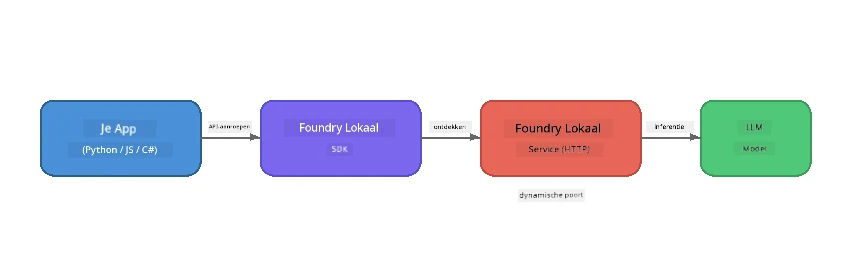

# Deel 1: Aan de slag met Foundry Local


## Wat is Foundry Local?

[Foundry Local](https://foundrylocal.ai) stelt je in staat om open-source AI-taalmodellen **direct op je computer** te draaien - geen internet nodig, geen cloudkosten, en volledige gegevensprivacy. Het:

- **Downloadt en draait modellen lokaal** met automatische hardwareoptimalisatie (GPU, CPU of NPU)
- **Biedt een OpenAI-compatibele API** zodat je vertrouwde SDK's en tools kunt gebruiken
- **Heeft geen Azure-abonnement** of registratie nodig - installeer gewoon en begin met bouwen

Zie het als je eigen private AI die volledig op jouw machine draait.

## Leerdoelen

Aan het einde van deze lab kun je:

- De Foundry Local CLI installeren op je besturingssysteem
- Begrijpen wat modelaliassen zijn en hoe ze werken
- Je eerste lokale AI-model downloaden en draaien
- Een chatbericht sturen naar een lokaal model vanaf de opdrachtregel
- Het verschil begrijpen tussen lokale en cloud-gehoste AI-modellen

---

## Vereisten

### Systeemvereisten

| Vereiste | Minimum | Aanbevolen |
|-------------|---------|-------------|
| **RAM** | 8 GB | 16 GB |
| **Schijfruimte** | 5 GB (voor modellen) | 10 GB |
| **CPU** | 4 cores | 8+ cores |
| **GPU** | Optioneel | NVIDIA met CUDA 11.8+ |
| **OS** | Windows 10/11 (x64/ARM), Windows Server 2025, macOS 13+ | - |

> **Opmerking:** Foundry Local selecteert automatisch de beste modelvariant voor je hardware. Heb je een NVIDIA GPU, dan wordt CUDA-versnelling gebruikt. Heb je een Qualcomm NPU, dan gebruikt het die. Anders wordt een geoptimaliseerde CPU-variant gekozen.

### Foundry Local CLI installeren

**Windows** (PowerShell):  
```powershell
winget install Microsoft.FoundryLocal
```
  
**macOS** (Homebrew):  
```bash
brew tap microsoft/foundrylocal
brew install foundrylocal
```
  
> **Opmerking:** Foundry Local ondersteunt momenteel alleen Windows en macOS. Linux wordt op dit moment niet ondersteund.

Controleer de installatie:  
```bash
foundry --version
```
  
---

## Labopdrachten

### Oefening 1: Verken Beschikbare Modellen

Foundry Local bevat een catalogus van voorgeoptimaliseerde open-source modellen. Lijst ze op:  

```bash
foundry model list
```
  
Je ziet modellen zoals:  
- `phi-3.5-mini` - Microsofts model met 3,8 miljard parameters (snel, goede kwaliteit)  
- `phi-4-mini` - Nieuwere, capabelere Phi-model  
- `phi-4-mini-reasoning` - Phi-model met chain-of-thought redenering (`<think>` tags)  
- `phi-4` - Microsofts grootste Phi-model (10,4 GB)  
- `qwen2.5-0.5b` - Zeer klein en snel (goed voor apparaten met weinig resources)  
- `qwen2.5-7b` - Sterk generiek model met tool-calling ondersteuning  
- `qwen2.5-coder-7b` - Geoptimaliseerd voor codegeneratie  
- `deepseek-r1-7b` - Sterk redeneermodel  
- `gpt-oss-20b` - Groot open-source model (MIT-licentie, 12,5 GB)  
- `whisper-base` - Spraak-naar-tekst transcriptie (383 MB)  
- `whisper-large-v3-turbo` - Hoge-accuratesse transcriptie (9 GB)  

> **Wat is een modelalias?** Aliassen zoals `phi-3.5-mini` zijn snelkoppelingen. Wanneer je een alias gebruikt, downloadt Foundry Local automatisch de beste variant voor jouw specifieke hardware (CUDA voor NVIDIA GPU's, CPU-geoptimaliseerd anders). Je hoeft nooit zelf de juiste variant te kiezen.

### Oefening 2: Draai je Eerste Model

Download en begin interactief te chatten met een model:  

```bash
foundry model run phi-3.5-mini
```
  
De eerste keer dat je dit uitvoert zal Foundry Local:  
1. Je hardware detecteren  
2. De optimale modelvariant downloaden (dit kan enkele minuten duren)  
3. Het model in het geheugen laden  
4. Een interactieve chat-sessie starten  

Probeer het wat vragen te stellen:  
```
You: What is the golden ratio?
You: Can you explain it as if I were 10 years old?
You: Write a haiku about mathematics
```
  
Typ `exit` of druk op `Ctrl+C` om te stoppen.

### Oefening 3: Pre-download een Model

Als je een model wilt downloaden zonder een chat te starten:  

```bash
foundry model download phi-3.5-mini
```
  
Bekijk welke modellen al op jouw machine gedownload zijn:  

```bash
foundry cache list
```
  
### Oefening 4: Begrijp de Architectuur

Foundry Local draait als een **lokale HTTP-service** die een OpenAI-compatibele REST API aanbiedt. Dit betekent:  

1. De service start op een **dynamische poort** (een andere poort elke keer)  
2. Je gebruikt de SDK om de werkelijke endpoint-URL te vinden  
3. Je kunt **elke** OpenAI-compatibele clientbibliotheek gebruiken om ermee te praten  

  

> **Belangrijk:** Foundry Local wijst elke keer een **dynamische poort** toe bij het starten. Hardcode nooit een poortnummer zoals `localhost:5272`. Gebruik altijd de SDK om de huidige URL te ontdekken (bijv. `manager.endpoint` in Python of `manager.urls[0]` in JavaScript).

---

## Belangrijke Punten

| Concept | Wat je hebt geleerd |
|---------|---------------------|
| On-device AI | Foundry Local draait modellen volledig op je apparaat zonder cloud, API-sleutels of kosten |
| Modelaliassen | Aliassen zoals `phi-3.5-mini` selecteren automatisch de beste variant voor je hardware |
| Dynamische poorten | De service draait op een dynamische poort; gebruik altijd de SDK om het endpoint te vinden |
| CLI en SDK | Je kunt modellen benaderen via de CLI (`foundry model run`) of programmeerbaar via de SDK |

---

## Volgende Stappen

Ga verder naar [Deel 2: Foundry Local SDK Uitgebreid](part2-foundry-local-sdk.md) om de SDK API te beheersen voor het programmeren van modellen, services en caching.