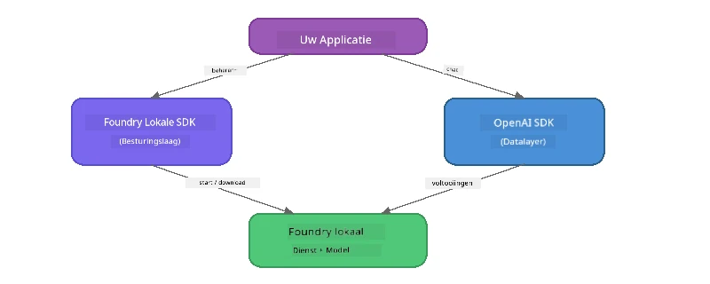

# Deel 3: Het gebruik van de Foundry Local SDK met OpenAI

## Overzicht

In Deel 1 gebruikte je de Foundry Local CLI om modellen interactief uit te voeren. In Deel 2 heb je de volledige SDK API-oppervlakte verkend. Nu leer je hoe je **Foundry Local in je applicaties integreert** met behulp van de SDK en de OpenAI-compatibele API.

Foundry Local biedt SDK's voor drie talen. Kies degene waarmee je het meest vertrouwd bent – de concepten zijn identiek voor alle drie.

## Leerdoelen

Aan het einde van deze labronde kun je:

- De Foundry Local SDK voor jouw programmeertaal installeren (Python, JavaScript of C#)
- `FoundryLocalManager` initialiseren om de service te starten, de cache te controleren, een model te downloaden en te laden
- Verbinden met het lokale model via de OpenAI SDK
- Chatcompletions verzenden en streaming responses verwerken
- Het dynamische poortarchitectuur begrijpen

---

## Vereisten

Voltooi eerst [Deel 1: Aan de slag met Foundry Local](part1-getting-started.md) en [Deel 2: Foundry Local SDK Deep Dive](part2-foundry-local-sdk.md).

Installeer **één** van de volgende taal runtimes:
- **Python 3.9+** - [python.org/downloads](https://www.python.org/downloads/)
- **Node.js 18+** - [nodejs.org](https://nodejs.org/)
- **.NET 9.0+** - [dot.net/download](https://dotnet.microsoft.com/download)

---

## Concept: Hoe de SDK werkt

De Foundry Local SDK beheert de **control plane** (de service starten, modellen downloaden), terwijl de OpenAI SDK de **data plane** afhandelt (prompts verzenden, completions ontvangen).



---

## Lab Oefeningen

### Oefening 1: Stel je omgeving in

<details>
<summary><b>🐍 Python</b></summary>

```bash
cd python
python -m venv venv

# Activeer de virtuele omgeving:
# Windows (PowerShell):
venv\Scripts\Activate.ps1
# Windows (Opdrachtprompt):
venv\Scripts\activate.bat
# macOS:
source venv/bin/activate

pip install -r requirements.txt
```

Het `requirements.txt` installeert:
- `foundry-local-sdk` - De Foundry Local SDK (geïmporteerd als `foundry_local`)
- `openai` - De OpenAI Python SDK
- `agent-framework` - Microsoft Agent Framework (gebruikt in latere delen)

</details>

<details>
<summary><b>📘 JavaScript</b></summary>

```bash
cd javascript
npm install
```

Het `package.json` installeert:
- `foundry-local-sdk` - De Foundry Local SDK
- `openai` - De OpenAI Node.js SDK

</details>

<details>
<summary><b>💜 C#</b></summary>

```bash
cd csharp
dotnet restore
dotnet build
```

Het `csharp.csproj` gebruikt:
- `Microsoft.AI.Foundry.Local` - De Foundry Local SDK (NuGet)
- `OpenAI` - De OpenAI C# SDK (NuGet)

> **Projectstructuur:** Het C#-project gebruikt een command-line router in `Program.cs` die naar aparte voorbeeldbestanden doorverwijst. Voer `dotnet run chat` uit (of gewoon `dotnet run`) voor dit deel. Andere delen gebruiken `dotnet run rag`, `dotnet run agent`, en `dotnet run multi`.

</details>

---

### Oefening 2: Basis Chat Completion

Open het basis chatvoorbeeld voor jouw taal en bekijk de code. Elk script volgt hetzelfde driedelige patroon:

1. **Start de service** – `FoundryLocalManager` start de Foundry Local runtime
2. **Download en laad het model** – controleer de cache, download indien nodig, en laad het in het geheugen
3. **Maak een OpenAI client aan** – maak verbinding met de lokale endpoint en verzend een streaming chat completion

<details>
<summary><b>🐍 Python - <code>python/foundry-local.py</code></b></summary>

```python
import sys
import openai
from foundry_local import FoundryLocalManager

alias = "phi-3.5-mini"

# Stap 1: Maak een FoundryLocalManager aan en start de service
print("Starting Foundry Local service...")
manager = FoundryLocalManager()
manager.start_service()

# Stap 2: Controleer of het model al is gedownload
cached = manager.list_cached_models()
catalog_info = manager.get_model_info(alias)
is_cached = any(m.id == catalog_info.id for m in cached) if catalog_info else False

if is_cached:
    print(f"Model already downloaded: {alias}")
else:
    print(f"Downloading model: {alias} (this may take several minutes)...")
    manager.download_model(alias)
    print(f"Download complete: {alias}")

# Stap 3: Laad het model in het geheugen
print(f"Loading model: {alias}...")
manager.load_model(alias)

# Maak een OpenAI-client die verwijst naar de LOKALE Foundry-service
client = openai.OpenAI(
    base_url=manager.endpoint,   # Dynamische poort - nooit hardcoderen!
    api_key=manager.api_key
)

# Genereer een streaming chat voltooiing
stream = client.chat.completions.create(
    model=manager.get_model_info(alias).id,
    messages=[{"role": "user", "content": "What is the golden ratio?"}],
    stream=True,
)

for chunk in stream:
    if chunk.choices[0].delta.content is not None:
        print(chunk.choices[0].delta.content, end="", flush=True)
print()
```

**Voer uit:**
```bash
python foundry-local.py
```

</details>

<details>
<summary><b>📘 JavaScript - <code>javascript/foundry-local.mjs</code></b></summary>

```javascript
import { OpenAI } from "openai";
import { FoundryLocalManager } from "foundry-local-sdk";

const alias = "phi-3.5-mini";

// Stap 1: Start de Foundry Local-service
console.log("Starting Foundry Local service...");
FoundryLocalManager.create({ appName: "FoundryLocalWorkshop" });
const manager = FoundryLocalManager.instance;
await manager.startWebService();

// Stap 2: Controleer of het model al is gedownload
const catalog = manager.catalog;
const model = await catalog.getModel(alias);

if (model.isCached) {
  console.log(`Model already downloaded: ${alias}`);
} else {
  console.log(`Downloading model: ${alias} (this may take several minutes)...`);
  await model.download();
  console.log(`Download complete: ${alias}`);
}

// Stap 3: Laad het model in het geheugen
console.log(`Loading model: ${alias}...`);
await model.load();
console.log(`Model loaded: ${model.id}`);

// Maak een OpenAI-client die naar de LOKALE Foundry-service wijst
const client = new OpenAI({
  baseURL: manager.urls[0] + "/v1",   // Dynamische poort - nooit hardcoderen!
  apiKey: "foundry-local",
});

// Genereer een streaming chat-completion
const stream = await client.chat.completions.create({
  model: model.id,
  messages: [{ role: "user", content: "What is the golden ratio?" }],
  stream: true,
});

for await (const chunk of stream) {
  if (chunk.choices[0]?.delta?.content) {
    process.stdout.write(chunk.choices[0].delta.content);
  }
}
console.log();
```

**Voer uit:**
```bash
node foundry-local.mjs
```

</details>

<details>
<summary><b>💜 C# - <code>csharp/BasicChat.cs</code></b></summary>

```csharp
using Microsoft.AI.Foundry.Local;
using Microsoft.Extensions.Logging.Abstractions;
using OpenAI;
using OpenAI.Chat;
using System.ClientModel;

var alias = "phi-3.5-mini";

// Step 1: Start the Foundry Local service
Console.WriteLine("Starting Foundry Local service...");
await FoundryLocalManager.CreateAsync(
    new Configuration
    {
        AppName = "FoundryLocalSamples",
        Web = new Configuration.WebService { Urls = "http://127.0.0.1:0" }
    }, NullLogger.Instance, default);
var manager = FoundryLocalManager.Instance;
await manager.StartWebServiceAsync(default);

// Step 2: Get the model from the catalog
var catalog = await manager.GetCatalogAsync(default);
var model = await catalog.GetModelAsync(alias, default);

// Step 3: Check if the model is already downloaded
var isCached = await model.IsCachedAsync(default);

if (isCached)
{
    Console.WriteLine($"Model already downloaded: {alias}");
}
else
{
    Console.WriteLine($"Downloading model: {alias} (this may take several minutes)...");
    await model.DownloadAsync(null, default);
    Console.WriteLine($"Download complete: {alias}");
}

// Step 4: Load the model into memory
Console.WriteLine($"Loading model: {alias}...");
await model.LoadAsync(default);
Console.WriteLine($"Loaded model: {model.Id}");
Console.WriteLine($"Endpoint: {manager.Urls[0]}");

// Create OpenAI client pointing to the LOCAL Foundry service
var key = new ApiKeyCredential("foundry-local");
var client = new OpenAIClient(key, new OpenAIClientOptions
{
    Endpoint = new Uri(manager.Urls[0] + "/v1")  // Dynamic port - never hardcode!
});

var chatClient = client.GetChatClient(model.Id);

// Stream a chat completion
var completionUpdates = chatClient.CompleteChatStreaming("What is the golden ratio?");

foreach (var update in completionUpdates)
{
    if (update.ContentUpdate.Count > 0)
    {
        Console.Write(update.ContentUpdate[0].Text);
    }
}
Console.WriteLine();
```

**Voer uit:**
```bash
dotnet run chat
```

</details>

---

### Oefening 3: Experimenteren met Prompts

Zodra je basisvoorbeeld werkt, probeer dan de code aan te passen:

1. **Verander het gebruikersbericht** – probeer andere vragen
2. **Voeg een systeem prompt toe** – geef het model een persona
3. **Zet streaming uit** – stel `stream=False` in en print de volledige response in één keer
4. **Probeer een ander model** – verander de alias van `phi-3.5-mini` naar een ander model uit `foundry model list`

<details>
<summary><b>🐍 Python</b></summary>

```python
# Voeg een systeemprompt toe - geef het model een persoonlijkheid:
stream = client.chat.completions.create(
    model=manager.get_model_info(alias).id,
    messages=[
        {"role": "system", "content": "You are a pirate. Answer everything in pirate speak."},
        {"role": "user", "content": "What is the golden ratio?"}
    ],
    stream=True,
)

# Of zet streaming uit:
response = client.chat.completions.create(
    model=manager.get_model_info(alias).id,
    messages=[{"role": "user", "content": "What is the golden ratio?"}],
    stream=False,
)
print(response.choices[0].message.content)
```

</details>

<details>
<summary><b>📘 JavaScript</b></summary>

```javascript
// Voeg een systeemprompt toe - geef het model een persoonlijkheid:
const stream = await client.chat.completions.create({
  model: modelInfo.id,
  messages: [
    { role: "system", content: "You are a pirate. Answer everything in pirate speak." },
    { role: "user", content: "What is the golden ratio?" },
  ],
  stream: true,
});

// Of schakel streamen uit:
const response = await client.chat.completions.create({
  model: modelInfo.id,
  messages: [{ role: "user", content: "What is the golden ratio?" }],
  stream: false,
});
console.log(response.choices[0].message.content);
```

</details>

<details>
<summary><b>💜 C#</b></summary>

```csharp
// Add a system prompt - give the model a persona:
var completionUpdates = chatClient.CompleteChatStreaming(
    new ChatMessage[]
    {
        new SystemChatMessage("You are a pirate. Answer everything in pirate speak."),
        new UserChatMessage("What is the golden ratio?")
    }
);

// Or turn off streaming:
var response = chatClient.CompleteChat("What is the golden ratio?");
Console.WriteLine(response.Value.Content[0].Text);
```

</details>

---

### SDK Methode Referentie

<details>
<summary><b>🐍 Python SDK Methoden</b></summary>

| Methode | Doel |
|---------|------|
| `FoundryLocalManager()` | Maak een manager instantie aan |
| `manager.start_service()` | Start de Foundry Local service |
| `manager.list_cached_models()` | Lijst modellen gedownload op jouw apparaat |
| `manager.get_model_info(alias)` | Verkrijg model-ID en metadata |
| `manager.download_model(alias, progress_callback=fn)` | Download een model met optionele voortgangscallback |
| `manager.load_model(alias)` | Laad een model in het geheugen |
| `manager.endpoint` | Verkrijg de dynamische endpoint URL |
| `manager.api_key` | Verkrijg de API sleutel (placeholder voor lokaal) |

</details>

<details>
<summary><b>📘 JavaScript SDK Methoden</b></summary>

| Methode | Doel |
|---------|------|
| `FoundryLocalManager.create({ appName })` | Maak een manager instantie aan |
| `FoundryLocalManager.instance` | Toegang tot de singleton manager |
| `await manager.startWebService()` | Start de Foundry Local service |
| `await manager.catalog.getModel(alias)` | Haal een model uit de catalogus |
| `model.isCached` | Controleer of het model al gedownload is |
| `await model.download()` | Download een model |
| `await model.load()` | Laad een model in het geheugen |
| `model.id` | Verkrijg de model-ID voor OpenAI API calls |
| `manager.urls[0] + "/v1"` | Verkrijg de dynamische endpoint URL |
| `"foundry-local"` | API sleutel (placeholder voor lokaal) |

</details>

<details>
<summary><b>💜 C# SDK Methoden</b></summary>

| Methode | Doel |
|---------|------|
| `FoundryLocalManager.CreateAsync(config)` | Maak en initialiseert de manager |
| `manager.StartWebServiceAsync()` | Start de Foundry Local webservice |
| `manager.GetCatalogAsync()` | Verkrijg de model catalogus |
| `catalog.ListModelsAsync()` | Lijst alle beschikbare modellen |
| `catalog.GetModelAsync(alias)` | Haal een specifiek model op via alias |
| `model.IsCachedAsync()` | Controleer of een model gedownload is |
| `model.DownloadAsync()` | Download een model |
| `model.LoadAsync()` | Laad een model in het geheugen |
| `manager.Urls[0]` | Verkrijg de dynamische endpoint URL |
| `new ApiKeyCredential("foundry-local")` | API sleutel referentie voor lokaal |

</details>

---

### Oefening 4: Gebruik van de Native ChatClient (Alternatief voor OpenAI SDK)

In oefeningen 2 en 3 gebruikte je de OpenAI SDK voor chatcompletions. De JavaScript en C# SDK's bieden ook een **native ChatClient** die de OpenAI SDK helemaal overbodig maakt.

<details>
<summary><b>📘 JavaScript - <code>model.createChatClient()</code></b></summary>

```javascript
import { FoundryLocalManager } from "foundry-local-sdk";

const alias = "phi-3.5-mini";

FoundryLocalManager.create({ appName: "ChatClientDemo" });
const manager = FoundryLocalManager.instance;
await manager.startWebService();

const model = await manager.catalog.getModel(alias);
if (!model.isCached) await model.download();
await model.load();

// Geen OpenAI-import nodig — krijg een client direct van het model
const chatClient = model.createChatClient();

// Niet-streaming voltooiing
const response = await chatClient.completeChat([
  { role: "system", content: "You are a pirate. Answer everything in pirate speak." },
  { role: "user", content: "What is the golden ratio?" }
]);
console.log(response.choices[0].message.content);

// Streaming voltooiing (gebruikt een callback-patroon)
await chatClient.completeStreamingChat(
  [{ role: "user", content: "What is the golden ratio?" }],
  (chunk) => {
    if (chunk.choices?.[0]?.delta?.content) {
      process.stdout.write(chunk.choices[0].delta.content);
    }
  }
);
console.log();
```

> **Opmerking:** De `completeStreamingChat()` van ChatClient gebruikt een **callback** patroon, geen async iterator. Geef een functie mee als tweede argument.

</details>

<details>
<summary><b>💜 C# - <code>model.GetChatClientAsync()</code></b></summary>

```csharp
var catalog = await manager.GetCatalogAsync(default);
var model = await catalog.GetModelAsync("phi-3.5-mini", default);
if (!await model.IsCachedAsync(default))
    await model.DownloadAsync(null, default);
await model.LoadAsync(default);

// No OpenAI NuGet needed — get a client directly from the model
var chatClient = await model.GetChatClientAsync(default);

// Use it like a standard OpenAI ChatClient
var response = chatClient.CompleteChat("What is the golden ratio?");
Console.WriteLine(response.Value.Content[0].Text);
```

</details>

> **Wanneer welke te gebruiken:**
> | Benadering | Het beste voor |
> |------------|----------------|
> | OpenAI SDK | Volledige parametercontrole, productie-apps, bestaande OpenAI code |
> | Native ChatClient | Snelle prototyping, minder afhankelijkheden, eenvoudigere setup |

---

## Belangrijke inzichten

| Concept | Wat je hebt geleerd |
|---------|---------------------|
| Control plane | De Foundry Local SDK regelt service starten en modellen laden |
| Data plane | De OpenAI SDK regelt chatcompletions en streaming |
| Dynamische poorten | Gebruik altijd de SDK om de endpoint te vinden; nooit harde gecodeerde URL's |
| Taalonafhankelijk | Dezelfde codepatroon werkt in Python, JavaScript en C# |
| OpenAI compatibiliteit | Volledige OpenAI API compatibiliteit betekent dat bestaande OpenAI code met minimale aanpassingen werkt |
| Native ChatClient | `createChatClient()` (JS) / `GetChatClientAsync()` (C#) biedt een alternatief voor de OpenAI SDK |

---

## Volgende stappen

Ga verder met [Deel 4: Het bouwen van een RAG-applicatie](part4-rag-fundamentals.md) om te leren hoe je een Retrieval-Augmented Generation pipeline bouwt die volledig op jouw apparaat draait.