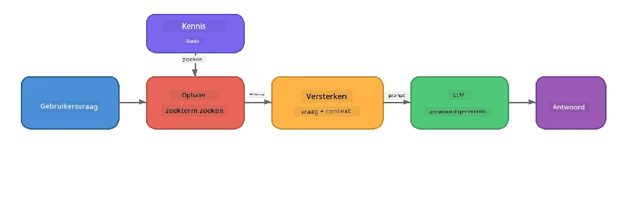

# Deel 4: Een RAG-toepassing bouwen met Foundry Local

## Overzicht

Grote taalmodellen zijn krachtig, maar ze weten alleen wat er in hun trainingsdata stond. **Retrieval-Augmented Generation (RAG)** lost dit op door het model relevante context te geven bij het opvragen - gehaald uit je eigen documenten, databases of kennisbanken.

In deze lab ga je een volledige RAG-pijplijn bouwen die **helemaal op jouw apparaat draait** met Foundry Local. Geen clouddiensten, geen vectordatabases, geen embeddings-API - alleen lokale terugzoeking en een lokaal model.

## Leerdoelen

Aan het einde van deze lab kun je:

- Uitleggen wat RAG is en waarom het belangrijk is voor AI-toepassingen
- Een lokale kennisbank bouwen uit tekstbestanden
- Een eenvoudige terugzoekfunctie implementeren om relevante context te vinden
- Een systeemprompt samenstellen die het model baseert op opgehaalde feiten
- De volledige Retrieve → Augment → Generate-pijplijn lokaal uitvoeren
- De afwegingen begrijpen tussen eenvoudige trefwoordterugzoeking en vectorzoektocht

---

## Vereisten

- Voltooi [Deel 3: De Foundry Local SDK gebruiken met OpenAI](part3-sdk-and-apis.md)
- Foundry Local CLI geïnstalleerd en `phi-3.5-mini` model gedownload

---

## Concept: Wat is RAG?

Zonder RAG kan een LLM alleen antwoorden vanuit zijn trainingsdata - die mogelijk verouderd, onvolledig of zonder jouw privé-informatie is:

```
User: "What is Zava's return policy?"
LLM:  "I do not have information about Zava's return policy."  ← No context!
```

Met RAG **haal je eerst relevante documenten op, en vervolgens **verrijk je** je prompt met die context voordat je een antwoord **genereert**:



De belangrijke inzicht: **het model hoeft het antwoord niet te "weten"; het hoeft alleen de juiste documenten te lezen.**

---

## Lab Oefeningen

### Oefening 1: Begrijp de Kennisbank

Open het RAG-voorbeeld voor jouw taal en bekijk de kennisbank:

<details>
<summary><b>🐍 Python: <code>python/foundry-local-rag.py</code></b></summary>

De kennisbank is een eenvoudige lijst van dictionaries met velden `title` en `content`:

```python
KNOWLEDGE_BASE = [
    {
        "title": "Foundry Local Overview",
        "content": (
            "Foundry Local brings the power of Azure AI Foundry to your local "
            "device without requiring an Azure subscription..."
        ),
    },
    {
        "title": "Supported Hardware",
        "content": (
            "Foundry Local automatically selects the best model variant for "
            "your hardware. If you have an Nvidia CUDA GPU it downloads the "
            "CUDA-optimized model..."
        ),
    },
    # ... meer vermeldingen
]
```

Elke invoer is een "stukje" kennis - een gericht stukje informatie over één onderwerp.

</details>

<details>
<summary><b>📘 JavaScript: <code>javascript/foundry-local-rag.mjs</code></b></summary>

De kennisbank gebruikt dezelfde structuur als een array van objecten:

```javascript
const KNOWLEDGE_BASE = [
  {
    title: "Foundry Local Overview",
    content:
      "Foundry Local brings the power of Azure AI Foundry to your local " +
      "device without requiring an Azure subscription...",
  },
  {
    title: "Supported Hardware",
    content:
      "Foundry Local automatically selects the best model variant for " +
      "your hardware...",
  },
  // ... meer vermeldingen
];
```

</details>

<details>
<summary><b>💜 C#: <code>csharp/RagPipeline.cs</code></b></summary>

De kennisbank gebruikt een lijst van named tuples:

```csharp
private static readonly List<(string Title, string Content)> KnowledgeBase =
[
    ("Foundry Local Overview",
     "Foundry Local brings the power of Azure AI Foundry to your local " +
     "device without requiring an Azure subscription..."),

    ("Supported Hardware",
     "Foundry Local automatically selects the best model variant for " +
     "your hardware..."),

    // ... more entries
];
```

</details>

> **In een echte toepassing** komt de kennisbank van bestanden op schijf, een database, een zoekindex of een API. Voor deze lab gebruiken we een lijst in het geheugen om het eenvoudig te houden.

---

### Oefening 2: Begrijp de Terugzoekfunctie

De terugzoekstap vindt de meest relevante stukken voor de vraag van een gebruiker. Dit voorbeeld gebruikt **trefwoord overlapping** - het tellen van hoeveel woorden in de vraag ook in elk stuk voorkomen:

<details>
<summary><b>🐍 Python</b></summary>

```python
def retrieve(query: str, top_k: int = 2) -> list[dict]:
    """Return the top-k knowledge chunks most relevant to the query."""
    query_words = set(query.lower().split())
    scored = []
    for chunk in KNOWLEDGE_BASE:
        chunk_words = set(chunk["content"].lower().split())
        overlap = len(query_words & chunk_words)
        scored.append((overlap, chunk))
    scored.sort(key=lambda x: x[0], reverse=True)
    return [item[1] for item in scored[:top_k]]
```

</details>

<details>
<summary><b>📘 JavaScript</b></summary>

```javascript
function retrieve(query, topK = 2) {
  const queryWords = new Set(query.toLowerCase().split(/\s+/));
  const scored = KNOWLEDGE_BASE.map((chunk) => {
    const chunkWords = new Set(chunk.content.toLowerCase().split(/\s+/));
    let overlap = 0;
    for (const w of queryWords) {
      if (chunkWords.has(w)) overlap++;
    }
    return { overlap, chunk };
  });
  scored.sort((a, b) => b.overlap - a.overlap);
  return scored.slice(0, topK).map((s) => s.chunk);
}
```

</details>

<details>
<summary><b>💜 C#</b></summary>

```csharp
private static List<(string Title, string Content)> Retrieve(string query, int topK = 2)
{
    var queryWords = new HashSet<string>(
        query.ToLowerInvariant().Split(' ', StringSplitOptions.RemoveEmptyEntries));

    return KnowledgeBase
        .Select(chunk =>
        {
            var chunkWords = new HashSet<string>(
                chunk.Content.ToLowerInvariant().Split(' ', StringSplitOptions.RemoveEmptyEntries));
            var overlap = queryWords.Intersect(chunkWords).Count();
            return (Overlap: overlap, Chunk: chunk);
        })
        .OrderByDescending(x => x.Overlap)
        .Take(topK)
        .Select(x => x.Chunk)
        .ToList();
}
```

</details>

**Werking:**
1. Verdeel de vraag in losse woorden
2. Tel voor elk kennisstuk hoeveel van die woorden erin voorkomen
3. Sorteer op overlapscore (hoogste eerst)
4. Geef de top-k meest relevante stukken terug

> **Afweging:** Trefwoord overlappen is simpel maar beperkt; het begrijpt geen synoniemen of betekenis. Productie RAG-systemen gebruiken doorgaans **embedding vectoren** en een **vectordatabase** voor semantisch zoeken. Maar trefwoord overlappen is een prima startpunt en vereist geen extra dependencies.

---

### Oefening 3: Begrijp de Verrijkte Prompt

De opgehaalde context wordt in de **systeem prompt** geïnjecteerd voordat deze naar het model gaat:

```python
system_prompt = (
    "You are a helpful assistant. Answer the user's question using ONLY "
    "the information provided in the context below. If the context does "
    "not contain enough information, say so.\n\n"
    f"Context:\n{context_text}"
)
```

Belangrijke ontwerpkeuzes:
- **"ALLEEN de gegeven informatie"** - voorkomt dat het model feiten hallucineren die niet in de context staan
- **"Als de context niet genoeg info bevat, geef dat aan"** - moedigt eerlijke "ik weet het niet" antwoorden aan
- De context staat in het systeembericht zodat het alle antwoorden beïnvloedt

---

### Oefening 4: Voer de RAG-pijplijn uit

Voer het volledige voorbeeld uit:

**Python:**
```bash
cd python
python foundry-local-rag.py
```

**JavaScript:**
```bash
cd javascript
node foundry-local-rag.mjs
```

**C#:**
```bash
cd csharp
dotnet run rag
```

Je zou drie dingen moeten zien geprint:
1. **De gestelde vraag**
2. **De opgehaalde context** - de gekozen stukken uit de kennisbank
3. **Het antwoord** - gegenereerd door het model alleen met die context

Voorbeeldoutput:
```
Question: How do I install Foundry Local and what hardware does it support?

--- Retrieved Context ---
### Installation
On Windows install Foundry Local with: winget install Microsoft.FoundryLocal...

### Supported Hardware
Foundry Local automatically selects the best model variant for your hardware...
-------------------------

Answer: To install Foundry Local, you can use the following methods depending
on your operating system: On Windows, run `winget install Microsoft.FoundryLocal`.
On macOS, use `brew install microsoft/foundrylocal/foundrylocal`...
```

Merk op hoe het antwoord van het model **gegrond** is in de opgehaalde context - het noemt alleen feiten uit de kennisbankdocumenten.

---

### Oefening 5: Experimenteer en Breid Uit

Probeer deze aanpassingen om je begrip te verdiepen:

1. **Verander de vraag** - vraag iets wat WEL in de kennisbank staat versus iets wat NIET staat:
   ```python
   question = "What programming languages does Foundry Local support?"  # ← In context
   question = "How much does Foundry Local cost?"                       # ← Niet in context
   ```
   Zegt het model correct "Ik weet het niet" als het antwoord niet in de context staat?

2. **Voeg een nieuw kennisstuk toe** - voeg een nieuwe invoer toe aan `KNOWLEDGE_BASE`:
   ```python
   {
       "title": "Pricing",
       "content": "Foundry Local is completely free and open source under the MIT license.",
   }
   ```
   Vraag daarna weer de prijsinformatie.

3. **Verander `top_k`** - haal meer of minder stukken op:
   ```python
   context_chunks = retrieve(question, top_k=3)  # Meer context
   context_chunks = retrieve(question, top_k=1)  # Minder context
   ```
   Hoe beïnvloedt de hoeveelheid context de kwaliteit van het antwoord?

4. **Verwijder de grondingsinstructie** - verander de systeem prompt in gewoon "Je bent een behulpzame assistent." en kijk of het model begint feiten te hallucineren.

---

## Diepgaande uitleg: Optimaliseren van RAG voor On-Device prestaties

RAG lokaal draaien brengt beperkingen met zich mee die je in de cloud niet hebt: beperkte RAM, geen dedicated GPU (CPU/NPU uitvoering) en een klein contextvenster. De ontwerpkeuzes hieronder spelen direct in op deze beperkingen en zijn gebaseerd op patronen uit productiestijl lokale RAG-applicaties gebouwd met Foundry Local.

### Chunking Strategie: Vaste grootte sliding window

Chunking - hoe je documenten in stukken splitst - is één van de meest impactvolle beslissingen in elk RAG-systeem. Voor on-device scenario's is een **fixed-size sliding window met overlap** de aanbevolen startpunt:

| Parameter | Aanbevolen waarde | Waarom |
|-----------|------------------|--------|
| **Chunk grootte** | ~200 tokens | Houdt opgehaalde context compact, en laat ruimte in Phi-3.5 Mini's contextvenster voor systeem prompt, gesprekshistorie en gegenereerde output |
| **Overlap** | ~25 tokens (12,5%) | Voorkomt informatieverlies bij chunk grenzen - belangrijk voor procedures en stap-voor-stap instructies |
| **Tokenisatie** | Scheiden op witruimte | Geen dependencies, geen tokenizer bibliotheek nodig. Alle rekencapaciteit blijft bij het LLM |

De overlap werkt als een schuivend venster: elk nieuw stuk begint 25 tokens vóór het vorige eindigde, zodat zinnen die over grenzen lopen in beide stukken voorkomen.

> **Waarom niet andere strategieën?**
> - **Zinsgebaseerd splitsen** geeft onvoorspelbare chunkgroottes; sommige veiligheidsprocedures zijn lange zinnen die niet goed splitsen
> - **Sectie-gebaseerd splitsen** (op `##` koppen) creëert zeer verschillende chunkgroottes - sommige te klein, andere te groot voor het contextvenster
> - **Semantische chunking** (embedding-gebaseerde onderwerpdetectie) geeft de beste zoekkwaliteit, maar heeft een tweede model in geheugen nodig naast Phi-3.5 Mini - riskant op hardware met 8-16 GB gedeeld geheugen

### Verbeterde terugzoeking: TF-IDF vectoren

De trefwoord-overlap aanpak in deze lab werkt, maar als je betere terugzoeking wil zonder een embedding model toe te voegen, is **TF-IDF (Term Frequency-Inverse Document Frequency)** een uitstekend middenweg:

```
Keyword Overlap  →  TF-IDF Vectors  →  Embedding Models
    (this lab)     (lightweight upgrade)   (production)
  Simple & fast    Better ranking,         Best quality,
  No dependencies  still no ML model       requires embedding model
  ~Basic matching  ~1ms retrieval          ~100-500ms per query
```

TF-IDF zet elk stuk om in een numerieke vector gebaseerd op hoe belangrijk elk woord is binnen dat stuk *ten opzichte van alle stukken*. Bij het opvragen wordt de vraag op dezelfde manier gevectoriseerd en vergeleken met cosine similarity. Je kunt dit implementeren met SQLite en puur JavaScript/Python - geen vectordatabase, geen embedding API.

> **Prestaties:** TF-IDF cosine similarity over vaste chunks bereikt typisch **~1ms terugzoektijd**, vergeleken met ~100-500ms als een embedding model elk verzoek codeert. Alle 20+ documenten kunnen in minder dan een seconde gechunked en geïndexeerd worden.

### Edge/Compact Modus voor Beperkte Apparaten

Bij draaien op zeer beperkte hardware (oudere laptops, tablets, veldapparaten) kun je het resourcegebruik verlagen door drie instellingen te verkleinen:

| Instelling | Standaardmodus | Edge/Compact Modus |
|------------|----------------|--------------------|
| **Systeem prompt** | ~300 tokens | ~80 tokens |
| **Max output tokens** | 1024 | 512 |
| **Opgehaalde stukken (top-k)** | 5 | 3 |

Minder opgehaalde stukken betekent minder context voor het model om te verwerken, wat latentie en geheugendruk vermindert. Een kortere systeem prompt geeft meer ruimte in het contextvenster voor het antwoord zelf. Deze afweging is de moeite waard op apparaten waar elk token in het contextvenster telt.

### Enkel model in geheugen

Een van de belangrijkste principes voor on-device RAG: **houd slechts één model geladen**. Gebruik je een embedding model voor terugzoeking *én* een taalmodel voor generatie, dan deel je beperkte NPU/RAM bronnen tussen twee modellen. Lichtgewicht terugzoeking (trefwoord overlap, TF-IDF) voorkomt dit volledig:

- Geen embedding model die concurreert met het LLM in geheugen
- Snellere cold start - slechts één model laden
- Voorspelbaar geheugengebruik - het LLM krijgt alle beschikbare bronnen
- Werkt op machines met slechts 8 GB RAM

### SQLite als lokale vectordatabase

Voor kleine tot middelgrote documentverzamelingen (honderden tot lage duizenden chunks) is **SQLite snel genoeg** voor brute-force cosine similarity zoekopdrachten en voegt geen infrastructuur toe:

- Enkel `.db` bestand op schijf - geen serverproces, geen configuratie
- Wordt meegeleverd bij elke grote taalruntime (Python `sqlite3`, Node.js `better-sqlite3`, .NET `Microsoft.Data.Sqlite`)
- Slaat documentstukjes en hun TF-IDF vectoren op in één tabel
- Geen Pinecone, Qdrant, Chroma of FAISS nodig op deze schaal

### Prestatieoverzicht

Deze ontwerpkeuzes leveren responsieve RAG op consumentenhardware:

| Metriek | On-Device Prestatie |
|---------|---------------------|
| **Terugzoeklatentie** | ~1ms (TF-IDF) tot ~5ms (trefwoord overlap) |
| **Inname snelheid** | 20 documenten gechunked en geïndexeerd in < 1 seconde |
| **Modellen in geheugen** | 1 (alleen LLM - geen embedding model) |
| **Opslag overhead** | < 1 MB voor chunkjes + vectoren in SQLite |
| **Cold start** | Enkel model laden, geen embedding runtime start |
| **Hardware minimum** | 8 GB RAM, CPU-only (geen GPU nodig) |

> **Wanneer upgraden:** Als je naar honderden lange documenten schaalt, gemengde contenttypes (tabellen, code, proza), of semantisch begrip van queries nodig hebt, overweeg een embedding model toe te voegen en vector similarity search te gebruiken. Voor de meeste on-device gebruiksgevallen met gefocuste documenten biedt TF-IDF + SQLite uitstekende resultaten met minimale resources.

---

## Kernconcepten

| Concept | Beschrijving |
|---------|-------------|
| **Terugzoeking** | Relevante documenten vinden uit een kennisbank op basis van de query van de gebruiker |
| **Verrijking** | Opgehaalde documenten als context in de prompt invoegen |
| **Generatie** | Het LLM produceert een antwoord dat gebaseerd is op de gegeven context |
| **Chunking** | Grote documenten opdelen in kleinere, gerichte stukken |
| **Gronding** | Het model beperken tot alleen de gegeven context te gebruiken (vermindert hallucinatie) |
| **Top-k** | Het aantal meest relevante stukken om op te halen |

---

## RAG in productie versus deze lab

| Aspect | Deze lab | On-Device geoptimaliseerd | Cloudproductie |
|--------|----------|---------------------------|---------------|
| **Kennisbank** | In geheugen lijst | Bestanden op schijf, SQLite | Database, zoekindex |
| **Terugzoeking** | Trefwoord overlapping | TF-IDF + cosine similarity | Vector embeddings + similarity search |
| **Embeddings** | Niet nodig | Niet nodig - TF-IDF vectoren | Embedding model (lokaal of cloud) |
| **Vectordatabase** | Niet nodig | SQLite (enkel `.db` bestand) | FAISS, Chroma, Azure AI Search, etc. |
| **Chunking** | Handmatig | Fixed-size sliding window (~200 tokens, 25-token overlap) | Semantisch of recursief chunking |
| **Modellen in geheugen** | 1 (LLM) | 1 (LLM) | 2+ (embedding + LLM) |
| **Ophaaltijd** | ~5ms | ~1ms | ~100-500ms |
| **Schaal** | 5 documenten | Honderden documenten | Miljoenen documenten |

De patronen die je hier leert (ophalen, aanvullen, genereren) zijn hetzelfde op elke schaal. De ophaalmethode verbetert, maar de algehele architectuur blijft identiek. De middelste kolom laat zien wat haalbaar is op het apparaat zelf met lichte technieken, vaak de gulden middenweg voor lokale toepassingen waar je cloud-schaal inruilt voor privacy, offline mogelijkheden, en nul vertraging naar externe diensten.

---

## Belangrijkste punten

| Concept | Wat je hebt geleerd |
|---------|---------------------|
| RAG-patroon | Ophalen + Aanvullen + Genereren: geef het model de juiste context en het kan vragen over je data beantwoorden |
| Op apparaat | Alles draait lokaal zonder cloud-API's of abonnementen op vectordatabases |
| Grondslag-instructies | Systeemprompt-beperkingen zijn cruciaal om hallucinaties te voorkomen |
| Zoekwoordoverlap | Een eenvoudige maar effectieve startpunt voor ophalen |
| TF-IDF + SQLite | Een lichte upgrade die ophalen onder 1ms houdt zonder een embeddingmodel |
| Eén model in geheugen | Vermijd het laden van een embeddingmodel naast de LLM op beperkte hardware |
| Chunkgrootte | Ongeveer 200 tokens met overlap balanceren ophaalnauwkeurigheid en efficiëntie van de contextvenster |
| Edge/compact-modus | Gebruik minder chunks en kortere prompts voor zeer beperkte apparaten |
| Universeel patroon | Dezelfde RAG-architectuur werkt voor elke datasoort: documenten, databases, API’s of wiki’s |

> **Wil je een volledige on-device RAG-toepassing zien?** Bekijk [Gas Field Local RAG](https://github.com/leestott/local-rag), een productie-achtige offline RAG-agent gebouwd met Foundry Local en Phi-3.5 Mini die deze optimalisatiepatronen demonstreert met een echte documentenset.

---

## Volgende stappen

Ga verder naar [Deel 5: AI-agents bouwen](part5-single-agents.md) om te leren hoe je intelligente agents bouwt met persona’s, instructies, en meerbeurten-gesprekken met behulp van het Microsoft Agent Framework.