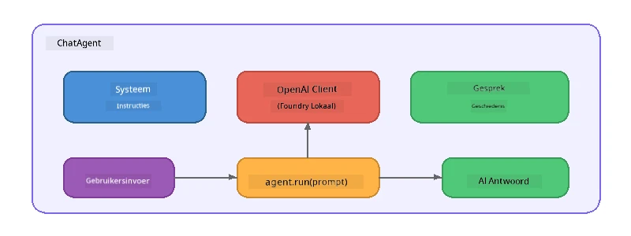

# Deel 5: AI-agents bouwen met het Agent Framework

> **Doel:** Bouw je eerste AI-agent met persistente instructies en een gedefinieerde persona, aangedreven door een lokaal model via Foundry Local.

## Wat is een AI-agent?

Een AI-agent omhult een taalmodel met **systeeminstructies** die het gedrag, de persoonlijkheid en beperkingen definiëren. In tegenstelling tot een enkele chatcompletion-aanroep biedt een agent:

- **Persona** - een consistente identiteit ("Je bent een behulpzame code reviewer")
- **Geheugen** - gespreksgeschiedenis over beurten heen
- **Specialisatie** - gefocust gedrag gestuurd door zorgvuldig opgestelde instructies



---

## Het Microsoft Agent Framework

Het **Microsoft Agent Framework** (AGF) biedt een standaard agentabstractie die werkt met verschillende model-backends. In deze workshop combineren we het met Foundry Local zodat alles op je eigen machine draait - geen cloud nodig.

| Concept | Beschrijving |
|---------|--------------|
| `FoundryLocalClient` | Python: beheert service-start, modeldownload/-laden en maakt agents aan |
| `client.as_agent()` | Python: maakt een agent aan van de Foundry Local client |
| `AsAIAgent()` | C#: extensiemethode op `ChatClient` - maakt een `AIAgent` aan |
| `instructions` | Systeemprompt die het gedrag van de agent vormgeeft |
| `name` | Menselijk leesbaar label, handig in multi-agent scenario's |
| `agent.run(prompt)` / `RunAsync()` | Stuurt een gebruikersbericht en retourneert de reactie van de agent |

> **Opmerking:** Het Agent Framework heeft een Python en .NET SDK. Voor JavaScript implementeren we een lichte `ChatAgent` klasse die hetzelfde patroon direct met de OpenAI SDK volgt.

---

## Oefeningen

### Oefening 1 - Begrijp het Agent-patroon

Bestudeer vóór het schrijven van code de belangrijkste onderdelen van een agent:

1. **Modelclient** - verbindt met Foundry Local's OpenAI-compatibele API
2. **Systeeminstructies** - de "persoonlijkheid" prompt
3. **Run loop** - verzendt gebruikersinvoer, ontvangt uitvoer

> **Denk erover na:** Hoe verschillen systeeminstructies van een regulier gebruikersbericht? Wat gebeurt er als je ze verandert?

---

### Oefening 2 - Voer het Single-Agent voorbeeld uit

<details>
<summary><strong>🐍 Python</strong></summary>

**Vereisten:**
```bash
cd python
python -m venv venv

# Windows (PowerShell):
venv\Scripts\Activate.ps1
# macOS:
source venv/bin/activate

pip install -r requirements.txt
```

**Uitvoeren:**
```bash
python foundry-local-with-agf.py
```

**Code uitleg** (`python/foundry-local-with-agf.py`):

```python
import asyncio
from agent_framework_foundry_local import FoundryLocalClient

async def main():
    alias = "phi-4-mini"

    # FoundryLocalClient handelt service-start, model download en laden af
    client = FoundryLocalClient(model_id=alias)
    print(f"Client Model ID: {client.model_id}")

    # Maak een agent aan met systeeminstructies
    agent = client.as_agent(
        name="Joker",
        instructions="You are good at telling jokes.",
    )

    # Niet-streaming: krijg de volledige reactie in één keer
    result = await agent.run("Tell me a joke about a pirate.")
    print(f"Agent: {result}")

    # Streaming: krijg resultaten terwijl ze worden gegenereerd
    async for chunk in agent.run("Tell me another joke.", stream=True):
        if chunk.text:
            print(chunk.text, end="", flush=True)

asyncio.run(main())
```

**Belangrijke punten:**
- `FoundryLocalClient(model_id=alias)` verzorgt service-start, download en model laden in één stap
- `client.as_agent()` maakt een agent aan met systeeminstructies en naam
- `agent.run()` ondersteunt zowel non-streaming als streaming modus
- Installeren via `pip install agent-framework-foundry-local --pre`

</details>

<details>
<summary><strong>📦 JavaScript</strong></summary>

**Vereisten:**
```bash
cd javascript
npm install
```

**Uitvoeren:**
```bash
node foundry-local-with-agent.mjs
```

**Code uitleg** (`javascript/foundry-local-with-agent.mjs`):

```javascript
import { OpenAI } from "openai";
import { FoundryLocalManager } from "foundry-local-sdk";

class ChatAgent {
  constructor({ client, modelId, instructions, name }) {
    this.client = client;
    this.modelId = modelId;
    this.instructions = instructions;
    this.name = name;
    this.history = [];
  }

  async run(userMessage) {
    const messages = [
      { role: "system", content: this.instructions },
      ...this.history,
      { role: "user", content: userMessage },
    ];
    const response = await this.client.chat.completions.create({
      model: this.modelId,
      messages,
    });
    const assistantMessage = response.choices[0].message.content;

    // Bewaar gespreksgeschiedenis voor meerdere beurten interacties
    this.history.push({ role: "user", content: userMessage });
    this.history.push({ role: "assistant", content: assistantMessage });
    return { text: assistantMessage };
  }
}

async function main() {
  FoundryLocalManager.create({ appName: "FoundryLocalWorkshop" });
  const manager = FoundryLocalManager.instance;
  await manager.startWebService();

  const catalog = manager.catalog;
  const model = await catalog.getModel("phi-3.5-mini");
  if (!model.isCached) {
    console.log("Downloading model: phi-3.5-mini...");
    await model.download();
  }
  await model.load();

  const client = new OpenAI({
    baseURL: manager.urls[0] + "/v1",
    apiKey: "foundry-local",
  });

  const agent = new ChatAgent({
    client,
    modelId: model.id,
    instructions: "You are good at telling jokes.",
    name: "Joker",
  });

  const result = await agent.run("Tell me a joke about a pirate.");
  console.log(result.text);
}

main();
```

**Belangrijke punten:**
- JavaScript bouwt zijn eigen `ChatAgent` klasse die het Python AGF-patroon nabootst
- `this.history` slaat gespreksbeurten op voor multi-turn ondersteuning
- Expliciete `startWebService()` → cache-check → `model.download()` → `model.load()` geeft volledige controle

</details>

<details>
<summary><strong>💜 C#</strong></summary>

**Vereisten:**
```bash
cd csharp
dotnet restore
```

**Uitvoeren:**
```bash
dotnet run agent
```

**Code uitleg** (`csharp/SingleAgent.cs`):

```csharp
using Microsoft.AI.Foundry.Local;
using Microsoft.Extensions.Logging.Abstractions;
using Microsoft.Agents.AI;
using OpenAI;
using System.ClientModel;

// 1. Start Foundry Local and load a model
var alias = "phi-3.5-mini";
await FoundryLocalManager.CreateAsync(
    new Configuration
    {
        AppName = "FoundryLocalSamples",
        Web = new Configuration.WebService { Urls = "http://127.0.0.1:0" }
    }, NullLogger.Instance, default);
var manager = FoundryLocalManager.Instance;
await manager.StartWebServiceAsync(default);

var catalog = await manager.GetCatalogAsync(default);
var model = await catalog.GetModelAsync(alias, default);

var isCached = await model.IsCachedAsync(default);
if (!isCached)
{
    Console.WriteLine($"Downloading model: {alias}...");
    await model.DownloadAsync(null, default);
}
await model.LoadAsync(default);

var key = new ApiKeyCredential("foundry-local");
var client = new OpenAIClient(key, new OpenAIClientOptions
{
    Endpoint = new Uri(manager.Urls[0] + "/v1")
});

// 2. Create an AIAgent using the Agent Framework extension method
AIAgent joker = client
    .GetChatClient(model.Id)
    .AsAIAgent(
        instructions: "You are good at telling jokes. Keep your jokes short and family-friendly.",
        name: "Joker"
    );

// 3. Run the agent (non-streaming)
var response = await joker.RunAsync("Tell me a joke about a pirate.");
Console.WriteLine($"Joker: {response}");

// 4. Run with streaming
await foreach (var update in joker.RunStreamingAsync("Tell me another joke."))
{
    Console.Write(update);
}
```

**Belangrijke punten:**
- `AsAIAgent()` is een extensiemethode van `Microsoft.Agents.AI.OpenAI` - geen aangepaste `ChatAgent` klasse nodig
- `RunAsync()` retourneert de volledige respons; `RunStreamingAsync()` streamt token per token
- Installeren via `dotnet add package Microsoft.Agents.AI.OpenAI --version 1.0.0-rc3`

</details>

---

### Oefening 3 - Verander de Persona

Pas de `instructions` van de agent aan om een andere persona te maken. Probeer ze alle vier en kijk hoe de output verandert:

| Persona | Instructies |
|---------|-------------|
| Code Reviewer | `"Je bent een expert code reviewer. Geef opbouwende feedback gericht op leesbaarheid, performance en correctheid."` |
| Reisgids | `"Je bent een vriendelijke reisgids. Geef gepersonaliseerde aanbevelingen voor bestemmingen, activiteiten en lokale gerechten."` |
| Socratisch Leraar | `"Je bent een socratische leraar. Geef nooit directe antwoorden - begeleid de student met doordachte vragen."` |
| Technisch Schrijver | `"Je bent een technisch schrijver. Leg concepten duidelijk en beknopt uit. Gebruik voorbeelden. Vermijd jargon."` |

**Probeer het:**
1. Kies een persona uit de bovenstaande tabel
2. Vervang de `instructions` in de code
3. Pas de gebruikersprompt aan om erbij te passen (bijv. vraag de code reviewer een functie te beoordelen)
4. Voer het voorbeeld opnieuw uit en vergelijk de output

> **Tip:** De kwaliteit van een agent hangt sterk af van de instructies. Specifieke, goed gestructureerde instructies leveren betere resultaten dan vage.

---

### Oefening 4 - Voeg Multi-Turn gesprek toe

Breid het voorbeeld uit om een multi-turn chatloop te ondersteunen zodat je een tweerichtingsgesprek met de agent kunt voeren.

<details>
<summary><strong>🐍 Python - multi-turn loop</strong></summary>

```python
import asyncio
from agent_framework_foundry_local import FoundryLocalClient

async def main():
    client = FoundryLocalClient(model_id="phi-4-mini")

    agent = client.as_agent(
        name="Assistant",
        instructions="You are a helpful assistant.",
    )

    print("Chat with the agent (type 'quit' to exit):\n")
    while True:
        user_input = input("You: ")
        if user_input.strip().lower() in ("quit", "exit"):
            break
        result = await agent.run(user_input)
        print(f"Agent: {result}\n")

asyncio.run(main())
```

</details>

<details>
<summary><strong>📦 JavaScript - multi-turn loop</strong></summary>

```javascript
import { OpenAI } from "openai";
import { FoundryLocalManager } from "foundry-local-sdk";
import * as readline from "node:readline/promises";

// (hergebruik ChatAgent-klasse van Oefening 2)

async function main() {
  FoundryLocalManager.create({ appName: "FoundryLocalWorkshop" });
  const manager = FoundryLocalManager.instance;
  await manager.startWebService();

  const catalog = manager.catalog;
  const model = await catalog.getModel("phi-3.5-mini");
  if (!model.isCached) {
    console.log("Downloading model: phi-3.5-mini...");
    await model.download();
  }
  await model.load();

  const client = new OpenAI({
    baseURL: manager.urls[0] + "/v1",
    apiKey: "foundry-local",
  });

  const agent = new ChatAgent({
    client,
    modelId: model.id,
    instructions: "You are a helpful assistant.",
    name: "Assistant",
  });

  const rl = readline.createInterface({
    input: process.stdin,
    output: process.stdout,
  });

  console.log("Chat with the agent (type 'quit' to exit):\n");
  while (true) {
    const userInput = await rl.question("You: ");
    if (["quit", "exit"].includes(userInput.trim().toLowerCase())) break;
    const result = await agent.run(userInput);
    console.log(`Agent: ${result.text}\n`);
  }
  rl.close();
}

main();
```

</details>

<details>
<summary><strong>💜 C# - multi-turn loop</strong></summary>

```csharp
using Microsoft.AI.Foundry.Local;
using Microsoft.Extensions.Logging.Abstractions;
using Microsoft.Agents.AI;
using OpenAI;
using System.ClientModel;

var alias = "phi-3.5-mini";
var config = new Configuration
{
    AppName = "FoundryLocalSamples",
    Web = new Configuration.WebService { Urls = "http://127.0.0.1:0" }
};
await FoundryLocalManager.CreateAsync(config, NullLogger.Instance, default);
var manager = FoundryLocalManager.Instance;
await manager.StartWebServiceAsync(default);

var catalog = await manager.GetCatalogAsync(default);
var model = await catalog.GetModelAsync(alias, default);

var isCached = await model.IsCachedAsync(default);
if (!isCached)
{
    Console.WriteLine($"Downloading model: {alias}...");
    await model.DownloadAsync(null, default);
}
await model.LoadAsync(default);

var key = new ApiKeyCredential("foundry-local");
var client = new OpenAIClient(key, new OpenAIClientOptions
{
    Endpoint = new Uri(manager.Urls[0] + "/v1")
});

AIAgent agent = client
    .GetChatClient(model.Id)
    .AsAIAgent(
        instructions: "You are a helpful assistant.",
        name: "Assistant"
    );

Console.WriteLine("Chat with the agent (type 'quit' to exit):\n");
while (true)
{
    Console.Write("You: ");
    var userInput = Console.ReadLine();
    if (string.IsNullOrWhiteSpace(userInput) ||
        userInput.Equals("quit", StringComparison.OrdinalIgnoreCase) ||
        userInput.Equals("exit", StringComparison.OrdinalIgnoreCase))
        break;

    var result = await agent.RunAsync(userInput);
    Console.WriteLine($"Agent: {result}\n");
}
```

</details>

Merk op hoe de agent eerdere beurten onthoudt - stel een vervolgvraag en zie dat de context bewaard blijft.

---

### Oefening 5 - Gestructureerde Output

Geef de agent de instructie om altijd in een specifiek formaat te antwoorden (bijv. JSON) en parseer het resultaat:

<details>
<summary><strong>🐍 Python - JSON output</strong></summary>

```python
import asyncio
import json
from agent_framework_foundry_local import FoundryLocalClient

async def main():
    client = FoundryLocalClient(model_id="phi-4-mini")

    agent = client.as_agent(
        name="SentimentAnalyzer",
        instructions=(
            "You are a sentiment analysis agent. "
            "For every user message, respond ONLY with valid JSON in this format: "
            '{"sentiment": "positive|negative|neutral", "confidence": 0.0-1.0, "summary": "brief reason"}'
        ),
    )

    result = await agent.run("I absolutely loved the new restaurant downtown!")
    print("Raw:", result)

    try:
        parsed = json.loads(str(result))
        print(f"Sentiment: {parsed['sentiment']} (confidence: {parsed['confidence']})")
    except json.JSONDecodeError:
        print("Agent did not return valid JSON - try refining the instructions.")

asyncio.run(main())
```

</details>

<details>
<summary><strong>💜 C# - JSON output</strong></summary>

```csharp
using System.Text.Json;

AIAgent analyzer = chatClient.AsAIAgent(
    name: "SentimentAnalyzer",
    instructions:
        "You are a sentiment analysis agent. " +
        "For every user message, respond ONLY with valid JSON in this format: " +
        "{\"sentiment\": \"positive|negative|neutral\", \"confidence\": 0.0-1.0, \"summary\": \"brief reason\"}"
);

var response = await analyzer.RunAsync("I absolutely loved the new restaurant downtown!");
Console.WriteLine($"Raw: {response}");

try
{
    var parsed = JsonSerializer.Deserialize<JsonElement>(response.ToString());
    Console.WriteLine($"Sentiment: {parsed.GetProperty("sentiment")} " +
                      $"(confidence: {parsed.GetProperty("confidence")})");
}
catch (JsonException)
{
    Console.WriteLine("Agent did not return valid JSON - try refining the instructions.");
}
```

</details>

> **Opmerking:** Kleine lokale modellen produceren niet altijd perfecte geldige JSON. Betrouwbaarheid kun je verbeteren door een voorbeeld in de instructies op te nemen en expliciet te zijn over het verwachtte formaat.

---

## Belangrijke Leerpunten

| Concept | Wat je hebt geleerd |
|---------|---------------------|
| Agent vs. raw LLM-aanroep | Een agent omhult een model met instructies en geheugen |
| Systeeminstructies | Het belangrijkste instrument om het gedrag van een agent te sturen |
| Multi-turn gesprek | Agents kunnen context over meerdere gebruikersinteracties heen onthouden |
| Gestructureerde output | Instructies kunnen het outputformaat af dwingen (JSON, markdown, etc.) |
| Lokale uitvoering | Alles draait lokaal via Foundry Local - geen cloud nodig |

---

## Volgende Stappen

In **[Deel 6: Multi-Agent Workflows](part6-multi-agent-workflows.md)** ga je meerdere agents combineren in een gecoördineerde pijplijn waarbij elke agent een gespecialiseerde rol vervult.