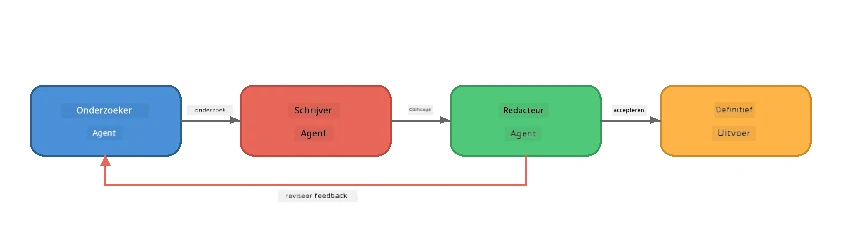
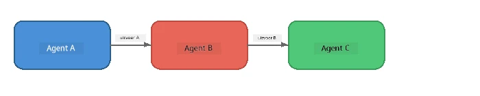
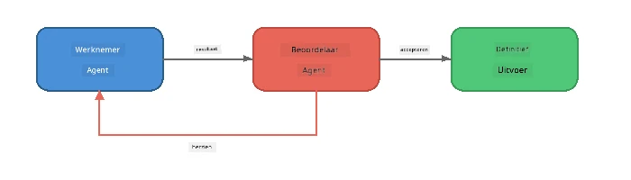
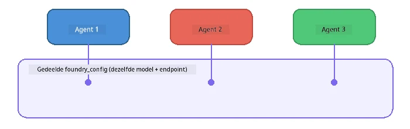

# Deel 6: Multi-Agent Workflows

> **Doel:** Combineer meerdere gespecialiseerde agents in gecoördineerde pipelines die complexe taken verdelen over samenwerkende agents - allemaal lokaal uitgevoerd met Foundry Local.

## Waarom Multi-Agent?

Een enkele agent kan veel taken aan, maar complexe workflows profiteren van **Specialisatie**. In plaats van dat één agent tegelijk onderzoek doet, schrijft en redigeert, verdeel je het werk in gerichte rollen:



| Patroon | Beschrijving |
|---------|--------------|
| **Sequentieel** | Output van Agent A voedt Agent B → Agent C |
| **Feedbackloop** | Een beoordelende agent kan werk terugsturen voor herziening |
| **Gedeelde context** | Alle agents gebruiken hetzelfde model/endpoint, maar met verschillende instructies |
| **Getypeerde output** | Agents produceren gestructureerde resultaten (JSON) voor betrouwbare overdracht |

---

## Oefeningen

### Oefening 1 - Draai de Multi-Agent Pipeline

De workshop bevat een complete Researcher → Writer → Editor workflow.

<details>
<summary><strong>🐍 Python</strong></summary>

**Setup:**
```bash
cd python
python -m venv venv

# Windows (PowerShell):
venv\Scripts\Activate.ps1
# macOS:
source venv/bin/activate

pip install -r requirements.txt
```

**Uitvoeren:**
```bash
python foundry-local-multi-agent.py
```

**Wat er gebeurt:**
1. **Researcher** ontvangt een onderwerp en geeft feitelijke opsomming terug
2. **Writer** gebruikt het onderzoek om een blogpost te schrijven (3-4 alinea’s)
3. **Editor** beoordeelt het artikel op kwaliteit en geeft ACCEPT of REVISE terug

</details>

<details>
<summary><strong>📦 JavaScript</strong></summary>

**Setup:**
```bash
cd javascript
npm install
```

**Uitvoeren:**
```bash
node foundry-local-multi-agent.mjs
```

**Zelfde driefasenpipeline** - Researcher → Writer → Editor.

</details>

<details>
<summary><strong>💜 C#</strong></summary>

**Setup:**
```bash
cd csharp
dotnet restore
```

**Uitvoeren:**
```bash
dotnet run multi
```

**Zelfde driefasenpipeline** - Researcher → Writer → Editor.

</details>

---

### Oefening 2 - Anatomie van de Pipeline

Bekijk hoe agents zijn gedefinieerd en verbonden:

**1. Gedeelde modelclient**

Alle agents delen hetzelfde Foundry Local model:

```python
# Python - FoundryLocalClient handelt alles af
from agent_framework_foundry_local import FoundryLocalClient

client = FoundryLocalClient(model_id="phi-3.5-mini")
```

```javascript
// JavaScript - OpenAI SDK gericht op Foundry Local
const client = new OpenAI({
  baseURL: manager.urls[0] + "/v1",
  apiKey: "foundry-local",
});
```

```csharp
// C# - OpenAIClient pointed at Foundry Local
var key = new ApiKeyCredential("foundry-local");
var client = new OpenAIClient(key, new OpenAIClientOptions
{
    Endpoint = new Uri(manager.Urls[0] + "/v1")
});
var chatClient = client.GetChatClient(model.Id);
```

**2. gespecialiseerde instructies**

Elke agent heeft een eigen persona:

| Agent | Instructies (samenvatting) |
|-------|----------------------------|
| Researcher | "Bied kernfeiten, statistieken, en achtergrondinformatie. Orden als opsomming." |
| Writer | "Schrijf een boeiende blogpost (3-4 alinea’s) op basis van de onderzoeksnotities. Verzin geen feiten." |
| Editor | "Beoordeel op helderheid, grammatica, en feitelijke consistentie. Beslissing: ACCEPT of REVISE." |

**3. Datastromen tussen agents**

```python
# Stap 1 - output van onderzoeker wordt input voor schrijver
research_result = await researcher.run(f"Research: {topic}")

# Stap 2 - output van schrijver wordt input voor redacteur
writer_result = await writer.run(f"Write using:\n{research_result}")

# Stap 3 - redacteur beoordeelt zowel onderzoek als artikel
editor_result = await editor.run(
    f"Research:\n{research_result}\n\nArticle:\n{writer_result}"
)
```

```csharp
// C# - same pattern, async calls with AIAgent
var researchNotes = await researcher.RunAsync(
    $"Research the following topic and provide key facts:\n{topic}");

var draft = await writer.RunAsync(
    $"Write a blog post based on these research notes:\n\n{researchNotes}");

var verdict = await editor.RunAsync(
    $"Review this article for quality and accuracy.\n\n" +
    $"Research notes:\n{researchNotes}\n\n" +
    $"Article:\n{draft}");
```

> **Belangrijk inzicht:** Elke agent ontvangt de cumulatieve context van eerdere agents. De editor ziet zowel het originele onderzoek als de concepttekst - zo kan hij feitelijke consistentie controleren.

---

### Oefening 3 - Voeg een Vierde Agent toe

Breid de pipeline uit met een nieuwe agent. Kies een van:

| Agent | Doel | Instructies |
|-------|------|-------------|
| **Fact-Checker** | Verifieert beweringen in het artikel | `"Je controleert feitelijke beweringen. Geef voor elke bewering aan of deze wordt ondersteund door de onderzoeksnotities. Retourneer JSON met geverifieerde/niet-geverifieerde items."` |
| **Headline Writer** | Maakt pakkende titels | `"Genereer 5 titelopties voor het artikel. Varieer in stijl: informatief, clickbait, vraag, lijstje, emotioneel."` |
| **Social Media** | Maakt promotieposts | `"Maak 3 social media berichten ter promotie van dit artikel: één voor Twitter (280 tekens), één voor LinkedIn (professionele toon), één voor Instagram (informeel met emoji suggesties)."` |

<details>
<summary><strong>🐍 Python - toevoeging Headline Writer</strong></summary>

```python
headline_agent = client.as_agent(
    name="HeadlineWriter",
    instructions=(
        "You are a headline specialist. Given an article, generate exactly "
        "5 headline options. Vary the style: informative, question-based, "
        "listicle, emotional, and provocative. Return them as a numbered list."
    ),
)

# Nadat de editor accepteert, genereer titels
headline_result = await headline_agent.run(
    f"Generate headlines for this article:\n\n{writer_result}"
)
print(f"\n--- Headlines ---\n{headline_result}")
```

</details>

<details>
<summary><strong>📦 JavaScript - toevoeging Headline Writer</strong></summary>

```javascript
const headlineAgent = new ChatAgent({
  client,
  modelId: modelInfo.id,
  instructions:
    "You are a headline specialist. Given an article, generate exactly " +
    "5 headline options. Vary the style: informative, question-based, " +
    "listicle, emotional, and provocative. Return them as a numbered list.",
  name: "HeadlineWriter",
});

const headlineResult = await headlineAgent.run(
  `Generate headlines for this article:\n\n${writerResult.text}`
);
console.log(`\n--- Headlines ---\n${headlineResult.text}`);
```

</details>

<details>
<summary><strong>💜 C# - toevoeging Headline Writer</strong></summary>

```csharp
AIAgent headlineAgent = chatClient.AsAIAgent(
    name: "HeadlineWriter",
    instructions:
        "You are a headline specialist. Given an article, generate exactly " +
        "5 headline options. Vary the style: informative, question-based, " +
        "listicle, emotional, and provocative. Return them as a numbered list."
);

// After the editor accepts, generate headlines
var headlines = await headlineAgent.RunAsync(
    $"Generate headlines for this article:\n\n{draft}");
Console.WriteLine($"\n--- Headlines ---\n{headlines}");
```

</details>

---

### Oefening 4 - Ontwerp Je Eigen Workflow

Ontwerp een multi-agent pipeline voor een ander domein. Hier zijn wat ideeën:

| Domein | Agents | Stroom |
|--------|--------|--------|
| **Code Review** | Analyser → Reviewer → Summariser | Analyseer codestructuur → beoordeel op issues → maak samenvattend rapport |
| **Klantenservice** | Classifier → Responder → QA | Classificeer ticket → stel antwoord op → controleer kwaliteit |
| **Onderwijs** | Quiz Maker → Student Simulator → Grader | Genereer quiz → simuleer antwoorden → geef cijfer en uitleg |
| **Data Analyse** | Interpreter → Analist → Reporter | Interpreteer dataverzoek → analyseer patronen → schrijf rapport |

**Stappen:**
1. Definieer 3+ agents met verschillende `instructies`
2. Bepaal de datastroom - wat ontvangt en produceert elke agent?
3. Implementeer de pipeline met de patronen uit Oefeningen 1-3
4. Voeg een feedbackloop toe als een agent werk van een ander moet evalueren

---

## Orkestratiepatronen

Hier zijn orkestratiepatronen die gelden voor elk multi-agent systeem (uitgebreid behandeld in [Deel 7](part7-zava-creative-writer.md)):

### Sequentiële Pipeline



Elke agent verwerkt de output van de vorige. Simpel en voorspelbaar.

### Feedbackloop



Een beoordelende agent kan eerdere stappen opnieuw laten draaien. De Zava Writer gebruikt dit: de editor kan feedback geven aan de researcher en writer.

### Gedeelde Context



Alle agents delen één `foundry_config` zodat ze hetzelfde model en endpoint gebruiken.

---

## Belangrijkste Leerpunten

| Concept | Wat je hebt geleerd |
|---------|--------------------|
| Agent Specialisatie | Elke agent doet één ding goed met gerichte instructies |
| Data overdracht | Output van de ene agent wordt input voor de volgende |
| Feedbackloops | Een beoordelaar kan retries triggeren voor betere kwaliteit |
| Gestructureerde output | JSON-antwoorden maken betrouwbare communicatie mogelijk |
| Orkestratie | Een coördinator beheert de pipelinereeks en foutafhandeling |
| Productiepatronen | Toegepast in [Deel 7: Zava Creative Writer](part7-zava-creative-writer.md) |

---

## Volgende Stappen

Ga verder naar [Deel 7: Zava Creative Writer - Capstone Applicatie](part7-zava-creative-writer.md) om een productieachtige multi-agent app met 4 gespecialiseerde agents, streaming output, productzoekfunctie, en feedbackloops te verkennen - beschikbaar in Python, JavaScript, en C#.