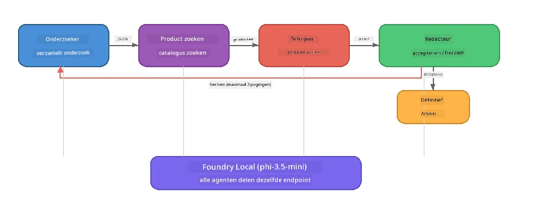

# Deel 7: Zava Creative Writer - Capstone Toepassing

> **Doel:** Verken een productie-achtige multi-agent toepassing waarin vier gespecialiseerde agenten samenwerken om artikelen van magazinekwaliteit te produceren voor Zava Retail DIY - volledig draaiend op jouw apparaat met Foundry Local.

Dit is het **capstone-lab** van de workshop. Het brengt alles samen wat je hebt geleerd - SDK-integratie (Deel 3), ophalen uit lokale data (Deel 4), agent-persona’s (Deel 5) en multi-agent orkestratie (Deel 6) - in een complete toepassing beschikbaar in **Python**, **JavaScript** en **C#**.

---

## Wat Je Zal Verkennen

| Concept | Waar in de Zava Writer |
|---------|------------------------|
| 4-stappen model laden | Gedeelde config module start Foundry Local op |
| RAG-stijl ophalen | Product agent zoekt in een lokale catalogus |
| Agent specialisatie | 4 agenten met verschillende systeem prompts |
| Streaming output | Schrijver levert tokens in real-time |
| Gestructureerde overdrachten | Researcher → JSON, Editor → JSON besluit |
| Feedback loops | Editor kan heruitvoering triggeren (max 2 pogingen) |

---

## Architectuur

De Zava Creative Writer gebruikt een **sequentiële pijplijn met evaluator-gestuurde feedback**. Alle drie taalimplementaties volgen dezelfde architectuur:



### De Vier Agenten

| Agent | Input | Output | Doel |
|-------|-------|--------|-------|
| **Researcher** | Onderwerp + optionele feedback | `{"web": [{url, naam, beschrijving}, ...]}` | Verzamelt achtergrondonderzoek via LLM |
| **Product Search** | Product context string | Lijst met overeenkomende producten | LLM-gegeneerde queries + zoekwoorden zoeken in lokale catalogus |
| **Writer** | Onderzoek + producten + opdracht + feedback | Gestreamde artikeltekst (gesplitst bij `---`) | Schetst een artikel van magazinekwaliteit in realtime |
| **Editor** | Artikel + zelf-feedback van schrijver | `{"decision": "accept/revise", "editorFeedback": "...", "researchFeedback": "..."}` | Beoordeelt kwaliteit, triggert retry indien nodig |

### Pijplijn Stroom

1. **Researcher** ontvangt het onderwerp en produceert gestructureerde onderzoeksnotities (JSON)
2. **Product Search** doorzoekt de lokale productcatalogus met LLM-gegenereerde zoekwoorden
3. **Writer** combineert onderzoek + producten + opdracht tot een streamerend artikel, voegt zelf-feedback toe na een `---` scheiding
4. **Editor** beoordeelt het artikel en geeft een JSON oordeel terug:
   - `"accept"` → pijplijn voltooit
   - `"revise"` → feedback gaat terug naar Researcher en Writer (max 2 pogingen)

---

## Vereisten

- Voltooi [Deel 6: Multi-Agent Workflows](part6-multi-agent-workflows.md)
- Foundry Local CLI geïnstalleerd en `phi-3.5-mini` model gedownload

---

## Oefeningen

### Oefening 1 - Start de Zava Creative Writer

Kies je taal en draai de applicatie:

<details>
<summary><strong>🐍 Python - FastAPI Web Service</strong></summary>

De Python versie draait als een **webservice** met een REST API, ter demonstratie van hoe je een productie-backend bouwt.

**Installatie:**
```bash
cd zava-creative-writer-local/src/api
python -m venv venv

# Windows (PowerShell):
venv\Scripts\Activate.ps1
# macOS:
source venv/bin/activate

pip install -r requirements.txt
```

**Start:**
```bash
uvicorn main:app --reload
```

**Test het:**
```bash
curl -X POST http://localhost:8000/api/article \
  -H "Content-Type: application/json" \
  -d '{
    "research": "DIY home improvement trends",
    "products": "power tools and paints",
    "assignment": "Write an article about weekend renovation projects for DIY enthusiasts"
  }'
```

De respons wordt gestreamd terug als newline-gealfabetiseerde JSON-berichten die de voortgang van elke agent tonen.

</details>

<details>
<summary><strong>📦 JavaScript - Node.js CLI</strong></summary>

De JavaScript versie draait als een **CLI applicatie**, print agent voortgang en het artikel direct naar de console.

**Installatie:**
```bash
cd zava-creative-writer-local/src/javascript
npm install
```

**Start:**
```bash
node main.mjs
```

Je zal zien:
1. Foundry Local model laden (met voortgangsbalk bij download)
2. Elke agent voert sequentieel uit met statusmeldingen
3. Het artikel wordt in realtime naar de console gestreamd
4. De acceptatie/herziening beslissing van de editor

</details>

<details>
<summary><strong>💜 C# - .NET Console App</strong></summary>

De C# versie draait als een **.NET console-applicatie** met dezelfde pijplijn en streaming output.

**Installatie:**
```bash
cd zava-creative-writer-local/src/csharp
dotnet restore
```

**Start:**
```bash
dotnet run
```

Zelfde uitvoerpatroon als JavaScript versie - agent statusberichten, gestreamd artikel en editor verdict.

</details>

---

### Oefening 2 - Bestudeer de Code Structuur

Elke taalimplementatie heeft dezelfde logische componenten. Vergelijk de structuren:

**Python** (`src/api/`):
| Bestand | Doel |
|---------|------|
| `foundry_config.py` | Gedeelde Foundry Local manager, model en client (4-stappen init) |
| `orchestrator.py` | Pijplijn coördinatie met feedback loop |
| `main.py` | FastAPI endpoints (`POST /api/article`) |
| `agents/researcher/researcher.py` | LLM-gebaseerd onderzoek met JSON-output |
| `agents/product/product.py` | LLM-gegenereerde queries + zoekwoorden zoeken |
| `agents/writer/writer.py` | Streaming artikel generatie |
| `agents/editor/editor.py` | JSON-gebaseerde acceptatie/herziening beslissing |

**JavaScript** (`src/javascript/`):
| Bestand | Doel |
|---------|------|
| `foundryConfig.mjs` | Gedeelde Foundry Local configuratie (4-stappen init met voortgangsbalk) |
| `main.mjs` | Orchestrator + CLI entry point |
| `researcher.mjs` | LLM-gebaseerde onderzoeksagent |
| `product.mjs` | LLM query generatie + zoekwoorden zoeken |
| `writer.mjs` | Streaming artikel generatie (async generator) |
| `editor.mjs` | JSON acceptatie/herziening beslissing |
| `products.mjs` | Productcatalogus data |

**C#** (`src/csharp/`):
| Bestand | Doel |
|---------|------|
| `Program.cs` | Complete pijplijn: model laden, agenten, orchestrator, feedback loop |
| `ZavaCreativeWriter.csproj` | .NET 9 project met Foundry Local + OpenAI pakketten |

> **Ontwerpopmerking:** Python scheidt elke agent in eigen bestand/directory (goed voor grotere teams). JavaScript gebruikt één module per agent (goed voor middelgrote projecten). C# houdt alles in één bestand met lokale functies (goed voor zelf-contained voorbeelden). In productie kies je de patroon die past bij de conventies van je team.

---

### Oefening 3 - Volg de Gedeelde Configuratie

Elke agent in de pijplijn deelt een enkele Foundry Local model client. Bestudeer hoe dit in elke taal is opgezet:

<details>
<summary><strong>🐍 Python - foundry_config.py</strong></summary>

```python
from foundry_local import FoundryLocalManager

MODEL_ALIAS = "phi-3.5-mini"

# Stap 1: Maak de manager aan en start de Foundry Local-service
manager = FoundryLocalManager()
manager.start_service()

# Stap 2: Controleer of het model al is gedownload
cached = manager.list_cached_models()
catalog_info = manager.get_model_info(MODEL_ALIAS)
is_cached = any(m.id == catalog_info.id for m in cached) if catalog_info else False

if not is_cached:
    manager.download_model(MODEL_ALIAS)

# Stap 3: Laad het model in het geheugen
manager.load_model(MODEL_ALIAS)
model_id = manager.get_model_info(MODEL_ALIAS).id

# Gedeelde OpenAI-client
client = openai.OpenAI(base_url=manager.endpoint, api_key=manager.api_key)
```

Alle agenten importeren `from foundry_config import client, model_id`.

</details>

<details>
<summary><strong>📦 JavaScript - foundryConfig.mjs</strong></summary>

```javascript
import { FoundryLocalManager } from "foundry-local-sdk";
import { OpenAI } from "openai";

FoundryLocalManager.create({ appName: "ZavaCreativeWriter" });
const manager = FoundryLocalManager.instance;
await manager.startWebService();

// Controleer cache → downloaden → laden (nieuw SDK-patroon)
const catalog = manager.catalog;
const model = await catalog.getModel(MODEL_ALIAS);
if (!model.isCached) {
  console.log(`Downloading model: ${MODEL_ALIAS}...`);
  await model.download();
}
await model.load();

const client = new OpenAI({ baseURL: manager.urls[0] + "/v1", apiKey: "foundry-local" });
const modelId = model.id;
export { client, modelId };
```

Alle agenten importeren `{ client, modelId } from "./foundryConfig.mjs"`.

</details>

<details>
<summary><strong>💜 C# - bovenin Program.cs</strong></summary>

```csharp
await FoundryLocalManager.CreateAsync(
    new Configuration
    {
        AppName = "ZavaCreativeWriter",
        Web = new Configuration.WebService { Urls = "http://127.0.0.1:0" }
    }, NullLogger.Instance, default);
var manager = FoundryLocalManager.Instance;
await manager.StartWebServiceAsync(default);

var catalog = await manager.GetCatalogAsync(default);
var catalogModel = await catalog.GetModelAsync(alias, default);
var isCached = await catalogModel.IsCachedAsync(default);
if (!isCached)
    await catalogModel.DownloadAsync(null, default);

await catalogModel.LoadAsync(default);
var key = new ApiKeyCredential("foundry-local");
var chatClient = new OpenAIClient(key, new OpenAIClientOptions
{
    Endpoint = new Uri(manager.Urls[0] + "/v1")
}).GetChatClient(catalogModel.Id);
```

De `chatClient` wordt daarna doorgegeven aan alle agent-functies in hetzelfde bestand.

</details>

> **Belangrijk patroon:** Het model laadpatroon (start service → check cache → download → laden) zorgt dat de gebruiker duidelijke voortgang ziet en het model maar één keer wordt gedownload. Dit is een best practice voor elke Foundry Local applicatie.

---

### Oefening 4 - Begrijp de Feedback Loop

De feedback loop is wat deze pijplijn "slim" maakt - de Editor kan werk terugsturen voor revisie. Volg de logica:

```
Orchestrator:
  1. researcher.research(topic, "No Feedback")    ← first pass
  2. product.findProducts(productContext)
  3. writer.write(research, products, assignment)  ← streams article
  4. Split article at "---" → article + writerFeedback
  5. editor.edit(article, writerFeedback)

  WHILE editor says "revise" AND retryCount < 2:
    6. researcher.research(topic, editor.researchFeedback)  ← refined
    7. writer.write(research, products, editor.editorFeedback)
    8. editor.edit(newArticle, newWriterFeedback)
    9. retryCount++
```

**Vragen om te overwegen:**
- Waarom is de retry limiet ingesteld op 2? Wat gebeurt er als je deze verhoogt?
- Waarom krijgt de researcher `researchFeedback` maar de schrijver `editorFeedback`?
- Wat zou er gebeuren als de editor altijd "revise" zegt?

---

### Oefening 5 - Pas een Agent Aan

Probeer het gedrag van één agent te veranderen en observeer hoe dit de pijplijn beïnvloedt:

| Wijziging | Wat te veranderen |
|-----------|-------------------|
| **Strengere editor** | Verander de systeem prompt van de editor om altijd minstens één revisie te vragen |
| **Langere artikelen** | Verander de prompt van de schrijver van "800-1000 woorden" naar "1500-2000 woorden" |
| **Andere producten** | Voeg producten toe of wijzig producten in de productcatalogus |
| **Nieuw onderzoeks onderwerp** | Verander de standaard `researchContext` naar een ander onderwerp |
| **Alleen JSON researcher** | Laat de researcher 10 items teruggeven in plaats van 3-5 |

> **Tip:** Omdat alle drie talen dezelfde architectuur implementeren, kun je dezelfde wijziging maken in de taal waarin je het meest vertrouwd bent.

---

### Oefening 6 - Voeg een Vijfde Agent toe

Breid de pijplijn uit met een nieuwe agent. Enkele ideeën:

| Agent | Waar in de pijplijn | Doel |
|-------|---------------------|-------|
| **Fact-Checker** | Na Writer, voor Editor | Controleer claims tegen de onderzoeksdata |
| **SEO Optimizer** | Na Editor accepteert | Voeg meta beschrijving, trefwoorden, slug toe |
| **Illustrator** | Na Editor accepteert | Genereer afbeeldingsprompten voor het artikel |
| **Vertaler** | Na Editor accepteert | Vertaal het artikel naar een andere taal |

**Stappen:**
1. Schrijf de systeem prompt voor de agent
2. Maak de agent functie (volgend het bestaande patroon in jouw taal)
3. Plaats deze op de juiste plek in de orchestrator
4. Update output/logging om de bijdrage van de nieuwe agent te tonen

---

## Hoe Foundry Local en het Agent Framework Samenwerken

Deze applicatie demonstreert het aanbevolen patroon voor het bouwen van multi-agent systemen met Foundry Local:

| Laag | Component | Rol |
|-------|-----------|-----|
| **Runtime** | Foundry Local | Downloadt, beheert en serveert het model lokaal |
| **Client** | OpenAI SDK | Stuurt chat completion calls naar de lokale endpoint |
| **Agent** | Systeem prompt + chat call | gespecialiseerd gedrag via gerichte instructies |
| **Orchestrator** | Pijplijn coördinator | Beheert dataflow, sequencing en feedback loops |
| **Framework** | Microsoft Agent Framework | Biedt `ChatAgent` abstractie en patronen |

De kerninzicht: **Foundry Local vervangt de cloud backend, niet de applicatie architectuur.** Dezelfde agent patronen, orkestratiestrategieën en gestructureerde overdrachten die werken met cloud-gehoste modellen werken identiek met lokale modellen — je wijst alleen de client naar de lokale endpoint in plaats van een Azure endpoint.

---

## Belangrijkste Leerpunten

| Concept | Wat Je Leerde |
|---------|---------------|
| Productie architectuur | Hoe je een multi-agent app structureert met gedeelde config en losse agenten |
| 4-stappen model laden | Best practice voor Foundry Local initialisatie met voor de gebruiker zichtbare voortgang |
| Agent specialisatie | Elke van de 4 agenten heeft gerichte instructies en specifieke output vormen |
| Streaming generatie | Schrijver levert tokens in realtime, voor responsieve UI's |
| Feedback loops | Editor-gestuurde retry verbetert kwaliteit zonder menselijk ingrijpen |
| Taalonafhankelijke patronen | Zelfde architectuur werkt in Python, JavaScript en C# |
| Lokaal = productie klaar | Foundry Local serveert dezelfde OpenAI-compatibele API als in cloud deployments |

---

## Volgende Stap

Ga verder naar [Deel 8: Evaluation-Led Development](part8-evaluation-led-development.md) om een systematisch evaluatiekader te bouwen voor je agenten, met gouden datasets, regelgebaseerde controles en LLM-als-rechter scores.