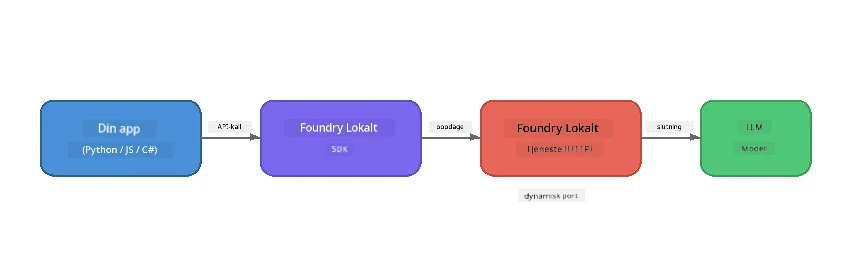

# Del 1: Komme i gang med Foundry Local


## Hva er Foundry Local?

[Foundry Local](https://foundrylocal.ai) lar deg kjøre open-source AI-språkmodeller **direkte på din egen datamaskin** - ingen internettforbindelse nødvendig, ingen sky-kostnader, og fullstendig dataprivacy. Det:

- **Laster ned og kjører modeller lokalt** med automatisk maskinvareoptimalisering (GPU, CPU eller NPU)
- **Tilbyr en OpenAI-kompatibel API** slik at du kan bruke kjente SDK-er og verktøy
- **Krever ingen Azure-abonnement** eller påmelding - bare installer og begynn å bygge

Tenk på det som å ha din egen private AI som kjører fullt ut på din maskin.

## Læringsmål

På slutten av denne laben vil du kunne:

- Installere Foundry Local CLI på ditt operativsystem
- Forstå hva modelaliaser er og hvordan de fungerer
- Laste ned og kjøre din første lokale AI-modell
- Sende en chatmelding til en lokal modell fra kommandolinjen
- Forstå forskjellen mellom lokale og skybaserte AI-modeller

---

## Forutsetninger

### Systemkrav

| Krav | Minimum | Anbefalt |
|-------------|---------|-------------|
| **RAM** | 8 GB | 16 GB |
| **Diskplass** | 5 GB (for modeller) | 10 GB |
| **CPU** | 4 kjerner | 8+ kjerner |
| **GPU** | Valgfritt | NVIDIA med CUDA 11.8+ |
| **OS** | Windows 10/11 (x64/ARM), Windows Server 2025, macOS 13+ | - |

> **Merk:** Foundry Local velger automatisk den beste modellvarianten for maskinvaren din. Har du en NVIDIA GPU, bruker den CUDA-akselerasjon. Har du en Qualcomm NPU, bruker den den. Ellers faller den tilbake til en optimalisert CPU-variant.

### Installer Foundry Local CLI

**Windows** (PowerShell):
```powershell
winget install Microsoft.FoundryLocal
```

**macOS** (Homebrew):
```bash
brew tap microsoft/foundrylocal
brew install foundrylocal
```

> **Merk:** Foundry Local støtter foreløpig kun Windows og macOS. Linux støttes ikke for øyeblikket.

Verifiser installasjonen:
```bash
foundry --version
```

---

## Laboratorieoppgaver

### Oppgave 1: Utforsk tilgjengelige modeller

Foundry Local inkluderer en katalog med forhåndsoptimaliserte open-source modeller. List dem opp:

```bash
foundry model list
```

Du vil se modeller som:
- `phi-3.5-mini` - Microsofts 3.8B parameter modell (rask, god kvalitet)
- `phi-4-mini` - Nyere, mer kapabel Phi-modell
- `phi-4-mini-reasoning` - Phi-modell med chain-of-thought resonnement (`<think>`-tagger)
- `phi-4` - Microsofts største Phi-modell (10.4 GB)
- `qwen2.5-0.5b` - Veldig liten og rask (god for lavressursenheter)
- `qwen2.5-7b` - Sterk allsidig modell med støtte for tool-calling
- `qwen2.5-coder-7b` - Optimalisert for kodegenerering
- `deepseek-r1-7b` - Sterk resonnementmodell
- `gpt-oss-20b` - Stor open-source modell (MIT-lisens, 12.5 GB)
- `whisper-base` - Tale-til-tekst transkripsjon (383 MB)
- `whisper-large-v3-turbo` - Høy-nøyaktig transkripsjon (9 GB)

> **Hva er et modelalias?** Alias som `phi-3.5-mini` er snarveier. Når du bruker et alias, laster Foundry Local ned den beste varianten for din spesifikke maskinvare automatisk (CUDA for NVIDIA GPUer, CPU-optimalisert ellers). Du trenger aldri å bekymre deg for å velge riktig variant.

### Oppgave 2: Kjør din første modell

Last ned og begynn å chatte med en modell interaktivt:

```bash
foundry model run phi-3.5-mini
```

Første gang du kjører dette, vil Foundry Local:
1. Oppdage maskinvaren din
2. Laste ned optimal modellvariant (dette kan ta noen minutter)
3. Laste modellen inn i minnet
4. Starte en interaktiv chattesesjon

Prøv å stille den noen spørsmål:
```
You: What is the golden ratio?
You: Can you explain it as if I were 10 years old?
You: Write a haiku about mathematics
```

Skriv `exit` eller trykk `Ctrl+C` for å avslutte.

### Oppgave 3: Forhåndslast ned en modell

Hvis du vil laste ned en modell uten å starte en chat:

```bash
foundry model download phi-3.5-mini
```

Sjekk hvilke modeller som allerede er lastet ned på maskinen din:

```bash
foundry cache list
```

### Oppgave 4: Forstå arkitekturen

Foundry Local kjører som en **lokal HTTP-tjeneste** som eksponerer en OpenAI-kompatibel REST API. Dette betyr:

1. Tjenesten starter på en **dynamisk port** (en annen port hver gang)
2. Du bruker SDK-en for å finne den faktiske endepunkt-URLen
3. Du kan bruke **hvilken som helst** OpenAI-kompatibel klientbibliotek for å kommunisere med den



> **Viktig:** Foundry Local tildeler en **dynamisk port** hver gang den startes. Hardkod aldri et portnummer som `localhost:5272`. Bruk alltid SDK-en for å finne den gjeldende URLen (f.eks. `manager.endpoint` i Python eller `manager.urls[0]` i JavaScript).

---

## Viktige punkter

| Konsept | Hva du lærte |
|---------|--------------|
| On-device AI | Foundry Local kjører modeller helt på din enhet uten sky, API-nøkler eller kostnader |
| Modelaliaser | Alias som `phi-3.5-mini` velger automatisk den beste varianten for maskinvaren din |
| Dynamiske porter | Tjenesten kjører på en dynamisk port; bruk alltid SDK-en for å finne endepunktet |
| CLI og SDK | Du kan interagere med modeller via CLI (`foundry model run`) eller programmert via SDK |

---

## Neste steg

Fortsett til [Del 2: Foundry Local SDK Deep Dive](part2-foundry-local-sdk.md) for å mestre SDK API-en for å administrere modeller, tjenester og caching programmatisk.