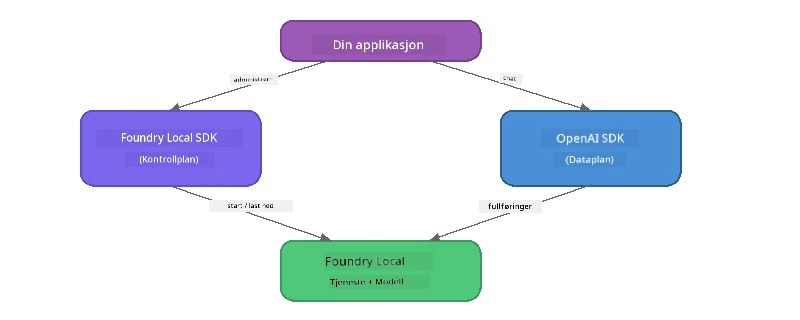

# Del 3: Bruke Foundry Local SDK med OpenAI

## Oversikt

I Del 1 brukte du Foundry Local CLI for å kjøre modeller interaktivt. I Del 2 utforsket du hele SDK API-overflaten. Nå skal du lære å **integrere Foundry Local i dine applikasjoner** ved hjelp av SDK og OpenAI-kompatibel API.

Foundry Local tilbyr SDK-er for tre språk. Velg det du er mest komfortabel med – konseptene er identiske for alle tre.

## Læringsmål

Innen slutten av dette laboratoriet skal du kunne:

- Installere Foundry Local SDK for ditt språk (Python, JavaScript, eller C#)
- Initialisere `FoundryLocalManager` for å starte tjenesten, sjekke cachen, laste ned og laste en modell
- Koble til den lokale modellen ved hjelp av OpenAI SDK
- Sende chat-kompletteringer og håndtere strømmede responser
- Forstå den dynamiske port-arkitekturen

---

## Forutsetninger

Fullfør først [Del 1: Komme i gang med Foundry Local](part1-getting-started.md) og [Del 2: Foundry Local SDK Deep Dive](part2-foundry-local-sdk.md).

Installer **en** av følgende språk-runtime:
- **Python 3.9+** - [python.org/downloads](https://www.python.org/downloads/)
- **Node.js 18+** - [nodejs.org](https://nodejs.org/)
- **.NET 9.0+** - [dot.net/download](https://dotnet.microsoft.com/download)

---

## Konsept: Hvordan SDK-en fungerer

Foundry Local SDK håndterer **kontrollplanet** (starter tjenesten, laster ned modeller), mens OpenAI SDK håndterer **dataplanet** (sender prompts, mottar kompletteringer).



---

## Labøvelser

### Øvelse 1: Sett opp miljøet ditt

<details>
<summary><b>🐍 Python</b></summary>

```bash
cd python
python -m venv venv

# Aktiver det virtuelle miljøet:
# Windows (PowerShell):
venv\Scripts\Activate.ps1
# Windows (Kommandoprompt):
venv\Scripts\activate.bat
# macOS:
source venv/bin/activate

pip install -r requirements.txt
```

`requirements.txt` installerer:
- `foundry-local-sdk` - Foundry Local SDK (importert som `foundry_local`)
- `openai` - OpenAI Python SDK
- `agent-framework` - Microsoft Agent Framework (brukes i senere deler)

</details>

<details>
<summary><b>📘 JavaScript</b></summary>

```bash
cd javascript
npm install
```

`package.json` installerer:
- `foundry-local-sdk` - Foundry Local SDK
- `openai` - OpenAI Node.js SDK

</details>

<details>
<summary><b>💜 C#</b></summary>

```bash
cd csharp
dotnet restore
dotnet build
```

`csharp.csproj` bruker:
- `Microsoft.AI.Foundry.Local` - Foundry Local SDK (NuGet)
- `OpenAI` - OpenAI C# SDK (NuGet)

> **Prosjektstruktur:** C#-prosjektet bruker en kommandolinje-ruter i `Program.cs` som distribuerer til separate eksempel-filer. Kjør `dotnet run chat` (eller bare `dotnet run`) for denne delen. Andre deler bruker `dotnet run rag`, `dotnet run agent` og `dotnet run multi`.

</details>

---

### Øvelse 2: Grunnleggende chatkomplettering

Åpne det grunnleggende chateksemplet for ditt språk og undersøk koden. Hvert skript følger samme tre-trinns mønster:

1. **Start tjenesten** - `FoundryLocalManager` starter Foundry Local-runtime
2. **Last ned og last modellen** - sjekk cache, last ned om nødvendig, så last inn i minnet
3. **Opprett en OpenAI-klient** - koble til lokal endepunkt og send en strømmet chatkomplettering

<details>
<summary><b>🐍 Python - <code>python/foundry-local.py</code></b></summary>

```python
import sys
import openai
from foundry_local import FoundryLocalManager

alias = "phi-3.5-mini"

# Trinn 1: Opprett en FoundryLocalManager og start tjenesten
print("Starting Foundry Local service...")
manager = FoundryLocalManager()
manager.start_service()

# Trinn 2: Sjekk om modellen allerede er lastet ned
cached = manager.list_cached_models()
catalog_info = manager.get_model_info(alias)
is_cached = any(m.id == catalog_info.id for m in cached) if catalog_info else False

if is_cached:
    print(f"Model already downloaded: {alias}")
else:
    print(f"Downloading model: {alias} (this may take several minutes)...")
    manager.download_model(alias)
    print(f"Download complete: {alias}")

# Trinn 3: Last modellen inn i minnet
print(f"Loading model: {alias}...")
manager.load_model(alias)

# Opprett en OpenAI-klient som peker til den LOKALE Foundry-tjenesten
client = openai.OpenAI(
    base_url=manager.endpoint,   # Dynamisk port - aldri hardkodet!
    api_key=manager.api_key
)

# Generer en strømmende chat-fullføring
stream = client.chat.completions.create(
    model=manager.get_model_info(alias).id,
    messages=[{"role": "user", "content": "What is the golden ratio?"}],
    stream=True,
)

for chunk in stream:
    if chunk.choices[0].delta.content is not None:
        print(chunk.choices[0].delta.content, end="", flush=True)
print()
```

**Kjør den:**
```bash
python foundry-local.py
```

</details>

<details>
<summary><b>📘 JavaScript - <code>javascript/foundry-local.mjs</code></b></summary>

```javascript
import { OpenAI } from "openai";
import { FoundryLocalManager } from "foundry-local-sdk";

const alias = "phi-3.5-mini";

// Trinn 1: Start Foundry Local-tjenesten
console.log("Starting Foundry Local service...");
FoundryLocalManager.create({ appName: "FoundryLocalWorkshop" });
const manager = FoundryLocalManager.instance;
await manager.startWebService();

// Trinn 2: Sjekk om modellen allerede er lastet ned
const catalog = manager.catalog;
const model = await catalog.getModel(alias);

if (model.isCached) {
  console.log(`Model already downloaded: ${alias}`);
} else {
  console.log(`Downloading model: ${alias} (this may take several minutes)...`);
  await model.download();
  console.log(`Download complete: ${alias}`);
}

// Trinn 3: Last modellen inn i minnet
console.log(`Loading model: ${alias}...`);
await model.load();
console.log(`Model loaded: ${model.id}`);

// Lag en OpenAI-klient som peker til den LOKALE Foundry-tjenesten
const client = new OpenAI({
  baseURL: manager.urls[0] + "/v1",   // Dynamisk port - aldri hardkodet!
  apiKey: "foundry-local",
});

// Generer en streaming chat fullføring
const stream = await client.chat.completions.create({
  model: model.id,
  messages: [{ role: "user", content: "What is the golden ratio?" }],
  stream: true,
});

for await (const chunk of stream) {
  if (chunk.choices[0]?.delta?.content) {
    process.stdout.write(chunk.choices[0].delta.content);
  }
}
console.log();
```

**Kjør den:**
```bash
node foundry-local.mjs
```

</details>

<details>
<summary><b>💜 C# - <code>csharp/BasicChat.cs</code></b></summary>

```csharp
using Microsoft.AI.Foundry.Local;
using Microsoft.Extensions.Logging.Abstractions;
using OpenAI;
using OpenAI.Chat;
using System.ClientModel;

var alias = "phi-3.5-mini";

// Step 1: Start the Foundry Local service
Console.WriteLine("Starting Foundry Local service...");
await FoundryLocalManager.CreateAsync(
    new Configuration
    {
        AppName = "FoundryLocalSamples",
        Web = new Configuration.WebService { Urls = "http://127.0.0.1:0" }
    }, NullLogger.Instance, default);
var manager = FoundryLocalManager.Instance;
await manager.StartWebServiceAsync(default);

// Step 2: Get the model from the catalog
var catalog = await manager.GetCatalogAsync(default);
var model = await catalog.GetModelAsync(alias, default);

// Step 3: Check if the model is already downloaded
var isCached = await model.IsCachedAsync(default);

if (isCached)
{
    Console.WriteLine($"Model already downloaded: {alias}");
}
else
{
    Console.WriteLine($"Downloading model: {alias} (this may take several minutes)...");
    await model.DownloadAsync(null, default);
    Console.WriteLine($"Download complete: {alias}");
}

// Step 4: Load the model into memory
Console.WriteLine($"Loading model: {alias}...");
await model.LoadAsync(default);
Console.WriteLine($"Loaded model: {model.Id}");
Console.WriteLine($"Endpoint: {manager.Urls[0]}");

// Create OpenAI client pointing to the LOCAL Foundry service
var key = new ApiKeyCredential("foundry-local");
var client = new OpenAIClient(key, new OpenAIClientOptions
{
    Endpoint = new Uri(manager.Urls[0] + "/v1")  // Dynamic port - never hardcode!
});

var chatClient = client.GetChatClient(model.Id);

// Stream a chat completion
var completionUpdates = chatClient.CompleteChatStreaming("What is the golden ratio?");

foreach (var update in completionUpdates)
{
    if (update.ContentUpdate.Count > 0)
    {
        Console.Write(update.ContentUpdate[0].Text);
    }
}
Console.WriteLine();
```

**Kjør den:**
```bash
dotnet run chat
```

</details>

---

### Øvelse 3: Eksperimenter med prompts

Når ditt grunnleggende eksempel kjører, prøv å endre koden:

1. **Endre brukermeldingen** - prøv forskjellige spørsmål
2. **Legg til et systemprompt** - gi modellen en personlighet
3. **Slå av streaming** - sett `stream=False` og skriv ut hele responsen på en gang
4. **Prøv en annen modell** - bytt alias fra `phi-3.5-mini` til en annen modell fra `foundry model list`

<details>
<summary><b>🐍 Python</b></summary>

```python
# Legg til et systemprompt - gi modellen en persona:
stream = client.chat.completions.create(
    model=manager.get_model_info(alias).id,
    messages=[
        {"role": "system", "content": "You are a pirate. Answer everything in pirate speak."},
        {"role": "user", "content": "What is the golden ratio?"}
    ],
    stream=True,
)

# Eller slå av strømming:
response = client.chat.completions.create(
    model=manager.get_model_info(alias).id,
    messages=[{"role": "user", "content": "What is the golden ratio?"}],
    stream=False,
)
print(response.choices[0].message.content)
```

</details>

<details>
<summary><b>📘 JavaScript</b></summary>

```javascript
// Legg til et systemprompt - gi modellen en personlighet:
const stream = await client.chat.completions.create({
  model: modelInfo.id,
  messages: [
    { role: "system", content: "You are a pirate. Answer everything in pirate speak." },
    { role: "user", content: "What is the golden ratio?" },
  ],
  stream: true,
});

// Eller slå av streaming:
const response = await client.chat.completions.create({
  model: modelInfo.id,
  messages: [{ role: "user", content: "What is the golden ratio?" }],
  stream: false,
});
console.log(response.choices[0].message.content);
```

</details>

<details>
<summary><b>💜 C#</b></summary>

```csharp
// Add a system prompt - give the model a persona:
var completionUpdates = chatClient.CompleteChatStreaming(
    new ChatMessage[]
    {
        new SystemChatMessage("You are a pirate. Answer everything in pirate speak."),
        new UserChatMessage("What is the golden ratio?")
    }
);

// Or turn off streaming:
var response = chatClient.CompleteChat("What is the golden ratio?");
Console.WriteLine(response.Value.Content[0].Text);
```

</details>

---

### SDK Metodereferanse

<details>
<summary><b>🐍 Python SDK-metoder</b></summary>

| Metode | Formål |
|--------|---------|
| `FoundryLocalManager()` | Lag manager-instans |
| `manager.start_service()` | Start Foundry Local-tjenesten |
| `manager.list_cached_models()` | Liste modeller lastet ned på enheten |
| `manager.get_model_info(alias)` | Hent modell-ID og metadata |
| `manager.download_model(alias, progress_callback=fn)` | Last ned modell med valgbar fremdriftscallback |
| `manager.load_model(alias)` | Last inn modell i minnet |
| `manager.endpoint` | Hent den dynamiske endepunkt-URLen |
| `manager.api_key` | Hent API-nøkkel (plassholder for lokal) |

</details>

<details>
<summary><b>📘 JavaScript SDK-metoder</b></summary>

| Metode | Formål |
|--------|---------|
| `FoundryLocalManager.create({ appName })` | Lag manager-instans |
| `FoundryLocalManager.instance` | Tilgang til singleton-manager |
| `await manager.startWebService()` | Start Foundry Local-tjenesten |
| `await manager.catalog.getModel(alias)` | Hent en modell fra katalogen |
| `model.isCached` | Sjekk om modellen allerede er lastet ned |
| `await model.download()` | Last ned en modell |
| `await model.load()` | Last inn en modell i minnet |
| `model.id` | Hent modell-ID for OpenAI API-kall |
| `manager.urls[0] + "/v1"` | Hent den dynamiske endepunkt-URLen |
| `"foundry-local"` | API-nøkkel (plassholder for lokal) |

</details>

<details>
<summary><b>💜 C# SDK-metoder</b></summary>

| Metode | Formål |
|--------|---------|
| `FoundryLocalManager.CreateAsync(config)` | Opprett og initialiser manager |
| `manager.StartWebServiceAsync()` | Start Foundry Local webtjenesten |
| `manager.GetCatalogAsync()` | Hent modellkatalogen |
| `catalog.ListModelsAsync()` | List opp alle tilgjengelige modeller |
| `catalog.GetModelAsync(alias)` | Hent en spesifikk modell via alias |
| `model.IsCachedAsync()` | Sjekk om en modell er lastet ned |
| `model.DownloadAsync()` | Last ned en modell |
| `model.LoadAsync()` | Last inn en modell i minnet |
| `manager.Urls[0]` | Hent den dynamiske endepunkt-URLen |
| `new ApiKeyCredential("foundry-local")` | API-nøkkel legitimajon for lokal |

</details>

---

### Øvelse 4: Bruke Native ChatClient (Alternativ til OpenAI SDK)

I Øvelse 2 og 3 brukte du OpenAI SDK for chat-kompletteringer. JavaScript- og C#-SDK-ene tilbyr også en **native ChatClient** som eliminerer behovet for OpenAI SDK fullstendig.

<details>
<summary><b>📘 JavaScript - <code>model.createChatClient()</code></b></summary>

```javascript
import { FoundryLocalManager } from "foundry-local-sdk";

const alias = "phi-3.5-mini";

FoundryLocalManager.create({ appName: "ChatClientDemo" });
const manager = FoundryLocalManager.instance;
await manager.startWebService();

const model = await manager.catalog.getModel(alias);
if (!model.isCached) await model.download();
await model.load();

// Ingen import av OpenAI nødvendig — få en klient direkte fra modellen
const chatClient = model.createChatClient();

// Fullføring uten streaming
const response = await chatClient.completeChat([
  { role: "system", content: "You are a pirate. Answer everything in pirate speak." },
  { role: "user", content: "What is the golden ratio?" }
]);
console.log(response.choices[0].message.content);

// Fullføring med streaming (bruker en callback-mønster)
await chatClient.completeStreamingChat(
  [{ role: "user", content: "What is the golden ratio?" }],
  (chunk) => {
    if (chunk.choices?.[0]?.delta?.content) {
      process.stdout.write(chunk.choices[0].delta.content);
    }
  }
);
console.log();
```

> **Merk:** ChatClient sin `completeStreamingChat()` bruker en **callback**-modell, ikke en asynkron iterator. Gi en funksjon som andre argument.

</details>

<details>
<summary><b>💜 C# - <code>model.GetChatClientAsync()</code></b></summary>

```csharp
var catalog = await manager.GetCatalogAsync(default);
var model = await catalog.GetModelAsync("phi-3.5-mini", default);
if (!await model.IsCachedAsync(default))
    await model.DownloadAsync(null, default);
await model.LoadAsync(default);

// No OpenAI NuGet needed — get a client directly from the model
var chatClient = await model.GetChatClientAsync(default);

// Use it like a standard OpenAI ChatClient
var response = chatClient.CompleteChat("What is the golden ratio?");
Console.WriteLine(response.Value.Content[0].Text);
```

</details>

> **Når bør hva brukes:**
> | Tilnærming | Best for |
> |------------|----------|
> | OpenAI SDK | Full parameterkontroll, produksjonsapplikasjoner, eksisterende OpenAI-kode |
> | Native ChatClient | Rask prototyping, færre avhengigheter, enklere oppsett |

---

## Viktige poenger

| Konsept | Hva du lærte |
|---------|--------------|
| Kontrollplan | Foundry Local SDK håndterer start av tjenesten og lasting av modeller |
| Dataplan | OpenAI SDK håndterer chat-kompletteringer og streaming |
| Dynamiske porter | Bruk alltid SDK for å oppdage endepunkt; aldri hardkod URL-er |
| Tverrspråklig | Samme kode mønster fungerer i Python, JavaScript og C# |
| OpenAI-kompatibilitet | Full OpenAI API-kompatibilitet betyr at eksisterende OpenAI-kode fungerer med minimale endringer |
| Native ChatClient | `createChatClient()` (JS) / `GetChatClientAsync()` (C#) gir et alternativ til OpenAI SDK |

---

## Neste steg

Fortsett til [Del 4: Bygge en RAG-applikasjon](part4-rag-fundamentals.md) for å lære hvordan du bygger en Retrieval-Augmented Generation-pipeline som kjører helt på din enhet.