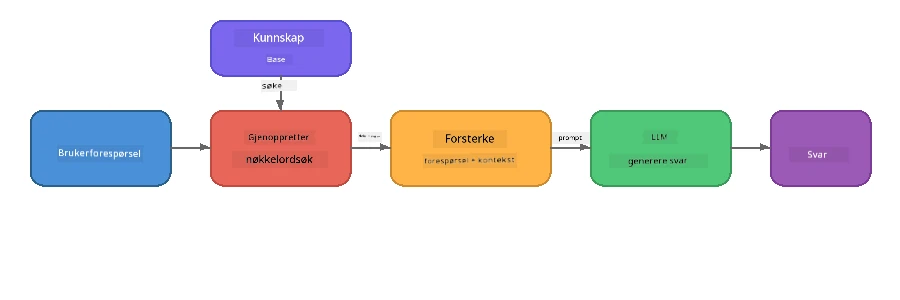

# Del 4: Bygge en RAG-applikasjon med Foundry Local

## Oversikt

Store språkmodeller er kraftige, men de kjenner bare til det som var i treningsdataene deres. **Retrieval-Augmented Generation (RAG)** løser dette ved å gi modellen relevant kontekst ved spørringstidspunktet – hentet fra dine egne dokumenter, databaser eller kunnskapsbaser.

I dette laboratoriet skal du bygge en komplett RAG-pipeline som kjører **helt på din enhet** ved hjelp av Foundry Local. Ingen skytjenester, ingen vektordatabaser, ingen embeddings-API – bare lokal henting og en lokal modell.

## Læringsmål

Innen slutten av dette laboratoriet vil du kunne:

- Forklare hva RAG er og hvorfor det er viktig for AI-applikasjoner
- Bygge en lokal kunnskapsbase fra tekst-dokumenter
- Implementere en enkel hentingsfunksjon for å finne relevant kontekst
- Sette sammen et system-prompt som forankrer modellen på hentede fakta
- Kjøre hele Retrieve → Augment → Generate-pipelinen på enheten
- Forstå avveiningene mellom enkel nøkkelordhenting og vektorsøk

---

## Forutsetninger

- Fullfør [Del 3: Bruke Foundry Local SDK med OpenAI](part3-sdk-and-apis.md)
- Foundry Local CLI installert og `phi-3.5-mini` modellen lastet ned

---

## Konsept: Hva er RAG?

Uten RAG kan en LLM bare svare ut fra treningsdataene – som kan være utdaterte, ufullstendige eller mangle din private informasjon:

```
User: "What is Zava's return policy?"
LLM:  "I do not have information about Zava's return policy."  ← No context!
```

Med RAG **henter du** relevante dokumenter først, deretter **utvider du** prompten med den konteksten før du **genererer** et svar:



Kjernen i dette: **modellen trenger ikke å "vite" svaret; den må bare lese de riktige dokumentene.**

---

## Laboratorieøvelser

### Øvelse 1: Forstå kunnskapsbasen

Åpne RAG-eksemplet for ditt språk og undersøk kunnskapsbasen:

<details>
<summary><b>🐍 Python: <code>python/foundry-local-rag.py</code></b></summary>

Kunnskapsbasen er en enkel liste av ordbøker med feltene `title` og `content`:

```python
KNOWLEDGE_BASE = [
    {
        "title": "Foundry Local Overview",
        "content": (
            "Foundry Local brings the power of Azure AI Foundry to your local "
            "device without requiring an Azure subscription..."
        ),
    },
    {
        "title": "Supported Hardware",
        "content": (
            "Foundry Local automatically selects the best model variant for "
            "your hardware. If you have an Nvidia CUDA GPU it downloads the "
            "CUDA-optimized model..."
        ),
    },
    # ... flere oppføringer
]
```

Hver oppføring representerer en "bit" av kunnskap – en fokusert informasjonsdel om ett emne.

</details>

<details>
<summary><b>📘 JavaScript: <code>javascript/foundry-local-rag.mjs</code></b></summary>

Kunnskapsbasen bruker samme struktur som et array av objekter:

```javascript
const KNOWLEDGE_BASE = [
  {
    title: "Foundry Local Overview",
    content:
      "Foundry Local brings the power of Azure AI Foundry to your local " +
      "device without requiring an Azure subscription...",
  },
  {
    title: "Supported Hardware",
    content:
      "Foundry Local automatically selects the best model variant for " +
      "your hardware...",
  },
  // ... flere oppføringer
];
```

</details>

<details>
<summary><b>💜 C#: <code>csharp/RagPipeline.cs</code></b></summary>

Kunnskapsbasen bruker en liste av navngitte tuples:

```csharp
private static readonly List<(string Title, string Content)> KnowledgeBase =
[
    ("Foundry Local Overview",
     "Foundry Local brings the power of Azure AI Foundry to your local " +
     "device without requiring an Azure subscription..."),

    ("Supported Hardware",
     "Foundry Local automatically selects the best model variant for " +
     "your hardware..."),

    // ... more entries
];
```

</details>

> **I en ekte applikasjon** vil kunnskapsbasen komme fra filer på disk, en database, en søkeindeks eller et API. For dette laboratoriet bruker vi en liste i minnet for å holde det enkelt.

---

### Øvelse 2: Forstå hentingsfunksjonen

Hentetrinnet finner de mest relevante kunnskapsbitene for brukerens spørsmål. Dette eksempelet bruker **nøkkelordoverlapping** – teller hvor mange ord i spørringen som også vises i hver bit:

<details>
<summary><b>🐍 Python</b></summary>

```python
def retrieve(query: str, top_k: int = 2) -> list[dict]:
    """Return the top-k knowledge chunks most relevant to the query."""
    query_words = set(query.lower().split())
    scored = []
    for chunk in KNOWLEDGE_BASE:
        chunk_words = set(chunk["content"].lower().split())
        overlap = len(query_words & chunk_words)
        scored.append((overlap, chunk))
    scored.sort(key=lambda x: x[0], reverse=True)
    return [item[1] for item in scored[:top_k]]
```

</details>

<details>
<summary><b>📘 JavaScript</b></summary>

```javascript
function retrieve(query, topK = 2) {
  const queryWords = new Set(query.toLowerCase().split(/\s+/));
  const scored = KNOWLEDGE_BASE.map((chunk) => {
    const chunkWords = new Set(chunk.content.toLowerCase().split(/\s+/));
    let overlap = 0;
    for (const w of queryWords) {
      if (chunkWords.has(w)) overlap++;
    }
    return { overlap, chunk };
  });
  scored.sort((a, b) => b.overlap - a.overlap);
  return scored.slice(0, topK).map((s) => s.chunk);
}
```

</details>

<details>
<summary><b>💜 C#</b></summary>

```csharp
private static List<(string Title, string Content)> Retrieve(string query, int topK = 2)
{
    var queryWords = new HashSet<string>(
        query.ToLowerInvariant().Split(' ', StringSplitOptions.RemoveEmptyEntries));

    return KnowledgeBase
        .Select(chunk =>
        {
            var chunkWords = new HashSet<string>(
                chunk.Content.ToLowerInvariant().Split(' ', StringSplitOptions.RemoveEmptyEntries));
            var overlap = queryWords.Intersect(chunkWords).Count();
            return (Overlap: overlap, Chunk: chunk);
        })
        .OrderByDescending(x => x.Overlap)
        .Take(topK)
        .Select(x => x.Chunk)
        .ToList();
}
```

</details>

**Hvordan det fungerer:**
1. Del opp spørringen i individuelle ord
2. For hver kunnskapsbit teller du hvor mange spørringsord som forekommer i den biten
3. Sorter etter overlappingsscore (høyest først)
4. Returner de øverste k mest relevante bitene

> **Avveining:** Nøkkelordoverlapping er enkelt, men begrenset; det forstår ikke synonymer eller mening. Produksjonssystemer for RAG bruker vanligvis **embedding-vektorer** og en **vektordatabasesøk** for semantisk søk. Men nøkkelordoverlapping er et flott utgangspunkt og krever ingen ekstra avhengigheter.

---

### Øvelse 3: Forstå det utvidede promptet

Den hentede konteksten settes inn i **systempromptet** før det sendes til modellen:

```python
system_prompt = (
    "You are a helpful assistant. Answer the user's question using ONLY "
    "the information provided in the context below. If the context does "
    "not contain enough information, say so.\n\n"
    f"Context:\n{context_text}"
)
```

Viktige designbeslutninger:
- **"KUN informasjonen som er oppgitt"** – hindrer modellen i å finne på fakta som ikke finnes i konteksten
- **"Hvis konteksten ikke inneholder nok informasjon, si det"** – oppmuntrer til ærlige svar som "jeg vet ikke"
- Konteksten plasseres i systemmeldingen slik at den former alle svarene

---

### Øvelse 4: Kjør RAG-pipelinen

Kjør det komplette eksempelet:

**Python:**
```bash
cd python
python foundry-local-rag.py
```

**JavaScript:**
```bash
cd javascript
node foundry-local-rag.mjs
```

**C#:**
```bash
cd csharp
dotnet run rag
```

Du skal se tre ting skrevet ut:
1. **Spørsmålet** som stilles
2. **Den hentede konteksten** – de valgte bitene fra kunnskapsbasen
3. **Svaret** – generert av modellen basert på bare den konteksten

Eksempelutskrift:
```
Question: How do I install Foundry Local and what hardware does it support?

--- Retrieved Context ---
### Installation
On Windows install Foundry Local with: winget install Microsoft.FoundryLocal...

### Supported Hardware
Foundry Local automatically selects the best model variant for your hardware...
-------------------------

Answer: To install Foundry Local, you can use the following methods depending
on your operating system: On Windows, run `winget install Microsoft.FoundryLocal`.
On macOS, use `brew install microsoft/foundrylocal/foundrylocal`...
```

Legg merke til hvordan modellens svar er **forankret** i den hentede konteksten – den nevner kun fakta fra dokumentene i kunnskapsbasen.

---

### Øvelse 5: Eksperimenter og utvid

Prøv disse endringene for å utdype forståelsen din:

1. **Endre spørsmålet** – spør om noe som ER i kunnskapsbasen versus noe som IKKE ER:
   ```python
   question = "What programming languages does Foundry Local support?"  # ← I kontekst
   question = "How much does Foundry Local cost?"                       # ← Ikke i kontekst
   ```
   Sier modellen riktig "jeg vet ikke" når svaret ikke finnes i konteksten?

2. **Legg til en ny kunnskapsbit** – legg til en ny oppføring i `KNOWLEDGE_BASE`:
   ```python
   {
       "title": "Pricing",
       "content": "Foundry Local is completely free and open source under the MIT license.",
   }
   ```
   Still deretter pris-spørsmålet igjen.

3. **Endre `top_k`** – hent flere eller færre biter:
   ```python
   context_chunks = retrieve(question, top_k=3)  # Mer kontekst
   context_chunks = retrieve(question, top_k=1)  # Mindre kontekst
   ```
   Hvordan påvirker mengden kontekst svarenes kvalitet?

4. **Fjern forankringsinstruksjonen** – endre systempromptet til bare "Du er en hjelpsom assistent." og se om modellen begynner å finne på fakta.

---

## Dypdykk: Optimalisere RAG for ytelse på enhet

Å kjøre RAG på enheten introduserer begrensninger som du ikke møter i skyen: begrenset RAM, ingen dedikert GPU (CPU/NPU-kjøring), og et lite kontekstvindu for modellen. Designvalgene nedenfor adresserer disse begrensningene direkte og baserer seg på mønstre fra produksjonsstil lokale RAG-applikasjoner bygget med Foundry Local.

### Delingsstrategi: Fast størrelse med glidevindu

Deling – hvordan du deler dokumenter opp i biter – er en av de mest innflytelsesrike beslutningene i et RAG-system. For enheten anbefales en **fast størrelses glidevindu med overlapp** som startpunkt:

| Parameter | Anbefalt verdi | Hvorfor |
|-----------|----------------|---------|
| **Chunk-størrelse** | ~200 tokens | Holder hentet kontekst kompakt, slik at det er plass i Phi-3.5 Minis kontekstvindu for systemprompt, samtalehistorikk og generert output |
| **Overlapp** | ~25 tokens (12,5 %) | Forhindrer tap av informasjon ved grenseområder mellom biter – viktig for prosedyrer og steg-for-steg instruksjoner |
| **Tokenisering** | Oppdeling på mellomrom | Null avhengigheter, ingen tokenizer-bibliotek nødvendig. All regnekraft går til LLM |

Overlappet fungerer som et glidevindu: hver ny bit starter 25 tokens før forrige sluttet, slik at setninger som går over bit-grenser vises i begge biter.

> **Hvorfor ikke andre strategier?**
> - **Setningsbasert splitting** gir uforutsigbar bit-størrelse; noen sikkerhetsprosedyrer er enkle lange setninger som ikke deler seg fint
> - **Seksjonsbasert splitting** (på `##`-overskrifter) skaper svært varierende bitstørrelser – noen for små, andre for store til modellens kontekstvindu
> - **Semantisk deling** (embedding-basert emnedeteksjon) gir best hentekvalitet, men krever en andre modell i minnet parallelt med Phi-3.5 Mini – risikabelt på maskinvare med 8-16 GB delt minne

### Forbedret henting: TF-IDF-vektorer

Nøkkelordoverlappingsmetoden i dette laboratoriet fungerer, men hvis du ønsker bedre henting uten å legge til en embedding-modell, er **TF-IDF (Term Frequency-Inverse Document Frequency)** en utmerket mellomløsning:

```
Keyword Overlap  →  TF-IDF Vectors  →  Embedding Models
    (this lab)     (lightweight upgrade)   (production)
  Simple & fast    Better ranking,         Best quality,
  No dependencies  still no ML model       requires embedding model
  ~Basic matching  ~1ms retrieval          ~100-500ms per query
```

TF-IDF konverterer hver bit til en numerisk vektor basert på hvor viktig hvert ord er i den biten *relativt til alle biter*. Ved spørring blir spørsmålet vektorisert på samme måte og sammenlignet med cosinuslikhet. Du kan implementere dette med SQLite og ren JavaScript/Python – ingen vektordatabaser, ingen embedding-API.

> **Ytelse:** TF-IDF cosinuslikhet over faste biter oppnår vanligvis **~1 ms henting**, sammenlignet med ~100-500 ms når en embeddingmodell koder hver spørring. Alle 20+ dokumenter kan deles opp og indekseres på under ett sekund.

### Edge/Compact-modus for begrensede enheter

Når du kjører på svært begrenset maskinvare (eldre bærbare, nettbrett, feltutstyr), kan du redusere ressursbruken ved å justere tre parametere:

| Innstilling | Standardmodus | Edge/Compact-modus |
|-------------|---------------|--------------------|
| **Systemprompt** | ~300 tokens | ~80 tokens |
| **Maks output tokens** | 1024 | 512 |
| **Hentede biter (top-k)** | 5 | 3 |

Færre hentede biter betyr mindre kontekst for modellen å behandle, noe som reduserer latenstid og minnebelastning. Kortere systemprompt frigjør mer av kontekstvinduet til det faktiske svaret. Denne avveiningen er verdt det på enheter hvor hver token teller i kontekstvinduet.

### Én modell i minnet

Et av de viktigste prinsippene for RAG på enheten: **hold bare én modell lastet**. Hvis du bruker en embedding-modell for henting *og* en språkmodell for generering, deler du begrensede NPU/RAM-ressurser mellom to modeller. Lettvekts-henting (nøkkelordoverlapping, TF-IDF) unngår dette helt:

- Ingen embedding-modell som konkurrerer med LLM om minne
- Raskere kaldstart – bare én modell å laste
- Forutsigbart minneforbruk – LLM får alle tilgjengelige ressurser
- Fungerer på maskiner med så lite som 8 GB RAM

### SQLite som lokal vektordatabase

For små til middels store dokumentmengder (hundrevis til noen tusen biter), er **SQLite raskt nok** for brute-force cosinuslikhetssøk og krever null infrastruktur:

- Enkel `.db` fil på disk – ingen serverprosess, ingen konfigurasjon
- Følger med de fleste store språk-runtime (Python `sqlite3`, Node.js `better-sqlite3`, .NET `Microsoft.Data.Sqlite`)
- Lagrer dokumentbiter sammen med TF-IDF-vektorene i én tabell
- Ingen behov for Pinecone, Qdrant, Chroma eller FAISS i denne skalaen

### Ytelsesoppsummering

Disse designvalgene kombineres for å gi responsiv RAG på forbruker-maskinvare:

| Metrikk | Ytelse på enheten |
|---------|-------------------|
| **Hentings-latenstid** | ~1 ms (TF-IDF) til ~5 ms (nøkkelordoverlapping) |
| **Inntakshastighet** | 20 dokumenter delt opp og indeksert på under 1 sekund |
| **Modeller i minnet** | 1 (kun LLM – ingen embedding-modell) |
| **Lagringsomfang** | < 1 MB for biter + vektorer i SQLite |
| **Kaldstart** | Én modell lasting, ingen embedding runtime-oppsett |
| **Maskinvarekrav** | 8 GB RAM, CPU-only (ingen GPU nødvendig) |

> **Når oppgradere:** Hvis du skalerer til hundrevis av lange dokumenter, blandet innhold (tabeller, kode, prosa), eller trenger semantisk forståelse av spørringer, vurder å legge til en embedding-modell og bytte til vektorlikhetssøk. For de fleste lokale brukstilfeller med fokuserte dokumentsett, gir TF-IDF + SQLite utmerkede resultater med minimalt ressursbruk.

---

## Nøkkelkonsepter

| Konsept | Beskrivelse |
|---------|-------------|
| **Henting** | Finne relevante dokumenter fra en kunnskapsbase basert på brukerens spørsmål |
| **Utvidelse** | Sette inn hentede dokumenter i prompt som kontekst |
| **Generering** | LLM produserer et svar forankret i den oppgitte konteksten |
| **Deling** | Bryte store dokumenter i mindre, fokuserte biter |
| **Forankring** | Begrense modellen til kun å bruke gitt kontekst (reduserer hallusinasjon) |
| **Top-k** | Antall mest relevante biter som skal hentes |

---

## RAG i produksjon vs. dette laboratoriet

| Aspekt | Dette laboratorium | Optimalisert på enhet | Produksjon i sky |
|--------|--------------------|----------------------|------------------|
| **Kunnskapsbase** | Liste i minnet | Filer på disk, SQLite | Database, søkeindeks |
| **Henting** | Nøkkelordoverlapping | TF-IDF + cosinuslikhet | Vektor-embeddings + likhetssøk |
| **Embeddings** | Ikke nødvendig | Ikke nødvendig – TF-IDF vektorer | Embeddingmodell (lokal eller sky) |
| **Vektorlager** | Ikke nødvendig | SQLite (enkelt `.db`-fil) | FAISS, Chroma, Azure AI Search, osv. |
| **Deling** | Manuell | Fast størrelse glidevindu (~200 tokens, 25 tokens overlapp) | Semantisk eller rekursiv deling |
| **Modeller i minnet** | 1 (LLM) | 1 (LLM) | 2+ (embedding + LLM) |
| **Hentingsforsinkelse** | ~5ms | ~1ms | ~100-500ms |
| **Skala** | 5 dokumenter | Hundrevis av dokumenter | Millioner av dokumenter |

Mønstrene du lærer her (hente, utvide, generere) er de samme i alle skalaer. Hentemetoden forbedres, men den overordnede arkitekturen forblir identisk. Midtkolonnen viser hva som er oppnåelig på enheten med lette teknikker, ofte det perfekte kompromisset for lokale applikasjoner der du bytter sky-skala for personvern, offline-muligheter og null forsinkelse til eksterne tjenester.

---

## Viktige punkter

| Konsept | Hva du lærte |
|---------|--------------|
| RAG-mønster | Hent + Utvid + Generer: gi modellen riktig kontekst, så kan den svare på spørsmål om dataene dine |
| På enheten | Alt kjører lokalt uten sky-APIer eller abonnementer på vektordatabaser |
| Forankringsinstruksjoner | Systempromptbegrensninger er kritiske for å forhindre hallusinasjoner |
| Nøkkelord-overlapping | Et enkelt men effektivt startpunkt for henting |
| TF-IDF + SQLite | En lett oppgraderingsvei som holder henting under 1 ms uten innebygd modell |
| Én modell i minnet | Unngå å laste inn en innebygd modell sammen med LLM på begrenset maskinvare |
| Delstørrelse | Omtrent 200 tokens med overlapping balanserer hentingspresisjon og effektivitet i kontekstvinduet |
| Edge/kompakt modus | Bruk færre deler og kortere prompts for svært begrensede enheter |
| Universelt mønster | Samme RAG-arkitektur fungerer for alle datakilder: dokumenter, databaser, APIer eller wikier |

> **Vil du se en full on-device RAG-applikasjon?** Sjekk ut [Gas Field Local RAG](https://github.com/leestott/local-rag), en produksjonsstil offline RAG-agent bygget med Foundry Local og Phi-3.5 Mini som demonstrerer disse optimaliseringsmønstrene med et virkelig dokumentsett.

---

## Neste steg

Fortsett til [Del 5: Bygge AI-agenter](part5-single-agents.md) for å lære hvordan du bygger intelligente agenter med personer, instruksjoner og flersporssamtaler ved hjelp av Microsoft Agent Framework.