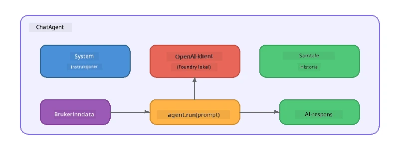

# Del 5: Bygge AI-agenter med Agent Framework

> **Mål:** Bygg din første AI-agent med vedvarende instruksjoner og en definert persona, drevet av en lokal modell gjennom Foundry Local.

## Hva er en AI-Agent?

En AI-agent pakker et språkmodell med **systeminstruksjoner** som definerer oppførsel, personlighet og begrensninger. I motsetning til et enkelt chat fullføringskall, gir en agent:

- **Persona** - en konsistent identitet ("Du er en hjelpsom kodeanmelder")
- **Minne** - samtalehistorikk over flere runder
- **Spesialisering** - fokusert oppførsel styrt av gjennomtenkte instruksjoner



---

## Microsoft Agent Framework

**Microsoft Agent Framework** (AGF) gir en standard agentabstraksjon som fungerer på tvers av ulike modell-backender. I denne workshopen kombinerer vi den med Foundry Local, så alt kjører på din maskin - uten behov for sky.

| Begrep | Beskrivelse |
|---------|-------------|
| `FoundryLocalClient` | Python: håndterer oppstart av tjeneste, modell-nedlasting/-lasting, og oppretter agenter |
| `client.as_agent()` | Python: lager en agent fra Foundry Local-klienten |
| `AsAIAgent()` | C#: utvidelsesmetode på `ChatClient` - oppretter en `AIAgent` |
| `instructions` | Systemprompt som former agentens oppførsel |
| `name` | Menneskeleselig etikett, nyttig i multi-agent scenarier |
| `agent.run(prompt)` / `RunAsync()` | Sender en brukerbeskjed og returnerer agentens svar |

> **Merk:** Agent Framework har en Python- og .NET-SDK. For JavaScript implementerer vi en lettvekts `ChatAgent`-klasse som speiler samme mønster direkte ved hjelp av OpenAI SDK.

---

## Øvelser

### Øvelse 1 - Forstå Agentmønsteret

Før du skriver kode, studer hovedkomponentene til en agent:

1. **Modellklient** - kobler til Foundry Locals OpenAI-kompatible API
2. **Systeminstruksjoner** - "personlighets"prompt
3. **Kjøringssløyfe** - send brukerinput, motta output

> **Tenk på:** Hvordan skiller systeminstruksjoner seg fra en vanlig brukermelding? Hva skjer hvis du endrer dem?

---

### Øvelse 2 - Kjør eksempel med enkelt agent

<details>
<summary><strong>🐍 Python</strong></summary>

**Forutsetninger:**
```bash
cd python
python -m venv venv

# Windows (PowerShell):
venv\Scripts\Activate.ps1
# macOS:
source venv/bin/activate

pip install -r requirements.txt
```

**Kjør:**
```bash
python foundry-local-with-agf.py
```

**Kodegjennomgang** (`python/foundry-local-with-agf.py`):

```python
import asyncio
from agent_framework_foundry_local import FoundryLocalClient

async def main():
    alias = "phi-4-mini"

    # FoundryLocalClient håndterer oppstart av tjenesten, nedlasting av modell og lasting
    client = FoundryLocalClient(model_id=alias)
    print(f"Client Model ID: {client.model_id}")

    # Opprett en agent med systeminstruksjoner
    agent = client.as_agent(
        name="Joker",
        instructions="You are good at telling jokes.",
    )

    # Ikke-strømming: få hele svaret på en gang
    result = await agent.run("Tell me a joke about a pirate.")
    print(f"Agent: {result}")

    # Strømming: få resultater etter hvert som de genereres
    async for chunk in agent.run("Tell me another joke.", stream=True):
        if chunk.text:
            print(chunk.text, end="", flush=True)

asyncio.run(main())
```

**Viktige punkter:**
- `FoundryLocalClient(model_id=alias)` håndterer oppstart av tjeneste, nedlasting og lasting av modell i ett steg
- `client.as_agent()` lager en agent med systeminstruksjoner og navn
- `agent.run()` støtter både ikke-strømming og strømmingsmodus
- Installer med `pip install agent-framework-foundry-local --pre`

</details>

<details>
<summary><strong>📦 JavaScript</strong></summary>

**Forutsetninger:**
```bash
cd javascript
npm install
```

**Kjør:**
```bash
node foundry-local-with-agent.mjs
```

**Kodegjennomgang** (`javascript/foundry-local-with-agent.mjs`):

```javascript
import { OpenAI } from "openai";
import { FoundryLocalManager } from "foundry-local-sdk";

class ChatAgent {
  constructor({ client, modelId, instructions, name }) {
    this.client = client;
    this.modelId = modelId;
    this.instructions = instructions;
    this.name = name;
    this.history = [];
  }

  async run(userMessage) {
    const messages = [
      { role: "system", content: this.instructions },
      ...this.history,
      { role: "user", content: userMessage },
    ];
    const response = await this.client.chat.completions.create({
      model: this.modelId,
      messages,
    });
    const assistantMessage = response.choices[0].message.content;

    // Behold samtalehistorikk for flertrinnsinteraksjoner
    this.history.push({ role: "user", content: userMessage });
    this.history.push({ role: "assistant", content: assistantMessage });
    return { text: assistantMessage };
  }
}

async function main() {
  FoundryLocalManager.create({ appName: "FoundryLocalWorkshop" });
  const manager = FoundryLocalManager.instance;
  await manager.startWebService();

  const catalog = manager.catalog;
  const model = await catalog.getModel("phi-3.5-mini");
  if (!model.isCached) {
    console.log("Downloading model: phi-3.5-mini...");
    await model.download();
  }
  await model.load();

  const client = new OpenAI({
    baseURL: manager.urls[0] + "/v1",
    apiKey: "foundry-local",
  });

  const agent = new ChatAgent({
    client,
    modelId: model.id,
    instructions: "You are good at telling jokes.",
    name: "Joker",
  });

  const result = await agent.run("Tell me a joke about a pirate.");
  console.log(result.text);
}

main();
```

**Viktige punkter:**
- JavaScript bygger sin egen `ChatAgent`-klasse som speiler Python AGF-mønsteret
- `this.history` lagrer samtalerunder for støtte av multi-turn
- Explisitt `startWebService()` → cache-sjekk → `model.download()` → `model.load()` gir full synlighet

</details>

<details>
<summary><strong>💜 C#</strong></summary>

**Forutsetninger:**
```bash
cd csharp
dotnet restore
```

**Kjør:**
```bash
dotnet run agent
```

**Kodegjennomgang** (`csharp/SingleAgent.cs`):

```csharp
using Microsoft.AI.Foundry.Local;
using Microsoft.Extensions.Logging.Abstractions;
using Microsoft.Agents.AI;
using OpenAI;
using System.ClientModel;

// 1. Start Foundry Local and load a model
var alias = "phi-3.5-mini";
await FoundryLocalManager.CreateAsync(
    new Configuration
    {
        AppName = "FoundryLocalSamples",
        Web = new Configuration.WebService { Urls = "http://127.0.0.1:0" }
    }, NullLogger.Instance, default);
var manager = FoundryLocalManager.Instance;
await manager.StartWebServiceAsync(default);

var catalog = await manager.GetCatalogAsync(default);
var model = await catalog.GetModelAsync(alias, default);

var isCached = await model.IsCachedAsync(default);
if (!isCached)
{
    Console.WriteLine($"Downloading model: {alias}...");
    await model.DownloadAsync(null, default);
}
await model.LoadAsync(default);

var key = new ApiKeyCredential("foundry-local");
var client = new OpenAIClient(key, new OpenAIClientOptions
{
    Endpoint = new Uri(manager.Urls[0] + "/v1")
});

// 2. Create an AIAgent using the Agent Framework extension method
AIAgent joker = client
    .GetChatClient(model.Id)
    .AsAIAgent(
        instructions: "You are good at telling jokes. Keep your jokes short and family-friendly.",
        name: "Joker"
    );

// 3. Run the agent (non-streaming)
var response = await joker.RunAsync("Tell me a joke about a pirate.");
Console.WriteLine($"Joker: {response}");

// 4. Run with streaming
await foreach (var update in joker.RunStreamingAsync("Tell me another joke."))
{
    Console.Write(update);
}
```

**Viktige punkter:**
- `AsAIAgent()` er en utvidelsesmetode fra `Microsoft.Agents.AI.OpenAI` - ingen tilpasset `ChatAgent`-klasse nødvendig
- `RunAsync()` returnerer hele svaret; `RunStreamingAsync()` streamer token for token
- Installer med `dotnet add package Microsoft.Agents.AI.OpenAI --version 1.0.0-rc3`

</details>

---

### Øvelse 3 - Endre Persona

Endre agentens `instructions` for å lage en annen persona. Prøv hver av dem og observer hvordan responsen endrer seg:

| Persona | Instruksjoner |
|---------|-------------|
| Kodeanmelder | `"Du er en ekspert kodeanmelder. Gi konstruktiv tilbakemelding med fokus på lesbarhet, ytelse og korrekthet."` |
| Reiseguide | `"Du er en vennlig reiseguide. Gi personlige anbefalinger for reisemål, aktiviteter og lokal mat."` |
| Sokratisk Veileder | `"Du er en sokratisk veileder. Gi aldri direkte svar - veilede studenten med gjennomtenkte spørsmål."` |
| Teknisk Skribent | `"Du er en teknisk skribent. Forklar konsepter klart og konsist. Bruk eksempler. Unngå sjargong."` |

**Prøv det:**
1. Velg en persona fra tabellen ovenfor
2. Erstatt `instructions`-strengen i koden
3. Juster brukerprompten tilsvarende (f.eks. be kodeanmelderen om å gjennomgå en funksjon)
4. Kjør eksemplet på nytt og sammenlign output

> **Tips:** Kvaliteten på en agent avhenger sterkt av instruksjonene. Spesifikke, godt strukturerte instruksjoner gir bedre resultater enn vage.

---

### Øvelse 4 - Legg til multi-turn samtale

Utvid eksemplet for å støtte en multi-turn chat-sløyfe slik at du kan ha en fram-og-tilbake samtale med agenten.

<details>
<summary><strong>🐍 Python - multi-turn sløyfe</strong></summary>

```python
import asyncio
from agent_framework_foundry_local import FoundryLocalClient

async def main():
    client = FoundryLocalClient(model_id="phi-4-mini")

    agent = client.as_agent(
        name="Assistant",
        instructions="You are a helpful assistant.",
    )

    print("Chat with the agent (type 'quit' to exit):\n")
    while True:
        user_input = input("You: ")
        if user_input.strip().lower() in ("quit", "exit"):
            break
        result = await agent.run(user_input)
        print(f"Agent: {result}\n")

asyncio.run(main())
```

</details>

<details>
<summary><strong>📦 JavaScript - multi-turn sløyfe</strong></summary>

```javascript
import { OpenAI } from "openai";
import { FoundryLocalManager } from "foundry-local-sdk";
import * as readline from "node:readline/promises";

// (gjenbruk ChatAgent-klassen fra Øvelse 2)

async function main() {
  FoundryLocalManager.create({ appName: "FoundryLocalWorkshop" });
  const manager = FoundryLocalManager.instance;
  await manager.startWebService();

  const catalog = manager.catalog;
  const model = await catalog.getModel("phi-3.5-mini");
  if (!model.isCached) {
    console.log("Downloading model: phi-3.5-mini...");
    await model.download();
  }
  await model.load();

  const client = new OpenAI({
    baseURL: manager.urls[0] + "/v1",
    apiKey: "foundry-local",
  });

  const agent = new ChatAgent({
    client,
    modelId: model.id,
    instructions: "You are a helpful assistant.",
    name: "Assistant",
  });

  const rl = readline.createInterface({
    input: process.stdin,
    output: process.stdout,
  });

  console.log("Chat with the agent (type 'quit' to exit):\n");
  while (true) {
    const userInput = await rl.question("You: ");
    if (["quit", "exit"].includes(userInput.trim().toLowerCase())) break;
    const result = await agent.run(userInput);
    console.log(`Agent: ${result.text}\n`);
  }
  rl.close();
}

main();
```

</details>

<details>
<summary><strong>💜 C# - multi-turn sløyfe</strong></summary>

```csharp
using Microsoft.AI.Foundry.Local;
using Microsoft.Extensions.Logging.Abstractions;
using Microsoft.Agents.AI;
using OpenAI;
using System.ClientModel;

var alias = "phi-3.5-mini";
var config = new Configuration
{
    AppName = "FoundryLocalSamples",
    Web = new Configuration.WebService { Urls = "http://127.0.0.1:0" }
};
await FoundryLocalManager.CreateAsync(config, NullLogger.Instance, default);
var manager = FoundryLocalManager.Instance;
await manager.StartWebServiceAsync(default);

var catalog = await manager.GetCatalogAsync(default);
var model = await catalog.GetModelAsync(alias, default);

var isCached = await model.IsCachedAsync(default);
if (!isCached)
{
    Console.WriteLine($"Downloading model: {alias}...");
    await model.DownloadAsync(null, default);
}
await model.LoadAsync(default);

var key = new ApiKeyCredential("foundry-local");
var client = new OpenAIClient(key, new OpenAIClientOptions
{
    Endpoint = new Uri(manager.Urls[0] + "/v1")
});

AIAgent agent = client
    .GetChatClient(model.Id)
    .AsAIAgent(
        instructions: "You are a helpful assistant.",
        name: "Assistant"
    );

Console.WriteLine("Chat with the agent (type 'quit' to exit):\n");
while (true)
{
    Console.Write("You: ");
    var userInput = Console.ReadLine();
    if (string.IsNullOrWhiteSpace(userInput) ||
        userInput.Equals("quit", StringComparison.OrdinalIgnoreCase) ||
        userInput.Equals("exit", StringComparison.OrdinalIgnoreCase))
        break;

    var result = await agent.RunAsync(userInput);
    Console.WriteLine($"Agent: {result}\n");
}
```

</details>

Legg merke til hvordan agenten husker tidligere runder – still et oppfølgingsspørsmål og se konteksten følge med.

---

### Øvelse 5 - Strukturert output

Instruks agenten til alltid å svare i et spesifikt format (f.eks. JSON) og parse resultatet:

<details>
<summary><strong>🐍 Python - JSON-output</strong></summary>

```python
import asyncio
import json
from agent_framework_foundry_local import FoundryLocalClient

async def main():
    client = FoundryLocalClient(model_id="phi-4-mini")

    agent = client.as_agent(
        name="SentimentAnalyzer",
        instructions=(
            "You are a sentiment analysis agent. "
            "For every user message, respond ONLY with valid JSON in this format: "
            '{"sentiment": "positive|negative|neutral", "confidence": 0.0-1.0, "summary": "brief reason"}'
        ),
    )

    result = await agent.run("I absolutely loved the new restaurant downtown!")
    print("Raw:", result)

    try:
        parsed = json.loads(str(result))
        print(f"Sentiment: {parsed['sentiment']} (confidence: {parsed['confidence']})")
    except json.JSONDecodeError:
        print("Agent did not return valid JSON - try refining the instructions.")

asyncio.run(main())
```

</details>

<details>
<summary><strong>💜 C# - JSON-output</strong></summary>

```csharp
using System.Text.Json;

AIAgent analyzer = chatClient.AsAIAgent(
    name: "SentimentAnalyzer",
    instructions:
        "You are a sentiment analysis agent. " +
        "For every user message, respond ONLY with valid JSON in this format: " +
        "{\"sentiment\": \"positive|negative|neutral\", \"confidence\": 0.0-1.0, \"summary\": \"brief reason\"}"
);

var response = await analyzer.RunAsync("I absolutely loved the new restaurant downtown!");
Console.WriteLine($"Raw: {response}");

try
{
    var parsed = JsonSerializer.Deserialize<JsonElement>(response.ToString());
    Console.WriteLine($"Sentiment: {parsed.GetProperty("sentiment")} " +
                      $"(confidence: {parsed.GetProperty("confidence")})");
}
catch (JsonException)
{
    Console.WriteLine("Agent did not return valid JSON - try refining the instructions.");
}
```

</details>

> **Merk:** Små lokale modeller produserer ikke alltid perfekt gyldig JSON. Du kan forbedre påliteligheten ved å inkludere et eksempel i instruksjonene og være veldig eksplisitt om forventet format.

---

## Hovedlæringspunkter

| Begrep | Hva du lærte |
|---------|--------------|
| Agent vs. vanlig LLM-kall | En agent pakker en modell med instruksjoner og minne |
| Systeminstruksjoner | Det viktigste styringspunktet for agentens oppførsel |
| Multi-turn samtale | Agenter kan bære kontekst over flere brukerinteraksjoner |
| Strukturert output | Instruksjoner kan håndheve output-format (JSON, markdown, etc.) |
| Lokal kjøring | Alt kjører på enheten via Foundry Local - ingen sky nødvendig |

---

## Neste steg

I **[Del 6: Multi-Agent Arbeidsflyter](part6-multi-agent-workflows.md)** skal du kombinere flere agenter i en koordinert pipeline hvor hver agent har en spesialisert rolle.