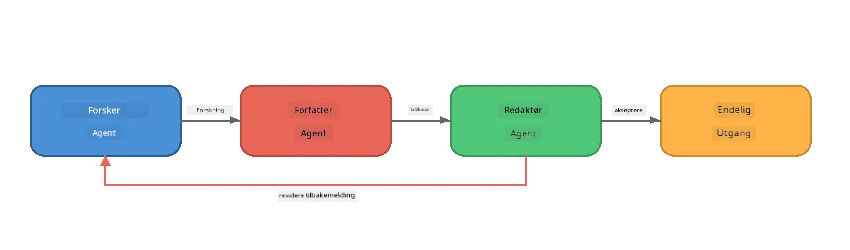
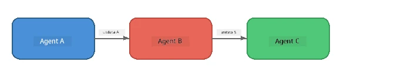
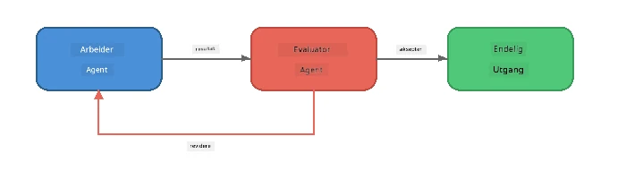
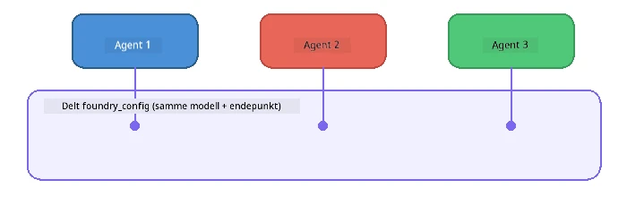

# Del 6: Multi-Agent arbeidsflyter

> **Mål:** Kombiner flere spesialiserte agenter i koordinerte rørledninger som deler komplekse oppgaver mellom samarbeidende agenter – alt kjører lokalt med Foundry Local.

## Hvorfor Multi-Agent?

En enkelt agent kan håndtere mange oppgaver, men komplekse arbeidsflyter drar nytte av **spesialisering**. I stedet for at én agent prøver å forske, skrive og redigere samtidig, deler du arbeidet opp i fokuserte roller:



| Mønster | Beskrivelse |
|---------|-------------|
| **Sekvensiell** | Utdataprodukt fra Agent A føres til Agent B → Agent C |
| **Tilbakemeldingssløyfe** | En evalueringsagent kan sende arbeidet tilbake for revisjon |
| **Delt kontekst** | Alle agenter bruker samme modell/endepunkt, men forskjellige instruksjoner |
| **Typebasert output** | Agenter produserer strukturerte resultater (JSON) for pålitelig overlevering |

---

## Øvelser

### Øvelse 1 - Kjør Multi-Agent rørledningen

Workshoppen inkluderer en komplett Forsker → Skribent → Redaktør arbeidsflyt.

<details>
<summary><strong>🐍 Python</strong></summary>

**Oppsett:**
```bash
cd python
python -m venv venv

# Windows (PowerShell):
venv\Scripts\Activate.ps1
# macOS:
source venv/bin/activate

pip install -r requirements.txt
```

**Kjør:**
```bash
python foundry-local-multi-agent.py
```

**Hva skjer:**
1. **Forsker** mottar et tema og returnerer punkter med fakta
2. **Skribent** bruker forskningen og skriver et blogginnlegg (3-4 avsnitt)
3. **Redaktør** gjennomgår artikkelen for kvalitet og returnerer GODTA eller REVIDER

</details>

<details>
<summary><strong>📦 JavaScript</strong></summary>

**Oppsett:**
```bash
cd javascript
npm install
```

**Kjør:**
```bash
node foundry-local-multi-agent.mjs
```

**Samme tre-trinns pipeline** - Forsker → Skribent → Redaktør.

</details>

<details>
<summary><strong>💜 C#</strong></summary>

**Oppsett:**
```bash
cd csharp
dotnet restore
```

**Kjør:**
```bash
dotnet run multi
```

**Samme tre-trinns pipeline** - Forsker → Skribent → Redaktør.

</details>

---

### Øvelse 2 - Anatomien til rørledningen

Studer hvordan agenter defineres og kobles sammen:

**1. Felles modellklient**

Alle agenter deler samme Foundry Local-modell:

```python
# Python - FoundryLocalClient håndterer alt
from agent_framework_foundry_local import FoundryLocalClient

client = FoundryLocalClient(model_id="phi-3.5-mini")
```

```javascript
// JavaScript - OpenAI SDK rettet mot Foundry Local
const client = new OpenAI({
  baseURL: manager.urls[0] + "/v1",
  apiKey: "foundry-local",
});
```

```csharp
// C# - OpenAIClient pointed at Foundry Local
var key = new ApiKeyCredential("foundry-local");
var client = new OpenAIClient(key, new OpenAIClientOptions
{
    Endpoint = new Uri(manager.Urls[0] + "/v1")
});
var chatClient = client.GetChatClient(model.Id);
```

**2. Spesialiserte instruksjoner**

Hver agent har en distinkt persona:

| Agent | Instruksjoner (oppsummering) |
|-------|------------------------------|
| Forsker | "Gi nøkkelfakta, statistikker og bakgrunn. Organiser som punkter." |
| Skribent | "Skriv et engasjerende blogginnlegg (3-4 avsnitt) basert på forskningsnotatene. Ikke finn på fakta." |
| Redaktør | "Vurder klarhet, grammatikk og faktakonsistens. Dom: GODTA eller REVIDER." |

**3. Dataflyt mellom agenter**

```python
# Trinn 1 - resultat fra forsker blir inngang til skribent
research_result = await researcher.run(f"Research: {topic}")

# Trinn 2 - resultat fra skribent blir inngang til redaktør
writer_result = await writer.run(f"Write using:\n{research_result}")

# Trinn 3 - redaktør gjennomgår både forskning og artikkel
editor_result = await editor.run(
    f"Research:\n{research_result}\n\nArticle:\n{writer_result}"
)
```

```csharp
// C# - same pattern, async calls with AIAgent
var researchNotes = await researcher.RunAsync(
    $"Research the following topic and provide key facts:\n{topic}");

var draft = await writer.RunAsync(
    $"Write a blog post based on these research notes:\n\n{researchNotes}");

var verdict = await editor.RunAsync(
    $"Review this article for quality and accuracy.\n\n" +
    $"Research notes:\n{researchNotes}\n\n" +
    $"Article:\n{draft}");
```

> **Viktig innsikt:** Hver agent mottar den kumulative konteksten fra tidligere agenter. Redaktøren ser både originalforskningen og utkastet – dette gjør det mulig å sjekke faktakonsistens.

---

### Øvelse 3 - Legg til en fjerde agent

Utvid rørledningen ved å legge til en ny agent. Velg én:

| Agent | Formål | Instruksjoner |
|-------|---------|---------------|
| **Faktasjekker** | Verifiser påstander i artikkelen | `"Du verifiserer faktapåstander. For hver påstand, oppgi om den støttes av forskningsnotatene. Returner JSON med verifiserte/ikke-verifiserte elementer."` |
| **Overskriftsforfatter** | Lag fengende titler | `"Generer 5 overskriftsalternativer for artikkelen. Varier stil: informativ, clickbait, spørsmål, liste, emosjonell."` |
| **Sosiale medier** | Lag promoteringer | `"Lag 3 innlegg til sosiale medier som promoterer denne artikkelen: ett for Twitter (280 tegn), ett for LinkedIn (profesjonell tone), ett for Instagram (uformelt med emoji-forslag)."` |

<details>
<summary><strong>🐍 Python - legge til en Overskriftsforfatter</strong></summary>

```python
headline_agent = client.as_agent(
    name="HeadlineWriter",
    instructions=(
        "You are a headline specialist. Given an article, generate exactly "
        "5 headline options. Vary the style: informative, question-based, "
        "listicle, emotional, and provocative. Return them as a numbered list."
    ),
)

# Etter at redaktøren godtar, generer overskrifter
headline_result = await headline_agent.run(
    f"Generate headlines for this article:\n\n{writer_result}"
)
print(f"\n--- Headlines ---\n{headline_result}")
```

</details>

<details>
<summary><strong>📦 JavaScript - legge til en Overskriftsforfatter</strong></summary>

```javascript
const headlineAgent = new ChatAgent({
  client,
  modelId: modelInfo.id,
  instructions:
    "You are a headline specialist. Given an article, generate exactly " +
    "5 headline options. Vary the style: informative, question-based, " +
    "listicle, emotional, and provocative. Return them as a numbered list.",
  name: "HeadlineWriter",
});

const headlineResult = await headlineAgent.run(
  `Generate headlines for this article:\n\n${writerResult.text}`
);
console.log(`\n--- Headlines ---\n${headlineResult.text}`);
```

</details>

<details>
<summary><strong>💜 C# - legge til en Overskriftsforfatter</strong></summary>

```csharp
AIAgent headlineAgent = chatClient.AsAIAgent(
    name: "HeadlineWriter",
    instructions:
        "You are a headline specialist. Given an article, generate exactly " +
        "5 headline options. Vary the style: informative, question-based, " +
        "listicle, emotional, and provocative. Return them as a numbered list."
);

// After the editor accepts, generate headlines
var headlines = await headlineAgent.RunAsync(
    $"Generate headlines for this article:\n\n{draft}");
Console.WriteLine($"\n--- Headlines ---\n{headlines}");
```

</details>

---

### Øvelse 4 - Design din egen arbeidsflyt

Design en multi-agent rørledning for et annet domene. Her er noen ideer:

| Domene | Agenter | Flyt |
|--------|---------|------|
| **Kodegjennomgang** | Analysator → Anmelder → Oppsummerer | Analyser kodestruktur → gjennomgå etter feil → lag oppsummeringsrapport |
| **Kundesupport** | Klassifiserer → Svarer → Kvalitetssikrer | Klassifiser sak → utkast til svar → sjekk kvalitet |
| **Utdanning** | Quiz-skaper → Student-simulator → Sensor | Lag quiz → simuler svar → vurder og forklar |
| **Dataanalyse** | Tolk → Analytiker → Rapportør | Tolk dataforespørsel → analyser mønstre → skriv rapport |

**Steg:**
1. Definer 3+ agenter med distinkte `instruksjoner`
2. Bestem dataflyten - hva mottar og produserer hver agent?
3. Implementer rørledningen ved å bruke mønstrene fra Øvelser 1-3
4. Legg til en tilbakemeldingssløyfe hvis en agent skal evaluere en annen

---

## Orkestreringsmønstre

Her er orkestreringsmønstre som gjelder for alle multi-agent systemer (utforskes i dybden i [Del 7](part7-zava-creative-writer.md)):

### Sekvensiell pipeline



Hver agent behandler utdata fra den forrige. Enkelt og forutsigbart.

### Tilbakemeldingssløyfe



En evalueringsagent kan utløse ny kjøring av tidligere stadier. Zava Writer bruker dette: redaktøren kan sende tilbakemeldinger tilbake til forsker og skribent.

### Delt kontekst



Alle agenter deler en enkelt `foundry_config` slik at de bruker samme modell og endepunkt.

---

## Viktige poenger

| Konsept | Hva du lærte |
|---------|--------------|
| Agentspesialisering | Hver agent gjør én ting godt med fokuserte instruksjoner |
| Dataoverlevering | Utdata fra én agent blir inndata til neste |
| Tilbakemeldingssløyfer | En evaluator kan utløse flere forsøk for høyere kvalitet |
| Strukturert output | JSON-formaterte svar muliggjør pålitelig agent-til-agent kommunikasjon |
| Orkestrering | En koordinator håndterer pipeline-sekvens og feilhåndtering |
| Produksjonsmønstre | Anvendt i [Del 7: Zava Creative Writer](part7-zava-creative-writer.md) |

---

## Neste steg

Fortsett til [Del 7: Zava Creative Writer - Capstone-applikasjon](part7-zava-creative-writer.md) for å utforske en produksjonsriktig multi-agent app med 4 spesialiserte agenter, strømmende output, produktsøk og tilbakemeldingssløyfer – tilgjengelig i Python, JavaScript og C#.