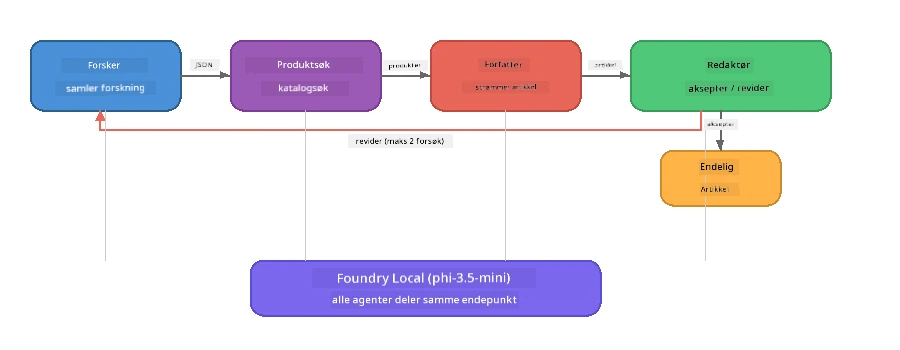

# Del 7: Zava Creative Writer - Avsluttende applikasjon

> **Mål:** Utforsk en produksjonsstil multi-agent-applikasjon hvor fire spesialiserte agenter samarbeider for å produsere magasinkvalitetsartikler for Zava Retail DIY - som kjører helt på din enhet med Foundry Local.

Dette er **avslutningslabben** i workshoppen. Den samler alt du har lært - SDK-integrasjon (Del 3), henting fra lokal data (Del 4), agentpersonas (Del 5), og multi-agent orkestrering (Del 6) - i en komplett applikasjon tilgjengelig i **Python**, **JavaScript**, og **C#**.

---

## Hva du vil utforske

| Konsept | Hvor i Zava Writer |
|---------|----------------------------|
| 4-trinns modellinnlasting | Felles konfigurasjonsmodul starter Foundry Local |
| RAG-stil henting | Produktagent søker i en lokal katalog |
| Agentspesialisering | 4 agenter med distinkte systemprompter |
| Strømming av output | Writer gir tokens i sanntid |
| Strukturert overlevering | Researcher → JSON, Editor → JSON beslutning |
| Tilbakemeldingssløyfer | Editor kan trigge ny kjøring (maks 2 forsøk) |

---

## Arkitektur

Zava Creative Writer bruker en **sekvensiell pipeline med evaluator-styrt tilbakemelding**. Alle tre språkimplementasjoner følger samme arkitektur:



### De fire agentene

| Agent | Input | Output | Formål |
|-------|-------|--------|---------|
| **Researcher** | Emne + valgfri tilbakemelding | `{"web": [{url, name, description}, ...]}` | Samler bakgrunnsundersøkelser via LLM |
| **Product Search** | Produktkontekst-streng | Liste over matchende produkter | LLM-genererte spørringer + søkeordssøk mot lokal katalog |
| **Writer** | Research + produkter + oppgave + tilbakemelding | Strømmet artikkeltekst (delt ved `---`) | Skisserer en magasinkvalitetsartikkel i sanntid |
| **Editor** | Artikkel + skrivers egen tilbakemelding | `{"decision": "accept/revise", "editorFeedback": "...", "researchFeedback": "..."}` | Gjennomgår kvalitet, triggere ny kjøring ved behov |

### Pipelinens flyt

1. **Researcher** mottar emnet og produserer strukturerte forskningsnotater (JSON)
2. **Product Search** søker i den lokale produktkatalogen med LLM-genererte søketerminer
3. **Writer** kombinerer research + produkter + oppgave til en strømmende artikkel, og legger til egen tilbakemelding etter en `---` separator
4. **Editor** gjennomgår artikkelen og returnerer en JSON-dom:
   - `"accept"` → pipeline fullføres
   - `"revise"` → tilbakemelding sendes tilbake til Researcher og Writer (maks 2 forsøk)

---

## Forutsetninger

- Fullfør [Del 6: Multi-Agent Workflows](part6-multi-agent-workflows.md)
- Foundry Local CLI installert og `phi-3.5-mini` modell lastet ned

---

## Øvelser

### Øvelse 1 - Kjør Zava Creative Writer

Velg ditt språk og kjør applikasjonen:

<details>
<summary><strong>🐍 Python - FastAPI Web Service</strong></summary>

Python-versjonen kjører som en **webtjeneste** med en REST API, som demonstrerer hvordan man bygger en produksjonsbackend.

**Oppsett:**
```bash
cd zava-creative-writer-local/src/api
python -m venv venv

# Windows (PowerShell):
venv\Scripts\Activate.ps1
# macOS:
source venv/bin/activate

pip install -r requirements.txt
```

**Kjør:**
```bash
uvicorn main:app --reload
```

**Test det:**
```bash
curl -X POST http://localhost:8000/api/article \
  -H "Content-Type: application/json" \
  -d '{
    "research": "DIY home improvement trends",
    "products": "power tools and paints",
    "assignment": "Write an article about weekend renovation projects for DIY enthusiasts"
  }'
```

Responsen strømmes tilbake som linjedelimiterte JSON-meldinger som viser hver agents fremdrift.

</details>

<details>
<summary><strong>📦 JavaScript - Node.js CLI</strong></summary>

JavaScript-versjonen kjører som en **CLI-applikasjon**, som skriver ut agentfremdrift og artikkelen direkte til konsollen.

**Oppsett:**
```bash
cd zava-creative-writer-local/src/javascript
npm install
```

**Kjør:**
```bash
node main.mjs
```

Du vil se:
1. Foundry Local modellinnlasting (med fremdriftslinje hvis nedlasting)
2. Hver agent kjører i sekvens med statusmeldinger
3. Artikkelen strømmes til konsollen i sanntid
4. Editorens godkjent/revider beslutning

</details>

<details>
<summary><strong>💜 C# - .NET Console App</strong></summary>

C#-versjonen kjører som en **.NET-konsollapplikasjon** med samme pipelin og strømmende output.

**Oppsett:**
```bash
cd zava-creative-writer-local/src/csharp
dotnet restore
```

**Kjør:**
```bash
dotnet run
```

Samme output-mønster som JavaScript-versjonen – agentstatusmeldinger, strømmet artikkel, og editors dom.

</details>

---

### Øvelse 2 - Studer Kodestrukturen

Hver språkimplementasjon har de samme logiske komponentene. Sammenlign strukturene:

**Python** (`src/api/`):
| Fil | Formål |
|------|---------|
| `foundry_config.py` | Felles Foundry Local manager, modell og klient (4-trinns init) |
| `orchestrator.py` | Pipeline-koordinering med tilbakemeldingssløyfe |
| `main.py` | FastAPI-endepunkter (`POST /api/article`) |
| `agents/researcher/researcher.py` | LLM-basert research med JSON-output |
| `agents/product/product.py` | LLM-genererte spørringer + søkeordssøk |
| `agents/writer/writer.py` | Strømmende artikkelgenerering |
| `agents/editor/editor.py` | JSON-basert godkjenn/revider beslutning |

**JavaScript** (`src/javascript/`):
| Fil | Formål |
|------|---------|
| `foundryConfig.mjs` | Felles Foundry Local-konfigurasjon (4-trinns init med fremdriftslinje) |
| `main.mjs` | Orkestrator + CLI inngangspunkt |
| `researcher.mjs` | LLM-basert researchagent |
| `product.mjs` | LLM-spørringsgenerering + søkeordssøk |
| `writer.mjs` | Strømmende artikkelgenerering (async generator) |
| `editor.mjs` | JSON godkjenn/revider beslutning |
| `products.mjs` | Produktkatalogdata |

**C#** (`src/csharp/`):
| Fil | Formål |
|------|---------|
| `Program.cs` | Komplett pipeline: modellinnlasting, agenter, orkestrator, tilbakemeldingssløyfe |
| `ZavaCreativeWriter.csproj` | .NET 9 prosjekt med Foundry Local + OpenAI-pakker |

> **Designnotat:** Python separerer hver agent i sin egen fil/katalog (bra for større team). JavaScript bruker en modul per agent (bra for mellomstore prosjekter). C# holder alt i én fil med lokale funksjoner (bra for selvstendige eksempler). I produksjon, velg mønster som passer teamets konvensjoner.

---

### Øvelse 3 - Spor Felles Konfigurasjon

Hver agent i pipelinen deler én Foundry Local modellklient. Studer hvordan dette er satt opp i hvert språk:

<details>
<summary><strong>🐍 Python - foundry_config.py</strong></summary>

```python
from foundry_local import FoundryLocalManager

MODEL_ALIAS = "phi-3.5-mini"

# Trinn 1: Opprett manager og start Foundry Local-tjenesten
manager = FoundryLocalManager()
manager.start_service()

# Trinn 2: Sjekk om modellen allerede er lastet ned
cached = manager.list_cached_models()
catalog_info = manager.get_model_info(MODEL_ALIAS)
is_cached = any(m.id == catalog_info.id for m in cached) if catalog_info else False

if not is_cached:
    manager.download_model(MODEL_ALIAS)

# Trinn 3: Last modellen inn i minnet
manager.load_model(MODEL_ALIAS)
model_id = manager.get_model_info(MODEL_ALIAS).id

# Delt OpenAI-klient
client = openai.OpenAI(base_url=manager.endpoint, api_key=manager.api_key)
```

Alle agenter importerer `from foundry_config import client, model_id`.

</details>

<details>
<summary><strong>📦 JavaScript - foundryConfig.mjs</strong></summary>

```javascript
import { FoundryLocalManager } from "foundry-local-sdk";
import { OpenAI } from "openai";

FoundryLocalManager.create({ appName: "ZavaCreativeWriter" });
const manager = FoundryLocalManager.instance;
await manager.startWebService();

// Sjekk cache → last ned → last inn (ny SDK-mønster)
const catalog = manager.catalog;
const model = await catalog.getModel(MODEL_ALIAS);
if (!model.isCached) {
  console.log(`Downloading model: ${MODEL_ALIAS}...`);
  await model.download();
}
await model.load();

const client = new OpenAI({ baseURL: manager.urls[0] + "/v1", apiKey: "foundry-local" });
const modelId = model.id;
export { client, modelId };
```

Alle agenter importerer `{ client, modelId } from "./foundryConfig.mjs"`.

</details>

<details>
<summary><strong>💜 C# - toppen av Program.cs</strong></summary>

```csharp
await FoundryLocalManager.CreateAsync(
    new Configuration
    {
        AppName = "ZavaCreativeWriter",
        Web = new Configuration.WebService { Urls = "http://127.0.0.1:0" }
    }, NullLogger.Instance, default);
var manager = FoundryLocalManager.Instance;
await manager.StartWebServiceAsync(default);

var catalog = await manager.GetCatalogAsync(default);
var catalogModel = await catalog.GetModelAsync(alias, default);
var isCached = await catalogModel.IsCachedAsync(default);
if (!isCached)
    await catalogModel.DownloadAsync(null, default);

await catalogModel.LoadAsync(default);
var key = new ApiKeyCredential("foundry-local");
var chatClient = new OpenAIClient(key, new OpenAIClientOptions
{
    Endpoint = new Uri(manager.Urls[0] + "/v1")
}).GetChatClient(catalogModel.Id);
```

`chatClient` sendes deretter til alle agentfunksjoner i samme fil.

</details>

> **Nøkkelmønster:** Modellinnlastingsmønsteret (start tjeneste → sjekk cache → last ned → last) sikrer at brukeren ser klar fremdrift og at modellen bare lastes ned én gang. Dette er beste praksis for enhver Foundry Local-applikasjon.

---

### Øvelse 4 - Forstå Tilbakemeldingssløyfen

Tilbakemeldingssløyfen er det som gjør denne pipelinen "smart" – Editor kan sende arbeidet tilbake for revisjon. Spor logikken:

```
Orchestrator:
  1. researcher.research(topic, "No Feedback")    ← first pass
  2. product.findProducts(productContext)
  3. writer.write(research, products, assignment)  ← streams article
  4. Split article at "---" → article + writerFeedback
  5. editor.edit(article, writerFeedback)

  WHILE editor says "revise" AND retryCount < 2:
    6. researcher.research(topic, editor.researchFeedback)  ← refined
    7. writer.write(research, products, editor.editorFeedback)
    8. editor.edit(newArticle, newWriterFeedback)
    9. retryCount++
```

**Spørsmål å vurdere:**
- Hvorfor er retry-grensen satt til 2? Hva skjer hvis du øker den?
- Hvorfor får researcher `researchFeedback`, men writer får `editorFeedback`?
- Hva ville skjedd hvis editor alltid sier "revise"?

---

### Øvelse 5 - Endre en Agent

Prøv å endre oppførselen til en agent og observer hvordan det påvirker pipelinen:

| Endring | Hva som skal endres |
|-------------|----------------|
| **Strengere editor** | Endre editorens systemprompt til alltid å kreve minst én revisjon |
| **Lengre artikler** | Endre writers prompt fra "800-1000 ord" til "1500-2000 ord" |
| **Ulike produkter** | Legg til eller endre produkter i produktkatalogen |
| **Nytt forskningstema** | Endre standard `researchContext` til et annet emne |
| **Kun JSON-forsker** | Få forskeren til å returnere 10 elementer i stedet for 3-5 |

> **Tips:** Siden alle tre språk implementerer samme arkitektur, kan du gjøre samme endring i det språket du er mest komfortabel med.

---

### Øvelse 6 - Legg til en Femte Agent

Utvid pipelinen med en ny agent. Noen ideer:

| Agent | Hvor i pipelinen | Formål |
|-------|-------------------|---------|
| **Fact-Checker** | Etter Writer, før Editor | Verifiser påstander mot forskningsdata |
| **SEO Optimiser** | Etter at Editor godkjenner | Legg til metabeskrivelse, nøkkelord, slug |
| **Illustrator** | Etter at Editor godkjenner | Generer bildeprompt for artikkelen |
| **Translator** | Etter at Editor godkjenner | Oversett artikkelen til et annet språk |

**Steg:**
1. Skriv agentens systemprompt
2. Lag agentfunksjon (matchende eksisterende mønster i ditt språk)
3. Sett den inn i orkestratoren på riktig sted
4. Oppdater output/logging for å vise den nye agentens bidrag

---

## Hvordan Foundry Local og Agent Framework samarbeider

Denne applikasjonen demonstrerer anbefalt mønster for å bygge multi-agent systemer med Foundry Local:

| Lag | Komponent | Rolle |
|-------|-----------|------|
| **Runtime** | Foundry Local | Laster ned, administrerer og tilbyr modellen lokalt |
| **Client** | OpenAI SDK | Sender chatteforespørsler til lokal endepunkt |
| **Agent** | Systemprompt + chat-kall | spesialisert oppførsel via fokuserte instruksjoner |
| **Orkestrator** | Pipeline-koordinator | Håndterer databevegelse, sekvensering og tilbakemeldinger |
| **Framework** | Microsoft Agent Framework | Tilbyr `ChatAgent`-abstraksjon og mønstre |

Hovedinnsikten: **Foundry Local erstatter sky-backend, ikke applikasjonsarkitekturen.** De samme agentmønstre, orkestreringsstrategier og strukturerte overleveringer som fungerer med skymodeller fungerer identisk med lokale modeller — du peker bare klienten mot lokal endepunkt i stedet for et Azure-endepunkt.

---

## Viktige punkter

| Konsept | Hva du lærte |
|---------|-----------------|
| Produksjonsarkitektur | Hvordan strukturere en multi-agent-app med delt konfig og separate agenter |
| 4-trinns modellinnlasting | Beste praksis for initialisering av Foundry Local med bruker-synlig fremdrift |
| Agentspesialisering | Hver av de 4 agentene har fokuserte instrukser og spesifikt outputformat |
| Strømmende generering | Writer gir tokens i sanntid, noe som muliggjør responsive brukergrensesnitt |
| Tilbakemeldingssløyfer | Editor-styrt retry forbedrer outputkvalitet uten menneskelig inngrep |
| Tverrspråklige mønstre | Samme arkitektur fungerer i Python, JavaScript og C# |
| Lokal = produksjonsklar | Foundry Local tilbyr samme OpenAI-kompatible API som brukes i skydistribusjoner |

---

## Neste steg

Fortsett til [Del 8: Evaluation-Led Development](part8-evaluation-led-development.md) for å bygge et systematisk evalueringsrammeverk for agentene dine, med gullstandard datasett, regelbaserte sjekker og LLM-som-dommer scoring.