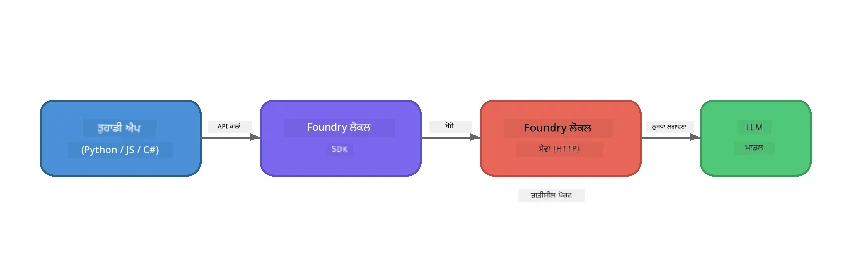

# ਭਾਗ 1: Foundry Local ਨਾਲ ਸ਼ੁਰੂਆਤ


## Foundry Local ਕੀ ਹੈ?

[Foundry Local](https://foundrylocal.ai) ਤੁਹਾਨੂੰ ਖੁੱਲ੍ਹੇ ਸ੍ਰੋਤ ਵਾਲੇ AI ਭਾਸ਼ਾ ਮਾਡਲ ਸਿੱਧਾ ਆਪਣੇ ਕੰਪਿਊਟਰ 'ਤੇ ਚਲਾਉਣ ਦੀ ਆਗਿਆ ਦਿੰਦਾ ਹੈ - ਨਾ ਕੋਈ ਇੰਟਰਨੇਟ ਦੀ ਲੋੜ, ਨਾ ਕੋਈ ਕਲਾਉਡ ਖਰਚ, ਅਤੇ ਪੂਰੀ ਡਾਟਾ ਗੋਪਨੀਯਤਾ। ਇਹ:

- **ਮਾਡਲਾਂ ਨੂੰ ਸਥਾਨਕ ਤੌਰ 'ਤੇ ਡਾਊਨਲੋਡ ਅਤੇ ਚਲਾਉਂਦਾ ਹੈ** ਸਵੈਚਲਿਤ ਹਾਰਡਵੇਅਰ ਅਨੁਕੂਲਤਾ (GPU, CPU, ਜਾਂ NPU)
- **OpenAI-ਅਨੁਕੂਲ API ਪ੍ਰਦਾਨ ਕਰਦਾ ਹੈ** ਤਾਂ ਜੋ ਤੁਸੀਂ ਜਾਣੇ-ਪਹਿਚਾਣੇ SDKs ਅਤੇ ਸੰਦ ਵਰਤ ਸਕੋ
- **ਕੋਈ Azure ਸਬਸਕ੍ਰਿਪਸ਼ਨ ਜਾਂ ਸਾਈਨ-ਅਪ ਨਹੀਂ ਲੋੜੀਂਦਾ** - ਸਿਰਫ ਇੰਸਟਾਲ ਕਰੋ ਅਤੇ ਬਣਾਉਣ ਸ਼ੁਰੂ ਕਰੋ

ਇਸਨੂੰ ਆਪਣੇ ਮਸ਼ੀਨ 'ਤੇ ਪੂਰੀ ਤਰ੍ਹਾਂ ਚੱਲ ਰਹੇ ਪ੍ਰਾਈਵੇਟ AI ਵਾਂਗ ਸੋਚੋ।

## ਸਿੱਖਣ ਦੇ ਉਦੇਸ਼

ਇਸ ਲੈਬ ਦੇ ਅੰਤ ਤੱਕ ਤੁਸੀਂ ਸਮਰੱਥ ਹੋਵੋਗੇ:

- ਆਪਣੇ ਓਪਰੇਟਿੰਗ ਸਿਸਟਮ 'ਤੇ Foundry Local CLI ਇੰਸਟਾਲ ਕਰਨਾ
- ਮਾਡਲ ਉਪਨਾਮ ਕੀ ਹੁੰਦੇ ਹਨ ਤੇ ਉਹ ਕਿਵੇਂ ਕੰਮ ਕਰਦੇ ਹਨ, ਸਮਝਣਾ
- ਆਪਣਾ ਪਹਿਲਾ ਸਥਾਨਕ AI ਮਾਡਲ ਡਾਊਨਲੋਡ ਅਤੇ ਚਲਾਉਣਾ
- ਕਮਾਂਡ ਲਾਈਨ ਤੋਂ ਸਥਾਨਕ ਮਾਡਲ ਨੂੰ ਚੈਟ ਸੁਨੇਹਾ ਭੇਜਣਾ
- ਸਥਾਨਕ ਅਤੇ ਕਲਾਉਡ-ਹੋਸਟ ਕੀਤੇ AI ਮਾਡਲਾਂ ਵਿਚਕਾਰ ਫਰਕ ਸਮਝਣਾ

---

## ਜ਼ਰੂਰੀ ਸੂਤਰ

### ਸਿਸਟਮ ਦੀਆਂ ਲੋੜਾਂ

| ਲੋੜ | ਘੱਟੋ-ਘੱਟ | ਸੁਝਾਅਤ |
|-------------|---------|-------------|
| **RAM** | 8 GB | 16 GB |
| **ਡਿਸ্ক ਸਥਾਨ** | 5 GB (ਮਾਡਲਾਂ ਲਈ) | 10 GB |
| **CPU** | 4 ਕੋਰ | 8+ ਕੋਰ |
| **GPU** | ਵਿਕਲਪਿਕ | NVIDIA ਨਾਲ CUDA 11.8+ |
| **OS** | Windows 10/11 (x64/ARM), Windows Server 2025, macOS 13+ | - |

> **ਨੋਟ:** Foundry Local ਆਟੋਮੈਟਿਕ ਤੌਰ 'ਤੇ ਤੁਹਾਡੇ ਹਾਰਡਵੇਅਰ ਲਈ ਸਭ ਤੋਂ ਚੰਗਾ ਮਾਡਲ ਵਰਜਨ ਚੁਣਦਾ ਹੈ। ਜੇ ਤੁਹਾਡੇ ਕੋਲ NVIDIA GPU ਹੈ, ਤਾਂ ਇਹ CUDA ਐਕਸੈਲੇਰੇਸ਼ਨ ਵਰਤਦਾ ਹੈ। ਜੇ ਤੁਹਾਡੇ ਕੋਲ Qualcomm NPU ਹੈ, ਤਾਂ ਇਹ ਇਸਨੂੰ ਵਰਤਦਾ ਹੈ। ਨਹੀਂ ਤਾਂ ਇਹ ਇੱਕ ਅਨੁਕੂਲਤ CPU ਵਰਜਨ ਦੀ ਵਰਤੋਂ ਕਰਦਾ ਹੈ।

### Foundry Local CLI ਇੰਸਟਾਲ ਕਰੋ

**Windows** (PowerShell):  
```powershell
winget install Microsoft.FoundryLocal
```
  
**macOS** (Homebrew):  
```bash
brew tap microsoft/foundrylocal
brew install foundrylocal
```
  
> **ਨੋਟ:** Foundry Local ਇਸ ਸਮੇਂ ਸਿਰਫ਼ Windows ਅਤੇ macOS ਨੂੰ ਸਹਿਯੋਗ ਦਿੰਦਾ ਹੈ। Linux ਨੂੰ ਇਸ ਵੇਲੇ ਸਹਿਯੋਗ ਨਹੀਂ ਮਿਲਦਾ।

ਇੰਸਟਾਲੇਸ਼ਨ ਦੀ ਪੁਸ਼ਟੀ ਕਰੋ:  
```bash
foundry --version
```
  
---

## ਲੈਬ ਅਭਿਆਸ

### ਅਭਿਆਸ 1: ਉਪਲਬਧ ਮਾਡਲਾਂ ਦਾ ਪਤਾ ਲਗਾਓ

Foundry Local ਵਿੱਚ ਪਹਿਲਾਂ ਹੀ ਪ੍ਰੀ-ਅਨੁਕੂਲਤ ਖੁੱਲ੍ਹੇ ਸ੍ਰੋਤ ਮਾਡਲਾਂ ਦੀ ਕੈਟਾਲੌਗ ਸ਼ਾਮਿਲ ਹੈ। ਉਹਨਾਂ ਦੀ ਸੂਚੀ ਬਣਾਓ:

```bash
foundry model list
```
  
ਤੁਸੀਂ ਇਹ ਮਾਡਲ ਵੇਖੋਗੇ:  
- `phi-3.5-mini` - Microsoft ਦਾ 3.8B ਪੈਰਾਮੀਟਰ ਮਾਡਲ (ਤੇਜ਼, ਚੰਗੀ ਗੁਣਵੱਤਾ)  
- `phi-4-mini` - ਨਵਾਂ, ਹੋਰ ਸਮਰੱਥ Phi ਮਾਡਲ  
- `phi-4-mini-reasoning` - ਸੋਚਣ ਦੇ ਜ਼ਿੰਕ ਵਰਗਿਆਂ ਨਾਲ Phi ਮਾਡਲ (`<think>` ਟੈਗ)  
- `phi-4` - Microsoft ਦਾ ਸਭ ਤੋਂ ਵੱਡਾ Phi ਮਾਡਲ (10.4 GB)  
- `qwen2.5-0.5b` - ਬਹੁਤ ਛੋਟਾ ਅਤੇ ਤੇਜ਼ (ਨਿਮਨ-ਸੰਸਾਧਨ ਵਾਲਿਆਂ ਲਈ ਵਧੀਆ)  
- `qwen2.5-7b` - ਮਜ਼ਬੂਤ ਸਾਂਝਾ-ਉਦੇਸ਼ ਮਾਡਲ ਸੰਦ-ਕਾਲਿੰਗ ਸਹਿਯੋਗ ਨਾਲ  
- `qwen2.5-coder-7b` - ਕੋਡ ਤਿਆਰ ਕਰਨ ਲਈ ਅਨੁਕੂਲਤ  
- `deepseek-r1-7b` - ਮਜ਼ਬੂਤ ਤਰਕਸ਼ੀਲ ਮਾਡਲ  
- `gpt-oss-20b` - ਵੱਡਾ ਖੁੱਲ੍ਹਾ-ਸ੍ਰੋਤ ਮਾਡਲ (MIT ਲਾਇਸੰਸ, 12.5 GB)  
- `whisper-base` - ਬੋਲਣ ਤੋਂ ਟੈਕਸਟ ਤਬਦੀਲ ਕਰਨ ਵਾਲਾ (383 MB)  
- `whisper-large-v3-turbo` - ਉੱਚ-ਸਹੀਤਾ ਟ੍ਰਾਂਸਕ੍ਰਿਪਸ਼ਨ (9 GB)

> **ਮਾਡਲ ਉਪਨਾਮ ਕੀ ਹੈ?** `phi-3.5-mini` ਵਰਗੇ ਉਪਨਾਮ ਛੋਟੀਆਂ ਰਾਹਦਾਰੀਆਂ ਹਨ। ਜਦੋਂ ਤੁਸੀਂ ਕਿਸੇ ਉਪਨਾਮ ਦਾ ਇਸਤੇਮਾਲ ਕਰਦੇ ਹੋ, Foundry Local ਆਟੋਮੈਟਿਕ ਤੌਰ 'ਤੇ ਤੁਹਾਡੇ ਹਾਰਡਵੇਅਰ ਲਈ ਸਭ ਤੋਂ ਚੰਗਾ ਮਾਡਲ ਵਰਜਨ ਡਾਊਨਲੋਡ ਕਰਦਾ ਹੈ (NVIDIA GPUs ਲਈ CUDA, ਨਹੀਂ ਤਾਂ CPU-ਅਨੁਕੂਲ ਵਰਜਨ)। ਤੁਹਾਨੂੰ ਸਹੀ ਵਰਜਨ ਚੁਣਨ ਦੀ ਚਿੰਤਾ ਨਹੀਂ ਕਰਨੀ ਪੈਂਦੀ।

### ਅਭਿਆਸ 2: ਆਪਣਾ ਪਹਿਲਾ ਮਾਡਲ ਚਲਾਓ

ਇੱਕ ਮਾਡਲ ਨੂੰ ਡਾਊਨਲੋਡ ਕਰੋ ਅਤੇ ਇੰਟਰਐਕਟੀਵ ਤਰੀਕੇ ਨਾਲ ਗੱਲਬਾਤ ਸ਼ੁਰੂ ਕਰੋ:

```bash
foundry model run phi-3.5-mini
```
  
ਪਹਿਲੀ ਵਾਰੀ ਇਹ ਚਲਾਉਂਦੇ ਸਮੇਂ, Foundry Local:  
1. ਤੁਹਾਡੇ ਹਾਰਡਵੇਅਰ ਨੂੰ ਪਛਾਣੇਗਾ  
2. ਸਭ ਤੋਂ ਵਧੀਆ ਮਾਡਲ ਵਰਜਨ ਡਾਊਨਲੋਡ ਕਰੇਗਾ (ਇਸ ਵਿੱਚ ਕੁਝ ਮਿੰਟ ਲੱਗ ਸਕਦੇ ਹਨ)  
3. ਮਾਡਲ ਨੂੰ ਮੈਮੋਰੀ ਵਿੱਚ ਲੋਡ ਕਰੇਗਾ  
4. ਇੰਟਰਐਕਟੀਵ ਚੈਟ ਸੈਸ਼ਨ ਸ਼ੁਰੂ ਕਰੇਗਾ

ਇਸ ਨੂੰ ਕੁਝ ਸਵਾਲ ਪੁੱਛ ਕੇ ਕੋਸ਼ਿਸ਼ ਕਰੋ:  
```
You: What is the golden ratio?
You: Can you explain it as if I were 10 years old?
You: Write a haiku about mathematics
```
  
ਬੰਦ ਕਰਨ ਲਈ `exit` ਟਾਈਪ ਕਰੋ ਜਾਂ `Ctrl+C` ਦਬਾਓ।

### ਅਭਿਆਸ 3: ਮਾਡਲ ਪਹਿਲਾਂ ਤੋਂ ਡਾਊਨਲੋਡ ਕਰੋ

ਜੇਕਰ ਤੁਸੀਂ ਚੈਟ ਸ਼ੁਰੂ ਕੀਤੇ ਬਿਨਾਂ ਮਾਡਲ ਡਾਊਨਲੋਡ ਕਰਨਾ ਚਾਹੁੰਦੇ ਹੋ:

```bash
foundry model download phi-3.5-mini
```
  
ਚੈੱਕ ਕਰੋ ਕਿ ਤੁਹਾਡੇ ਮਸ਼ੀਨ `ਤੇ ਕਿਹੜੇ ਮਾਡਲ ਪਹਿਲਾਂ ਹੀ ਡਾਊਨਲੋਡ ਹੋ ਚੁੱਕੇ ਹਨ:

```bash
foundry cache list
```
  
### ਅਭਿਆਸ 4: ਸੰਰਚਨਾ ਨੂੰ ਸਮਝੋ

Foundry Local ਇੱਕ **ਸਥਾਨਕ HTTP ਸੇਵਾ** ਦੇ ਤੌਰ 'ਤੇ ਚਲਦਾ ਹੈ ਜੋ OpenAI-ਅਨੁਕੂਲ REST API ਪ੍ਰਦਾਨ ਕਰਦਾ ਹੈ। ਇਸਦਾ ਅਰਥ ਹੈ:

1. ਸੇਵਾ ਇੱਕ **ਡਾਇਨੇਮਿਕ ਪੋਰਟ** 'ਤੇ ਸ਼ੁਰੂ ਹੁੰਦੀ ਹੈ (ਹਰ ਵਾਰੀ ਵੱਖਰਾ ਪੋਰਟ)  
2. ਤੁਸੀਂ SDK ਵਰਤ ਕੇ ਅਸਲ ਐਂਡਪੋਇੰਟ URL ਲੱਭਦੇ ਹੋ  
3. ਤੁਸੀਂ **ਕਿਸੇ ਵੀ** OpenAI-ਅਨੁਕੂਲ ਕਲਾਇੰਟ ਲਾਇਬ੍ਰੈਰੀ ਨਾਲ ਇਸ ਨਾਲ ਗੱਲ ਕਰ ਸਕਦੇ ਹੋ



> **ਜ਼ਰੂਰੀ:** Foundry Local ਹਰ ਵਾਰੀ ਇੱਕ **ਡਾਇਨੇਮਿਕ ਪੋਰਟ** ਨਿਰਧਾਰਿਤ ਕਰਦਾ ਹੈ। ਕਦੇ ਵੀ `localhost:5272` ਵਰਗਾ ਪੋਰਟ ਨੰਬਰ ਹਾਰਡਕੋਡ ਨਾ ਕਰੋ। ਹਮੇਸ਼ਾਂ SDK ਤੋਂ ਵਰਤਮਾਨ URL ਲੱਭੋ (ਜਿਵੇਂ Python ਵਿੱਚ `manager.endpoint` ਜਾਂ JavaScript ਵਿੱਚ `manager.urls[0]`)।

---

## ਮੁੱਖ ਸਿੱਖਣ ਯੋਗ ਬਿੰਦੂ

| ਧਾਰਨਾ | ਤੁਸੀਂ ਕੀ ਸਿੱਖਿਆ |
|---------|------------------|
| ڊਿਵਾਇਸ 'ਤੇ AI | Foundry Local ਮਾਡਲਾਂ ਨੂੰ ਪੂਰੀ ਤਰ੍ਹਾਂ ਤੁਹਾਡੇ ਡਿਵਾਇਸ 'ਤੇ ਚਲਾਉਂਦਾ ਹੈ, ਬਿਨਾਂ ਕਿਸੇ ਕਲਾਉਡ, API ਕੁੰਜੀ, ਜਾਂ ਖਰਚ ਦੇ |
| ਮਾਡਲ ਉਪਨਾਮ | `phi-3.5-mini` ਵਰਗੇ ਉਪਨਾਮ ਤੁਹਾਡੇ ਹਾਰਡਵੇਅਰ ਲਈ ਸਭ ਤੋਂ ਚੰਗਾ ਵਰਜਨ ਸਵੈਚਲਿਤ ਚੁਣਦੇ ਹਨ |
| ਡਾਇਨੇਮਿਕ ਪੋਰਟ | ਸੇਵਾ ਇੱਕ ਡਾਇਨੇਮਿਕ ਪੋਰਟ 'ਤੇ ਚਲਦੀ ਹੈ; ਹਮੇਸ਼ਾਂ SDK ਵਰਤ ਕੇ ਐਂਡਪੋਇੰਟ ਨੂੰ ਖੋਜੋ |
| CLI ਅਤੇ SDK | ਤੁਸੀਂ CLI (`foundry model run`) ਜਾਂ SDK ਰਾਹੀਂ ਕਾਰਜਕਾਰੀ ਤਰੀਕੇ ਨਾਲ ਮਾਡਲਾਂ ਨਾਲ ਗੱਲਬਾਤ ਕਰ ਸਕਦੇ ਹੋ |

---

## ਅਗਲੇ ਕਦਮ

[Part 2: Foundry Local SDK Deep Dive](part2-foundry-local-sdk.md) ਵੱਲ ਜਾਰੀ ਰੱਖੋ ਤਾਂ ਜੋ SDK API ਦੇ ਨਾਲ ਮਾਡਲਾਂ, ਸੇਵਾਵਾਂ, ਅਤੇ ਕੈਸ਼ਿੰਗ ਨੂੰ ਕਾਰਜਕਾਰੀ ਤਰੀਕੇ ਨਾਲ ਸੰਭਾਲਣ ਦੇ ਮਾਹਰ ਬਣ ਸਕੋ।

---

<!-- CO-OP TRANSLATOR DISCLAIMER START -->
**ਡਿਸਕਲੇਮਰ**:  
ਇਹ ਦਸਤavez਼ਾ ਏਆਈ ਅਨੁਵਾਦ ਸੇਵਾ [Co-op Translator](https://github.com/Azure/co-op-translator) ਦੀ ਵਰਤੋਂ ਕਰਕੇ ਅਨੁਵਾਦਿਤ ਕੀਤਾ ਗਿਆ ਹੈ। ਜਦੋਂ ਕਿ ਅਸੀਂ ਸਹੀਤਾ ਲਈ ਯਤਨਸ਼ੀਲ ਹਾਂ, ਕਿਰਪਾ ਕਰਕੇ ਧਿਆਨ ਦਿਓ ਕਿ ਸਵੈਚਾਲਿਤ ਅਨੁਵਾਦਾਂ ਵਿੱਚ ਗਲਤੀਆਂ ਜਾਂ ਅਣਸ਼ੁੱਧੀਆਂ ਹੋ ਸਕਦੀਆਂ ਹਨ। ਮੂਲ ਦਸਤavez਼ਾ ਉਸਦੀ ਮੂਲ ਭਾਸ਼ਾ ਵਿੱਚ ਅਧਿਕਾਰਿਕ ਸਰੋਤ ਮੰਨਿਆ ਜਾਣਾ ਚਾਹੀਦਾ ਹੈ। ਜਰੂਰੀ ਜਾਣਕਾਰੀ ਲਈ, ਪੇਸ਼ੇਵਰ ਮਨੁੱਖੀ ਅਨੁਵਾਦ ਦੀ ਸਿਫਾਰਸ਼ ਕੀਤੀ ਜਾਂਦੀ ਹੈ। ਅਸੀਂ ਇਸ ਅਨੁਵਾਦ ਦੀ ਵਰਤੋਂ ਕਰਕੇ ਪੈਦਾ ਹੋਣ ਵਾਲੀਆਂ ਕਿਸੇ ਵੀ ਗਲਤਫਹਿਮੀਆਂ ਜਾਂ ਗਲਤ ਦੁਭਾਸ਼ਾਈਆਂ ਲਈ ਜਿੰਮੇਵਾਰ ਨਹੀਂ ਹਾਂ।
<!-- CO-OP TRANSLATOR DISCLAIMER END -->