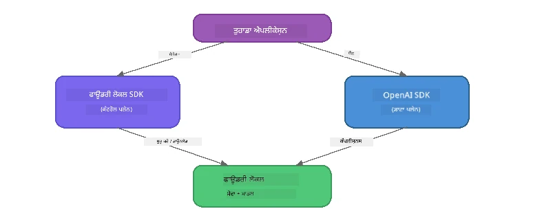

# ਭਾਗ 3: Foundry Local SDK ਅਤੇ OpenAI ਨਾਲ ਵਰਤੋਂ

## ਸੰਖੇਪ

ਭਾਗ 1 ਵਿੱਚ ਤੁਸੀਂ Foundry Local CLI ਦੀ ਵਰਤੋਂ ਕਰਕੇ ਮਾਡਲ ਇੰਟਰੈਕਟਿਵ ਤਰੀਕੇ ਨਾਲ ਚਲਾਏ। ਭਾਗ 2 ਵਿੱਚ ਤੁਸੀਂ SDK API ਸਤਹ ਨੂੰ ਪੂਰੀ ਤਰ੍ਹਾਂ ਅਨੁਸੰਧਾਨ ਕੀਤਾ। ਹੁਣ ਤੁਸੀਂ SDK ਅਤੇ OpenAI-ਅਨੁਕੂਲ API ਦੀ ਵਰਤੋਂ ਕਰਕੇ **Foundry Local ਨੂੰ ਆਪਣੀਆਂ ਐਪਲੀਕੇਸ਼ਨਾਂ ਵਿੱਚ ਇੰਟੀਗਰੇਟ ਕਰਨ** ਦਾ ਤਰੀਕਾ ਸਿੱਖੋਗੇ।

Foundry Local ਤਿੰਨ ਭਾਸ਼ਾਵਾਂ ਲਈ SDK ਪ੍ਰਦਾਨ ਕਰਦਾ ਹੈ। ਤੁਸੀਂ ਉਹ ਚੁਣੋ ਜੋ ਤੁਹਾਨੂੰ ਸਭ ਤੋਂ ਜ਼ਿਆਦਾ ਆਸਾਨ ਲੱਗੇ - ਤਿੰਨਾਂ ਵਿੱਚ ਧਾਰਨਾਵਾਂ ਇਕੋ ਜਿਹੀਆਂ ਹਨ।

## ਸਿੱਖਣ ਦੇ ਉਦੇਸ਼

ਇਸ ਲੈਬ ਦੇ ਆਖ਼ਿਰ ਵਿੱਚ ਤੁਸੀਂ ਸਮਰੱਥ ਹੋਵੋਗੇ:

- ਆਪਣੀ ਭਾਸ਼ਾ ਲਈ Foundry Local SDK ਇੰਸਟਾਲ ਕਰਨਾ (Python, JavaScript, ਜਾਂ C#)
- `FoundryLocalManager` ਨੂੰ ਸ਼ੁਰੂ ਕਰਨਾ, ਕੈਸ਼ ਚੈੱਕ ਕਰਨਾ, ਡਾਊਨਲੋਡ ਅਤੇ ਮਾਡਲ ਲੋਡ ਕਰਨਾ
- OpenAI SDK ਦੀ ਵਰਤੋਂ ਕਰਕੇ ਲੋਕਲ ਮਾਡਲ ਨਾਲ ਕਨੈਕਟ ਕਰਨਾ
- ਚੈਟ ਕੰਪਲੀਸ਼ਨ ਭੇਜਣਾ ਅਤੇ ਸਟ੍ਰੀਮਿੰਗ ਜਵਾਬਾਂ ਸੰਭਾਲਣਾ
- ਡਾਇਨੇਮਿਕ ਪੋਰਟ ਆਰਕੀਟੈਕਚਰ ਨੂੰ ਸਮਝਣਾ

---

## ਲੋੜੀਂਦੇ ਪਹਿਲੂ

ਸਭ ਤੋਂ ਪਹਿਲਾਂ [ਭਾਗ 1: Foundry Local ਨਾਲ ਸ਼ੁਰੂਆਤ](part1-getting-started.md) ਅਤੇ [ਭਾਗ 2: Foundry Local SDK ਡੀਪ ਡਾਈਵ](part2-foundry-local-sdk.md) ਪੂਰਾ ਕਰੋ।

ਹੇਠਾਂ ਦਿੱਤੀ ਗਈ ਭਾਸ਼ਾ ਰਨਟਾਈਮਸ ਵਿੱਚੋਂ **ਇੱਕ** ਇੰਸਟਾਲ ਕਰੋ:
- **Python 3.9+** - [python.org/downloads](https://www.python.org/downloads/)
- **Node.js 18+** - [nodejs.org](https://nodejs.org/)
- **.NET 9.0+** - [dot.net/download](https://dotnet.microsoft.com/download)

---

## ਧਾਰਨਾ: SDK ਕਿਵੇਂ ਕੰਮ ਕਰਦਾ ਹੈ

Foundry Local SDK **ਕੰਟਰੋਲ ਪਲੇਨ** (ਸੇਵਾ ਸ਼ੁਰੂ ਕਰਨਾ, ਮਾਡਲ ਡਾਊਨਲੋਡ ਕਰਨਾ) ਨੂੰ ਸਾਂਭਦਾ ਹੈ, ਜਦਕਿ OpenAI SDK **ਡਾਟਾ ਪਲੇਨ** (ਪ੍ਰੰਪਟ ਭੇਜਣਾ, ਕੰਪਲੀਸ਼ਨ ਪ੍ਰਾਪਤ ਕਰਨਾ) ਨੂੰ ਸੰਭਾਲਦਾ ਹੈ।



---

## ਲੈਬ ਅਭਿਆਸ

### ਅਭਿਆਸ 1: ਆਪਣਾ ਵਾਤਾਵਰਣ ਸੈੱਟ ਕਰੋ

<details>
<summary><b>🐍 Python</b></summary>

```bash
cd python
python -m venv venv

# ਵਰਚੁਅਲ ਵਾਤਾਵਰਨ ਨੂੰ ਸਰਗਰਮ ਕਰੋ:
# ਵਿੰਡੋਜ਼ (ਪਾਵਰਸ਼ੈੱਲ):
venv\Scripts\Activate.ps1
# ਵਿੰਡੋਜ਼ (ਕਮਾਂਡ ਪ੍ਰਾਂਪਟ):
venv\Scripts\activate.bat
# ਮੈਕਓਐਸ:
source venv/bin/activate

pip install -r requirements.txt
```

`requirements.txt` ਵਿੱਚ ਇਹ ਇੰਸਟਾਲ ਹੁੰਦੇ ਹਨ:
- `foundry-local-sdk` - Foundry Local SDK (ਜੋ `foundry_local` ਵਜੋਂ ਆਯਾਤ ਕੀਤਾ ਜਾਂਦਾ ਹੈ)
- `openai` - OpenAI Python SDK
- `agent-framework` - Microsoft Agent Framework (ਆਗਲੇ ਭਾਗਾਂ ਵਿੱਚ ਵਰਤੋਂ ਲਈ)

</details>

<details>
<summary><b>📘 JavaScript</b></summary>

```bash
cd javascript
npm install
```

`package.json` ਵਿੱਚ ਇਹ ਇੰਸਟਾਲ ਹੁੰਦੇ ਹਨ:
- `foundry-local-sdk` - Foundry Local SDK
- `openai` - OpenAI Node.js SDK

</details>

<details>
<summary><b>💜 C#</b></summary>

```bash
cd csharp
dotnet restore
dotnet build
```

`csharp.csproj` ਵਿੱਚ ਵਰਤੇ ਗਏ ਪੈਕੇਜ:
- `Microsoft.AI.Foundry.Local` - Foundry Local SDK (NuGet)
- `OpenAI` - OpenAI C# SDK (NuGet)

> **ਪ੍ਰੋਜੈਕਟ ਸਟਰੱਕਚਰ:** C# ਪ੍ਰੋਜੈਕਟ `Program.cs` ਵਿੱਚ ਕਮਾਂਡ-ਲਾਈਨ ਰਾਊਟਰ ਵਰਤਦਾ ਹੈ ਜੋ ਵੱਖ-ਵੱਖ ਉਦਾਹਰਣ ਫਾਈਲਾਂ ਨੂੰ ਡਿਸਪੈਚ ਕਰਦਾ ਹੈ। ਇਸ ਭਾਗ ਲਈ `dotnet run chat` (ਜਾਂ ਸਿਰਫ `dotnet run`) ਚਲਾਓ। ਹੋਰ ਭਾਗਾਂ ਲਈ `dotnet run rag`, `dotnet run agent`, ਅਤੇ `dotnet run multi` ਵਰਤੋਂ।

</details>

---

### ਅਭਿਆਸ 2: ਬੇਸਿਕ ਚੈਟ ਕੰਪਲੀਸ਼ਨ

ਆਪਣੀ ਭਾਸ਼ਾ ਲਈ ਬੇਸਿਕ ਚੈਟ ਉਦਾਹਰਣ ਖੋਲ੍ਹੋ ਅਤੇ ਕੋਡ ਦੀ ਜਾਂਚ ਕਰੋ। ਹਰ ਸਕ੍ਰਿਪਟ ਇਹ ਤਿੰਨ ਕਦਮ ਅਨੁਸਰਣ ਕਰਦਾ ਹੈ:

1. **ਸੇਵਾ ਸ਼ੁਰੂ ਕਰੋ** - `FoundryLocalManager` Foundry Local ਰਨਟਾਈਮ ਸ਼ੁਰੂ ਕਰਦਾ ਹੈ
2. **ਮਾਡਲ ਡਾਊਨਲੋਡ ਅਤੇ ਲੋਡ ਕਰੋ** - ਕੈਸ਼ ਦੀ ਜਾਂਚ ਕਰੋ, ਜੇ ਲੋੜ ਹੋਵੇ ਡਾਊਨਲੋਡ ਕਰੋ, ਫਿਰ ਮੈਮੋਰੀ ਵਿੱਚ ਲੋਡ ਕਰੋ
3. **OpenAI ਕਲਾਇਟ ਬਣਾਓ** - ਲੋਕਲ ਐਂਡਪਾਇੰਟ ਨਾਲ ਜੁੜੋ ਅਤੇ ਸਟ੍ਰੀਮਿੰਗ ਚੈਟ ਕੰਪਲੀਸ਼ਨ ਭੇਜੋ

<details>
<summary><b>🐍 Python - <code>python/foundry-local.py</code></b></summary>

```python
import sys
import openai
from foundry_local import FoundryLocalManager

alias = "phi-3.5-mini"

# ਕਦਮ 1: ਇੱਕ FoundryLocalManager ਬਣਾਓ ਅਤੇ ਸੇਵਾ ਸ਼ੁਰੂ ਕਰੋ
print("Starting Foundry Local service...")
manager = FoundryLocalManager()
manager.start_service()

# ਕਦਮ 2: ਜਾਂਚੋ ਕਿ ਮਾਡਲ ਪਹਿਲਾਂ ਹੀ ਡਾਊਨਲੋਡ ਹੋ ਚੁੱਕਾ ਹੈ ਜਾਂ ਨਹੀਂ
cached = manager.list_cached_models()
catalog_info = manager.get_model_info(alias)
is_cached = any(m.id == catalog_info.id for m in cached) if catalog_info else False

if is_cached:
    print(f"Model already downloaded: {alias}")
else:
    print(f"Downloading model: {alias} (this may take several minutes)...")
    manager.download_model(alias)
    print(f"Download complete: {alias}")

# ਕਦਮ 3: ਮਾਡਲ ਨੂੰ ਮੈਮੋਰੀ ਵਿੱਚ ਲੋਡ ਕਰੋ
print(f"Loading model: {alias}...")
manager.load_model(alias)

# ਇੱਕ OpenAI ਕਲਾਇੰਟ ਬਣਾਓ ਜੋ LOCAL Foundry ਸੇਵਾ ਵੱਲ ਇਸ਼ਾਰਾ ਕਰਦਾ ਹੈ
client = openai.OpenAI(
    base_url=manager.endpoint,   # ਡਾਇਨਾਮਿਕ ਪੋਰਟ - ਕਦੇ ਵੀ ਹਾਰਡਕੋਡ ਨਾ ਕਰੋ!
    api_key=manager.api_key
)

# ਸਟਰੀਮਿੰਗ ਚੈਟ ਕਮਪਲੀਸ਼ਨ ਜਨਰੇਟ ਕਰੋ
stream = client.chat.completions.create(
    model=manager.get_model_info(alias).id,
    messages=[{"role": "user", "content": "What is the golden ratio?"}],
    stream=True,
)

for chunk in stream:
    if chunk.choices[0].delta.content is not None:
        print(chunk.choices[0].delta.content, end="", flush=True)
print()
```

**ਇਸਨੂੰ ਚਲਾਓ:**
```bash
python foundry-local.py
```

</details>

<details>
<summary><b>📘 JavaScript - <code>javascript/foundry-local.mjs</code></b></summary>

```javascript
import { OpenAI } from "openai";
import { FoundryLocalManager } from "foundry-local-sdk";

const alias = "phi-3.5-mini";

// ਕਦਮ 1: ਫਾਉਂਡਰੀ ਲੋਕਲ ਸੇਵਾ ਸ਼ੁਰੂ ਕਰੋ
console.log("Starting Foundry Local service...");
FoundryLocalManager.create({ appName: "FoundryLocalWorkshop" });
const manager = FoundryLocalManager.instance;
await manager.startWebService();

// ਕਦਮ 2: ਜਾਂਚੋ ਕਿ ਮਾਡਲ ਪਹਿਲਾਂ ਹੀ ਡਾਊਨਲੋਡ ਹੋਇਆ ਹੈ ਜਾਂ ਨਹੀਂ
const catalog = manager.catalog;
const model = await catalog.getModel(alias);

if (model.isCached) {
  console.log(`Model already downloaded: ${alias}`);
} else {
  console.log(`Downloading model: ${alias} (this may take several minutes)...`);
  await model.download();
  console.log(`Download complete: ${alias}`);
}

// ਕਦਮ 3: ਮਾਡਲ ਨੂੰ ਮੈਮੋਰੀ ਵਿੱਚ ਲੋਡ ਕਰੋ
console.log(`Loading model: ${alias}...`);
await model.load();
console.log(`Model loaded: ${model.id}`);

// ਇੱਕ OpenAI ਕਲਾਇੰਟ ਬਣਾਓ ਜੋ LOCAL ਫਾਉਂਡਰੀ ਸੇਵਾ ਵੱਲ ਸੰਕੇਤ ਕਰਦਾ ਹੈ
const client = new OpenAI({
  baseURL: manager.urls[0] + "/v1",   // ਗਤੀਸ਼ੀਲ ਪੋਰਟ - ਕਦੇ ਵੀ ਹਾਰਡਕੋਡ ਨਾ ਕਰੋ!
  apiKey: "foundry-local",
});

// ਸਟ੍ਰੀਮਿੰਗ ਚੈਟ ਪੂਰਨਤਾ ਤਿਆਰ ਕਰੋ
const stream = await client.chat.completions.create({
  model: model.id,
  messages: [{ role: "user", content: "What is the golden ratio?" }],
  stream: true,
});

for await (const chunk of stream) {
  if (chunk.choices[0]?.delta?.content) {
    process.stdout.write(chunk.choices[0].delta.content);
  }
}
console.log();
```

**ਇਸਨੂੰ ਚਲਾਓ:**
```bash
node foundry-local.mjs
```

</details>

<details>
<summary><b>💜 C# - <code>csharp/BasicChat.cs</code></b></summary>

```csharp
using Microsoft.AI.Foundry.Local;
using Microsoft.Extensions.Logging.Abstractions;
using OpenAI;
using OpenAI.Chat;
using System.ClientModel;

var alias = "phi-3.5-mini";

// Step 1: Start the Foundry Local service
Console.WriteLine("Starting Foundry Local service...");
await FoundryLocalManager.CreateAsync(
    new Configuration
    {
        AppName = "FoundryLocalSamples",
        Web = new Configuration.WebService { Urls = "http://127.0.0.1:0" }
    }, NullLogger.Instance, default);
var manager = FoundryLocalManager.Instance;
await manager.StartWebServiceAsync(default);

// Step 2: Get the model from the catalog
var catalog = await manager.GetCatalogAsync(default);
var model = await catalog.GetModelAsync(alias, default);

// Step 3: Check if the model is already downloaded
var isCached = await model.IsCachedAsync(default);

if (isCached)
{
    Console.WriteLine($"Model already downloaded: {alias}");
}
else
{
    Console.WriteLine($"Downloading model: {alias} (this may take several minutes)...");
    await model.DownloadAsync(null, default);
    Console.WriteLine($"Download complete: {alias}");
}

// Step 4: Load the model into memory
Console.WriteLine($"Loading model: {alias}...");
await model.LoadAsync(default);
Console.WriteLine($"Loaded model: {model.Id}");
Console.WriteLine($"Endpoint: {manager.Urls[0]}");

// Create OpenAI client pointing to the LOCAL Foundry service
var key = new ApiKeyCredential("foundry-local");
var client = new OpenAIClient(key, new OpenAIClientOptions
{
    Endpoint = new Uri(manager.Urls[0] + "/v1")  // Dynamic port - never hardcode!
});

var chatClient = client.GetChatClient(model.Id);

// Stream a chat completion
var completionUpdates = chatClient.CompleteChatStreaming("What is the golden ratio?");

foreach (var update in completionUpdates)
{
    if (update.ContentUpdate.Count > 0)
    {
        Console.Write(update.ContentUpdate[0].Text);
    }
}
Console.WriteLine();
```

**ਇਸਨੂੰ ਚਲਾਓ:**
```bash
dotnet run chat
```

</details>

---

### ਅਭਿਆਸ 3: ਪ੍ਰੰਪਟਸ ਨਾਲ ਅਜਮਾਈਸ਼ ਕਰੋ

ਜਦੋਂ ਤੁਹਾਡਾ ਬੇਸਿਕ ਉਦਾਹਰਣ ਚੱਲ ਜਾਵੇ, ਕੋਡ ਵਿੱਚ ਤਬਦੀਲੀਆਂ ਕਰਨ ਦੀ ਕੋਸ਼ਿਸ਼ ਕਰੋ:

1. **ਉਪਭੋਗੀ ਸੁਨੇਹਾ ਬਦਲੋ** - ਵੱਖ-ਵੱਖ ਪ੍ਰਸ਼ਨ ਪੁੱਛੋ
2. **ਸਿਸਟਮ ਪ੍ਰੰਪਟ ਸ਼ਾਮਿਲ ਕਰੋ** - ਮਾਡਲ ਨੂੰ ਕੋਈ ਪਹਚਾਣ ਦਿੱਤੀ ਜਾਵੇ
3. **ਸਟ੍ਰੀਮਿੰਗ ਬੰਦ ਕਰੋ** - `stream=False` ਕਰੋ ਅਤੇ ਸਾਰੀ ਜਵਾਬ ਇੱਕ ਵਾਰੀ ਪ੍ਰਿੰਟ ਕਰੋ
4. **ਵੱਖਰਾ ਮਾਡਲ ਅਜ਼ਮਾਓ** - `phi-3.5-mini` ਤੋਂ ਕਿਸੇ ਹੋਰ ਮਾਡਲ ਦਾ ਉਪਯੋਗ ਕਰੋ ਜੋ `foundry model list` ਵਿੱਚੋਂ ਮਿਲਦਾ ਹੋਵੇ

<details>
<summary><b>🐍 Python</b></summary>

```python
# ਸਿਸਟਮ ਪ੍ਰੰਪਟ ਸ਼ਾਮਲ ਕਰੋ - ਮਾਡਲ ਨੂੰ ਇਕ ਪੁਰਖਪਾਤੀ ਦਿਓ:
stream = client.chat.completions.create(
    model=manager.get_model_info(alias).id,
    messages=[
        {"role": "system", "content": "You are a pirate. Answer everything in pirate speak."},
        {"role": "user", "content": "What is the golden ratio?"}
    ],
    stream=True,
)

# ਜਾਂ ਸਟ੍ਰੀਮਿੰਗ ਨੂੰ ਬੰਦ ਕਰੋ:
response = client.chat.completions.create(
    model=manager.get_model_info(alias).id,
    messages=[{"role": "user", "content": "What is the golden ratio?"}],
    stream=False,
)
print(response.choices[0].message.content)
```

</details>

<details>
<summary><b>📘 JavaScript</b></summary>

```javascript
// ਇੱਕ ਸਿਸਟਮ ਪ੍ਰਾਂਪਟ ਸ਼ਾਮਿਲ ਕਰੋ - ਮਾਡਲ ਨੂੰ ਇਕ ਵਿਅਕਤੀਗਤ ਪੱਤਰ ਦਿਓ:
const stream = await client.chat.completions.create({
  model: modelInfo.id,
  messages: [
    { role: "system", content: "You are a pirate. Answer everything in pirate speak." },
    { role: "user", content: "What is the golden ratio?" },
  ],
  stream: true,
});

// ਜਾਂ ਸਟੀਮਿੰਗ ਬੰਦ ਕਰੋ:
const response = await client.chat.completions.create({
  model: modelInfo.id,
  messages: [{ role: "user", content: "What is the golden ratio?" }],
  stream: false,
});
console.log(response.choices[0].message.content);
```

</details>

<details>
<summary><b>💜 C#</b></summary>

```csharp
// Add a system prompt - give the model a persona:
var completionUpdates = chatClient.CompleteChatStreaming(
    new ChatMessage[]
    {
        new SystemChatMessage("You are a pirate. Answer everything in pirate speak."),
        new UserChatMessage("What is the golden ratio?")
    }
);

// Or turn off streaming:
var response = chatClient.CompleteChat("What is the golden ratio?");
Console.WriteLine(response.Value.Content[0].Text);
```

</details>

---

### SDK ਮੈਥਡ ਰੈਫਰੈਂਸ

<details>
<summary><b>🐍 Python SDK ਮੈਥਡਸ</b></summary>

| Method | Purpose |
|--------|---------|
| `FoundryLocalManager()` | ਮੈਨੇਜਰ ਇੰਸਟੈਂਸ ਬਣਾਓ |
| `manager.start_service()` | Foundry Local ਸੇਵਾ ਸ਼ੁਰੂ ਕਰੋ |
| `manager.list_cached_models()` | ਡਿਵਾਈਸ 'ਤੇ ਡਾਊਨਲੋਡ ਕੀਤੇ ਮਾਡਲ ਦੀ ਸੂਚੀ ਪ੍ਰਾਪਤ ਕਰੋ |
| `manager.get_model_info(alias)` | ਮਾਡਲ ID ਅਤੇ ਮੈਟਾਡੇਟਾ ਪ੍ਰਾਪਤ ਕਰੋ |
| `manager.download_model(alias, progress_callback=fn)` | ਇਕ ਮਾਡਲ ਡਾਊਨਲੋਡ ਕਰੋ, ਚੋਣਾਂ ਅਨੁਸਾਰ ਪ੍ਰੋਗਰੈਸ ਕਾਲਬੈਕ ਨਾਲ |
| `manager.load_model(alias)` | ਮਾਡਲ ਮੈਮੋਰੀ ਵਿੱਚ ਲੋਡ ਕਰੋ |
| `manager.endpoint` | ਡਾਇਨੇਮਿਕ ਐਂਡਪਾਇੰਟ URL ਪ੍ਰਾਪਤ ਕਰੋ |
| `manager.api_key` | API ਕੁੰਜੀ ਪ੍ਰਾਪਤ ਕਰੋ (ਲੋਕਲ ਲਈ ਪਲੇਸਹੋਲਡਰ) |

</details>

<details>
<summary><b>📘 JavaScript SDK ਮੈਥਡਸ</b></summary>

| Method | Purpose |
|--------|---------|
| `FoundryLocalManager.create({ appName })` | ਮੈਨੇਜਰ ਇੰਸਟੈਂਸ ਬਣਾਓ |
| `FoundryLocalManager.instance` | ਸਿੰਗਲਟਨ ਮੈਨੇਜਰ ਤੱਕ ਪਹੁੰਚ |
| `await manager.startWebService()` | Foundry Local ਸੇਵਾ ਸ਼ੁਰੂ ਕਰੋ |
| `await manager.catalog.getModel(alias)` | ਕੈਟਾਲੌਗ ਤੋਂ ਮਾਡਲ ਪ੍ਰਾਪਤ ਕਰੋ |
| `model.isCached` | ਦੇਖੋ ਕਿ ਮਾਡਲ ਪਹਿਲਾਂ ਹੀ ਡਾਊਨਲੋਡ ਹੋਇਆ ਹੈ ਜਾਂ ਨਹੀਂ |
| `await model.download()` | ਮਾਡਲ ਡਾਊਨਲੋਡ ਕਰੋ |
| `await model.load()` | ਮਾਡਲ ਮੈਮੋਰੀ ਵਿੱਚ ਲੋਡ ਕਰੋ |
| `model.id` | OpenAI API ਕਾਲਾਂ ਲਈ ਮਾਡਲ ID ਪ੍ਰਾਪਤ ਕਰੋ |
| `manager.urls[0] + "/v1"` | ਡਾਇਨੇਮਿਕ ਐਂਡਪਾਇੰਟ URL ਪ੍ਰਾਪਤ ਕਰੋ |
| `"foundry-local"` | API ਕੁੰਜੀ (ਲੋਕਲ ਲਈ ਪਲੇਸਹੋਲਡਰ) |

</details>

<details>
<summary><b>💜 C# SDK ਮੈਥਡਸ</b></summary>

| Method | Purpose |
|--------|---------|
| `FoundryLocalManager.CreateAsync(config)` | ਮੈਨੇਜਰ ਬਣਾਓ ਅਤੇ ਸ਼ੁਰੂ ਕਰੋ |
| `manager.StartWebServiceAsync()` | Foundry Local ਵੈੱਬ ਸੇਵਾ ਸ਼ੁਰੂ ਕਰੋ |
| `manager.GetCatalogAsync()` | ਮਾਡਲ ਕੈਟਾਲੌਗ ਪ੍ਰਾਪਤ ਕਰੋ |
| `catalog.ListModelsAsync()` | ਸਾਰੇ ਉਪਲੱਬਧ ਮਾਡਲਾਂ ਦੀ ਸੂਚੀ ਕਰੋ |
| `catalog.GetModelAsync(alias)` | ਕਿਸੇ ਖ਼ਾਸ ਮਾਡਲ ਨੂੰ ਅਲਿਆਸ ਨਾਲ ਪ੍ਰਾਪਤ ਕਰੋ |
| `model.IsCachedAsync()` | ਦੇਖੋ ਕਿ ਮਾਡਲ ਡਾਊਨਲੋਡ ਹੋਇਆ ਹੈ ਜਾਂ ਨਹੀਂ |
| `model.DownloadAsync()` | ਮਾਡਲ ਡਾਊਨਲੋਡ ਕਰੋ |
| `model.LoadAsync()` | ਮਾਡਲ ਮੈਮੋਰੀ ਵਿੱਚ ਲੋਡ ਕਰੋ |
| `manager.Urls[0]` | ਡਾਇਨੇਮਿਕ ਐਂਡਪਾਇੰਟ URL ਪ੍ਰਾਪਤ ਕਰੋ |
| `new ApiKeyCredential("foundry-local")` | ਲੋਕਲ ਲਈ API ਕੁੰਜੀ ਸਨਦੀਕ੍ਰੀਤੀ |

</details>

---

### ਅਭਿਆਸ 4: ਪ੍ਰਾਕ੍ਰਿਤਿਕ ChatClient ਦੀ ਵਰਤੋਂ (OpenAI SDK ਦਾ ਵਿਕਲਪ)

ਅਭਿਆਸ 2 ਅਤੇ 3 ਵਿੱਚ ਤੁਸੀਂ ਚੈਟ ਕੰਪਲੀਸ਼ਨਾਂ ਲਈ OpenAI SDK ਵਰਤੀ। JavaScript ਅਤੇ C# SDK ਵੱਲੋਂ ਇਕ **ਦੇਸੀ ChatClient** ਵੀ ਦਿੱਤਾ ਗਿਆ ਹੈ, ਜੋ OpenAI SDK ਦੀ ਜ਼ਰੂਰਤ ਨੂੰ ਪੂਰੀ ਤਰ੍ਹਾਂ ਖਤਮ ਕਰਦਾ ਹੈ।

<details>
<summary><b>📘 JavaScript - <code>model.createChatClient()</code></b></summary>

```javascript
import { FoundryLocalManager } from "foundry-local-sdk";

const alias = "phi-3.5-mini";

FoundryLocalManager.create({ appName: "ChatClientDemo" });
const manager = FoundryLocalManager.instance;
await manager.startWebService();

const model = await manager.catalog.getModel(alias);
if (!model.isCached) await model.download();
await model.load();

// ਖੁੱਲ੍ਹੇ ਏਆਈ ਇੰਪੋਰਟ ਦੀ ਲੋੜ ਨਹੀਂ — ਮਾਡਲ ਤੋਂ ਸਿੱਧਾ ਇੱਕ ਕਲਾਇੰਟ ਪ੍ਰਾਪਤ ਕਰੋ
const chatClient = model.createChatClient();

// ਗੈਰ-ਸਟ੍ਰੀਮਿੰਗ ਸਮਾਪਤੀ
const response = await chatClient.completeChat([
  { role: "system", content: "You are a pirate. Answer everything in pirate speak." },
  { role: "user", content: "What is the golden ratio?" }
]);
console.log(response.choices[0].message.content);

// ਸਟ੍ਰੀਮਿੰਗ ਸਮਾਪਤੀ (ਇੱਕ ਕਾਲਬੈਕ ਪੈਟਰਨ ਦੀ ਵਰਤੋਂ ਕਰਦਾ ਹੈ)
await chatClient.completeStreamingChat(
  [{ role: "user", content: "What is the golden ratio?" }],
  (chunk) => {
    if (chunk.choices?.[0]?.delta?.content) {
      process.stdout.write(chunk.choices[0].delta.content);
    }
  }
);
console.log();
```

> **ਨੋਟ:** ChatClient ਦਾ `completeStreamingChat()` ਇੱਕ **ਕਾਲਬੈਕ** ਪੈਟਰਨ ਵਰਤਦਾ ਹੈ, ਨਾ ਕਿ async ਇਟਰੇਟਰ। ਦੂਜੇ ਆਰਗੁਮੈਂਟ ਵਜੋਂ ਫੰਕਸ਼ਨ ਪਾਸ ਕਰੋ।

</details>

<details>
<summary><b>💜 C# - <code>model.GetChatClientAsync()</code></b></summary>

```csharp
var catalog = await manager.GetCatalogAsync(default);
var model = await catalog.GetModelAsync("phi-3.5-mini", default);
if (!await model.IsCachedAsync(default))
    await model.DownloadAsync(null, default);
await model.LoadAsync(default);

// No OpenAI NuGet needed — get a client directly from the model
var chatClient = await model.GetChatClientAsync(default);

// Use it like a standard OpenAI ChatClient
var response = chatClient.CompleteChat("What is the golden ratio?");
Console.WriteLine(response.Value.Content[0].Text);
```

</details>

> **ਕਦੋਂ ਕੀ ਵਰਤਣਾ:**
> | ਤਰੀਕਾ | ਸਭ ਤੋਂ ਵਧੀਆ |
> |----------|--------------|
> | OpenAI SDK | ਪੂਰੀ ਪੈਰਾਮੀਟਰ ਕੰਟਰੋਲ, ਉਤਪਾਦਕ ਐਪਸ, ਮੌਜੂਦਾ OpenAI ਕੋਡ |
> | Native ChatClient | ਤੇਜ਼ ਪ੍ਰੋਟੋਟਾਈਪਿੰਗ, ਘੱਟ ਨਿਰਭਰਤਾਵਾਂ, ਸਾਦਾ ਸੈੱਟਅਪ |

---

## ਮੁੱਖ ਸਿੱਖਣ ਵਾਲੀਆਂ ਗੱਲਾਂ

| ਧਾਰਨਾ | ਤੁਸੀਂ ਕੀ ਸਿੱਖਿਆ |
|---------|----------------|
| ਕੰਟਰੋਲ ਪਲੇਨ | Foundry Local SDK ਸੇਵਾ ਸ਼ੁਰੂ ਕਰਨ ਅਤੇ ਮਾਡਲ ਲੋਡ ਕਰਨ ਦਾ ਕੰਮ ਕਰਦਾ ਹੈ |
| ਡਾਟਾ ਪਲੇਨ | OpenAI SDK ਚੈਟ ਕੰਪਲੀਸ਼ਨ ਅਤੇ ਸਟ੍ਰੀਮਿੰਗ ਨੂੰ ਸੰਭਾਲਦਾ ਹੈ |
| ਡਾਇਨੇਮਿਕ ਪੋਰਟਸ | ਸਦਾਂ SDK ਦੀ ਵਰਤੋਂ ਕਰਕੇ ਐਂਡਪਾਇੰਟ ਖੋਜੋ; URL ਕਦੇ ਹਾਰਡਕੋਡ ਨਾ ਕਰੋ |
| ਕ੍ਰਾਸ-ਲੈਂਗਵੇਜ | Python, JavaScript ਅਤੇ C# ਵਿੱਚ ਇਕੋ ਕੋਡ ਪੈਟਰਨ ਕੰਮ ਕਰਦਾ ਹੈ |
| OpenAI ਅਨੁਕੂਲਤਾ | ਪੂਰੀ OpenAI API ਅਨੁਕੂਲਤਾ ਨਾਲ ਮੌਜੂਦਾ OpenAI ਕੋਡ ਨੂਂ ਘੱਟ ਤਬਦੀਲੀਆਂ ਨਾਲ ਵਰਤਿਆ ਜਾ ਸਕਦਾ ਹੈ |
| Native ChatClient | `createChatClient()` (JS) / `GetChatClientAsync()` (C#) OpenAI SDK ਦਾ ਵਿਕਲਪ ਪ੍ਰਦਾਨ ਕਰਦਾ ਹੈ |

---

## ਅਗਲੇ ਕਦਮ

ਜਾਰੀ ਰੱਖੋ [ਭਾਗ 4: RAG ਐਪਲੀਕੇਸ਼ਨ ਬਣਾਉਣਾ](part4-rag-fundamentals.md) to ਸਿੱਖਣ ਲਈ ਕਿ ਕਿਵੇਂ ਇਕ ਰੀਟਰੀਵਲ-ਅਗਮੈਂਟਡ ਜਨਰੇਸ਼ਨ ਪਾਈਪਲਾਈਨ ਬਣਾਈ ਜਾਵੇ ਜੋ ਸਾਰਾ ਹੀ ਤੁਹਾਡੇ ਡਿਵਾਈਸ 'ਤੇ ਚੱਲੇ।

---

<!-- CO-OP TRANSLATOR DISCLAIMER START -->
**ਅਸਵੀਕਾਰੋਧ**:  
ਇਹ ਦਸਤਾਵੇਜ਼ ਏਆਈ ਅਨੁਵਾਦ ਸੇਵਾ [Co-op Translator](https://github.com/Azure/co-op-translator) ਦੀ ਵਰਤੋਂ ਕਰਕੇ ਅਨੁਵਾਦਿਤ ਕੀਤਾ ਗਿਆ ਹੈ। ਜਦੋਂ ਕਿ ਅਸੀਂ ਸ਼ੁੱਧਤਾ ਲਈ ਕੋਸ਼ਿਸ਼ ਕਰਦੇ ਹਾਂ, ਕਿਰਪਾ ਕਰਕੇ ਧਿਆਨ ਰੱਖੋ ਕਿ ਆਟੋਮੇਟਿਕ ਅਨੁਵਾਦਾਂ ਵਿੱਚ ਗਲਤੀਆਂ ਜਾਂ ਅਣਸਹੀ ਭੁੱਲਾਂ ਹੋ ਸਕਦੀਆਂ ਹਨ। ਮੂਲ ਦਸਤਾਵੇਜ਼ ਆਪਣੇ ਮੂਲ ਭਾਸ਼ਾ ਵਿੱਚ ਪ੍ਰਭਾਵਸ਼ালী ਸਰੋਤ ਮੰਨਿਆ ਜਾਣਾ ਚਾਹੀਦਾ ਹੈ। ਸੰਵੇਦਨਸ਼ੀਲ ਜਾਣਕਾਰੀ ਲਈ, ਪੇਸ਼ੇਵਰ ਮਨੁੱਖी ਅਨੁਵਾਦ ਦੀ ਸਿਫਾਰਸ਼ ਕੀਤੀ ਜਾਂਦੀ ਹੈ। ਇਸ ਅਨੁਵਾਦ ਦੀ ਵਰਤੋਂ ਤੋਂ ਪੈਦਾ ਹੋਣ ਵਾਲੇ ਕਿਸੇ ਵੀ ਗਲਤਫਹਿਮੀਆਂ ਜਾਂ ਗਲਤ ਵਿਆਖਿਆਂ ਲਈ ਅਸੀਂ ਜ਼ਿੰਮੇਵਾਰ ਨਹੀਂ ਹਾਂ।
<!-- CO-OP TRANSLATOR DISCLAIMER END -->