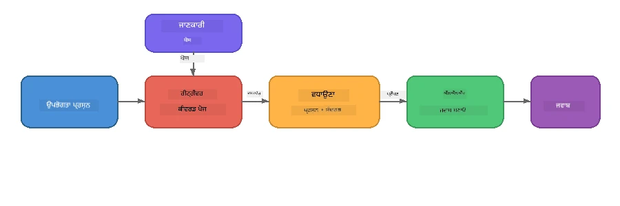

# ਭਾਗ 4: Foundry Local ਨਾਲ RAG ਐਪਲੀਕੇਸ਼ਨ ਬਣਾਉਣਾ

## اوورویو

ਵੱਡੇ ਭਾਸ਼ਾ ਮਾਡਲ ਸ਼ਕਤੀਸ਼ਾਲੀ ਹਨ, ਪਰ ਉਹ ਸਿਰਫ਼ ਉਹੀ ਜਾਣਦੇ ਹਨ ਜੋ ਉਨ੍ਹਾਂ ਦੇ ਟਰੇਨਿੰਗ ਡਾਟਾ ਵਿੱਚ ਸੀ। **ਰੀਟਰੀਵਲ-ਆਗਮੈਂਟਿਡ ਜਨਰੇਸ਼ਨ (RAG)** ਇਹ ਸਮੱਸਿਆ ਹੱਲ ਕਰਦਾ ਹੈ ਮਾਡਲ ਨੂੰ ਕੁਝ ਸੰਦਰਭ ਰੀਕਵੈਸਟ ਦੇ ਸਮੇਂ ਦਿੰਦਾ ਹੈ - ਜੋ ਤੁਹਾਡੇ ਆਪਣੇ ਦਸਤਾਵੇਜ਼ਾਂ, ਡੇਟਾਬੇਸਾਂ ਜਾਂ ਗਿਆਨ ਦੇ ਮੇਲਿਆਂ ਤੋਂ ਖਿੱਚਿਆ ਜਾਂਦਾ ਹੈ।

ਇਸ ਲੈਬ ਵਿੱਚ ਤੁਸੀਂ ਇਕ ਪੂਰਾ RAG ਪਾਈਪਲਾਈਨ ਬਣਾਵੋਗੇ ਜੋ ਪੂਰੀ ਤਰ੍ਹਾਂ ਤੁਹਾਡੇ ਡਿਵਾਈਸ 'ਤੇ ਚਲਦਾ ਹੈ ਫਾਉਂਡਰੀ ਲੋਕਲ ਦੀ ਵਰਤੋਂ ਕਰਕੇ। ਕੋਈ ਕਲਾਊਡ ਸਰਵਿਸ, ਕੋਈ ਵੇਕਟਰ ਡੇਟਾਬੇਸ, ਕੋਈ ਐਮਬੈੱਡਿੰਗਸ API ਨਹੀਂ - ਸਿਰਫ ਸਥਾਨਕ ਰੀਟਰੀਵਲ ਅਤੇ ਸਥਾਨਕ ਮਾਡਲ।

## ਸਿੱਖਣ ਦੇ ਉਦੇਸ਼

ਇਸ ਲੈਬ ਦੇ ਅੰਤ ਤੱਕ ਤੁਸੀਂ ਸਮਝਣ ਯੋਗ ਹੋਵੋਗੇ ਕਿ:

- RAG ਕੀ ਹੈ ਅਤੇ ਇਹ AI ਐਪਲੀਕੇਸ਼ਨਾਂ ਲਈ ਕਿਉਂ ਮਹੱਤਵਪੂਰਨ ਹੈ
- ਲਿਖਤੀ ਦਸਤਾਵੇਜ਼ਾਂ ਤੋਂ ਸਥਾਨਕ ਗਿਆਨ ਬੇਸ ਬਣਾਉਣਾ
- ਸਬੰਧਤ ਸੰਦਰਭ ਲੱਭਣ ਲਈ ਇੱਕ ਸਧਾਰਣ ਰੀਟਰੀਵਲ ਫੰਕਸ਼ਨ ਲਾਗੂ ਕਰਨਾ
- ਇਕ ਸਿਸਟਮ ਪ੍ਰਾਂਪਟ ਬਣਾਉਣਾ ਜੋ ਮਾਡਲ ਨੂੰ ਪ੍ਰਾਪਤ ਹੋਏ ਤੱਥਾਂ 'ਤੇ ਆਧਾਰਿਤ ਕਰਦਾ ਹੈ
- ਡਿਵਾਈਸ 'ਤੇ ਪੂਰਾ Retrieve → Augment → Generate ਪਾਈਪਲਾਈਨ ਚਲਾਉਣਾ
- ਸਧਾਰਣ ਕੀਵਰਡ ਰੀਟਰੀਵਲ ਅਤੇ ਵੇਕਟਰ ਖੋਜ ਵਿਚਕਾਰ ਵਪਾਰ-ਅਪਸਾਰ ਸਮਝਣਾ

---

## ਜ਼ਰੂਰੀਆਂ ਸ਼ਰਤਾਂ

- [ਭਾਗ 3: Foundry Local SDK ਲਈ OpenAI ਦੀ ਵਰਤੋਂ](part3-sdk-and-apis.md) ਨੂੰ ਪੂਰਾ ਕਰੋ
- Foundry Local CLI ਇੰਸਟਾਲ ਕੀਤਾ ਹੋਇਆ ਅਤੇ `phi-3.5-mini` ਮਾਡਲ ਡਾਊਨਲੋਡ ਕੀਤਾ ਹੋਇਆ

---

## ਧਾਰਣਾ: RAG ਕੀ ਹੈ?

RAG ਦੇ ਬਿਨਾਂ, ਇੱਕ LLM ਸਿਰਫ ਆਪਣੇ ਟ੍ਰੇਨਿੰਗ ਡਾਟਾ ਵਿੱਚੋਂ ਸਵਾਲਾਂ ਦੀ ਉੱਤਰ ਦੇ ਸਕਦਾ ਹੈ - ਜੋ ਕਿ ਕਦਾਚਿਤ ਪੁਰਾਣਾ, ਅਧੂਰਾ ਜਾਂ ਤੁਹਾਡੇ ਨਿੱਜੀ ਜਾਣਕਾਰੀ ਤੋਂ ਬਿਨਾਂ ਹੋ ਸਕਦਾ ਹੈ:

```
User: "What is Zava's return policy?"
LLM:  "I do not have information about Zava's return policy."  ← No context!
```

RAG ਨਾਲ, ਤੁਸੀਂ ਪਹਿਲਾਂ **ਸਬੰਧਤ ਦਸਤਾਵੇਜ਼ ਰੀਟਰੀਵ ਕਰਦੇ ਹੋ**, ਫਿਰ ਪ੍ਰਾਂਪਟ ਨੂੰ ਉਸ ਸੰਦਰਭ ਨਾਲ **ਆਗਮੈਂਟ** ਕਰਦੇ ਹੋ ਅਤੇ ਅੰਤ ਵਿੱਚ **ਜਨਰੇਟ** ਕਰਦੇ ਹੋ:



ਮੁੱਖ ਸਮਝ: **ਮਾਡਲ ਨੂੰ ਜਵਾਬ "ਜਾਣਨ" ਦੀ ਲੋੜ ਨਹੀਂ; ਇਸਨੂੰ ਸਿਰਫ ਸਹੀ ਦਸਤਾਵੇਜ਼ ਪੜ੍ਹਨ ਦੀ ਜਰੂਰਤ ਹੈ।**

---

## ਲੈਬ ਕਸਰਤਾਂ

### ਕਸਰਤ 1: ਗਿਆਨ ਬੇਸ ਸਮਝਣਾ

ਆਪਣੀ ਭਾਸ਼ਾ ਲਈ RAG ਉਦਾਹਰਣ ਖੋਲ੍ਹੋ ਅਤੇ ਗਿਆਨ ਬੇਸ ਦੀ ਜਾਂਚ ਕਰੋ:

<details>
<summary><b>🐍 ਪਾਇਥਨ: <code>python/foundry-local-rag.py</code></b></summary>

ਗਿਆਨ ਬੇਸ ਸਧਾਰਣ ਡਿਕਸ਼ਨਰੀਆਂ ਦੀ ਸੂਚੀ ਹੈ ਜਿਸ ਵਿੱਚ `title` ਅਤੇ `content` ਫੀਲਡ ਹਨ:

```python
KNOWLEDGE_BASE = [
    {
        "title": "Foundry Local Overview",
        "content": (
            "Foundry Local brings the power of Azure AI Foundry to your local "
            "device without requiring an Azure subscription..."
        ),
    },
    {
        "title": "Supported Hardware",
        "content": (
            "Foundry Local automatically selects the best model variant for "
            "your hardware. If you have an Nvidia CUDA GPU it downloads the "
            "CUDA-optimized model..."
        ),
    },
    # ... ਹੋਰ ਦਾਖਲੇ
]
```

ਹਰ ਇਕ ਐਂਟਰੀ "ਜਾਣਕਾਰੀ ਦਾ ਹਿੱਸਾ" ਦਰਸਾਉਂਦੀ ਹੈ - ਇੱਕ ਵਿਸ਼ੇ 'ਤੇ ਕੇਂਦਰਿਤ ਜਾਣਕਾਰੀ ਦਾ ਟੁਕੜਾ।

</details>

<details>
<summary><b>📘 ਜਾਵਾਸਕ੍ਰਿਪਟ: <code>javascript/foundry-local-rag.mjs</code></b></summary>

ਗਿਆਨ ਬੇਸ ਇੱਕ ਆਬਜੈਕਟਾਂ ਦੀ ਸੂਚੀ ਦੀ ਢਾਂਚਾ ਵਰਤਦਾ ਹੈ:

```javascript
const KNOWLEDGE_BASE = [
  {
    title: "Foundry Local Overview",
    content:
      "Foundry Local brings the power of Azure AI Foundry to your local " +
      "device without requiring an Azure subscription...",
  },
  {
    title: "Supported Hardware",
    content:
      "Foundry Local automatically selects the best model variant for " +
      "your hardware...",
  },
  // ... ਹੋਰ ਦਰਜ਼ਾਂ
];
```

</details>

<details>
<summary><b>💜 C#: <code>csharp/RagPipeline.cs</code></b></summary>

ਗਿਆਨ ਬੇਸ ਨਾਂ ਵਾਲੇ ਟਿਊਪਲਾਂ ਦੀ ਸੂਚੀ ਵਰਤਦਾ ਹੈ:

```csharp
private static readonly List<(string Title, string Content)> KnowledgeBase =
[
    ("Foundry Local Overview",
     "Foundry Local brings the power of Azure AI Foundry to your local " +
     "device without requiring an Azure subscription..."),

    ("Supported Hardware",
     "Foundry Local automatically selects the best model variant for " +
     "your hardware..."),

    // ... more entries
];
```

</details>

> **ਇੱਕ ਅਸਲ ਐਪਲੀਕੇਸ਼ਨ ਵਿੱਚ**, ਗਿਆਨ ਬੇਸ ਫਾਈਲਾਂ, ਡੇਟਾਬੇਸ, ਖੋਜ ਇੰਡੈਕਸ ਜਾਂ API ਤੋਂ ਆਵੇਗਾ। ਇਸ ਲੈਬ ਲਈ, ਅਸੀਂ ਸਿਮਪਲ ਬਣਾਉਣ ਲਈ ਏਕ ਮੈਮੋਰੀ ਸੂਚੀ ਦੀ ਵਰਤੋਂ ਕਰਦੇ ਹਾਂ।

---

### ਕਸਰਤ 2: ਰੀਟਰੀਵਲ ਫੰਕਸ਼ਨ ਸਮਝਣਾ

ਰੀਟਰੀਵਲ ਕਦਮ ਉਪਭੋਗਤਾ ਦੇ ਸਵਾਲ ਲਈ ਸਭ ਤੋਂ ਸਬੰਧਤ ਚੰਕ ਲੱਭਦਾ ਹੈ। ਇਹ ਉਦਾਹਰਣ **ਕੀਵਰਡ ਓਵਰਲੈਪ** ਵਰਤਦਾ ਹੈ - ਕਿ ਕਿੰਨੇ ਸ਼ਬਦ ਕਵੈਰੀ ਵਿੱਚ ਅਤੇ ਹਰ ਚੰਕ ਵਿੱਚ ਮੌਜੂਦ ਹਨ:

<details>
<summary><b>🐍 ਪਾਇਥਨ</b></summary>

```python
def retrieve(query: str, top_k: int = 2) -> list[dict]:
    """Return the top-k knowledge chunks most relevant to the query."""
    query_words = set(query.lower().split())
    scored = []
    for chunk in KNOWLEDGE_BASE:
        chunk_words = set(chunk["content"].lower().split())
        overlap = len(query_words & chunk_words)
        scored.append((overlap, chunk))
    scored.sort(key=lambda x: x[0], reverse=True)
    return [item[1] for item in scored[:top_k]]
```

</details>

<details>
<summary><b>📘 ਜਾਵਾਸਕ੍ਰਿਪਟ</b></summary>

```javascript
function retrieve(query, topK = 2) {
  const queryWords = new Set(query.toLowerCase().split(/\s+/));
  const scored = KNOWLEDGE_BASE.map((chunk) => {
    const chunkWords = new Set(chunk.content.toLowerCase().split(/\s+/));
    let overlap = 0;
    for (const w of queryWords) {
      if (chunkWords.has(w)) overlap++;
    }
    return { overlap, chunk };
  });
  scored.sort((a, b) => b.overlap - a.overlap);
  return scored.slice(0, topK).map((s) => s.chunk);
}
```

</details>

<details>
<summary><b>💜 C#</b></summary>

```csharp
private static List<(string Title, string Content)> Retrieve(string query, int topK = 2)
{
    var queryWords = new HashSet<string>(
        query.ToLowerInvariant().Split(' ', StringSplitOptions.RemoveEmptyEntries));

    return KnowledgeBase
        .Select(chunk =>
        {
            var chunkWords = new HashSet<string>(
                chunk.Content.ToLowerInvariant().Split(' ', StringSplitOptions.RemoveEmptyEntries));
            var overlap = queryWords.Intersect(chunkWords).Count();
            return (Overlap: overlap, Chunk: chunk);
        })
        .OrderByDescending(x => x.Overlap)
        .Take(topK)
        .Select(x => x.Chunk)
        .ToList();
}
```

</details>

**ਕਿਵੇਂ ਕੰਮ ਕਰਦਾ ਹੈ:**
1. ਕਵੈਰੀ ਨੂੰ ਵੱਖਰੇ ਸ਼ਬਦਾਂ ਵਿੱਚ ਵੰਡੋ
2. ਹਰ ਗਿਆਨ ਚੰਕ ਲਈ, ਗਿਣਤੀ ਕਰੋ ਕਿ ਕਿੰਨੇ ਕਵੈਰੀ ਸ਼ਬਦ ਉਸ ਚੰਕ ਵਿੱਚ ਹਨ
3. ਓਵਰਲੈਪ ਸਕੋਰ ਨਾਲ ਛਾਂਟੋ (ਸਭ ਤੋਂ ਵੱਧ ਪਹਿਲਾਂ)
4. ਸਿਖਰ ਦੇ-k ਸਭ ਤੋਂ ਸਬੰਧਤ ਚੰਕ ਵਾਪਸ ਕਰੋ

> **ਵਪਾਰ-ਅਪਸਾਰ:** ਕੀਵਰਡ ਓਵਰਲੈਪ ਸਾਦਾ ਹੈ ਪਰ ਸੀਮਿਤ; ਇਹ ਪਰੋਨਾਮ ਜਾਂ ਅਰਥ ਨੂੰ ਸਮਝਦਾ ਨਹੀਂ। ਉਤਪਾਦਨ RAG ਸਿਸਟਮ ਜ਼ਿਆਦਾਤਰ **ਐਮਬੈੱਡਿੰਗ ਵੇਕਟਰਾਂ** ਅਤੇ **ਵੇਕਟਰ ਡੇਟਾਬੇਸ** ਵਰਗੇ ਸੈਮੈਂਟਿਕ ਖੋਜ ਲਈ ਵਰਤਦੇ ਹਨ। ਫਿਰ ਵੀ, ਕੀਵਰਡ ਓਵਰਲੈਪ ਇੱਕ ਵਧੀਆ ਸ਼ੁਰੂਆਤ ਹੈ ਅਤੇ ਕਿਸੇ ਹੋਰ ਡੀਪੈਂਡੇੰਸੀ ਦੀ ਲੋੜ ਨਹੀਂ।

---

### ਕਸਰਤ 3: ਆਗਮੈਂਟਿਡ ਪ੍ਰਾਂਪਟ ਸਮਝਣਾ

ਪ੍ਰਾਪਤ ਕੀਤਾ ਸੰਦਰਭ **ਸਿਸਟਮ ਪ੍ਰਾਂਪਟ** ਵਿੱਚ ਡਾਲਿਆ ਜਾਂਦਾ ਹੈ ਅੱਗੇ ਮਾਡਲ ਨੂੰ ਭੇਜਣ ਤੋਂ ਪਹਿਲਾਂ:

```python
system_prompt = (
    "You are a helpful assistant. Answer the user's question using ONLY "
    "the information provided in the context below. If the context does "
    "not contain enough information, say so.\n\n"
    f"Context:\n{context_text}"
)
```

ਮੁੱਖ ਡਿਜ਼ਾਈਨ ਫੈਸਲੇ:
- **"ਸਿਰਫ ਦਿੱਤੀ ਗਈ ਜਾਣਕਾਰੀ"** - ਮਾਡਲ ਨੂੰ ਸੰਦਰਭ ਤੋਂ ਬਿਨਾ ਤੱਥਾਂ ਦੀ ਕਲਪਨਾ ਕਰਨ ਤੋਂ ਰੋਕਦਾ ਹੈ
- **"ਜੇ ਸੰਦਰਭ ਵਿੱਚ ਪੂਰੀ ਜਾਣਕਾਰੀ ਨਹੀਂ ਹੈ, ਤਾਂ ਕਹੋ"** - ਸੱਚਾਈ ਵਾਲੇ "ਮੈਨੂੰ نہیں ਪਤਾ" ਜਵਾਬਾਂ ਨੂੰ ਪ੍ਰੋਤਸਾਹਿਤ ਕਰਦਾ ਹੈ
- ਸੰਦਰਭ ਸਿਸਟਮ ਸੁਨੇਹੇ ਵਿੱਚ ਰੱਖਿਆ ਜਾਂਦਾ ਹੈ ਤਾਂ ਕਿ ਸਾਰੇ ਉੱਤਰਾਂ ਨੂੰ ਆਕਾਰ ਦੇ ਸਕੇ

---

### ਕਸਰਤ 4: RAG ਪਾਈਪਲਾਈਨ ਚਲਾਉਣਾ

ਪੂਰਾ ਉਦਾਹਰਣ ਚਲਾਓ:

**ਪਾਇਥਨ:**
```bash
cd python
python foundry-local-rag.py
```

**ਜਾਵਾਸਕ੍ਰਿਪਟ:**
```bash
cd javascript
node foundry-local-rag.mjs
```

**C#:**
```bash
cd csharp
dotnet run rag
```

ਤੁਹਾਨੂੰ ਤਿੰਨ ਚੀਜ਼ਾਂ ਪ੍ਰਿੰਟ ਹੋਣੀਆਂ ਚਾਹੀਦੀਆਂ ਹਨ:
1. ਪੁੱਛਿਆ ਗਿਆ **ਸਵਾਲ**
2. ਪ੍ਰਾਪਤ ਕੀਤਾ ਗਿਆ **ਸੰਦਰਭ** - ਗਿਆਨ ਬੇਸ ਵਿੱਚੋਂ ਚੁਣੇ ਗਏ ਚੰਕ
3. **ਜਵਾਬ** - ਜਿਸਨੂੰ ਸਿਰਫ ਉਸ ਸੰਦਰਭ ਨਾਲ ਮਾਡਲ ਵੱਲੋਂ ਬਣਾਇਆ ਗਿਆ

ਉਦਾਹਰਣ ਨਤੀਜਾ:
```
Question: How do I install Foundry Local and what hardware does it support?

--- Retrieved Context ---
### Installation
On Windows install Foundry Local with: winget install Microsoft.FoundryLocal...

### Supported Hardware
Foundry Local automatically selects the best model variant for your hardware...
-------------------------

Answer: To install Foundry Local, you can use the following methods depending
on your operating system: On Windows, run `winget install Microsoft.FoundryLocal`.
On macOS, use `brew install microsoft/foundrylocal/foundrylocal`...
```

ਨੋਟ ਕਰੋ ਕਿ ਮਾਡਲ ਦਾ ਜਵਾਬ ਪ੍ਰਾਪਤ ਸੰਦਰਭ ਵਿੱਚ **ਆਧਾਰਿਤ** ਹੈ - ਇਹ ਸਿਰਫ ਗਿਆਨ ਬੇਸ ਦਸਤਾਵੇਜ਼ਾਂ ਤੋਂ ਤੱਥਾਂ ਦਾ ਜ਼ਿਕਰ ਕਰਦਾ ਹੈ।

---

### ਕਸਰਤ 5: ਪ੍ਰਯੋਗ ਕਰੋ ਅਤੇ ਵਧਾਓ

ਆਪਣੀ ਸਮਝ ਵਧਾਉਣ ਲਈ ਇਹ ਬਦਲਾਵਾਂ ਕਰਨ ਦੀ ਕੋਸ਼ਿਸ਼ ਕਰੋ:

1. **ਸਵਾਲ ਬਦਲੋ** - ਕੁਝ ਪੁੱਛੋ ਜੋ ਗਿਆਨ ਬੇਸ ਵਿੱਚ ਹੋਵੇ ਅਤੇ ਕੁਝ ਜੋ ਨਾ ਹੋਵੇ:
   ```python
   question = "What programming languages does Foundry Local support?"  # ← ਸੰਦਰਭ ਵਿੱਚ
   question = "How much does Foundry Local cost?"                       # ← ਸੰਦਰਭ ਵਿੱਚ ਨਹੀਂ
   ```
   ਕੀ ਮਾਡਲ ਸਹੀ ਤੌਰ ਤੇ "ਮੈਨੂੰ ਨਹੀਂ ਪਤਾ" ਕਹਿੰਦਾ ਹੈ ਜਦੋਂ ਜਵਾਬ ਸੰਦਰਭ ਵਿੱਚ ਨਹੀਂ?

2. **ਨਵਾਂ ਗਿਆਨ ਚੰਕ ਜੋੜੋ** - `KNOWLEDGE_BASE` ਵਿੱਚ ਨਵਾਂ ਐਂਟਰੀ ਸ਼ਾਮਲ ਕਰੋ:
   ```python
   {
       "title": "Pricing",
       "content": "Foundry Local is completely free and open source under the MIT license.",
   }
   ```
   ਹੁਣ ਮੁੜ ਮੁੱਲ ਸਵਾਲ ਪੁੱਛੋ।

3. **`top_k` ਬਦਲੋ** - ਵੱਧ ਜਾਂ ਘਟ ਚੰਕ ਰੀਟਰੀਵ ਕਰੋ:
   ```python
   context_chunks = retrieve(question, top_k=3)  # ਹੋਰ ਸੰਦਰਭ
   context_chunks = retrieve(question, top_k=1)  # ਘੱਟ ਸੰਦਰਭ
   ```
   ਕਿਵੇਂ ਸੰਦਰਭ ਦੀ ਮਾਤਰਾ ਜਵਾਬ ਦੀ ਗੁਣਵੱਤਾ ਤੇ ਪ੍ਰਭਾਵ ਪਾਂਦੀ ਹੈ?

4. **ਗ੍ਰਾਊਂਡਿੰਗ ਨਿਰਦੇਸ਼ ਹਟਾਓ** - ਸਿਸਟਮ ਪ੍ਰਾਂਪਟ ਸਿਰਫ "ਤੁਸੀਂ ਇੱਕ ਮਦਦਗਾਰ ਸਹਾਇਕ ਹੋ।" ਵਿੱਚ ਬਦਲੋ ਅਤੇ ਵੇਖੋ ਕਿ ਮਾਡਲ ਹਕੀਕਤਾਂ ਦੀ ਕਲਪਨਾ ਕਰਨਾ ਸ਼ੁਰੂ ਕਰਦਾ ਹੈ ਜਾਂ ਨਹੀਂ।

---

## ਡੀਪ ਡਾਈਵ: ਡਿਵਾਈਸ 'ਤੇ RAG ਦੀ ਕਾਰਗੁਜ਼ਾਰੀ ਨੂੰ ਬਿਹਤਰ ਬਣਾਉਣਾ

ਡਿਵਾਈਸ 'ਤੇ RAG ਚਲਾਉਣ ਨਾਲ ਕੁਝ ਪਾਬੰਦੀਆਂ ਆਉਂਦੀਆਂ ਹਨ ਜੋ ਤੁਹਾਨੂੰ ਕਲਾਊਡ ਵਿੱਚ ਨਹੀਂ ਮਿਲਦੀਆਂ: ਸਿਮਤ RAM, ਕੋਈ ਸਮਰਪਿਤ GPU ਨਹੀਂ (CPU/NPU ਐਕਜ਼ੈਕਿਊਸ਼ਨ), ਅਤੇ ਛੋਟਾ ਮਾਡਲ ਦਾ ਸੰਦਰਭ ਵਿੰਡੋ। ਹੇਠਾਂ ਦਿੱਤੇ ਡਿਜ਼ਾਈਨ ਫੈਸਲੇ ਇਹਨਾਂ ਪਾਬੰਦੀਆਂ ਨੂੰ ਸਮੂਹਿਕ ਤੌਰ ਤੇ ਹੱਲ ਕਰਦੇ ਹਨ ਅਤੇ Foundry Local ਨਾਲ ਬਣਾਏ ਜਾਣ ਵਾਲੇ ਪੈਦਾ-ਵਾਰਗੀ ਸਥਾਨਕ RAG ਐਪਲੀਕੇਸ਼ਨਾਂ ਦੇ ਨਮੂਨੇ 'ਤੇ ਆਧਾਰਿਤ ਹਨ।

### ਚੰਕਿੰਗ ਰਣਨੀਤੀ: ਸਥਿਰ-ਆਕਾਰ ਫੜਨ ਵਾਲਾ ਵਿੰਡੋ

ਚੰਕਿੰਗ - ਕਿਵੇਂ ਤੁਸੀਂ ਦਸਤਾਵੇਜ਼ਾਂ ਨੂੰ ਟੁਕੜਿਆਂ ਵਿੱਚ ਵੰਡਦੇ ਹੋ - ਕਿਸੇ ਵੀ RAG ਸਿਸਟਮ ਵਿੱਚ ਸਭ ਤੋਂ ਪ੍ਰਭਾਵਸ਼ਾਲੀ ਫੈਸਲਿਆਂ ਵਿੱਚੋਂ ਇੱਕ ਹੈ। ਡਿਵਾਈਸ ਸੰਦਰਭਾਂ ਲਈ, **ਸਥਿਰ-ਆਕਾਰ ਫੜਨ ਵਾਲਾ ਵਿੰਡੋ ਜਿਸ ਵਿੱਚ ਓਵਰਲੈਪ ਹੁੰਦਾ ਹੈ** ਪਰਮਾਰਥੀ ਸ਼ੁਰੂਆਤ ਹੈ:

| ਪੈਰਾਮੀਟਰ | ਸੁਪਾਰਸ਼ੀਤਾ ਕੀਮਤ | ਕਿਉਂ |
|-----------|------------------|-----|
| **ਚੰਕ ਦਾ ਆਕਾਰ** | ~200 ਟੋਕਨ | ਪ੍ਰਾਪਤ ਸੰਦਰਭ ਨੂੰ ਸੰਕੁਚਿਤ ਰੱਖਦਾ ਹੈ, Phi-3.5 Mini ਦੇ ਸੰਦਰਭ ਵਿੰਡੋ ਵਿੱਚ ਸਿਸਟਮ ਪ੍ਰਾਂਪਟ, ਗੱਲਬਾਤ ਇਤਿਹਾਸ ਅਤੇ ਜਨਰੇਟ ਕੀਤਾ ਗਇਆ ਨਤੀਜਾ ਸਮੇਤ |
| **ਓਵਰਲੈਪ** | ~25 ਟੋਕਨ (12.5%) | ਚੰਕ ਹੱਦਾਂ 'ਤੇ ਜਾਣਕਾਰੀ ਖੋ ਨਾ ਹੋਵੇ - ਪ੍ਰਕਿਰਿਆਵਾਂ ਅਤੇ ਕਦਮ-ਦਰ-ਕਦਮ ਨਿਰਦੇਸ਼ਾਂ ਲਈ ਮਹੱਤਵਪੂਰਨ |
| **ਟੋਕਨਾਈਜ਼ੇਸ਼ਨ** | ਖਾਲੀ ਥਾਂ ਦੁਆਰਾ ਵੰਡ | ਕੋਈ ਡੀਪੈਂਡੇਸੀ ਨਹੀਂ, ਕੋਈ ਟੋਕਨਾਈਜ਼ਰ ਲਾਇਬ੍ਰੇਰੀ ਲੋੜੀਂਦੀ ਨਹੀਂ। ਸਾਰੀ ਗਣਨਾ LLM ਨੂੰ ਮਿਲਦੀ ਹੈ |

ਓਵਰਲੈਪ ਇੱਕ ਫੜਨ ਵਾਲਾ ਵਿੰਡੋ ਵਾਂਗ ਕੰਮ ਕਰਦਾ ਹੈ: ਹਰ ਨਵਾਂ ਚੰਕ ਪਿਛਲੇ ਚੰਕ ਦੇ ਖਤਮ ਹੋਣ ਤੋਂ 25 ਟੋਕਨ ਪਹਿਲਾਂ ਸ਼ੁਰੂ ਹੁੰਦਾ ਹੈ, ਇਸ ਕਰਕੇ ਜੋ ਵਾਕ ਚੰਕ ਦੀਆਂ ਹੱਦਾਂ 'ਤੇ ਹੁੰਦੇ ਹਨ ਉਹ ਦੋਹਾਂ ਚੰਕਾਂ ਵਿੱਚ ਦਿਖਾਈ ਦਿੰਦੇ ਹਨ।

> **ਹੋਰ ਰਣਨੀਤੀਆਂ ਕਿਉਂ ਨਹੀਂ?**
> - **ਵਾਕ-ਆਧਾਰਿਤ ਵੰਡ** ਅਣਪਛਾਤੇ ਚੰਕ ਆਕਾਰ ਪੈਦਾ ਕਰਦਾ ਹੈ; ਕਈ ਸੁਰੱਖਿਆ ਪ੍ਰਕਿਰਿਆਵਾਂ ਇਕ ਲੰਬਾ ਇਕੱਲਾ ਵਾਕ ਹੁੰਦੇ ਹਨ ਜੋ ਵੰਡ ਨਹੀਂ ਸਕਦਾ
> - **ਸੈਕਸ਼ਨ-ਜਾਣੂ ਵੰਡ** (`##` ਸਿਰਲੇਖਾਂ 'ਤੇ) ਬਹੁਤ ਵੱਖਰੇ ਚੰਕ ਆਕਾਰ ਬਣਾਉਂਦਾ ਹੈ - ਕੁਝ ਬਹੁਤ ਛੋਟੇ, ਕੁਝ ਬਹੁਤ ਵੱਡੇ ਮਾਡਲ ਦੇ ਸੰਦਰਭ ਵਿੰਡੋ ਲਈ
> - **ਸੈਮੈਂਟਿਕ ਚੰਕਿੰਗ** (ਐਮਬੈੱਡਿੰਗ ਆਧਾਰਤ ਵਿਸ਼ਾ ਪਛਾਣ) ਸਭ ਤੋਂ ਵਧੀਆ ਪ੍ਰਾਪਤੀ ਗੁਣਵੱਤਾ ਦਿੰਦਾ ਹੈ, ਪਰ Phi-3.5 Mini ਨਾਲ ਨਾਲ ਦੂਸਰੇ ਮਾਡਲ ਦੀ ਲੋੜ ਹੈ - 8-16 GB ਸਾਂਝੀ ਮੈਮੋਰੀ ਵਾਲੇ ਹਾਰਡਵੇਅਰ ਲਈ ਖਤਰਨਾਕ

### ਰੀਟਰੀਵਲ ਵਿੱਚ ਸੁਧਾਰ: TF-IDF ਵੇਕਟਰ

ਆਪਣੀ ਲੈਬ ਵਿੱਚ ਕੀਵਰਡ ਓਵਰਲੈਪ ਅਪ੍ਰੋਚ ਕੰਮ ਕਰਦਾ ਹੈ, ਪਰ ਜੇ ਤੁਸੀਂ ਬਿਹਤਰ ਰੀਟਰੀਵਲ ਚਾਹੁੰਦੇ ਹੋ ਬਿਨਾਂ ਕਿਸੇ ਐਮਬੈੱਡਿੰਗ ਮਾਡਲ ਦੇ ਸ਼ਾਮਲ ਕੀਤੇ, ਤਾਂ **TF-IDF (ਟਰਮ ਫ੍ਰਿਕਵੇਂਸੀ-ਇਨਵਰਸ ਡੌਕਯੂਮੈਂਟ ਫ੍ਰਿਕਵੇਂਸੀ)** ਇੱਕ ਬਹੁਤ ਵਧੀਆ ਮੱਧਮਾਰਗ ਹੈ:

```
Keyword Overlap  →  TF-IDF Vectors  →  Embedding Models
    (this lab)     (lightweight upgrade)   (production)
  Simple & fast    Better ranking,         Best quality,
  No dependencies  still no ML model       requires embedding model
  ~Basic matching  ~1ms retrieval          ~100-500ms per query
```

TF-IDF ਹਰ ਚੰਕ ਨੂੰ ਇੱਕ ਨੰਬਰਕ ਵੇਕਟਰ ਵਿੱਚ ਤਬਦੀਲ ਕਰਦਾ ਹੈ ਜੋ ਦਰਸਾਉਂਦਾ ਹੈ ਕਿ ਹਰ ਸ਼ਬਦ ਉਸ ਚੰਕ ਵਿੱਚ ਕਿੰਨਾ ਮਹੱਤਵਪੂਰਨ ਹੈ *ਸਾਰੇ ਚੰਕਾਂ ਦੇ ਮੁਕਾਬਲੇ*। ਕਵੈਰੀ ਦੇ ਸਮੇਂ, ਸਵਾਲ ਨੂੰ ਇਸੇ ਤਰ੍ਹਾਂ ਵੇਕਟਰ ਬਣਾਇਆ ਜਾਂਦਾ ਹੈ ਅਤੇ ਕੋਸਾਈਨ ਸਮਾਨਤਾ ਨਾਲ ਤੁਲਨਾ ਕੀਤੀ ਜਾਂਦੀ ਹੈ। ਤੁਸੀਂ ਇਹ SQLite ਅਤੇ ਸਾਫ ਜਾਵਾਸਕ੍ਰਿਪਟ/ਪਾਇਥਨ ਨਾਲ ਲਾਗੂ ਕਰ ਸਕਦੇ ਹੋ - ਕੋਈ ਵੈਕਟਰ ਡੇਟਾਬੇਸ, ਕੋਈ ਐਮਬੈੱਡਿੰਗ API ਨਹੀਂ।

> **ਕਾਰਗੁਜ਼ਾਰੀ:** ਫਿਕਸਟ-ਸਾਈਜ਼ ਚੰਕਾਂ 'ਤੇ TF-IDF ਕੋਸਾਈਨ ਸਮਾਨਤਾ ਆਮ ਤੌਰ 'ਤੇ **~1ms ਰੀਟਰੀਵਲ** ਪਹੁੰਚਦਾ ਹੈ, ਜਦੋਂ ਕਿ ਹਰ ਕਵੈਰੀ ਨੂੰ ਐਮਬੈੱਡਿੰਗ ਮਾਡਲ ਐਨਕੋਡ ਕਰਦਾ ਹੈ ਤਾਂ ~100-500ms ਲੱਗਦੇ ਹਨ। ਸਾਰੇ 20+ ਦਸਤਾਵੇਜ਼ ਇੱਕ ਸਕਿੰਟ ਤੋਂ ਘੱਟ ਸਮੇਂ ਵਿੱਚ ਚੰਕ ਅਤੇ ਇੰਡੈਕਸ ਕੀਤਾ ਜਾ ਸਕਦੇ ਹਨ।

### ਸੀਮਿਤ ਡਿਵਾਈਸਾਂ ਲਈ ਐਜ/ਕੰਪੈਕਟ ਮੋਡ

ਜਦੋਂ ਤੁਸੀਂ ਬਹੁਤ ਸੀਮਤ ਹਾਰਡਵੇਅਰ (ਪੁਰਾਣੇ ਲੈਪਟਾਪ, ਟੈਬਲੇਟ, ਫੀਲਡ ਡਿਵਾਈਸ) ਉਤੇ ਚਲਾ ਰਹੇ ਹੋ, ਤਾਂ ਤੁਸੀਂ ਤਿੰਨ ਸੈਟਿੰਗਾਂ ਨੂੰ ਘਟਾ ਕੇ ਸਰੋਤ ਦੀ ਵਰਤੋਂ ਘਟਾ ਸਕਦੇ ਹੋ:

| ਸੈਟਿੰਗ | ਸਧਾਰਣ ਮੋਡ | ਐਜ/ਕੰਪੈਕਟ ਮੋਡ |
|---------|--------------|-------------------|
| **ਸਿਸਟਮ ਪ੍ਰਾਂਪਟ** | ~300 ਟੋਕਨ | ~80 ਟੋਕਨ |
| **ਅੰਕ ਆਉਟਪੁਟ ਟੋਕਨ** | 1024 | 512 |
| **ਪ੍ਰਾਪਤ ਚੰਕ (top-k)** | 5 | 3 |

ਕਮ ਪ੍ਰਾਪਤ ਚੰਕ ਮਾਡਲ ਲਈ ਘੱਟ ਸੰਦਰਭ ਦਾ ਅਰਥ ਹੈ, ਜਿਸ ਨਾਲ ਲੈਟੈਂਸੀ ਅਤੇ ਮੈਮੋਰੀ ਦਬਾਅ ਘਟਦਾ ਹੈ। ਛੋਟਾ ਸਿਸਟਮ ਪ੍ਰਾਂਪਟ ਜਵਾਬ ਲਈ ਵਧੇਰੇ ਸੰਦਰਭ ਵਿੰਡੋ ਖਾਲੀ ਕਰਦਾ ਹੈ। ਇਹ ਵਪਾਰ-ਅਪਸਾਰ ਉਨ੍ਹਾਂ ਡਿਵਾਈਸਾਂ ਲਈ ਵਾਜਬ ਹੈ ਜਿੱਥੇ ਹਰ ਇੱਕ ਸੰਦਰਭ ਵਿੰਡੋ ਦਾਠੀਮਾਨ ਟੋਕਨ ਗਿਣਤੀ ਅਹਿਮ ਹੈ।

### ਇੱਕੋ ਮਾਡਲ ਮੈਮੋਰੀ ਵਿੱਚ

ਡਿਵਾਈਸ 'ਤੇ RAG ਲਈ ਸਭ ਤੋਂ ਮਹੱਤਵਪੂਰਨ ਸਿਧਾਂਤ: **ਸਿਰਫ ਇੱਕ ਮਾਡਲ ਲੋਡ ਰੱਖੋ**। ਜੇ ਤੂੰ ਰੀਟਰੀਵਲ ਲਈ ਇੱਕ ਐਮਬੈੱਡਿੰਗ ਮਾਡਲ ਅਤੇ ਉਤਪਾਦਨ ਲਈ ਇੱਕ ਭਾਸ਼ਾ ਮਾਡਲ ਵਰਤਦਾ ਹੈ, ਤਾਂ ਤੁਸੀਂ ਸੀਮਤ NPU/RAM ਸਰੋਤ ਦੋ ਮਾਡਲਾਂ ਵਿੱਚ ਵੰਡ ਰਹੇ ਹੋ। ਹਲਕਾ-ਫੁਲਕਾ ਰੀਟਰੀਵਲ (ਕੀਵਰਡ ਓਵਰਲੈਪ, TF-IDF) ਇਸਨੂੰ ਪੂਰੀ ਤਰ੍ਹਾਂ ਰੋਕਦਾ ਹੈ:

- ਕੋਈ ਐਮਬੈੱਡਿੰਗ ਮਾਡਲ LLM ਨਾਲ ਮੈਮੋਰੀ ਲਈ ਮੁਕਾਬਲਾ ਨਹੀਂ ਕਰਦਾ
- ਤੇਜ਼ ਕੋਲਡ ਸਟਾਰਟ - ਸਿਰਫ ਇੱਕ ਮਾਡਲ ਲੋਡ ਕਰਨਾ
- ਪੇਸ਼ਗੋਈਯੋਗ ਮੈਮੋਰੀ ਵਰਤੋਂ - LLM ਨੂੰ ਸਾਰੀ ਉਪਲਬਧ ਸਰੋਤ ਮਿਲਦੇ ਹਨ
- 8 GB RAM ਵਾਲੇ ਮਸ਼ੀਨਾਂ ਤੇ ਵੀ ਕੰਮ ਕਰਦਾ ਹੈ

### ਸਥਾਨਕ ਵੇਕਟਰ ਸਟੋਰ ਵਜੋਂ SQLite

ਛੋਟੀ-ਤੋਂ-ਮੱਧਮ ਦੁਸਤਾਵੇਜ਼ ਸੰਗ੍ਰਹਿ (ਸੈਂਕੜੇ ਤੋਂ ਹਜ਼ਾਰਾਂ ਚੰਕ) ਲਈ, **SQLite ਬਹੁਤ ਤੇਜ਼ ਹੈ** ਬਰੂਟ-ਫੋਰਸ ਕੋਸਾਈਨ ਸਮਾਨਤਾ ਖੋਜ ਲਈ ਅਤੇ ਕੋਈ ਢਾਂਚਾਗਤ ਲੋੜ ਨਹੀਂ ਪੈਂਦੀ:

- ਸਿਰਫ ਇੱਕ `.db` ਫਾਈਲ ਡਿਸਕ 'ਤੇ - ਨਾ ਕੋਈ ਸਰਵਰ ਪ੍ਰਕਿਰਿਆ, ਨਾ ਕੋਈ ਸੰਰਚਨਾ
- ਹਰ ਮੁੱਖ ਭਾਸ਼ਾ ਰਨਟਾਈਮ ਨਾਲ ਸ਼ਿਪ ਹੁੰਦੀ ਹੈ (Python `sqlite3`, Node.js `better-sqlite3`, .NET `Microsoft.Data.Sqlite`)
- ਦਸਤਾਵੇਜ਼ ਚੰਕ ਆਪਣੇ TF-IDF ਵੇਕਟਰਾਂ ਨਾਲ ਇੱਕ ਟੇਬਲ ਵਿੱਚ ਸਟੋਰ ਕਰਦਾ ਹੈ
- ਇਸ ਪੱਧਰ ਤੇ Pinecone, Qdrant, Chroma ਜਾਂ FAISS ਦੀ ਕੋਈ ਲੋੜ ਨਹੀਂ

### ਕਾਰਗੁਜ਼ਾਰੀ ਸੰਖੇਪ

ਇਹ ਡਿਜ਼ਾਈਨ ਚੋਣਾਂ ਖਪਤਕਾਰ ਹਾਰਡਵੇਅਰ 'ਤੇ ਪ੍ਰਤੀਕ੍ਰਿਆਸ਼ੀਲ RAG ਪ੍ਰਦਾਨ ਕਰਦੀਆਂ ਹਨ:

| ਮੈਟ੍ਰਿਕ | ਡਿਵਾਈਸ 'ਤੇ ਕਾਰਗੁਜ਼ਾਰੀ |
|--------|----------------------|
| **ਰੀਟਰੀਵਲ ਲੇਟੈਂਸੀ** | ~1ms (TF-IDF) ਤੋਂ ~5ms (ਕੀਵਰਡ ਓਵਰਲੈਪ) |
| **ਇੰਗੇਸ਼ਨ ਸਪੀਡ** | 20 ਦਸਤਾਵੇਜ਼ਾਂ ਨੂੰ ਇੱਕ ਸਕਿੰਟ ਤੋਂ ਘੱਟ ਸਮੇਂ ਵਿਚ ਚੰਕ ਅਤੇ ਇੰਡੈਕਸ ਕੀਤਾ|
| **ਮਾਡਲ ਮੈਮੋਰੀ ਵਿੱਚ** | 1 (ਸਿਰਫ LLM) |
| **ਸਟੋਰੇਜ ਓਵਰਹੈੱਡ** | SQLite ਵਿੱਚ ਚੰਕ + ਵੇਕਟਰਾਂ ਲਈ <1 MB |
| **ਕੋਲਡ ਸਟਾਰਟ** | ਇੱਕਲੋ ਮਾਡਲ ਲੋਡ, ਕੋਈ ਐਮਬੈੱਡਿੰਗ ਰਨਟਾਈਮ ਸ਼ੁਰੂਆਤ ਨਹੀਂ |
| **ਹਾਰਡਵੇਅਰ ਫਲੋਰ** | 8 GB RAM, ਕੇਵਲ CPU (ਕੋਈ GPU ਲੋੜੀਂਦਾ ਨਹੀਂ) |

> **ਅਪਗ੍ਰੇਡ ਕਦੋਂ ਕਰੀਏ:** ਜੇ ਤੁਸੀਂ ਸੈਂਕੜਿਆਂ ਲੰਬੇ ਦਸਤਾਵੇਜ਼, ਮਿਲੇ-ਜੁਲੇ ਸਮੱਗਰੀ ਕਿਸਮਾਂ (ਟੇਬਲ, ਕੋਡ, ਨਜ਼ਮ) ਜਾਂ ਕੁਐਰੀਅਾਂ ਦੀ ਸੈਮੈਂਟਿਕ ਸਮਝ ਚਾਹੁੰਦੇ ਹੋ, ਤਾਂ ਇੱਕ ਐਮਬੈੱਡਿੰਗ ਮਾਡਲ ਸ਼ਾਮਲ ਕਰੋ ਅਤੇ ਵੇਕਟਰ ਸਮਾਨਤਾ ਖੋਜ ਵੱਲ ਜਾਓ। ਬਹੁਤ ਸਾਰੇ ਡਿਵਾਈਸ ਉਪਯੋਗਾਂ ਲਈ TF-IDF + SQLite ਬਹੁਤ ਘੱਟ ਸਰੋਤ ਨਾਲ ਵਧੀਆ ਨਤੀਜੇ ਦਿੰਦੇ ਹਨ।

---

## ਮੁੱਖ ਧਾਰਨਾਵਾਂ

| ਧਾਰਣਾ | ਵਰਣਨ |
|---------|-------------|
| **ਰੀਟਰੀਵਲ** | ਉਪਭੋਗਤਾ ਦੀ ਪੁੱਛੇ ਗਏ ਸਵਾਲ ਦੇ ਆਧਾਰ 'ਤੇ ਗਿਆਨ ਬੇਸ ਤੋਂ ਸਬੰਧਤ ਦਸਤਾਵੇਜ਼ ਲੱਭਣਾ |
| **ਆਗਮੈਂਟੇਸ਼ਨ** | ਪ੍ਰਾਪਤ ਦਸਤਾਵੇਜ਼ਾਂ ਨੂੰ ਪ੍ਰੈਂਪਟ ਵਿੱਚ ਪ੍ਰਸੰਗ ਵਜੋਂ ਸ਼ਾਮਲ ਕਰਨਾ |
| **ਜਨਰੇਸ਼ਨ** | LLM ਦਿੱਤੇ ਪ੍ਰਸੰਗ ਤੇ ਆਧਾਰਿਤ ਜਵਾਬ ਤਿਆਰ ਕਰਦਾ ਹੈ |
| **ਚੰਕਿੰਗ** | ਵੱਡੇ ਦਸਤਾਵੇਜ਼ਾਂ ਨੂੰ ਛੋਟੇ, ਕੇਂਦਰਿਤ ਹਿੱਸਿਆਂ ਵਿੱਚ ਤੋੜਨਾ |
| **ਗ੍ਰਾਊਂਡਿੰਗ** | ਮਾਡਲ ਨੂੰ ਸਿਰਫ ਦਿੱਤੇ ਗਏ ਪ੍ਰਸੰਗ ਦੀ ਵਰਤੋਂ ਕਰਨ ਦੀ ਪਾਬੰਦੀ (ਭ੍ਰਮ ਘਟਾਉਂਦਾ ਹੈ) |
| **ਟਾਪ-k** | ਸਭ ਤੋਂ ਜ਼ਿਆਦਾ ਸਬੰਧਤ ਚੰਕਾਂ ਦੀ ਗਿਣਤੀ ਲੱਭਣ ਲਈ |

---

## ਉਤਪਾਦਨ ਵਿੱਚ RAG ਬਨਾਮ ਇਸ ਲੈਬ

| ਪਹਿਲੂ | ਇਸ ਲੈਬ | ਡਿਵਾਈਸ 'ਤੇ ਤਿਆਰ ਕੀਤਾ | ਕਲਾਊਡ ਉਤਪਾਦਨ |
|--------|----------|--------------------|-----------------|
| **ਗਿਆਨ ਬੇਸ** | ਮੈਮੋਰੀ ਸੂਚੀ | ਡਿਸਕ ਤੇ ਫਾਈਲਾਂ, SQLite | ਡੇਟਾਬੇਸ, ਖੋਜ ਇੰਡੈਕਸ |
| **ਰੀਟਰੀਵਲ** | ਕੀਵਰਡ ਓਵਰਲੈਪ | TF-IDF + ਕੋਸਾਈਨ ਸਮਾਨਤਾ | ਵੇਕਟਰ ਐਮਬੈੱਡਿੰਗ + ਸਮਾਨਤਾ ਖੋਜ |
| **ਐਮਬੈੱਡਿੰਗਸ** | ਕੋਈ ਨਹੀਂ | ਕੋਈ ਨਹੀਂ - TF-IDF ਵੇਕਟਰ | ਐਮਬੈੱਡਿੰਗ ਮਾਡਲ (ਸਥਾਨਕ ਜਾਂ ਕਲਾਊਡ) |
| **ਵੇਕਟਰ ਸਟੋਰ** | ਕੋਈ ਨਹੀਂ | SQLite (ਇਕ `.db` ਫਾਈਲ) | FAISS, Chroma, Azure AI Search ਆਦਿ |
| **ਚੰਕਿੰਗ** | ਹੱਥੋਂ | ਸਥਿਰ-ਆਕਾਰ ਫੜਨ ਵਾਲਾ ਵਿੰਡੋ (~200 ਟੋਕਨ, 25 ਟੋਕਨ ਓਵਰਲੈਪ) | ਸੈਮੈਂਟਿਕ ਜਾਂ पुनਰਾਵਰਤੀ ਚੰਕਿੰਗ |
| **ਮਾਡਲ ਮੈਮੋਰੀ ਵਿੱਚ** | 1 (LLM) | 1 (LLM) | 2+ (ਐਮਬੈੱਡਿੰਗ + LLM) |
| **ਪ੍ਰਾਪਤੀ ਦੇਰਾ** | ~5ms | ~1ms | ~100-500ms |
| **ਪੈਮਾਨਾ** | 5 ਦਸਤਾਵੇਜ਼ | ਸੈਂਕੜੇ ਦਸਤਾਵੇਜ਼ | ਮਿਲੀਅਨ ਦਸਤਾਵੇਜ਼ |

ਇੱਥੇ ਤੁਸੀਂ ਜੋ ਢਾਂਚੇ ਸਿੱਖਦੇ ਹੋ (ਪ੍ਰਾਪਤ ਕਰੋ, ਵਧਾਓ, ਬਣਾਓ) ਉਹ ਕਿਸੇ ਵੀ ਪੈਮਾਨੇ 'ਤੇ ਇੱਕੋ ਜਿਹੇ ਹਨ। ਪ੍ਰਾਪਤੀ ਦੇ ਤਰੀਕੇ ਵਿੱਚ ਸੁਧਾਰ ਹੁੰਦਾ ਹੈ, ਪਰ ਕੁੱਲ ਆਰਕੀਟੈਕਚਰ ਇੱਕੋ ਜਿਹਾ ਰਹਿੰਦਾ ਹੈ। ਮੱਧ ਕਾਲਮ ਇਹ ਦਿਖਾਉਂਦਾ ਹੈ ਕਿ ਹਲਕੇ ਫੁਲਕੇ ਤਕਨੀਕਾਂ ਨਾਲ ਡਿਵਾਈਸ ਤੇ ਕੀ ਪ੍ਰਾਪਤ ਕੀਤਾ ਜਾ ਸਕਦਾ ਹੈ, ਜੋ ਆਮ ਤੌਰ 'ਤੇ ਸਥਾਨਕ ਐਪਲੀਕੇਸ਼ਨਾਂ ਲਈ ਮਿੱਠਾ ਮੋੜ ਹੁੰਦਾ ਹੈ ਜਿੱਥੇ ਤੁਸੀਂ ਕਲਾਉਡ-ਪੈਮਾਨੇ ਨਾਲ ਪਰਦੇਦਾਰੀ, ਆਫਲਾਈਨ ਸਮਰੱਥਾ, ਅਤੇ ਬਾਹਰੀ ਸੇਵਾਵਾਂ ਵੱਲੋਂ ਜ਼ੀਰੋ ਦੇਰਾ ਲਈ ਵਪਾਰ ਕਰਦੇ ਹੋ।

---

## ਮੁੱਖ ਸਿੱਖਣ ਵਾਲੀਆਂ ਗੱਲਾਂ

| ਧਾਰਣਾ | ਤੁਸੀਂ ਕੀ ਸਿੱਖਿਆ |
|---------|------------------|
| RAG ਪੈਟਰਨ | ਪ੍ਰਾਪਤ ਕਰੋ + ਵਧਾਓ + ਬਣਾਓ: ਮਾਡਲ ਨੂੰ ਸਹੀ ਸੰਦਰਭ ਦਿਓ ਅਤੇ ਇਹ ਤੁਹਾਡੇ ਡਾਟਾ ਬਾਰੇ ਸਵਾਲਾਂ ਦੇ ਜਵਾਬ ਦੇ ਸਕਦਾ ਹੈ |
| ਡਿਵਾਈਸ 'ਤੇ | ਸਭ ਕੁਝ ਸਥਾਨਕ ਤੌਰ 'ਤੇ ਚੱਲਦਾ ਹੈ ਬਿਨਾਂ ਕਲਾਉਡ API ਜਾਂ ਵੈਕਟਰ ਡੇਟਾਬੇਸ ਦੀਆਂ ਸਬਸਕ੍ਰਿਪਸ਼ਨਾਂ ਦੇ |
| ਗਰਾਉੰਡਿੰਗ ਨਿਰਦੇਸ਼ | ਸਿਸਟਮ ਪ੍ਰੌਂਪਟ ਸੀਮਾਵਾਂ ਹੱਲੂਸੀਨੇਸ਼ਨ ਰੋਕਣ ਲਈ ਬਹੁਤ ਜ਼ਰੂਰੀ ਹਨ |
| ਕੁੰਜੀਸ਼ਬਦ ਓਵਰਲੈਪ | ਪ੍ਰਾਪਤੀ ਲਈ ਇੱਕ ਸਾਦਾ ਪਰ ਪ੍ਰਭਾਵਸ਼ਾਲੀ ਸ਼ੁਰੂਆਤ |
| TF-IDF + SQLite | ਇੱਕ ਹਲਕੀ-ਫੁਲਕੀ ਅਪਗਰੇਡ ਪਾਥ ਜੋ ਪ੍ਰਾਪਤੀ ਨੂੰ 1ms ਤੋਂ ਘੱਟ ਰੱਖਦਾ ਹੈ ਬਿਨਾਂ ਕਿਸੇ ਐਂਬੈੱਡਿੰਗ ਮਾਡਲ ਦੇ |
| ਮੈਮੋਰੀ ਵਿੱਚ ਇੱਕ ਮਾਡਲ | ਸੀਮਿਤ ਹਾਰਡਵੇਅਰ 'ਤੇ LLM ਨਾਲ ਸਾਥ ਹੀ ਐਂਬੈੱਡਿੰਗ ਮਾਡਲ ਲੋਡ ਕਰਨ ਤੋਂ ਬਚੋ |
| ਚੰਕ ਸਾਈਜ਼ | ਕਰੀਬ 200 ਟੋਕਨ ਓਵਰਲੈਪ ਨਾਲ ਜੋ ਪ੍ਰਾਪਤੀ ਦੀ ਸਹੀਤਾ ਅਤੇ ਸੰਦਰਭ ਵਿੰਡੋ ਦੀ ਸਮਰੱਥਾ ਵਿੱਚ ਸਾਂਝਾ ਕਰਦਾ ਹੈ |
| ਐਜ/ਕੰਪੈਕਟ ਮੋਡ | ਬਹੁਤ ਸੀਮਿਤ ਯੰਤਰਾਂ ਲਈ ਘੱਟ ਚੰਕ ਅਤੇ ਛੋਟੇ ਪ੍ਰੌਂਪਟ ਵਰਤੋ |
| ਵਿਸ਼ਵ ਪੈਟਰਨ | ਵੀਹਰੇ RAG ਆਰਕੀਟੈਕਚਰ ਕਿਸੇ ਵੀ ਡਾਟਾ ਸਰੋਤ ਲਈ ਕੰਮ ਕਰਦਾ ਹੈ: ਦਸਤਾਵੇਜ਼, ਡੇਟਾਬੇਸ, API ਜਾਂ ਵਿਕੀਜ਼ |

> **ਪੂਰਨ ਡਿਵਾਈਸ 'ਤੇ RAG ਐਪਲੀਕੇਸ਼ਨ ਦੇਖਣਾ ਚਾਹੁੰਦੇ ਹੋ?** [Gas Field Local RAG](https://github.com/leestott/local-rag) ਵੇਖੋ, ਇੱਕ ਉਤਪਾਦਨ-ਸ਼ੈਲੀ ਦਾ ਆਫਲਾਈਨ RAG ਏਜੰਟ ਜੋ Foundry Local ਅਤੇ Phi-3.5 Mini ਨਾਲ ਬਣਾਇਆ ਗਿਆ ਹੈ ਜੋ ਅਸਲ ਦੁਨੀਆਂ ਦੇ ਦਸਤਾਵੇਜ਼ ਸੈੱਟ ਨਾਲ ਇਹਨਾਂ ਸੁਧਾਰਨ ਵਾਲੇ ਢਾਂਚਿਆਂ ਨੂੰ ਪ੍ਰਦਰਸ਼ਿਤ ਕਰਦਾ ਹੈ।

---

## ਅਗਲੇ ਕਦਮ

[ਭਾਗ 5: AI ਏਜੰਟ ਬਣਾਉਣਾ](part5-single-agents.md) ਜਾਰੀ ਰੱਖੋ ਤਾਂ ਜੋ ਤੁਸੀਂ Microsoft Agent Framework ਦੀ ਵਰਤੋਂ ਕਰਕੇ ਵਿਅਕਤੀਗਤ ਸ਼ਖਸੀਅਤਾਂ, ਨਿਰਦੇਸ਼ਾਂ ਅਤੇ ਬਹੁ-ਰਾਊਂਡ ਗੱਲਬਾਤਾਂ ਨਾਲ ਬੁੱਧੀਮਾਨ ਏਜੰਟ ਬਨਾਉਣਾ ਸਿੱਖ ਸਕੋ।

---

<!-- CO-OP TRANSLATOR DISCLAIMER START -->
**ਅਸਵੀਕਾਰੋक्तੀ**:  
ਇਹ ਦਸਤਾਵੇਜ਼ ਏਆਈ ترجمعہ ਸੇਵਾ [Co-op Translator](https://github.com/Azure/co-op-translator) ਦੀ ਵਰਤੋਂ ਕਰਕੇ ਅਨੁਵਾਦ ਕੀਤਾ ਗਿਆ ਹੈ। ਜਦੋਂ ਕਿ ਅਸੀਂ ਸਹੀਤਾ ਲਈ ਕੋਸ਼ਿਸ਼ ਕਰਦੇ ਹਾਂ, ਕਿਰਪਾ ਕਰਕੇ ਧਿਆਨ ਰੱਖੋ ਕਿ ਸੁਚਲਿਤ ਅਨੁਵਾਦਾਂ ਵਿੱਚ ਗਲਤੀਆਂ ਜਾਂ ਅਸਹੀਤਾਵਾਂ ਹੋ ਸਕਦੀਆਂ ਹਨ। ਮੂਢਲੀ ਭਾਸ਼ਾ ਵਿੱਚ ਮੂਲ ਦਸਤਾਵੇਜ਼ ਨੂੰ ਅਥਾਰਟੀਵ ਸਰੋਤ ਮੰਨਿਆ ਜਾਣਾ ਚਾਹੀਦਾ ਹੈ। ਮਹੱਤਵਪੂਰਨ ਜਾਣਕਾਰੀ ਲਈ, ਪੇਸ਼ੇਵਰ ਮਨੁੱਖੀ ਅਨੁਵਾਦ ਦੀ ਸੁਪਰਿਸ਼ ਕੀਤੀ ਜਾਂਦੀ ਹੈ। ਅਸੀਂ ਇਸ ਅਨੁਵਾਦ ਦੀ ਵਰਤੋਂ ਕਰਕੇ ਪੈਦਾ ਹੋਣ ਵਾਲੀਆਂ ਕਿਸੇ ਵੀ ਗਲਤਫਹਿਮੀਆਂ ਜਾਂ ਭ੍ਰਮਾਂ ਲਈ ਜ਼ਿੰਮੇਵਾਰ ਨਹੀਂ ਹਾਂ।
<!-- CO-OP TRANSLATOR DISCLAIMER END -->