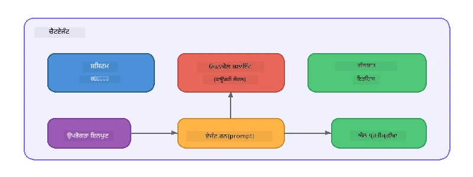

# ਭਾਗ 5: ਏਜੰਟ ਫਰੇਮਵਰਕ ਨਾਲ ਏਆਈ ਏਜੰਟ ਬਣਾਉਣਾ

> **ਲਕੜੀ:** ਆਪਣਾ ਪਹਿਲਾ ਏਆਈ ਏਜੰਟ ਬਣਾਓ ਜਿਸ ਵਿੱਚ ਲਗਾਤਾਰ ਹਦਾਇਤਾਂ ਅਤੇ ਪਰਿਚਿਤ ਵਿਅਕਤੀਗਤ ਵਿਸ਼ੇਸ਼ਤਾਵਾਂ ਹੋਣ, ਜੋ Foundry Local ਰਾਹੀਂ ਇੱਕ ਸਥਾਨਕ ਮਾਡਲ ਦੁਆਰਾ ਸੰਚਾਲਿਤ ਹੈ।

## ਏਆਈ ਏਜੰਟ ਕੀ ਹੈ?

ਏਆਈ ਏਜੰਟ ਇੱਕ ਭਾਸ਼ਾ ਮਾਡਲ ਨੂੰ **ਸਿਸਟਮ ਹਦਾਇਤਾਂ** ਨਾਲ ਘੇਰਦਾ ਹੈ ਜੋ ਇਸ ਦੇ ਵਿਹਾੜੇ, ਵਿਅਕਤੀਗਤਤਾ, ਅਤੇ ਪਾਬੰਦੀਆਂ ਨੂੰ ਪਰਿਭਾਸ਼ਿਤ ਕਰਦਾ ਹੈ। ਇਕੱਲੀ ਚੈਟ ਪੂਰੀ ਕਰਨ ਦੇ ਕਾਲ ਨਾਲੋਂ ਵੱਖਰਾ, ਇੱਕ ਏਜੰਟ ਪ੍ਰਦਾਨ ਕਰਦਾ ਹੈ:

- **ਪ੍ਰਸਨ** - ਇੱਕ ਬਣੀਬਣੀ ਪਛਾਣ ("ਤੁਸੀਂ ਇੱਕ ਮਦਦਗਾਰ ਕੋਡ ਸਮੀਖਿਆਕਾਰ ਹੋ")
- **ਯਾਦ** - ਗੱਲਬਾਤ ਦਾ ਇਤਿਹਾਸ ਵਾਰੀ ਵਾਰੀ ਨੂੰ ਕਵਰ ਕਰਦਾ ਹੈ
- **ਖਾਸੀਅਤ** - ਚੰਗੀ ਤਰ੍ਹਾਂ ਤਿਆਰ ਕੀਤੀਆਂ ਹਦਾਇਤਾਂ ਦੁਆਰਾ ਚਲਾਇਆ ਗਿਆ ਫੋਕਸਡ ਵਿਹਾਰ



---

## ਮਾਈਕ੍ਰੋਸੌਫਟ ਏਜੰਟ ਫਰੇਮਵਰਕ

**ਮਾਈਕ੍ਰੋਸੌਫਟ ਏਜੰਟ ਫਰੇਮਵਰਕ** (AGF) ਇੱਕ ਮਿਆਰੀ ਏਜੰਟ ਅਬਸਟ੍ਰੈਕਸ਼ਨ ਪ੍ਰਦਾਨ ਕਰਦਾ ਹੈ ਜੋ ਵੱਖ-ਵੱਖ ਮਾਡਲ ਬੈਕਐਂਡਸ 'ਤੇ ਕੰਮ ਕਰਦਾ ਹੈ। ਇਸ ਵਰਕਸ਼ਾਪ ਵਿੱਚ ਅਸੀਂ ਇਸਨੂੰ Foundry Local ਨਾਲ ਜੋੜਦੇ ਹਾਂ ਤਾਂ ਜੋ ਸਭ ਕੁਝ ਤੁਹਾਡੇ ਮਸ਼ੀਨ 'ਤੇ ਚੱਲੇ - ਕਿਸੇ ਕਲਾਉਡ ਦੀ ਲੋੜ ਨਹੀਂ।

| ਧਾਰਨਾ | ਵਰਣਨ |
|---------|-------------|
| `FoundryLocalClient` | ਪਾਈਥਨ: ਸੇਵਾ ਸ਼ੁਰੂ ਕਰਦਾ ਹੈ, ਮਾਡਲ ਡਾਊਨਲੋਡ/ਲੋਡ ਕਰਦਾ ਹੈ, ਅਤੇ ਏਜੰਟ ਬਣਾਉਂਦਾ ਹੈ |
| `client.as_agent()` | ਪਾਈਥਨ: Foundry Local ਕਲਾਇਟ ਤੋਂ ਇੱਕ ਏਜੰਟ ਬਣਾਉਂਦਾ ਹੈ |
| `AsAIAgent()` | C#: `ChatClient` 'ਤੇ ਵਿਸ਼ਤਾਰਕ ਵਿਧੀ - ਇੱਕ `AIAgent` ਬਣਾਉਂਦਾ ਹੈ |
| `instructions` | ਸਿਸਟਮ ਪ੍ਰੰਪਟ ਜੋ ਏਜੰਟ ਦੇ ਵਿਹਾਰ ਨੂੰ ਆਕਾਰ ਦਿੰਦਾ ਹੈ |
| `name` | ਮਨੁੱਖ ਪੜ੍ਹਨਯੋਗ ਲੇਬਲ, ਮਲਟੀ-ਏਜੰਟ ਸਥਿਤੀਆਂ ਵਿੱਚ ਲਾਭਦਾਇਕ |
| `agent.run(prompt)` / `RunAsync()` | ਵਰਤੋਂਕਾਰ ਦਾ ਸੁਨੇਹਾ ਭੇਜਦਾ ਹੈ ਅਤੇ ਏਜੰਟ ਦੀ ਪ੍ਰਤੀਕਿਰਿਆ ਪ੍ਰਾਪਤ ਕਰਦਾ ਹੈ |

> **ਨੋਟ:** ਏਜੰਟ ਫਰੇਮਵਰਕ ਦਾ ਪਾਈਥਨ ਅਤੇ .NET SDK ਹੈ। ਜਾਵਾਸਕ੍ਰਿਪਟ ਲਈ, ਅਸੀਂ ਇੱਕ ਹਲਕਾ `ChatAgent` ਕਲਾਸ ਬਣਾਈ ਹੈ ਜੋ ਖੁੱਲ੍ਹਾAI SDK ਸਿੱਧਾ ਵਰਤ ਕੇ ਇਕੋ ਜਿਹਾ ਪੈਟਰਨ ਦਿਖਾਉਂਦਾ ਹੈ।

---

## ਅਭਿਆਸ

### ਅਭਿਆਸ 1 - ਏਜੰਟ ਪੈਟਰਨ ਨੂੰ ਸਮਝੋ

ਕੋਡ ਲਿਖਣ ਤੋਂ ਪਹਿਲਾਂ, ਏਜੰਟ ਦੇ ਮੁੱਖ ਹਿੱਸਿਆਂ ਦਾ ਅਧਿਐਨ ਕਰੋ:

1. **ਮਾਡਲ ਕਲਾਇਟ** - Foundry Local ਦੇ OpenAI-ਅਨੁਕੂਲ API ਨਾਲ ਕਨੈਕਟ ਕਰਦਾ ਹੈ
2. **ਸਿਸਟਮ ਹਦਾਇਤਾਂ** - "ਵਿਅਕਤੀਗਤਤਾ" ਪ੍ਰੰਪਟ
3. **ਰਨ ਲੂਪ** - ਯੂਜ਼ਰ ਦਾ ਇਨਪੁਟ ਭੇਜੋ, ਆਉਟਪੁਟ ਪ੍ਰਾਪਤ ਕਰੋ

> **ਸੋਚੋ:** ਸਿਸਟਮ ਹਦਾਇਤਾਂ ਆਮ ਵਰਤੋਂਕਾਰ ਸੁਨੇਹੇ ਤੋਂ ਕਿਵੇਂ ਵੱਖਰੀਆਂ ਹੁੰਦੀਆਂ ਹਨ? ਜੇ ਤੁਸੀਂ ਉਹਨਾਂ ਨੂੰ ਬਦਲਦੇ ਹੋ ਤਾਂ ਕੀ ਹੁੰਦਾ ਹੈ?

---

### ਅਭਿਆਸ 2 - ਸਿੰਗਲ-ਏਜੰਟ ਉਦਾਹਰਨ ਚਲਾਓ

<details>
<summary><strong>🐍 ਪਾਈਥਨ</strong></summary>

**ਪੂਰਵ-ਸ਼ਰਤਾਂ:**
```bash
cd python
python -m venv venv

# ਵਿਂਡੋਜ਼ (ਪਾਵਰਸ਼ੈੱਲ):
venv\Scripts\Activate.ps1
# ਮੈਕਓਐਸ:
source venv/bin/activate

pip install -r requirements.txt
```

**ਚਲਾਓ:**
```bash
python foundry-local-with-agf.py
```

**ਕੋਡ ਵਾਕਥਰੂ** (`python/foundry-local-with-agf.py`):

```python
import asyncio
from agent_framework_foundry_local import FoundryLocalClient

async def main():
    alias = "phi-4-mini"

    # FoundryLocalClient ਸਰਵਿਸ ਸ਼ੁਰੂਆਤ, ਮਾਡਲ ਡਾਊਨਲੋਡ ਅਤੇ ਲੋਡਿੰਗ ਨੂੰ ਸੰਭਾਲਦਾ ਹੈ
    client = FoundryLocalClient(model_id=alias)
    print(f"Client Model ID: {client.model_id}")

    # ਸਿਸਟਮ ਨਿਰਦੇਸ਼ਾਂ ਨਾਲ ਇੱਕ ਏਜੰਟ ਬਣਾਓ
    agent = client.as_agent(
        name="Joker",
        instructions="You are good at telling jokes.",
    )

    # ਗੈਰ-ਸਟ੍ਰੀਮਿੰਗ: ਇੱਕ ਵਾਰੀ ਵਿੱਚ ਪੂਰਾ ਜਵਾਬ ਪ੍ਰਾਪਤ ਕਰੋ
    result = await agent.run("Tell me a joke about a pirate.")
    print(f"Agent: {result}")

    # ਸਟ੍ਰੀਮਿੰਗ: ਨਤੀਜੇ ਜਿਵੇਂ-ਜਿਵੇਂ ਬਣਦੇ ਹਨ ਪ੍ਰਾਪਤ ਕਰੋ
    async for chunk in agent.run("Tell me another joke.", stream=True):
        if chunk.text:
            print(chunk.text, end="", flush=True)

asyncio.run(main())
```

**ਮੁੱਖ ਬਿੰਦੂ:**
- `FoundryLocalClient(model_id=alias)` ਇੱਕ ਕਦਮ ਵਿੱਚ ਸੇਵਾ ਸ਼ੁਰੂ, ਡਾਊਨਲੋਡ, ਅਤੇ ਮਾਡਲ ਲੋਡਿੰਗ ਕਰਦਾ ਹੈ
- `client.as_agent()` ਸਿਸਟਮ ਹਦਾਇਤਾਂ ਅਤੇ ਨਾਮ ਨਾਲ ਇੱਕ ਏਜੰਟ ਬਣਾਉਂਦਾ ਹੈ
- `agent.run()` ਦੋਹਾਂ ਨਾਨ-ਸਟਰੀਮਿੰਗ ਅਤੇ ਸਟਰੀਮਿੰਗ ਮੋਡ ਨੂੰ ਸਹਾਇਤਾ ਦਿੰਦਾ ਹੈ
- ਇੰਸਟਾਲ ਕਰੋ `pip install agent-framework-foundry-local --pre` ਰਾਹੀਂ

</details>

<details>
<summary><strong>📦 ਜਾਵਾਸਕ੍ਰਿਪਟ</strong></summary>

**ਪੂਰਵ-ਸ਼ਰਤਾਂ:**
```bash
cd javascript
npm install
```

**ਚਲਾਓ:**
```bash
node foundry-local-with-agent.mjs
```

**ਕੋਡ ਵਾਕਥਰੂ** (`javascript/foundry-local-with-agent.mjs`):

```javascript
import { OpenAI } from "openai";
import { FoundryLocalManager } from "foundry-local-sdk";

class ChatAgent {
  constructor({ client, modelId, instructions, name }) {
    this.client = client;
    this.modelId = modelId;
    this.instructions = instructions;
    this.name = name;
    this.history = [];
  }

  async run(userMessage) {
    const messages = [
      { role: "system", content: this.instructions },
      ...this.history,
      { role: "user", content: userMessage },
    ];
    const response = await this.client.chat.completions.create({
      model: this.modelId,
      messages,
    });
    const assistantMessage = response.choices[0].message.content;

    // ਬਹੁ-ਚਰਣ ਇੰਟਰੈਕਸ਼ਨਾਂ ਲਈ ਗੱਲਬਾਤ ਦਾ ਇਤਿਹਾਸ ਰੱਖੋ
    this.history.push({ role: "user", content: userMessage });
    this.history.push({ role: "assistant", content: assistantMessage });
    return { text: assistantMessage };
  }
}

async function main() {
  FoundryLocalManager.create({ appName: "FoundryLocalWorkshop" });
  const manager = FoundryLocalManager.instance;
  await manager.startWebService();

  const catalog = manager.catalog;
  const model = await catalog.getModel("phi-3.5-mini");
  if (!model.isCached) {
    console.log("Downloading model: phi-3.5-mini...");
    await model.download();
  }
  await model.load();

  const client = new OpenAI({
    baseURL: manager.urls[0] + "/v1",
    apiKey: "foundry-local",
  });

  const agent = new ChatAgent({
    client,
    modelId: model.id,
    instructions: "You are good at telling jokes.",
    name: "Joker",
  });

  const result = await agent.run("Tell me a joke about a pirate.");
  console.log(result.text);
}

main();
```

**ਮੁੱਖ ਬਿੰਦੂ:**
- ਜਾਵਾਸਕ੍ਰਿਪਟ ਆਪਣਾ `ChatAgent` ਕਲਾਸ ਬਣਾਉਂਦਾ ਹੈ ਜੋ ਪਾਈਥਨ AGF ਪੈਟਰਨ ਨੂੰ ਦਰਸਾਉਂਦਾ ਹੈ
- `this.history` ਗੱਲਬਾਤ ਦੇ ਮੁੜ ਮੁੜ ਟਰਨਾਂ ਨੂੰ ਸਟੋਰ ਕਰਦਾ ਹੈ
- ਸਪਸ਼ਟ `startWebService()` → ਕੈਸ਼ ਜਾਂਚ → `model.download()` → `model.load()` ਪੂਰੀ ਝਲਕ ਦਿੰਦਾ ਹੈ

</details>

<details>
<summary><strong>💜 C#</strong></summary>

**ਪੂਰਵ-ਸ਼ਰਤਾਂ:**
```bash
cd csharp
dotnet restore
```

**ਚਲਾਓ:**
```bash
dotnet run agent
```

**ਕੋਡ ਵਾਕਥਰੂ** (`csharp/SingleAgent.cs`):

```csharp
using Microsoft.AI.Foundry.Local;
using Microsoft.Extensions.Logging.Abstractions;
using Microsoft.Agents.AI;
using OpenAI;
using System.ClientModel;

// 1. Start Foundry Local and load a model
var alias = "phi-3.5-mini";
await FoundryLocalManager.CreateAsync(
    new Configuration
    {
        AppName = "FoundryLocalSamples",
        Web = new Configuration.WebService { Urls = "http://127.0.0.1:0" }
    }, NullLogger.Instance, default);
var manager = FoundryLocalManager.Instance;
await manager.StartWebServiceAsync(default);

var catalog = await manager.GetCatalogAsync(default);
var model = await catalog.GetModelAsync(alias, default);

var isCached = await model.IsCachedAsync(default);
if (!isCached)
{
    Console.WriteLine($"Downloading model: {alias}...");
    await model.DownloadAsync(null, default);
}
await model.LoadAsync(default);

var key = new ApiKeyCredential("foundry-local");
var client = new OpenAIClient(key, new OpenAIClientOptions
{
    Endpoint = new Uri(manager.Urls[0] + "/v1")
});

// 2. Create an AIAgent using the Agent Framework extension method
AIAgent joker = client
    .GetChatClient(model.Id)
    .AsAIAgent(
        instructions: "You are good at telling jokes. Keep your jokes short and family-friendly.",
        name: "Joker"
    );

// 3. Run the agent (non-streaming)
var response = await joker.RunAsync("Tell me a joke about a pirate.");
Console.WriteLine($"Joker: {response}");

// 4. Run with streaming
await foreach (var update in joker.RunStreamingAsync("Tell me another joke."))
{
    Console.Write(update);
}
```

**ਮੁੱਖ ਬਿੰਦੂ:**
- `AsAIAgent()` `Microsoft.Agents.AI.OpenAI` ਤੋਂ ਇੱਕ ਵਿਸ਼ਤਾਰਿਕ ਵਿਧੀ ਹੈ - ਕਿਸੇ ਖਾਸ `ChatAgent` ਕਲਾਸ ਦੀ ਲੋੜ ਨਹੀਂ
- `RunAsync()` ਪੂਰੀ ਪ੍ਰਤੀਕਿਰਿਆ ਵਾਪਸ ਕਰਦਾ ਹੈ; `RunStreamingAsync()` ਇੱਕ ਟੋਕਨ ਨਾਲ ਸਟਰੀਮ ਕਰਦਾ ਹੈ
- ਇੰਸਟਾਲ ਕਰੋ `dotnet add package Microsoft.Agents.AI.OpenAI --version 1.0.0-rc3` ਰਾਹੀਂ

</details>

---

### ਅਭਿਆਸ 3 - ਪ੍ਰਸਨ ਬਦਲੋ

ਏਜੰਟ ਦੀ `instructions` ਨੂੰ ਸਵਧਨ ਕਰਕੇ ਵੱਖਰਾ ਪ੍ਰਸਨ ਬਣਾਓ। ਹਰ ਇੱਕ ਨੂੰ ਟ੍ਰਾਈ ਕਰੋ ਅਤੇ ਵੇਖੋ ਕਿ ਨਤੀਜਾ ਕਿਵੇਂ ਬਦਲਦਾ ਹੈ:

| ਪ੍ਰਸਨ | ਹਦਾਇਤਾਂ |
|---------|-------------|
| ਕੋਡ ਸਮੀਖਿਆਕਾਰ | `"ਤੁਸੀਂ ਇੱਕ ਮਾਹਿਰ ਕੋਡ ਸਮੀਖਿਆਕਾਰ ਹੋ। ਪੜ੍ਹਨਯੋਗਤਾ, ਪ੍ਰਦਰਸ਼ਨ, ਅਤੇ ਸਹੀਤਾ 'ਤੇ ਧਿਆਨ ਦਿੰਦੇ ਹੋਏ ਬਣਾਵਟੀ ਫੀਡਬੈਕ ਦਿਓ।"` |
| ਯਾਤਰਾ ਮਾਰਗਦਰਸ਼ਕ | `"ਤੁਸੀਂ ਇੱਕ ਦੋਸਤਾਨਾ ਯਾਤਰਾ ਮਾਰਗਦਰਸ਼ਕ ਹੋ। ਮੰਤਵ ਸਥਾਨਾਂ, ਗਤੀਵਿਧੀਆਂ, ਅਤੇ ਸਥਾਨਕ ਖਾਣ-ਪੀਣ ਲਈ ਵਿਅਕਤੀਗਤ ਸਿਫਾਰਿਸ਼ਾਂ ਦਿਓ।"` |
| ਸੋਕ੍ਰੈਟਿਕ ਟਿਊਟਰ | `"ਤੁਸੀਂ ਇੱਕ ਸੋਕ੍ਰੈਟਿਕ ਟਿਊਟਰ ਹੋ। ਕਦੇ ਵੀ ਸਿੱਧੇ ਜਵਾਬ ਨਾ ਦਿਓ - ਬਦਲੇ ਵਿੱਚ ਵਿਦਿਆਰਥੀ ਨੂੰ ਸੋਚ ਸੌਂਪਣ ਵਾਲੇ ਸਵਾਲਾਂ ਨਾਲ ਮਦਦ ਕਰੋ।"` |
| ਤਕਨੀਕੀ ਲੇਖਕ | `"ਤੁਸੀਂ ਇੱਕ ਤਕਨੀਕੀ ਲੇਖਕ ਹੋ। ਧਾਰਣਾ ਸਪਸ਼ਟ ਅਤੇ ਸੰਕੁਚਿਤ ਤੌਰ 'ਤੇ ਸਮਝਾਓ। ਉਦਾਹਰਣਾਂ ਵਰਤੋਂ। ਜਰਗਨ ਤੋਂ ਬਚੋ।"` |

**ਕੋਸ਼ਿਸ਼ ਕਰੋ:**
1. ਉਪਰਾਲੇ ਦਸਤੀਬੰਦ ਵਿੱਚੋਂ ਇੱਕ ਪ੍ਰਸਨ ਚੁਣੋ
2. ਕੋਡ ਵਿੱਚ `instructions` ਸਤਰ ਬਦਲੋ
3. ਵਰਤੋਂਕਾਰ ਪ੍ਰੰਪਟ ਨੂੰ ਮੇਲ ਖਾਓ (ਜਿਵੇਂ ਕੋਡ ਸਮੀਖਿਆਕਾਰ ਨੂੰ ਕਿਸੇ ਫੰਕਸ਼ਨ ਦੀ ਸਮੀਖਿਆ ਕਰਨ ਲਈ ਕਹੋ)
4. ਮੁੜ ਉਦਾਹਰਨ ਚਲਾਓ ਅਤੇ ਨਤੀਜੇ ਦੀ ਤੁਲਨਾ ਕਰੋ

> **ਸੁਝਾਅ:** ਏਜੰਟ ਦੀ ਗੁਣਵੱਤਾ ਬਹੁਤ ਜ਼ਿਆਦਾ ਹਦਾਇਤਾਂ 'ਤੇ ਨਿਰਭਰ ਕਰਦੀ ਹੈ। ਖਾਸ, ਚੰਗੀ ਤਰ੍ਹਾਂ ਬਣੀਆਂ ਹਦਾਇਤਾਂ ਅਸਪਸ਼ਟ ਤੋਂ ਵਧੀਆ ਨਤੀਜੇ ਦਿੰਦੀਆਂ ਹਨ।

---

### ਅਭਿਆਸ 4 - ਮਲਟੀ ਟਰਨ ਗੱਲਬਾਤ ਜੋੜੋ

ਉਦਾਹਰਨ ਨੂੰ ਵਧਾਓ ਤਾਂ ਜੋ ਇੱਕ ਮਲਟੀ-ਟਰਨ ਚੈਟ ਲੂਪ ਹੋਵੇ ਜਿਸ ਨਾਲ ਤੁਸੀਂ ਏਜੰਟ ਨਾਲ ਬੈਕ-ਐਂਡ-ਫੋਰਥ ਗੱਲਬਾਤ ਕਰ ਸਕੋ।

<details>
<summary><strong>🐍 ਪਾਈਥਨ - ਮਲਟੀ ਟਰਨ ਲੂਪ</strong></summary>

```python
import asyncio
from agent_framework_foundry_local import FoundryLocalClient

async def main():
    client = FoundryLocalClient(model_id="phi-4-mini")

    agent = client.as_agent(
        name="Assistant",
        instructions="You are a helpful assistant.",
    )

    print("Chat with the agent (type 'quit' to exit):\n")
    while True:
        user_input = input("You: ")
        if user_input.strip().lower() in ("quit", "exit"):
            break
        result = await agent.run(user_input)
        print(f"Agent: {result}\n")

asyncio.run(main())
```

</details>

<details>
<summary><strong>📦 ਜਾਵਾਸਕ੍ਰਿਪਟ - ਮਲਟੀ ਟਰਨ ਲੂਪ</strong></summary>

```javascript
import { OpenAI } from "openai";
import { FoundryLocalManager } from "foundry-local-sdk";
import * as readline from "node:readline/promises";

// (ਕਸਰਤ 2 ਤੋਂ ChatAgent ਕਲਾਸ ਨੂੰ ਦੁਬਾਰਾ ਵਰਤੋ)

async function main() {
  FoundryLocalManager.create({ appName: "FoundryLocalWorkshop" });
  const manager = FoundryLocalManager.instance;
  await manager.startWebService();

  const catalog = manager.catalog;
  const model = await catalog.getModel("phi-3.5-mini");
  if (!model.isCached) {
    console.log("Downloading model: phi-3.5-mini...");
    await model.download();
  }
  await model.load();

  const client = new OpenAI({
    baseURL: manager.urls[0] + "/v1",
    apiKey: "foundry-local",
  });

  const agent = new ChatAgent({
    client,
    modelId: model.id,
    instructions: "You are a helpful assistant.",
    name: "Assistant",
  });

  const rl = readline.createInterface({
    input: process.stdin,
    output: process.stdout,
  });

  console.log("Chat with the agent (type 'quit' to exit):\n");
  while (true) {
    const userInput = await rl.question("You: ");
    if (["quit", "exit"].includes(userInput.trim().toLowerCase())) break;
    const result = await agent.run(userInput);
    console.log(`Agent: ${result.text}\n`);
  }
  rl.close();
}

main();
```

</details>

<details>
<summary><strong>💜 C# - ਮਲਟੀ ਟਰਨ ਲੂਪ</strong></summary>

```csharp
using Microsoft.AI.Foundry.Local;
using Microsoft.Extensions.Logging.Abstractions;
using Microsoft.Agents.AI;
using OpenAI;
using System.ClientModel;

var alias = "phi-3.5-mini";
var config = new Configuration
{
    AppName = "FoundryLocalSamples",
    Web = new Configuration.WebService { Urls = "http://127.0.0.1:0" }
};
await FoundryLocalManager.CreateAsync(config, NullLogger.Instance, default);
var manager = FoundryLocalManager.Instance;
await manager.StartWebServiceAsync(default);

var catalog = await manager.GetCatalogAsync(default);
var model = await catalog.GetModelAsync(alias, default);

var isCached = await model.IsCachedAsync(default);
if (!isCached)
{
    Console.WriteLine($"Downloading model: {alias}...");
    await model.DownloadAsync(null, default);
}
await model.LoadAsync(default);

var key = new ApiKeyCredential("foundry-local");
var client = new OpenAIClient(key, new OpenAIClientOptions
{
    Endpoint = new Uri(manager.Urls[0] + "/v1")
});

AIAgent agent = client
    .GetChatClient(model.Id)
    .AsAIAgent(
        instructions: "You are a helpful assistant.",
        name: "Assistant"
    );

Console.WriteLine("Chat with the agent (type 'quit' to exit):\n");
while (true)
{
    Console.Write("You: ");
    var userInput = Console.ReadLine();
    if (string.IsNullOrWhiteSpace(userInput) ||
        userInput.Equals("quit", StringComparison.OrdinalIgnoreCase) ||
        userInput.Equals("exit", StringComparison.OrdinalIgnoreCase))
        break;

    var result = await agent.RunAsync(userInput);
    Console.WriteLine($"Agent: {result}\n");
}
```

</details>

ਨੋਟਿਸ ਕਰੋ ਕਿ ਏਜੰਟ ਪਹਿਲਾਂ ਦੇ ਟਰਨ ਯਾਦ ਰੱਖਦਾ ਹੈ - ਇੱਕ ਫਾਲੋ-ਅਪ ਸਵਾਲ ਪੁੱਛੋ ਅਤੇ ਵੇਖੋ ਕਿ ਸੰਦਰਭ ਕਿਵੇਂ ਚੱਲਦਾ ਹੈ।

---

### ਅਭਿਆਸ 5 - ਸੰਰਚਿਤ ਆਉਟਪੁਟ

ਏਜੰਟ ਨੂੰ ਹਮੇਸ਼ਾਂ ਖਾਸ ਫਾਰਮੈਟ (ਜਿਵੇਂ JSON) ਵਿੱਚ ਜਵਾਬ ਦੇਣ ਲਈ ਕਹੋ ਅਤੇ ਨਤੀਜੇ ਨੂੰ ਪਾਰਸ ਕਰੋ:

<details>
<summary><strong>🐍 ਪਾਈਥਨ - JSON ਆਉਟਪੁਟ</strong></summary>

```python
import asyncio
import json
from agent_framework_foundry_local import FoundryLocalClient

async def main():
    client = FoundryLocalClient(model_id="phi-4-mini")

    agent = client.as_agent(
        name="SentimentAnalyzer",
        instructions=(
            "You are a sentiment analysis agent. "
            "For every user message, respond ONLY with valid JSON in this format: "
            '{"sentiment": "positive|negative|neutral", "confidence": 0.0-1.0, "summary": "brief reason"}'
        ),
    )

    result = await agent.run("I absolutely loved the new restaurant downtown!")
    print("Raw:", result)

    try:
        parsed = json.loads(str(result))
        print(f"Sentiment: {parsed['sentiment']} (confidence: {parsed['confidence']})")
    except json.JSONDecodeError:
        print("Agent did not return valid JSON - try refining the instructions.")

asyncio.run(main())
```

</details>

<details>
<summary><strong>💜 C# - JSON ਆਉਟਪੁਟ</strong></summary>

```csharp
using System.Text.Json;

AIAgent analyzer = chatClient.AsAIAgent(
    name: "SentimentAnalyzer",
    instructions:
        "You are a sentiment analysis agent. " +
        "For every user message, respond ONLY with valid JSON in this format: " +
        "{\"sentiment\": \"positive|negative|neutral\", \"confidence\": 0.0-1.0, \"summary\": \"brief reason\"}"
);

var response = await analyzer.RunAsync("I absolutely loved the new restaurant downtown!");
Console.WriteLine($"Raw: {response}");

try
{
    var parsed = JsonSerializer.Deserialize<JsonElement>(response.ToString());
    Console.WriteLine($"Sentiment: {parsed.GetProperty("sentiment")} " +
                      $"(confidence: {parsed.GetProperty("confidence")})");
}
catch (JsonException)
{
    Console.WriteLine("Agent did not return valid JSON - try refining the instructions.");
}
```

</details>

> **ਨੋਟ:** ਛੋਟੇ ਸਥਾਨਕ ਮਾਡਲ ਹਮੇਸ਼ਾ ਪੂਰੀ ਤਰ੍ਹਾਂ ਵੈਧ JSON ਨਹੀਂ ਬਣਾਉਂਦੇ। ਤੁਸੀਂ ਹਦਾਇਤਾਂ ਵਿੱਚ ਉਦਾਹਰਣ ਸ਼ਾਮਿਲ ਕਰਕੇ ਅਤੇ ਫਾਰਮੈਟ ਬਾਰੇ ਬਿਲਕੁਲ ਖੁੱਲ੍ਹਾ ਹੋ ਕੇ ਭਰੋਸਾ ਵਧਾ ਸਕਦੇ ਹੋ।

---

## ਮੁੱਖ ਸਿੱਖਣ ਵਾਲੀਆਂ ਗੱਲਾਂ

| ਧਾਰਨਾ | ਤੁਸੀਂ ਕੀ ਸਿੱਖਿਆ |
|---------|-----------------|
| ਏਜੰਟ ਬਨਾਮ ਕੱਚਾ LLM ਕਾਲ | ਇੱਕ ਏਜੰਟ ਮਾਡਲ ਨੂੰ ਹਦਾਇਤਾਂ ਅਤੇ ਯਾਦ ਨਾਲ ਲਪੇਟਦਾ ਹੈ |
| ਸਿਸਟਮ ਹਦਾਇਤਾਂ | ਏਜੰਟ ਦੇ ਵਿਹਾਰ ਨੂੰ ਨਿਯੰਤਰਿਤ ਕਰਨ ਲਈ ਸਭ ਤੋਂ ਜ਼ਰੂਰੀ ਹੈ |
| ਮਲਟੀ-ਟਰਨ ਗੱਲਬਾਤ | ਏਜੰਟ ਵੱਖ-ਵੱਖ ਵਰਤੋਂਕਾਰ ਮਿਟਿੰਗਾਂ ਵਿੱਚ ਸੰਦਰਭ ਬਰਕਰਾਰ ਰੱਖ ਸਕਦੇ ਹਨ |
| ਸੰਰਚਿਤ ਆਉਟਪੁੱਟ | ਹਦਾਇਤਾਂ ਆਉਟਪੁੱਟ ਫਾਰਮੈਟ (JSON, ਮਾਰਕਡਾਊਨ, ਆਦਿ) ਨੂੰ ਲਾਗੂ ਕਰ ਸਕਦੀਆਂ ਹਨ |
| ਸਥਾਨਕ ਕਾਰਜਾਨਵਿਅਨ | ਸਾਰਾ ਕੁਝ Foundry Local ਰਾਹੀਂ ਸਥਾਨਕ ਤੌਰ ਤੇ ਚੱਲਦਾ ਹੈ - ਕਿਸੇ ਕਲਾਉਡ ਦੀ ਲੋੜ ਨਹੀਂ |

---

## ਅਗਲੇ ਕਦਮ

**[ਭਾਗ 6: ਮਲਟੀ-ਏਜੰਟ ਵਰਕਫਲੋਜ਼](part6-multi-agent-workflows.md)** ਵਿੱਚ, ਤੁਸੀਂ ਕਈ ਏਜੰਟਾਂ ਨੂੰ ਇੱਕ ਮਿਲਾਪੀ ਪਾਈਪਲਾਈਨ ਵਿੱਚ ਜੋੜੋਗੇ ਜਿੱਥੇ ਹਰ ਏਜੰਟ ਦੀ ਖਾਸੀਅਤ ਵਾਲੀ ਭੂਮਿਕਾ ਹੋਵੇਗੀ।

---

<!-- CO-OP TRANSLATOR DISCLAIMER START -->
**ਡਿਸਕਲੇਮਰ**:  
ਇਹ ਦਸਤਾਵੇਜ਼ AI ਅਨੁਵਾਦ ਸੇਵਾ [Co-op Translator](https://github.com/Azure/co-op-translator) ਦੀ ਵਰਤੋਂ ਕਰਕੇ ਅਨੁਵਾਦ ਕੀਤਾ ਗਿਆ ਹੈ। ਜਦੋਂ ਕਿ ਅਸੀਂ ਸਹੀਤਾ ਲਈ ਕੋਸ਼ਿਸ਼ ਕਰਦੇ ਹਾਂ, ਕਿਰਪਾ ਕਰਕੇ ਸੂਚਿਤ ਰਹੋ ਕਿ ਆਟੋਮੈਟਿਕ ਅਨੁਵਾਦਾਂ ਵਿੱਚ ਗਲਤੀਆਂ ਜਾਂ ਅਸਮਰਥਤਾਵਾਂ ਹੋ ਸਕਦੀਆਂ ਹਨ। ਮੂਲ ਦਸਤਾਵੇਜ਼ ਆਪਣੀ ਮੂਲ ਭਾਸ਼ਾ ਵਿੱਚ ਪ੍ਰਭਾਵਸ਼ਾਲੀ ਸਰੋਤ ਮੰਨਿਆ ਜਾਣਾ ਚਾਹੀਦਾ ਹੈ। ਮਹੱਤਵਪੂਰਣ ਜਾਣਕਾਰੀ ਲਈ, ਪੇਸ਼ੇਵਰ ਮਨੁੱਖੀ ਅਨੁਵਾਦ ਦੀ ਸਿਫ਼ਾਰਸ਼ ਕੀਤੀ ਜਾਂਦੀ ਹੈ। ਅਸੀਂ ਇਸ ਅਨੁਵਾਦ ਦੀ ਵਰਤੋਂ ਤੋਂ ਉਤਪੰਨ ਹੋਣ ਵਾਲੀਆਂ ਕਿਸੇ ਵੀ ਗਲਤਫ਼ਹਮੀਆਂ ਜਾਂ ਗਲਤ ਵਿਆਖਿਆਵਾਂ ਲਈ ਜ਼ਿੰਮੇਵਾਰ ਨਹੀਂ ਹਾਂ।
<!-- CO-OP TRANSLATOR DISCLAIMER END -->