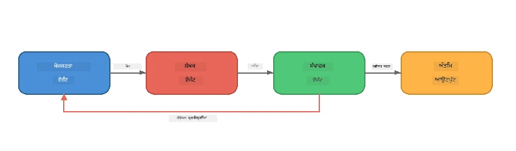
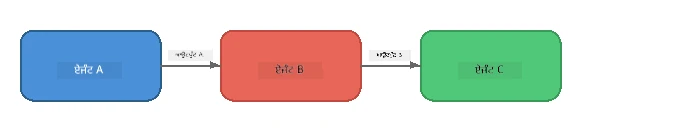
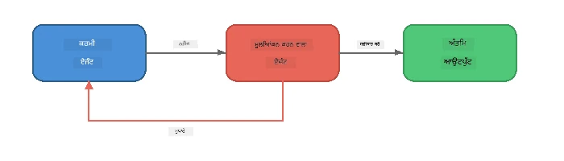
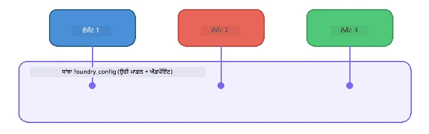

# ਭਾਗ 6: ਮਲਟੀ-ਏਜੰਟ ਵ੍ਯਵਹਾਰ

> **ਲਕਸ਼:** ਕਈ ਵਿਸ਼ੇਸ਼ ਏਜੰਟਾਂ ਨੂੰ ਮਿਲਾ ਕੇ ਇਸ ਤਰ੍ਹਾਂ ਦੇ ਕੋਆਰਡੀਨੇਟਿਡ ਪਾਈਪਲਾਈਨ ਬਣਾਓ ਜੋ ਮੁਸ਼ਕਲ ਕਾਰਜਾਂ ਨੂੰ ਸਹਿਯੋਗੀ ਏਜੰਟਾਂ ਵਿਚ ਵੰਡਦੇ ਹਨ - ਸਾਰਾ ਕੰਮ ਫਾਊਂਡਰੀ ਲੋਕਲ ਤੇ ਚੱਲਦਾ ਹੈ।

## ਕਿਉਂ ਮਲਟੀ-ਏਜੰਟ?

ਇੱਕ ਏਜੰਟ ਬਹੁਤ ਸਾਰੇ ਕਾਰਜ ਕਰ ਸਕਦਾ ਹੈ, ਪਰ ਜਟਿਲ ਵਰਕਫਲੋਜ਼ ਨੂੰ **ਵਿਸ਼ੇਸ਼ਤਾ** ਦੀ ਲੋੜ ਹੁੰਦੀ ਹੈ। ਇੱਕ ਏਜੰਟ ਨੂੰ ਵੱਖ-ਵੱਖ ਸਮੇਂ ਰੀਸਰਚ, ਲਿਖਾਈ ਅਤੇ ਸੰਪਾਦਨ ਕਰਨ ਦੀ ਬਜਾਏ, ਤੁਸੀਂ ਕੰਮ ਨੂੰ ਧਿਆਨ ਕੇਂਦ੍ਰਤ ਭੂਮਿਕਾਵਾਂ ਵਿੱਚ ਵੰਡਦੇ ਹੋ:



| ਪੈਟਰਨ | ਵਿਆਖਿਆ |
|---------|-------------|
| **ਕ੍ਰਮਿਕ** | ਏਜੰਟ A ਦਾ ਆਉਟਪੁੱਟ ਏਜੰਟ B ⇒ ਏਜੰਟ C ਨੂੰ ਮਿਲਦਾ ਹੈ |
| **ਫੀਡਬੈਕ ਲੂਪ** | ਇੱਕ ਮੁਲਿਆੰਕਣ ਕਰਨ ਵਾਲਾ ਏਜੰਟ ਕੰਮ ਨੂੰ ਸੰਸ਼ੋਧਨ ਲਈ ਵਾਪਸ ਭੇਜ ਸਕਦਾ ਹੈ |
| **ਸਾਂਝਾ ਸੰਦਰਭ** | ਸਾਰੇ ਏਜੰਟ ਇੱਕੋ ਹੀ ਮਾਡਲ/ਐਂਡਪਾਇੰਟ ਉਪਯੋਗ ਕਰਦੇ ਹਨ, ਪਰ ਵੱਖ-ਵੱਖ ਨਿਰਦੇਸ਼ |
| **ਟਾਈਪਡ ਆਉਟਪੁੱਟ** | ਏਜੰਟ ਸੰਰਚਿਤ ਨਤੀਜੇ (JSON) ਪੈਦਾ ਕਰਦੇ ਹਨ ਜੋ ਭਰੋਸਾਪਪੂਰਨ ਟ੍ਰਾਂਸਫਰ ਸੁਨਿਸ਼ਚਿਤ ਕਰਦਾ ਹੈ |

---

## ਅਭਿਆਸ

### ਅਭਿਆਸ 1 - ਮਲਟੀ-ਏਜੰਟ ਪਾਈਪਲਾਈਨ ਚਲਾਓ

ਵਰਕਸ਼ਾਪ ਵਿੱਚ ਇੱਕ ਪੂਰਾ ਰੀਸਰਚਰ → ਲੇਖਕ → ਸੰਪਾਦਕ ਵਰਕਫਲੋ ਸ਼ਾਮਲ ਹੈ।

<details>
<summary><strong>🐍 Python</strong></summary>

**ਸੈੱਟਅਪ:**
```bash
cd python
python -m venv venv

# ਵਿਂਡੋਜ਼ (ਪਾਵਰਸ਼ੈੱਲ):
venv\Scripts\Activate.ps1
# ਮੈਕਓਐਸ:
source venv/bin/activate

pip install -r requirements.txt
```

**ਚਲਾਓ:**
```bash
python foundry-local-multi-agent.py
```

**ਕਿਹਾ ਹੁੰਦਾ ਹੈ:**
1. **ਰੀਸਰਚਰ** ਇੱਕ ਵਿਸ਼ਾ ਪ੍ਰਾਪਤ ਕਰਦਾ ਹੈ ਤੇ ਬੁਲੇਟ-ਪੁਆਇੰਟ ਤੱਥ ਵਾਪਸ ਕਰਦਾ ਹੈ
2. **ਲੇਖਕ** ਰੀਸਰਚ ਨੂੰ ਲੈ ਕੇ ਇੱਕ ਬਲੌਗ ਪੋਸਟ (3-4 ਪੈਰਾਗ੍ਰਾਫ) ਦ੍ਰਾਫਟ ਕਰਦਾ ਹੈ
3. **ਸੰਪਾਦਕ** ਲੇਖ ਦੀ ਗੁਣਵੱਤਾ ਸਮੀਖਿਆ ਕਰਦਾ ਹੈ ਅਤੇ ACCEPT ਜਾਂ REVISE ਵਾਪਸ ਭੇਜਦਾ ਹੈ

</details>

<details>
<summary><strong>📦 JavaScript</strong></summary>

**ਸੈੱਟਅਪ:**
```bash
cd javascript
npm install
```

**ਚਲਾਓ:**
```bash
node foundry-local-multi-agent.mjs
```

**ਉਹੀ ਤਿੰਨ-ਚਰਣ ਵਾਲਾ ਪਾਈਪਲਾਈਨ** - ਰੀਸਰਚਰ → ਲੇਖਕ → ਸੰਪਾਦਕ।

</details>

<details>
<summary><strong>💜 C#</strong></summary>

**ਸੈੱਟਅਪ:**
```bash
cd csharp
dotnet restore
```

**ਚਲਾਓ:**
```bash
dotnet run multi
```

**ਉਹੀ ਤਿੰਨ-ਚਰਣ ਵਾਲਾ ਪਾਈਪਲਾਈਨ** - ਰੀਸਰਚਰ → ਲੇਖਕ → ਸੰਪਾਦਕ।

</details>

---

### ਅਭਿਆਸ 2 - ਪਾਈਪਲਾਈਨ ਦੀ ਬਣਤਰ

ਇਸ ਗੱਲ ਦਾ ਅਧਿਐਨ ਕਰੋ ਕਿ ਏਜੰਟ ਕਿਵੇਂ ਪਰਿਭਾਸ਼ਿਤ ਅਤੇ ਕੁਨੈਕਟ ਕੀਤੇ ਗਏ ਹਨ:

**1. ਸਾਂਝਾ ਮਾਡਲ ਕਲਾਇੰਟ**

ਸਾਰੇ ਏਜੰਟ ਇੱਕੋ ਫਾਊਂਡਰੀ ਲੋਕਲ ਮਾਡਲ ਸਾਂਝਾ ਕਰਦੇ ਹਨ:

```python
# Python - FoundryLocalClient ਸਾਰੀਆਂ ਚੀਜ਼ਾਂ ਨੂੰ ਸੰਭਾਲਦਾ ਹੈ
from agent_framework_foundry_local import FoundryLocalClient

client = FoundryLocalClient(model_id="phi-3.5-mini")
```

```javascript
// ਜਾਵਾਸਕ੍ਰਿਪਟ - OpenAI SDK ਜੋ Foundry Local ਨੂੰ ਦਰਸਾਉਂਦਾ ਹੈ
const client = new OpenAI({
  baseURL: manager.urls[0] + "/v1",
  apiKey: "foundry-local",
});
```

```csharp
// C# - OpenAIClient pointed at Foundry Local
var key = new ApiKeyCredential("foundry-local");
var client = new OpenAIClient(key, new OpenAIClientOptions
{
    Endpoint = new Uri(manager.Urls[0] + "/v1")
});
var chatClient = client.GetChatClient(model.Id);
```

**2. ਵਿਸ਼ੇਸ਼ ਨਿਰਦੇਸ਼**

ਹਰ ਏਜੰਟ ਦੀ ਇੱਕ ਵੱਖਰੀ ਪੇਰਸੋਨਾ ਹੁੰਦੀ ਹੈ:

| ਏਜੰਟ | ਨਿਰਦੇਸ਼ (ਸੰਖੇਪ) |
|-------|----------------------|
| ਰੀਸਰਚਰ | "ਮੁੱਖ ਤੱਥ, ਅੰਕੜੇ ਅਤੇ ਪਿਛੋਕੜ ਦਿਓ। ਬੁਲੇਟ ਪੁਆਇੰਟ ਵਿੱਚ ਕ੍ਰਮਵੱਧ ਕੀਤਾ ਜਾਵੇ।" |
| ਲੇਖਕ | "ਰੀਸਰਚ ਨੋਟਸ ਤੋਂ ਇੱਕ ਮਨੋਰੰਜਕ ਬਲੌਗ ਪੋਸਟ (3-4 ਪੈਰਾਗ੍ਰਾਫ) ਲਿਖੋ। ਤੱਥ ਨਾਂ ਬਣਾਓ।" |
| ਸੰਪਾਦਕ | "ਸਪਸ਼ਟੀਕਰਨ, ਵਿਆਕਰਣ ਅਤੇ ਤੱਥ ਬਰਕਰਾਰੀ ਦੀ ਸਮੀਖਿਆ ਕਰੋ। ਫੈਸਲਾ: ACCEPT ਜਾਂ REVISE।" |

**3. ਡਾਟਾ ਏਜੰਟਾਂ ਵਿੱਚ ਵਹਿਣਾ**

```python
# ਕਦਮ 1 - ਖੋਜਕਰਤਾ ਦਾ ਨਿਕਾਸ ਲੇਖਕ ਲਈ ਇਨਪੁਟ ਬਣ ਜਾਂਦਾ ਹੈ
research_result = await researcher.run(f"Research: {topic}")

# ਕਦਮ 2 - ਲੇਖਕ ਦਾ ਨਿਕਾਸ ਸੰਪਾਦਕ ਲਈ ਇਨਪੁਟ ਬਣ ਜਾਂਦਾ ਹੈ
writer_result = await writer.run(f"Write using:\n{research_result}")

# ਕਦਮ 3 - ਸੰਪਾਦਕ ਖੋਜ ਅਤੇ ਲੇਖ ਦੋਹਾਂ ਦੀ ਸਮੀਖਿਆ ਕਰਦਾ ਹੈ
editor_result = await editor.run(
    f"Research:\n{research_result}\n\nArticle:\n{writer_result}"
)
```

```csharp
// C# - same pattern, async calls with AIAgent
var researchNotes = await researcher.RunAsync(
    $"Research the following topic and provide key facts:\n{topic}");

var draft = await writer.RunAsync(
    $"Write a blog post based on these research notes:\n\n{researchNotes}");

var verdict = await editor.RunAsync(
    $"Review this article for quality and accuracy.\n\n" +
    $"Research notes:\n{researchNotes}\n\n" +
    $"Article:\n{draft}");
```

> **ਮੁੱਖ ਸੂਝ:** ਹਰ ਏਜੰਟ ਪਿਛਲੇ ਏਜੰਟਾਂ ਤੋਂ ਇਕੱਠਾ ਸੰਦਰਭ ਪੈਂਦਾ ਹੈ। ਸੰਪਾਦਕ ਅਸਲੀ ਰੀਸਰਚ ਅਤੇ ਡ੍ਰਾਫਟ ਦੋਹਾਂ ਨੂੰ ਵੇਖਦਾ ਹੈ - ਇਸ ਨਾਲ ਤੱਥ ਬਰਕਰਾਰਤਾ ਦੀ ਜਾਂਚ ਕਰ ਸਕਦਾ ਹੈ।

---

### ਅਭਿਆਸ 3 - ਚੌਥਾ ਏਜੰਟ ਸ਼ਾਮਲ ਕਰੋ

ਪਾਈਪਲਾਈਨ ਵਿੱਚ ਇਕ ਨਵਾਂ ਏਜੰਟ ਸ਼ਾਮਲ ਕਰੋ। ਇਨ੍ਹਾਂ ਵਿੱਚੋਂ ਚੁਣੋ:

| ਏਜੰਟ | ਮਕਸਦ | ਨਿਰਦੇਸ਼ |
|-------|---------|-------------|
| **ਫੈਕਟ-ਚੈੱਕਰ** | ਲੇਖ ਵਿੱਚ ਦਾਅਵਿਆਂ ਦੀ ਜਾਂਚ | `"ਤੁਸੀਂ ਤੱਥੀਆਂ ਦਾਵੇ ਦੀ ਪੜਤਾਲ ਕਰਦੇ ਹੋ। ਹਰ ਦਾਵੇ ਲਈ ਦੱਸੋ ਕਿ ਕੀ ਇਹ ਰੀਸਰਚ ਨੋਟਸ ਦੁਆਰਾ ਸਮਰਥਿਤ ਹੈ। JSON ਵਿੱਚ verified/unverified ਆਈਟਮ ਵਾਪਸ ਕਰੋ।"` |
| **ਹੈੱਡਲਾਈਨ ਲੇਖਕ** | ਮਨਮੋਹਕ ਸਿਰਲੇਖ ਬਣਾਓ | `"ਲੇਖ ਲਈ 5 ਹੈੱਡਲਾਈਨ ਵਿਕਲਪ ਬਣਾੳੋ। ਸ਼ੈਲੀ ਵਿੱਚ ਵੱਖ-ਵੱਖ: ਜਾਣਕਾਰੀਪ੍ਰਦ, ਕਲਿਕਬੇਟ, ਸਵਾਲ, ਲਿਸਟਿਕਲ, ਭਾਵੁਕ।"` |
| **ਸੋਸ਼ਲ ਮੀਡੀਆ** | ਪ੍ਰਚਾਰਕ ਪੋਸਟ ਬਣਾਓ | `"ਇਸ ਲੇਖ ਨੂੰ ਪ੍ਰਚਾਰਿਤ ਕਰਨ ਲਈ 3 ਸੋਸ਼ਲ ਮੀਡੀਆ ਪੋਸਟ ਬਣਾਓ: ਟਵਿੱਟਰ ਲਈ ਇਕ (280 ਅੱਖਰ), ਲਿੰਕਡਇਨ ਲਈ (ਪੇਸ਼ੇਵਰ ਟੋਨ), ਇੰਸਟਾਗ੍ਰਾਮ ਲਈ (ਆਮ-ਭਾਸ਼ਾ ਵਿੱਚ ਇਮੋਜੀ ਸੁਝਾਵਾਂ ਨਾਲ)।"` |

<details>
<summary><strong>🐍 Python - ਹੈੱਡਲਾਈਨ ਲੇਖਕ ਜੋੜਨਾ</strong></summary>

```python
headline_agent = client.as_agent(
    name="HeadlineWriter",
    instructions=(
        "You are a headline specialist. Given an article, generate exactly "
        "5 headline options. Vary the style: informative, question-based, "
        "listicle, emotional, and provocative. Return them as a numbered list."
    ),
)

# ਸੰਪਾਦਕ ਦੇ ਸਵੀਕਾਰ ਕਰਣ ਤੋਂ ਬਾਅਦ, ਸਿਰਲੇਖ ਤਿਆਰ ਕਰੋ
headline_result = await headline_agent.run(
    f"Generate headlines for this article:\n\n{writer_result}"
)
print(f"\n--- Headlines ---\n{headline_result}")
```

</details>

<details>
<summary><strong>📦 JavaScript - ਹੈੱਡਲਾਈਨ ਲੇਖਕ ਜੋੜਨਾ</strong></summary>

```javascript
const headlineAgent = new ChatAgent({
  client,
  modelId: modelInfo.id,
  instructions:
    "You are a headline specialist. Given an article, generate exactly " +
    "5 headline options. Vary the style: informative, question-based, " +
    "listicle, emotional, and provocative. Return them as a numbered list.",
  name: "HeadlineWriter",
});

const headlineResult = await headlineAgent.run(
  `Generate headlines for this article:\n\n${writerResult.text}`
);
console.log(`\n--- Headlines ---\n${headlineResult.text}`);
```

</details>

<details>
<summary><strong>💜 C# - ਹੈੱਡਲਾਈਨ ਲੇਖਕ ਜੋੜਨਾ</strong></summary>

```csharp
AIAgent headlineAgent = chatClient.AsAIAgent(
    name: "HeadlineWriter",
    instructions:
        "You are a headline specialist. Given an article, generate exactly " +
        "5 headline options. Vary the style: informative, question-based, " +
        "listicle, emotional, and provocative. Return them as a numbered list."
);

// After the editor accepts, generate headlines
var headlines = await headlineAgent.RunAsync(
    $"Generate headlines for this article:\n\n{draft}");
Console.WriteLine($"\n--- Headlines ---\n{headlines}");
```

</details>

---

### ਅਭਿਆਸ 4 - ਆਪਣਾ ਵਰਕਫਲੋ ਡਿਜ਼ਾਈਨ ਕਰੋ

ਕਿਸੇ ਹੋਰ ਖੇਤਰ ਲਈ ਮਲਟੀ-ਏਜੰਟ ਪਾਈਪਲਾਈਨ ਡਿਜ਼ਾਈਨ ਕਰੋ। ਕੁਝ ਵਿਚਾਰ ਇਹ ਹਨ:

| ਖੇਤਰ | ਏਜੰਟ | ਵਹਿਣਾ |
|--------|--------|------|
| **ਕੋਡ ਸਮੀਖਿਆ** | ਵਿਸ਼ਲੇਸ਼ਕ → ਸਮੀਖਿਆਕਾਰ → ਸਾਰਾਂਸ਼ਕਾਰ | ਕੋਡ ਦੀ ਬਣਤਰ ਦਾ ਵਿਸ਼ਲੇਸ਼ਣ → ਸਮੱਸਿਆਵਾਂ ਲਈ ਸਮੀਖਿਆ → ਸਾਰਾਂਸ਼ ਰਿਪੋਰਟ ਤਿਆਰ ਕਰੋ |
| **ਕਸਟਮਰ ਸਹਾਇਤਾ** | ਵਰਗੀਕਰਨ ਕਰਨ ਵਾਲਾ → ਜਵਾਬ ਦੇਣ ਵਾਲਾ → ਗੁਣਵੱਤਾ ਚੈੱਕਰ | ਟਿਕਟ ਵਰਗੀਕ੍ਰਿਤ ਕਰੋ → ਜਵਾਬ ਦਾ ਮਸੌਦਾ ਬਣਾਓ → ਕੁਆਲਿਟੀ ਚੈੱਕ ਕਰੋ |
| **ਸਿੱਖਿਆ** | ਪ੍ਰਸ਼ਨ ਮਾਲਾ ਤਿਆਰਕ → ਵਿਦਿਆਰਥੀ ਅਨੁਕਰਨਕਾਰ → ਗ੍ਰੇਡਰ | ਪ੍ਰਸ਼ਨ ਬਣਾਓ → ਜਵਾਬ ਅਨੁਕਰਣ ਕਰੋ → ਗ੍ਰੇਡ ਕਰਕੇ ਵਿਆਖਿਆ ਦਿਓ |
| **ਡਾਟਾ ਵਿਸ਼્લੇਸ਼ਣ** | ਵਿਆਖਿਆਕਾਰ → ਵਿਸ਼ਲੇਸ਼ਕ → ਰਿਪੋਰਟਰ | ਡਾਟਾ ਅਨੁਰੋਧ ਸਮਝੋ → ਪੈਟਰਨਜ਼ ਦਾ ਵਿਸ਼ਲੇਸ਼ਣ ਕਰੋ → ਰਿਪੋਰਟ ਲਿਖੋ |

**ਕਦਮ:**
1. 3+ ਏਜੰਟ ਵੱਖਰੇ `ਨਿਰਦੇਸ਼` ਨਾਲ ਪਰਿਭਾਸ਼ਿਤ ਕਰੋ
2. ਡਾਟਾ ਵਹਿਣਾ ਨਿਰਧਾਰਤ ਕਰੋ - ਹਰ ਏਜੰਟ ਕੀ ਪ੍ਰਾਪਤ ਕਰਦਾ ਹੈ ਅਤੇ ਕੀ ਸਿਰਜਦਾ ਹੈ?
3. ਅਭਿਆਸ 1-3 ਦੇ ਪੈਟਰਨਾਂ ਦੇ ਨਾਲ ਪਾਈਪਲਾਈਨ ਲਾਗੂ ਕਰੋ
4. ਜੇ ਕੋਈ ਏਜੰਟ ਦੂਜੇ ਦਾ ਕੰਮ ਮੁਲਿਆੰਕਣ ਕਰਨਾ ਚਾਹੁੰਦਾ ਹੈ ਤਾਂ ਫੀਡਬੈਕ ਲੂਪ ਸ਼ਾਮਲ ਕਰੋ

---

## ਸੁਚਾਲਨ ਪੈਟਰਨ

ਇਹ ਰਹੇ ਕੁਝ ਸੁਚਾਲਨ ਪੈਟਰਨ ਜੋ ਕਿਸੇ ਵੀ ਮਲਟੀ-ਏਜੰਟ ਸਿਸਟਮ 'ਤੇ ਲਾਗੂ ਹੁੰਦੇ ਹਨ ([ਭਾਗ 7](part7-zava-creative-writer.md) ਵਿੱਚ ਵਿਸਤਾਰ ਨਾਲ):

### ਕ੍ਰਮਿਕ ਪਾਈਪਲਾਈਨ



ਹਰ ਏਜੰਟ ਪਿਛਲੇ ਏਜੰਟ ਦੇ ਆਉਟਪੁੱਟ ਨੂੰ ਪ੍ਰਕਿਰਿਆ ਕਰਦਾ ਹੈ। ਸਧਾਰਣ ਅਤੇ ਅੰਦਾਜ਼ਾ ਲਗਾਉਣਯੋਗ।

### ਫੀਡਬੈਕ ਲੂਪ



ਇੱਕ ਮੁਲਿਆੰਕਣ ਕਰਨ ਵਾਲਾ ਏਜੰਟ ਪਹਿਲਾਂ ਦੇ ਚਰਣਾਂ ਦੀ ਦੁਬਾਰਾ ਕਾਰਵਾਈ ਸ਼ੁਰੂ ਕਰ ਸਕਦਾ ਹੈ। ਜਾਵਾ ਲੇਖਕ ਇਹ ਵਰਤਦਾ ਹੈ: ਸੰਪਾਦਕ ਫੀਡਬੈਕ ਰੀਸਰਚਰ ਅਤੇ ਲੇਖਕ ਨੂੰ ਵਾਪਸ ਭੇਜ ਸਕਦਾ ਹੈ।

### ਸਾਂਝਾ ਸੰਦਰਭ



ਸਾਰੇ ਏਜੰਟ ਇੱਕੋ `foundry_config` ਸਾਂਝਾ ਕਰਦੇ ਹਨ ਇਸ ਲਈ ਉਹ ਇੱਕੋ ਮਾਡਲ ਅਤੇ ਐਂਡਪਾਇੰਟ ਵਰਤਦੇ ਹਨ।

---

## ਮੁੱਖ ਸਿਖਲਾਈਆਂ

| ਧਾਰਨਾ | ਤੁਸੀਂ ਕੀ ਸਿੱਖਿਆ |
|---------|-----------------|
| ਏਜੰਟ ਵਿਸ਼ੇਸ਼ਤਾ | ਹਰ ਏਜੰਟ ਧਿਆਨ ਕੇਂਦ੍ਰਿਤ ਨਿਰਦੇਸ਼ ਨਾਲ ਇੱਕ ਕੰਮ ਚੰਗੀ ਤਰ੍ਹਾਂ ਕਰਦਾ ਹੈ |
| ਡਾਟਾ ਟ੍ਰਾਂਸਫਰ | ਇੱਕ ਏਜੰਟ ਦਾ ਨਤੀਜਾ ਦੂਜੇ ਲਈ ਇਨਪੁੱਟ ਬਣਦਾ ਹੈ |
| ਫੀਡਬੈਕ ਲੂਪ | ਇੱਕ ਮੁਲਿਆੰਕਣ ਕਰਨ ਵਾਲਾ ਉੱਚ ਗੁਣਵੱਤਾ ਲਈ ਦੁਹਰਾਅ ਪ੍ਰੇਰਿਤ ਕਰ ਸਕਦਾ ਹੈ |
| ਸੰਰਚਿਤ ਨਤੀਜਾ | JSON-ਸੁਤਰ ਸੰਪ੍ਰੇਸ਼ਣ ਭਰੋਸੇਯੋਗ ਏਜੰਟ-ਤੋਂ-ਏਜੰਟ ਵਿਆਪਾਰ ਰਾਹਤ ਕਰਦਾ ਹੈ |
| ਸੁਚਾਲਨ | ਇੱਕ ਸਹਯੋਗੀ ਪਾਈਪਲਾਈਨ ਕ੍ਰਮ ਅਤੇ ত੍ਰੁੱਟੀ ਨਿਯੰਤਰਣ ਕਰਦਾ ਹੈ |
| ਉਤਪਾਦਨ ਪੈਟਰਨ | [ਭਾਗ 7: ਜਾਵਾ ਕ੍ਰੀਏਟਿਵ ਲੇਖਕ](part7-zava-creative-writer.md) ਵਿੱਚ ਲਾਗੂ ਕੀਤਾ ਗਿਆ |

---

## ਅਗਲੇ ਕਦਮ

[ਭਾਗ 7: ਜਾਵਾ ਕ੍ਰੀਏਟਿਵ ਲੇਖਕ - ਕੈਪਸਟੋਨ ਐਪਲੀਕੇਸ਼ਨ](part7-zava-creative-writer.md) ਵੱਲ ਜਾਰੀ ਰਖੋ ਜੋ 4 ਵਿਸ਼ੇਸ਼ ਏਜੰਟਾਂ, ਸਟ੍ਰੀਮਿੰਗ ਆਉਟਪੁੱਟ, ਉਤਪਾਦ ਖੋਜ ਅਤੇ ਫੀਡਬੈਕ ਲੂਪਾਂ ਵਾਲੀ ਉਤਪਾਦਨ-ਸਰੂਪ ਮਲਟੀ-ਏਜੰਟ ਐਪਲੀਕੇਸ਼ਨ ਨੂੰ ਪੰਜਾਬੀ (ਪਾਇਥਨ, ਜਾਵਾਸਕ੍ਰਿਪਟ, ਅਤੇ C# ਵਿੱਚ) ਪ੍ਰਸਤੁਤ ਕਰਦੀ ਹੈ।

---

<!-- CO-OP TRANSLATOR DISCLAIMER START -->
**ਪਾਰਦਰਸ਼ਤਾ**:  
ਇਹ ਦਸਤਾਵੇਜ਼ AI ਅਨੁਵਾਦ ਸੇਵਾ [Co-op Translator](https://github.com/Azure/co-op-translator) ਦੀ ਵਰਤੋਂ ਕਰਕੇ ਅਨੁਵਾਦ ਕੀਤਾ ਗਿਆ ਹੈ। ਜਦੋਂ ਕਿ ਅਸੀਂ ਸਹੀਤ ਲਈ ਕੋਸ਼ਿਸ਼ ਕਰਦੇ ਹਾਂ, ਕਿਰਪਾ ਕਰਕੇ ਧਿਆਨ ਵਿੱਚ ਰੱਖੋ ਕਿ ਆਟੋਮੈਟਿਕ ਅਨੁਵਾਦਾਂ ਵਿੱਚ ਗਲਤੀਆਂ ਜਾਂ ਅਣਸਹੀ ਕਈ ਵਾਰੀ ਹੋ ਸਕਦੀਆਂ ਹਨ। ਮੂਲ ਦਸਤਾਵੇਜ਼ ਆਪਣੇ ਮੂਲ ਭਾਸ਼ਾ ਵਿੱਚ ਹੀ ਪ੍ਰਮਾਣਿਕ ਸਰੋਤ ਮੰਨਿਆ ਜਾਣਾ ਚਾਹੀਦਾ ਹੈ। ਜਰੂਰੀ ਜਾਣਕਾਰੀ ਲਈ, ਪੇਸ਼ਾਵਰ ਮਨੁੱਖੀ ਅਨੁਵਾਦ ਦੀ ਸਿਫਾਰਸ਼ ਕੀਤੀ ਜਾਂਦੀ ਹੈ। ਅਸੀਂ ਇਸ ਅਨੁਵਾਦ ਦੀ ਵਰਤੋਂ ਤੋਂ ਹੋਣ ਵਾਲੀ ਕਿਸੇ ਵੀ ਸਮਝੌਤੇ ਜਾਂ ਭ੍ਰਮ ਲਈ ਜਿੰਮੇਵਾਰ ਨਹੀਂ ਹਾਂ।
<!-- CO-OP TRANSLATOR DISCLAIMER END -->