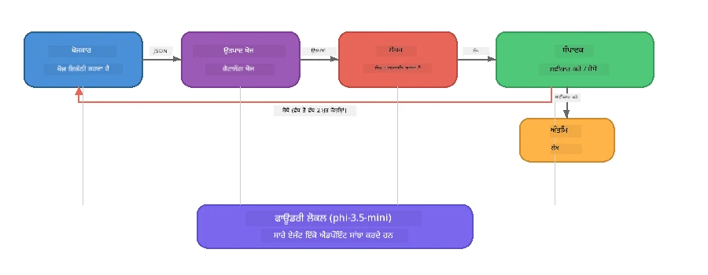

# ਭਾਗ 7: Zava Creative Writer - ਕੈਪਸਟੋਨ ਐਪਲੀਕੇਸ਼ਨ

> **ਮਕਸਦ:** ਇੱਕ ਪ੍ਰੋਡਕਸ਼ਨ-ਸਟਾਈਲ ਮਲਟੀ-ਏਜੰਟ ਐਪਲੀਕੇਸ਼ਨ ਦੀ ਖੋਜ ਕਰੋ ਜਿੱਥੇ ਚਾਰ ਵਿਸ਼ੇਸ਼ ਏਜੰਟ ਮਿਲ ਕੇ Zava Retail DIY ਲਈ ਮੈਗਜ਼ੀਨ-ਗੁਣਵੱਤਾ ਵਾਲੇ ਲੇਖ ਤਿਆਰ ਕਰਦੇ ਹਨ - ਜੋ ਕਿ ਪੂਰੀ ਤਰ੍ਹਾਂ ਤੁਹਾਡੇ ਡਿਵਾਈਸ 'ਤੇ Foundry Local ਨਾਲ ਚੱਲਦਾ ਹੈ।

ਇਹ ਵਰਕਸ਼ਾਪ ਦੀ **ਕੈਪਸਟੋਨ ਲੈਬ** ਹੈ। ਇਹ ਸਾਰੀ ਸਿੱਖਿਆ ਨੂੰ ਇਕੱਠਾ ਕਰਦਾ ਹੈ - SDK ਇੰਟੀਗ੍ਰੇਸ਼ਨ (ਭਾਗ 3), ਸਥानीय ਡੇਟਾ ਤੋਂ ਰੀਟ੍ਰੀਵਲ (ਭਾਗ 4), ਏਜੰਟ ਪੇਰਸੋਨਾਸ (ਭਾਗ 5), ਅਤੇ ਮਲਟੀ-ਏਜੰਟ ਓਰਕੇਸਟਰੈਸ਼ਨ (ਭਾਗ 6) - ਇੱਕ ਪੂਰੀ ਐਪਲੀਕੇਸ਼ਨ ਵਿੱਚ ਜੋ ਕਿ **Python**, **JavaScript**, ਅਤੇ **C#** ਵਿੱਚ ਉਪਲਬਧ ਹੈ।

---

## ਤੁਸੀਂ ਕੀ ਖੋਜੋਗੇ

| ਸੰਕਲਪ | Zava Writer ਵਿੱਚ ਕਿੱਥੇ |
|---------|----------------------------|
| 4-ਕਦਮੀ ਮਾਡਲ ਲੋਡਿੰਗ | ਸਾਂਝਾ ਕੰਫਿਗ ਮੋਡੀਊਲ Foundry Local ਨੂੰ ਬੂਟਸਟ੍ਰੈਪ ਕਰਦਾ ਹੈ |
| RAG-ਸਟਾਈਲ ਰੀਟ੍ਰੀਵਲ | ਪ੍ਰੋਡਕਟ ਏਜੰਟ ਇੱਕ ਸਥਾਨਕ ਕੈਟਾਲੋਗ ਖੋਜੇਗਾ |
| ਏਜੰਟ ਖਾਸੀਅਤ | 4 ਏਜੰਟ ਵੱਖਰੇ ਸਿਸਟਮ ਪ੍ਰਾਂਪਟਾਂ ਨਾਲ |
| ਸਟ੍ਰੀਮਿੰਗ ਆਉਟਪੁੱਟ | ਰਾਇਟਰ ਰੀਅਲ-ਟਾਈਮ ਵਿੱਚ ਟੋਕੇਨਜ ਦਿੰਦਾ ਹੈ |
| ਸੰਰਚਿਤ ਹੈਂਡ-ਆਫ | ਰਿਸਰਚਰ → JSON, ਐਡੀਟਰ → JSON ਫੈਸਲਾ |
| ਫੀਡਬੈਕ ਲੂਪ | ਐਡੀਟਰ ਦੁਬਾਰਾ ਚਲਾਉਣ ਲਈ ਟ੍ਰਿਗਰ ਕਰ ਸਕਦਾ ਹੈ (ਵੱਧ ਤੋਂ ਵੱਧ 2 ਕੋਸ਼ਿਸ਼ਾਂ) |

---

## ਆਰਕੀਟੈਕਚਰ

Zava Creative Writer ਇੱਕ **ਕ੍ਰਮਵਾਰ ਪਾਈਪਲਾਈਨ ਜਿਸ ਵਿੱਚ ਈਵੈਲੂਏਟਰ-ਚਾਲਿਤ ਫੀਡਬੈਕ ਹੁੰਦਾ ਹੈ** ਵਰਤਦਾ ਹੈ। ਸਾਰੇ ਤਿੰਨ ਭਾਸ਼ਾਈ ਇੰਪਲੀਮੈਂਟੇਸ਼ਨ ਇੰਝ ਆਰਕੀਟੈਕਚਰ ਫਾਲੋ ਕਰਦੇ ਹਨ:



### ਚਾਰ ਏਜੰਟ

| ਏਜੰਟ | ਇਨਪੁੱਟ | ਆਉਟਪੁੱਟ | ਮਕਸਦ |
|-------|---------|---------|---------|
| **ਰਿਸਰਚਰ** | ਵਿਸ਼ਾ + ਵਿਕਲਪਿਕ ਫੀਡਬੈਕ | `{"web": [{url, name, description}, ...]}` | LLM ਰਾਹੀਂ ਪਿਛੋਕੜ ਖੋਜ ਇਕੱਠੀ ਕਰਦਾ ਹੈ |
| **ਪ੍ਰੋਡਕਟ ਖੋਜ** | ਪ੍ਰੋਡਕਟ ਸੰਦਰਭ ਸਟਰਿੰਗ | ਮੇਲ ਖਾਂਦੇ ਪ੍ਰੋਡਕਟਸ ਦੀ ਸੂਚੀ | LLM-ਤਿਆਰ ਕੀਤੇ ਗਏ ਕੁਐਰੀ + ਸਥਾਨਕ ਕੈਟਾਲੋਗ 'ਤੇ ਕੁੰਜੀ ਸ਼ਬਦ ਖੋਜ |
| **ਰਾਇਟਰ** | ਰਿਸਰਚ + ਪ੍ਰੋਡਕਟ + ਅਸਾਈਨਮੈਂਟ + ਫੀਡਬੈਕ | ਸਟ੍ਰੀਮ ਕੀਤੀ ਲੇਖ ਟੈਕਸਟ (`---` 'ਤੇ ਵੰਡਿਆ) | ਇੱਕ ਮੈਗਜ਼ੀਨ-ਗੁਣਵੱਤਾ ਵਾਲਾ ਲੇਖ ਤਿਆਰ ਕਰਦਾ ਹੈ |
| **ਐਡੀਟਰ** | ਲੇਖ + ਰਾਇਟਰ ਦੀ ਆਪਣੀ ਫੀਡਬੈਕ | `{"decision": "accept/revise", "editorFeedback": "...", "researchFeedback": "..."}` | ਗੁਣਵੱਤਾ ਦੀ ਸਮੀਖਿਆ ਕਰਦਾ ਹੈ, ਜੇ ਲੋੜ ਹੋਵੇ ਤਾਂ ਦੁਬਾਰਾ ਕੋਸ਼ਿਸ਼ ਕਰਵਾਉਂਦਾ ਹੈ |

### ਪਾਈਪਲਾਈਨ ਦਾ ਪ੍ਰਵਾਹ

1. **ਰਿਸਰਚਰ** ਵਿਸ਼ਾ ਪ੍ਰਾਪਤ ਕਰਦਾ ਹੈ ਅਤੇ ਸੰਰਚਿਤ ਰਿਸਰਚ ਨੋਟਸ (JSON) ਤਿਆਰ ਕਰਦਾ ਹੈ  
2. **ਪ੍ਰੋਡਕਟ ਖੋਜ** LLM-ਤਿਆਰ ਕੀਤੇ ਗਏ ਖੋਜ ਸ਼ਬਦਾਂ ਨਾਲ ਸਥਾਨਕ ਪ੍ਰੋਡਕਟ ਕੈਟਾਲੋਗ ਦੀ ਖੋਜ ਕਰਦਾ ਹੈ  
3. **ਰਾਇਟਰ** ਰਿਸਰਚ + ਪ੍ਰੋਡਕਟ + ਅਸਾਈਨਮੈਂਟ ਨੂੰ ਮਿਲਾ ਕੇ ਸਟ੍ਰੀਮ ਕੀਤੀ ਲੇਖ ਤਿਆਰ ਕਰਦਾ ਹੈ, ਆਪਣੇ ਫੀਡਬੈਕ ਨੂੰ `---` ਵੱਖਰਾ ਤੋਂ ਬਾਅਦ ਜੋੜਦਾ ਹੈ  
4. **ਐਡੀਟਰ** ਲੇਖ ਦੀ ਸਮੀਖਿਆ ਕਰਦਾ ਹੈ ਅਤੇ JSON ਫੈਸਲਾ ਵਾਪਿਸ ਕਰਦਾ ਹੈ:  
   - `"accept"` → ਪਾਈਪਲਾਈਨ ਪੂਰੀ ਹੁੰਦੀ ਹੈ  
   - `"revise"` → ਫੀਡਬੈਕ ਰਿਸਰਚਰ ਅਤੇ ਰਾਇਟਰ ਨੂੰ ਵਾਪਸ ਭੇਜਿਆ ਜਾਂਦਾ ਹੈ (ਵੱਧ ਤੋਂ ਵੱਧ 2 ਕੋਸ਼ਿਸ਼ਾਂ)

---

## ਆਵਸ਼ਯਕਤਾਵਾਂ

- [ਭਾਗ 6: ਮਲਟੀ-ਏਜੰਟ ਵਰਕਫਲੋ](part6-multi-agent-workflows.md) ਪੂਰਾ ਕਰਨਾ  
- Foundry Local CLI ਇੰਸਟਾਲ ਹੋਣਾ ਅਤੇ `phi-3.5-mini` ਮਾਡਲ ਡਾਊਨਲੋਡ ਹੋਣਾ  

---

## ਅਭਿਆਸ

### ਅਭਿਆਸ 1 - Zava Creative Writer ਨੂੰ ਚਲਾਓ

ਆਪਣੀ ਭਾਸ਼ਾ ਚੁਣੋ ਅਤੇ ਐਪਲੀਕੇਸ਼ਨ ਚਲਾਓ:

<details>
<summary><strong>🐍 Python - FastAPI ਵੈੱਬ ਸਰਵਿਸ</strong></summary>

Python ਵਰਜ਼ਨ ਇੱਕ **ਵੈੱਬ ਸਰਵਿਸ** ਦੇ ਤੌਰ 'ਤੇ REST API ਰਾਹੀਂ ਚੱਲਦਾ ਹੈ, ਦਿਖਾਉਂਦਾ ਹੈ ਕਿ ਪ੍ਰੋਡਕਸ਼ਨ ਬੈਕਏਂਡ ਕਿਵੇਂ ਬਣਾਉਣਾ ਹੈ।

**ਸੈਟਅਪ:**
```bash
cd zava-creative-writer-local/src/api
python -m venv venv

# Windows (ਪਾਵਰਸ਼ੇਲ):
venv\Scripts\Activate.ps1
# macOS:
source venv/bin/activate

pip install -r requirements.txt
```

**ਚਲਾਓ:**
```bash
uvicorn main:app --reload
```

**ਟੈਸਟ ਕਰੋ:**
```bash
curl -X POST http://localhost:8000/api/article \
  -H "Content-Type: application/json" \
  -d '{
    "research": "DIY home improvement trends",
    "products": "power tools and paints",
    "assignment": "Write an article about weekend renovation projects for DIY enthusiasts"
  }'
```

ਜਵਾਬ ਨਿਊਲਾਈਨ-ਡਿਲਿਮਿਟਿਡ JSON ਸੁਨੇਹੇ ਵੱਜੋਂ ਸਟ੍ਰੀਮ ਹੁੰਦਾ ਹੈ ਜੋ ਹਰ ਏਜੰਟ ਦੀ ਪ੍ਰਗਤੀ ਵੇਖਾਉਂਦਾ ਹੈ।

</details>

<details>
<summary><strong>📦 JavaScript - Node.js CLI</strong></summary>

JavaScript ਵਰਜ਼ਨ ਇੱਕ **CLI ਐਪਲੀਕੇਸ਼ਨ** ਦੇ ਤੌਰ 'ਤੇ ਚੱਲਦਾ ਹੈ, ਜੋ ਏਜੰਟ ਪ੍ਰਗਤੀ ਅਤੇ ਲੇਖ ਸਿੱਧਾ ਕੰਸੋਲ 'ਤੇ ਛਪਾਉਂਦਾ ਹੈ।

**ਸੈਟਅਪ:**
```bash
cd zava-creative-writer-local/src/javascript
npm install
```

**ਚਲਾਓ:**
```bash
node main.mjs
```

ਤੁਸੀਂ ਵੇਖੋਗੇ:  
1. Foundry Local ਮਾਡਲ ਲੋਡ ਹੋ ਰਿਹਾ ਹੈ (ਪ੍ਰੋਗਰੈਸ ਬਾਰ ਦੇ ਨਾਲ ਜੇ ਡਾਊਨਲੋਡ ਹੋ ਰਿਹਾ ਹੋਵੇ)  
2. ਹਰ ਏਜੰਟ ਕ੍ਰਮਵਾਰ ਸਥਿਤੀ ਸੁਨੇਹੇ ਦੇ ਰਿਹਾ ਹੈ  
3. ਲੇਖ ਕਨਸੋਲ ਵਿੱਚ ਰੀਅਲ-ਟਾਈਮ ਵਿੱਚ ਸਟ੍ਰੀਮ ਕੀਤਾ ਜਾ ਰਿਹਾ ਹੈ  
4. ਐਡੀਟਰ ਦਾ accept/revise ਫੈਸਲਾ

</details>

<details>
<summary><strong>💜 C# - .NET ਕਨਸੋਲ ਐਪ</strong></summary>

C# ਵਰਜ਼ਨ ਇੱਕ **.NET ਕਨਸੋਲ ਐਪਲੀਕੇਸ਼ਨ** ਦੇ ਤੌਰ 'ਤੇ ਚੱਲਦਾ ਹੈ ਜਿਸ ਵਿੱਚ ਇਕੋ ਜਿਹਾ ਪਾਈਪਲਾਈਨ ਅਤੇ ਸਟ੍ਰੀਮਿੰਗ ਆਉਟਪੁੱਟ ਹੁੰਦਾ ਹੈ।

**ਸੈਟਅਪ:**
```bash
cd zava-creative-writer-local/src/csharp
dotnet restore
```

**ਚਲਾਓ:**
```bash
dotnet run
```

ਜਾਵਾਸਕ੍ਰਿਪਟ ਵਰਜ਼ਨ ਵਰਗੇ ਹੀ ਆਉਟਪੁੱਟ ਪੈਟਰਨ - ਏਜੰਟ ਸਥਿਤੀ ਸੁਨੇਹੇ, ਸਟ੍ਰੀਮ ਲੇਖ ਅਤੇ ਐਡੀਟਰ ਫੈਸਲਾ।

</details>

---

### ਅਭਿਆਸ 2 - ਕੋਡ ਸੰਰਚਨਾ ਦਾ ਅਧਿਐਨ ਕਰੋ

ਹਰ ਭਾਸ਼ਾ ਵਿੱਚ ਸਮਾਨ ਤਰਕਿਕ ਤੱਤ ਹਨ। ਸੰਰਚਨਾਵਾਂ ਦੀ ਤੁਲਨਾ ਕਰੋ:

**Python** (`src/api/`):  
| ਫਾਇਲ | ਮਕਸਦ |  
|------|---------|  
| `foundry_config.py` | ਸਾਂਝਾ Foundry Local ਪ੍ਰਬੰਧਕ, ਮਾਡਲ, ਅਤੇ ਕਲਾਇੰਟ (4-ਕਦਮੀ ਸ਼ੁਰੂਆਤ) |  
| `orchestrator.py` | ਫੀਡਬੈਕ ਲੂਪ ਨਾਲ ਪਾਈਪਲਾਈਨ ਸੂਮੇਲਨ |  
| `main.py` | FastAPI ਐਂਡਪੌਇੰਟ (`POST /api/article`) |  
| `agents/researcher/researcher.py` | JSON ਆਉਟਪੁੱਟ ਨਾਲ LLM-ਆਧਾਰਿਤ ਖੋਜ |  
| `agents/product/product.py` | LLM-ਤਿਆਰ ਕੀਤੇ ਕੁਐਰੀ + ਕੁੰਜੀ ਸ਼ਬਦ ਖੋਜ |  
| `agents/writer/writer.py` | ਸਟ੍ਰੀਮਿੰਗ ਲੇਖ ਤਿਆਰ ਕਰਨਾ |  
| `agents/editor/editor.py` | JSON-ਆਧਾਰਿਤ accept/revise ਫੈਸਲਾ |  

**JavaScript** (`src/javascript/`):  
| ਫਾਇਲ | ਮਕਸਦ |  
|------|---------|  
| `foundryConfig.mjs` | ਸਾਂਝਾ Foundry Local ਕੰਫਿਗ (4-ਕਦਮੀ ਸ਼ੁਰੂਆਤ ਪ੍ਰੋਗਰੈਸ ਬਾਰ ਨਾਲ) |  
| `main.mjs` | ਓਰਕੇਸਟਰ + CLI ਐਂਟਰੀ ਪੌਇੰਟ |  
| `researcher.mjs` | LLM-ਆਧਾਰਿਤ ਖੋਜ ਏਜੰਟ |  
| `product.mjs` | LLM ਕੁਐਰੀ ਤਿਆਰ ਕਰਨ ਅਤੇ ਕੀਵਰਡ ਖੋਜ |  
| `writer.mjs` | ਸਟ੍ਰੀਮਿੰਗ ਲੇਖ ਤਿਆਰ ਕਰਨਾ (ਅਸਿੰਕ ਜੈਨਰੇਟਰ) |  
| `editor.mjs` | JSON accept/revise ਫੈਸਲਾ |  
| `products.mjs` | ਪ੍ਰੋਡਕਟ ਕੈਟਾਲੋਗ ਡੇਟਾ |  

**C#** (`src/csharp/`):  
| ਫਾਇਲ | ਮਕਸਦ |  
|------|---------|  
| `Program.cs` | ਪੂਰੀ ਪਾਈਪਲਾਈਨ: ਮਾਡਲ ਲੋਡਿੰਗ, ਏਜੰਟ, ਓਰਕੇਸਟਰ, ਫੀਡਬੈਕ ਲੂਪ |  
| `ZavaCreativeWriter.csproj` | .NET 9 ਪ੍ਰੋਜੈਕਟ ਜਿੱਥੇ Foundry Local + OpenAI ਪੈਕੇਜ ਹਨ |  

> **ਡਿਜ਼ਾਈਨ ਨੋਟ:** Python ਹਰ ਏਜੰਟ ਨੂੰ ਵੱਖਰੇ ਫਾਇਲ/ਡਾਇਰੈਕਟਰੀ ਵਿੱਚ ਰੱਖਦਾ ਹੈ (ਵੱਡੀਆਂ ਟੀਮਾਂ ਲਈ ਚੰਗਾ). JavaScript ਹਰ ਏਜੰਟ ਲਈ ਇੱਕ ਮੋਡੀਊਲ ਵਰਤਦਾ ਹੈ (ਦਰਮਿਆਨੇ ਪ੍ਰੋਜੈਕਟਾਂ ਲਈ ਚੰਗਾ). C# ਸਾਰਾ ਕੋਡ ਇੱਕ ਫਾਇਲ ਵਿੱਚ ਰੱਖਦਾ ਹੈ ਸਥਾਨਕ ਫੰਕਸ਼ਨਾਂ ਨਾਲ (ਸਵੈ-ਨਾਂ-ਵਿਕਾਸੀ ਉਦਾਹਰਣਾਂ ਲਈ ਚੰਗਾ). ਪ੍ਰੋਡਕਸ਼ਨ ਵਿੱਚ, ਆਪਣੀ ਟੀਮ ਦੀਆਂ ਰਵਾਇਤਾਂ ਦੇ ਅਨੁਸਾਰ ਪੈਟਰਨ ਚੁਣੋ।

---

### ਅਭਿਆਸ 3 - ਸਾਂਝੀ ਕਨਫਿਗਰੇਸ਼ਨ ਨੂੰ ਟ੍ਰੇਸ ਕਰੋ

ਪਾਈਪਲਾਈਨ ਦਾ ਹਰ ਏਜੰਟ ਇੱਕ ਹੀ Foundry Local ਮਾਡਲ ਕਲਾਇੰਟ ਸਾਂਝਾ ਕਰਦਾ ਹੈ। ਹਰ ਭਾਸ਼ਾ ਵਿੱਚ ਇਹ ਕਿਵੇਂ ਸੈਟ ਕੀਤਾ ਗਿਆ ਹੈ, ਇਹ ਅਧਿਐਨ ਕਰੋ:

<details>
<summary><strong>🐍 Python - foundry_config.py</strong></summary>

```python
from foundry_local import FoundryLocalManager

MODEL_ALIAS = "phi-3.5-mini"

# ਕਦਮ 1: ਮੈਨੇਜਰ ਬਣਾਓ ਅਤੇ Foundry Local ਸੇਵਾ ਸ਼ੁਰੂ ਕਰੋ
manager = FoundryLocalManager()
manager.start_service()

# ਕਦਮ 2: ਜਾਂਚ ਕਰੋ ਕਿ ਮਾਡਲ ਪਹਿਲਾਂ ਹੀ ਡਾਊਨਲੋਡ ਹੋ ਚੁੱਕਾ ਹੈ ਜਾਂ ਨਹੀਂ
cached = manager.list_cached_models()
catalog_info = manager.get_model_info(MODEL_ALIAS)
is_cached = any(m.id == catalog_info.id for m in cached) if catalog_info else False

if not is_cached:
    manager.download_model(MODEL_ALIAS)

# ਕਦਮ 3: ਮਾਡਲ ਨੂੰ ਮੈਮੋਰੀ ਵਿੱਚ ਲੋਡ ਕਰੋ
manager.load_model(MODEL_ALIAS)
model_id = manager.get_model_info(MODEL_ALIAS).id

# ਸਾਂਝਾ OpenAI ਕਲਾਇੰਟ
client = openai.OpenAI(base_url=manager.endpoint, api_key=manager.api_key)
```
  
ਸਾਰੇ ਏਜੰਟ `from foundry_config import client, model_id` ਨੂੰ ਆਯਾਤ ਕਰਦੇ ਹਨ।

</details>

<details>
<summary><strong>📦 JavaScript - foundryConfig.mjs</strong></summary>

```javascript
import { FoundryLocalManager } from "foundry-local-sdk";
import { OpenAI } from "openai";

FoundryLocalManager.create({ appName: "ZavaCreativeWriter" });
const manager = FoundryLocalManager.instance;
await manager.startWebService();

// ਕੈਸ਼ ਜਾਂਚੋ → ਡਾਊਨਲੋਡ ਕਰੋ → ਲੋਡ ਕਰੋ (ਨਵਾਂ SDK ਪੈਟਰਨ)
const catalog = manager.catalog;
const model = await catalog.getModel(MODEL_ALIAS);
if (!model.isCached) {
  console.log(`Downloading model: ${MODEL_ALIAS}...`);
  await model.download();
}
await model.load();

const client = new OpenAI({ baseURL: manager.urls[0] + "/v1", apiKey: "foundry-local" });
const modelId = model.id;
export { client, modelId };
```
  
ਸਾਰੇ ਏਜੰਟ `{ client, modelId } from "./foundryConfig.mjs"` ਨੂੰ ਇੰਪੋਰਟ ਕਰਦੇ ਹਨ।

</details>

<details>
<summary><strong>💜 C# - Program.cs ਦੀ ਸ਼ੁਰੂਆਤ</strong></summary>

```csharp
await FoundryLocalManager.CreateAsync(
    new Configuration
    {
        AppName = "ZavaCreativeWriter",
        Web = new Configuration.WebService { Urls = "http://127.0.0.1:0" }
    }, NullLogger.Instance, default);
var manager = FoundryLocalManager.Instance;
await manager.StartWebServiceAsync(default);

var catalog = await manager.GetCatalogAsync(default);
var catalogModel = await catalog.GetModelAsync(alias, default);
var isCached = await catalogModel.IsCachedAsync(default);
if (!isCached)
    await catalogModel.DownloadAsync(null, default);

await catalogModel.LoadAsync(default);
var key = new ApiKeyCredential("foundry-local");
var chatClient = new OpenAIClient(key, new OpenAIClientOptions
{
    Endpoint = new Uri(manager.Urls[0] + "/v1")
}).GetChatClient(catalogModel.Id);
```
  
`chatClient` ਨੂੰ ਫਿਰ ਫਾਇਲ ਵਿੱਚ ਸਾਰੇ ਏਜੰਟ ਫੰਕਸ਼ਨਾਂ ਨੂੰ ਦਿੱਤਾ ਜਾਂਦਾ ਹੈ।

</details>

> **ਮੁੱਖ ਪੈਟਰਨ:** ਮਾਡਲ ਲੋਡਿੰਗ ਪੈਟਰਨ (ਸਰਵਿਸ ਸ਼ੁਰੂ ਕਰੋ → ਕੈਸ਼ ਚੈੱਕ ਕਰੋ → ਡਾਊਨਲੋਡ ਕਰੋ → ਲੋਡ ਕਰੋ) ਯੂਜ਼ਰ ਨੂੰ ਸਪੱਸ਼ਟ ਪ੍ਰਗਤੀ ਦਿਖਾਉਂਦਾ ਹੈ ਅਤੇ ਮਾਡਲ ਸਿਰਫ ਇੱਕ ਵਾਰੀ ਡਾਊਨਲੋਡ ਹੁੰਦਾ ਹੈ। ਇਹ ਕਿਸੇ ਵੀ Foundry Local ਐਪ ਲਈ ਸਭ ਤੋਂ ਵਧੀਆ ਅਭਿਆਸ ਹੈ।

---

### ਅਭਿਆਸ 4 - ਫੀਡਬੈਕ ਲੂਪ ਨੂੰ ਸਮਝੋ

ਫੀਡਬੈਕ ਲੂਪ ਹੀ ਇਸ ਪਾਈਪਲਾਈਨ ਨੂੰ "ਸਮਾਰਟ" ਬਣਾਉਂਦਾ ਹੈ - ਐਡੀਟਰ ਕੰਮ ਨੂੰ ਸੋਧ ਲਈ ਵਾਪਸ ਭੇਜ ਸਕਦਾ ਹੈ। ਤਰਕ ਦੀ ਪਾਲਣਾ ਕਰੋ:

```
Orchestrator:
  1. researcher.research(topic, "No Feedback")    ← first pass
  2. product.findProducts(productContext)
  3. writer.write(research, products, assignment)  ← streams article
  4. Split article at "---" → article + writerFeedback
  5. editor.edit(article, writerFeedback)

  WHILE editor says "revise" AND retryCount < 2:
    6. researcher.research(topic, editor.researchFeedback)  ← refined
    7. writer.write(research, products, editor.editorFeedback)
    8. editor.edit(newArticle, newWriterFeedback)
    9. retryCount++
```
  
**ਸੁਆਲ ਜਿਨ੍ਹਾਂ ਬਾਰੇ ਸੋਚਣੀਂ ਹੈ:**  
- ਦੁਬਾਰਾ ਕੋਸ਼ਿਸ਼ ਦੀ ਸੀਮਾ ਕਿਉਂ 2 ਹੈ? ਜੇ ਵਧਾਈ ਜਾਵੇ ਤਾਂ ਕੀ ਹੁੰਦਾ?  
- ਰਿਸਰਚਰ ਨੂੰ `researchFeedback` ਮਿਲਦੀ ਹੈ ਪਰ ਰਾਇਟਰ ਨੂੰ `editorFeedback` ਕਿਉਂ ਮਿਲਦੀ ਹੈ?  
- ਜੇ ਐਡੀਟਰ ਸਦਾ "revise" ਕਹਿੰਦਾ ਰਹੇ, ਤਾਂ ਕੀ ਹੁੰਦਾ?

---

### ਅਭਿਆਸ 5 - ਕਿਸੇ ਏਜੰਟ ਨੂੰ ਸੋਧੋ

ਕਿਸੇ ਇੱਕ ਏਜੰਟ ਦੇ ਵਿਹਾਰ ਨੂੰ ਬਦਲ ਕੇ ਵੇਖੋ ਅਤੇ ਦੇਖੋ ਕਿ ਇਹ ਪਾਈਪਲਾਈਨ 'ਤੇ ਕਿਵੇਂ ਅਸਰ ਕਰਦਾ ਹੈ:

| ਸੋਧ | ਬਦਲਣਾ ਕਿੱਤਾ ਜਾਵੇ |
|-------------|----------------|
| **ਜ਼ਿਆਦਾ ਕਠੋਰ ਐਡੀਟਰ** | ਐਡੀਟਰ ਦੇ ਸਿਸਟਮ ਪ੍ਰਾਂਪਟ ਨੂੰ ਸਦਾ ਘੱਟੋ-ਘੱਟ ਇੱਕ ਸੋਧ ਮੰਗਣ ਲਈ ਬਦਲੋ |
| **ਲੰਬੇ ਲੇਖ** | ਰਾਇਟਰ ਦੇ ਪ੍ਰਾਂਪਟ ਨੂੰ "800-1000 ਸ਼ਬਦ" ਤੋਂ "1500-2000 ਸ਼ਬਦ" ਵਿੱਚ ਬਦਲੋ |
| **ਵੱਖਰੇ ਪ੍ਰੋਡਕਟਸ** | ਪ੍ਰੋਡਕਟ ਕੈਟਾਲੋਗ 'ਚ ਨਵੇਂ ਪ੍ਰੋਡਕਟ ਸ਼ਾਮਲ ਕਰੋ ਜਾਂ ਬਦਲੋ |
| **ਨਵਾਂ ਰਿਸਰਚ ਵਿਸ਼ਾ** | ਡਿਫੌਲਟ `researchContext` ਨੂੰ ਕਿਸੇ ਹੋਰ ਵਿਸ਼ੇ ਵਿੱਚ ਬਦਲੋ |
| **ਸਿਰਫ JSON ਰਿਸਰਚਰ** | ਰਿਸਰਚਰ ਨੂੰ 3-5 ਦੀ ਥਾਂ 10 ਆਈਟਮ ਵਾਪਸ ਕਰਨਾ ਬਣਾਓ |

> **ਸੁਝਾਅ:** ਸਾਰੇ ਤਿੰਨ ਭਾਸ਼ਾਵਾਂ ਵਿੱਚ ਉਨ੍ਹਾਂ ਦੀ ਆਪਣੀ ਆਰਕੀਟੈਕਚਰ ਬਣਾਉਣ ਕਾਰਨ, ਤੁਸੀਂ ਆਪਣੀ ਸਭ ਤੋਂ ਅਸਾਨ ਭਾਸ਼ਾ ਵਿੱਚ ਓਹੀ ਸੋਧ ਕਰ ਸਕਦੇ ਹੋ।

---

### ਅਭਿਆਸ 6 - ਪੰਜਵਾਂ ਏਜੰਟ ਜੋੜੋ

ਪਾਈਪਲਾਈਨ ਵਿੱਚ ਨਵੇਂ ਏਜੰਟ ਨੂੰ ਸ਼ਾਮਲ ਕਰੋ। ਕੁਝ ਵਿਚਾਰ:

| ਏਜੰਟ | ਪਾਈਪਲਾਈਨ ਵਿੱਚ ਕਿੱਥੇ | ਮਕਸਦ |
|-------|-------------------|---------|
| **ਫੈਕਟ-ਚੈੱਕਰ** | ਰਾਇਟਰ ਤੋਂ ਬਾਅਦ, ਐਡੀਟਰ ਤੋਂ ਪਹਿਲਾਂ | ਰਿਸਰਚ ਡੇਟਾ ਦੇ ਮੁਕਾਬਲੇ ਦਾਵਿਆਂ ਦੀ ਜਾਂਚ ਕਰਦਾ ਹੈ |
| **SEO ਓਪਟੀਮਾਈਜ਼ਰ** | ਐਡੀਟਰ ਦੇ ਸਵੀਕਾਰ ਕਰਨ ਤੋਂ ਬਾਅਦ | ਮੈਟਾ ਡਿਸਕ੍ਰਿਪਸ਼ਨ, ਕੀਵਰਡ, ਸਲੱਗ ਜੋੜਦਾ ਹੈ |
| **ਇਲਸ्ट्रੇਟਰ** | ਐਡੀਟਰ ਦੇ ਸਵੀਕਾਰ ਕਰਨ ਤੋਂ ਬਾਅਦ | ਲੇਖ ਲਈ ਚਿੱਤਰ ਪ੍ਰਾਂਪਟ ਜਨਰੇਟ ਕਰਦਾ ਹੈ |
| **ਅਨੁਵਾਦਕ** | ਐਡੀਟਰ ਦੇ ਸਵੀਕਾਰ ਕਰਨ ਤੋਂ ਬਾਅਦ | ਲੇਖ ਨੂੰ ਕਿਸੇ ਹੋਰ ਭਾਸ਼ਾ ਵਿੱਚ ਅਨੁਵਾਦ ਕਰਦਾ ਹੈ |

**ਕਦਮ:**  
1. ਏਜੰਟ ਦਾ ਸਿਸਟਮ ਪ੍ਰਾਂਪਟ ਲਿਖੋ  
2. ਏਜੰਟ ਫੰਕਸ਼ਨ ਬਣਾਓ (ਤੁਹਾਡੇ ਭਾਸ਼ਾ ਵਿੱਚ ਮੌਜੂਦਾ ਪੈਟਰਨ ਨੂੰ ਮਿਲਦੇ ਜੁਲਦੇ)  
3. ਓਰਕੇਸਟਰ ਵਿੱਚ ਠੀਕ ਥਾਂ 'ਤੇ ਇਸਨੂੰ ਸ਼ਾਮਲ ਕਰੋ  
4. ਆਉਟਪੁੱਟ/ਲਾਗਿੰਗ ਨੂੰ ਅਪਡੇਟ ਕਰੋ ਕਿ ਨਵੇਂ ਏਜੰਟ ਦੀ ਯੋਗਦਾਨ ਦਿਖਾਈ ਜਾਵੇ  

---

## Foundry Local ਅਤੇ Agent Framework ਕਿਵੇਂ ਮਿਲਕੇ ਕੰਮ ਕਰਦੇ ਹਨ

ਇਹ ਐਪਲੀਕੇਸ਼ਨ ਆਉਖੇ ਪੈਟਰਨ ਨੂੰ ਦਰਸਾਉਂਦੀ ਹੈ ਜੋ Foundry Local ਨਾਲ ਮਲਟੀ-ਏਜੰਟ ਸਿਸਟਮ ਬਣਾਉਣ ਲਈ ਸੁਝਾਇਆ ਗਿਆ ਹੈ:

| ਪੜਾਅ | ਘਟਕ | ਭੂਮિકા |
|-------|-----------|--------|
| **ਰuntime** | Foundry Local | ਮਾਡਲ ਨੂੰ ਸਥਾਨਕ ਤੌਰ 'ਤੇ ਡਾਊਨਲੋਡ, ਪ੍ਰਬੰਧਨ, ਅਤੇ ਸਰਵ ਕਰਦਾ ਹੈ |
| **ਕਲਾਇੰਟ** | OpenAI SDK | ਸਥਾਨਕ ਐਂਡਪੌਇੰਟ 'ਤੇ ਚੈਟ ਕਮਪਲੀਸ਼ਨ ਭੇਜਦਾ ਹੈ |
| **ਏਜੰਟ** | ਸਿਸਟਮ ਪ੍ਰਾਂਪਟ + ਚੈਟ ਕਾਲ | ਫੋਕਸ ਕੀਤੇ ਹੁਕਮਾਂ ਰਾਹੀਂ ਵਿਸ਼ੇਸ਼ ਵਿਹਾਰ ਹੋਰਦਾ ਹੈ |
| **ਓਰਕੇਸਟਰ** | ਪਾਈਪਲਾਈਨ ਕੋਆਰਡੀਨੇਟਰ | ਡਾਟਾ ਫਲੋ, ਕ੍ਰਮਕ੍ਰਮ, ਅਤੇ ਫੀਡਬੈਕ ਲੂਪ ਦਾ ਪ੍ਰਬੰਧਨ ਕਰਦਾ ਹੈ |
| **ਫ੍ਰੇਮਵਰਕ** | Microsoft Agent Framework | `ChatAgent` ਅਭਾਸਟਰੈਕਸ਼ਨ ਅਤੇ ਪੈਟਰਨ ਪ੍ਰਦਾਨ ਕਰਦਾ ਹੈ |

ਮੁੱਖ ਬਿੰਦੂ: **Foundry Local ਕਲਾਉਡ ਬੈਕਏਂਡ ਦੀ ਥਾਂ ਲੈਂਦਾ ਹੈ, ਸਰਵਿਸ ਆਰਕੀਟੈਕਚਰ ਨਹੀਂ।** ਉਹੀ ਏਜੰਟ ਪੈਟਰਨ, ਓਰਕੇਸਟਰੈਸ਼ਨ ਨੀਤੀ, ਅਤੇ ਸੰਰਚਿਤ ਹੈਂਡ-ਆਫ ਜੋ ਕਲਾਉਡ ਮਾਡਲਾਂ ਨਾਲ ਕੰਮ ਕਰਦੇ ਹਨ, ਓਹੀ ਸਥਾਨਕ ਮਾਡਲਾਂ ਨਾਲ ਅਸਲ ਵਿੱਚ ਵਰਤੇ ਜਾ ਸਕਦੇ ਹਨ — ਸਿਰਫ ਕਲਾਇੰਟ ਨੂੰ ਸਥਾਨਕ ਐਂਡਪੌਇੰਟ ਵੱਲ ਇਸ਼ਾਰਾ ਕਰਨ ਦੀ ਲੋੜ ਹੁੰਦੀ ਹੈ, Azure ਐਂਡਪੌਇੰਟ ਦੀ ਥਾਂ।

---

## ਮੁੱਖ ਸਿੱਖਿਆਵਾਂ

| ਸੰਕਲਪ | ਤੁਸੀਂ ਕੀ ਸਿੱਖਿਆ |
|---------|-----------------|
| ਪ੍ਰੋਡਕਸ਼ਨ ਆਰਕੀਟੈਕਚਰ | ਸਾਂਝੇ ਕੰਫਿਗ ਅਤੇ ਵੱਖਰੇ ਏਜੰਟਾਂ ਨਾਲ ਮਲਟੀ-ਏਜੰਟ ਐਪ ਕੰਮ ਕਰਦਾ ਹੈ ਕਿਵੇਂ |
| 4-ਕਦਮੀ ਮਾਡਲ ਲੋਡਿੰਗ | ਯੂਜ਼ਰ ਨੂੰ ਦੇਖਾਈ ਦੇਣ ਵਾਲੀ ਪ੍ਰਗਤੀ ਦੇ ਨਾਲ Foundry Local ਦੀ ਸ਼ੁਰੂਆਤ ਦੀ ਸেরা ਅਭਿਆਸ |
| ਏਜੰਟ ਖਾਸੀਅਤ | 4 ਵਿੱਚੋਂ ਹਰ ਏਜੰਟ ਦਾ ਕੇਂਦਰੀ ਹਨੁਨਰ ਅਤੇ ਖਾਸ ਨਤੀਜਾ ਫਾਰਮੈਟ ਹੈ |
| ਸਟ੍ਰੀਮਿੰਗ ਜਨਰੇਸ਼ਨ | ਰਾਇਟਰ ਨਿਸਚਲਤਾ ਵਿੱਚ ਟੋਕਨ ਵਾਪਸ ਕਰਦਾ ਹੈ, ਜਿਹੜਾ ਜਵਾਬਦਾਰ UI ਚਲਾਉਂਦਾ ਹੈ |
| ਫੀਡਬੈਕ ਲੂਪ | ਐਡੀਟਰ-ਚਲਾਈ ਦੁਬਾਰਾ ਕੋਸ਼ਿਸ਼ ਬਿਨਾਂ ਮਨੁੱਖੀ ਦਖ਼ਲਅੰਦਾਜ਼ੀ ਦੇ ਨਤੀਜੇ ਬਣਾਉਂਦੀ ਹੈ |
| ਭਾਸ਼ਾਵਾਂ ਵਿੱਚ ਪੈਟਰਨਾਂ | Python, JavaScript, ਅਤੇ C# ਵਿੱਚ ਇਕੋ ਆਰਕੀਟੈਕਚਰ ਕੰਮ ਕਰਦਾ ਹੈ |
| ਸਥਾਨਕ = ਪ੍ਰੋਡਕਸ਼ਨ ਲਈ ਤਿਆਰ | Foundry Local ਉਹੀ OpenAI-ਅਨੁਕੂਲ API ਪੇਸ਼ ਕਰਦਾ ਹੈ ਜੋ ਕਲਾਉਡ ਨੁਕਤੇ ਲਈ ਵਰਤੀ ਜਾਂਦੀ ਹੈ |

---

## ਅਗਲਾ ਕਦਮ

ਆਪਣੇ ਏਜੰਟਾਂ ਲਈ ਇੱਕ ਵਿਧੀਵਤ ਮੁਲਾਂਕਣ ਫ੍ਰੇਮਵਰਕ ਬਣਾਉਣ ਲਈ [ਭਾਗ 8: ਮੁਲਾਂਕਣ-ਚਾਲਿਤ ਵਿਕਾਸ](part8-evaluation-led-development.md) 'ਤੇ ਜਾਰੀ ਰੱਖੋ, ਸੋਨੇ ਦੇ ਡਾਟਾਸੈਟ, ਨਿਯਮ-ਆਧਾਰਿਤ ਚੈੱਕ, ਅਤੇ LLM-ਜੱਜ ਸਕੋਰਿੰਗ ਦਾ ਉਪਯੋਗ ਕਰਕੇ।

---

<!-- CO-OP TRANSLATOR DISCLAIMER START -->
**ਅਸਵੀਕਾਰੋਪੱਤਰ**:  
ਇਹ ਦਸਤਾਵੇਜ਼ ਏਆਈ ਅਨੁਵਾਦ ਸੇਵਾ [Co-op Translator](https://github.com/Azure/co-op-translator) ਦੀ ਵਰਤੋਂ ਕਰਕੇ ਅਨੁਵਾਦਿਤ ਕੀਤਾ ਗਿਆ ਹੈ। ਜਦੋਂ ਕਿ ਅਸੀਂ ਸ਼ੁੱਧਤਾ ਲਈ ਕੋਸ਼ਿਸ਼ ਕਰਦੇ ਹਾਂ, ਕਿਰਪਾ ਕਰਕੇ ਧਿਆਨ ਵਿੱਚ ਰੱਖੋ ਕਿ ਸਵੈਚਾਲਿਤ ਅਨੁਵਾਦਾਂ ਵਿੱਚ ਗਲਤੀਆਂ ਜਾਂ ਅਸੁਸਪਸ਼ਟਤਾਵਾਂ ਹੋ ਸਕਦੀਆਂ ਹਨ। ਮੂਲ ਦਸਤਾਵੇਜ਼ ਆਪਣੇ ਮੂਲ ਭਾਸ਼ਾ ਵਿੱਚ ਅਧਿਕਾਰਕ ਸਰੋਤ ਵਜੋਂ ਮੰਨਿਆ ਜਾਣਾ ਚਾਹੀਦਾ ਹੈ। ਮਾਹਿਰ ਮਨੁੱਖੀ ਅਨੁਵਾਦ ਸੰਪਰਕ ਲੈਣ ਲਈ ਸਿਫ਼ਾਰਸ਼ੀ ਹੈ ਜੇਕਰ ਜਾਣਕਾਰੀ ਮਹੱਤਵਪੂਰਨ ਹੋਵੇ। ਇਸ ਅਨੁਵਾਦ ਦੀ ਵਰਤੋਂ ਨਤੀਜੇ ਵਜੋਂ ਉਭਰਣ ਵਾਲੀਆਂ ਕਿਸੇ ਵੀ ਗਲਤਫਹਮੀਆਂ ਜਾਂ ਗਲਤ ਵਿਆਖਿਆਵਾਂ ਲਈ ਅਸੀਂ ਜ਼ਿੰਮੇਵਾਰ ਨਹੀਂ ਹਾਂ।
<!-- CO-OP TRANSLATOR DISCLAIMER END -->