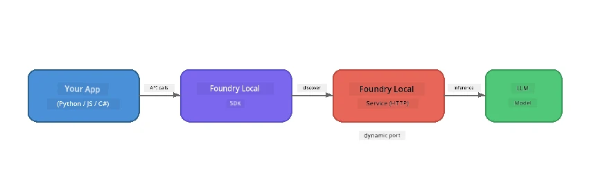

# Part 1: Getting Started with Foundry Local


## Wetin be Foundry Local?

[Foundry Local](https://foundrylocal.ai) make you fit run open-source AI language models **for your computer directly** - no need internet, no cloud money, and your data go always private. E dey:

- **Download and run models for your own machine** with automatic hardware optimisation (GPU, CPU, or NPU)
- **Get OpenAI-compatible API** so you fit use SDKs and tools wey you sabi already
- **No need Azure subscription** or sign-up - just install and start to build

Think am like you get your own private AI wey dey run completely for your own machine.

## Wetin You Go Learn

By the end of this lab, you go fit:

- Install the Foundry Local CLI for your operating system
- Understand wetin model aliases be and how dem dey work
- Download and run your first local AI model
- Send chat message go local model from the command line
- Understand the difference between local and cloud-hosted AI models

---

## Prerequisites

### System Requirements

| Requirement | Minimum | Recommended |
|-------------|---------|-------------|
| **RAM** | 8 GB | 16 GB |
| **Disk Space** | 5 GB (for models) | 10 GB |
| **CPU** | 4 cores | 8+ cores |
| **GPU** | Optional | NVIDIA with CUDA 11.8+ |
| **OS** | Windows 10/11 (x64/ARM), Windows Server 2025, macOS 13+ | - |

> **Note:** Foundry Local go automatically pick di best model variant wey fit your hardware. If you get NVIDIA GPU, e go use CUDA acceleration. If you get Qualcomm NPU, e go use am. Otherwise e go use optimized CPU variant.

### Install Foundry Local CLI

**Windows** (PowerShell):
```powershell
winget install Microsoft.FoundryLocal
```

**macOS** (Homebrew):
```bash
brew tap microsoft/foundrylocal
brew install foundrylocal
```

> **Note:** Foundry Local dey support only Windows and macOS now. Linux no dey supported now.

Verify the installation:
```bash
foundry --version
```

---

## Lab Exercises

### Exercise 1: Explore Available Models

Foundry Local get catalog of pre-optimized open-source models. List dem:

```bash
foundry model list
```

You go see models like:
- `phi-3.5-mini` - Microsoft 3.8B parameter model (fast, good quality)
- `phi-4-mini` - Newer, better Phi model
- `phi-4-mini-reasoning` - Phi model wey get chain-of-thought reasoning (`<think>` tags)
- `phi-4` - Microsoft largest Phi model (10.4 GB)
- `qwen2.5-0.5b` - Small and fast (good for low-resource devices)
- `qwen2.5-7b` - Strong general-purpose model wey fit call tools
- `qwen2.5-coder-7b` - Optimised for code generation
- `deepseek-r1-7b` - Strong reasoning model
- `gpt-oss-20b` - Large open-source model (MIT licence, 12.5 GB)
- `whisper-base` - Speech-to-text transcription (383 MB)
- `whisper-large-v3-turbo` - High accuracy transcription (9 GB)

> **Wetin be model alias?** Aliases like `phi-3.5-mini` na short form. When you use alias, Foundry Local go automatically download di best variant wey fit your hardware (CUDA for NVIDIA GPUs, CPU-optimized otherwise). You no need to stress yourself to choose the right variant.

### Exercise 2: Run Your First Model

Download and start to chat with model interactively:

```bash
foundry model run phi-3.5-mini
```

For di first time wey you run am, Foundry Local go:
1. Detect your hardware
2. Download the optimal model variant (this fit take few minutes)
3. Load the model into memory
4. Start interactive chat session

Try ask am some questions:
```
You: What is the golden ratio?
You: Can you explain it as if I were 10 years old?
You: Write a haiku about mathematics
```

Type `exit` or press `Ctrl+C` to stop.

### Exercise 3: Pre-download a Model

If you want download model without to start chat:

```bash
foundry model download phi-3.5-mini
```

Check which models dem don already download for your machine:

```bash
foundry cache list
```

### Exercise 4: Understand the Architecture

Foundry Local dey run as **local HTTP service** wey get OpenAI-compatible REST API. This mean say:

1. The service go start for **dynamic port** (different port every time)
2. You go use SDK to find di real endpoint URL
3. You fit use **any** OpenAI-compatible client library to talk to am



> **Important:** Foundry Local dey assign **dynamic port** each time e start. No ever hardcode port number like `localhost:5272`. Always use SDK to find the current URL (e.g. `manager.endpoint` for Python or `manager.urls[0]` for JavaScript).

---

## Key Takeaways

| Concept | Wetin You Learn |
|---------|-----------------|
| On-device AI | Foundry Local dey run models full for your device without cloud, API keys, or costs |
| Model aliases | Aliases like `phi-3.5-mini` go automatically select best variant for your hardware |
| Dynamic ports | Service dey run on dynamic port; always use SDK to find endpoint |
| CLI and SDK | You fit interact with models via CLI (`foundry model run`) or programmatically via SDK |

---

## Next Steps

Continue to [Part 2: Foundry Local SDK Deep Dive](part2-foundry-local-sdk.md) to sabi the SDK API for managing models, services, and caching programmatically.