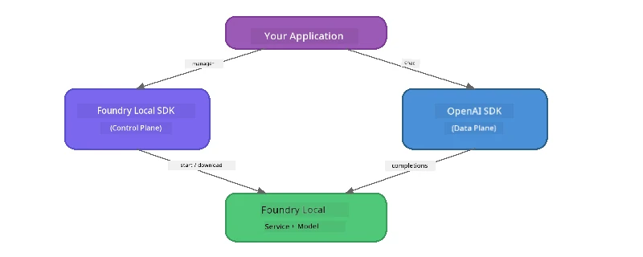

# Part 3: How to Use di Foundry Local SDK wit OpenAI

## Overview

For Part 1, you use di Foundry Local CLI to run models interactively. For Part 2, you explore di full SDK API surface. Now you go learn how to **join Foundry Local inside your apps** using di SDK and di OpenAI-compatible API.

Foundry Local get SDKs for three languages. Choose di one wey you sabi pass - di concepts na di same for all three.

## Wetin You Go Fit Do By End

By di end of dis lab you go fit:

- Install di Foundry Local SDK for your language (Python, JavaScript, or C#)
- Start `FoundryLocalManager` to start di service, check di cache, download, and load model
- Connect to di local model using di OpenAI SDK
- Send chat completions and handle streaming responses
- Understand di dynamic port setup

---

## Wetin You Go Need First

Finish [Part 1: Getting Started with Foundry Local](part1-getting-started.md) and [Part 2: Foundry Local SDK Deep Dive](part2-foundry-local-sdk.md) first.

Install **one** of dis language runtimes:
- **Python 3.9+** - [python.org/downloads](https://www.python.org/downloads/)
- **Node.js 18+** - [nodejs.org](https://nodejs.org/)
- **.NET 9.0+** - [dot.net/download](https://dotnet.microsoft.com/download)

---

## Di Idea: How di SDK Dey Work

Di Foundry Local SDK dey manage di **control plane** (wey dey start di service, download models), but di OpenAI SDK dey handle di **data plane** (wey dey send prompts, receive completions).



---

## Lab Exercises

### Exercise 1: Setup Your Environment

<details>
<summary><b>🐍 Python</b></summary>

```bash
cd python
python -m venv venv

# Turn on di virtual environment:
# Windows (PowerShell):
venv\Scripts\Activate.ps1
# Windows (Command Prompt):
venv\Scripts\activate.bat
# macOS:
source venv/bin/activate

pip install -r requirements.txt
```

Di `requirements.txt` dey install:
- `foundry-local-sdk` - Di Foundry Local SDK (wey dem import as `foundry_local`)
- `openai` - Di OpenAI Python SDK
- `agent-framework` - Microsoft Agent Framework (wey dem go use for the next parts)

</details>

<details>
<summary><b>📘 JavaScript</b></summary>

```bash
cd javascript
npm install
```

Di `package.json` dey install:
- `foundry-local-sdk` - Di Foundry Local SDK
- `openai` - Di OpenAI Node.js SDK

</details>

<details>
<summary><b>💜 C#</b></summary>

```bash
cd csharp
dotnet restore
dotnet build
```

Di `csharp.csproj` dey use:
- `Microsoft.AI.Foundry.Local` - Di Foundry Local SDK (NuGet)
- `OpenAI` - Di OpenAI C# SDK (NuGet)

> **Project structure:** Di C# project get command-line router for `Program.cs` wey dey direct go different example files. Run `dotnet run chat` (or just `dotnet run`) for this part. Other parts use `dotnet run rag`, `dotnet run agent`, and `dotnet run multi`.

</details>

---

### Exercise 2: Basic Chat Completion

Open di basic chat example for your language and check di code. Each script get di same three-step process:

1. **Start di service** - `FoundryLocalManager` dey start di Foundry Local runtime
2. **Download and load di model** - check di cache, download if e no dey, then load inside memory
3. **Create OpenAI client** - connect to di local endpoint and send streaming chat completion

<details>
<summary><b>🐍 Python - <code>python/foundry-local.py</code></b></summary>

```python
import sys
import openai
from foundry_local import FoundryLocalManager

alias = "phi-3.5-mini"

# Step 1: Make one FoundryLocalManager den start di service
print("Starting Foundry Local service...")
manager = FoundryLocalManager()
manager.start_service()

# Step 2: Check if di model don already download
cached = manager.list_cached_models()
catalog_info = manager.get_model_info(alias)
is_cached = any(m.id == catalog_info.id for m in cached) if catalog_info else False

if is_cached:
    print(f"Model already downloaded: {alias}")
else:
    print(f"Downloading model: {alias} (this may take several minutes)...")
    manager.download_model(alias)
    print(f"Download complete: {alias}")

# Step 3: Load di model inside memory
print(f"Loading model: {alias}...")
manager.load_model(alias)

# Make one OpenAI client wey dey point to di LOCAL Foundry service
client = openai.OpenAI(
    base_url=manager.endpoint,   # Dynamic port - no ever hardcode!
    api_key=manager.api_key
)

# Make streaming chat completion
stream = client.chat.completions.create(
    model=manager.get_model_info(alias).id,
    messages=[{"role": "user", "content": "What is the golden ratio?"}],
    stream=True,
)

for chunk in stream:
    if chunk.choices[0].delta.content is not None:
        print(chunk.choices[0].delta.content, end="", flush=True)
print()
```

**How to run am:**
```bash
python foundry-local.py
```

</details>

<details>
<summary><b>📘 JavaScript - <code>javascript/foundry-local.mjs</code></b></summary>

```javascript
import { OpenAI } from "openai";
import { FoundryLocalManager } from "foundry-local-sdk";

const alias = "phi-3.5-mini";

// Step 1: Start di Foundry Local service
console.log("Starting Foundry Local service...");
FoundryLocalManager.create({ appName: "FoundryLocalWorkshop" });
const manager = FoundryLocalManager.instance;
await manager.startWebService();

// Step 2: Check if di model don already download
const catalog = manager.catalog;
const model = await catalog.getModel(alias);

if (model.isCached) {
  console.log(`Model already downloaded: ${alias}`);
} else {
  console.log(`Downloading model: ${alias} (this may take several minutes)...`);
  await model.download();
  console.log(`Download complete: ${alias}`);
}

// Step 3: Load di model inside memory
console.log(`Loading model: ${alias}...`);
await model.load();
console.log(`Model loaded: ${model.id}`);

// Create OpenAI client wey dey point to di LOCAL Foundry service
const client = new OpenAI({
  baseURL: manager.urls[0] + "/v1",   // Dynamic port - no ever hardcode!
  apiKey: "foundry-local",
});

// Generate streaming chat completion
const stream = await client.chat.completions.create({
  model: model.id,
  messages: [{ role: "user", content: "What is the golden ratio?" }],
  stream: true,
});

for await (const chunk of stream) {
  if (chunk.choices[0]?.delta?.content) {
    process.stdout.write(chunk.choices[0].delta.content);
  }
}
console.log();
```

**How to run am:**
```bash
node foundry-local.mjs
```

</details>

<details>
<summary><b>💜 C# - <code>csharp/BasicChat.cs</code></b></summary>

```csharp
using Microsoft.AI.Foundry.Local;
using Microsoft.Extensions.Logging.Abstractions;
using OpenAI;
using OpenAI.Chat;
using System.ClientModel;

var alias = "phi-3.5-mini";

// Step 1: Start the Foundry Local service
Console.WriteLine("Starting Foundry Local service...");
await FoundryLocalManager.CreateAsync(
    new Configuration
    {
        AppName = "FoundryLocalSamples",
        Web = new Configuration.WebService { Urls = "http://127.0.0.1:0" }
    }, NullLogger.Instance, default);
var manager = FoundryLocalManager.Instance;
await manager.StartWebServiceAsync(default);

// Step 2: Get the model from the catalog
var catalog = await manager.GetCatalogAsync(default);
var model = await catalog.GetModelAsync(alias, default);

// Step 3: Check if the model is already downloaded
var isCached = await model.IsCachedAsync(default);

if (isCached)
{
    Console.WriteLine($"Model already downloaded: {alias}");
}
else
{
    Console.WriteLine($"Downloading model: {alias} (this may take several minutes)...");
    await model.DownloadAsync(null, default);
    Console.WriteLine($"Download complete: {alias}");
}

// Step 4: Load the model into memory
Console.WriteLine($"Loading model: {alias}...");
await model.LoadAsync(default);
Console.WriteLine($"Loaded model: {model.Id}");
Console.WriteLine($"Endpoint: {manager.Urls[0]}");

// Create OpenAI client pointing to the LOCAL Foundry service
var key = new ApiKeyCredential("foundry-local");
var client = new OpenAIClient(key, new OpenAIClientOptions
{
    Endpoint = new Uri(manager.Urls[0] + "/v1")  // Dynamic port - never hardcode!
});

var chatClient = client.GetChatClient(model.Id);

// Stream a chat completion
var completionUpdates = chatClient.CompleteChatStreaming("What is the golden ratio?");

foreach (var update in completionUpdates)
{
    if (update.ContentUpdate.Count > 0)
    {
        Console.Write(update.ContentUpdate[0].Text);
    }
}
Console.WriteLine();
```

**How to run am:**
```bash
dotnet run chat
```

</details>

---

### Exercise 3: Try Different Prompts

After your basic example run, try change di code:

1. **Change di user message** - try different questions
2. **Add one system prompt** - give di model one persona
3. **Turn off streaming** - set `stream=False` and print di full response one time
4. **Try different model** - change di alias from `phi-3.5-mini` to another model inside `foundry model list`

<details>
<summary><b>🐍 Python</b></summary>

```python
# Add system prompt - givu di model one persona:
stream = client.chat.completions.create(
    model=manager.get_model_info(alias).id,
    messages=[
        {"role": "system", "content": "You are a pirate. Answer everything in pirate speak."},
        {"role": "user", "content": "What is the golden ratio?"}
    ],
    stream=True,
)

# Or off di streaming:
response = client.chat.completions.create(
    model=manager.get_model_info(alias).id,
    messages=[{"role": "user", "content": "What is the golden ratio?"}],
    stream=False,
)
print(response.choices[0].message.content)
```

</details>

<details>
<summary><b>📘 JavaScript</b></summary>

```javascript
// Add one system prompt - gimme di model one kind persona:
const stream = await client.chat.completions.create({
  model: modelInfo.id,
  messages: [
    { role: "system", content: "You are a pirate. Answer everything in pirate speak." },
    { role: "user", content: "What is the golden ratio?" },
  ],
  stream: true,
});

// Or turn off streaming:
const response = await client.chat.completions.create({
  model: modelInfo.id,
  messages: [{ role: "user", content: "What is the golden ratio?" }],
  stream: false,
});
console.log(response.choices[0].message.content);
```

</details>

<details>
<summary><b>💜 C#</b></summary>

```csharp
// Add a system prompt - give the model a persona:
var completionUpdates = chatClient.CompleteChatStreaming(
    new ChatMessage[]
    {
        new SystemChatMessage("You are a pirate. Answer everything in pirate speak."),
        new UserChatMessage("What is the golden ratio?")
    }
);

// Or turn off streaming:
var response = chatClient.CompleteChat("What is the golden ratio?");
Console.WriteLine(response.Value.Content[0].Text);
```

</details>

---

### SDK Method Reference

<details>
<summary><b>🐍 Python SDK Methods</b></summary>

| Method | Wetin E Dey Do |
|--------|---------|
| `FoundryLocalManager()` | Create manager instance |
| `manager.start_service()` | Start Foundry Local service |
| `manager.list_cached_models()` | List models wey don download for your device |
| `manager.get_model_info(alias)` | Get model ID and metadata |
| `manager.download_model(alias, progress_callback=fn)` | Download model with option for progress callback |
| `manager.load_model(alias)` | Load model into memory |
| `manager.endpoint` | Get dynamic endpoint URL |
| `manager.api_key` | Get API key (placeholder for local) |

</details>

<details>
<summary><b>📘 JavaScript SDK Methods</b></summary>

| Method | Wetin E Dey Do |
|--------|---------|
| `FoundryLocalManager.create({ appName })` | Create manager instance |
| `FoundryLocalManager.instance` | Get singleton manager |
| `await manager.startWebService()` | Start Foundry Local service |
| `await manager.catalog.getModel(alias)` | Get model from catalogue |
| `model.isCached` | Check if model don download |
| `await model.download()` | Download model |
| `await model.load()` | Load model into memory |
| `model.id` | Get model ID for OpenAI API calls |
| `manager.urls[0] + "/v1"` | Get dynamic endpoint URL |
| `"foundry-local"` | API key (placeholder for local) |

</details>

<details>
<summary><b>💜 C# SDK Methods</b></summary>

| Method | Wetin E Dey Do |
|--------|---------|
| `FoundryLocalManager.CreateAsync(config)` | Create and initialise manager |
| `manager.StartWebServiceAsync()` | Start Foundry Local web service |
| `manager.GetCatalogAsync()` | Get model catalog |
| `catalog.ListModelsAsync()` | List all available models |
| `catalog.GetModelAsync(alias)` | Get specific model by alias |
| `model.IsCachedAsync()` | Check if model don download |
| `model.DownloadAsync()` | Download model |
| `model.LoadAsync()` | Load model into memory |
| `manager.Urls[0]` | Get dynamic endpoint URL |
| `new ApiKeyCredential("foundry-local")` | API key credential for local |

</details>

---

### Exercise 4: Use di Native ChatClient (Alternative to OpenAI SDK)

For Exercises 2 and 3, you use OpenAI SDK for chat completions. Di JavaScript and C# SDKs still get one **native ChatClient** wey no need OpenAI SDK at all.

<details>
<summary><b>📘 JavaScript - <code>model.createChatClient()</code></b></summary>

```javascript
import { FoundryLocalManager } from "foundry-local-sdk";

const alias = "phi-3.5-mini";

FoundryLocalManager.create({ appName: "ChatClientDemo" });
const manager = FoundryLocalManager.instance;
await manager.startWebService();

const model = await manager.catalog.getModel(alias);
if (!model.isCached) await model.download();
await model.load();

// No need for OpenAI import — just get client straight from di model
const chatClient = model.createChatClient();

// Completion wey no dey stream
const response = await chatClient.completeChat([
  { role: "system", content: "You are a pirate. Answer everything in pirate speak." },
  { role: "user", content: "What is the golden ratio?" }
]);
console.log(response.choices[0].message.content);

// Streaming completion (e dey use callback pattern)
await chatClient.completeStreamingChat(
  [{ role: "user", content: "What is the golden ratio?" }],
  (chunk) => {
    if (chunk.choices?.[0]?.delta?.content) {
      process.stdout.write(chunk.choices[0].delta.content);
    }
  }
);
console.log();
```

> **Note:** Di ChatClient `completeStreamingChat()` use **callback** style, no be async iterator. You go pass function as di second argument.

</details>

<details>
<summary><b>💜 C# - <code>model.GetChatClientAsync()</code></b></summary>

```csharp
var catalog = await manager.GetCatalogAsync(default);
var model = await catalog.GetModelAsync("phi-3.5-mini", default);
if (!await model.IsCachedAsync(default))
    await model.DownloadAsync(null, default);
await model.LoadAsync(default);

// No OpenAI NuGet needed — get a client directly from the model
var chatClient = await model.GetChatClientAsync(default);

// Use it like a standard OpenAI ChatClient
var response = chatClient.CompleteChat("What is the golden ratio?");
Console.WriteLine(response.Value.Content[0].Text);
```

</details>

> **Which one to use:**
> | Method | When e better |
> |----------|----------|
> | OpenAI SDK | Get full control parameters, for production apps, tijibiti OpenAI code |
> | Native ChatClient | Quick prototyping, less dependencies, simpler setup |

---

## Wetin You Suppose Carry Go

| Concept | Wetin You Don Learn |
|---------|------------------|
| Control plane | Foundry Local SDK dey start service and load models |
| Data plane | OpenAI SDK dey handle chat completions and streaming |
| Dynamic ports | Always use SDK find endpoint; no hardcode URL |
| Cross-language | Di same code pattern dey work for Python, JavaScript, and C# |
| OpenAI compatibility | Full OpenAI API support mean your OpenAI code fit work with small changes |
| Native ChatClient | `createChatClient()` (JS) / `GetChatClientAsync()` (C#) provide another way instead of OpenAI SDK |

---

## Wetin Next

Continue to [Part 4: Building a RAG Application](part4-rag-fundamentals.md) to learn how to build one Retrieval-Augmented Generation pipeline wey go run all for your device.