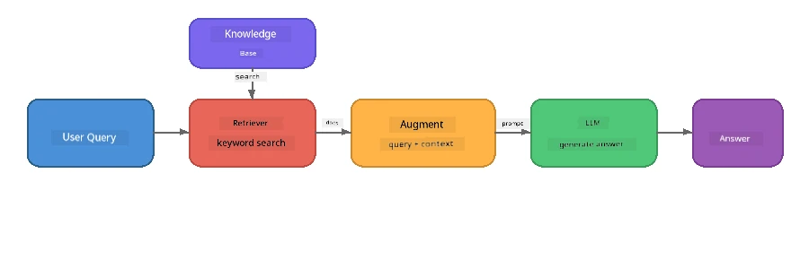

# Part 4: Building a RAG Application with Foundry Local

## Overview

Large Language Models strong well well, but dem only sabi wetin dey for dia training data. **Retrieval-Augmented Generation (RAG)** dey solve dis mata by giving di model correct kasala wey fit for di question time - e pull am from your own documents, databases, or knowledge bases.

For dis lab you go build complete RAG pipeline wey go run **entirely for your device** using Foundry Local. No cloud service, no vector databases, no embeddings API - na local retrieval and local model only.

## Learning Objectives

By di time we done this lab you go fit:

- Explain wetin RAG be and why e matter for AI applications
- Build local knowledge base from text documents
- Do simple retrieval function to find correct context
- Compose system prompt wey hold di model down for retrieved facts
- Run full Retrieve → Augment → Generate pipeline for your device
- Understand di wahala between simple keyword retrieval and vector search

---

## Prerequisites

- Complete [Part 3: Using the Foundry Local SDK with OpenAI](part3-sdk-and-apis.md)
- Foundry Local CLI wey you don install and `phi-3.5-mini` model wey don download

---

## Concept: Wetin be RAG?

If no RAG, LLM fit only answer from im training data - wey fit dey old, incomplete, or miss your private tori:

```
User: "What is Zava's return policy?"
LLM:  "I do not have information about Zava's return policy."  ← No context!
```

With RAG, you **retrieve** correct documents first, then **augment** di prompt with dat context before you **generate** answer:



Di main koko be: **di model no need "know" di answer; e just gats read di correct documents.**

---

## Lab Exercises

### Exercise 1: Understand the Knowledge Base

Open di RAG example for your language and check di knowledge base:

<details>
<summary><b>🐍 Python: <code>python/foundry-local-rag.py</code></b></summary>

Di knowledge base na simple list of dictionaries wey get `title` and `content` fields:

```python
KNOWLEDGE_BASE = [
    {
        "title": "Foundry Local Overview",
        "content": (
            "Foundry Local brings the power of Azure AI Foundry to your local "
            "device without requiring an Azure subscription..."
        ),
    },
    {
        "title": "Supported Hardware",
        "content": (
            "Foundry Local automatically selects the best model variant for "
            "your hardware. If you have an Nvidia CUDA GPU it downloads the "
            "CUDA-optimized model..."
        ),
    },
    # ... more tins dey inside
]
```

Each entry be like "chunk" of knowledge - one small piece of info about one topic.

</details>

<details>
<summary><b>📘 JavaScript: <code>javascript/foundry-local-rag.mjs</code></b></summary>

Di knowledge base use di same structure as array of objects:

```javascript
const KNOWLEDGE_BASE = [
  {
    title: "Foundry Local Overview",
    content:
      "Foundry Local brings the power of Azure AI Foundry to your local " +
      "device without requiring an Azure subscription...",
  },
  {
    title: "Supported Hardware",
    content:
      "Foundry Local automatically selects the best model variant for " +
      "your hardware...",
  },
  // ... more tins dem enter
];
```

</details>

<details>
<summary><b>💜 C#: <code>csharp/RagPipeline.cs</code></b></summary>

Di knowledge base use list of named tuples:

```csharp
private static readonly List<(string Title, string Content)> KnowledgeBase =
[
    ("Foundry Local Overview",
     "Foundry Local brings the power of Azure AI Foundry to your local " +
     "device without requiring an Azure subscription..."),

    ("Supported Hardware",
     "Foundry Local automatically selects the best model variant for " +
     "your hardware..."),

    // ... more entries
];
```

</details>

> **For real app dem**, di knowledge base fit come from files for disk, database, search index, or API. For dis lab, we use in-memory list make am simple.

---

### Exercise 2: Understand the Retrieval Function

Di retrieval part dey find di most relevant chunks for di user question. Dis example dey use **keyword overlap** - e dey count how many words for di query also dey each chunk:

<details>
<summary><b>🐍 Python</b></summary>

```python
def retrieve(query: str, top_k: int = 2) -> list[dict]:
    """Return the top-k knowledge chunks most relevant to the query."""
    query_words = set(query.lower().split())
    scored = []
    for chunk in KNOWLEDGE_BASE:
        chunk_words = set(chunk["content"].lower().split())
        overlap = len(query_words & chunk_words)
        scored.append((overlap, chunk))
    scored.sort(key=lambda x: x[0], reverse=True)
    return [item[1] for item in scored[:top_k]]
```

</details>

<details>
<summary><b>📘 JavaScript</b></summary>

```javascript
function retrieve(query, topK = 2) {
  const queryWords = new Set(query.toLowerCase().split(/\s+/));
  const scored = KNOWLEDGE_BASE.map((chunk) => {
    const chunkWords = new Set(chunk.content.toLowerCase().split(/\s+/));
    let overlap = 0;
    for (const w of queryWords) {
      if (chunkWords.has(w)) overlap++;
    }
    return { overlap, chunk };
  });
  scored.sort((a, b) => b.overlap - a.overlap);
  return scored.slice(0, topK).map((s) => s.chunk);
}
```

</details>

<details>
<summary><b>💜 C#</b></summary>

```csharp
private static List<(string Title, string Content)> Retrieve(string query, int topK = 2)
{
    var queryWords = new HashSet<string>(
        query.ToLowerInvariant().Split(' ', StringSplitOptions.RemoveEmptyEntries));

    return KnowledgeBase
        .Select(chunk =>
        {
            var chunkWords = new HashSet<string>(
                chunk.Content.ToLowerInvariant().Split(' ', StringSplitOptions.RemoveEmptyEntries));
            var overlap = queryWords.Intersect(chunkWords).Count();
            return (Overlap: overlap, Chunk: chunk);
        })
        .OrderByDescending(x => x.Overlap)
        .Take(topK)
        .Select(x => x.Chunk)
        .ToList();
}
```

</details>

**How e dey work:**
1. Split di query into individual words
2. For each knowledge chunk, count how many query words show for dat chunk
3. Sort by overlap score (high one first)
4. Return di top-k most relevant chunks

> **Trade-off:** Keyword overlap na simple method but e get limit; e no sabi synonyms or meaning well. For production RAG systems, dem dey usually use **embedding vectors** plus **vector database** for semantic search. But keyword overlap na good place to start and e no need extra dependencies.

---

### Exercise 3: Understand the Augmented Prompt

Di retrieved context dey put inside di **system prompt** before you send am to di model:

```python
system_prompt = (
    "You are a helpful assistant. Answer the user's question using ONLY "
    "the information provided in the context below. If the context does "
    "not contain enough information, say so.\n\n"
    f"Context:\n{context_text}"
)
```

Key design decisions:
- **"ONLY di information wey dem provide"** - e dey stop di model from dey hallucinate facts wey no dey for context
- **"If di context no get enough info, make you talk so"** - e dey encourage honest "I no know" answers
- Di context dey inside system message make e shape all di answers

---

### Exercise 4: Run the RAG Pipeline

Run di full example:

**Python:**
```bash
cd python
python foundry-local-rag.py
```

**JavaScript:**
```bash
cd javascript
node foundry-local-rag.mjs
```

**C#:**
```bash
cd csharp
dotnet run rag
```

You go see three tins print:
1. **Di question** wey dem ask
2. **Di retrieved context** - di chunks wey dem select from di knowledge base
3. **Di answer** - wey model generate only from dat context

Example output:
```
Question: How do I install Foundry Local and what hardware does it support?

--- Retrieved Context ---
### Installation
On Windows install Foundry Local with: winget install Microsoft.FoundryLocal...

### Supported Hardware
Foundry Local automatically selects the best model variant for your hardware...
-------------------------

Answer: To install Foundry Local, you can use the following methods depending
on your operating system: On Windows, run `winget install Microsoft.FoundryLocal`.
On macOS, use `brew install microsoft/foundrylocal/foundrylocal`...
```

Notice say di model answer **grounded** for di retrieved context - e just talk facts from di knowledge base documents.

---

### Exercise 5: Experiment and Extend

Try dem modification dem to sharpen your understanding:

1. **Change di question** - ask sometin wey dey for di knowledge base or sometin wey no dey:
   ```python
   question = "What programming languages does Foundry Local support?"  # ← Dey inside di matter
   question = "How much does Foundry Local cost?"                       # ← No dey inside di matter
   ```
   E go make di model talk "I no know" if answer no dey for di context?

2. **Add new knowledge chunk** - put new entry for `KNOWLEDGE_BASE`:
   ```python
   {
       "title": "Pricing",
       "content": "Foundry Local is completely free and open source under the MIT license.",
   }
   ```
   Now ask di pricing question again.

3. **Change `top_k`** - retrieve more or less chunks:
   ```python
   context_chunks = retrieve(question, top_k=3)  # More tins make am clear
   context_chunks = retrieve(question, top_k=1)  # Less tins make am clear
   ```
   How di amount of context affect di answer quality?

4. **Remove di grounding instruction** - change di system prompt to "You be helpful assistant." make you see if di model go start dey hallucinate facts.

---

## Deep Dive: Optimising RAG for On-Device Performance

Running RAG on-device get some wahala wey no dey for cloud: limited RAM, no dedicated GPU (na CPU/NPU e go run), plus small model context window. Di design decisions below dey address these wahala and dem based on how production-style local RAG apps dem build with Foundry Local.

### Chunking Strategy: Fixed-Size Sliding Window

Chunking - how you divide documents into pieces - na one of di most important decisions for any RAG system. For on-device, **fixed-size sliding window with overlap** na di recommended way to start:

| Parameter | Recommended Value | Why |
|-----------|------------------|-----|
| **Chunk size** | ~200 tokens | E keep di retrieved context small so Phi-3.5 Mini context window get space for system prompt, conversation history, plus generated output |
| **Overlap** | ~25 tokens (12.5%) | E stop info loss for chunk border - important for procedures and step-by-step instructions |
| **Tokenization** | Whitespace split | No extra dependencies, no tokenizer library needed. All compute budget na for LLM |

Di overlap dey work like sliding window: each new chunk start 25 tokens before di previous one end, so sentence wey span chunks go show for both chunks.

> **Why not other methods?**
> - **Sentence-based splitting** get unpredictable chunk sizes; some procedures na one long sentence wey no go split well
> - **Section-aware splitting** (on `##` headings) dey create chunk sizes wey fit vary well well - some too small, others too big for di model context window
> - **Semantic chunking** (embedding-based topic detection) get best retrieval quality, but e need second model inside memory alongside Phi-3.5 Mini - e fit risky for hardware with 8-16 GB shared memory

### Stepping Up Retrieval: TF-IDF Vectors

Di keyword overlap method for dis lab dey work, but if you want beta retrieval without adding embedding model, **TF-IDF (Term Frequency-Inverse Document Frequency)** na very good middle ground:

```
Keyword Overlap  →  TF-IDF Vectors  →  Embedding Models
    (this lab)     (lightweight upgrade)   (production)
  Simple & fast    Better ranking,         Best quality,
  No dependencies  still no ML model       requires embedding model
  ~Basic matching  ~1ms retrieval          ~100-500ms per query
```

TF-IDF dey change each chunk into numeric vector based on how important each word be inside dat chunk *compared to all chunks*. For query time, question go dey vectorize same way then compare using cosine similarity. You fit implement am with SQLite plus pure JavaScript/Python - no vector database, no embedding API.

> **Performance:** TF-IDF cosine similarity on fixed-size chunks dey achieve **~1ms retrieval**, unlike ~100-500ms when embedding model encode each query. All 20+ documents fit chunk and index for under one second.

### Edge/Compact Mode for Constrained Devices

If dey run on very constrained hardware (old laptop, tablet, field device), you fit reduce resource usage by shrinking dis three knobs:

| Setting | Standard Mode | Edge/Compact Mode |
|---------|--------------|-------------------|
| **System prompt** | ~300 tokens | ~80 tokens |
| **Max output tokens** | 1024 | 512 |
| **Retrieved chunks (top-k)** | 5 | 3 |

If you retrieve fewer chunks, model get less context to process, so latency and memory pressure go reduce. Shorter system prompt dey free more context window for correct answer. Dis kind trade-off good on devices wey every token context matter.

### Single Model in Memory

One important rule for on-device RAG: **make sure say only one model dey loaded**. If you run embedding model for retrieval *and* language model for generating, you split limited NPU/RAM resource between two models. Lightweight retrieval (keyword overlap, TF-IDF) no get dis problem:

- No embedding model dey compete with LLM for memory
- Faster cold start - only one model to load
- Predictable memory use - LLM get all di resource
- E fit run on machine with as low as 8 GB RAM

### SQLite as a Local Vector Store

For small to medium document collections (hundreds to small thousands of chunks), **SQLite fast well** for brute-force cosine similarity search and no extra infrastructure:

- Single `.db` file for disk - no server process or configuration
- Dey come with every major language runtime (Python `sqlite3`, Node.js `better-sqlite3`, .NET `Microsoft.Data.Sqlite`)
- Stores document chunks plus TF-IDF vectors for one table together
- No need for Pinecone, Qdrant, Chroma, or FAISS for this scale

### Performance Summary

These design choices dey make RAG fast and responsive for normal consumer hardware:

| Metric | On-Device Performance |
|--------|----------------------|
| **Retrieval latency** | ~1ms (TF-IDF) to ~5ms (keyword overlap) |
| **Ingestion speed** | 20 documents chunk and index for less than 1 second |
| **Models in memory** | 1 (LLM only - no embedding model) |
| **Storage overhead** | Less than 1 MB for chunks + vectors inside SQLite |
| **Cold start** | Single model load, no embedding runtime startup |
| **Hardware floor** | 8 GB RAM, CPU only (no GPU required) |

> **When to upgrade:** If your content scale reach hundreds long documents, mixed type content (tables, code, prose), or you need semantic understanding for queries, try add embedding model and use vector similarity search. But for most on-device apps wey focus on small document sets, TF-IDF + SQLite dey deliver better result with small resource use.

---

## Key Concepts

| Concept | Description |
|---------|-------------|
| **Retrieval** | Finding correct documents from knowledge base based on user query |
| **Augmentation** | Put retrieved documents inside prompt as context |
| **Generation** | LLM produce answer wey stand on top di context given |
| **Chunking** | Break big documents into small, focused pieces |
| **Grounding** | Make model use only info wey dem provide (reduce hallucination) |
| **Top-k** | Di number of most-relevant chunks wey you go retrieve |

---

## RAG in Production vs. This Lab

| Aspect | This Lab | On-Device optimised | Cloud Production |
|--------|----------|--------------------|-----------------|
| **Knowledge base** | In-memory list | Files on disk, SQLite | Database, search index |
| **Retrieval** | Keyword overlap | TF-IDF + cosine similarity | Vector embeddings + similarity search |
| **Embeddings** | None needed | None - TF-IDF vectors | Embedding model (local or cloud) |
| **Vector store** | None needed | SQLite (single `.db` file) | FAISS, Chroma, Azure AI Search, etc. |
| **Chunking** | Manual | Fixed-size sliding window (~200 tokens, 25-token overlap) | Semantic or recursive chunking |
| **Models in memory** | 1 (LLM) | 1 (LLM) | 2+ (embedding + LLM) |
| **Retrieval latency** | ~5ms | ~1ms | ~100-500ms |
| **Scale** | 5 documents | Hundreds of documents | Millions of documents |

Di patterns wey you go learn here (retrieve, augment, generate) na di same for any scale. Di retrieval method dey improve, but di overall architecture remain di same. Di middle column dey show wetin fit happen on-device with lightweight techniques, wey often be di sweet spot for local applications where you trade cloud-scale for privacy, offline capability, and zero latency to external services.

---

## Key Takeaways

| Concept | Wetin You Learn |
|---------|------------------|
| RAG pattern | Retrieve + Augment + Generate: give di model di correct context and e fit answer questions about your data |
| On-device | Everything dey run locally with no cloud APIs or vector database subscriptions |
| Grounding instructions | System prompt constraints dey important well well to stop hallucination |
| Keyword overlap | Na simple but effective starting point for retrieval |
| TF-IDF + SQLite | Na lightweight upgrade path wey keep retrieval under 1ms with no need embedding model |
| One model in memory | Make you no load embedding model together with di LLM for constrained hardware |
| Chunk size | About 200 tokens with overlap balance retrieval precision and context window efficiency |
| Edge/compact mode | Use fewer chunks and shorter prompts for very constrained devices |
| Universal pattern | Di same RAG architecture dey work for any data source: documents, databases, APIs, or wikis |

> **You wan see full on-device RAG application?** Check out [Gas Field Local RAG](https://github.com/leestott/local-rag), na production-style offline RAG agent wey dem build with Foundry Local and Phi-3.5 Mini wey show these optimisation patterns with real document set.

---

## Next Steps

Continue to [Part 5: Building AI Agents](part5-single-agents.md) to learn how to build intelligent agents with personas, instructions, and multi-turn conversations using the Microsoft Agent Framework.