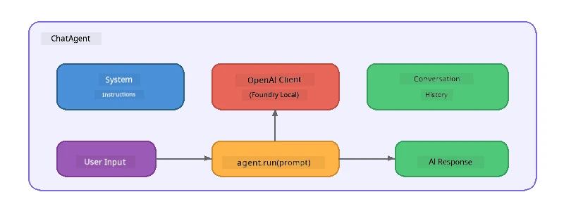

# Part 5: Building AI Agents with the Agent Framework

> **Goal:** Build your first AI agent with persistent instructions and a defined persona, powered by a local model through Foundry Local.

## Wetin AI Agent Be?

AI agent dey wrap language model wit **system instructions** wey define how e go behave, e personality, and di boundaries wey e get. E no be like one single chat completion call, agent dey give:

- **Persona** - one consistent identity ("You be helpful code reviewer")
- **Memory** - conversation history wey dey go on across different turns
- **Specialisation** - focused behaviour wey sharp instructions dey control



---

## The Microsoft Agent Framework

The **Microsoft Agent Framework** (AGF) na one standard agent abstraction wey fit work wit different model backends. For dis workshop we use am with Foundry Local so everything go run for your machine— no cloud needed.

| Concept | Description |
|---------|-------------|
| `FoundryLocalClient` | Python: dey handle service start, model download/load, plus dey create agents |
| `client.as_agent()` | Python: dey create agent from Foundry Local client |
| `AsAIAgent()` | C#: extension method on `ChatClient` - dey create `AIAgent` |
| `instructions` | System prompt wey dey shape how agent go behave |
| `name` | Label wey human go fit understand, useful for multi-agent scenarios |
| `agent.run(prompt)` / `RunAsync()` | Dey send user message and return agent response |

> **Note:** The Agent Framework get Python and .NET SDK. For JavaScript, we build lightweight `ChatAgent` class wey dey follow di same pattern wit OpenAI SDK directly.

---

## Exercises

### Exercise 1 - Understand the Agent Pattern

Before you write code, make you study di key parts of agent:

1. **Model client** - connection to Foundry Local OpenAI-compatible API
2. **System instructions** - na di "personality" prompt
3. **Run loop** - send user input, receive output

> **Think about am:** How system instructions dey different from regular user message? Wetin go happen if you change dem?

---

### Exercise 2 - Run the Single-Agent Example

<details>
<summary><strong>🐍 Python</strong></summary>

**Prerequisites:**
```bash
cd python
python -m venv venv

# Windows (PowerShell):
venv\Scripts\Activate.ps1
# macOS:
source venv/bin/activate

pip install -r requirements.txt
```

**Run:**
```bash
python foundry-local-with-agf.py
```

**Code walkthrough** (`python/foundry-local-with-agf.py`):

```python
import asyncio
from agent_framework_foundry_local import FoundryLocalClient

async def main():
    alias = "phi-4-mini"

    # FoundryLocalClient dey manage service start, model download, and loading
    client = FoundryLocalClient(model_id=alias)
    print(f"Client Model ID: {client.model_id}")

    # Create one agent wit system instructions
    agent = client.as_agent(
        name="Joker",
        instructions="You are good at telling jokes.",
    )

    # Non-streaming: collect the full response one time
    result = await agent.run("Tell me a joke about a pirate.")
    print(f"Agent: {result}")

    # Streaming: dey collect results as dem dey generate
    async for chunk in agent.run("Tell me another joke.", stream=True):
        if chunk.text:
            print(chunk.text, end="", flush=True)

asyncio.run(main())
```

**Key points:**
- `FoundryLocalClient(model_id=alias)` dey handle service start, download, and model loading all at once
- `client.as_agent()` dey create agent wit system instructions and name
- `agent.run()` dey support both non-streaming and streaming modes
- Install wit `pip install agent-framework-foundry-local --pre`

</details>

<details>
<summary><strong>📦 JavaScript</strong></summary>

**Prerequisites:**
```bash
cd javascript
npm install
```

**Run:**
```bash
node foundry-local-with-agent.mjs
```

**Code walkthrough** (`javascript/foundry-local-with-agent.mjs`):

```javascript
import { OpenAI } from "openai";
import { FoundryLocalManager } from "foundry-local-sdk";

class ChatAgent {
  constructor({ client, modelId, instructions, name }) {
    this.client = client;
    this.modelId = modelId;
    this.instructions = instructions;
    this.name = name;
    this.history = [];
  }

  async run(userMessage) {
    const messages = [
      { role: "system", content: this.instructions },
      ...this.history,
      { role: "user", content: userMessage },
    ];
    const response = await this.client.chat.completions.create({
      model: this.modelId,
      messages,
    });
    const assistantMessage = response.choices[0].message.content;

    // Make we keep wetin we talk before when we dey yarn many times
    this.history.push({ role: "user", content: userMessage });
    this.history.push({ role: "assistant", content: assistantMessage });
    return { text: assistantMessage };
  }
}

async function main() {
  FoundryLocalManager.create({ appName: "FoundryLocalWorkshop" });
  const manager = FoundryLocalManager.instance;
  await manager.startWebService();

  const catalog = manager.catalog;
  const model = await catalog.getModel("phi-3.5-mini");
  if (!model.isCached) {
    console.log("Downloading model: phi-3.5-mini...");
    await model.download();
  }
  await model.load();

  const client = new OpenAI({
    baseURL: manager.urls[0] + "/v1",
    apiKey: "foundry-local",
  });

  const agent = new ChatAgent({
    client,
    modelId: model.id,
    instructions: "You are good at telling jokes.",
    name: "Joker",
  });

  const result = await agent.run("Tell me a joke about a pirate.");
  console.log(result.text);
}

main();
```

**Key points:**
- JavaScript create im own `ChatAgent` class wey dey follow Python AGF pattern
- `this.history` dey store conversation turns for multi-turn support
- Explicit `startWebService()` → cache check → `model.download()` → `model.load()` dey show full process

</details>

<details>
<summary><strong>💜 C#</strong></summary>

**Prerequisites:**
```bash
cd csharp
dotnet restore
```

**Run:**
```bash
dotnet run agent
```

**Code walkthrough** (`csharp/SingleAgent.cs`):

```csharp
using Microsoft.AI.Foundry.Local;
using Microsoft.Extensions.Logging.Abstractions;
using Microsoft.Agents.AI;
using OpenAI;
using System.ClientModel;

// 1. Start Foundry Local and load a model
var alias = "phi-3.5-mini";
await FoundryLocalManager.CreateAsync(
    new Configuration
    {
        AppName = "FoundryLocalSamples",
        Web = new Configuration.WebService { Urls = "http://127.0.0.1:0" }
    }, NullLogger.Instance, default);
var manager = FoundryLocalManager.Instance;
await manager.StartWebServiceAsync(default);

var catalog = await manager.GetCatalogAsync(default);
var model = await catalog.GetModelAsync(alias, default);

var isCached = await model.IsCachedAsync(default);
if (!isCached)
{
    Console.WriteLine($"Downloading model: {alias}...");
    await model.DownloadAsync(null, default);
}
await model.LoadAsync(default);

var key = new ApiKeyCredential("foundry-local");
var client = new OpenAIClient(key, new OpenAIClientOptions
{
    Endpoint = new Uri(manager.Urls[0] + "/v1")
});

// 2. Create an AIAgent using the Agent Framework extension method
AIAgent joker = client
    .GetChatClient(model.Id)
    .AsAIAgent(
        instructions: "You are good at telling jokes. Keep your jokes short and family-friendly.",
        name: "Joker"
    );

// 3. Run the agent (non-streaming)
var response = await joker.RunAsync("Tell me a joke about a pirate.");
Console.WriteLine($"Joker: {response}");

// 4. Run with streaming
await foreach (var update in joker.RunStreamingAsync("Tell me another joke."))
{
    Console.Write(update);
}
```

**Key points:**
- `AsAIAgent()` na extension method from `Microsoft.Agents.AI.OpenAI` - no need create custom `ChatAgent` class
- `RunAsync()` dey return full response; `RunStreamingAsync()` dey stream token by token
- Install wit `dotnet add package Microsoft.Agents.AI.OpenAI --version 1.0.0-rc3`

</details>

---

### Exercise 3 - Change the Persona

Modify agent `instructions` make e get different persona. Try each one and notice how output change:

| Persona | Instructions |
|---------|-------------|
| Code Reviewer | `"You be expert code reviewer. Provide constructive feedback wey focus on readability, performance, and correctness."` |
| Travel Guide | `"You be friendly travel guide. Give personalized recommendations for destinations, activities, and local food."` |
| Socratic Tutor | `"You be Socratic tutor. No dey give direct answer - instead, guide the student wit good questions."` |
| Technical Writer | `"You be technical writer. Explain concepts clear and short. Use examples. No use big grammar."` |

**Try am:**
1. Pick persona from di table above
2. Change `instructions` string for the code
3. Adjust user prompt to fit (e.g. ask code reviewer to review function)
4. Run am again and compare output

> **Tip:** Di quality of agent depend plenty on di instructions. Specific and well-structured instructions dey give better result pass vague ones.

---

### Exercise 4 - Add Multi-Turn Conversation

Extend example to support multi-turn chat loop make you fit get beta back-and-forth conversation with agent.

<details>
<summary><strong>🐍 Python - multi-turn loop</strong></summary>

```python
import asyncio
from agent_framework_foundry_local import FoundryLocalClient

async def main():
    client = FoundryLocalClient(model_id="phi-4-mini")

    agent = client.as_agent(
        name="Assistant",
        instructions="You are a helpful assistant.",
    )

    print("Chat with the agent (type 'quit' to exit):\n")
    while True:
        user_input = input("You: ")
        if user_input.strip().lower() in ("quit", "exit"):
            break
        result = await agent.run(user_input)
        print(f"Agent: {result}\n")

asyncio.run(main())
```

</details>

<details>
<summary><strong>📦 JavaScript - multi-turn loop</strong></summary>

```javascript
import { OpenAI } from "openai";
import { FoundryLocalManager } from "foundry-local-sdk";
import * as readline from "node:readline/promises";

// (mek we use ChatAgent class from Exercise 2 again)

async function main() {
  FoundryLocalManager.create({ appName: "FoundryLocalWorkshop" });
  const manager = FoundryLocalManager.instance;
  await manager.startWebService();

  const catalog = manager.catalog;
  const model = await catalog.getModel("phi-3.5-mini");
  if (!model.isCached) {
    console.log("Downloading model: phi-3.5-mini...");
    await model.download();
  }
  await model.load();

  const client = new OpenAI({
    baseURL: manager.urls[0] + "/v1",
    apiKey: "foundry-local",
  });

  const agent = new ChatAgent({
    client,
    modelId: model.id,
    instructions: "You are a helpful assistant.",
    name: "Assistant",
  });

  const rl = readline.createInterface({
    input: process.stdin,
    output: process.stdout,
  });

  console.log("Chat with the agent (type 'quit' to exit):\n");
  while (true) {
    const userInput = await rl.question("You: ");
    if (["quit", "exit"].includes(userInput.trim().toLowerCase())) break;
    const result = await agent.run(userInput);
    console.log(`Agent: ${result.text}\n`);
  }
  rl.close();
}

main();
```

</details>

<details>
<summary><strong>💜 C# - multi-turn loop</strong></summary>

```csharp
using Microsoft.AI.Foundry.Local;
using Microsoft.Extensions.Logging.Abstractions;
using Microsoft.Agents.AI;
using OpenAI;
using System.ClientModel;

var alias = "phi-3.5-mini";
var config = new Configuration
{
    AppName = "FoundryLocalSamples",
    Web = new Configuration.WebService { Urls = "http://127.0.0.1:0" }
};
await FoundryLocalManager.CreateAsync(config, NullLogger.Instance, default);
var manager = FoundryLocalManager.Instance;
await manager.StartWebServiceAsync(default);

var catalog = await manager.GetCatalogAsync(default);
var model = await catalog.GetModelAsync(alias, default);

var isCached = await model.IsCachedAsync(default);
if (!isCached)
{
    Console.WriteLine($"Downloading model: {alias}...");
    await model.DownloadAsync(null, default);
}
await model.LoadAsync(default);

var key = new ApiKeyCredential("foundry-local");
var client = new OpenAIClient(key, new OpenAIClientOptions
{
    Endpoint = new Uri(manager.Urls[0] + "/v1")
});

AIAgent agent = client
    .GetChatClient(model.Id)
    .AsAIAgent(
        instructions: "You are a helpful assistant.",
        name: "Assistant"
    );

Console.WriteLine("Chat with the agent (type 'quit' to exit):\n");
while (true)
{
    Console.Write("You: ");
    var userInput = Console.ReadLine();
    if (string.IsNullOrWhiteSpace(userInput) ||
        userInput.Equals("quit", StringComparison.OrdinalIgnoreCase) ||
        userInput.Equals("exit", StringComparison.OrdinalIgnoreCase))
        break;

    var result = await agent.RunAsync(userInput);
    Console.WriteLine($"Agent: {result}\n");
}
```

</details>

See how agent remember previous turns - ask follow-up question and watch di context carry go.

---

### Exercise 5 - Structured Output

Tell agent make e always respond for one specific format (like JSON) and parse di result:

<details>
<summary><strong>🐍 Python - JSON output</strong></summary>

```python
import asyncio
import json
from agent_framework_foundry_local import FoundryLocalClient

async def main():
    client = FoundryLocalClient(model_id="phi-4-mini")

    agent = client.as_agent(
        name="SentimentAnalyzer",
        instructions=(
            "You are a sentiment analysis agent. "
            "For every user message, respond ONLY with valid JSON in this format: "
            '{"sentiment": "positive|negative|neutral", "confidence": 0.0-1.0, "summary": "brief reason"}'
        ),
    )

    result = await agent.run("I absolutely loved the new restaurant downtown!")
    print("Raw:", result)

    try:
        parsed = json.loads(str(result))
        print(f"Sentiment: {parsed['sentiment']} (confidence: {parsed['confidence']})")
    except json.JSONDecodeError:
        print("Agent did not return valid JSON - try refining the instructions.")

asyncio.run(main())
```

</details>

<details>
<summary><strong>💜 C# - JSON output</strong></summary>

```csharp
using System.Text.Json;

AIAgent analyzer = chatClient.AsAIAgent(
    name: "SentimentAnalyzer",
    instructions:
        "You are a sentiment analysis agent. " +
        "For every user message, respond ONLY with valid JSON in this format: " +
        "{\"sentiment\": \"positive|negative|neutral\", \"confidence\": 0.0-1.0, \"summary\": \"brief reason\"}"
);

var response = await analyzer.RunAsync("I absolutely loved the new restaurant downtown!");
Console.WriteLine($"Raw: {response}");

try
{
    var parsed = JsonSerializer.Deserialize<JsonElement>(response.ToString());
    Console.WriteLine($"Sentiment: {parsed.GetProperty("sentiment")} " +
                      $"(confidence: {parsed.GetProperty("confidence")})");
}
catch (JsonException)
{
    Console.WriteLine("Agent did not return valid JSON - try refining the instructions.");
}
```

</details>

> **Note:** Small local models no always dey produce perfectly valid JSON. You fit make am beta by including example inside instructions and dey very clear about expected format.

---

## Key Takeaways

| Concept | Wetin You Learn |
|---------|-----------------|
| Agent vs. raw LLM call | Agent dey wrap model wit instructions and memory |
| System instructions | Na di most important control for agent behaviour |
| Multi-turn conversation | Agents fit carry context from many user interactions |
| Structured output | Instructions fit enforce output format (JSON, markdown, etc.) |
| Local execution | Everything dey run on-device wit Foundry Local - no cloud needed |

---

## Next Steps

For **[Part 6: Multi-Agent Workflows](part6-multi-agent-workflows.md)**, you go combine many agents join for coordinated pipeline where each agent get im own specialised role.