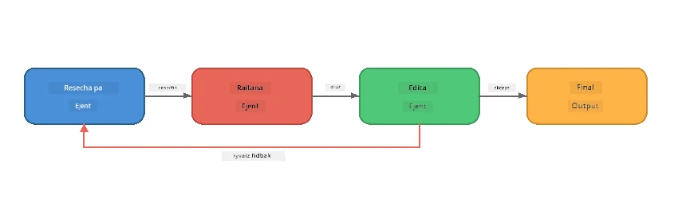
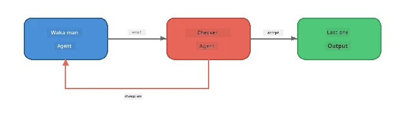
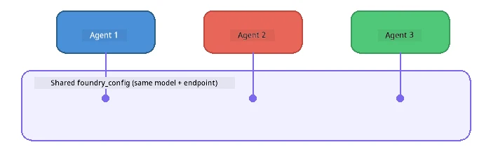

# Part 6: Multi-Agent Workflows

> **Goal:** Combine plenti specialist agents dem into one coordinated pipelines wey divide complex task dem among collaborating agents - all dey run locally with Foundry Local.

## Why Multi-Agent?

One agent fit handle many task dem, but complex workflows dey benefit from **Specialisation**. Instead make one agent dey try research, write, and edit together, you go break the work into focused roles:



| Pattern | Description |
|---------|-------------|
| **Sequential** | Output wey Agent A produce dey feed Agent B → Agent C |
| **Feedback loop** | One evaluator agent fit send work back make dem do revision |
| **Shared context** | All agents dey use the same model/endpoint, but dem get different instructions |
| **Typed output** | Agents dey produce structured results (JSON) for reliable hand-offs |

---

## Exercises

### Exercise 1 - Run the Multi-Agent Pipeline

The workshop get complete Researcher → Writer → Editor workflow.

<details>
<summary><strong>🐍 Python</strong></summary>

**Setup:**
```bash
cd python
python -m venv venv

# Windows (PowerShell):
venv\Scripts\Activate.ps1
# macOS:
source venv/bin/activate

pip install -r requirements.txt
```

**Run:**
```bash
python foundry-local-multi-agent.py
```

**Wetin go happen:**
1. **Researcher** go receive one topic and return bullet-point facts
2. **Writer** go carry the research take draft one blog post (3-4 paragraphs)
3. **Editor** go check the article for quality and return ACCEPT or REVISE

</details>

<details>
<summary><strong>📦 JavaScript</strong></summary>

**Setup:**
```bash
cd javascript
npm install
```

**Run:**
```bash
node foundry-local-multi-agent.mjs
```

**Same three-stage pipeline** - Researcher → Writer → Editor.

</details>

<details>
<summary><strong>💜 C#</strong></summary>

**Setup:**
```bash
cd csharp
dotnet restore
```

**Run:**
```bash
dotnet run multi
```

**Same three-stage pipeline** - Researcher → Writer → Editor.

</details>

---

### Exercise 2 - Anatomy of the Pipeline

Make you study how dem define and connect agents:

**1. Shared model client**

All agents dey share the same Foundry Local model:

```python
# Python - FoundryLocalClient dey handle everytin
from agent_framework_foundry_local import FoundryLocalClient

client = FoundryLocalClient(model_id="phi-3.5-mini")
```

```javascript
// JavaScript - OpenAI SDK point dem to Foundry Local
const client = new OpenAI({
  baseURL: manager.urls[0] + "/v1",
  apiKey: "foundry-local",
});
```

```csharp
// C# - OpenAIClient pointed at Foundry Local
var key = new ApiKeyCredential("foundry-local");
var client = new OpenAIClient(key, new OpenAIClientOptions
{
    Endpoint = new Uri(manager.Urls[0] + "/v1")
});
var chatClient = client.GetChatClient(model.Id);
```

**2. specialised instructions**

Each agent get im own unique persona:

| Agent | Instructions (summary) |
|-------|----------------------|
| Researcher | "Give important facts, statistics, and background. Arrange am as bullet points." |
| Writer | "Write one engaging blog post (3-4 paragraphs) from the research notes. No dey invent facts." |
| Editor | "Review for clarity, grammar, and factual consistency. Verdict: ACCEPT or REVISE." |

**3. Data flows between agents**

```python
# Step 1 - wetin researcher comot go turn input for writer
research_result = await researcher.run(f"Research: {topic}")

# Step 2 - wetin writer comot go turn input for editor
writer_result = await writer.run(f"Write using:\n{research_result}")

# Step 3 - editor go check both di research and di article
editor_result = await editor.run(
    f"Research:\n{research_result}\n\nArticle:\n{writer_result}"
)
```

```csharp
// C# - same pattern, async calls with AIAgent
var researchNotes = await researcher.RunAsync(
    $"Research the following topic and provide key facts:\n{topic}");

var draft = await writer.RunAsync(
    $"Write a blog post based on these research notes:\n\n{researchNotes}");

var verdict = await editor.RunAsync(
    $"Review this article for quality and accuracy.\n\n" +
    $"Research notes:\n{researchNotes}\n\n" +
    $"Article:\n{draft}");
```

> **Key insight:** Each agent dey receive cumulative context from previous agents. The editor go see both the original research and the draft - dis one make e fit check factual consistency.

---

### Exercise 3 - Add a Fourth Agent

Extend the pipeline by adding new agent. Choose one:

| Agent | Purpose | Instructions |
|-------|---------|-------------|
| **Fact-Checker** | Verify claims inside the article | `"You go verify factual claims. For each claim, talk if e dey supported by the research notes. Return JSON wit verified/unverified items."` |
| **Headline Writer** | Create catchy titles | `"Generate 5 headline options for the article. Change style: informative, clickbait, question, listicle, emotional."` |
| **Social Media** | Create promotional posts | `"Create 3 social media posts wey dey promote this article: one for Twitter (280 chars), one for LinkedIn (professional tone), one for Instagram (casual with emoji suggestions)."` |

<details>
<summary><strong>🐍 Python - adding a Headline Writer</strong></summary>

```python
headline_agent = client.as_agent(
    name="HeadlineWriter",
    instructions=(
        "You are a headline specialist. Given an article, generate exactly "
        "5 headline options. Vary the style: informative, question-based, "
        "listicle, emotional, and provocative. Return them as a numbered list."
    ),
)

# After di editor agree, mek di headlines
headline_result = await headline_agent.run(
    f"Generate headlines for this article:\n\n{writer_result}"
)
print(f"\n--- Headlines ---\n{headline_result}")
```

</details>

<details>
<summary><strong>📦 JavaScript - adding a Headline Writer</strong></summary>

```javascript
const headlineAgent = new ChatAgent({
  client,
  modelId: modelInfo.id,
  instructions:
    "You are a headline specialist. Given an article, generate exactly " +
    "5 headline options. Vary the style: informative, question-based, " +
    "listicle, emotional, and provocative. Return them as a numbered list.",
  name: "HeadlineWriter",
});

const headlineResult = await headlineAgent.run(
  `Generate headlines for this article:\n\n${writerResult.text}`
);
console.log(`\n--- Headlines ---\n${headlineResult.text}`);
```

</details>

<details>
<summary><strong>💜 C# - adding a Headline Writer</strong></summary>

```csharp
AIAgent headlineAgent = chatClient.AsAIAgent(
    name: "HeadlineWriter",
    instructions:
        "You are a headline specialist. Given an article, generate exactly " +
        "5 headline options. Vary the style: informative, question-based, " +
        "listicle, emotional, and provocative. Return them as a numbered list."
);

// After the editor accepts, generate headlines
var headlines = await headlineAgent.RunAsync(
    $"Generate headlines for this article:\n\n{draft}");
Console.WriteLine($"\n--- Headlines ---\n{headlines}");
```

</details>

---

### Exercise 4 - Design Your Own Workflow

Design multi-agent pipeline for another area. Here are some ideas:

| Domain | Agents | Flow |
|--------|--------|------|
| **Code Review** | Analyser → Reviewer → Summariser | Analyse code structure → review for any wahala → produce summary report |
| **Customer Support** | Classifier → Responder → QA | Classify ticket → draft response → check quality |
| **Education** | Quiz Maker → Student Simulator → Grader | Generate quiz → simulate answers → grade and explain |
| **Data Analysis** | Interpreter → Analyst → Reporter | Interpret data request → analyse patterns → write report |

**Steps:**
1. Define 3+ agents with different `instructions`
2. Decide the data flow - wetin each agent go receive and produce?
3. Make the pipeline using patterns from Exercises 1-3
4. Add feedback loop if one agent suppose check another agent work

---

## Orchestration Patterns

Here be orchestration patterns wey you fit use for any multi-agent system (we explore more for [Part 7](part7-zava-creative-writer.md)):

### Sequential Pipeline


Each agent dey process the output of the previous one. E simple and you fit expect am every time.

### Feedback Loop



One evaluator agent fit trigger re-execution of earlier parts. The Zava Writer dey use dis: the editor fit send feedback back to researcher and writer.

### Shared Context



All agents dey share one `foundry_config` so dem dey use the same model and endpoint.

---

## Key Takeaways

| Concept | Wetin You Learn |
|---------|-----------------|
| Agent Specialisation | Each agent dey do one thing well with focused instructions |
| Data hand-offs | Output from one agent na the input for the next |
| Feedback loops | One evaluator fit trigger retries to make quality better |
| Structured output | JSON-formatted responses dey enable reliable agent-to-agent communication |
| Orchestration | One coordinator dey manage pipeline sequence and error handling |
| Production patterns | Dem dey apply dis for [Part 7: Zava Creative Writer](part7-zava-creative-writer.md) |

---

## Next Steps

Continue to [Part 7: Zava Creative Writer - Capstone Application](part7-zava-creative-writer.md) to explore one multi-agent app wey get 4 specialised agents, streaming output, product search, and feedback loops - e dey available for Python, JavaScript, and C#.