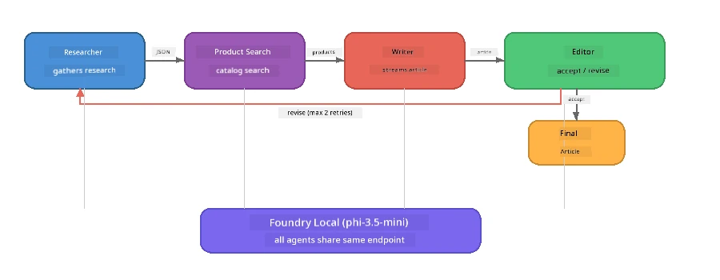

# Part 7: Zava Creative Writer - Capstone Application

> **Goal:** Make una check how production-style multi-agent app where four specialised agents dey work together to produce magzin-quality articles for Zava Retail DIY - weh go run completly for your own device with Foundry Local.

Na dis one be the **capstone lab** for the workshop. E dey join together all di tins wey you don learn - SDK integration (Part 3), retrieval from local data (Part 4), agent personas (Part 5), and multi-agent orchestration (Part 6) - into one beta application wey dey available for **Python**, **JavaScript**, and **C#**.

---

## Wetin You Go Explore

| Concept | Where in the Zava Writer |
|---------|----------------------------|
| 4-step model loading | Shared config module wey dey start Foundry Local |
| RAG-style retrieval | Product agent dey search local catalog |
| Agent Specialisation | 4 agents get different system prompts |
| Streaming output | Writer dey yield tokens as e dey happen |
| Structured hand-offs | Researcher → JSON, Editor → JSON decision |
| Feedback loops | Editor fit trigger re-execution (max 2 retries) |

---

## Architecture

The Zava Creative Writer dey use **sequential pipeline wey get evaluator-driven feedback**. All the three language implementations follow the same architecture:



### The Four Agents

| Agent | Input | Output | Purpose |
|-------|-------|--------|---------|
| **Researcher** | Topic + optional feedback | `{"web": [{url, name, description}, ...]}` | Na im dey gather background research through LLM |
| **Product Search** | Product context string | List of matching products | LLM generate queries + keyword search for inside local catalog |
| **Writer** | Research + products + assignment + feedback | Streamed article text (split at `---`) | E dey draft magazine-quality article for real time |
| **Editor** | Article + writer's self-feedback | `{"decision": "accept/revise", "editorFeedback": "...", "researchFeedback": "..."}` | E dey review quality, e fit make e retry if e need |

### Pipeline Flow

1. **Researcher** go receive topic then e go produce structured research notes (JSON)
2. **Product Search** go query local product catalog with LLM-generated search terms
3. **Writer** go combine research + products + assignment to stream article, e go add self-feedback after `---` separator
4. **Editor** go review article then e go return JSON verdict:
   - `"accept"` → pipeline don finish
   - `"revise"` → feedback go return back to Researcher and Writer (max 2 retries)

---

## Prerequisites

- Complete [Part 6: Multi-Agent Workflows](part6-multi-agent-workflows.md)
- Foundry Local CLI don install and `phi-3.5-mini` model don download

---

## Exercises

### Exercise 1 - Run the Zava Creative Writer

Pick your language then run the app:

<details>
<summary><strong>🐍 Python - FastAPI Web Service</strong></summary>

Python version dey run as **web service** with REST API, e dey show how to build backend wey fit run for production.

**Setup:**
```bash
cd zava-creative-writer-local/src/api
python -m venv venv

# Windows (PowerShell):
venv\Scripts\Activate.ps1
# macOS:
source venv/bin/activate

pip install -r requirements.txt
```

**Run:**
```bash
uvicorn main:app --reload
```

**Test am:**
```bash
curl -X POST http://localhost:8000/api/article \
  -H "Content-Type: application/json" \
  -d '{
    "research": "DIY home improvement trends",
    "products": "power tools and paints",
    "assignment": "Write an article about weekend renovation projects for DIY enthusiasts"
  }'
```

Response go dey stream back as newline-delimited JSON messages wey show each agent progress.

</details>

<details>
<summary><strong>📦 JavaScript - Node.js CLI</strong></summary>

JavaScript version run as **CLI app**, e dey print agent progress and article directly for console.

**Setup:**
```bash
cd zava-creative-writer-local/src/javascript
npm install
```

**Run:**
```bash
node main.mjs
```

You go see:
1. Foundry Local model loading (with progress bar if e dey download)
2. Each agent dey run one after another with status messages
3. Article dey stream for console in real time
4. Editor accept/revise decision

</details>

<details>
<summary><strong>💜 C# - .NET Console App</strong></summary>

C# version dey run as **.NET console application** with same pipeline and streaming output.

**Setup:**
```bash
cd zava-creative-writer-local/src/csharp
dotnet restore
```

**Run:**
```bash
dotnet run
```

Output pattern go remain like JavaScript one - agent status messages, streamed article, plus editor verdict.

</details>

---

### Exercise 2 - Study the Code Structure

Every language code get the same logical parts. Compare the structures:

**Python** (`src/api/`):
| File | Purpose |
|------|---------|
| `foundry_config.py` | Shared Foundry Local manager, model, and client (4-step init) |
| `orchestrator.py` | Pipeline coordination plus feedback loop |
| `main.py` | FastAPI endpoints (`POST /api/article`) |
| `agents/researcher/researcher.py` | LLM-based research with JSON output |
| `agents/product/product.py` | LLM-generated queries + keyword search |
| `agents/writer/writer.py` | Streaming article generation |
| `agents/editor/editor.py` | JSON-based accept/revise decision |

**JavaScript** (`src/javascript/`):
| File | Purpose |
|------|---------|
| `foundryConfig.mjs` | Shared Foundry Local config (4-step init with progress bar) |
| `main.mjs` | Orchestrator + CLI entry point |
| `researcher.mjs` | LLM-based research agent |
| `product.mjs` | LLM query generation + keyword search |
| `writer.mjs` | Streaming article generation (async generator) |
| `editor.mjs` | JSON accept/revise decision |
| `products.mjs` | Product catalog data |

**C#** (`src/csharp/`):
| File | Purpose |
|------|---------|
| `Program.cs` | Full pipeline: model loading, agents, orchestrator, feedback loop |
| `ZavaCreativeWriter.csproj` | .NET 9 project with Foundry Local + OpenAI packages |

> **Design note:** Python dey put each agent for im own file/folder (good for big teams). JavaScript dey use one module per agent (good for medium project). C# dey keep everything for one file with local functions (good for self-contained examples). For production, choose pattern wey fit your team style.

---

### Exercise 3 - Trace the Shared Configuration

Every agent for pipeline dey share one Foundry Local model client. Check how e dey setup for each language:

<details>
<summary><strong>🐍 Python - foundry_config.py</strong></summary>

```python
from foundry_local import FoundryLocalManager

MODEL_ALIAS = "phi-3.5-mini"

# Step 1: Make manager and start di Foundry Local service
manager = FoundryLocalManager()
manager.start_service()

# Step 2: Check if di model don already download
cached = manager.list_cached_models()
catalog_info = manager.get_model_info(MODEL_ALIAS)
is_cached = any(m.id == catalog_info.id for m in cached) if catalog_info else False

if not is_cached:
    manager.download_model(MODEL_ALIAS)

# Step 3: Load di model inside memory
manager.load_model(MODEL_ALIAS)
model_id = manager.get_model_info(MODEL_ALIAS).id

# Shared OpenAI client
client = openai.OpenAI(base_url=manager.endpoint, api_key=manager.api_key)
```

All agents dey import `from foundry_config import client, model_id`.

</details>

<details>
<summary><strong>📦 JavaScript - foundryConfig.mjs</strong></summary>

```javascript
import { FoundryLocalManager } from "foundry-local-sdk";
import { OpenAI } from "openai";

FoundryLocalManager.create({ appName: "ZavaCreativeWriter" });
const manager = FoundryLocalManager.instance;
await manager.startWebService();

// Check cache → download → load (new SDK pattern)
const catalog = manager.catalog;
const model = await catalog.getModel(MODEL_ALIAS);
if (!model.isCached) {
  console.log(`Downloading model: ${MODEL_ALIAS}...`);
  await model.download();
}
await model.load();

const client = new OpenAI({ baseURL: manager.urls[0] + "/v1", apiKey: "foundry-local" });
const modelId = model.id;
export { client, modelId };
```

All agents dey import `{ client, modelId } from "./foundryConfig.mjs"`.

</details>

<details>
<summary><strong>💜 C# - top of Program.cs</strong></summary>

```csharp
await FoundryLocalManager.CreateAsync(
    new Configuration
    {
        AppName = "ZavaCreativeWriter",
        Web = new Configuration.WebService { Urls = "http://127.0.0.1:0" }
    }, NullLogger.Instance, default);
var manager = FoundryLocalManager.Instance;
await manager.StartWebServiceAsync(default);

var catalog = await manager.GetCatalogAsync(default);
var catalogModel = await catalog.GetModelAsync(alias, default);
var isCached = await catalogModel.IsCachedAsync(default);
if (!isCached)
    await catalogModel.DownloadAsync(null, default);

await catalogModel.LoadAsync(default);
var key = new ApiKeyCredential("foundry-local");
var chatClient = new OpenAIClient(key, new OpenAIClientOptions
{
    Endpoint = new Uri(manager.Urls[0] + "/v1")
}).GetChatClient(catalogModel.Id);
```

The `chatClient` dey pass to all agent functions inside the same file.

</details>

> **Key pattern:** Model loading pattern (start service → check cache → download → load) dey ensure user fit see clear progress plus model no go download again. Na best way for any Foundry Local app.

---

### Exercise 4 - Understand the Feedback Loop

Feedback loop na wetin make dis pipeline “smart” - Editor fit send work back make e revise. Check the logic:

```
Orchestrator:
  1. researcher.research(topic, "No Feedback")    ← first pass
  2. product.findProducts(productContext)
  3. writer.write(research, products, assignment)  ← streams article
  4. Split article at "---" → article + writerFeedback
  5. editor.edit(article, writerFeedback)

  WHILE editor says "revise" AND retryCount < 2:
    6. researcher.research(topic, editor.researchFeedback)  ← refined
    7. writer.write(research, products, editor.editorFeedback)
    8. editor.edit(newArticle, newWriterFeedback)
    9. retryCount++
```

**Questions to consider:**
- Why retry limit set to 2? Wetin go happen if e increase?
- Why researcher get `researchFeedback` but writer get `editorFeedback`?
- Wetin go happen if editor always talk "revise"?

---

### Exercise 5 - Modify an Agent

Try change one agent behaviour then watch how e go affect pipeline:

| Modification | Wetin to change |
|-------------|----------------|
| **Stricter editor** | Change editor system prompt make e always ask at least one revision |
| **Longer articles** | Change writer prompt from "800-1000 words" to "1500-2000 words" |
| **Different products** | Add or change products for product catalog |
| **New research topic** | Change the default `researchContext` to different subject |
| **JSON-only researcher** | Make researcher return 10 items instead of 3-5 |

> **Tip:** Because all three languages get the same architecture, you fit do same change for the language wey you sabi pass.

---

### Exercise 6 - Add a Fifth Agent

Extend pipeline with new agent. Some ideas:

| Agent | Where for pipeline | Purpose |
|-------|-------------------|---------|
| **Fact-Checker** | After Writer, before Editor | Check claims with research data |
| **SEO Optimiser** | After Editor accept | Add meta description, keywords, slug |
| **Illustrator** | After Editor accept | Generate image prompts for article |
| **Translator** | After Editor accept | Translate article to another language |

**Steps:**
1. Write agent system prompt
2. Create agent function (match pattern for your language)
3. Insert am for orchestrator for the correct place
4. Update output/logging to show new agent work

---

## How Foundry Local and the Agent Framework Work Together

This app dey show correct way to build multi-agent systems with Foundry Local:

| Layer | Component | Role |
|-------|-----------|------|
| **Runtime** | Foundry Local | E dey download, manage, and serve the model locally |
| **Client** | OpenAI SDK | E dey send chat completions go the local endpoint |
| **Agent** | System prompt + chat call | specialised behaviour with focused instructions |
| **Orchestrator** | Pipeline coordinator | E dey manage data flow, sequencing, and feedback loops |
| **Framework** | Microsoft Agent Framework | E dey provide `ChatAgent` abstraction and patterns |

Key insight: **Foundry Local na im replace cloud backend, no be the app architecture.** Same agent patterns, orchestration way, and structured hand-offs wey work with cloud-hosted models go work exactly same for local models — na only the client URL dey point local endpoint instead Azure endpoint.

---

## Key Takeaways

| Concept | Wetin You Learn |
|---------|-----------------|
| Production architecture | How to structure multi-agent app with shared config and separate agents |
| 4-step model loading | Best practice to initialise Foundry Local with user-visible progress |
| Agent Specialisation | Each of the 4 agents get focused instructions and specific output format |
| Streaming generation | Writer dey yield tokens for real time, make UI dey responsive |
| Feedback loops | Editor-driven retry dey improve output quality without human wahala |
| Cross-language patterns | Same architecture dey work for Python, JavaScript, and C# |
| Local = production-ready | Foundry Local dey serve the very same OpenAI API wey dem dey use for cloud |

---

## Next Step

Continue to [Part 8: Evaluation-Led Development](part8-evaluation-led-development.md) make you fit build beta evaluation framework for your agents, using golden datasets, rule-based checks, and LLM-as-judge scoring.