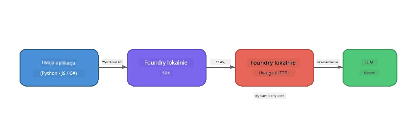

# Część 1: Pierwsze kroki z Foundry Local


## Czym jest Foundry Local?

[Foundry Local](https://foundrylocal.ai) pozwala uruchamiać otwarte modele językowe AI **bezpośrednio na twoim komputerze** – nie jest potrzebny internet, brak kosztów chmury i pełna prywatność danych. Oferuje:

- **Pobieranie i uruchamianie modeli lokalnie** z automatyczną optymalizacją pod sprzęt (GPU, CPU lub NPU)
- **Zapewnianie OpenAI-kompatybilnego API**, aby korzystać ze znanych SDK i narzędzi
- **Nie wymaga subskrypcji Azure** ani rejestracji – wystarczy zainstalować i zacząć tworzyć

Pomyśl o tym jak o własnym, prywatnym AI, które działa całkowicie na twoim urządzeniu.

## Cele nauki

Pod koniec tego laboratorium będziesz potrafił:

- Zainstalować Foundry Local CLI na swoim systemie operacyjnym
- Zrozumieć, czym są aliasy modeli i jak działają
- Pobrać i uruchomić swój pierwszy lokalny model AI
- Wysłać wiadomość do lokalnego modelu z poziomu linii poleceń
- Zrozumieć różnicę między lokalnymi a chmurowymi modelami AI

---

## Wymagania wstępne

### Wymagania systemowe

| Wymaganie | Minimum | Zalecane |
|-------------|---------|-------------|
| **RAM** | 8 GB | 16 GB |
| **Miejsce na dysku** | 5 GB (dla modeli) | 10 GB |
| **CPU** | 4 rdzenie | 8+ rdzeni |
| **GPU** | Opcjonalne | NVIDIA z CUDA 11.8+ |
| **System operacyjny** | Windows 10/11 (x64/ARM), Windows Server 2025, macOS 13+ | - |

> **Uwaga:** Foundry Local automatycznie wybiera najlepszy wariant modelu dla twojego sprzętu. Jeśli masz GPU NVIDIA, używa przyspieszenia CUDA. Jeśli masz Qualcomm NPU, używa go. W przeciwnym razie korzysta z zoptymalizowanego wariantu CPU.

### Instalacja Foundry Local CLI

**Windows** (PowerShell):  
```powershell
winget install Microsoft.FoundryLocal
```
  
**macOS** (Homebrew):  
```bash
brew tap microsoft/foundrylocal
brew install foundrylocal
```
  
> **Uwaga:** Foundry Local obecnie obsługuje tylko Windows i macOS. Linux nie jest obecnie wspierany.

Sprawdź instalację:  
```bash
foundry --version
```
  
---

## Ćwiczenia laboratoryjne

### Ćwiczenie 1: Poznaj dostępne modele

Foundry Local zawiera katalog wstępnie zoptymalizowanych modeli open-source. Wyświetl ich listę:

```bash
foundry model list
```
  
Zobaczysz modele takie jak:  
- `phi-3.5-mini` – model Microsoft o 3.8 mld parametrów (szybki, dobra jakość)  
- `phi-4-mini` – nowszy, bardziej zdolny model Phi  
- `phi-4-mini-reasoning` – model Phi z rozumowaniem łańcuchowym (`<think>` tagi)  
- `phi-4` – największy model Phi Microsoftu (10.4 GB)  
- `qwen2.5-0.5b` – bardzo mały i szybki (dobry dla urządzeń o niskich zasobach)  
- `qwen2.5-7b` – silny model ogólnego przeznaczenia z obsługą wywołań narzędzi  
- `qwen2.5-coder-7b` – zoptymalizowany do generowania kodu  
- `deepseek-r1-7b` – mocny model rozumowania  
- `gpt-oss-20b` – duży model open-source (licencja MIT, 12.5 GB)  
- `whisper-base` – transkrypcja mowy na tekst (383 MB)  
- `whisper-large-v3-turbo` – transkrypcja o wysokiej dokładności (9 GB)  

> **Co to jest alias modelu?** Aliasy takie jak `phi-3.5-mini` to skróty. Korzystając z aliasu, Foundry Local automatycznie pobiera najlepszy wariant dopasowany do twojego sprzętu (CUDA dla GPU NVIDIA, w przeciwnym razie zoptymalizowany CPU). Nigdy nie musisz martwić się wyborem odpowiedniego wariantu.

### Ćwiczenie 2: Uruchom swój pierwszy model

Pobierz i zacznij rozmawiać z modelem interaktywnie:

```bash
foundry model run phi-3.5-mini
```
  
Za pierwszym razem Foundry Local:  
1. Wykryje twój sprzęt  
2. Pobierze optymalny wariant modelu (to może potrwać kilka minut)  
3. Załaduje model do pamięci  
4. Uruchomi interaktywną sesję czatu  

Spróbuj zadać kilka pytań:  
```
You: What is the golden ratio?
You: Can you explain it as if I were 10 years old?
You: Write a haiku about mathematics
```
  
Wpisz `exit` lub naciśnij `Ctrl+C`, aby zakończyć.

### Ćwiczenie 3: Wcześniejsze pobranie modelu

Jeśli chcesz pobrać model bez rozpoczęcia czatu:

```bash
foundry model download phi-3.5-mini
```
  
Sprawdź, które modele są już pobrane na twoim komputerze:

```bash
foundry cache list
```
  
### Ćwiczenie 4: Zrozumienie architektury

Foundry Local działa jako **lokalna usługa HTTP**, która udostępnia OpenAI-kompatybilne REST API. Oznacza to:

1. Usługa startuje na **dynamicznym porcie** (innym przy każdym uruchomieniu)  
2. Używasz SDK, aby odkryć właściwy adres URL punktu końcowego  
3. Możesz używać **dowolnej** biblioteki klienckiej kompatybilnej z OpenAI, aby się z nią łączyć  



> **Ważne:** Foundry Local przydziela **dynamiczny port** za każdym razem, gdy się uruchamia. Nigdy nie twardo koduj numeru portu jak `localhost:5272`. Zawsze korzystaj z SDK do poznania aktualnego adresu URL (np. `manager.endpoint` w Pythonie lub `manager.urls[0]` w JavaScript).

---

## Kluczowe wnioski

| Pojęcie | Czego się nauczyłeś |
|---------|---------------------|
| AI na urządzeniu | Foundry Local uruchamia modele całkowicie na twoim urządzeniu bez chmury, kluczy API i kosztów |
| Aliasy modeli | Aliasy jak `phi-3.5-mini` automatycznie wybierają najlepszy wariant dla twojego sprzętu |
| Dynamiczne porty | Usługa działa na dynamicznym porcie; zawsze używaj SDK do odkrycia punktu końcowego |
| CLI i SDK | Możesz komunikować się z modelami przez CLI (`foundry model run`) lub programowo przez SDK |

---

## Następne kroki

Kontynuuj do [Część 2: Szczegółowa analiza Foundry Local SDK](part2-foundry-local-sdk.md), aby poznać API SDK do zarządzania modelami, usługami i pamięcią podręczną programowo.