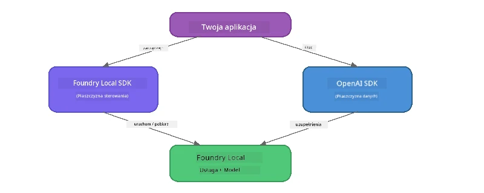

# Część 3: Używanie Foundry Local SDK z OpenAI

## Przegląd

W części 1 korzystałeś z Foundry Local CLI do interaktywnego uruchamiania modeli. W części 2 poznałeś pełny zakres API SDK. Teraz nauczysz się, jak **zintegrować Foundry Local z Twoimi aplikacjami** za pomocą SDK i API zgodnego z OpenAI.

Foundry Local udostępnia SDK dla trzech języków. Wybierz ten, który znasz najlepiej – koncepcje są identyczne we wszystkich trzech.

## Cele nauki

Po zakończeniu tego laboratorium będziesz potrafił:

- Zainstalować Foundry Local SDK dla Twojego języka (Python, JavaScript lub C#)
- Zainicjować `FoundryLocalManager`, aby uruchomić usługę, sprawdzić cache, pobrać i załadować model
- Połączyć się z lokalnym modelem za pomocą SDK OpenAI
- Wysyłać uzupełnienia czatu i obsługiwać odpowiedzi strumieniowe
- Zrozumieć architekturę dynamicznych portów

---

## Wymagania wstępne

Najpierw ukończ [Część 1: Rozpoczęcie pracy z Foundry Local](part1-getting-started.md) oraz [Część 2: Szczegółowy przegląd Foundry Local SDK](part2-foundry-local-sdk.md).

Zainstaluj **jeden** z następujących środowisk uruchomieniowych:
- **Python 3.9+** - [python.org/downloads](https://www.python.org/downloads/)
- **Node.js 18+** - [nodejs.org](https://nodejs.org/)
- **.NET 9.0+** - [dot.net/download](https://dotnet.microsoft.com/download)

---

## Koncepcja: Jak działa SDK

Foundry Local SDK zarządza **płaszczyzną sterowania** (uruchamianiem usługi, pobieraniem modeli), podczas gdy SDK OpenAI zajmuje się **płaszczyzną danych** (wysyłaniem promptów, odbieraniem uzupełnień).



---

## Ćwiczenia laboratoryjne

### Ćwiczenie 1: Konfiguracja środowiska

<details>
<summary><b>🐍 Python</b></summary>

```bash
cd python
python -m venv venv

# Aktywuj środowisko wirtualne:
# Windows (PowerShell):
venv\Scripts\Activate.ps1
# Windows (Wiersz polecenia):
venv\Scripts\activate.bat
# macOS:
source venv/bin/activate

pip install -r requirements.txt
```

Plik `requirements.txt` instaluje:
- `foundry-local-sdk` - Foundry Local SDK (importowany jako `foundry_local`)
- `openai` - SDK OpenAI dla Pythona
- `agent-framework` - Microsoft Agent Framework (używany w kolejnych częściach)

</details>

<details>
<summary><b>📘 JavaScript</b></summary>

```bash
cd javascript
npm install
```

Plik `package.json` instaluje:
- `foundry-local-sdk` - Foundry Local SDK
- `openai` - SDK OpenAI dla Node.js

</details>

<details>
<summary><b>💜 C#</b></summary>

```bash
cd csharp
dotnet restore
dotnet build
```

Plik `csharp.csproj` wykorzystuje:
- `Microsoft.AI.Foundry.Local` - Foundry Local SDK (NuGet)
- `OpenAI` - SDK OpenAI dla C# (NuGet)

> **Struktura projektu:** Projekt C# używa routera w linii poleceń w `Program.cs`, który kieruje do osobnych plików przykładów. Uruchom `dotnet run chat` (lub po prostu `dotnet run`) dla tej części. Inne części używają `dotnet run rag`, `dotnet run agent` i `dotnet run multi`.

</details>

---

### Ćwiczenie 2: Podstawowe uzupełnienie czatu

Otwórz podstawowy przykład czatu dla swojego języka i przeanalizuj kod. Każdy skrypt stosuje ten sam trzystopniowy wzorzec:

1. **Uruchom usługę** - `FoundryLocalManager` uruchamia środowisko Foundry Local
2. **Pobierz i załaduj model** - sprawdź cache, pobierz w razie potrzeby i załaduj do pamięci
3. **Utwórz klienta OpenAI** - połącz się z lokalnym punktem końcowym i wyślij strumieniowe uzupełnienie czatu

<details>
<summary><b>🐍 Python - <code>python/foundry-local.py</code></b></summary>

```python
import sys
import openai
from foundry_local import FoundryLocalManager

alias = "phi-3.5-mini"

# Krok 1: Utwórz FoundryLocalManager i uruchom usługę
print("Starting Foundry Local service...")
manager = FoundryLocalManager()
manager.start_service()

# Krok 2: Sprawdź, czy model jest już pobrany
cached = manager.list_cached_models()
catalog_info = manager.get_model_info(alias)
is_cached = any(m.id == catalog_info.id for m in cached) if catalog_info else False

if is_cached:
    print(f"Model already downloaded: {alias}")
else:
    print(f"Downloading model: {alias} (this may take several minutes)...")
    manager.download_model(alias)
    print(f"Download complete: {alias}")

# Krok 3: Załaduj model do pamięci
print(f"Loading model: {alias}...")
manager.load_model(alias)

# Utwórz klienta OpenAI wskazującego na lokalną usługę Foundry
client = openai.OpenAI(
    base_url=manager.endpoint,   # Dynamiczny port - nigdy nie używaj wartości na sztywno!
    api_key=manager.api_key
)

# Wygeneruj odpowiedź czatu w trybie strumieniowym
stream = client.chat.completions.create(
    model=manager.get_model_info(alias).id,
    messages=[{"role": "user", "content": "What is the golden ratio?"}],
    stream=True,
)

for chunk in stream:
    if chunk.choices[0].delta.content is not None:
        print(chunk.choices[0].delta.content, end="", flush=True)
print()
```

**Uruchom:**
```bash
python foundry-local.py
```

</details>

<details>
<summary><b>📘 JavaScript - <code>javascript/foundry-local.mjs</code></b></summary>

```javascript
import { OpenAI } from "openai";
import { FoundryLocalManager } from "foundry-local-sdk";

const alias = "phi-3.5-mini";

// Krok 1: Uruchom usługę Foundry Local
console.log("Starting Foundry Local service...");
FoundryLocalManager.create({ appName: "FoundryLocalWorkshop" });
const manager = FoundryLocalManager.instance;
await manager.startWebService();

// Krok 2: Sprawdź, czy model jest już pobrany
const catalog = manager.catalog;
const model = await catalog.getModel(alias);

if (model.isCached) {
  console.log(`Model already downloaded: ${alias}`);
} else {
  console.log(`Downloading model: ${alias} (this may take several minutes)...`);
  await model.download();
  console.log(`Download complete: ${alias}`);
}

// Krok 3: Załaduj model do pamięci
console.log(`Loading model: ${alias}...`);
await model.load();
console.log(`Model loaded: ${model.id}`);

// Utwórz klienta OpenAI wskazującego na lokalną usługę Foundry
const client = new OpenAI({
  baseURL: manager.urls[0] + "/v1",   // Dynamiczny port - nigdy nie koduj na stałe!
  apiKey: "foundry-local",
});

// Wygeneruj strumieniowe uzupełnienie czatu
const stream = await client.chat.completions.create({
  model: model.id,
  messages: [{ role: "user", content: "What is the golden ratio?" }],
  stream: true,
});

for await (const chunk of stream) {
  if (chunk.choices[0]?.delta?.content) {
    process.stdout.write(chunk.choices[0].delta.content);
  }
}
console.log();
```

**Uruchom:**
```bash
node foundry-local.mjs
```

</details>

<details>
<summary><b>💜 C# - <code>csharp/BasicChat.cs</code></b></summary>

```csharp
using Microsoft.AI.Foundry.Local;
using Microsoft.Extensions.Logging.Abstractions;
using OpenAI;
using OpenAI.Chat;
using System.ClientModel;

var alias = "phi-3.5-mini";

// Step 1: Start the Foundry Local service
Console.WriteLine("Starting Foundry Local service...");
await FoundryLocalManager.CreateAsync(
    new Configuration
    {
        AppName = "FoundryLocalSamples",
        Web = new Configuration.WebService { Urls = "http://127.0.0.1:0" }
    }, NullLogger.Instance, default);
var manager = FoundryLocalManager.Instance;
await manager.StartWebServiceAsync(default);

// Step 2: Get the model from the catalog
var catalog = await manager.GetCatalogAsync(default);
var model = await catalog.GetModelAsync(alias, default);

// Step 3: Check if the model is already downloaded
var isCached = await model.IsCachedAsync(default);

if (isCached)
{
    Console.WriteLine($"Model already downloaded: {alias}");
}
else
{
    Console.WriteLine($"Downloading model: {alias} (this may take several minutes)...");
    await model.DownloadAsync(null, default);
    Console.WriteLine($"Download complete: {alias}");
}

// Step 4: Load the model into memory
Console.WriteLine($"Loading model: {alias}...");
await model.LoadAsync(default);
Console.WriteLine($"Loaded model: {model.Id}");
Console.WriteLine($"Endpoint: {manager.Urls[0]}");

// Create OpenAI client pointing to the LOCAL Foundry service
var key = new ApiKeyCredential("foundry-local");
var client = new OpenAIClient(key, new OpenAIClientOptions
{
    Endpoint = new Uri(manager.Urls[0] + "/v1")  // Dynamic port - never hardcode!
});

var chatClient = client.GetChatClient(model.Id);

// Stream a chat completion
var completionUpdates = chatClient.CompleteChatStreaming("What is the golden ratio?");

foreach (var update in completionUpdates)
{
    if (update.ContentUpdate.Count > 0)
    {
        Console.Write(update.ContentUpdate[0].Text);
    }
}
Console.WriteLine();
```

**Uruchom:**
```bash
dotnet run chat
```

</details>

---

### Ćwiczenie 3: Eksperymentuj z promptami

Gdy Twój podstawowy przykład działa, spróbuj zmodyfikować kod:

1. **Zmień wiadomość użytkownika** - wypróbuj różne pytania
2. **Dodaj prompt systemowy** - nadaj modelowi osobowość
3. **Wyłącz streaming** - ustaw `stream=False` i wypisz pełną odpowiedź naraz
4. **Spróbuj inny model** - zamień alias `phi-3.5-mini` na inny z `foundry model list`

<details>
<summary><b>🐍 Python</b></summary>

```python
# Dodaj systemowy prompt - nadaj modelowi osobowość:
stream = client.chat.completions.create(
    model=manager.get_model_info(alias).id,
    messages=[
        {"role": "system", "content": "You are a pirate. Answer everything in pirate speak."},
        {"role": "user", "content": "What is the golden ratio?"}
    ],
    stream=True,
)

# Lub wyłącz strumieniowanie:
response = client.chat.completions.create(
    model=manager.get_model_info(alias).id,
    messages=[{"role": "user", "content": "What is the golden ratio?"}],
    stream=False,
)
print(response.choices[0].message.content)
```

</details>

<details>
<summary><b>📘 JavaScript</b></summary>

```javascript
// Dodaj podpowiedź systemową - nadaj modelowi osobowość:
const stream = await client.chat.completions.create({
  model: modelInfo.id,
  messages: [
    { role: "system", content: "You are a pirate. Answer everything in pirate speak." },
    { role: "user", content: "What is the golden ratio?" },
  ],
  stream: true,
});

// Lub wyłącz strumieniowanie:
const response = await client.chat.completions.create({
  model: modelInfo.id,
  messages: [{ role: "user", content: "What is the golden ratio?" }],
  stream: false,
});
console.log(response.choices[0].message.content);
```

</details>

<details>
<summary><b>💜 C#</b></summary>

```csharp
// Add a system prompt - give the model a persona:
var completionUpdates = chatClient.CompleteChatStreaming(
    new ChatMessage[]
    {
        new SystemChatMessage("You are a pirate. Answer everything in pirate speak."),
        new UserChatMessage("What is the golden ratio?")
    }
);

// Or turn off streaming:
var response = chatClient.CompleteChat("What is the golden ratio?");
Console.WriteLine(response.Value.Content[0].Text);
```

</details>

---

### Dokumentacja metod SDK

<details>
<summary><b>🐍 Metody Python SDK</b></summary>

| Metoda | Cel |
|--------|-----|
| `FoundryLocalManager()` | Utwórz instancję managera |
| `manager.start_service()` | Uruchom usługę Foundry Local |
| `manager.list_cached_models()` | Wyświetl listę modeli pobranych na urządzenie |
| `manager.get_model_info(alias)` | Pobierz ID modelu i metadane |
| `manager.download_model(alias, progress_callback=fn)` | Pobierz model z opcjonalnym callbackiem postępu |
| `manager.load_model(alias)` | Załaduj model do pamięci |
| `manager.endpoint` | Pobierz dynamiczny adres endpointu |
| `manager.api_key` | Pobierz klucz API (placeholder dla lokalnego) |

</details>

<details>
<summary><b>📘 Metody JavaScript SDK</b></summary>

| Metoda | Cel |
|--------|-----|
| `FoundryLocalManager.create({ appName })` | Utwórz instancję managera |
| `FoundryLocalManager.instance` | Dostęp do singletona managera |
| `await manager.startWebService()` | Uruchom usługę Foundry Local |
| `await manager.catalog.getModel(alias)` | Pobierz model z katalogu |
| `model.isCached` | Sprawdź, czy model jest już pobrany |
| `await model.download()` | Pobierz model |
| `await model.load()` | Załaduj model do pamięci |
| `model.id` | Pobierz ID modelu do wywołań API OpenAI |
| `manager.urls[0] + "/v1"` | Pobierz dynamiczny adres endpointu |
| `"foundry-local"` | Klucz API (placeholder dla lokalnego) |

</details>

<details>
<summary><b>💜 Metody C# SDK</b></summary>

| Metoda | Cel |
|--------|-----|
| `FoundryLocalManager.CreateAsync(config)` | Utwórz i zainicjuj managera |
| `manager.StartWebServiceAsync()` | Uruchom usługę sieciową Foundry Local |
| `manager.GetCatalogAsync()` | Pobierz katalog modeli |
| `catalog.ListModelsAsync()` | Wypisz wszystkie dostępne modele |
| `catalog.GetModelAsync(alias)` | Pobierz konkretny model po aliasie |
| `model.IsCachedAsync()` | Sprawdź, czy model jest pobrany |
| `model.DownloadAsync()` | Pobierz model |
| `model.LoadAsync()` | Załaduj model do pamięci |
| `manager.Urls[0]` | Pobierz dynamiczny adres endpointu |
| `new ApiKeyCredential("foundry-local")` | Referencja klucza API dla lokalnego |

</details>

---

### Ćwiczenie 4: Korzystanie z natywnego ChatClienta (alternatywa dla SDK OpenAI)

W ćwiczeniach 2 i 3 korzystałeś z SDK OpenAI do uzupełnień czatu. SDK JavaScript i C# oferują również **natywny ChatClient**, który eliminuje potrzebę korzystania z SDK OpenAI.

<details>
<summary><b>📘 JavaScript - <code>model.createChatClient()</code></b></summary>

```javascript
import { FoundryLocalManager } from "foundry-local-sdk";

const alias = "phi-3.5-mini";

FoundryLocalManager.create({ appName: "ChatClientDemo" });
const manager = FoundryLocalManager.instance;
await manager.startWebService();

const model = await manager.catalog.getModel(alias);
if (!model.isCached) await model.download();
await model.load();

// Nie jest potrzebny import OpenAI — pobierz klienta bezpośrednio z modelu
const chatClient = model.createChatClient();

// Uzupełnienie bez strumieniowania
const response = await chatClient.completeChat([
  { role: "system", content: "You are a pirate. Answer everything in pirate speak." },
  { role: "user", content: "What is the golden ratio?" }
]);
console.log(response.choices[0].message.content);

// Uzupełnienie ze strumieniowaniem (używa wzorca wywołania zwrotnego)
await chatClient.completeStreamingChat(
  [{ role: "user", content: "What is the golden ratio?" }],
  (chunk) => {
    if (chunk.choices?.[0]?.delta?.content) {
      process.stdout.write(chunk.choices[0].delta.content);
    }
  }
);
console.log();
```

> **Uwaga:** Metoda `completeStreamingChat()` ChatClienta używa wzorca **callback**, a nie iteratora async. Przekaż funkcję jako drugi argument.

</details>

<details>
<summary><b>💜 C# - <code>model.GetChatClientAsync()</code></b></summary>

```csharp
var catalog = await manager.GetCatalogAsync(default);
var model = await catalog.GetModelAsync("phi-3.5-mini", default);
if (!await model.IsCachedAsync(default))
    await model.DownloadAsync(null, default);
await model.LoadAsync(default);

// No OpenAI NuGet needed — get a client directly from the model
var chatClient = await model.GetChatClientAsync(default);

// Use it like a standard OpenAI ChatClient
var response = chatClient.CompleteChat("What is the golden ratio?");
Console.WriteLine(response.Value.Content[0].Text);
```

</details>

> **Kiedy czego użyć:**
> | Podejście | Najlepsze do |
> |----------|-------------|
> | SDK OpenAI | Pełna kontrola parametrów, aplikacje produkcyjne, istniejący kod OpenAI |
> | Natynwy ChatClient | Szybkie prototypowanie, mniej zależności, prostsza konfiguracja |

---

## Najważniejsze informacje

| Koncepcja | Czego się nauczyłeś |
|-----------|---------------------|
| Płaszczyzna sterowania | Foundry Local SDK zarządza uruchamianiem usługi i ładowaniem modeli |
| Płaszczyzna danych | SDK OpenAI obsługuje uzupełnienia czatu i streaming |
| Dynamiczne porty | Zawsze używaj SDK do wykrywania endpointu; nie używaj na stałe wpisanych URL |
| Wielojęzykowość | Ten sam wzorzec kodu działa w Python, JavaScript i C# |
| Zgodność z OpenAI | Pełna zgodność z API OpenAI zapewnia minimalne zmiany w istniejącym kodzie |
| Natynwy ChatClient | `createChatClient()` (JS) / `GetChatClientAsync()` (C#) to alternatywa dla SDK OpenAI |

---

## Kolejne kroki

Kontynuuj do [Część 4: Budowanie aplikacji RAG](part4-rag-fundamentals.md), aby nauczyć się tworzyć pipeline Retrieval-Augmented Generation działający całkowicie na Twoim urządzeniu.