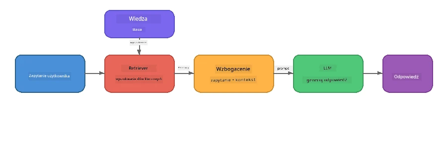

# Część 4: Tworzenie aplikacji RAG z Foundry Local

## Przegląd

Duże modele językowe są potężne, ale znają tylko to, co było w ich danych treningowych. **Retrieval-Augmented Generation (RAG)** rozwiązuje to, dostarczając modelowi odpowiedni kontekst w czasie zapytania – pobierany z twoich własnych dokumentów, baz danych lub baz wiedzy.

W tym laboratorium zbudujesz kompletną pipeline RAG, która działa **w całości na twoim urządzeniu** z użyciem Foundry Local. Bez usług w chmurze, bez baz danych wektorowych, bez API embeddingów – tylko lokalne wyszukiwanie i lokalny model.

## Cele nauki

Pod koniec tego laboratorium będziesz potrafił:

- Wyjaśnić, czym jest RAG i dlaczego ma znaczenie dla aplikacji AI
- Zbudować lokalną bazę wiedzy z dokumentów tekstowych
- Zaimplementować prostą funkcję wyszukiwania odpowiedniego kontekstu
- Skonstruować systemowy prompt, który osadza model na podstawie pobranych faktów
- Uruchomić pełny proces Retrieve → Augment → Generate na urządzeniu
- Zrozumieć kompromisy między prostym wyszukiwaniem słów kluczowych a wyszukiwaniem wektorowym

---

## Wymagania wstępne

- Ukończ [Część 3: Korzystanie z Foundry Local SDK i OpenAI](part3-sdk-and-apis.md)
- Zainstalowany Foundry Local CLI i pobrany model `phi-3.5-mini`

---

## Koncepcja: Czym jest RAG?

Bez RAG, LLM może odpowiadać tylko na podstawie danych treningowych – które mogą być nieaktualne, niepełne lub nie zawierać twoich prywatnych informacji:

```
User: "What is Zava's return policy?"
LLM:  "I do not have information about Zava's return policy."  ← No context!
```

Z RAG najpierw **pobierasz** odpowiednie dokumenty, a następnie **rozszerzasz** prompt o ten kontekst przed **wygenerowaniem** odpowiedzi:



Kluczowy wniosek: **model nie musi "znać" odpowiedzi; musi przeczytać właściwe dokumenty.**

---

## Ćwiczenia w laboratorium

### Ćwiczenie 1: Poznaj bazę wiedzy

Otwórz przykład RAG dla swojego języka i przejrzyj bazę wiedzy:

<details>
<summary><b>🐍 Python: <code>python/foundry-local-rag.py</code></b></summary>

Baza wiedzy to prosta lista słowników z polami `title` i `content`:

```python
KNOWLEDGE_BASE = [
    {
        "title": "Foundry Local Overview",
        "content": (
            "Foundry Local brings the power of Azure AI Foundry to your local "
            "device without requiring an Azure subscription..."
        ),
    },
    {
        "title": "Supported Hardware",
        "content": (
            "Foundry Local automatically selects the best model variant for "
            "your hardware. If you have an Nvidia CUDA GPU it downloads the "
            "CUDA-optimized model..."
        ),
    },
    # ... więcej wpisów
]
```

Każdy wpis reprezentuje „fragment” wiedzy – skoncentrowany kawałek informacji na jeden temat.

</details>

<details>
<summary><b>📘 JavaScript: <code>javascript/foundry-local-rag.mjs</code></b></summary>

Baza wiedzy używa tej samej struktury jako tablica obiektów:

```javascript
const KNOWLEDGE_BASE = [
  {
    title: "Foundry Local Overview",
    content:
      "Foundry Local brings the power of Azure AI Foundry to your local " +
      "device without requiring an Azure subscription...",
  },
  {
    title: "Supported Hardware",
    content:
      "Foundry Local automatically selects the best model variant for " +
      "your hardware...",
  },
  // ... więcej wpisów
];
```

</details>

<details>
<summary><b>💜 C#: <code>csharp/RagPipeline.cs</code></b></summary>

Baza wiedzy korzysta z listy nazwanych krotek:

```csharp
private static readonly List<(string Title, string Content)> KnowledgeBase =
[
    ("Foundry Local Overview",
     "Foundry Local brings the power of Azure AI Foundry to your local " +
     "device without requiring an Azure subscription..."),

    ("Supported Hardware",
     "Foundry Local automatically selects the best model variant for " +
     "your hardware..."),

    // ... more entries
];
```

</details>

> **W prawdziwej aplikacji** baza wiedzy pochodziłaby z plików na dysku, bazy danych, indeksu wyszukiwania lub API. W tym laboratorium używamy listy w pamięci, aby uprościć sprawę.

---

### Ćwiczenie 2: Poznaj funkcję wyszukiwania

Krok wyszukiwania znajduje najbardziej istotne fragmenty na podstawie zapytania użytkownika. Ten przykład używa **nawiązania do słów kluczowych** – licząc, ile słów z zapytania pojawia się w każdym fragmencie:

<details>
<summary><b>🐍 Python</b></summary>

```python
def retrieve(query: str, top_k: int = 2) -> list[dict]:
    """Return the top-k knowledge chunks most relevant to the query."""
    query_words = set(query.lower().split())
    scored = []
    for chunk in KNOWLEDGE_BASE:
        chunk_words = set(chunk["content"].lower().split())
        overlap = len(query_words & chunk_words)
        scored.append((overlap, chunk))
    scored.sort(key=lambda x: x[0], reverse=True)
    return [item[1] for item in scored[:top_k]]
```

</details>

<details>
<summary><b>📘 JavaScript</b></summary>

```javascript
function retrieve(query, topK = 2) {
  const queryWords = new Set(query.toLowerCase().split(/\s+/));
  const scored = KNOWLEDGE_BASE.map((chunk) => {
    const chunkWords = new Set(chunk.content.toLowerCase().split(/\s+/));
    let overlap = 0;
    for (const w of queryWords) {
      if (chunkWords.has(w)) overlap++;
    }
    return { overlap, chunk };
  });
  scored.sort((a, b) => b.overlap - a.overlap);
  return scored.slice(0, topK).map((s) => s.chunk);
}
```

</details>

<details>
<summary><b>💜 C#</b></summary>

```csharp
private static List<(string Title, string Content)> Retrieve(string query, int topK = 2)
{
    var queryWords = new HashSet<string>(
        query.ToLowerInvariant().Split(' ', StringSplitOptions.RemoveEmptyEntries));

    return KnowledgeBase
        .Select(chunk =>
        {
            var chunkWords = new HashSet<string>(
                chunk.Content.ToLowerInvariant().Split(' ', StringSplitOptions.RemoveEmptyEntries));
            var overlap = queryWords.Intersect(chunkWords).Count();
            return (Overlap: overlap, Chunk: chunk);
        })
        .OrderByDescending(x => x.Overlap)
        .Take(topK)
        .Select(x => x.Chunk)
        .ToList();
}
```

</details>

**Jak to działa:**
1. Podziel zapytanie na pojedyncze słowa
2. Dla każdego fragmentu wiedzy policz, ile słów zapytania występuje w danym fragmencie
3. Posortuj według punktacji nakładania (najwyższe na początku)
4. Zwróć top-k najbardziej trafnych fragmentów

> **Kompromis:** Nawiązanie do słów kluczowych jest proste, ale ograniczone; nie rozumie synonimów ani znaczenia. Produkcyjne systemy RAG zwykle korzystają z **wektorów embeddingów** i **bazy danych wektorowej** do wyszukiwania semantycznego. Jednak nawiązanie do słów kluczowych to świetny punkt startowy i nie wymaga dodatkowych zależności.

---

### Ćwiczenie 3: Poznaj rozszerzony prompt

Pobrany kontekst jest wstrzykiwany do **systemowego promptu** przed wysłaniem do modelu:

```python
system_prompt = (
    "You are a helpful assistant. Answer the user's question using ONLY "
    "the information provided in the context below. If the context does "
    "not contain enough information, say so.\n\n"
    f"Context:\n{context_text}"
)
```

Kluczowe decyzje projektowe:
- **„TYLKO informacje podane”** – zapobiega wymyślaniu faktów przez model, które nie znajdują się w kontekście
- **„Jeśli w kontekście nie ma wystarczającej ilości informacji, powiedz to”** – zachęca do uczciwych odpowiedzi „nie wiem”
- Kontekst jest umieszczony w komunikacie systemowym, więc kształtuje wszystkie odpowiedzi

---

### Ćwiczenie 4: Uruchom pipeline RAG

Uruchom kompletny przykład:

**Python:**
```bash
cd python
python foundry-local-rag.py
```

**JavaScript:**
```bash
cd javascript
node foundry-local-rag.mjs
```

**C#:**
```bash
cd csharp
dotnet run rag
```

Powinieneś zobaczyć trzy rzeczy wydrukowane:
1. **Zadane pytanie**
2. **Pobrany kontekst** – fragmenty wybrane z bazy wiedzy
3. **Odpowiedź** – wygenerowaną przez model korzystający tylko z tego kontekstu

Przykładowy wynik:
```
Question: How do I install Foundry Local and what hardware does it support?

--- Retrieved Context ---
### Installation
On Windows install Foundry Local with: winget install Microsoft.FoundryLocal...

### Supported Hardware
Foundry Local automatically selects the best model variant for your hardware...
-------------------------

Answer: To install Foundry Local, you can use the following methods depending
on your operating system: On Windows, run `winget install Microsoft.FoundryLocal`.
On macOS, use `brew install microsoft/foundrylocal/foundrylocal`...
```

Zauważ, że odpowiedź modelu jest **osadzona** w pobranym kontekście – wspomina tylko fakty z dokumentów bazy wiedzy.

---

### Ćwiczenie 5: Eksperymentuj i rozszerzaj

Wypróbuj te modyfikacje, aby pogłębić zrozumienie:

1. **Zmień pytanie** – zapytaj o coś, co JEST w bazie wiedzy, a potem o coś, czego NIE MA:
   ```python
   question = "What programming languages does Foundry Local support?"  # ← W kontekście
   question = "How much does Foundry Local cost?"                       # ← Poza kontekstem
   ```
   Czy model poprawnie mówi „Nie wiem”, gdy odpowiedź nie znajduje się w kontekście?

2. **Dodaj nowy fragment wiedzy** – dopisz nowy wpis do `KNOWLEDGE_BASE`:
   ```python
   {
       "title": "Pricing",
       "content": "Foundry Local is completely free and open source under the MIT license.",
   }
   ```
   Teraz zadaj ponownie pytanie o ceny.

3. **Zmień `top_k`** – pobierz więcej lub mniej fragmentów:
   ```python
   context_chunks = retrieve(question, top_k=3)  # Więcej kontekstu
   context_chunks = retrieve(question, top_k=1)  # Mniej kontekstu
   ```
   Jak ilość kontekstu wpływa na jakość odpowiedzi?

4. **Usuń instrukcję osadzającą** – zmień prompt systemowy na „Jesteś pomocnym asystentem.” i sprawdź, czy model zaczyna wymyślać fakty.

---

## Głębokie zanurzenie: Optymalizacja RAG dla wydajności na urządzeniu

Uruchamianie RAG na urządzeniu wprowadza ograniczenia, których nie ma w chmurze: ograniczona pamięć RAM, brak dedykowanego GPU (wykonanie CPU/NPU) oraz małe okno kontekstu modelu. Decyzje projektowe poniżej odpowiadają tym ograniczeniom i bazują na wzorcach produkcyjnych lokalnych aplikacji RAG zbudowanych z Foundry Local.

### Strategia dzielenia na fragmenty: stałej wielkości przesuwane okno

Dzielenie – sposób, w jaki dzielisz dokumenty na kawałki – to jedna z najważniejszych decyzji w każdym systemie RAG. W scenariuszach lokalnych zalecanym punktem startowym jest **stałej wielkości przesuwane okno z nakładką**:

| Parametr | Zalecana wartość | Dlaczego |
|-----------|------------------|----------|
| **Rozmiar fragmentu** | ~200 tokenów | Utrzymuje pobrany kontekst zwarty, zostawiając miejsce w oknie kontekstu Phi-3.5 Mini na prompt systemowy, historię rozmowy i wygenerowany wynik |
| **Nakładka** | ~25 tokenów (12,5%) | Zapobiega utracie informacji na granicach fragmentów – ważne dla procedur i instrukcji krok po kroku |
| **Tokenizacja** | Podział wg białych znaków | Brak zależności, nie jest potrzebna biblioteka tokenizera. Cały budżet obliczeniowy przeznaczony jest na LLM |

Nakładka działa jak przesuwane okno: każdy nowy fragment zaczyna się 25 tokenów przed końcem poprzedniego, więc zdania obejmujące granice fragmentów pojawiają się w obu fragmentach.

> **Dlaczego nie inne strategie?**
> - **Dzielenie oparte na zdaniach** daje nieprzewidywalne rozmiary fragmentów; niektóre procedury bezpieczeństwa to pojedyncze długie zdania, które nie podzielą się dobrze
> - **Dzielenie według sekcji** (na nagłówki `##`) tworzy bardzo różne rozmiary fragmentów – niektóre zbyt małe, inne zbyt duże dla okna modelu
> - **Dzielenie semantyczne** (na podstawie embeddingów) daje najlepszą jakość wyszukiwania, ale wymaga drugiego modelu w pamięci obok Phi-3.5 Mini – ryzykowne na sprzęcie z 8-16 GB współdzielonej pamięci

### Ulepszanie wyszukiwania: wektory TF-IDF

Podejście z nawiązywaniem do słów kluczowych w tym laboratorium działa, ale jeśli chcesz lepszego wyszukiwania bez dodawania modelu embeddingów, **TF-IDF (Term Frequency-Inverse Document Frequency)** to doskonały kompromis:

```
Keyword Overlap  →  TF-IDF Vectors  →  Embedding Models
    (this lab)     (lightweight upgrade)   (production)
  Simple & fast    Better ranking,         Best quality,
  No dependencies  still no ML model       requires embedding model
  ~Basic matching  ~1ms retrieval          ~100-500ms per query
```

TF-IDF zamienia każdy fragment na wektor numeryczny bazujący na tym, jak ważne jest każde słowo w tym fragmencie *względem wszystkich fragmentów*. W czasie zapytania pytanie jest wektoryzowane tak samo i porównywane za pomocą podobieństwa cosinusowego. Możesz to zaimplementować za pomocą SQLite i czystego JavaScript/Pythona – bez bazy danych wektorowej, bez API embeddingów.

> **Wydajność:** Wyszukiwanie podobieństwa cosinusowego TF-IDF na fragmentach stałej wielkości osiąga zazwyczaj **~1ms czasu wyszukiwania**, w porównaniu do 100-500ms gdy pytanie koduje model embeddingów. Wszystkie 20+ dokumentów można podzielić i zaindeksować w mniej niż sekundę.

### Tryb Edge/Compact dla ograniczonych urządzeń

Na bardzo ograniczonym sprzęcie (starsze laptopy, tablety, urządzenia terenowe) można zmniejszyć zużycie zasobów, skracając trzy parametry:

| Ustawienie | Tryb standardowy | Tryb Edge/Compact |
|------------|------------------|-------------------|
| **Prompt systemowy** | ~300 tokenów | ~80 tokenów |
| **Maksymalna liczba tokenów wyjściowych** | 1024 | 512 |
| **Pobrane fragmenty (top-k)** | 5 | 3 |

Mniej pobranych fragmentów oznacza mniej kontekstu do przetworzenia przez model, co redukuje opóźnienia i obciążenie pamięci. Krótszy prompt systemowy uwalnia więcej miejsca w oknie kontekstu na faktyczną odpowiedź. Ten kompromis jest wart zachodu na urządzeniach, gdzie każdy token okna kontekstu się liczy.

### Jeden model w pamięci

Jedna z najważniejszych zasad lokalnego RAG: **ładować tylko jeden model**. Jeśli używasz modelu embeddingów do wyszukiwania *i* modelu językowego do generacji, dzielisz ograniczone zasoby NPU/RAM między dwa modele. Lekka metoda wyszukiwania (nawiązanie do słów kluczowych, TF-IDF) tego całkowicie unika:

- Brak modelu embeddingów konkurującego z LLM o pamięć
- Szybsze uruchomienie – tylko jeden model do załadowania
- Przewidywalne zużycie pamięci – LLM wykorzystuje wszystkie dostępne zasoby
- Działa na maszynach z już 8 GB RAM

### SQLite jako lokalny magazyn wektorowy

Dla małych i średnich zbiorów dokumentów (setki do niskich tysięcy fragmentów), **SQLite jest na tyle szybki**, że można wykonać brutalne porównanie podobieństwa cosinusowego i nie wymaga żadnej infrastruktury:

- Pojedynczy plik `.db` na dysku – bez procesu serwera, bez konfiguracji
- Dostępny w każdym głównym środowisku językowym (Python `sqlite3`, Node.js `better-sqlite3`, .NET `Microsoft.Data.Sqlite`)
- Przechowuje fragmenty dokumentów wraz z wektorami TF-IDF w jednej tabeli
- Nie potrzebujesz Pinecone, Qdrant, Chroma ani FAISS na tym poziomie skali

### Podsumowanie wydajności

Te decyzje projektowe razem pozwalają na responsywny RAG na sprzęcie konsumenckim:

| Metryka | Wydajność na urządzeniu |
|---------|-------------------------|
| **Opóźnienie wyszukiwania** | ~1ms (TF-IDF) do ~5ms (nawiązanie do słów kluczowych) |
| **Szybkość przetwarzania** | 20 dokumentów podzielonych i zaindeksowanych w < 1 sekundy |
| **Modele w pamięci** | 1 (tylko LLM – bez modelu embeddingów) |
| **Nadwyżka miejsca na dysku** | < 1 MB dla fragmentów + wektorów w SQLite |
| **Zimny start** | Jedno ładowanie modelu, brak startu środowiska embeddingów |
| **Minimalne wymagania sprzętowe** | 8 GB RAM, tylko CPU (bez GPU) |

> **Kiedy uaktualnić:** Jeśli skalujesz się do setek długich dokumentów, mieszanego typu treści (tabele, kod, proza), lub potrzebujesz semantycznego rozumienia zapytań, rozważ dodanie modelu embeddingów i przejście do wyszukiwania podobieństwa wektorowego. Dla większości lokalnych zastosowań z wyselekcjonowanymi dokumentami TF-IDF + SQLite daje świetne wyniki przy minimalnych zasobach.

---

## Kluczowe pojęcia

| Pojęcie | Opis |
|---------|-------|
| **Retrieval (wyszukiwanie)** | Znajdowanie odpowiednich dokumentów w bazie wiedzy na podstawie zapytania użytkownika |
| **Augmentation (rozszerzenie)** | Wstawianie pobranych dokumentów do promptu jako kontekst |
| **Generation (generacja)** | LLM tworzy odpowiedź osadzoną w dostarczonym kontekście |
| **Chunking (dzielenie na fragmenty)** | Dzielenie dużych dokumentów na mniejsze, skupione części |
| **Grounding (osadzanie)** | Ograniczanie modelu do korzystania tylko z dostarczonego kontekstu (zmniejsza halucynacje) |
| **Top-k** | Liczba najbardziej trafnych fragmentów do pobrania |

---

## RAG w produkcji vs. to laboratorium

| Aspekt | To laboratorium | Optymalizacja na urządzeniu | Produkcja w chmurze |
|--------|-----------------|----------------------------|---------------------|
| **Baza wiedzy** | Lista w pamięci | Pliki na dysku, SQLite | Baza danych, indeks wyszukiwania |
| **Wyszukiwanie** | Nawiązywanie do słów kluczowych | TF-IDF + podobieństwo cosinusowe | Wektory embeddingów + wyszukiwanie podobieństwa |
| **Embeddingi** | Nie są potrzebne | Nie są potrzebne – wektory TF-IDF | Model embeddingów (lokalny lub w chmurze) |
| **Magazyn wektorów** | Nie jest potrzebny | SQLite (pojedynczy plik `.db`) | FAISS, Chroma, Azure AI Search itp. |
| **Dzielenie na fragmenty** | Ręczne | Stałej wielkości przesuwane okno (~200 tokenów, 25-tokenowa nakładka) | Semantyczne lub rekurencyjne dzielenie |
| **Modele w pamięci** | 1 (LLM) | 1 (LLM) | 2+ (embedding + LLM) |
| **Opóźnienie pobierania** | ~5ms | ~1ms | ~100-500ms |
| **Skala** | 5 dokumentów | Setki dokumentów | Miliony dokumentów |

Wzorce, których się tutaj uczysz (pobieranie, wzbogacanie, generowanie), są takie same na każdą skalę. Metoda pobierania się poprawia, ale ogólna architektura pozostaje identyczna. Środkowa kolumna pokazuje, co jest możliwe do osiągnięcia na urządzeniu za pomocą lekkich technik, często stanowiąc złoty środek dla lokalnych aplikacji, gdzie wymieniasz skalę chmurową na prywatność, możliwość pracy offline i zerowe opóźnienie w dostępie do usług zewnętrznych.

---

## Najważniejsze wnioski

| Pojęcie | Czego się nauczyłeś |
|---------|---------------------|
| Wzorzec RAG | Pobieranie + Wzbogacanie + Generowanie: daj modelowi odpowiedni kontekst, a będzie mógł odpowiadać na pytania dotyczące twoich danych |
| Na urządzeniu | Wszystko działa lokalnie, bez usług chmurowych API ani subskrypcji baz wektorowych |
| Instrukcje powiązania | Ograniczenia w promptach systemowych są kluczowe, by zapobiec halucynacjom |
| Nakładanie słów kluczowych | Prosty, ale skuteczny punkt wyjścia do pobierania |
| TF-IDF + SQLite | Lekka droga rozwoju, która utrzymuje pobieranie poniżej 1ms bez modelu osadzania |
| Jeden model w pamięci | Unikaj ładowania modelu osadzania razem z LLM na sprzęcie o ograniczonych zasobach |
| Rozmiar fragmentu | Około 200 tokenów z nakładką równoważy precyzję pobierania i efektywność okna kontekstowego |
| Tryb Edge/kompaktowy | Używaj mniej fragmentów i krótszych promptów dla bardzo ograniczonych urządzeń |
| Wzorzec uniwersalny | Ta sama architektura RAG działa dla dowolnego źródła danych: dokumentów, baz danych, API lub wiki |

> **Chcesz zobaczyć pełną aplikację RAG działającą na urządzeniu?** Sprawdź [Gas Field Local RAG](https://github.com/leestott/local-rag), produkcyjnego agenta RAG offline zbudowanego z Foundry Local i Phi-3.5 Mini, który demonstruje te wzorce optymalizacji na rzeczywistym zestawie dokumentów.

---

## Kolejne kroki

Kontynuuj do [Części 5: Budowanie agentów AI](part5-single-agents.md), aby nauczyć się, jak tworzyć inteligentnych agentów z osobowościami, instrukcjami i rozmowami wieloetapowymi przy użyciu Microsoft Agent Framework.