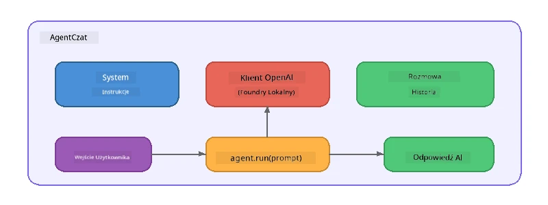

# Część 5: Budowanie agentów AI z pomocą Agent Framework

> **Cel:** Zbuduj swojego pierwszego agenta AI z trwałymi instrukcjami i zdefiniowaną osobowością, zasilanego przez lokalny model za pomocą Foundry Local.

## Czym jest agent AI?

Agent AI otacza model językowy **instrukcjami systemowymi**, które definiują jego zachowanie, osobowość i ograniczenia. W przeciwieństwie do pojedynczego wywołania chat completion, agent zapewnia:

- **Osobowość** - spójną tożsamość („Jesteś pomocnym recenzentem kodu”)
- **Pamięć** - historię rozmowy obejmującą kolejne tury
- **Specjalizację** - ukierunkowane zachowanie napędzane dobrze opracowanymi instrukcjami



---

## Microsoft Agent Framework

**Microsoft Agent Framework** (AGF) dostarcza standardową abstrakcję agenta działającą na różnych zapleczach modelu. W tym warsztacie używamy go z Foundry Local, aby wszystko działało na twoim komputerze – bez potrzeby chmury.

| Pojęcie | Opis |
|---------|-------------|
| `FoundryLocalClient` | Python: obsługuje uruchomienie usługi, pobranie/wczytanie modelu oraz tworzy agentów |
| `client.as_agent()` | Python: tworzy agenta na bazie klienta Foundry Local |
| `AsAIAgent()` | C#: metoda rozszerzająca `ChatClient` – tworzy `AIAgent` |
| `instructions` | Podpowiedź systemowa kształtująca zachowanie agenta |
| `name` | Czytelna nazwa, przydatna w scenariuszach wieloagentowych |
| `agent.run(prompt)` / `RunAsync()` | Wysyła wiadomość od użytkownika i zwraca odpowiedź agenta |

> **Uwaga:** Agent Framework posiada SDK w Pythonie i .NET. Dla JavaScript implementujemy lekką klasę `ChatAgent`, która naśladuje ten sam wzorzec, używając bezpośrednio SDK OpenAI.

---

## Ćwiczenia

### Ćwiczenie 1 - Zrozumienie wzorca agenta

Zanim zaczniesz pisać kod, poznaj kluczowe komponenty agenta:

1. **Klient modelu** – łączy się z kompatybilnym z OpenAI API Foundry Local
2. **Instrukcje systemowe** – podpowiedź definiująca „osobowość”
3. **Pętla uruchomienia** – wysyłaj dane wejściowe od użytkownika, odbieraj wyjście

> **Pomyśl:** Czym instrukcje systemowe różnią się od zwykłej wiadomości użytkownika? Co się stanie, jeśli je zmienisz?

---

### Ćwiczenie 2 - Uruchom przykład pojedynczego agenta

<details>
<summary><strong>🐍 Python</strong></summary>

**Wymagania wstępne:**
```bash
cd python
python -m venv venv

# Windows (PowerShell):
venv\Scripts\Activate.ps1
# macOS:
source venv/bin/activate

pip install -r requirements.txt
```

**Uruchom:**
```bash
python foundry-local-with-agf.py
```

**Omówienie kodu** (`python/foundry-local-with-agf.py`):

```python
import asyncio
from agent_framework_foundry_local import FoundryLocalClient

async def main():
    alias = "phi-4-mini"

    # FoundryLocalClient obsługuje uruchamianie usługi, pobieranie modelu i ładowanie
    client = FoundryLocalClient(model_id=alias)
    print(f"Client Model ID: {client.model_id}")

    # Utwórz agenta z instrukcjami systemowymi
    agent = client.as_agent(
        name="Joker",
        instructions="You are good at telling jokes.",
    )

    # Bez strumieniowania: uzyskaj pełną odpowiedź na raz
    result = await agent.run("Tell me a joke about a pirate.")
    print(f"Agent: {result}")

    # Strumieniowanie: otrzymuj wyniki w miarę ich generowania
    async for chunk in agent.run("Tell me another joke.", stream=True):
        if chunk.text:
            print(chunk.text, end="", flush=True)

asyncio.run(main())
```

**Kluczowe punkty:**
- `FoundryLocalClient(model_id=alias)` obsługuje uruchomienie usługi, pobranie i wczytanie modelu w jednym kroku
- `client.as_agent()` tworzy agenta z instrukcjami systemowymi i nazwą
- `agent.run()` obsługuje tryb bez streamingu i streamingu
- Instalacja przez `pip install agent-framework-foundry-local --pre`

</details>

<details>
<summary><strong>📦 JavaScript</strong></summary>

**Wymagania wstępne:**
```bash
cd javascript
npm install
```

**Uruchom:**
```bash
node foundry-local-with-agent.mjs
```

**Omówienie kodu** (`javascript/foundry-local-with-agent.mjs`):

```javascript
import { OpenAI } from "openai";
import { FoundryLocalManager } from "foundry-local-sdk";

class ChatAgent {
  constructor({ client, modelId, instructions, name }) {
    this.client = client;
    this.modelId = modelId;
    this.instructions = instructions;
    this.name = name;
    this.history = [];
  }

  async run(userMessage) {
    const messages = [
      { role: "system", content: this.instructions },
      ...this.history,
      { role: "user", content: userMessage },
    ];
    const response = await this.client.chat.completions.create({
      model: this.modelId,
      messages,
    });
    const assistantMessage = response.choices[0].message.content;

    // Zachowaj historię konwersacji dla interakcji wieloetapowych
    this.history.push({ role: "user", content: userMessage });
    this.history.push({ role: "assistant", content: assistantMessage });
    return { text: assistantMessage };
  }
}

async function main() {
  FoundryLocalManager.create({ appName: "FoundryLocalWorkshop" });
  const manager = FoundryLocalManager.instance;
  await manager.startWebService();

  const catalog = manager.catalog;
  const model = await catalog.getModel("phi-3.5-mini");
  if (!model.isCached) {
    console.log("Downloading model: phi-3.5-mini...");
    await model.download();
  }
  await model.load();

  const client = new OpenAI({
    baseURL: manager.urls[0] + "/v1",
    apiKey: "foundry-local",
  });

  const agent = new ChatAgent({
    client,
    modelId: model.id,
    instructions: "You are good at telling jokes.",
    name: "Joker",
  });

  const result = await agent.run("Tell me a joke about a pirate.");
  console.log(result.text);
}

main();
```

**Kluczowe punkty:**
- JavaScript implementuje własną klasę `ChatAgent` na wzór wzorca AGF z Pythona
- `this.history` przechowuje tury rozmowy dla wsparcia konwersacji wieloturnowej
- Jawne wywołania `startWebService()` → sprawdzenie cache → `model.download()` → `model.load()` dają pełną kontrolę

</details>

<details>
<summary><strong>💜 C#</strong></summary>

**Wymagania wstępne:**
```bash
cd csharp
dotnet restore
```

**Uruchom:**
```bash
dotnet run agent
```

**Omówienie kodu** (`csharp/SingleAgent.cs`):

```csharp
using Microsoft.AI.Foundry.Local;
using Microsoft.Extensions.Logging.Abstractions;
using Microsoft.Agents.AI;
using OpenAI;
using System.ClientModel;

// 1. Start Foundry Local and load a model
var alias = "phi-3.5-mini";
await FoundryLocalManager.CreateAsync(
    new Configuration
    {
        AppName = "FoundryLocalSamples",
        Web = new Configuration.WebService { Urls = "http://127.0.0.1:0" }
    }, NullLogger.Instance, default);
var manager = FoundryLocalManager.Instance;
await manager.StartWebServiceAsync(default);

var catalog = await manager.GetCatalogAsync(default);
var model = await catalog.GetModelAsync(alias, default);

var isCached = await model.IsCachedAsync(default);
if (!isCached)
{
    Console.WriteLine($"Downloading model: {alias}...");
    await model.DownloadAsync(null, default);
}
await model.LoadAsync(default);

var key = new ApiKeyCredential("foundry-local");
var client = new OpenAIClient(key, new OpenAIClientOptions
{
    Endpoint = new Uri(manager.Urls[0] + "/v1")
});

// 2. Create an AIAgent using the Agent Framework extension method
AIAgent joker = client
    .GetChatClient(model.Id)
    .AsAIAgent(
        instructions: "You are good at telling jokes. Keep your jokes short and family-friendly.",
        name: "Joker"
    );

// 3. Run the agent (non-streaming)
var response = await joker.RunAsync("Tell me a joke about a pirate.");
Console.WriteLine($"Joker: {response}");

// 4. Run with streaming
await foreach (var update in joker.RunStreamingAsync("Tell me another joke."))
{
    Console.Write(update);
}
```

**Kluczowe punkty:**
- `AsAIAgent()` to metoda rozszerzająca z `Microsoft.Agents.AI.OpenAI` – nie jest wymagana własna klasa `ChatAgent`
- `RunAsync()` zwraca pełną odpowiedź; `RunStreamingAsync()` przesyła odpowiedź token po tokenie
- Instalacja przez `dotnet add package Microsoft.Agents.AI.OpenAI --version 1.0.0-rc3`

</details>

---

### Ćwiczenie 3 - Zmień osobowość

Zmodyfikuj `instructions` agenta, by stworzyć inną osobowość. Wypróbuj każdą i zobacz, jak zmienia się wynik:

| Osobowość | Instrukcje |
|---------|-------------|
| Recenzent kodu | `"Jesteś ekspertem recenzującym kod. Dawaj konstruktywną informację zwrotną skupioną na czytelności, wydajności i poprawności."` |
| Przewodnik turystyczny | `"Jesteś przyjaznym przewodnikiem turystycznym. Udzielaj spersonalizowanych rekomendacji dotyczących miejsc, atrakcji i lokalnej kuchni."` |
| Nauczyciel sokratyczny | `"Jesteś socratycznym nauczycielem. Nigdy nie odpowiadaj bezpośrednio – zamiast tego prowadź ucznia przemyślanymi pytaniami."` |
| Piszący techniczny | `"Jesteś autorem technicznym. Wyjaśniaj zagadnienia jasno i zwięźle. Używaj przykładów. Unikaj żargonu."` |

**Spróbuj:**
1. Wybierz osobowość z powyższej tabeli
2. Zamień tekst `instructions` w kodzie
3. Dostosuj podpowiedź użytkownika tak, by pasowała (np. poproś recenzenta kodu o recenzję funkcji)
4. Uruchom przykład jeszcze raz i porównaj odpowiedzi

> **Wskazówka:** Jakość agenta w dużej mierze zależy od instrukcji. Konkretne i dobrze zorganizowane instrukcje dają lepsze rezultaty niż ogólne.

---

### Ćwiczenie 4 - Dodaj rozmowę wieloturnową

Rozszerz przykład o pętlę wieloturnową, aby umożliwić dwustronną rozmowę z agentem.

<details>
<summary><strong>🐍 Python - pętla wieloturnowa</strong></summary>

```python
import asyncio
from agent_framework_foundry_local import FoundryLocalClient

async def main():
    client = FoundryLocalClient(model_id="phi-4-mini")

    agent = client.as_agent(
        name="Assistant",
        instructions="You are a helpful assistant.",
    )

    print("Chat with the agent (type 'quit' to exit):\n")
    while True:
        user_input = input("You: ")
        if user_input.strip().lower() in ("quit", "exit"):
            break
        result = await agent.run(user_input)
        print(f"Agent: {result}\n")

asyncio.run(main())
```

</details>

<details>
<summary><strong>📦 JavaScript - pętla wieloturnowa</strong></summary>

```javascript
import { OpenAI } from "openai";
import { FoundryLocalManager } from "foundry-local-sdk";
import * as readline from "node:readline/promises";

// (ponownie użyj klasy ChatAgent z Ćwiczenia 2)

async function main() {
  FoundryLocalManager.create({ appName: "FoundryLocalWorkshop" });
  const manager = FoundryLocalManager.instance;
  await manager.startWebService();

  const catalog = manager.catalog;
  const model = await catalog.getModel("phi-3.5-mini");
  if (!model.isCached) {
    console.log("Downloading model: phi-3.5-mini...");
    await model.download();
  }
  await model.load();

  const client = new OpenAI({
    baseURL: manager.urls[0] + "/v1",
    apiKey: "foundry-local",
  });

  const agent = new ChatAgent({
    client,
    modelId: model.id,
    instructions: "You are a helpful assistant.",
    name: "Assistant",
  });

  const rl = readline.createInterface({
    input: process.stdin,
    output: process.stdout,
  });

  console.log("Chat with the agent (type 'quit' to exit):\n");
  while (true) {
    const userInput = await rl.question("You: ");
    if (["quit", "exit"].includes(userInput.trim().toLowerCase())) break;
    const result = await agent.run(userInput);
    console.log(`Agent: ${result.text}\n`);
  }
  rl.close();
}

main();
```

</details>

<details>
<summary><strong>💜 C# - pętla wieloturnowa</strong></summary>

```csharp
using Microsoft.AI.Foundry.Local;
using Microsoft.Extensions.Logging.Abstractions;
using Microsoft.Agents.AI;
using OpenAI;
using System.ClientModel;

var alias = "phi-3.5-mini";
var config = new Configuration
{
    AppName = "FoundryLocalSamples",
    Web = new Configuration.WebService { Urls = "http://127.0.0.1:0" }
};
await FoundryLocalManager.CreateAsync(config, NullLogger.Instance, default);
var manager = FoundryLocalManager.Instance;
await manager.StartWebServiceAsync(default);

var catalog = await manager.GetCatalogAsync(default);
var model = await catalog.GetModelAsync(alias, default);

var isCached = await model.IsCachedAsync(default);
if (!isCached)
{
    Console.WriteLine($"Downloading model: {alias}...");
    await model.DownloadAsync(null, default);
}
await model.LoadAsync(default);

var key = new ApiKeyCredential("foundry-local");
var client = new OpenAIClient(key, new OpenAIClientOptions
{
    Endpoint = new Uri(manager.Urls[0] + "/v1")
});

AIAgent agent = client
    .GetChatClient(model.Id)
    .AsAIAgent(
        instructions: "You are a helpful assistant.",
        name: "Assistant"
    );

Console.WriteLine("Chat with the agent (type 'quit' to exit):\n");
while (true)
{
    Console.Write("You: ");
    var userInput = Console.ReadLine();
    if (string.IsNullOrWhiteSpace(userInput) ||
        userInput.Equals("quit", StringComparison.OrdinalIgnoreCase) ||
        userInput.Equals("exit", StringComparison.OrdinalIgnoreCase))
        break;

    var result = await agent.RunAsync(userInput);
    Console.WriteLine($"Agent: {result}\n");
}
```

</details>

Zauważ, jak agent pamięta poprzednie tury – zadaj pytanie uzupełniające i sprawdź, że kontekst się przenosi.

---

### Ćwiczenie 5 - Strukturalne wyjście

Poleć agentowi, aby zawsze odpowiadał w określonym formacie (np. JSON) i sparsuj wynik:

<details>
<summary><strong>🐍 Python - wyjście w JSON</strong></summary>

```python
import asyncio
import json
from agent_framework_foundry_local import FoundryLocalClient

async def main():
    client = FoundryLocalClient(model_id="phi-4-mini")

    agent = client.as_agent(
        name="SentimentAnalyzer",
        instructions=(
            "You are a sentiment analysis agent. "
            "For every user message, respond ONLY with valid JSON in this format: "
            '{"sentiment": "positive|negative|neutral", "confidence": 0.0-1.0, "summary": "brief reason"}'
        ),
    )

    result = await agent.run("I absolutely loved the new restaurant downtown!")
    print("Raw:", result)

    try:
        parsed = json.loads(str(result))
        print(f"Sentiment: {parsed['sentiment']} (confidence: {parsed['confidence']})")
    except json.JSONDecodeError:
        print("Agent did not return valid JSON - try refining the instructions.")

asyncio.run(main())
```

</details>

<details>
<summary><strong>💜 C# - wyjście w JSON</strong></summary>

```csharp
using System.Text.Json;

AIAgent analyzer = chatClient.AsAIAgent(
    name: "SentimentAnalyzer",
    instructions:
        "You are a sentiment analysis agent. " +
        "For every user message, respond ONLY with valid JSON in this format: " +
        "{\"sentiment\": \"positive|negative|neutral\", \"confidence\": 0.0-1.0, \"summary\": \"brief reason\"}"
);

var response = await analyzer.RunAsync("I absolutely loved the new restaurant downtown!");
Console.WriteLine($"Raw: {response}");

try
{
    var parsed = JsonSerializer.Deserialize<JsonElement>(response.ToString());
    Console.WriteLine($"Sentiment: {parsed.GetProperty("sentiment")} " +
                      $"(confidence: {parsed.GetProperty("confidence")})");
}
catch (JsonException)
{
    Console.WriteLine("Agent did not return valid JSON - try refining the instructions.");
}
```

</details>

> **Uwaga:** Małe lokalne modele mogą nie zawsze generować w pełni poprawny JSON. Możesz poprawić niezawodność, dołączając przykład w instrukcjach i bardzo precyzyjnie określając oczekiwany format.

---

## Najważniejsze wnioski

| Pojęcie | Czego się nauczyłeś |
|---------|--------------------|
| Agent vs. zwykłe wywołanie LLM | Agent otacza model instrukcjami i pamięcią |
| Instrukcje systemowe | Najważniejsza dźwignia do kontrolowania zachowania agenta |
| Rozmowa wieloturnowa | Agenci potrafią przenosić kontekst przez wiele interakcji |
| Strukturalne wyjście | Instrukcje mogą wymusić format wyjścia (JSON, markdown itd.) |
| Lokalne wykonanie | Wszystko działa lokalnie przez Foundry Local – bez chmury |

---

## Kolejne kroki

W **[Części 6: Multi-Agent Workflows](part6-multi-agent-workflows.md)** połączysz wielu agentów w skoordynowany pipeline, gdzie każdy agent ma specjalistyczną rolę.