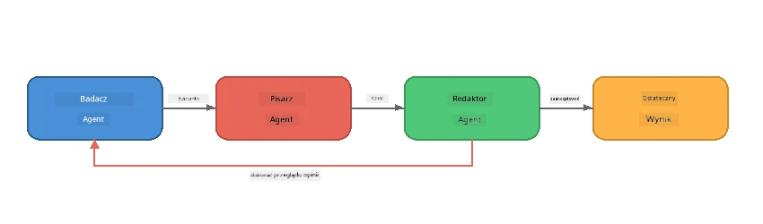
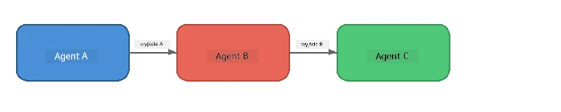
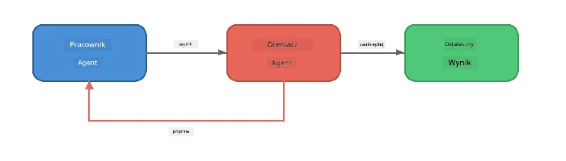
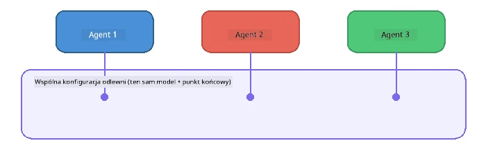

# Część 6: Przepływy pracy wieloagentowej

> **Cel:** Połączyć wielu wyspecjalizowanych agentów w skoordynowane potoki, które dzielą złożone zadania między współpracujące agenty — wszystko działające lokalnie z Foundry Local.

## Dlaczego Multi-Agent?

Pojedynczy agent może obsłużyć wiele zadań, ale złożone przepływy pracy korzystają ze **Specjalizacji**. Zamiast jednego agenta próbującego jednocześnie badać, pisać i edytować, dzielisz pracę na skoncentrowane role:



| Wzorzec | Opis |
|---------|------|
| **Sekwencyjny** | Wynik Agenta A przekazuje się do Agenta B → Agenta C |
| **Pętla sprzężenia zwrotnego** | Agent oceniający może odesłać pracę do poprawy |
| **Wspólny kontekst** | Wszyscy agenci używają tego samego modelu/endpointu, ale różnych instrukcji |
| **Typowany wynik** | Agenci produkują uporządkowane wyniki (JSON) dla niezawodnych przekazań |

---

## Ćwiczenia

### Ćwiczenie 1 - Uruchomienie potoku wieloagentowego

Warsztat zawiera kompletny przepływ Researcher → Writer → Editor.

<details>
<summary><strong>🐍 Python</strong></summary>

**Konfiguracja:**
```bash
cd python
python -m venv venv

# Windows (PowerShell):
venv\Scripts\Activate.ps1
# macOS:
source venv/bin/activate

pip install -r requirements.txt
```

**Uruchom:**
```bash
python foundry-local-multi-agent.py
```

**Co się dzieje:**
1. **Researcher** otrzymuje temat i zwraca kluczowe fakty w punktach
2. **Writer** korzysta z badań, by napisać szkic wpisu na bloga (3-4 akapity)
3. **Editor** przegląda artykuł pod kątem jakości i zwraca AKCEPTUJ lub POPRAW

</details>

<details>
<summary><strong>📦 JavaScript</strong></summary>

**Konfiguracja:**
```bash
cd javascript
npm install
```

**Uruchom:**
```bash
node foundry-local-multi-agent.mjs
```

**Ten sam trzyetapowy potok** - Researcher → Writer → Editor.

</details>

<details>
<summary><strong>💜 C#</strong></summary>

**Konfiguracja:**
```bash
cd csharp
dotnet restore
```

**Uruchom:**
```bash
dotnet run multi
```

**Ten sam trzyetapowy potok** - Researcher → Writer → Editor.

</details>

---

### Ćwiczenie 2 - Anatomia potoku

Przeanalizuj, jak agenci są definiowani i łączeni:

**1. Wspólny klient modelu**

Wszyscy agenci korzystają z tego samego modelu Foundry Local:

```python
# Python - FoundryLocalClient obsługuje wszystko
from agent_framework_foundry_local import FoundryLocalClient

client = FoundryLocalClient(model_id="phi-3.5-mini")
```

```javascript
// JavaScript - OpenAI SDK wskazujący na Foundry Local
const client = new OpenAI({
  baseURL: manager.urls[0] + "/v1",
  apiKey: "foundry-local",
});
```

```csharp
// C# - OpenAIClient pointed at Foundry Local
var key = new ApiKeyCredential("foundry-local");
var client = new OpenAIClient(key, new OpenAIClientOptions
{
    Endpoint = new Uri(manager.Urls[0] + "/v1")
});
var chatClient = client.GetChatClient(model.Id);
```

**2. wyspecjalizowane instrukcje**

Każdy agent ma inną osobowość:

| Agent | Instrukcje (podsumowanie) |
|-------|---------------------------|
| Researcher | "Podaj kluczowe fakty, statystyki i tło. Zorganizuj w punktach." |
| Writer | "Napisz angażujący wpis na bloga (3-4 akapity) na podstawie notatek z badań. Nie wymyślaj faktów." |
| Editor | "Sprawdź jasność, gramatykę i zgodność faktów. Orzeczenie: AKCEPTUJ lub POPRAW." |

**3. Przepływ danych między agentami**

```python
# Krok 1 - wynik od badacza staje się wejściem dla pisarza
research_result = await researcher.run(f"Research: {topic}")

# Krok 2 - wynik od pisarza staje się wejściem dla redaktora
writer_result = await writer.run(f"Write using:\n{research_result}")

# Krok 3 - redaktor przegląda zarówno badanie, jak i artykuł
editor_result = await editor.run(
    f"Research:\n{research_result}\n\nArticle:\n{writer_result}"
)
```

```csharp
// C# - same pattern, async calls with AIAgent
var researchNotes = await researcher.RunAsync(
    $"Research the following topic and provide key facts:\n{topic}");

var draft = await writer.RunAsync(
    $"Write a blog post based on these research notes:\n\n{researchNotes}");

var verdict = await editor.RunAsync(
    $"Review this article for quality and accuracy.\n\n" +
    $"Research notes:\n{researchNotes}\n\n" +
    $"Article:\n{draft}");
```

> **Kluczowa uwaga:** Każdy agent otrzymuje skumulowany kontekst od wcześniejszych agentów. Edytor widzi zarówno oryginalne badania, jak i szkic — pozwala to na sprawdzenie zgodności faktów.

---

### Ćwiczenie 3 - Dodaj czwartego agenta

Rozszerz potok o nowego agenta. Wybierz jeden:

| Agent | Cel | Instrukcje |
|-------|-----|------------|
| **Fact-Checker** | Weryfikacja twierdzeń w artykule | `"Weryfikujesz faktyczne twierdzenia. Dla każdego twierdzenia podaj, czy jest poparte notatkami z badań. Zwróć JSON z elementami zweryfikowanymi/niezweryfikowanymi."` |
| **Headline Writer** | Tworzenie chwytliwych tytułów | `"Wygeneruj 5 propozycji nagłówków dla artykułu. Różnicuj styl: informacyjny, clickbait, pytanie, listicle, emocjonalny."` |
| **Social Media** | Tworzenie postów promocyjnych | `"Stwórz 3 posty promujące ten artykuł: jeden na Twitter (280 znaków), jeden na LinkedIn (ton profesjonalny), jeden na Instagram (luźny z propozycjami emotikon)."` |

<details>
<summary><strong>🐍 Python - dodanie Headline Writer</strong></summary>

```python
headline_agent = client.as_agent(
    name="HeadlineWriter",
    instructions=(
        "You are a headline specialist. Given an article, generate exactly "
        "5 headline options. Vary the style: informative, question-based, "
        "listicle, emotional, and provocative. Return them as a numbered list."
    ),
)

# Po zatwierdzeniu przez redaktora wygeneruj nagłówki
headline_result = await headline_agent.run(
    f"Generate headlines for this article:\n\n{writer_result}"
)
print(f"\n--- Headlines ---\n{headline_result}")
```

</details>

<details>
<summary><strong>📦 JavaScript - dodanie Headline Writer</strong></summary>

```javascript
const headlineAgent = new ChatAgent({
  client,
  modelId: modelInfo.id,
  instructions:
    "You are a headline specialist. Given an article, generate exactly " +
    "5 headline options. Vary the style: informative, question-based, " +
    "listicle, emotional, and provocative. Return them as a numbered list.",
  name: "HeadlineWriter",
});

const headlineResult = await headlineAgent.run(
  `Generate headlines for this article:\n\n${writerResult.text}`
);
console.log(`\n--- Headlines ---\n${headlineResult.text}`);
```

</details>

<details>
<summary><strong>💜 C# - dodanie Headline Writer</strong></summary>

```csharp
AIAgent headlineAgent = chatClient.AsAIAgent(
    name: "HeadlineWriter",
    instructions:
        "You are a headline specialist. Given an article, generate exactly " +
        "5 headline options. Vary the style: informative, question-based, " +
        "listicle, emotional, and provocative. Return them as a numbered list."
);

// After the editor accepts, generate headlines
var headlines = await headlineAgent.RunAsync(
    $"Generate headlines for this article:\n\n{draft}");
Console.WriteLine($"\n--- Headlines ---\n{headlines}");
```

</details>

---

### Ćwiczenie 4 - Zaprojektuj własny przepływ pracy

Zaprojektuj potok wieloagentowy dla innej dziedziny. Oto kilka pomysłów:

| Domena | Agenci | Przepływ |
|--------|--------|----------|
| **Przegląd kodu** | Analyser → Reviewer → Summariser | Analiza struktury kodu → przegląd pod kątem błędów → generowanie raportu podsumowującego |
| **Obsługa klienta** | Classifier → Responder → QA | Klasyfikacja zgłoszenia → przygotowanie odpowiedzi → kontrola jakości |
| **Edukacja** | Quiz Maker → Student Simulator → Grader | Generowanie quizu → symulacja odpowiedzi → ocenianie i wyjaśnianie |
| **Analiza danych** | Interpreter → Analyst → Reporter | Interpretacja zapytania o dane → analiza wzorców → pisanie raportu |

**Kroki:**
1. Zdefiniuj 3+ agentów z unikalnymi `instrukcjami`
2. Zdecyduj o przepływie danych — co każdy agent otrzymuje i produkuje?
3. Zaimplementuj potok używając wzorców z Ćwiczeń 1-3
4. Dodaj pętlę sprzężenia zwrotnego, jeśli któryś agent miałby oceniać pracę innego

---

## Wzorce orkiestracji

Oto wzorce orkiestracji, które stosują się do każdego systemu wieloagentowego (szczegółowo omówione w [Części 7](part7-zava-creative-writer.md)):

### Potok sekwencyjny



Każdy agent przetwarza wynik poprzedniego. Proste i przewidywalne.

### Pętla sprzężenia zwrotnego



Agent oceniający może wywołać ponowne wykonanie wcześniejszych etapów. Zava Writer korzysta z tego: edytor może przekazać uwagi z powrotem do badacza i pisarza.

### Wspólny kontekst



Wszyscy agenci używają pojedynczej `foundry_config`, więc korzystają z tego samego modelu i endpointu.

---

## Kluczowe wnioski

| Pojęcie | Czego się nauczyłeś |
|---------|--------------------|
| Specjalizacja agenta | Każdy agent robi dobrze jedną rzecz dzięki skoncentrowanym instrukcjom |
| Przekazywanie danych | Wynik jednego agenta staje się wejściem dla następnego |
| Pętle sprzężenia zwrotnego | Agent oceniający może wywołać ponowne próby dla lepszej jakości |
| Strukturalny output | Odpowiedzi w formacie JSON umożliwiają niezawodną komunikację między agentami |
| Orkiestracja | Koordynator zarządza sekwencją potoku i obsługą błędów |
| Wzorce produkcyjne | Zastosowane w [Części 7: Zava Creative Writer](part7-zava-creative-writer.md) |

---

## Kolejne kroki

Przejdź do [Części 7: Zava Creative Writer - aplikacja końcowa](part7-zava-creative-writer.md), aby poznać produkcyjną aplikację wieloagentową z 4 wyspecjalizowanymi agentami, strumieniowaniem wyjścia, wyszukiwaniem produktów i pętlami sprzężenia zwrotnego — dostępne w Python, JavaScript i C#.