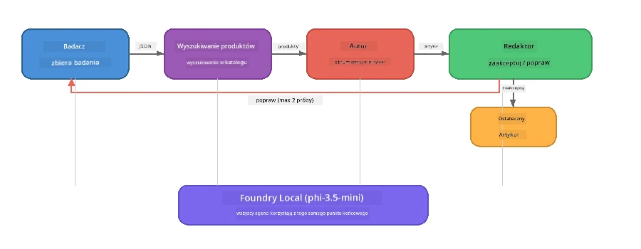

# Część 7: Zava Creative Writer - aplikacja finałowa

> **Cel:** Poznaj aplikację wieloagentową w stylu produkcyjnym, w której czterech wyspecjalizowanych agentów współpracuje, aby tworzyć artykuły o jakości magazynowej dla Zava Retail DIY – całkowicie działającą lokalnie na Twoim urządzeniu z Foundry Local.

To jest **laboratorium finałowe** warsztatu. Łączy wszystko, czego się nauczyłeś — integrację SDK (Część 3), wyszukiwanie w lokalnych danych (Część 4), persony agentów (Część 5) oraz orkiestrację wieloagentową (Część 6) — w kompletną aplikację dostępną w **Pythonie**, **JavaScript** i **C#**.

---

## Co będziesz badać

| Koncepcja | Gdzie w Zava Writer |
|-----------|---------------------|
| Ładowanie modelu w 4 krokach | Wspólny moduł konfiguracyjny uruchamia Foundry Local |
| Wyszukiwanie w stylu RAG | Agent produktów przeszukuje lokalny katalog |
| Specjalizacja agentów | 4 agenty z odrębnymi poleceniami systemowymi |
| Strumieniowe wyjście | Writer generuje tokeny w czasie rzeczywistym |
| Strukturalne przekazywanie | Researcher → JSON, Editor → decyzja w JSON |
| Pętle sprzężenia zwrotnego | Editor może wywołać ponowne wykonanie (max 2 próby) |

---

## Architektura

Zava Creative Writer używa **sekwencyjnej linii potokowej z oceną na podstawie sprzężenia zwrotnego**. Wszystkie trzy implementacje językowe stosują tę samą architekturę:



### Czterej Agenci

| Agent | Wejście | Wyjście | Cel |
|-------|---------|---------|-----|
| **Researcher** | Temat + opcjonalna opinia zwrotna | `{"web": [{url, name, description}, ...]}` | Zbiera badania wstępne za pomocą LLM |
| **Product Search** | Kontekst produktu w formie tekstowej | Lista pasujących produktów | Zapytania generowane przez LLM + wyszukiwanie słów kluczowych w lokalnym katalogu |
| **Writer** | Badania + produkty + zadanie + opinia zwrotna | Strumieniowy tekst artykułu (podzielony na `---`) | Tworzy szkic artykułu o jakości magazynowej w czasie rzeczywistym |
| **Editor** | Artykuł + autoopinia pisarza | `{"decision": "accept/revise", "editorFeedback": "...", "researchFeedback": "..."}` | Ocena jakości, wywołuje ponowne wykonanie w razie potrzeby |

### Przepływ linii potokowej

1. **Researcher** otrzymuje temat i generuje ustrukturyzowane notatki badawcze (JSON)
2. **Product Search** wyszukuje w lokalnym katalogu produktów przy użyciu zapytań wygenerowanych przez LLM
3. **Writer** łączy badania + produkty + zadanie w strumieniowy artykuł, dołączając autoopinię po separatorze `---`
4. **Editor** przegląda artykuł i zwraca werdykt w JSON:
   - `"accept"` → potok kończy działanie
   - `"revise"` → opinia zwrotna trafia z powrotem do Researchera i Writera (max 2 próby)

---

## Wymagania wstępne

- Ukończ [Część 6: Multi-Agent Workflows](part6-multi-agent-workflows.md)
- Zainstaluj Foundry Local CLI i pobierz model `phi-3.5-mini`

---

## Ćwiczenia

### Ćwiczenie 1 - Uruchom Zava Creative Writer

Wybierz swój język i uruchom aplikację:

<details>
<summary><strong>🐍 Python - FastAPI Web Service</strong></summary>

Wersja Pythona działa jako **usługa webowa** z REST API, pokazując jak budować backend produkcyjny.

**Konfiguracja:**
```bash
cd zava-creative-writer-local/src/api
python -m venv venv

# Windows (PowerShell):
venv\Scripts\Activate.ps1
# macOS:
source venv/bin/activate

pip install -r requirements.txt
```

**Uruchom:**
```bash
uvicorn main:app --reload
```

**Testuj:**
```bash
curl -X POST http://localhost:8000/api/article \
  -H "Content-Type: application/json" \
  -d '{
    "research": "DIY home improvement trends",
    "products": "power tools and paints",
    "assignment": "Write an article about weekend renovation projects for DIY enthusiasts"
  }'
```

Odpowiedź jest wysyłana strumieniowo jako komunikaty JSON zakończone nową linią, pokazujące postęp każdego agenta.

</details>

<details>
<summary><strong>📦 JavaScript - Node.js CLI</strong></summary>

Wersja JavaScript działa jako **aplikacja CLI**, wypisując postęp agentów i artykuł bezpośrednio do konsoli.

**Konfiguracja:**
```bash
cd zava-creative-writer-local/src/javascript
npm install
```

**Uruchom:**
```bash
node main.mjs
```

Zobaczysz:
1. Ładowanie modelu Foundry Local (z paskiem postępu jeśli pobierany)
2. Wykonywanie agentów jeden po drugim wraz z komunikatami statusu
3. Artykuł przesyłany w czasie rzeczywistym do konsoli
4. Decyzję edytora: zaakceptuj lub popraw

</details>

<details>
<summary><strong>💜 C# - .NET Console App</strong></summary>

Wersja C# działa jako **aplikacja konsolowa .NET** z tą samą linią potokową i strumieniowym wyjściem.

**Konfiguracja:**
```bash
cd zava-creative-writer-local/src/csharp
dotnet restore
```

**Uruchom:**
```bash
dotnet run
```

Ten sam wzorzec wyjścia co w wersji JavaScript — status agentów, strumieniowany artykuł i werdykt edytora.

</details>

---

### Ćwiczenie 2 - Przeanalizuj strukturę kodu

Każda implementacja językowa ma te same logiczne komponenty. Porównaj ich struktury:

**Python** (`src/api/`):
| Plik | Cel |
|------|-----|
| `foundry_config.py` | Wspólny menedżer Foundry Local, model i klient (inicjalizacja w 4 krokach) |
| `orchestrator.py` | Koordynacja potoku z pętlą sprzężenia zwrotnego |
| `main.py` | Punkty końcowe FastAPI (`POST /api/article`) |
| `agents/researcher/researcher.py` | Badania oparte na LLM z wyjściem JSON |
| `agents/product/product.py` | Zapytania generowane przez LLM + wyszukiwanie słów kluczowych |
| `agents/writer/writer.py` | Generowanie artykułu strumieniowo |
| `agents/editor/editor.py` | Decyzja akceptuj/popraw w JSON |

**JavaScript** (`src/javascript/`):
| Plik | Cel |
|------|-----|
| `foundryConfig.mjs` | Wspólna konfiguracja Foundry Local (4 kroki inicjalizacji z paskiem postępu) |
| `main.mjs` | Orkiestrator + punkt wejścia CLI |
| `researcher.mjs` | Agent badawczy oparty na LLM |
| `product.mjs` | Generowanie zapytań przez LLM + wyszukiwanie słów kluczowych |
| `writer.mjs` | Generowanie artykułu strumieniowo (async generator) |
| `editor.mjs` | Decyzja akceptuj/popraw w JSON |
| `products.mjs` | Dane katalogu produktów |

**C#** (`src/csharp/`):
| Plik | Cel |
|------|-----|
| `Program.cs` | Kompletny potok: ładowanie modelu, agenty, orkiestrator, pętla sprzężenia zwrotnego |
| `ZavaCreativeWriter.csproj` | Projekt .NET 9 z pakietami Foundry Local + OpenAI |

> **Nota projektowa:** Python rozdziela każdego agenta do osobnego pliku/katalogu (dobre dla większych zespołów). JavaScript używa jednego modułu na agenta (dobre dla projektów średnich). C# przechowuje wszystko w jednym pliku z funkcjami lokalnymi (dobre dla przykładów samodzielnych). W produkcji wybierz wzorzec pasujący do konwencji zespołu.

---

### Ćwiczenie 3 - Prześledź wspólną konfigurację

Każdy agent w potoku współdzieli pojedynczego klienta modelu Foundry Local. Zbadaj jak jest to skonfigurowane w każdym języku:

<details>
<summary><strong>🐍 Python - foundry_config.py</strong></summary>

```python
from foundry_local import FoundryLocalManager

MODEL_ALIAS = "phi-3.5-mini"

# Krok 1: Utwórz menedżera i uruchom usługę Foundry Local
manager = FoundryLocalManager()
manager.start_service()

# Krok 2: Sprawdź, czy model jest już pobrany
cached = manager.list_cached_models()
catalog_info = manager.get_model_info(MODEL_ALIAS)
is_cached = any(m.id == catalog_info.id for m in cached) if catalog_info else False

if not is_cached:
    manager.download_model(MODEL_ALIAS)

# Krok 3: Załaduj model do pamięci
manager.load_model(MODEL_ALIAS)
model_id = manager.get_model_info(MODEL_ALIAS).id

# Wspólny klient OpenAI
client = openai.OpenAI(base_url=manager.endpoint, api_key=manager.api_key)
```

Wszyscy agenci importują `from foundry_config import client, model_id`.

</details>

<details>
<summary><strong>📦 JavaScript - foundryConfig.mjs</strong></summary>

```javascript
import { FoundryLocalManager } from "foundry-local-sdk";
import { OpenAI } from "openai";

FoundryLocalManager.create({ appName: "ZavaCreativeWriter" });
const manager = FoundryLocalManager.instance;
await manager.startWebService();

// Sprawdź pamięć podręczną → pobierz → załaduj (nowy wzorzec SDK)
const catalog = manager.catalog;
const model = await catalog.getModel(MODEL_ALIAS);
if (!model.isCached) {
  console.log(`Downloading model: ${MODEL_ALIAS}...`);
  await model.download();
}
await model.load();

const client = new OpenAI({ baseURL: manager.urls[0] + "/v1", apiKey: "foundry-local" });
const modelId = model.id;
export { client, modelId };
```

Wszyscy agenci importują `{ client, modelId } from "./foundryConfig.mjs"`.

</details>

<details>
<summary><strong>💜 C# - góra Program.cs</strong></summary>

```csharp
await FoundryLocalManager.CreateAsync(
    new Configuration
    {
        AppName = "ZavaCreativeWriter",
        Web = new Configuration.WebService { Urls = "http://127.0.0.1:0" }
    }, NullLogger.Instance, default);
var manager = FoundryLocalManager.Instance;
await manager.StartWebServiceAsync(default);

var catalog = await manager.GetCatalogAsync(default);
var catalogModel = await catalog.GetModelAsync(alias, default);
var isCached = await catalogModel.IsCachedAsync(default);
if (!isCached)
    await catalogModel.DownloadAsync(null, default);

await catalogModel.LoadAsync(default);
var key = new ApiKeyCredential("foundry-local");
var chatClient = new OpenAIClient(key, new OpenAIClientOptions
{
    Endpoint = new Uri(manager.Urls[0] + "/v1")
}).GetChatClient(catalogModel.Id);
```

`chatClient` jest następnie przekazywany do wszystkich funkcji agentów w tym samym pliku.

</details>

> **Kluczowy wzorzec:** Wzorzec ładowania modelu (uruchom usługę → sprawdź cache → pobierz → załaduj) zapewnia użytkownikowi czytelny postęp i umożliwia pobranie modelu tylko raz. To jest dobra praktyka dla każdej aplikacji Foundry Local.

---

### Ćwiczenie 4 - Zrozum pętlę sprzężenia zwrotnego

Pętla sprzężenia zwrotnego to to, co czyni ten potok "inteligentnym" - Editor może odesłać pracę do poprawki. Prześledź logikę:

```
Orchestrator:
  1. researcher.research(topic, "No Feedback")    ← first pass
  2. product.findProducts(productContext)
  3. writer.write(research, products, assignment)  ← streams article
  4. Split article at "---" → article + writerFeedback
  5. editor.edit(article, writerFeedback)

  WHILE editor says "revise" AND retryCount < 2:
    6. researcher.research(topic, editor.researchFeedback)  ← refined
    7. writer.write(research, products, editor.editorFeedback)
    8. editor.edit(newArticle, newWriterFeedback)
    9. retryCount++
```

**Pytania do rozważenia:**
- Dlaczego limit prób ustawiono na 2? Co się stanie, gdy go zwiększysz?
- Dlaczego Researcher otrzymuje `researchFeedback`, a Writer `editorFeedback`?
- Co się stanie, jeśli Editor zawsze powie "revise"?

---

### Ćwiczenie 5 - Zmodyfikuj agenta

Spróbuj zmienić zachowanie jednego agenta i zaobserwuj, jak wpływa to na potok:

| Modyfikacja | Co zmienić |
|-------------|------------|
| **Surowszy redaktor** | Zmień systemowy prompt edytora, aby zawsze wymagał co najmniej jednej poprawki |
| **Dłuższe artykuły** | Zmień prompt pisarza z "800-1000 słów" na "1500-2000 słów" |
| **Inne produkty** | Dodaj lub zmodyfikuj produkty w katalogu produktów |
| **Nowy temat badań** | Zmień domyślny `researchContext` na inny temat |
| **Researcher tylko JSON** | Spraw, aby researcher zwracał 10 elementów zamiast 3-5 |

> **Wskazówka:** Ponieważ wszystkie trzy języki implementują tę samą architekturę, możesz zrobić te same zmiany w języku, w którym czujesz się najlepiej.

---

### Ćwiczenie 6 - Dodaj piątego agenta

Rozszerz potok o nowego agenta. Oto kilka pomysłów:

| Agent | Gdzie w potoku | Cel |
|-------|----------------|-----|
| **Fact-Checker** | Po Writerze, przed Editorem | Weryfikacja twierdzeń na podstawie danych badawczych |
| **SEO Optimiser** | Po zaakceptowaniu przez Editora | Dodanie meta opisu, słów kluczowych, slug |
| **Illustrator** | Po zaakceptowaniu przez Editora | Generowanie promptów do obrazów dla artykułu |
| **Translator** | Po zaakceptowaniu przez Editora | Tłumaczenie artykułu na inny język |

**Kroki:**
1. Napisz prompt systemowy agenta
2. Stwórz funkcję agenta (zgodną z istniejącym wzorcem w Twoim języku)
3. Wstaw ją w orkiestrator w odpowiednim miejscu
4. Zaktualizuj wyjście/logowanie, by pokazać wkład nowego agenta

---

## Jak Foundry Local i Agent Framework działają razem

Ta aplikacja pokazuje rekomendowany wzorzec budowy systemów wieloagentowych z Foundry Local:

| Warstwa | Komponent | Rola |
|---------|-----------|------|
| **Runtime** | Foundry Local | Pobiera, zarządza i udostępnia model lokalnie |
| **Client** | OpenAI SDK | Wysyła uzupełnienia czatu do lokalnego endpointu |
| **Agent** | Prompt systemowy + wywołanie czatu | wyspecjalizowane zachowanie przez ukierunkowane instrukcje |
| **Orkiestrator** | Koordynator potoku | Zarządza przepływem danych, sekwencjonowaniem i pętlami sprzężenia zwrotnego |
| **Framework** | Microsoft Agent Framework | Udostępnia abstrakcję `ChatAgent` i wzorce |

Kluczowa insight: **Foundry Local zastępuje backend w chmurze, a nie architekturę aplikacji.** Te same wzorce agentów, strategie orkiestracji i strukturalne przekazywanie, które działają z modelami hostowanymi w chmurze, działają identycznie z modelami lokalnymi — wystarczy skierować klienta na lokalny endpoint zamiast na endpoint Azure.

---

## Kluczowe wnioski

| Koncepcja | Czego się nauczyłeś |
|-----------|---------------------|
| Architektura produkcyjna | Jak zbudować aplikację wieloagentową z wspólną konfiguracją i oddzielnymi agentami |
| Ładowanie modelu w 4 krokach | Dobra praktyka inicjalizacji Foundry Local z widocznym dla użytkownika postępem |
| Specjalizacja agentów | Każdy z 4 agentów ma ukierunkowane instrukcje i specyficzny format wyjścia |
| Generowanie strumieniowe | Writer zwraca tokeny na bieżąco, co pozwala na responsywne UI |
| Pętle sprzężenia zwrotnego | Retry sterowany przez Editor poprawia jakość bez ingerencji człowieka |
| Wzorce wielojęzykowe | Ta sama architektura działa w Pythonie, JavaScript i C# |
| Lokalnie = gotowe do produkcji | Foundry Local udostępnia tę samą zgodną z OpenAI API, co chmurowe wdrożenia |

---

## Następny krok

Przejdź do [Część 8: Development kierowane ewaluacją](part8-evaluation-led-development.md), aby stworzyć systematyczne ramy oceny swoich agentów, korzystając ze złotych zbiorów danych, kontroli reguł i oceniania sędziowskiego przez LLM.