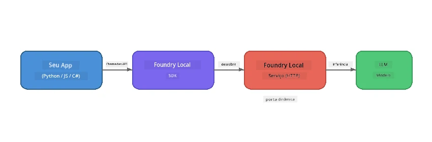

# Parte 1: Começando com o Foundry Local


## O que é o Foundry Local?

[Foundry Local](https://foundrylocal.ai) permite que você execute modelos de linguagem de IA de código aberto **diretamente no seu computador** - sem internet necessária, sem custos na nuvem e com total privacidade dos dados. Ele:

- **Baixa e executa modelos localmente** com otimização automática de hardware (GPU, CPU ou NPU)
- **Fornece uma API compatível com OpenAI** para que você possa usar SDKs e ferramentas familiares
- **Não requer assinatura do Azure** ou cadastro - basta instalar e começar a construir

Pense nisso como ter sua própria IA privada que roda inteiramente na sua máquina.

## Objetivos de Aprendizagem

Ao final deste laboratório você será capaz de:

- Instalar o Foundry Local CLI no seu sistema operacional
- Entender o que são aliases de modelo e como eles funcionam
- Baixar e executar seu primeiro modelo de IA localmente
- Enviar uma mensagem de chat para um modelo local via linha de comando
- Entender a diferença entre modelos de IA locais e hospedados na nuvem

---

## Pré-requisitos

### Requisitos do Sistema

| Requisito | Mínimo | Recomendado |
|-------------|---------|-------------|
| **RAM** | 8 GB | 16 GB |
| **Espaço em Disco** | 5 GB (para modelos) | 10 GB |
| **CPU** | 4 núcleos | 8+ núcleos |
| **GPU** | Opcional | NVIDIA com CUDA 11.8+ |
| **SO** | Windows 10/11 (x64/ARM), Windows Server 2025, macOS 13+ | - |

> **Nota:** O Foundry Local seleciona automaticamente a melhor variante do modelo para seu hardware. Se você tem uma GPU NVIDIA, ele usa aceleração CUDA. Se você tem um NPU Qualcomm, ele usa isso. Caso contrário, utiliza uma variante otimizada para CPU.

### Instalar o Foundry Local CLI

**Windows** (PowerShell):  
```powershell
winget install Microsoft.FoundryLocal
```
  
**macOS** (Homebrew):  
```bash
brew tap microsoft/foundrylocal
brew install foundrylocal
```
  
> **Nota:** O Foundry Local atualmente suporta apenas Windows e macOS. Linux não é suportado no momento.

Verifique a instalação:  
```bash
foundry --version
```
  
---

## Exercícios do Laboratório

### Exercício 1: Explore os Modelos Disponíveis

O Foundry Local inclui um catálogo de modelos open-source pré-otimizados. Liste-os:

```bash
foundry model list
```
  
Você verá modelos como:  
- `phi-3.5-mini` - Modelo de 3,8 bilhões de parâmetros da Microsoft (rápido, boa qualidade)  
- `phi-4-mini` - Modelo Phi mais recente e mais capaz  
- `phi-4-mini-reasoning` - Modelo Phi com raciocínio encadeado (`<think>` tags)  
- `phi-4` - Maior modelo Phi da Microsoft (10,4 GB)  
- `qwen2.5-0.5b` - Muito pequeno e rápido (bom para dispositivos com poucos recursos)  
- `qwen2.5-7b` - Modelo versátil e forte com suporte a chamada de ferramentas  
- `qwen2.5-coder-7b` - Otimizado para geração de código  
- `deepseek-r1-7b` - Modelo forte em raciocínio  
- `gpt-oss-20b` - Modelo open-source grande (licença MIT, 12,5 GB)  
- `whisper-base` - Transcrição de fala para texto (383 MB)  
- `whisper-large-v3-turbo` - Transcrição de alta precisão (9 GB)

> **O que é um alias de modelo?** Aliases como `phi-3.5-mini` são atalhos. Ao usar um alias, o Foundry Local baixa automaticamente a melhor variante para seu hardware específico (CUDA para GPUs NVIDIA, variante otimizada para CPU caso contrário). Você nunca precisa se preocupar em escolher a variante certa.

### Exercício 2: Execute Seu Primeiro Modelo

Baixe e comece a conversar com um modelo interativamente:

```bash
foundry model run phi-3.5-mini
```
  
Na primeira vez que você executar isto, o Foundry Local irá:  
1. Detectar seu hardware  
2. Baixar a variante ideal do modelo (isto pode levar alguns minutos)  
3. Carregar o modelo na memória  
4. Iniciar uma sessão de chat interativa

Tente fazer algumas perguntas:  
```
You: What is the golden ratio?
You: Can you explain it as if I were 10 years old?
You: Write a haiku about mathematics
```
  
Digite `exit` ou pressione `Ctrl+C` para sair.

### Exercício 3: Pré-baixe um Modelo

Se quiser baixar um modelo sem iniciar um chat:

```bash
foundry model download phi-3.5-mini
```
  
Verifique quais modelos já estão baixados na sua máquina:

```bash
foundry cache list
```
  
### Exercício 4: Entenda a Arquitetura

O Foundry Local roda como um **serviço HTTP local** que expõe uma API REST compatível com OpenAI. Isso significa:

1. O serviço inicia em uma **porta dinâmica** (diferente a cada vez)  
2. Você usa o SDK para descobrir a URL real do endpoint  
3. Você pode usar **qualquer** biblioteca cliente compatível com OpenAI para se comunicar



> **Importante:** O Foundry Local atribui uma **porta dinâmica** a cada vez que inicia. Nunca codifique uma porta fixa como `localhost:5272`. Sempre use o SDK para descobrir a URL atual (por exemplo, `manager.endpoint` em Python ou `manager.urls[0]` em JavaScript).

---

## Principais Lições

| Conceito | O Que Você Aprendeu |
|---------|------------------|
| IA local | O Foundry Local executa modelos inteiramente no seu dispositivo sem nuvem, sem chaves de API e sem custos |
| Aliases de modelo | Aliases como `phi-3.5-mini` selecionam automaticamente a melhor variante para seu hardware |
| Portas dinâmicas | O serviço roda em uma porta dinâmica; sempre use o SDK para descobrir o endpoint |
| CLI e SDK | Você pode interagir com os modelos via CLI (`foundry model run`) ou programaticamente via SDK |

---

## Próximos Passos

Continue para [Parte 2: Mergulho Profundo no SDK do Foundry Local](part2-foundry-local-sdk.md) para dominar a API do SDK para gerenciar modelos, serviços e cache programaticamente.

---

<!-- CO-OP TRANSLATOR DISCLAIMER START -->
**Aviso Legal**:  
Este documento foi traduzido usando o serviço de tradução por IA [Co-op Translator](https://github.com/Azure/co-op-translator). Embora nos esforcemos para garantir a precisão, esteja ciente de que traduções automatizadas podem conter erros ou imprecisões. O documento original em seu idioma nativo deve ser considerado a fonte autoritativa. Para informações críticas, recomenda-se tradução profissional humana. Não nos responsabilizamos por quaisquer mal-entendidos ou interpretações incorretas decorrentes do uso desta tradução.
<!-- CO-OP TRANSLATOR DISCLAIMER END -->