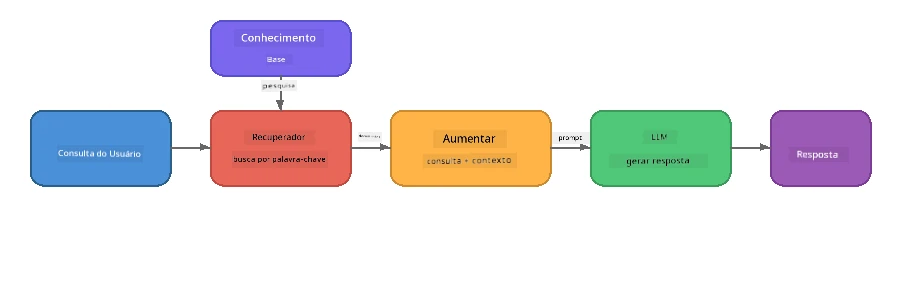

# Parte 4: Construindo uma Aplicação RAG com Foundry Local

## Visão Geral

Modelos de Linguagem Grande são poderosos, mas só sabem o que estava nos seus dados de treino. **Geração Aumentada por Recuperação (RAG)** resolve isso dando ao modelo o contexto relevante no momento da consulta - extraído dos seus próprios documentos, bases de dados ou bases de conhecimento.

Neste laboratório, você vai construir um pipeline RAG completo que roda **inteiramente no seu dispositivo** usando Foundry Local. Sem serviços na nuvem, sem bancos vetoriais, sem API de embeddings - apenas recuperação local e um modelo local.

## Objetivos de Aprendizagem

Ao final deste laboratório você será capaz de:

- Explicar o que é RAG e por que é importante para aplicações de IA
- Construir uma base de conhecimento local a partir de documentos de texto
- Implementar uma função simples de recuperação para encontrar contexto relevante
- Compor uma prompt de sistema que funda o modelo em fatos recuperados
- Executar o pipeline completo Recuperar → Aumentar → Gerar no dispositivo
- Entender os trade-offs entre recuperação por palavras-chave simples e busca vetorial

---

## Pré-requisitos

- Completar [Parte 3: Usando o Foundry Local SDK com OpenAI](part3-sdk-and-apis.md)
- Foundry Local CLI instalado e modelo `phi-3.5-mini` baixado

---

## Conceito: O que é RAG?

Sem RAG, um LLM só pode responder com base em seus dados de treino — que podem estar desatualizados, incompletos ou não conter suas informações privadas:

```
User: "What is Zava's return policy?"
LLM:  "I do not have information about Zava's return policy."  ← No context!
```

Com RAG, você **recupera** documentos relevantes primeiro, depois **aumenta** a prompt com esse contexto antes de **gerar** uma resposta:



A visão chave: **o modelo não precisa "saber" a resposta; ele só precisa ler os documentos certos.**

---

## Exercícios do Laboratório

### Exercício 1: Entender a Base de Conhecimento

Abra o exemplo RAG para sua linguagem e examine a base de conhecimento:

<details>
<summary><b>🐍 Python: <code>python/foundry-local-rag.py</code></b></summary>

A base de conhecimento é uma lista simples de dicionários com campos `title` e `content`:

```python
KNOWLEDGE_BASE = [
    {
        "title": "Foundry Local Overview",
        "content": (
            "Foundry Local brings the power of Azure AI Foundry to your local "
            "device without requiring an Azure subscription..."
        ),
    },
    {
        "title": "Supported Hardware",
        "content": (
            "Foundry Local automatically selects the best model variant for "
            "your hardware. If you have an Nvidia CUDA GPU it downloads the "
            "CUDA-optimized model..."
        ),
    },
    # ... mais entradas
]
```

Cada entrada representa um "pedaço" de conhecimento — uma informação focada sobre um único tópico.

</details>

<details>
<summary><b>📘 JavaScript: <code>javascript/foundry-local-rag.mjs</code></b></summary>

A base de conhecimento usa a mesma estrutura como um array de objetos:

```javascript
const KNOWLEDGE_BASE = [
  {
    title: "Foundry Local Overview",
    content:
      "Foundry Local brings the power of Azure AI Foundry to your local " +
      "device without requiring an Azure subscription...",
  },
  {
    title: "Supported Hardware",
    content:
      "Foundry Local automatically selects the best model variant for " +
      "your hardware...",
  },
  // ... mais entradas
];
```

</details>

<details>
<summary><b>💜 C#: <code>csharp/RagPipeline.cs</code></b></summary>

A base de conhecimento usa uma lista de tuplas nomeadas:

```csharp
private static readonly List<(string Title, string Content)> KnowledgeBase =
[
    ("Foundry Local Overview",
     "Foundry Local brings the power of Azure AI Foundry to your local " +
     "device without requiring an Azure subscription..."),

    ("Supported Hardware",
     "Foundry Local automatically selects the best model variant for " +
     "your hardware..."),

    // ... more entries
];
```

</details>

> **Em uma aplicação real**, a base de conhecimento viria de arquivos em disco, um banco de dados, um índice de busca ou uma API. Para este laboratório, usamos uma lista em memória para manter as coisas simples.

---

### Exercício 2: Entender a Função de Recuperação

A etapa de recuperação encontra os pedaços mais relevantes para a pergunta do usuário. Este exemplo usa **sobreposição de palavras-chave** — contando quantas palavras da consulta aparecem em cada pedaço:

<details>
<summary><b>🐍 Python</b></summary>

```python
def retrieve(query: str, top_k: int = 2) -> list[dict]:
    """Return the top-k knowledge chunks most relevant to the query."""
    query_words = set(query.lower().split())
    scored = []
    for chunk in KNOWLEDGE_BASE:
        chunk_words = set(chunk["content"].lower().split())
        overlap = len(query_words & chunk_words)
        scored.append((overlap, chunk))
    scored.sort(key=lambda x: x[0], reverse=True)
    return [item[1] for item in scored[:top_k]]
```

</details>

<details>
<summary><b>📘 JavaScript</b></summary>

```javascript
function retrieve(query, topK = 2) {
  const queryWords = new Set(query.toLowerCase().split(/\s+/));
  const scored = KNOWLEDGE_BASE.map((chunk) => {
    const chunkWords = new Set(chunk.content.toLowerCase().split(/\s+/));
    let overlap = 0;
    for (const w of queryWords) {
      if (chunkWords.has(w)) overlap++;
    }
    return { overlap, chunk };
  });
  scored.sort((a, b) => b.overlap - a.overlap);
  return scored.slice(0, topK).map((s) => s.chunk);
}
```

</details>

<details>
<summary><b>💜 C#</b></summary>

```csharp
private static List<(string Title, string Content)> Retrieve(string query, int topK = 2)
{
    var queryWords = new HashSet<string>(
        query.ToLowerInvariant().Split(' ', StringSplitOptions.RemoveEmptyEntries));

    return KnowledgeBase
        .Select(chunk =>
        {
            var chunkWords = new HashSet<string>(
                chunk.Content.ToLowerInvariant().Split(' ', StringSplitOptions.RemoveEmptyEntries));
            var overlap = queryWords.Intersect(chunkWords).Count();
            return (Overlap: overlap, Chunk: chunk);
        })
        .OrderByDescending(x => x.Overlap)
        .Take(topK)
        .Select(x => x.Chunk)
        .ToList();
}
```

</details>

**Como funciona:**
1. Divide a consulta em palavras individuais
2. Para cada pedaço da base de conhecimento, conta quantas palavras da consulta aparecem nele
3. Ordena pelo score de sobreposição (maior primeiro)
4. Retorna os top-k pedaços mais relevantes

> **Trade-off:** Sobreposição por palavra-chave é simples, mas limitada; não entende sinônimos ou significado. Sistemas RAG de produção tipicamente usam **vetores de embedding** e um **banco vetorial** para busca semântica. No entanto, sobreposição por palavra-chave é um ótimo ponto de partida e não requer dependências extras.

---

### Exercício 3: Entender a Prompt Aumentada

O contexto recuperado é injetado na **prompt do sistema** antes de enviar ao modelo:

```python
system_prompt = (
    "You are a helpful assistant. Answer the user's question using ONLY "
    "the information provided in the context below. If the context does "
    "not contain enough information, say so.\n\n"
    f"Context:\n{context_text}"
)
```

Decisões importantes de design:
- **"SOMENTE a informação fornecida"** - impede que o modelo alucine fatos que não estão no contexto
- **"Se o contexto não contiver informação suficiente, diga isso"** - incentiva respostas honestas do tipo "não sei"
- O contexto é colocado na mensagem do sistema para moldar todas as respostas

---

### Exercício 4: Executar o Pipeline RAG

Execute o exemplo completo:

**Python:**
```bash
cd python
python foundry-local-rag.py
```

**JavaScript:**
```bash
cd javascript
node foundry-local-rag.mjs
```

**C#:**
```bash
cd csharp
dotnet run rag
```

Você deve ver três coisas impressas:
1. **A pergunta** feita
2. **O contexto recuperado** — os pedaços selecionados da base de conhecimento
3. **A resposta** — gerada pelo modelo usando apenas aquele contexto

Exemplo de saída:
```
Question: How do I install Foundry Local and what hardware does it support?

--- Retrieved Context ---
### Installation
On Windows install Foundry Local with: winget install Microsoft.FoundryLocal...

### Supported Hardware
Foundry Local automatically selects the best model variant for your hardware...
-------------------------

Answer: To install Foundry Local, you can use the following methods depending
on your operating system: On Windows, run `winget install Microsoft.FoundryLocal`.
On macOS, use `brew install microsoft/foundrylocal/foundrylocal`...
```

Note como a resposta do modelo está **fundamentada** no contexto recuperado — ele só menciona fatos dos documentos da base de conhecimento.

---

### Exercício 5: Experimente e Estenda

Tente essas modificações para aprofundar seu entendimento:

1. **Mude a pergunta** — pergunte algo que ESTÁ na base de conhecimento versus algo que NÃO ESTÁ:
   ```python
   question = "What programming languages does Foundry Local support?"  # ← No contexto
   question = "How much does Foundry Local cost?"                       # ← Fora de contexto
   ```
   O modelo responde corretamente "Não sei" quando a resposta não está no contexto?

2. **Adicione um novo pedaço de conhecimento** — acrescente uma nova entrada em `KNOWLEDGE_BASE`:
   ```python
   {
       "title": "Pricing",
       "content": "Foundry Local is completely free and open source under the MIT license.",
   }
   ```
   Agora pergunte novamente sobre preços.

3. **Mude `top_k`** — recupere mais ou menos pedaços:
   ```python
   context_chunks = retrieve(question, top_k=3)  # Mais contexto
   context_chunks = retrieve(question, top_k=1)  # Menos contexto
   ```
   Como a quantidade de contexto afeta a qualidade da resposta?

4. **Remova a instrução de fundação** — mude a prompt do sistema para apenas "Você é um assistente prestativo." e veja se o modelo começa a alucinar fatos.

---

## Mergulho Profundo: Otimizando RAG para Performance On-Device

Executar RAG no dispositivo impõe restrições que você não enfrenta na nuvem: RAM limitada, sem GPU dedicada (execução CPU/NPU), e uma janela de contexto pequena no modelo. As decisões de design abaixo tratam dessas restrições e são baseadas em padrões de aplicações RAG locais estilo produção construídas com Foundry Local.

### Estratégia de Divisão em Pedaços: Janela Deslizante de Tamanho Fixo

Dividir documentos em pedaços é uma das decisões mais impactantes em qualquer sistema RAG. Para cenários on-device, uma **janela deslizante de tamanho fixo com sobreposição** é o ponto de partida recomendado:

| Parâmetro | Valor Recomendado | Por quê |
|-----------|-------------------|---------|
| **Tamanho do pedaço** | ~200 tokens | Mantém o contexto recuperado compacto, deixando espaço na janela de contexto do Phi-3.5 Mini para a prompt do sistema, histórico da conversa e saída gerada |
| **Sobreposição** | ~25 tokens (12,5%) | Previne perda de informação nas bordas dos pedaços — importante para procedimentos e instruções passo-a-passo |
| **Tokenização** | Divisão por espaço em branco | Zero dependências, não precisa de biblioteca de tokenização. Todo o orçamento computacional vai para o LLM |

A sobreposição funciona como uma janela deslizante: cada novo pedaço começa 25 tokens antes do anterior terminar, então sentenças que atravessam bordas aparecem em ambos pedaços.

> **Por que não outras estratégias?**
> - **Divisão por sentença** gera tamanhos imprevisíveis dos pedaços; alguns procedimentos de segurança são sentenças longas únicas que não dividiriam bem
> - **Divisão por seção** (em cabeçalhos `##`) cria pedaços com tamanhos muito diversos — alguns muito pequenos, outros muito grandes para a janela de contexto do modelo
> - **Divisão semântica** (detecção de tópicos por embedding) dá a melhor qualidade de recuperação, mas requer um segundo modelo em memória junto com Phi-3.5 Mini — arriscado em hardware com 8-16 GB de memória compartilhada

### Evoluindo a Recuperação: Vetores TF-IDF

A abordagem de sobreposição por palavra-chave neste laboratório funciona, mas se quiser melhor recuperação sem adicionar modelo de embedding, **TF-IDF (Frequência de Termo-Frequência Inversa de Documento)** é um excelente meio-termo:

```
Keyword Overlap  →  TF-IDF Vectors  →  Embedding Models
    (this lab)     (lightweight upgrade)   (production)
  Simple & fast    Better ranking,         Best quality,
  No dependencies  still no ML model       requires embedding model
  ~Basic matching  ~1ms retrieval          ~100-500ms per query
```

TF-IDF converte cada pedaço em um vetor numérico baseado em quão importante cada palavra é dentro daquele pedaço *relativo a todos os pedaços*. No tempo de consulta, a pergunta é vetorizada da mesma forma e comparada usando similaridade cosseno. Você pode implementar isso com SQLite e JavaScript/Python puro — sem banco vetorial, sem API de embedding.

> **Performance:** A similaridade cosseno TF-IDF sobre pedaços de tamanho fixo normalmente alcança **~1ms de recuperação**, comparado a ~100-500ms quando um modelo de embedding codifica cada consulta. Todos os 20+ documentos podem ser particionados e indexados em menos de um segundo.

### Modo Edge/Compacto para Dispositivos Constrangidos

Quando roda em hardware muito limitado (notebooks antigos, tablets, dispositivos de campo), você pode reduzir o uso de recursos ajustando três parâmetros:

| Configuração | Modo Padrão | Modo Edge/Compacto |
|--------------|-------------|--------------------|
| **Prompt do sistema** | ~300 tokens | ~80 tokens |
| **Máximo de tokens de saída** | 1024 | 512 |
| **Pedaços recuperados (top-k)** | 5 | 3 |

Menos pedaços recuperados significa menos contexto para o modelo processar, reduzindo latência e pressão de memória. Um prompt do sistema mais curto libera mais janela de contexto para a resposta em si. Este trade-off vale a pena em dispositivos onde cada token da janela de contexto conta.

### Um Modelo Somente em Memória

Um dos princípios mais importantes para RAG on-device: **mantenha apenas um modelo carregado**. Se você usa um modelo de embedding para recuperação *e* um modelo de linguagem para geração, está dividindo recursos limitados de NPU/RAM entre dois modelos. Recuperação leve (sobreposição, TF-IDF) evita isso totalmente:

- Sem modelo de embedding competindo por memória com o LLM
- Inicialização mais rápida — só um modelo para carregar
- Uso previsível de memória — o LLM recebe todos os recursos disponíveis
- Funciona em máquinas com apenas 8 GB de RAM

### SQLite como Armazenamento Vetorial Local

Para coleções de documentos pequenas a médias (centenas a poucos milhares de pedaços), **SQLite é rápido o bastante** para busca por similaridade cosseno por força bruta e não adiciona infraestrutura:

- Único arquivo `.db` no disco — sem processo servidor, sem configuração
- Vem com todas as principais linguagens de programação (Python `sqlite3`, Node.js `better-sqlite3`, .NET `Microsoft.Data.Sqlite`)
- Armazena pedaços de documentos junto com seus vetores TF-IDF em uma tabela
- Não precisa de Pinecone, Qdrant, Chroma ou FAISS nesta escala

### Resumo de Performance

Essas escolhas de design combinadas entregam um RAG responsivo em hardware consumidor:

| Métrica | Performance On-Device |
|---------|----------------------|
| **Latência de recuperação** | ~1ms (TF-IDF) a ~5ms (sobreposição por palavra-chave) |
| **Velocidade de ingestão** | 20 documentos particionados e indexados em < 1 segundo |
| **Modelos em memória** | 1 (só LLM - sem modelo de embedding) |
| **Sobrecarga de armazenamento** | < 1 MB para pedaços + vetores no SQLite |
| **Inicialização a frio** | Um único carregamento de modelo, sem runtime de embedding |
| **Requisitos de hardware** | 8 GB RAM, só CPU (sem GPU necessária) |

> **Quando atualizar:** Se você escalar para centenas de documentos longos, conteúdo misto (tabelas, código, prosa), ou precisar de compreensão semântica das consultas, considere adicionar um modelo de embedding e mudar para busca por similaridade vetorial. Para a maioria dos casos on-device com conjuntos focados de documentos, TF-IDF + SQLite entrega excelentes resultados com uso mínimo de recursos.

---

## Conceitos Chave

| Conceito | Descrição |
|----------|-----------|
| **Recuperação** | Encontrar documentos relevantes numa base de conhecimento com base na consulta do usuário |
| **Aumento** | Inserir documentos recuperados na prompt como contexto |
| **Geração** | O LLM produz uma resposta fundamentada no contexto fornecido |
| **Divisão em pedaços** | Quebrar documentos grandes em partes menores e focadas |
| **Fundamentação** | Constranger o modelo a usar apenas o contexto fornecido (reduz alucinações) |
| **Top-k** | Quantidade dos pedaços mais relevantes a serem recuperados |

---

## RAG em Produção vs. Este Laboratório

| Aspecto | Este Laboratório | Otimizado para On-Device | Produção na Nuvem |
|---------|-----------------|-------------------------|-------------------|
| **Base de conhecimento** | Lista em memória | Arquivos em disco, SQLite | Banco de dados, índice de busca |
| **Recuperação** | Sobreposição por palavra-chave | TF-IDF + similaridade cosseno | Embeddings vetoriais + busca por similaridade |
| **Embeddings** | Nenhum necessário | Nenhum - vetores TF-IDF | Modelo de embedding (local ou nuvem) |
| **Armazenamento vetorial** | Nenhum necessário | SQLite (único arquivo `.db`) | FAISS, Chroma, Azure AI Search, etc. |
| **Divisão em pedaços** | Manual | Janela deslizante de tamanho fixo (~200 tokens, 25 tokens de sobreposição) | Divisão semântica ou recursiva |
| **Modelos em memória** | 1 (LLM) | 1 (LLM) | 2+ (embedding + LLM) |
| **Latência de recuperação** | ~5ms | ~1ms | ~100-500ms |
| **Escala** | 5 documentos | Centenas de documentos | Milhões de documentos |

Os padrões que você aprende aqui (recuperar, aumentar, gerar) são os mesmos em qualquer escala. O método de recuperação melhora, mas a arquitetura geral permanece idêntica. A coluna do meio mostra o que é possível executar localmente com técnicas leves, muitas vezes o ponto ideal para aplicações locais onde você troca escala na nuvem por privacidade, capacidade offline e latência zero para serviços externos.

---

## Principais Conclusões

| Conceito | O que você aprendeu |
|---------|------------------|
| Padrão RAG | Recuperar + Aumentar + Gerar: dê ao modelo o contexto certo e ele pode responder perguntas sobre seus dados |
| On-device | Tudo roda localmente sem APIs de nuvem ou assinaturas de banco de dados vetoriais |
| Instruções de fundamentação | Restrições do prompt do sistema são críticas para evitar alucinações |
| Sobreposição de palavras-chave | Um ponto inicial simples, mas eficaz para recuperação |
| TF-IDF + SQLite | Um caminho de upgrade leve que mantém a recuperação abaixo de 1ms sem modelo de embedding |
| Um modelo em memória | Evite carregar um modelo de embedding junto ao LLM em hardware com recursos limitados |
| Tamanho do chunk | Cerca de 200 tokens com sobreposição balanceia precisão de recuperação e eficiência da janela de contexto |
| Modo Edge/compacto | Use menos chunks e prompts mais curtos para dispositivos muito limitados |
| Padrão universal | A mesma arquitetura RAG funciona para qualquer fonte de dados: documentos, bancos de dados, APIs ou wikis |

> **Quer ver uma aplicação RAG completa rodando localmente?** Confira [Gas Field Local RAG](https://github.com/leestott/local-rag), um agente RAG offline estilo produção construído com Foundry Local e Phi-3.5 Mini que demonstra esses padrões de otimização com um conjunto de documentos do mundo real.

---

## Próximos passos

Continue para [Parte 5: Construindo Agentes de IA](part5-single-agents.md) para aprender como criar agentes inteligentes com personas, instruções e conversas de múltiplas interações usando o Microsoft Agent Framework.

---

<!-- CO-OP TRANSLATOR DISCLAIMER START -->
**Aviso Legal**:  
Este documento foi traduzido utilizando o serviço de tradução por IA [Co-op Translator](https://github.com/Azure/co-op-translator). Embora nos esforcemos para garantir a precisão, esteja ciente de que traduções automáticas podem conter erros ou imprecisões. O documento original em sua língua nativa deve ser considerado a fonte autorizada. Para informações críticas, recomenda-se tradução profissional humana. Não nos responsabilizamos por quaisquer mal-entendidos ou interpretações incorretas decorrentes do uso desta tradução.
<!-- CO-OP TRANSLATOR DISCLAIMER END -->